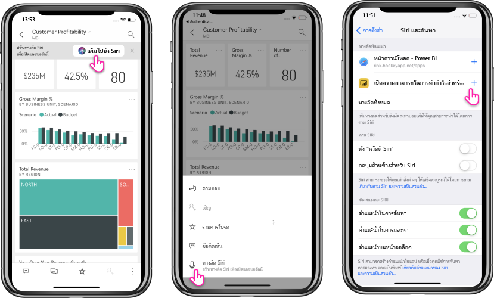

# การใช้ปุ่มลัด Siri ในแอป Power BI บนมือถือสำหรับ iOSUsing Siri Shortcuts in Power BI Mobile iOS App

ใช้ปุ่มลัด Siri เพื่อเข้าถึงเนื้อหา Power BI ที่คุณต้องการโดยตรงUse Siri Shortcuts to directly access the Power BI content you need.

เพื่อให้สามารถเข้าถึงรายงานหรือแดชบอร์ดที่ใช้บ่อยๆ ได้อย่างง่ายดายและรวดเร็ว คุณสามารถสร้างทางลัด Siri สำหรับการเข้าถึงเนื้อหา Power BI โดยตรงที่คุณต้องการได้To get easy and quick access to your frequently used reports or dashboards, you can create a Siri Shortcut for direct access to the Power BI content you need. ด้วยทางลัด Siri คุณเพียงแค่จำเป็นต้องขอให้ Siri เปิดเมื่อใดก็ตามที่คุณต้องการดูข้อมูลWith a Siri Shortcut, you just need to ask Siri to open it whenever you need look at the data.

> [!NOTE]
> การรวมทางลัด Siri กับแอป Power BI จะพร้อมใช้งานสำหรับ iPhone และ iPad ที่ทำงานบน iOS12 ขึ้นไปThe Siri Shortcuts integration with the Power BI mobile app is available for iPhones and iPads running iOS12 and later.

## สร้างปุ่มลัด Siri สำหรับรายงานหรือแดชบอร์ดCreate Siri shortcut for a report or dashboard

มีสามวิธีในการสร้างปุ่มลัด Siri ไปยังรายงานและแดชบอร์ดของคุณ:There are three ways to create Siri shortcuts to your reports and dashboards:

- จะมีการเพิ่มแบนเนอร์พร้อมตัวเลือก **เพิ่มไปยัง Siri** ไปยังรายงานและแดชบอร์ดที่ใช้งานบ่อยของคุณA banner with an **Add to Siri** option will be added to your frequently used reports and dashboards. แตะที่แอคชันเพื่อเปิดหน้า **เพิ่มไปยัง Siri**Tap the action to open the **Add to Siri** page.
    
- ใช้แอคชัน **ปุ่มลัด Siri** บน **รายงาน** หรือเมนูแอคชัน **แดชบอร์ด**(...)Use the **Siri shortcut** action on the **Report** or **Dashboard** actions menu (...).
    
- ใช้ **ปุ่มลัดที่แนะนำ** ในการตั้งค่าอุปกรณ์ (**การตั้งค่าอุปกรณ์** > **Siri และค้นหา**)Use the **Suggested shortcuts** in the device settings (**Device Setting** > **Siri & Search**). คุณสามารถเพิ่มปุ่มลัดไปยังรายการในคำแนะนำ โดยใช้ปุ่มเครื่องหมายบวก (+) ได้You can add a shortcut to the item in the suggestion by using the plus (+) button.
     
     

สำหรับรายงาน Power BI ปุ่มลัดจะจับภาพหน้าปัจจุบันที่คุณกำลังดูเมื่อสร้างปุ่มลัดFor a Power BI report, the shortcut will capture the current page that you're viewing when creating the shortcut. 

ตัวเลือกทั้งหมดจะเปิดหน้า **เพิ่มไปยัง Siri**All options will open the **Add to Siri** page. ในหน้านี้ คุณจำเป็นต้องบันทึกวลีที่คุณจะใช้ในภายหลังด้วย Siri เพื่อเปิดรายงานหรือแดชบอร์ดIn this page, you will need to record a phrase that you will use later with Siri to open the report or dashboard. 
   

    

## ใช้ปุ่มลัด Siri เพื่อดูรายงานหรือแดชบอร์ดUse Siri Shortcuts to view report or dashboard

ทันทีที่คุณสร้างปุ่มลัด ทุกครั้งที่คุณต้องการเข้าถึงแดชบอร์ดหรือรายงานที่คุณสร้างปุ่มลัดให้ แค่ถาม SiriOnce you create a shortcut, every time you’d like to access the dashboard or report that you created a shortcut for, just ask Siri.
เปิดใช้งาน Siri และระบุวลีที่คุณบันทึกไว้สำหรับปุ่มลัดActivate Siri and provide the phrase you recorded for the shortcut. Siri จะเปิดใช้ Power BI และจะไปลงบนรายงานที่ร้องขอหรือแดชบอร์ดSiri will launch Power BI and land on the requested report or dashboard. 

สำหรับรายงาน Power BI คุณจะไปลงยังหน้าที่จับภาพไว้เมื่อคุณสร้างปุ่มลัดFor a Power BI report, you will land on the page captured when you created the shortcut.

  
  

## แก้ไขวลีปุ่มลัด SiriEdit Siri shortcut phrase 
คุณสามารถแก้ไขวลีปุ่มลัดของคุณได้โดยใช้ปุ่ม **ปุ่มลัด Siri** บน **รายงาน** หรือเมนูแอคชัน **แดชบอร์ด**(...) ได้ จะเปิดหน้าปุ่มลัด Siri พร้อมตัวเลือกเพื่อ **บันทึกวลีใหม่**You can edit your shortcut phrase by using the **Siri shortcut** button on the **Report** or **Dashboard** actions menu (...). The Siri shortcut page will be opened with an option to **Re-Record phrase**. 

## สร้างทางลัดหน้าจอหลักจากทางลัด Siri ของคุณCreate a home screen shortcut from your Siri shortcut 
หลังจากที่คุณได้สร้างทางลัด Siri ไปยังเนื้อหา Power BI แล้ว คุณสามารถเพิ่มลงในหน้าจอหลักของอุปกรณ์ของคุณได้ ดังนั้นคุณสามารถเปิดเนื้อหานั้นได้โดยตรงจากหน้าจอหลักของด้วยการแตะเพียงครั้งเดียวOnce you’ve created a Siri shortcut to some Power BI content, you can add it to your device’s home screen as well, so you can open that content directly from your home screen with a single tap. ทำตามคำแนะนำเหล่านี้ที่ https://support.apple.com/guide/shortcuts/apd735880972/iosFollow the instructions at https://support.apple.com/guide/shortcuts/apd735880972/ios.

## ลบปุ่มลัด SiriDelete Siri shortcut 
ในการลบปุ่มลัด ไปที่รายการ และออกจากเมนูแอคชัน (...) แตะที่แอคชัน **ปุ่มลัด Siri**To delete a shortcut, go to the item, and from the actions menu (...), tap the **Siri shortcut** action. หน้า **ปุ่มลัด Siri** จะเปิดขึ้นThe **Siri shortcut** page will open. เลือก **ลบปุ่มลัด**Choose **Delete Shortcut**.

## ขั้นตอนถัดไปNext steps
เรียนรู้เพิ่มเติมเกี่ยวกับแอป Power BI สำหรับอุปกรณ์เคลื่อนที่โดยดำเนินการดังนี้:Learn more about the Power BI mobile app by doing the following: 

* การดาวน์โหลด [แอป Power BI สำหรับ iPhone](https://go.microsoft.com/fwlink/?LinkId=522062)Downloading the [Power BI iPhone mobile app](https://go.microsoft.com/fwlink/?LinkId=522062)
* ติดตาม[@MSPowerBIบน Twitter](https://twitter.com/MSPowerBI)Following [@MSPowerBI on Twitter](https://twitter.com/MSPowerBI)
* การเข้าร่วมการสนทนาที่[ชุมชน Power BI](https://community.powerbi.com/)Joining the conversation at the [Power BI Community](https://community.powerbi.com/)