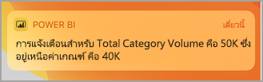
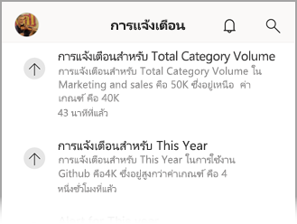
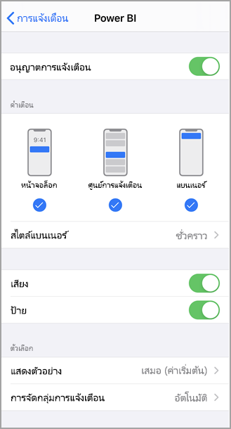
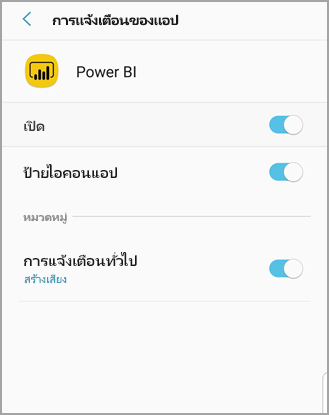
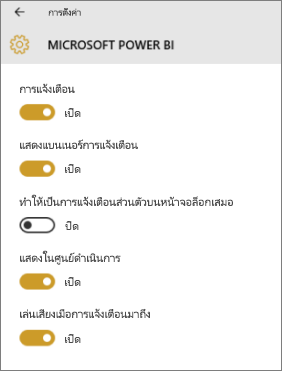

# รับการแจ้งเตือนในแอป Power BI สำหรับอุปกรณ์เคลื่อนที่Get notifications in the Power BI mobile apps
นำไปใช้กับ:Applies to:

|  |  |  |  |  |
|:--- |:--- |:--- |:--- |:--- |
| iPhoneiPhones |iPadiPads |โทรศัพท์ AndroidAndroid phones |แท็บเล็ต AndroidAndroid tablets |อุปกรณ์ Windows 10Windows 10 devices |

>[!NOTE]
>การสนับสนุนแอปอุปกรณ์เคลื่อนที่ Power BI สำหรับ **โทรศัพท์ที่ใช้ Windows 10 Mobile** จะถูกยกเลิกในวันที่ 16 มีนาคม 2021Power BI mobile app support for **phones using Windows 10 Mobile** will be discontinued on March 16, 2021. [ศึกษาเพิ่มเติมLearn more](/legal/powerbi/powerbi-mobile/power-bi-mobile-app-end-of-support-for-windows-phones)

การแจ้งเตือนจะนำข้อมูลที่เกี่ยวข้องกับประสบการณ์ Power BI ให้คุณ ในบริการของ Power BI หรือบนอุปกรณ์เคลื่อนที่ของคุณNotifications bring information related to your Power BI experience right to you, in the Power BI service or on your mobile device. เมื่อคุณเปิดการแจ้งเตือน คุณจะเห็นตัวดึงข้อมูลเรียงเป็นลำดับเกี่ยวกับ[การแจ้งเตือนที่คุณได้ตั้งค่า](mobile-set-data-alerts-in-the-mobile-apps.md)แดชบอร์ดใหม่ที่มีการแชร์กับคุณ การเปลี่ยนแปลงพื้นที่การทำงานกลุ่มของคุณ รายละเอียดเกี่ยวกับเหตุการณ์ใน Power BI และการประชุม และอื่นๆWhen you open Notifications, you see a sequential feed of messages about [alerts you've set](mobile-set-data-alerts-in-the-mobile-apps.md), new dashboards that have been shared with you, changes to your group workspace, information about Power BI events and meetings, and more.

> [!NOTE]
> บนอุปกรณ์ iOS ในครั้งแรกที่คุณลงชื่อเข้าใช้[ปรับปรุงเวอร์ชันของแอป Power BI](https://powerbi.microsoft.com/mobile/)คุณจะเห็นข้อความถามว่า คุณต้องการให้ Power BI ส่งการแจ้งเตือนหรือไม่On an iOS device, the first time you sign in to the [updated version of the Power BI apps](https://powerbi.microsoft.com/mobile/), you see a message asking if you'd like Power BI to send notifications. คุณยังสามารถกำหนดวิธีที่ี Power BI จะแจ้งเตือนคุณใน **ตั้งค่า** สำหรับอุปกรณ์ของคุณYou can also configure how Power BI notifies you in **Settings** for your device. 
> 
> 

## ดูการแจ้งเตือนบนอุปกรณ์เคลื่อนที่ของคุณView notifications on your mobile device
1. เมื่อคุณได้รับการแจ้งเตือนบนอุปกรณ์เคลื่อนที่ ค่าเริ่มต้นจะทำให้ Power BI ส่งเสียงและแสดงแบนเนอร์การแจ้งเตือนWhen you receive notifications on your mobile device, by default Power BI makes a sound and shows a notification banner.
   
   
   

   คุณสามารถ[เปลี่ยนวิธีที่ Power BI จะแจ้งเตือนคุณ](mobile-apps-notification-center.md#change-or-turn-off-notifications-on-your-mobile-device)ได้You can [change how Power BI notifies you](mobile-apps-notification-center.md#change-or-turn-off-notifications-on-your-mobile-device).
2. ถ้าคุณได้รับการแจ้งเตือนแล้ว เมื่อคุณลงชื่อเข้าใช้ Power BI บนอุปกรณ์เคลื่อนที่ของคุณ คุณจะเห็นจุดสีเหลืองบนไอคอนระฆังการแจ้งเตือนIf you've received notifications, when you sign in to Power BI on your mobile device you see a yellow dot on the notification bell icon  (iOS และ Android) หรือบนปุ่มนำทางสากล(iOS and Android) or on the global navigation button  (อุปกรณ์ Windows 10)(Windows 10 devices). 

3. หากต้องการดูการแจ้งเตือนในศูนย์การแจ้งเตือน ให้แตะระฆังการแจ้งเตือนTo see notifications in the Notification center, tap the notifications bell  (iOS และ Android) หรือไอคอนศูนย์การแจ้งเตือน(iOS and Android) or the Notifications center icon  (อุปกรณ์ Windows 10)(Windows 10 devices).
   
    การแจ้งเตือนจะแสดงรายการล่าสุดที่ด้านบนสุด รวมถึงไฮไลท์ข้อความที่ยังไม่ได้อ่านNotifications are displayed with the most recent on top and unread messages highlighted. การแจ้งเตือนจะถูกเก็บไว้เป็น 90 วัน เว้นแต่ว่าคุณลบทิ้งเร็วกว่านั้น หรือเมื่อถึงขีดจำกัดสูงสุดที่ 100 การแจ้งเตือนNotifications are retained for 90 days unless you delete them or reach the maximum limit of 100.
   
   
4. หากต้องการยกเลิกการแจ้งเตือนบนอุปกรณ์ iOS และ Android ให้แตะค้างไว้แล้วปัดนิ้วTo dismiss a notification on iOS and Android devices, tap, hold, and swipe. บนอุปกรณ์ Windows 10 ให้คลิกขวาและเลือก **ปิดเสียงเตือน**On Windows 10 devices, right click and choose **Dismiss**.

## เปลี่ยน หรือปิดการแจ้งเตือนบนอุปกรณ์เคลื่อนที่ของคุณChange or turn off notifications on your mobile device
คุณสามารถเปลี่ยนวิธีที่ Power BI แจ้งเตือนคุณได้You can change how Power BI notifies you.

1. บนอุปกรณ์ iOS ไปที่ **ตั้งค่า** > **การแจ้งเตือน**On an iOS device, go to **Settings** > **Notifications**. 
   
    บนโทรศัพท์ Android ไปที่ **ตั้งค่า** > **การแจ้งเตือน**On an Android phone, go to **Settings** > **Notifications**.
   
    บนอุปกรณ์ Windows ใน **ตั้งค่า** ไปยัง **ระบบ** > **การแจ้งเตือนและการดำเนินการ**On a Windows device, in **Settings** go to **System** > **Notifications & actions**.
2. ในรายการแอป เลือก **Power BI**In the list of apps, select **Power BI**. 
3. ที่นี่คุณสามารถปิดการแจ้งเตือนทั้งหมด หรือเลือกการแจ้งเตือนที่คุณต้องการHere you can turn notifications off completely or choose which notifications you want.
   
    **บน iPhone****On an iPhone**
   
    
   
    **บนโทรศัพท์ Android****On an Android phone**
   
    

    **บนอุปกรณ์ Windows 10****On a Windows 10 device**

    

## ขั้นตอนถัดไปNext steps
* [การแจ้งเตือนข้อมูลในบริการของ Power BIData alerts in Power BI service](../../create-reports/service-set-data-alerts.md)
* [ตั้งค่าการแจ้งเตือนข้อมูลในแอปบน iPhone (Power BI สำหรับ iOS)Set data alerts in the iPhone app (Power BI for iOS)](mobile-set-data-alerts-in-the-mobile-apps.md)
* [ตั้งค่าการแจ้งเตือนข้อมูลในแอป Power BI สำหรับอุปกรณ์เคลื่อนที่สำหรับ Windows 10Set data alerts in the Power BI mobile app for Windows 10](mobile-set-data-alerts-in-the-mobile-apps.md)
* [ดาวน์โหลดเวอร์ชันล่าสุดของแอป Power BI](https://powerbi.microsoft.com/mobile/)สำหรับอุปกรณ์เคลื่อนที่[Download the latest version of the Power BI apps](https://powerbi.microsoft.com/mobile/) for mobile devices