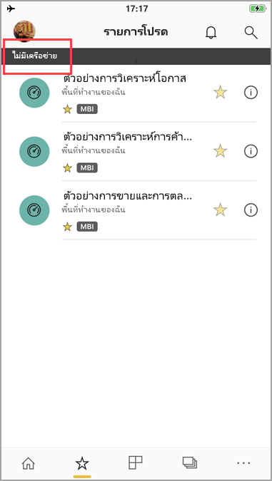

# ดูข้อมูลของคุณแบบออฟไลน์ในแอป Power BI สำหรับอุปกรณ์เคลื่อนที่View your data offline in the Power BI mobile apps
นำไปใช้กับ:Applies to:

|  |  |  |  |  |
|:--- |:--- |:--- |:--- |:--- |
| iPhoneiPhones |iPadiPads |โทรศัพท์ AndroidAndroid phones |แท็บเล็ต AndroidAndroid tablets |อุปกรณ์ Windows 10Windows 10 devices |

>[!NOTE]
>การสนับสนุนแอปอุปกรณ์เคลื่อนที่ Power BI สำหรับ **โทรศัพท์ที่ใช้ Windows 10 Mobile** จะถูกยกเลิกในวันที่ 16 มีนาคม 2021Power BI mobile app support for **phones using Windows 10 Mobile** will be discontinued on March 16, 2021. [ศึกษาเพิ่มเติมLearn more](/legal/powerbi/powerbi-mobile/power-bi-mobile-app-end-of-support-for-windows-phones)

ข้อดีประการหนึ่งของการดู Power BI ในแอปสำหรับอุปกรณ์เคลื่อนแทนในเบราว์เซอร์บนมือถือคือ คุณสามารถดูข้อมูลของคุณแม้ในขณะที่คุณไม่ได้เชื่อมต่อกับเครือข่ายได้One advantage of viewing Power BI in a mobile app rather than in a mobile browser is that you can see your data even when you're not connected to a network. 

ตามค่าเริ่มต้น Power BI จะรีเฟรชข้อมูลบ่อยครั้งเพื่อให้คุณได้รับคำตอบล่าสุดสำหรับคำถามทางธุรกิจของคุณได้ตลอดเวลา แม้ขณะเดินทางหรือการใช้งานข้ามเขตBy default, Power BI refreshes the data frequently so you get up-to-date answers to your business questions any time, even while commuting or roaming.

## การเข้าถึงข้อมูลขณะที่คุณออฟไลน์Data access while you're offline
ขณะที่คุณออฟไลน์ คุณสามารถเข้าถึงและโต้ตอบกับแดชบอร์ดที่คุณเคยเข้าถึงก่อนหน้านี้จากแอปสำหรับอุปกรณ์เคลื่อนที่While you're offline, you can access and interact with dashboards you've accessed previously from the mobile app.

นอกจากนี้ คุณยังสามารถเข้าถึงรายงาน Power BI แบบอ่านอย่างเดียวที่คุณเคยเข้าถึงก่อนหน้านี้จากแอปสำหรับอุปกรณ์เคลื่อนที่You also have read-only access to any Power BI reports you've accessed previously from the mobile app. คุณสามารถดูรายงานฉบับเต็ม แต่ไม่กรอง กรองแบบไขว้ เรียงลำดับ หรือใช้ตัวแบ่งส่วนข้อมูลได้You can see the full report, but not filter, cross-filter, sort, or use slicers on it.

>[!NOTE]
> รายงานที่ยึดตาม DirectQuery จะไม่ถูกแคชและไม่สามารถใช้งานออฟไลน์ได้Reports based on DirectQuery are not cached and are not available offline.

## การรีเฟรชข้อมูลพื้นหลังBackground data refresh
การรีเฟรชพื้นหลังจะอัปเดตแดชบอร์ดรายการโปรดของคุณ รวมถึงแดชบอร์ดแลรายงานที่คุณเคยดูในสองสัปดาห์ที่ผ่านมา โดยมีข้อมูลบนบริการของ Power BI (ไม่ใช่แหล่งข้อมูล)Background refresh updates your favorite dashboards, plus dashboards and reports you've viewed in the last two weeks, with the data on the Power BI service (not the data source). หากคุณเชื่อมต่อกับ wi-fi การรีเฟรชพื้นหลังจะอัปเดตทุก ๆ 2 ชั่วโมงIf you're connected to wifi, background refresh updates every 2 hours. หรือหากคุณอยู่บนเครือข่าย 3G, Power BI จะอัปเดตเนื้อหาทุก ๆ 24 ชั่วโมงOtherwise, if you're on a 3G network, Power BI updates the content every 24 hours.

คุณสามารถปิดการรีเฟรชพื้นหลัง ตัวอย่างเช่น เมื่อต้องการหลีกเลี่ยงการใช้งานเครือข่ายYou can turn off background refresh, for example, to avoid network usage. ตรวจสอบการตั้งค่าบนอุปกรณ์ของคุณCheck the settings on your device.

> [!NOTE]
> หากคุณใช้แอป Power BI สำหรับอุปกรณ์เคลื่อนที่ บนอุปกรณ์ iOS ของคุณ และองค์กรของคุณได้กำหนดค่า Microsoft Intune MAM แล้ว การรีเฟรชข้อมูลพื้นหลังจะปิดอยู่If you use the Power BI mobile app on an iOS device and your organization has configured Microsoft Intune MAM, then background data refresh is turned off. Power BI จะรีเฟรชข้อมูลจากบริการของ Power BI บนเว็บ ในครั้งต่อไปที่คุณเข้าใช้งานแอปThe next time you enter the app, Power BI refreshes the data from the Power BI service on the web.
> 
> อ่านเพิ่มเติมเกี่ยวกับ[การกำหนดค่าแอป Power BI สำหรับอุปกรณ์เคลื่อนที่ด้วย Microsoft Intune](../../admin/service-admin-mobile-intune.md)Read more about [configuring Power BI mobile apps with Microsoft Intune](../../admin/service-admin-mobile-intune.md). 
> 
> 

## ตัวบ่งชี้แบบออฟไลน์Offline indicators
Power BI จะเป็นตัวบ่งชี้ที่ชัดเจนเมื่อคุณเข้าและออกจากโหมดออฟไลน์ รวมถึงตัวบ่งชี้สำหรับแดชบอร์ด รายงาน และไทล์ที่ไม่พร้อมใช้งานแบบออฟไลน์ที่หายไปด้วยPower BI provides clear indicators when you go in and out of offline mode, as well as indicators for missing dashboards, reports, and tiles that aren't available offline.

## ข้อจำกัดLimitations
เมื่อคุณใช้งาน Power BI แบบออฟไลน์บนอุปกรณ์เคลื่อนที่ คุณอาจพบข้อจำกัดเหล่านี้:When you're offline with Power BI on your mobile device, you may encounter these limitations:

* Power BI สามารถแคชข้อมูลแบบออฟไลน์ได้ถึง 250 MBPower BI can cache up to 250 MB of data offline.
* ไทล์บางชนิดต้องมีการเชื่อมต่อกับเซิร์ฟเวอร์ที่ใช้งานอยู่ ดังนั้นจึงไม่สามารถใช้งานแบบออฟไลน์ได้ ตัวอย่างเช่น ไทล์ Bing map และไทล์บางไทล์ที่กำหนดเองSome tile types require an active server connection, so they aren't available offline; for example, Bing map tiles and some custom tiles.
* เวิร์กบุ๊ก Excel ทั้งหมดใน Power BI ไม่พร้อมใช้งานแบบออฟไลน์Whole Excel workbooks in Power BI aren't available offline.
* คุณสามารถดูรายงานมือถือของ Reporting Services และ KPI แบบออฟไลน์ได้ หากคุณดูในขณะเชื่อมต่ออยู่You can see Reporting Services mobile reports and KPIs offline, if you have viewed them while connected. รายงานดังกล่าวไม่ได้รีเฟรชในพื้นหลังThey don't refresh in the background. รายงานดังกล่าวจะรีเฟรชทุกครั้งที่คุณเปิดThey refresh every time you open them.
* ในแอปอุปกรณ์เคลื่อนที่ Power BI คุณจะไม่เห็นไฟล์ Power BI Desktop (.pbix) ที่บันทึกไว้ในเซิฟเวอร์รายงานของ Power BIIn the Power BI mobile apps, you can't see Power BI Desktop (.pbix) files saved to Power BI Report Server. 
* รายงานแบบแบ่งหน้า (RDL) จะไม่พร้อมใช้งานในขณะที่เครือข่ายอยู่ในสถานะออฟไลน์Paginated reports (RDL) are not available while the network is offline.

## ขั้นตอนถัดไปNext steps
คำติชมของคุณจะช่วยให้เราตัดสินใจว่าสิ่งใดควรดำเนินการในอนาคต ดังนั้นอย่าลืมลงคะแนนให้กับคุณลักษณะอื่นๆ ที่คุณต้องการเห็นในแอป Power BI สำหรับอุปกรณ์เคลื่อนที่Your feedback helps us decide what to implement in the future, so don't forget to vote for other features you'd like to see in Power BI mobile apps. 

* [แอป Power BI สำหรับอุปกรณ์เคลื่อนที่Power BI apps for mobile devices](mobile-apps-for-mobile-devices.md)
* ติดตาม@MSPowerBIบน TwitterFollow @MSPowerBI on Twitter
* เข้าร่วมการสนทนาที่[ชุมชน Power BI](https://community.powerbi.com/)Join the conversation at the [Power BI Community](https://community.powerbi.com/)
* [Power BI คืออะไรWhat is Power BI?](../../fundamentals/power-bi-overview.md)