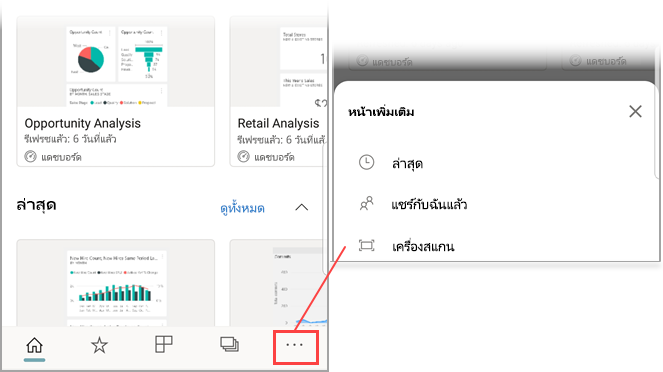
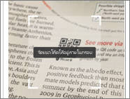
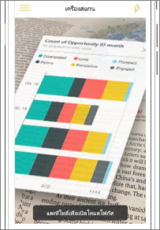
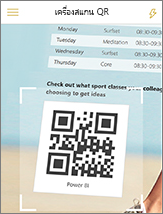
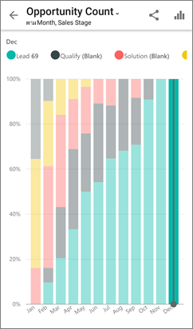

# สแกนคิวอาร์โค้ดของ Power BI จากอุปกรณ์เคลื่อนที่ของคุณScan a Power BI QR code from your mobile device
นำไปใช้กับ:Applies to:

|  |  |  |  |
|:--- |:--- |:--- |:--- |
|iPhoneiPhones |iPadiPads |โทรศัพท์ AndroidAndroid phones |แท็บเล็ต AndroidAndroid tablets |

คิวอาร์โค้ดใน Power BI สามารถเชื่อมต่อทุกอย่างในโลกแห่งความจริง เข้ากับข้อมูลที่เกี่ยวข้องกับ BI่ได้โดยตรง &#151; โดยที่ไม่จำเป็นต้องใช้การค้นหาQR codes in Power BI can connect any item in the real world directly to related BI information &#151; no navigation or search needed.

อย่างเช่น เพื่อนร่วมงานได้[สร้างคิวอาร์โค้ดในบริการ Power BI](../../create-reports/service-create-qr-code-for-tile.md)สำหรับรายงาน หรือไทล์ในแดชบอร์ด แชร์แดชบอร์ดหรือรายงานกับคุณ และวางคิวอาร์โค้ดในตำแหน่งที่ตั้งคีย์&#151;ตัวอย่างเช่น ในอีเมล หรือในรายการที่เฉพาะเจาะจงSay a colleague has [created a QR code in the Power BI service](../../create-reports/service-create-qr-code-for-tile.md) for a report or for a tile in a dashboard, shared the dashboard or report with you, and placed the QR code in a key location &#151; for example, in an email or on a specific item. 

คุณสามารถสแกนคิวอาร์โค้ด สำหรับการเข้าถึงไปยังไทลแบบทันที์ที่เกี่ยวข้องหรือรายงาน จากโทรศัพท์ของคุณโดยตรง ใช้เครื่องสแกนในแอป Power BI หรือสแกนเนอร์อื่น ๆ ที่ติดตั้งบนโทรศัพท์ของคุณYou can scan the QR code for immediate access to the relevant tile or report, right from your phone, using either the scanner in the Power BI app, or any other scanner installed on your phone. 

ถ้าผู้ร่วมงานของคุณไม่ได้แชร์แดชบอร์ดหรือรายงานกับคุณ คุณสามารถร้องขอการเข้าถึงได้โดยตรงจากอุปกรณ์เคลื่อนที่If your colleague hasn't shared the dashboard or report with you, you can request access directly from the mobile app. 

> [!NOTE]
> พวกเขายังสามารถ[สแกนคิวอาร์โค้ดด้วย Power BI สำหรับแอปความเป็นจริงผสม](./mobile-hololens2-app.md#open-reports-with-qr-codes)ได้อีกด้วยYou can also [scan a report QR code with the Power BI for Mixed Reality app](./mobile-hololens2-app.md#open-reports-with-qr-codes).

## สแกนรหัส Power BI QR บน iPhone ของคุณกับสแกนเนอร์ Power BIScan a Power BI QR code on your iPhone with the Power BI scanner

1. ที่แถบนำทาง แตะที่ **ตัวเลือกเพิ่มเติม** (...) และแตะที่ **สแกนเนอร์**On the navigation bar, tap **More options** (...) and then tap **Scanner**.

    

2. ถ้ากล้องของคุณไม่ได้เปิดใช้งาน คุณจำเป็นต้องอนุมัติให้แอป Power BI ใช้กล้องIf your camera is not enabled, you need to approve the Power BI app to use the camera. นี่เป็นการอนุมัติครั้งเดียวThis is a one-time approval. 
 
3. วางตำแหน่งสแกนเนอร์ที่ Power BI QR โค้ดPoint the scanner at the Power BI QR code. 
   
    
4. ไทล์หรือรายงานปรากฏขึ้นเมื่อต้องการ เหนือพื้นหลังในความเป็นจริงเสริมThe tile or report appears to hover over the background in augmented reality.
   
    

5. แตะรายงานหรือไทล์เพื่อเปิดในโหมดโฟกัส หรือย้อนกลับไปยังสแกนเนอร์Tap the report or the tile to open it in focus mode, or go back to the scanner.

### สแกนคิวอาร์โค้ดจากสแกนเนอร์ภายนอกบน iPhone ของคุณScan a QR code from an external scanner on your iPhone
1. สแกนเนอร์ใดก็ได้ที่ติดตั้งบนโทรศัพท์ของคุณสามารถนำมาวางให้ตรงตำแหน่งคิวอาร์โค้ดสแกนเนอร์ Power BI ที่เกี่ยวข้องเพื่อการเข้าถึงไปยังไทล์หรือรายงานอย่างทันทีFrom any scanner installed on your phone, point the scanner to the relevant Power BI QR code for immediate access to the tile or report. 
2. ถ้าคุณไม่ได้ติดตั้งแอป Power BI คุณจะถูกนำไปยัง[Apple App Store เพื่อดาวน์โหลด](https://go.microsoft.com/fwlink/?LinkId=522062)บน iPhone ของคุณIf you don't have the Power BI app installed, you are redirected to the [Apple App Store to download it](https://go.microsoft.com/fwlink/?LinkId=522062) on your iPhone.

## สแกนคิวอาร์โค้ด Power BI บน ของคุณกับสแกนเนอร ์Android Power BIScan a Power BI QR code on your Android device with the Power BI scanner

1. ที่แถบนำทาง แตะที่ **ตัวเลือกเพิ่มเติม** (...) และแตะที่ **สแกนเนอร์**On the navigation bar, tap **More options** (...) and then tap **Scanner**.

    

2. ถ้ากล้องของคุณไม่ได้เปิดใช้งาน คุณจำเป็นต้องอนุมัติให้แอป Power BI ใช้กล้องIf your camera is not enabled, you need to approve the Power BI app to use the camera. นี่เป็นการอนุมัติครั้งเดียวThis is a one-time approval. 

3. วางตำแหน่งสแกนเนอร์ที่ Power BI QR โค้ดPoint the scanner at the Power BI QR code. 
   
    
4. ไทล์หรือรายงานเปิดโดยอัตโนมัติใน Power BIThe tile or report opens automatically in Power BI.
   
    

### สแกนคิวอาร์โค้ดจากสแกนเนอร์ภายนอกบน Android ของคุณScan a QR code from an external scanner on your Android device
1. สแกนเนอร์ใดก็ได้ที่ติดตั้งบนโทรศัพท์แอนดรอยด์ของคุณ Android สามารถนำมาวางให้ตรงตำแหน่งคิวอาร์โค้ดสแกนเนอร์ Power BI ที่เกี่ยวข้องเพื่อการเข้าถึงไปยังไทล์หรือรายงานอย่างทันทีFrom any scanner installed on your Android device, point the scanner to the relevant Power BI QR code for immediate access to the tile or report. 
2. ถ้าคุณไม่ได้ติดตั้งแอป Power BI คุณจะถูกนำไปยัง[Google Play เพื่อดาวน์โหลดแอป](https://go.microsoft.com/fwlink/?LinkID=544867)If you don't have the Power BI app installed, you are redirected to [Google Play to download it](https://go.microsoft.com/fwlink/?LinkID=544867). 

## ขั้นตอนถัดไปNext steps
* [เชื่อมต่อกับข้อมูล Power BI จากโลกแห่งความจริง](mobile-apps-data-in-real-world-context.md)ด้วยแอปโทรศัพท์เคลื่อนที่[Connect to Power BI data from the real world](mobile-apps-data-in-real-world-context.md) with the mobile apps
* [สร้างคิวอาร์โค้ดสำหรับไทล์ในบริการ Power BICreate a QR code for a tile in the Power BI service](../../create-reports/service-create-qr-code-for-tile.md)
* [สร้างคิวอาร์โค้ดสำหรับรายงานในบริการ Power BICreate a QR code for a report in the Power BI service](../../create-reports/service-create-qr-code-for-report.md)
* คุณยังสามารถ[สแกนคิวอาร์โค้ดด้วย Power BI สำหรับแอปความเป็นจริงผสม](./mobile-hololens2-app.md)ได้อีกด้วยYou can also [scan a QR code with the Power BI for Mixed Reality app](./mobile-hololens2-app.md)
* มีคำถามหรือไม่Questions? [ลองถามชุมชน Power BITry asking the Power BI Community](https://community.powerbi.com/)
