# เริ่มต้นใช้งานด่วน: สำรวจแดชบอร์ดและรายงานในแอป Power BI สำหรับอุปกรณ์เคลื่อนที่Quickstart: Explore dashboards and reports in the Power BI mobile apps
ในการเริ่มต้นใช้งานด่วนนี้ คุณจะได้เข้าชมแอป Power BI สำหรับอุปกรณ์เคลื่อนที่และสำรวจตัวอย่างแดชบอร์ดและรายงานได้อย่างรวดเร็วIn this quickstart, you take a quick tour of the Power BI Mobile app and explore a sample dashboard and report. แอป Power BI สำหรับ iOS จะแสดงขึ้นมาแต่คุณสามารถทำตามบนอุปกรณ์อื่นๆ ได้อย่างง่ายดายThe Power BI app for iOS is shown, but you can easily follow along on other devices.

นำไปใช้กับ:Applies to:

|  |  |  |  |
|:--- |:--- |:--- |:--- |
| iPhoneiPhone | iPadiPad | AndroidAndroid | Windows 10Windows 10 |

>[!NOTE]
>การสนับสนุนแอป Power BI สำหรับอุปกรณ์เคลื่อนที่ **เครื่องที่ใช้ Windows 10 Mobile** จะถูกยกเลิกในวันที่ 16 มีนาคม 2021Power BI mobile app support for **phones using Windows 10 Mobile** will be discontinued on March 16, 2021. [ศึกษาเพิ่มเติมLearn more](/legal/powerbi/powerbi-mobile/power-bi-mobile-app-end-of-support-for-windows-phones)

แดชบอร์ดเป็นพอร์ทัลสำหรับอายุงานและกระบวนการของบริษัทของคุณA dashboard is a portal to your company's life cycle and processes. คือภาพรวมหรือสถานที่เดียวที่สามารถตรวจสอบสถานะปัจจุบันของธุรกิจได้It is an overview, a single place to monitor the current state of the business. รายงาน คือ มุมมองแบบโต้ตอบของข้อมูลของคุณที่มีการแสดงผลด้วยภาพที่แสดงการค้นพบและข้อมูลเชิงลึกที่แตกต่างจากข้อมูลนั้นReports are interactive views of your data, with visuals representing different findings and insights from that data. 

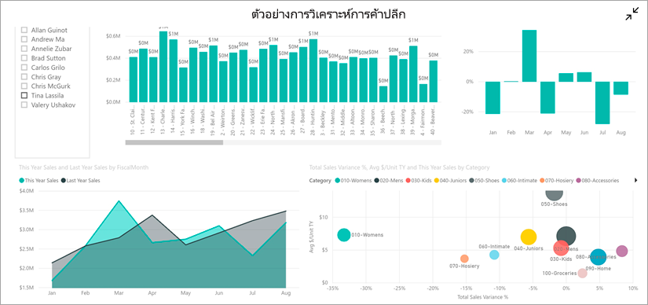

## ข้อกำหนดเบื้องต้นPrerequisites

* **ลงทะเบียนใช้งาน Power BI**: ถ้าคุณไม่ได้ลงทะเบียน Power BI ให้ [ลงทะเบียนรุ่นทดลองใช้ฟรี](https://app.powerbi.com/signupredirect?pbi_source=web)ก่อนที่คุณจะเริ่มต้นใช้งาน**Sign up for Power BI**: If you're not signed up for Power BI, [sign up for a free trial](https://app.powerbi.com/signupredirect?pbi_source=web) before you begin.
* **ติดตั้งแอป Power BI สำหรับอุปกรณ์ของคุณ**: ดาวน์โหลดแอป Power BI สำหรับอุปกรณ์เคลื่อนที่จาก [App store](https://apps.apple.com/app/microsoft-power-bi/id929738808) (iOS) และ [Google play](https://play.google.com/store/apps/details?id=com.microsoft.powerbim&amp;amp;clcid=0x409) (Android)**Install the Power BI app for your device**: Download the Power BI mobile app\*\* from the [App store](https://apps.apple.com/app/microsoft-power-bi/id929738808) (iOS) or [Google play](https://play.google.com/store/apps/details?id=com.microsoft.powerbim&amp;amp;clcid=0x409) (Android).
* **ดาวน์โหลดตัวอย่างการวิเคราะห์ร้านค้าปลีก**: ขั้นตอนแรกในการเริ่มต้นใช้งานด่วน คือ การดาวน์โหลดตัวอย่างการวิเคราะห์การค้าปลีกทางการขายในบริการของ Power BI**Download the Retail Analysis Sample**: The first step in this quickstart is to download the Retail Analysis Sample in the Power BI service. [เรียนรู้วิธีการดาวน์โหลดตัวอย่าง](./mobile-apps-download-samples.md) ลงในบัญชี Power BI ของคุณเพื่อเริ่มต้นใช้งาน[Learn how to download a sample](./mobile-apps-download-samples.md) into your Power BI account to get started. ตรวจสอบให้แน่ใจว่าได้เลือกตัวอย่างการวิเคราะห์ด้านการขายปลีกBe sure to choose the Retail Analysis Sample.

หลังจากที่คุณเสร็จสิ้นข้อกำหนดเบื้องต้นและดาวน์โหลดตัวอย่างการวิเคราะห์ด้านการขายปลีกไปยังบัญชี Power BI ของคุณแล้ว คุณก็พร้อมที่จะเริ่มต้นทัวร์ด่วนนี้Once you've completed the prerequisites and downloaded the Retail Analysis Sample to your Power BI account, you are ready to begin this quick tour.

## ดูแดชบอร์ดบนอุปกรณ์เคลื่อนที่ของคุณView a dashboard on your mobile device
1. บนอุปกรณ์ของคุณ เปิดแอป Power BI แล้วลงชื่อเข้าใช้ด้วยข้อมูลประจำตัวของบัญชีผู้ใช้ Power BI เดียวกันกับที่คุณใช้ในบริการ Power BI ในเบราว์เซอร์On your device, open the Power BI app and sign in with your Power BI account credentials, the same ones you used in the Power BI service in the browser.
 
1. ในตอนนี้ให้แตะที่ไอคอน **พื้นที่ทำงาน**  เลือก **พื้นที่ทำงานของฉัน** แล้วแตะตัวอย่างการวิเคราะห์ด้านการขายปลีกเพื่อเปิดNow, tap the **Workspaces** icon , choose **My Workspaces**, and then tap the Retail Analysis Sample to open it.

    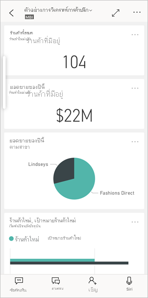
   
    แดชบอร์ด Power BI บนอุปกรณ์เคลื่อนที่ของคุณจะมีลักษณะแตกต่างกันเล็กน้อยจากบริการ Power BIPower BI dashboards look a little different on your mobile device than they do on the Power BI service. ไทล์ทั้งหมดจะปรากฏในขนาดเท่ากัน และถูกจัดเรียงทีละอันจากบนลงล่างAll the tiles appear the same width, and they're arranged one after another from top to bottom.

6. เลื่อนลงแล้วแตะแผนภูมิเส้นทึบ "ยอดขายของปีนี้ ยอดขายของปีที่แล้ว"Scroll down and tap the "This Year's Sales, Last Year's Sales" filled line chart.

    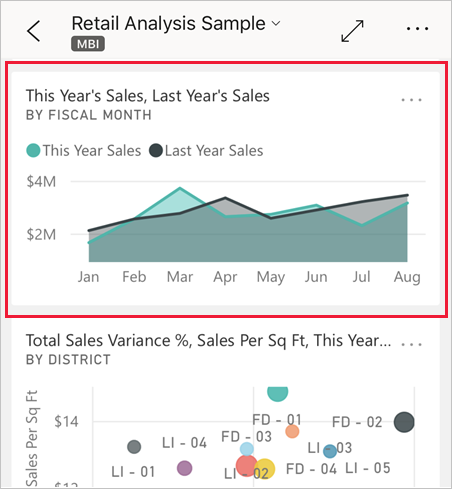

    ไทล์จะเปิดขึ้นในโหมดโฟกัสIt opens in focus mode.

7. ในโหมดโฟกัส แตะ **เม.ย.** ในแผนภูมิIn focus mode, tap **Apr** in the chart. ค่าสำหรับเดือนเมษายนจะปรากฏที่ด้านบนของแผนภูมิThe values for April appear at the top of the chart.

    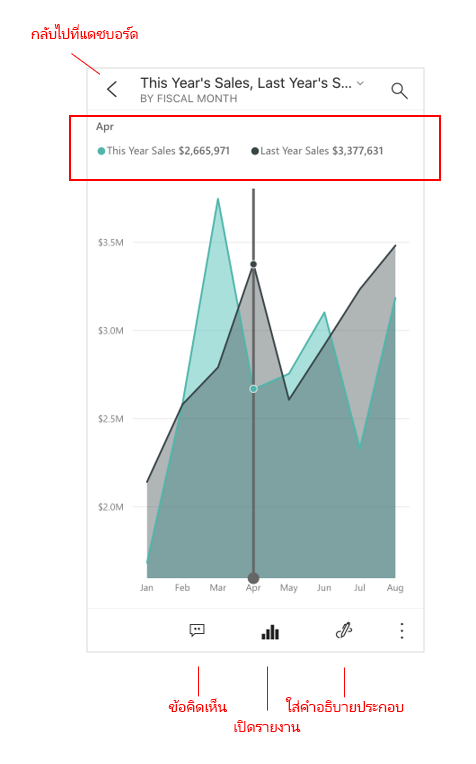

8. แตะไอคอนรายงานTap the Report icon  ที่ด้านล่างของหน้าจอ (บนอุปกรณ์ Android รายการนี้อาจอยู่ด้านบนของหน้าจอ)at the bottom of the screen (on Android devices this may be at the top of the screen). รายงานที่เกี่ยวข้องกับไทล์นี้จะเปิดขึ้นในโหมดแนวนอนThe report related to this tile opens in landscape mode.

    

9. แตะฟองสีเหลือง "Juniors 040 -" ในแผนภูมิฟองTap the yellow "040 - Juniors" bubble in the bubble chart. สังเกตวิธีการไฮไลท์ค่าที่เกี่ยวข้องในแผนภูมิอื่น ๆNote how it highlights related values in the other charts. 

    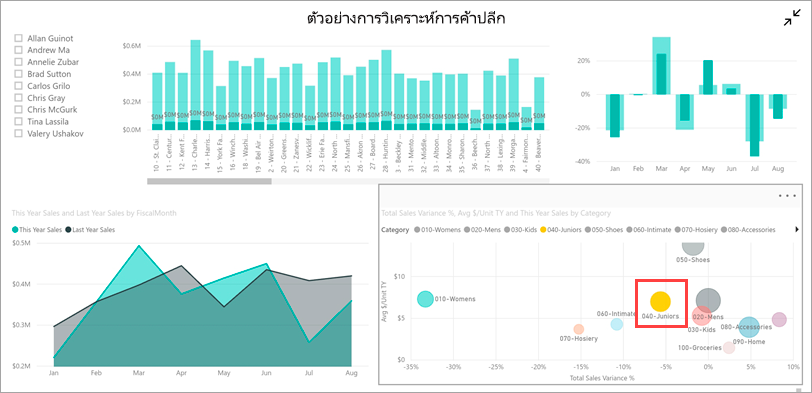

10. ปัดขึ้นเพื่อดูแถบเครื่องมือที่ด้านล่าง และแตะ **ตัวเลือกเพิ่มเติม (...)**Swipe up to see a toolbar across the bottom, and tap **More options (...)**.

    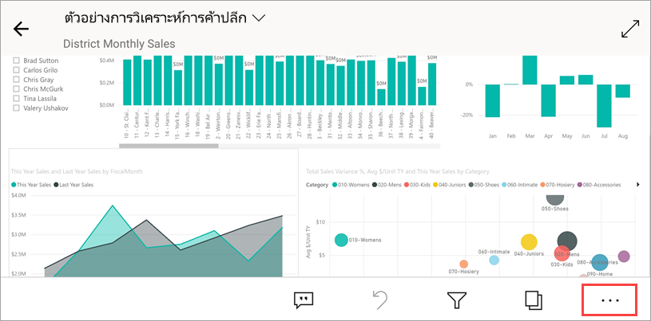

11. เลื่อนดูรายการ แล้วเลือก **ใส่คำอธิบายประกอบ**Scroll down the list and select **Annotate**.

    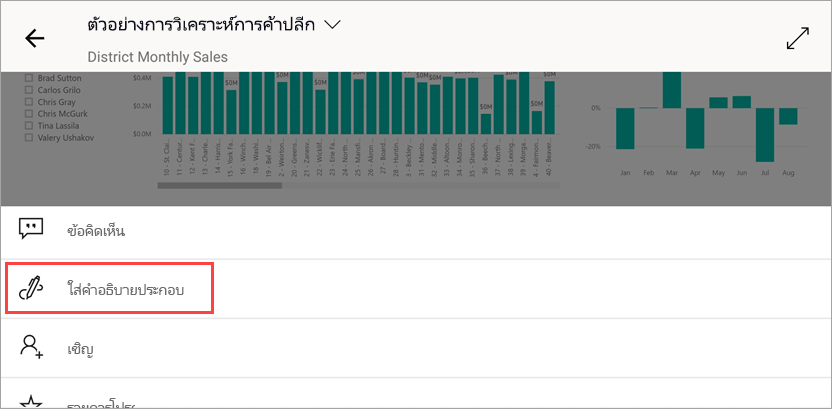

12. บนแถบเครื่องมือใส่คำอธิบายประกอบ ให้แตะไอคอนรูปหน้ายิ้ม จากนั้นแตะหน้ารายงานที่คุณต้องการเพิ่มใบหน้ายิ้มบางรายการOn the annotate toolbar, tap the smiley-face icon and then tap the report page where you'd like to add some smiley faces.
 
    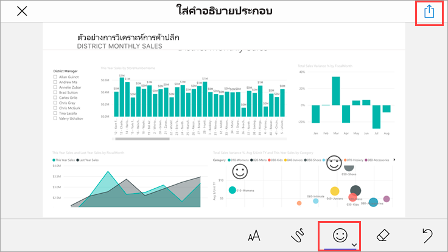

13. ในเวลานี้ ให้แตะ **แชร์** ที่มุมบนขวาNow tap **Share** in the upper-right corner.

14. เลือกวิธีที่คุณต้องการแชร์รายงานChoose the way you'd like to share the report.  

    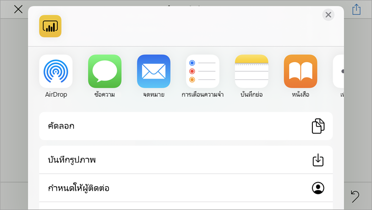

    คุณสามาราถแชร์สแนปช็อตนี้กับใครก็ได้ ทั้งภายในและภายนอกองค์กรของคุณYou can share this snapshot with anyone, in or out of your organization. หากพวกเขาอยู่ในองค์กรของคุณและมีบัญชี Power BI ของตนเอง พวกเขาจะสามารถเปิดรายงานตัวอย่างการวิเคราะห์ด้านการขายปลีกได้ด้วยเช่นกันIf they're in your organization and have their own Power BI account, they'll be able to open the Retail Analysis Sample report, too.

## ล้างแหล่งข้อมูลClean up resources

หลังจากที่คุณดำเนินการเริ่มต้นด่วนนี้เสร็จสิ้นแล้ว คุณสามารถลบแดชบอร์ด รายงาน และชุดข้อมูลตัวอย่างการวิเคราะห์ด้านการขายปลีก ถ้าคุณต้องการAfter you finish this quickstart, you can delete the Retail Analysis Sample dashboard, report, and dataset, if you wish.

1. เปิดบริการ Power BI ([บริการ Power BI](https://app.powerbi.com)) และลงชื่อเข้าใช้Open the Power BI service ([Power BI service](https://app.powerbi.com)) and sign in.

2. ในบานหน้าต่างการนำทาง ให้เลือก **พื้นที่ทำงานของฉัน**In the navigation pane, select **My Workspace**.

3. เลือกแท็บแดชบอร์ดและจากนั้นคลิกที่ถังขยะSelect the dashboards tab and then click the trash can.

    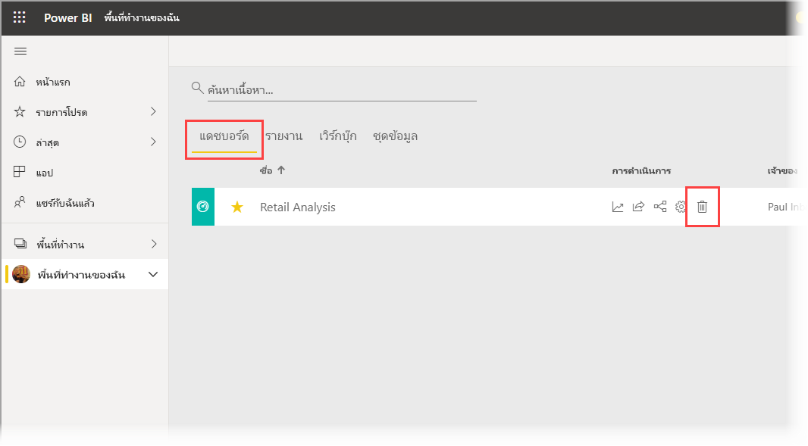

    ในเวลานี้ให้คลิกที่แท็บรายงานแล้วทำเหมือนกันNow click the reports tab and do the same.

4. ในเวลานี้ให้เลือกแท็บชุดข้อมูล คลิก **ตัวเลือกเพิ่มเติม** (...) แล้วเลือก **ลบ**Now select the datasets tab, click **More options** (...), and choose **Delete**. 

    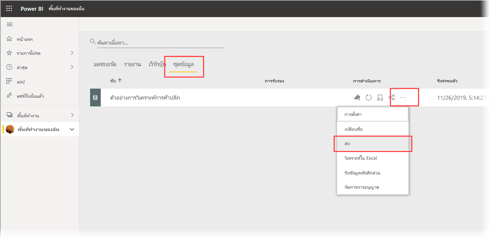

## ขั้นตอนถัดไปNext steps

ในการเริ่มต้นใช้งานด่วนนี้ คุณสำรวจแดชบอร์ดและรายงานตัวอย่างได้ในอุปกรณ์เคลื่อนที่ของคุณIn this quickstart, you explored a sample dashboard and report on your mobile device. อ่านเพิ่มเติมเกี่ยวกับการทำงานในบริการ Power BIRead more about working in the Power BI service. 

> [!div class="nextstepaction"]
> [เริ่มต้นใช้งานด่วน: สำรวจบริการ Power BIQuickstart: Getting around in the Power BI service](../end-user-experience.md)