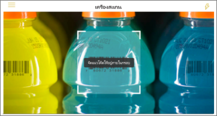
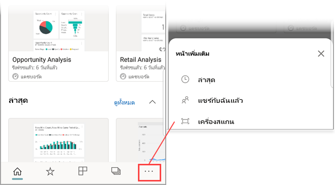

# สแกนบาร์โค้ดด้วยอุปกรณ์ของคุณจากแอป Power BI สำหรับอุปกรณ์เคลื่อนที่Scan a barcode with your device from the Power BI mobile app
สแกนบาร์โค้ดในโลกแห่งความจริงเพื่อไปยังข้อมูล BI ที่ถูกกรองโดยตรงในแอป Power BI สำหรับอุปกรณ์เคลื่อนที่Scan barcodes in the real world to go directly to filtered BI information in the Power BI mobile app.

นำไปใช้กับ:Applies to:

|  |  |  |  |
|:--- |:--- |:--- |:--- |
|iPhoneiPhones |iPadiPads |โทรศัพท์ AndroidAndroid phones |แท็บเล็ต AndroidAndroid tablets |

บอกเพื่อนร่วมงานที่ถูก[แท็กเขตข้อมูลบาร์โค้ดในรายงาน Power BI Desktop](../../transform-model/desktop-mobile-barcodes.md)และแชร์รายงานกับคุณSay a colleague has [tagged a barcode field in a report Power BI Desktop](../../transform-model/desktop-mobile-barcodes.md) and shared the report with you. 

เมื่อคุณสามารถสแกนบาร์โค้ดผลิตภัณฑด้วยตัวสแกนในแอป Power BI บนอุปกรณ์ของคุณ คุณจะเห็นรายงาน (หรือรายการของรายงาน) ด้วยบาร์โค้ดนั้นWhen you scan a product barcode with the scanner in the Power BI app on your device, you see the report (or list of reports) with that barcode. คุณสามารถเปิดรายงานนั้นซึ่งถูกกรองไปยังบาร์โค้ดนั้นYou can open that report filtered to that barcode.

## สแกนบาร์โค้ดด้วยตัวสแกน Power BIScan a barcode with the Power BI scanner
1. ที่แถบนำทาง แตะที่ **ตัวเลือกเพิ่มเติม** (...) และแตะที่ **สแกนเนอร์**On the navigation bar, tap **More options** (...) and then tap **Scanner**.

    

2. ถ้ากล้องของคุณไม่ได้เปิดใช้งาน คุณจำเป็นต้องอนุมัติให้แอป Power BI ใช้กล้องIf your camera is not enabled, you need to approve the Power BI app to use the camera. นี่เป็นการอนุมัติครั้งเดียวThis is a one-time approval. 
4. เล็งตัวสแกนไปที่บาร์โค้ดบนผลิตภัณฑ์Point the scanner at a barcode on a product. คุณจะเห็นรายชื่อรายงานที่เชื่อมโยงกับบาร์โค้ดนั้นYou will see a list of reports associated with that barcode.
5. แตะที่ชื่อรายงานเพื่อเปิดบนอุปกรณ์ของคุณ ซึ่งจะถูกกรองโดยอัตโนมัติไปยังบาร์โค้ดนั้นTap the report name to open it on your device, automatically filtered according to that barcode.

## กรองด้วยบาร์โค้ดอื่นๆ ในขณะอยู่ในรายงานFilter by other barcodes while in a report
ในขณะที่กำลังดูรายงานที่ถูกกรองด้วยบาร์โค้ดบนอุปกรณ์ของคุณ คุณอาจต้องการกรองรายงานเดียวกันด้วยบาร์โค้ดที่แตกต่างกันWhile looking at a report filtered by a barcode on your device, you may want to filter the same report by a different barcode.

* หากไอคอนบาร์โค้ดมีตัวกรองIf the barcode icon has a filter ตัวกรองเปิดทำงานอยู่และรายงานถูกกรองด้วยบาร์โค้ดแล้ว, the filter is active and report Is already filtered by a barcode. 
* หากไอคอนไม่มีตัวกรองIf the icon doesn't contain a filter ตัวกรองจะไม่เปิดทำงานและรายงานไม่ถูกกรองด้วยบาร์โค้ด, the filter isn't active and the report isn't filtered by a barcode. 

ไม่ว่าวิธีใด ให้แตะไอคอนเพื่อเปิดเมนูขนาดเล็กที่มีตัวสแกนแบบลอยตัวอยู่Either way, tap the icon to open a small menu with a floating scanner.

* โฟกัสตัวสแกนบนรายการใหม่เพื่อเปลี่ยนตัวกรองของรายงานเป็นค่าบาร์โค้ดที่แตกต่างกันFocus the scanner on the new item to change the filter of the report to a different barcode value. 
* เลือก **ล้างตัวกรองบาร์โค้ด** เพื่อกลับไปยังรายงานที่ไม่ถูกกรองSelect **Clear barcode filter** to go back to the unfiltered report.
* เลือก **กรองด้วยบาร์โค้ดล่าสุด** เพื่อเปลี่ยนตัวกรองรายงานเป็นหนึ่งในบาร์โค้ดที่คุณได้สแกนไปภายในเซสชันปัจจุบันSelect **Filter by recent barcodes** to change the report filter to one of the barcodes you've scanned within the current session.

## ปัญหาเกี่ยวกับการสแกนบาร์โค้ดIssues with scanning a barcode
ต่อไปนี้เป็นข้อความบางอย่างที่คุณอาจเห็นเมื่อคุณสแกนบาร์โค้ดบนผลิตภัณฑ์Here are some messages you may see when you scan a barcode on a product.

### “ไม่สามารถกรองรายงานได้...”"Couldn't filter report..."
รายงานที่คุณเลือกที่จะกรองจะยึดตามรูปแบบข้อมูลที่ไม่ได้รวมค่าบาร์โค้ดนี้The report you choose to filter is based on a data model that does not include this barcode value. ตัวอย่างเช่น ผลิตภัณฑ์ “น้ำแร่” ไม่ได้รวมอยู่ในรายงานFor example, the product "mineral water" isn't included in the report.  

### รายการของภาพทั้งหมด/บางรายการในรายงานไม่มีค่าใด ๆ อยู่All/some of the visuals in the report don't contain any value
ค่าบาร์โค้ดที่คุณสแกนมีอยู่ในแบบจำลองของคุณ แต่รายการของภาพทั้งหมด/บางรายการในรายงานไม่มีค่าใด ๆ อยู่ ดังนั้นการกรองจะแสดงสถานะเป็นว่างThe barcode value you scanned exists in your model but all/Some of the visuals on your report don't contain this value and therefore filtering will return an empty state. ลองค้นหาหน้ารายงานอื่นๆ หรือแก้ไขรายงานของคุณใน Power BI Desktop ให้ประกอบด้วยค่านี้Try looking into other report pages or edit your reports in Power BI desktop to contain this value 

### “ดูเหมือนว่าคุณไม่มีรายงานใด ๆ ที่สามารถใช้บาร์โค้ดกรองได้”"Looks like you don't have any reports that can be filtered by barcodes."
ซึ่งหมายความว่า คุณไม่มีรายงานใดๆ ที่เปิดใช้งานบาร์โค้ดThis means you don't have any barcode-enabled reports. ตัวสแกนบาร์โค้ดสามารถกรองรายงานที่มีคอลัมน์ที่ทำเครื่องหมายเป็น **บาร์โค้ด** ได้เท่านั้นThe barcode scanner can only filter reports that have a column marked as **Barcode**.  

ตรวจสอบให้แน่ใจว่าคุณ หรือเจ้าของรายงานได้แท็กคอลัมน์เป็น **บาร์โค้ด** ใน Power BI DesktopMake sure you or the report owner has tagged a column as **Barcode** in Power BI Desktop. เรียนรู้เพิ่มเติมเกี่ยวกับ[การแท็กเขตข้อมูลบาร์โค้ดใน Power BI Desktop](../../transform-model/desktop-mobile-barcodes.md)Learn more about [tagging a barcode field in Power BI Desktop](../../transform-model/desktop-mobile-barcodes.md)

### "ไม่สามารถกรองรายงานได้ ดูเหมือนว่าจะไม่มีบาร์โค้ดนี้อยู่ในข้อมูลรายงาน""Couldn't filter report - Looks like this barcode doesn't exist in the report data."
รายงานที่คุณเลือกที่จะกรองจะยึดตามรูปแบบข้อมูลที่ไม่ได้รวมค่าบาร์โค้ดนี้The report you chose to filter is based on a data model that doesn't include this barcode value. ตัวอย่างเช่น ผลิตภัณฑ์ “น้ำแร่” ไม่ได้รวมอยู่ในรายงานFor example, the product "mineral water" isn't included in the report. คุณสามารถสแกนผลิตภัณฑ์ต่างๆ เลือกรายงานที่แตกต่างกัน (ถ้ามีรายงานพร้อมใช้งานมากกว่าหนึ่ง) หรือดูรายงานที่ยังไม่ได้กรองได้You can scan a different product, choose a different report (if more than one report is available), or view the report unfiltered. 

## ขั้นตอนถัดไปNext steps
* [แท็กเขตข้อมูลบาร์โค้ดใน Power BI DesktopTag a barcode field in Power BI Desktop](../../transform-model/desktop-mobile-barcodes.md)
* [ไทล์แดชบอร์ดใน Power BIDashboard tiles in Power BI](../end-user-tiles.md)
* [แดชบอร์ดใน Power BIDashboards in Power BI](../end-user-dashboards.md)
