# ดูแดชบอร์ดในแอปมือถือของ Power BIView dashboards in the Power BI mobile apps
นำไปใช้กับ:Applies to:

|  |  |  |  | 
|:--- |:--- |:--- |:--- |:--- |
| [iPhoneiPhones](mobile-apps-view-dashboard.md#view-dashboards-on-your-iphone) |[iPadsiPads](mobile-apps-view-dashboard.md#view-dashboards-on-your-ipad) |[โทรศัพท์ androidAndroid phones](mobile-apps-view-dashboard.md#view-dashboards-on-your-android-phone) |[แท็บเล็ต androidAndroid tablets](mobile-apps-view-dashboard.md#view-dashboards-on-your-android-tablet) |

แดชบอร์ดเป็นพอร์ทัลสำหรับวงจรชีวิตและกระบวนการของบริษัทของคุณDashboards are a portal to your company's life cycle and processes. แดชบอร์ดคือภาพรวมหรือสถานที่เดียวที่สามารถตรวจสอบสถานะปัจจุบันของธุรกิจได้A dashboard is an overview, a single place to monitor the current state of the business.

## สร้างแดชบอร์ดในบริการของ Power BI (https://powerbi.com)Create dashboards in the Power BI service (https://powerbi.com)
**คุณไม่สร้างแดชบอร์ดในแอปสำหรับอุปกรณ์เคลื่อนที่****You don't create dashboards in the mobile apps.** 

เมื่อต้องการดูแดชบอร์ดและรายงานบนอุปกรณ์เคลื่อนที่ของคุณ คุณจำเป็นต้องสร้างหรือเชื่อมต่อกับรายการเหล่านั้นในเว็บเบราว์เซอร์To see dashboards and reports on your mobile device, you need to create or connect to them in a Web browser. 

1. ไปยังบริการของ Power BI ([https://www.powerbi.com](https://www.powerbi.com)) และ[ลงทะเบียนสำหรับบัญชีผู้ใช้](../../fundamentals/service-self-service-signup-for-power-bi.md)Go to the Power BI service ([https://www.powerbi.com](https://www.powerbi.com)) and [sign up for an account](../../fundamentals/service-self-service-signup-for-power-bi.md).
2. [สร้างแดชบอร์ดและรายงาน Power BI ของคุณ](../../fundamentals/service-get-started.md)หรือเชื่อมต่อกับ[แอป Power BI](../../connect-data/service-connect-to-services.md)ที่มีอยู่สำหรับบริการที่หลากหลาย เช่น[Microsoft Dynamics CRM](../../connect-data/service-connect-to-services.md)[Create your own Power BI dashboards and report](../../fundamentals/service-get-started.md), or connect to existing [Power BI apps](../../connect-data/service-connect-to-services.md) for a variety of services, such as [Microsoft Dynamics CRM](../../connect-data/service-connect-to-services.md).

ที่นี่ คุณสามารถเปิดแดชบอร์ดในบริการของ Power BIHere's a Power BI dashboard in the Power BI service:

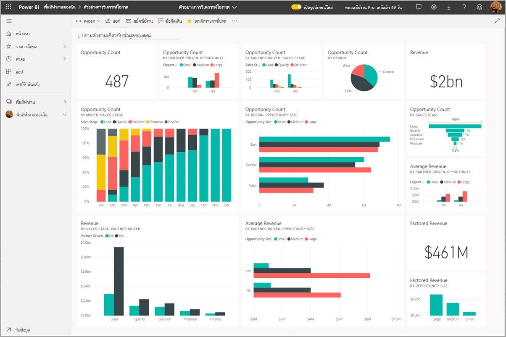

## ดูแดชบอร์ดบน iPhone ของคุณView dashboards on your iPhone
1. เปิดแอป Power BI บน iPhone ของคุณ และลงชื่อเข้าใช้Open the Power BI app on your iPhone and sign in.
   
   ต้องการ[ดาวน์โหลดแอป iPhone](https://go.microsoft.com/fwlink/?LinkId=522062) จาก Apple App Store หรือไม่Need to [download the iPhone app](https://go.microsoft.com/fwlink/?LinkId=522062) from the Apple App Store?
2. แตะแดชบอร์ดเพื่อเปิดTap a dashboard to open it.  
   
    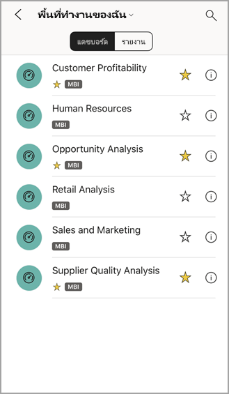
   
   * ดาวสีเหลืองThe yellow stars  แสดงแดชบอร์ดที่เป็นรายการโปรดshow which dashboards are favorites. 
   * หมายเหตุใต้ชื่อแดชบอร์ดแต่ละตัว (ในกรณีนี้คือ "MBI") :::image type="icon" source="././media/mobile-apps-view-dashboard/power-bi-dashboard-ios-medium-classification.png" border="false"::: จะแสดงวิธีการจัดประเภทข้อมูลในแต่ละแดชบอร์ด อ่านเพิ่มเติมเกี่ยวกับ[การจัดประเภทข้อมูลใน Power BI](../../create-reports/service-data-classification.md)Read more about [data classification in Power BI](../../create-reports/service-data-classification.md).
   
   ตามค่าเริ่มต้น แดชบอร์ด Power BI จะมีลักษณะแตกต่างกันเล็กน้อยบน iPhone ของคุณBy default, Power BI dashboards look a little different on your iPhone. ไทล์ทั้งหมดจะปรากฏในขนาดเท่ากัน และถูกจัดเรียงทีละอันจากบนลงล่างAll the tiles appear the same size, and they're arranged one after another from top to bottom.
   
    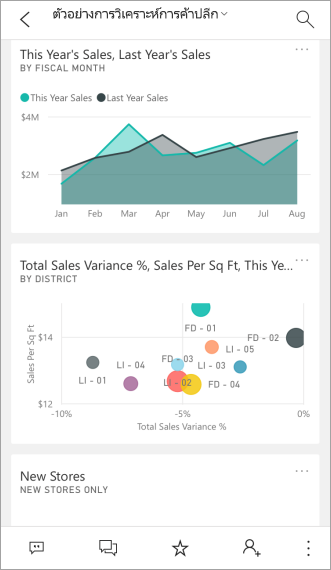
   
   > [!TIP]
   > ถ้าคุณเป็นเจ้าของแดชบอร์ด ในบริการของ Power BI คุณจะสามารถ[สร้างมุมมองแดชบอร์ดสำหรับโทรศัพท์](../../create-reports/service-create-dashboard-mobile-phone-view.md)ในโหมดแนวตั้งได้If you're the dashboard owner, in the Power BI service you can [create a view of the dashboard specifically for phones](../../create-reports/service-create-dashboard-mobile-phone-view.md) in portrait mode. 
   > 
   > 
   
    หรือเพียงแค่หมุนโทรศัพท์ของคุณมาด้านข้างเพื่อดูแดชบอร์ดในโหมดแนวนอนบนโทรศัพท์Or, just turn your phone sideways to view the dashboard in landscape mode on your phone.
   
    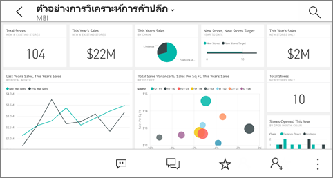
3. ปัดขึ้นหรือลงเพื่อดูไทล์ทั้งหมดในแดชบอร์ดSwipe up and down to see all the tiles in the dashboard. คุณสามารถ:You can:
   
   * [แตะไทล์](mobile-tiles-in-the-mobile-apps.md)เพื่อเปิดในโหมดโฟกัส และโต้ตอบกับข้อมูล[Tap a tile](mobile-tiles-in-the-mobile-apps.md) to open it in focus mode and interact with it.
   * แตะดาว  เพื่อ [ทำให้เป็นรายการโปรด](mobile-apps-favorites.md)Tap the star  to [make it a favorite](mobile-apps-favorites.md).
   * แตะ **เชิญ**  เพื่อ [เชิญเพื่อนร่วมงาน](mobile-share-dashboard-from-the-mobile-apps.md) ดูแดชบอร์ดของคุณTap **Invite**  to [invite a colleague](mobile-share-dashboard-from-the-mobile-apps.md) to view your dashboard.
   * [ซิงค์แดชบอร์ดกับ Apple Watch ของคุณ](mobile-apple-watch.md)[Sync the dashboard with your Apple Watch](mobile-apple-watch.md).
4. เมื่อต้องการกลับไปยังรายการของแดชบอร์ด แตะลูกศรที่อยู่ถัดจากชื่อแดชบอร์ด จากนั้นแตะ **พื้นที่ทำงานของฉัน**To get back to the list of dashboards, tap the arrow next to the dashboard title, then tap **My Workspace**.
   
   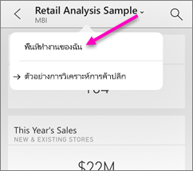

### มองแดชบอร์ดในโหมดแนวนอนใน iPhone ของคุณView dashboards in landscape mode in your iPhone
เพียงแค่หมุนโทรศัพท์ของคุณมาด้านข้างเพื่อดูแดชบอร์ดในโหมดแนวนอนบนโทรศัพท์ของคุณJust turn your phone sideways to view dashboards in landscape mode. การจัดหน้าของแดชบอร์ดจะเปลี่ยนแปลงจากชุดของไทลเป็นภาพแดชบอร์ดทั้ง&#151;คุณจะเห็นไทล์ทั้งหมดของแดชบอร์ดเหมือนกับที่ไทล์เหล่านี้อยู่ในบริการของ Power BIThe dashboard layout changes from a series of tiles to a view of the whole dashboard&#151;you see all of the dashboard's tiles just as they are in the Power BI service.

คุณสามารถใช้รูปแบบการสัมผัส "หุบนิ้ว" เมื่อต้องขยายและย่อบนพื้นที่ต่างๆ ของแดชบอร์ดของคุณ เลื่อนเพื่อนำทางนั้นYou can use the "pinch" gesture to zoom in and out on different areas of your dashboard, pan to navigate it. และคุณยังคงสามารถ[แตะไทล์](mobile-tiles-in-the-mobile-apps.md)เพื่อเปิดไทล์ในโหมดโฟกัส และโต้ตอบกับข้อมูลของคุณAnd you can still [tap a tile](mobile-tiles-in-the-mobile-apps.md) to open the tile in focus mode and interact with your data.

## ดูแดชบอร์ดบน iPad ของคุณView dashboards on your iPad
1. เปิดแอป Power BIOpen the Power BI app.
   
   ต้องการ[ดาวน์โหลดแอป iPad](https://go.microsoft.com/fwlink/?LinkId=522062) จาก Apple App Store ก่อนหรือไม่Need to [download the iPad app](https://go.microsoft.com/fwlink/?LinkId=522062) from the Apple App Store first?
2. แตะ **แดชบอร์ด** ด้านบนของแอปTap **Dashboards** at the top of the app.  
   
   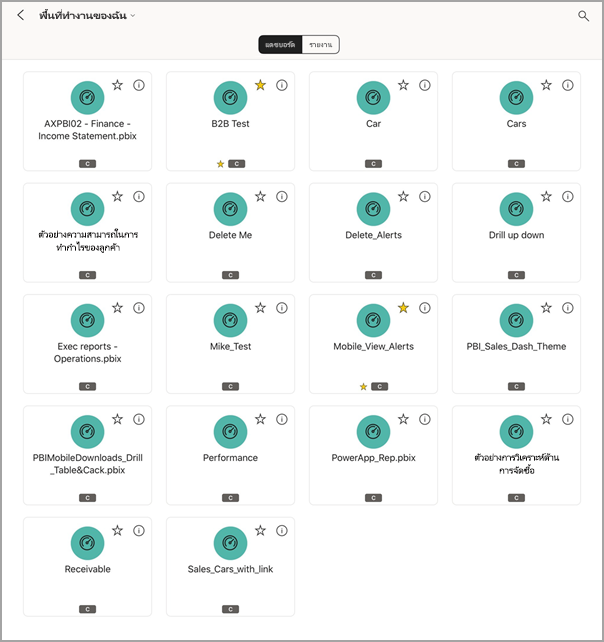
   
   * ดาวสีเหลืองThe yellow stars  แสดงแดชบอร์ดที่เป็นรายการโปรดshow which dashboards are favorites. 
   * หมายเหตุใต้ชื่อแดชบอร์ดแต่ละตัว (ในกรณีนี้คือ "MBI") :::image type="icon" source="././media/mobile-apps-view-dashboard/power-bi-dashboard-ios-medium-classification.png" border="false"::: จะแสดงวิธีการจัดประเภทข้อมูลในแต่ละแดชบอร์ด อ่านเพิ่มเติมเกี่ยวกับ[การจัดประเภทข้อมูลใน Power BI](../../create-reports/service-data-classification.md)Read more about [data classification in Power BI](../../create-reports/service-data-classification.md).
3. คุณสามารถแชร์แดชบอร์ดจากพื้นที่ทำงานของคุณYou can share a dashboard from your workspace. แตะจุดไข่ปลา ( **...** ) ที่มุมขวาล่างของไทล์แดชบอร์ด และ แตะ **เชิญบุคคลอื่น**Tap the ellipsis (**...**) in the lower-right corner of the dashboard tile, and tap **Invite Others**.
   
   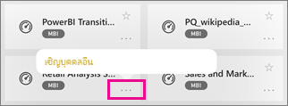
4. คุณยังสามารถแตะแดชบอร์ดเพื่อเปิด และดูไทล์ในแดชบอร์ดนั้นYou can also tap a dashboard to open it and see the tiles in that dashboard. ขณะที่อยู่บนแดชบอร์ด คุณสามารถโต้ตอบกับแดชบอร์ดได้ดังนี้:While on the dashboard you can interact with it:
   
   * [แตะไทล์เพื่อโต้ตอบ](mobile-tiles-in-the-mobile-apps.md)กับไทล์[Tap a tile to interact](mobile-tiles-in-the-mobile-apps.md) with the tile.
   * [เปิดรายงาน](mobile-reports-in-the-mobile-apps.md)เบื้องหลังไทล์[Open the reports](mobile-reports-in-the-mobile-apps.md) behind the tiles.
   * [เชิญบุคคลอื่นเพื่อดูแดชบอร์ด](mobile-share-dashboard-from-the-mobile-apps.md)[Invite others to view the dashboard](mobile-share-dashboard-from-the-mobile-apps.md).
   * [ใส่คำอธิบายประกอบ และแชร์สแนปช็อต](mobile-annotate-and-share-a-tile-from-the-mobile-apps.md)ของไทล์[Annotate and share a snapshot](mobile-annotate-and-share-a-tile-from-the-mobile-apps.md) of a tile.
5. เมื่อต้องการย้อนกลับไปยังพื้นที่ทำงานของฉัน แตะชื่อของแดชบอร์ดในมุมบนซ้าย จากนั้นแตะ **พื้นที่ทำงานของฉันMy Workspace**To go back to My Workspace, tap the name of the dashboard in the upper-left corner, then tap **My Workspace**.
   
   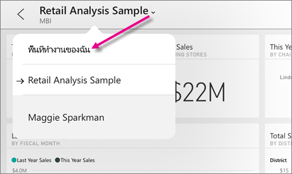

## ดูแดชบอร์ดบนโทรศัพท์ Android ของคุณView dashboards on your Android phone
1. เปิดแอป Power BI บน Android ของคุณ และลงชื่อเข้าใช้Open the Power BI app on your Android phone and sign in.
   
   ต้องการ[ดาวน์โหลดแอป Android](https://go.microsoft.com/fwlink/?LinkID=544867) ก่อนหรือไม่Need to [download the Android app](https://go.microsoft.com/fwlink/?LinkID=544867) first?
2. แตะแดชบอร์ดเพื่อเปิดTap a dashboard to open it.   
   
   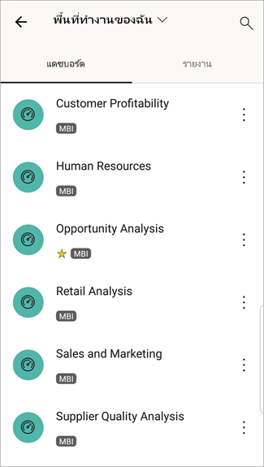

    ดาวสีเหลืองYellow stars  แสดงแดชบอร์ดที่เป็นรายการโปรดshow which dashboards are favorites. 

    หมายเหตุใต้ชื่อแดชบอร์ด (ในกรณีนี้คือ "MBI") :::image type="icon" source="././media/mobile-apps-view-dashboard/power-bi-android-dashboard-medium-classification.png" border="false"::: แสดงวิธีการจัดประเภทข้อมูลในแต่ละแดชบอร์ด อ่านเพิ่มเติมเกี่ยวกับ[การจัดประเภทข้อมูลใน Power BI](../../create-reports/service-data-classification.md)Read more about [data classification in Power BI](../../create-reports/service-data-classification.md).

    แดชบอร์ด Power BI จะมีลักษณะแตกต่างกันเล็กน้อยบน Android ของคุณPower BI dashboards look a little different on your Android phone. ไทล์ทั้งหมดจะปรากฏในขนาดเท่ากัน และถูกจัดเรียงทีละอันจากบนลงล่างAll the tiles appear the same width, and they're arranged one after another from top to bottom.

    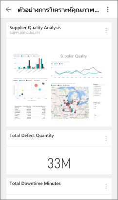

    ถ้าคุณเป็นเจ้าของแดชบอร์ด ในบริการของ Power BI คุณจะสามารถ[สร้างมุมมองแดชบอร์ดสำหรับโทรศัพท์](../../create-reports/service-create-dashboard-mobile-phone-view.md)ในโหมดแนวตั้งได้If you're the dashboard owner, in the Power BI service you can [create a view of the dashboard specifically for phones](../../create-reports/service-create-dashboard-mobile-phone-view.md) in portrait mode. 

1. ในขณะที่อยู่บนแดชบอร์ด คุณสามารถแตะที่ปุ่ม **ตัวเลือกเพิ่มเติม** แนวตั้ง (...) ถัดจากชื่อเพื่อเชิญเพื่อนร่วมงาน รีเฟรช หรือรับข้อมูลเกี่ยวกับแดชบอร์ด:While on the dashboard, you can tap the vertical **More options** (...) button next to the name to invite a colleague, refresh, or get information about the dashboard:
   
   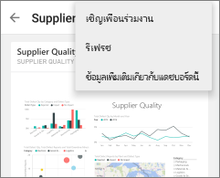
2. ปัดขึ้นหรือลงเพื่อดู[ไทล์ทั้งหมดในแดชบอร์ด](mobile-tiles-in-the-mobile-apps.md)Swipe up and down to see all the [tiles in the dashboard](mobile-tiles-in-the-mobile-apps.md). 
3. เมื่อต้องการย้อนกลับไปยังหน้าแรกของแดชบอร์ด แตะชื่อแดชบอร์ดเพื่อเปิดบันทึกการแสดงเส้นทาง จากนั้นแตะ **พื้นที่ทำงานของฉัน**To go back to the dashboards home page, tap the dashboard name to open the breadcrumb trail, then tap **My Workspace**.   

## ดูแดชบอร์ดบนแท็บเล็ต์ Android ของคุณView dashboards on your Android tablet
1. เปิดแอป Power BI บนแท็บเบล็ต Android ของคุณ และลงชื่อเข้าใช้Open the Power BI app on your Android tablet and sign in.
   
   ต้องการ[ดาวน์โหลดแอป Android](https://go.microsoft.com/fwlink/?LinkID=544867) ก่อนหรือไม่Need to [download the Android app](https://go.microsoft.com/fwlink/?LinkID=544867) first?
2. แตะแดชบอร์ดเพื่อเปิดTap a dashboard to open it.   
   
   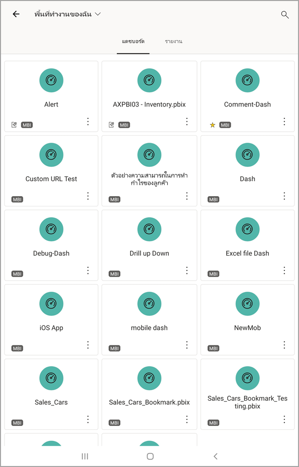
   
   * ดาวสีเหลืองThe yellow stars  แสดงแดชบอร์ดที่เป็นรายการโปรดshows which dashboards are favorites. 
   * หมายเหตุใต้ชื่อแดชบอร์ดแต่ละตัว (ในกรณีนี้คือ "MBI") :::image type="icon" source="././media/mobile-apps-view-dashboard/power-bi-android-dashboard-medium-classification.png" border="false"::: จะแสดงวิธีการจัดประเภทข้อมูลในแต่ละแดชบอร์ด อ่านเพิ่มเติมเกี่ยวกับ[การจัดประเภทข้อมูลใน Power BI](../../create-reports/service-data-classification.md)Read more about [data classification in Power BI](../../create-reports/service-data-classification.md).
3. ในขณะที่อยู่บนแดชบอร์ด คุณสามารถแตะที่ปุ่ม **ตัวเลือกเพิ่มเติม** แนวตั้ง (...) ถัดจากชื่อเพื่อเชิญเพื่อนร่วมงาน รีเฟรช หรือรับข้อมูลเกี่ยวกับแดชบอร์ด:While on the dashboard, you can tap the vertical **More options** (...) button next to the name to invite a colleague, refresh, or get information about the dashboard:
   
   
4. ปัดขึ้นหรือลงเพื่อดู[ไทล์ทั้งหมดในแดชบอร์ด](mobile-tiles-in-the-mobile-apps.md)Swipe up and down to see all the [tiles in the dashboard](mobile-tiles-in-the-mobile-apps.md). 
   
   คุณสามารถใช้รูปแบบการสัมผัส "หุบนิ้ว" เมื่อต้องขยายและย่อบนพื้นที่ต่างๆ ของแดชบอร์ดของคุณ เลื่อนเพื่อนำทางนั้นYou can use the "pinch" gesture to zoom in and out on different areas of your dashboard, pan to navigate it. และคุณยังคงสามารถ[แตะไทล์](mobile-tiles-in-the-mobile-apps.md)เพื่อเปิดไทล์ในโหมดโฟกัส และโต้ตอบกับข้อมูลของคุณAnd you can still [tap a tile](mobile-tiles-in-the-mobile-apps.md) to open the tile in focus mode and interact with your data.
5. เมื่อต้องการย้อนกลับไปยังหน้าแรกของแดชบอร์ด แตะชื่อแดชบอร์ดเพื่อเปิดบันทึกการแสดงเส้นทาง จากนั้นแตะ **พื้นที่ทำงานของฉัน**To go back to the dashboards home page, tap the dashboard name to open the breadcrumb trail, then tap **My Workspace**:
   
    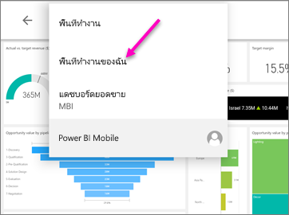

    คุณสามารถใช้รูปแบบการสัมผัส "หุบนิ้ว" เมื่อต้องขยายและย่อบนพื้นที่ต่างๆ ของแดชบอร์ดของคุณ เลื่อนเพื่อนำทางนั้นYou can use the "pinch" gesture to zoom in and out on different areas of your dashboard, pan to navigate it. และคุณยังคงสามารถ[แตะไทล์](mobile-tiles-in-the-mobile-apps.md)เพื่อเปิดไทล์ในโหมดโฟกัส และโต้ตอบกับข้อมูลของคุณAnd you can still [tap a tile](mobile-tiles-in-the-mobile-apps.md) to open the tile in focus mode and interact with your data.

## สร้างมุมมองแดชบอร์ดสำหรับโทรศัพท์ในบริการของ Power BICreate a phone view of a dashboard in the Power BI service
ถ้าคุณเป็นเจ้าของแดชบอร์ด ในบริการของ *Power BI คุณจะสามารถสร้างมุมมองแดชบอร์ดสำหรับโทรศัพท์* ในโหมดแนวตั้งได้If you're the dashboard owner, *in the Power BI service* you can create a view of the dashboard specifically for phones in portrait mode. 

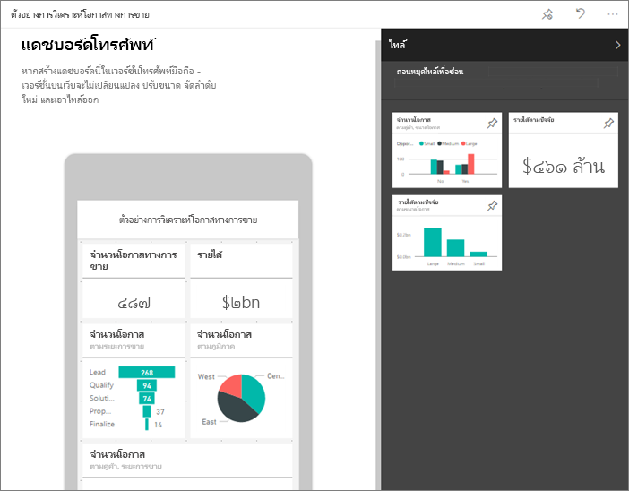

อ่านเพิ่มเติมเกี่ยวกับ[สร้างมุมมองแดชบอร์ด](../../create-reports/service-create-dashboard-mobile-phone-view.md)สำหรับโทรศัพท์Read more about [creating a phone view of a dashboard](../../create-reports/service-create-dashboard-mobile-phone-view.md).

## ขั้นตอนถัดไปNext steps
* [ดาวน์โหลดแอป Android](https://go.microsoft.com/fwlink/?LinkID=544867)จาก Google play[Download the Android app](https://go.microsoft.com/fwlink/?LinkID=544867) from Google play  
* [เริ่มต้นใช้งานแอป Android สำหรับ Power BIGet started with the Android app for Power BI](mobile-android-app-get-started.md)  
* [Power BI คืออะไรWhat is Power BI?](../../fundamentals/power-bi-overview.md)
* มีคำถามหรือไม่Questions? [ลองถามชุมชน Power BITry asking the Power BI Community](https://community.powerbi.com/)
