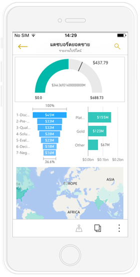
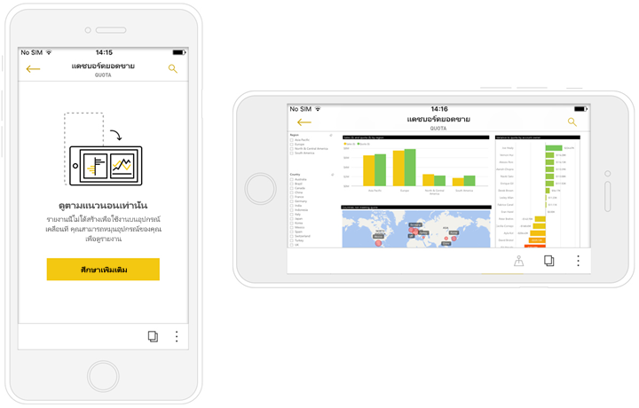
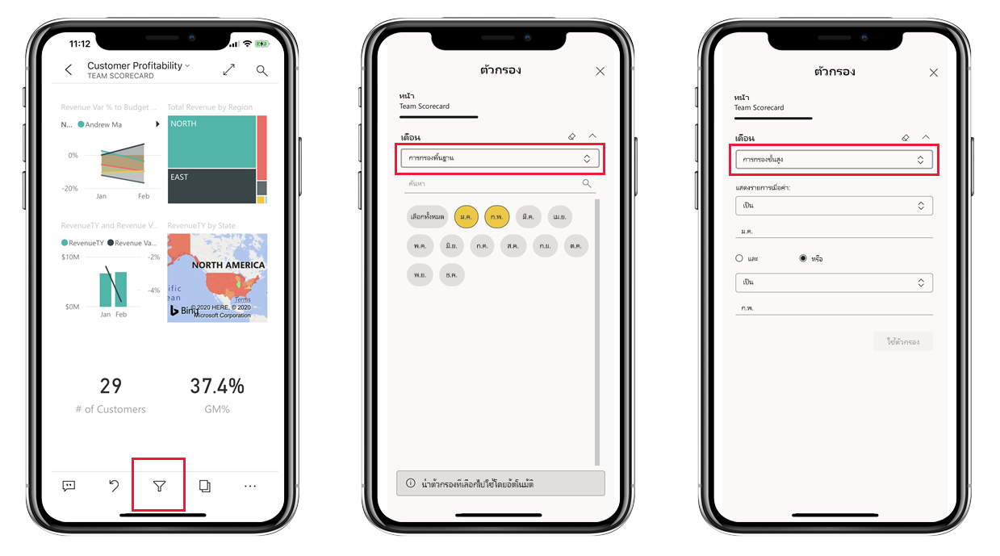
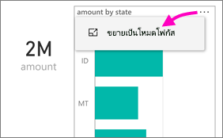
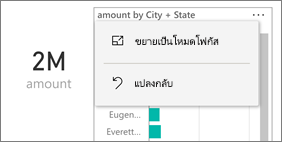
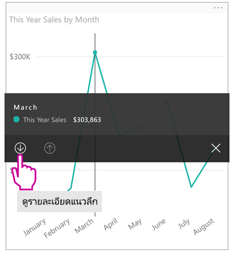
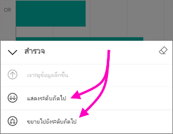
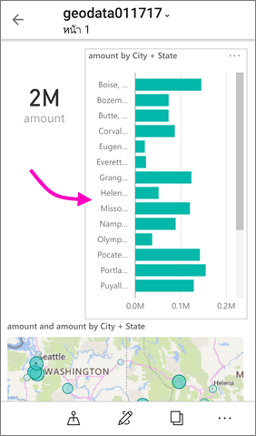
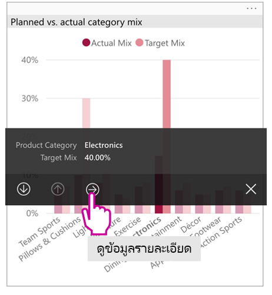
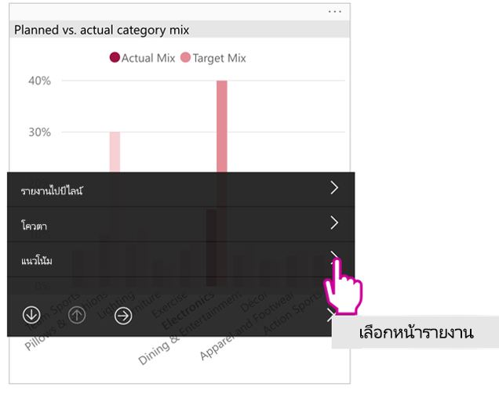

# ดูรายงาน Power BI ที่ปรับให้เหมาะสมกับมือถือของคุณView Power BI reports optimized for your phone

นำไปใช้กับ:Applies to:

|  |  |
|:--- |:--- |
| iPhonesiPhones |โทรศัพท์ AndroidAndroid phones |

เมื่อคุณดูรายงาน Power BI บนโทรศัพท์ของคุณ Power BI จะตรวจสอบเพื่อดูว่ามีการปรับรายงานให้เหมาะสมสำหรับโทรศัพท์หรือไม่When you view a Power BI report on your phone, Power BI checks to see if the report has been optimized for phones. ซึ่งหากมี Power BI จะเปิดรายงานที่ปรับให้เหมาะสมแล้วเป็นมุมมองแนวตั้งโดยอัตโนมัติIf it has, Power BI automatically opens the optimized report in portrait view.

ถ้าไม่มีรายงานที่ปรับให้เหมาะสมกับมือถือ รายงานยังคงเปิด แต่ในมุมมองแนวนอนที่ไม่ได้ปรับให้เหมาะสมIf a phone-optimized report doesn't exist, the report still opens, but in the non-optimized landscape views. แม้ว่าในรายงานปรับให้เหมาะสมกับมือถือ ถ้าคุณหมุนมือถือของคุณมาเป็นแนวนอน รายงานจะเปิดขึ้นในเค้าโครงเดิม ที่ยังไม่ได้ปรับให้เหมาะสมEven in a phone-optimized report, if you turn your phone sideways, the report opens in the non-optimized view with the original report layout. ถ้ามีเพียงบางหน้าที่ปรับให้เหมาะสม คุณจะเห็นข้อความในมุมมองแนวตั้ง ระบุว่า มีรายงานในแนวนอนIf only some pages are optimized, you see a message in portrait view, indicating the report is available in landscape.

คุณลักษณะทั้งหมดอื่น ๆ ของรายงาน Power BI ยังคงทำงานในรายงานที่ปรับให้เหมาะสมกับมือถือAll the other features of Power BI reports still work in phone-optimized reports. อ่านเพิ่มเติมเกี่ยวกับสิ่งที่คุณสามารถทำได้ใน:Read more about what you can do in:

* [รายงานบน iPhones](mobile-reports-in-the-mobile-apps.md)[Reports on iPhones](mobile-reports-in-the-mobile-apps.md). 
* [รายงานบนมือถือ Android](mobile-reports-in-the-mobile-apps.md)[Reports on Android phones](mobile-reports-in-the-mobile-apps.md).

## กรองหน้ารายงานบนมือถือของคุณFilter the report page on a phone
ถ้ารายงานที่ปรับให้เหมาะสมกับมือถือ มีตัวกรองกำหนดไว้ เมื่อคุณดูรายงานนั้นบนมือถือของคุณ คุณสามารถใช้ตัวกรองเหล่านั้นIf a phone-optimized report has filters defined, when you view the report on a phone you can use those filters. ระบบจะเปิดรายงานในมือถือของคุณโดยกรองรายงานตามค่าของรายงานในเว็บThe report opens on your phone, filtered to the values being filtered in the report on the web. คุณจะเห็นข้อความที่บอกว่า มีตัวกรองที่ใช้งานอยู่บนหน้านั้นYou see a message that there are active filters on the page. คุณสามารถเปลี่ยนตัวกรองบนมือถือของคุณYou can change the filters on your phone.

1. แตะไอคอนตัวกรองTap the filter icon  ที่ด้านล่างของหน้าat the bottom of the page.

2. ใช้การกรองพื้นฐานหรือขั้นสูง เพื่อดูผลลัพธ์ที่คุณสนใจUse basic or advanced filtering to see the results you're interested in.
   
    

## การไฮไลต์เชื่อมโยงวิชวลCross-highlight visuals
การไฮไลต์เชื่อมโยงการแสดงผลด้วยภาพในมุมมองแนวตั้งจะทำงานเช่นเดียวกันกับในบริการของ Power BI และบนมือถือในมุมมองแนวนอน: เมื่อคุณเลือกข้อมูลในวิชวลหนึ่ง วิชวลจะเน้นข้อมูลที่เกี่ยวข้องกันในวิชวลอื่นบนหน้านั้นCross highlighting visuals in portrait view works the way it does in the Power BI service, and on phones in landscape view: When you select data in one visual, it highlights related data in the other visuals on that page.

อ่านเพิ่มเติมเกี่ยวกับ[การกรอง และไฮไลต์ใน Power BI](../../create-reports/power-bi-reports-filters-and-highlighting.md)Read more about [filtering and highlighting in Power BI](../../create-reports/power-bi-reports-filters-and-highlighting.md).

## การเลือกวิชวลSelect visuals
ในรายงานมือถือ เมื่อคุณเลือกวิชวล รายงานจะไฮไลต์วิชวลนั้น โฟกัสไปที่วิชวล หยุดรูปแบบการสัมผัสบนพื่นที่ทำงานIn phone reports when you select a visual, the phone report highlights that visual and focuses on it, neutralizing canvas gestures.

ด้วยวิชวลที่เลือก คุณสามารถทำสิ่งต่าง ๆ เช่น การเลื่อนภายในวิชวลWith the visual selected, you can do things like scroll within the visual. เมื่อต้องการยกเลิกการเลือกวิชวล เพียงแตะที่ใดก็ได้นอกบริเวณวิชวลTo de-select a visual, just touch anywhere outside the visual area.

## เปิดวิชวลในโหมดโฟกัสOpen visuals in focus mode
และรายงานบนโทรศัพท์ก็มีโหมดโฟกัสด้วยเช่นกัน: คุณจะมีมุมมองการแสดงผลด้วยภาพเดี่ยวที่ใหญ่ขึ้น ทำให้อ่านได้ง่ายขึ้นPhone reports also offer a focus mode: You get a bigger view of a single visual and explore it more easily.

* ในรายงานมือถือ แตะที่จุดไข่ปลา ( **...** ) ในมุมบนขวาของวิชวล > **ขยายเป็นโหมดโฟกัส**In a phone report, tap the ellipsis (**...**) in the upper-right corner of a visual  > **Expand to focus mode**.
  
    

สิ่งที่คุณทำในโหมดโฟกัสจะมีผลต่อพื้นที่รายงานและในทางกลับกันด้วยWhat you do in focus mode carries over to the report canvas and vice versa. เช่น ถ้าคุณไฮไลต์ค่าในการแสดงผลด้วยภาพแล้วกลับไปยังรายงานทั้งหมด รายงานจะถูกกรองด้วยค่าที่คุณไฮไลต์ในการแสดงผลด้วยภาพFor example, if you highlight a value in a visual, then return to the whole report, the report is filtered to the value you highlighted in the visual.

การดำเนินการบางอย่างทำได้เฉพาะโหมดโฟกัส เนื่องจากข้อจำกัดของขนาดหน้าจอ:Some actions are only possible in focus mode, due to screen size constraints:

* **ดูรายละเอียดแนวลึก** ลงในข้อมูลที่แสดงในวิชวล**Drill down** into the information displayed in a visual. อ่านเพิ่มเติมเกี่ยวกับ[ดูรายละเอียดแนวลึกและกลับขึ้นไป](mobile-apps-view-phone-report.md#drill-down-in-a-visual)ในรายงานมือถือ ทางด้านล่างRead more about [drilling down and up](mobile-apps-view-phone-report.md#drill-down-in-a-visual) in a phone report, below.
* **เรียงลำดับ** ค่าในวิชวล**Sort** the values in the visual.
* **แปลงกลับ**: ล้างขั้นตอนที่คุณสำรวจบนวิชวล และแปลงกลับเป็นการตั้งค่าเมื่อรายงานถูกสร้างขึ้น**Revert**: Clear exploration steps you've taken on a visual and revert to the definition set when the report was created.
  
    เมื่อต้องล้างการสำรวจทั้งหมดจากวิชวล แตะที่จุดไข่ปลา ( **...** ) > **แปลงกลับ**To clear all exploration from a visual, tap the ellipsis (**...**) > **Revert**.
  
    
  
    การแปลงกลับที่อยู่ในระดับรายงาน จะเป็นการล้างการสำรวจภาพทั้งหมด หรือที่ระดับภาพ จะเป็นการล้างการสำรวจเฉพาะภาพที่เลือกไว้Revert is available at the report level, clearing exploration from all visuals, or at the visual level, clearing exploration from the selected visual.   

## การดูรายละเอียดแนวลึกในวิชวลDrill down in a visual
ถ้ามีกำหนดระดับลำดับชั้นในวิชวล คุณสามารถเจาะลึกในข้อมูลวิชวลที่ละเอียดขึ้น แล้วย้อนกลับขึ้นมาได้If hierarchy levels are defined in a visual, you can drill down into the detailed information displayed in a visual, then back up. คุณ[เพิ่มการเจาะลึกลงในภาพ](../end-user-drill.md)ในบริการของ Power BI หรือ ใน Power BI DesktopYou [add drill-down to a visual](../end-user-drill.md) either in the Power BI service or in Power BI Desktop.

ระบบจะมีการดูรายละเอียดแนวลึกอยูไม่กี่ประเภท:There are few types of drill-down:

### การดูค่าในรายละเอียดแนวลึกDrill down on a value
1. แตะจุดข้อมูลในการแสดงผลด้วยภาพค้างไว้ (แตะค้าง)Long tap (tap and hold) on a data point in a visual.
2. ToolTip จะปรากฎขึ้นมา ซึ่งหากมีการกำหนดลำดับชั้นไว้ ส่วนท้ายของ tooltip จะแสดงรายละเอียดแนวลึกและลูกศรขึ้นให้เห็นTooltip will show up, and if hierarchy is defined, then the tooltip footer will show drill down and up arrow.
3. แตะที่ลูกศรลงเพื่อดูรายละเอียดแนวลึกTap on the down arrow for drill-down

    
    
4. แตะที่ลูกศรขึ้นเพื่อดูรายละเอียดแนวลึกTap on the up arrow for drill-up.

### ดููแนวลึกไปยังระดับถัดไปDrill to next level
1. ในรายงานบนมือถือ แตะที่จุดไข่ปลา ( **...** ) ในมุมบนขวา > **ขยายเป็นโหมดโฟกัส**In a report on a phone, tap the ellipsis (**...**) in the upper-right corner > **Expand to focus mode**.
   
    
   
    ในตัวอย่างนี้ แท่ง แสดงค่าของแต่ละรัฐIn this example, the bars show the values for states.
2. แตะไอคอนสำรวจTap the explore icon  ที่ด้านล่างซ้ายin the lower left.
   
    
3. แตะ **แสดงระดับถัดไป** หรือ **ขยายไปยังระดับถัดไป**Tap **Show next level** or **Expand to next level**.
   
    
   
    ขณะนี้ แท่งแสดงค่าของแต่ละเมืองNow the bars show the values for cities.
   
    
4. ถ้าคุณแตะลูกศรที่มุมบนซ้าย คุณกลับไปรายงานมือถือ ด้วยค่าที่ยังคงขยายไประดับต่ำกว่าIf you tap the arrow in the upper-left corner, you return to the phone report with the values still expanded to the lower level.
   
    
5. เมื่อต้องการกลับไปที่ระดับเดิม แตะจุดไข่ปลา ( **...** ) อีกครั้ง > **แปลงกลับ**To go back up to the original level, tap the ellipsis (**...**) again > **Revert**.
   
    

## ดูรายละเอียดแนวลึกจากค่าDrill through from a value
ดูข้อมูลรายละเอียดจากค่าที่เชื่อมต่อกันระหว่างหน้ารายงานหนึ่งกับหน้ารายงานอื่นDrill through connects values in one report page, with other report pages. เมื่อคุณดูข้อมูลรายละเอียดจากจุดข้อมูลไปยังหน้ารายงานอื่น ค่าของจุดข้อมูลจะถูกนำไปใช้เพื่อกรองการดูข้อมูลรายละเอียดผ่านหน้าหรือจะอยู่ในบริบทของข้อมูลที่เลือกไว้When you drill through from a data point to another report page, the data point values are used to filter the drilled through page, or it will be in the context of the selected data.
ผู้เขียนรายงานสามารถ[กำหนดการดูข้อมูลรายละเอียด](../../create-reports/desktop-drillthrough.md)ได้เมื่อสร้างรายงานReport authors can [define drill through](../../create-reports/desktop-drillthrough.md) when they create the report.

1. แตะจุดข้อมูลในการแสดงผลด้วยภาพค้างไว้ (แตะค้าง)Long tap (tap and hold) on a data point in a visual.
2. ToolTip จะปรากฎขึ้นมา ซึ่งหากมีการกำหนดการดูข้อมูลรายละเอียดไว้ ส่วนท้ายของ tooltip จะแสดงลูกศรการดูข้อมูลรายละเอียดให้เห็นTooltip will show up, and if drill through is defined, then the tooltip footer will show drill through arrow.
3. แตะที่ลูกศรเพื่อดูข้อมูลรายละเอียดTap on the arrow for drill through

    

4. เลือกหน้ารายงานที่จะดูข้อมูลรายละเอียดChoose which report page to drill through

    

5. ใช้ปุ่มย้อนกลับที่ส่วนหัวของแอปเพื่อย้อนกลับไปยังหน้าเว็บที่คุณเริ่มต้นUse the back button, at the app header to go back to the page you started from.

## ขั้นตอนถัดไปNext steps
* [สร้างรายงานที่ปรับให้เหมาะสมสำหรับแอป Power BI ในอุปกรณ์มือถือCreate reports optimized for the Power BI mobile apps](../../create-reports/desktop-create-phone-report.md)
* [สร้างมุมมองโทรศัพท์สำหรับแดชบอร์ดใน Power BICreate a phone view of a dashboard in Power BI](../../create-reports/service-create-dashboard-mobile-phone-view.md)
* [สร้างวิชวลแบบตอบสนองที่ปรับให้เหมาะสมกับทุกขนาดCreate responsive visuals optimized for any size](../../visuals/power-bi-report-visualizations.md)
* มีคำถามเพิ่มเติมหรือไม่More questions? [ลองถามชุมชน Power BITry asking the Power BI Community](https://community.powerbi.com/)