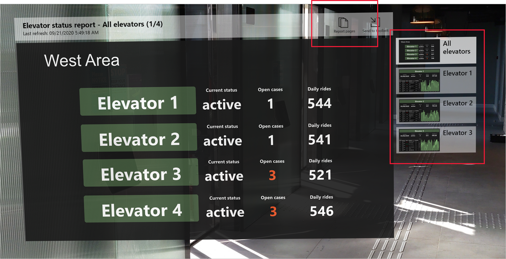

# Power BI สำหรับ HoloLens 2 (ตัวอย่าง)Power BI for HoloLens 2 (preview)
แอป Power BI สำหรับ HoloLens 2 จะผสมผสานรายงานและแดชบอร์ด Power BI ของคุณเข้ากับสภาพแวดล้อมในโลกจริงของคุณเพื่อสร้างประสบการณ์แบบ 3D ที่ล้ำลึกและเป็นระบบแฮนด์ฟรี โดยที่คุณสามารถเคลื่อนที่ผ่านโลกจริงและสามารถรับข้อมูลที่จำเป็นในสถานที่และในเวลาที่คุณต้องการThe Power BI app for HoloLens 2 blends your Power BI reports and dashboards with your physical environment to create a 3D, immersive, hands-free experience where you can move through the physical world and get your relevant data when and where you need it.

## รับแอป Power BI สำหรับ HoloLens 2Get the Power BI app for HoloLens 2 

แอป Power BI สำหรับ HoloLens 2 จะพร้อมใช้งานจาก [Microsoft Store](https://go.microsoft.com/fwlink/?linkid=526478)The Power BI app for HoloLens 2 is available from the [Microsoft Store](https://go.microsoft.com/fwlink/?linkid=526478).

แอปทำงานร่วมกับการลงชื่อเพียงครั้งเดียว ซึ่งหมายความว่าแอปใช้ข้อมูลประจำตัวของผู้ใช้ที่ลงชื่อเข้าใช้อุปกรณ์ HoloLens 2 เพื่อรับรองความถูกต้องเทียบกับบริการ Power BIThe app works with single sign on, meaning that the app uses the identity of the user currently signed in to the HoloLens 2 device to authenticate against the Power BI service.

[เรียนรู้เพิ่มเติม](/hololens/holographic-store-apps) เกี่ยวกับการติดตั้งแอปบนอุปกรณ์ HoloLens 2 ของคุณ[Learn more](/hololens/holographic-store-apps) about installing apps on your HoloLens 2 device.

## เปิดแอป Power BI บน HoloLens 2 ของคุณOpen the Power BI app on your HoloLens 2

เปิดเมนู **เริ่ม** และเลือกแอป Power BIOpen the **Start** menu and select the Power BI app. แอปจะเปิดขึ้นโดยมีรายงานและแดชบอร์ดที่ชื่นชอบของคุณทั้งหมดที่โหลดลงในชุดเครื่องมือเสมือนของคุณไว้แล้ว ซึ่งคุณสามารถเลือกดูThe app will open with all your favorited reports and dashboards loaded into your virtual toolbelt, where you can select them for viewing.

## การใช้แอป Power BI สำหรับ HoloLens 2Using the Power BI app for HoloLens 2

คุณสามารถใช้ระบบสัญญาณมือและการจับทิศทางดวงตาของ HoloLens 2 เพื่อปรับขนาด วาง และโต้ตอบกับเนื้อหา Power BI ของคุณYou use the HoloLens 2 hand gestures and eye tracking to resize, place, and interact with your Power BI content. [เรียนรู้เพิ่มเติม](/hololens/hololens2-basic-usage) เกี่ยวกับการโต้ตอบกับวัตถุในโลกของ HoloLens 2[Learn more](/hololens/hololens2-basic-usage) about interacting with objects in the HoloLens 2 world.

### เข้าถึงรายงานและแดชบอร์ดAccess reports and dashboards

หากต้องการเข้าถึงรายงานหรือแดชบอร์ด ให้ดึงข้อมูลออกจากชุดเครื่องมือเสมือนของคุณและวางไว้ในตำแหน่งตามที่คุณต้องการTo access a report or dashboard, grab it out of your virtual toolbelt and position it where you want. [เรียนรู้เพิ่มเติม](/hololens/hololens2-basic-usage#moving-holograms) เกี่ยวกับหยิบและการจัดตำแหน่งหน้าต่างแอป[Learn more](/hololens/hololens2-basic-usage#moving-holograms) about grabbing and positioning app windows.

ต้องปรับรายงานหรือแดชบอร์ดให้เป็นรายการโปรดจึงจะอยู่ในชุดเครื่องมือเสมือนของคุณTo be in your virtual toolbelt, a report or dashboard must be marked as a favorite. ถ้าคุณไม่มีรายงานหรือแดชบอร์ดใด ๆ ในชุดเครื่องมือของคุณ หรือหากคุณต้องการเพิ่มรายงานและแดชบอร์ด เพียงแค่ทำเครื่องหมายรายการเหล่านั้นให้เป็นรายการโปรดใน [Power BI service](../end-user-favorite.md) หรือ [Power BI mobile apps](mobile-apps-favorites.md)If you don’t have any reports or dashboards in your toolbelt, or if you want to add additional reports and dashboards, simply mark those items as favorites in either the [Power BI service](../end-user-favorite.md) or the [Power BI mobile apps](mobile-apps-favorites.md). ซึ่งจากนั้นจะพร้อมใช้งานในชุดเครื่องมือเสมือนของ Power BI ของคุณใน HoloLens 2They will then be available in your Power BI virtual toolbelt in HoloLens 2.

### ปรับขนาดรายงานและแดชบอร์ดResize reports and dashboards

หากต้องการปรับขนาดรายงานหรือแดชบอร์ด ให้หยิบข้อมูลด้วยจุดจับปรับขนาดที่ปรากฏบนมุมของหน้าต่างแอปและปรับขนาดตามที่ต้องการTo resize a report or dashboard, grab it by the resize handles that appear on the corners of the app window and adjust the size as desired. [เรียนรู้เพิ่มเติม](/hololens/hololens2-basic-usage#resizing-holograms) เกี่ยวกับการปรับขนาดหน้าต่างของแอป[Learn more](/hololens/hololens2-basic-usage#resizing-holograms) about resizing app windows.

### จัดตำแหน่งรายงานและแดชบอร์ดในพื้นที่Position reports and dashboards in space

เมื่อต้องการจัดตำแหน่งรายงานหรือแดชบอร์ดของคุณในพื้นที่ ให้หยิบข้อมูลด้วยการบีบนิ้วชี้และนิ้วโป้งของคุณเข้าหาแถบชื่อเรื่องค้างไว้ และจากนั้นให้ย้ายมือของคุณไปยังตำแหน่งที่ต้องการTo position your report or dashboard in space, grab it by pinching your index finger and thumb on its title bar and then, without letting go, move your hand to the desired position. ปล่อยนิ้วของคุณเมื่อคุณได้ตำแหน่งที่ต้องการแล้วRelease your fingers when you’ve got it to the desired place. [เรียนรู้เพิ่มเติม](/hololens/hololens2-basic-usage#moving-holograms) เกี่ยวกับการย้ายหน้าต่างของแอป[Learn more](/hololens/hololens2-basic-usage#moving-holograms) about moving app windows.

เมื่อคุณวางรายงานหรือแดชบอร์ดของคุณในตำแหน่งที่คุณต้องการแล้ว อุปกรณ์ HoloLens 2 ของคุณจะจดจำตำแหน่งที่ตั้งนี้ในสภาพแวดล้อมนั้นOnce you’ve placed your report or dashboard where you want it, your HoloLens 2 device remembers its location in the environment. เมื่อคุณเข้าสู่สถานที่นี้อีกครั้ง คุณจะพบว่าไฟล์ที่คุณวางไว้อยู่ในตำแหน่งเดิมWhen you next visit the same place, you’ll find the item you placed in exactly the same location.

### ค้นหน้ารายงานBrowse report pages

แต่ละรายงานจะมีดัชนีหน้า ซึ่งคุณสามารถแสดงเพื่อให้สามารถข้ามจากหน้าหนึ่งไปยังอีกหน้าหนึ่งEach report has a page index that you can display in order to get from page to page. เลือกปุ่ม **ดัชนีหน้า** ในมุมบนขวาของหน้าต่างรายงานเพื่อแสดงหรือซ่อนดัชนีหน้าSelect the **Page Index** button in the upper right corner of the report window to display or hide the page index.

### เปิดรายงานที่มีรหัส QROpen reports with QR codes

ถ้ามีการสร้างคิวอาร์โค้ดสำหรับรายงานและติดไว้กับสิ่งของอย่างใดอย่างหนึ่ง เช่น ชิ้นส่วนของอุปกรณ์ที่มีข้อมูลอยู่ในรายงานนั้น คุณสามารถเปิดรายงานได้เพียงแค่มองดูที่คิวอาร์โค้ดบนรายการIf a QR code has been created for a report and attached to an item, such as a piece of equipment whose data is contained in that report, you can open the report merely by looking at the QR code on the item.

[เรียนรู้เพิ่มเติม](../../create-reports/service-create-qr-code-for-report.md) เกี่ยวกับการสร้างคิวอาร์โค้ดสำหรับรายงาน[Learn more](../../create-reports/service-create-qr-code-for-report.md) about creating QR codes for reports.

### การรีเฟรชข้อมูลData refresh

รายงานและแดชบอร์ดจะทำการอัปเดตในขณะที่คุณกำลังใช้แอป ดังนั้นถ้ามีการเปลี่ยนแปลงข้อมูลใน Power BI ในขณะที่คุณกำลังใช้แอป คุณจะเห็นว่าการเปลี่ยนแปลงเหล่านั้นปรากฏในรายงานและแดชบอร์ดที่คุณกำลังดูอยู่Reports and dashboards update while you’re using the app, so if data changes in Power BI while you’re using the app, you’ll see those changes reflected in the reports and dashboards you’re viewing.

## ขั้นตอนถัดไปNext steps

* [ทำความรู้จัก HoloLens 2Getting around HoloLens 2](/hololens/hololens2-basic-usage)