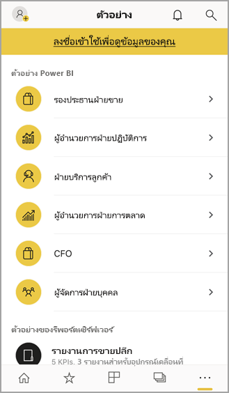

# เริ่มต้นใช้งานแอปอุปกรณ์เคลื่อนที่ Power BI สำหรับ IOSGet started with the Power BI mobile app on iOS devices
Microsoft Power BI สำหรับ iOS บน iPhone บนi iPad ส่งมอบประสบการณ์ BI สำหรับอุปกรณ์เคลื่อนที่สำหรับ Power BI เซิร์ฟเวอร์รายงาน Power BI และ Reporting ServicesThe Microsoft Power BI for iOS app on the iPhone and iPad delivers the mobile BI experience for Power BI, Power BI Report Server, and Reporting Services. ดูและโต้ตอบกับแดชบอร์ดของบริษัทของคุณ ภายในองค์กรและในคลาวด์ จากที่ใดก็ได้ ผ่านอุปกรณ์เคลื่อนที่ ที่รองรับระบบสัมผัสและดูข้อมูลสดได้View and interact with your company dashboards on premises and in the cloud from anywhere, with live, touch-enabled mobile access. สำรวจข้อมูลในแดชบอร์ดและแชร์กับเพื่อนร่วมงานของคุณผ่านอีเมลหรือการส่งข้อความExplore the data in dashboards, and share with your colleagues in email or text messages. และอัปเดตอยู่เสมอ ด้วยข้อมูลของคุณมากที่สุดตามระยะเวลาในของคุณ[Apple Watch](mobile-apple-watch.md)And keep up to date with your most timely data on your [Apple Watch](mobile-apple-watch.md).  

คุณสร้างรายงาน Power BI ใน Power BI Desktop และเผยแพร่:You create Power BI reports in Power BI Desktop, and publish them:

* [เผยแพร่ไปยังบริการของ Power BI](../../fundamentals/service-get-started.md) และสร้างแดชบอร์ด[Publish them to the Power BI service](../../fundamentals/service-get-started.md), and create dashboards.
* [เผยแพร่ภายในองค์กรไปยัง เซิร์ฟเวอร์รายงาน Power BI](../../report-server/quickstart-create-powerbi-report.md)[Publish them on premises to Power BI Report Server](../../report-server/quickstart-create-powerbi-report.md).

จากนั้น ในแอปอุปกรณ์เคลื่อนที่ Power BI สำหรับ IOS คุณจะโต้ตอบกับแดชบอร์ดและรายงานของคุณ ไม่ว่าจะอยู่ภายในองค์กรหรืออยู่ในระบบคลาวด์Then in the Power BI mobile app for iOS, you interact with your dashboards and reports, whether on premises or in the cloud.

ดูว่า[มีอะไรใหม่ในแอป Power BI สำหรับอุปกรณ์เคลื่อนที่](mobile-whats-new-in-the-mobile-apps.md)Find out [what's new in the Power BI mobile apps](mobile-whats-new-in-the-mobile-apps.md).

## ดาวน์โหลดแอปDownload the app
[ดาวน์โหลดแอป iOS](https://go.microsoft.com/fwlink/?LinkId=522062 "ดาวน์โหลดแอป iOS") จากร้าน Apple App Store ไปยัง iPad หรือ iPhone ของคุณ[Download the iOS app](https://go.microsoft.com/fwlink/?LinkId=522062 "Download the iOS app")  from the Apple App Store to your iPhone or iPad.

คุณสามารถเรียกใช้แอปอุปกรณ์เคลื่อนที่ Power BI สำหรับ iOS บนอุปกรณ์ใดก็ตามที่ใช้ iOS 11 หรือใหม่กว่าYou can run the Power BI mobile app for iOS on any device running iOS 11 or later. 

## ลงชื่อออกจากบริการ Power BISign up for the Power BI service
ถ้าคุณยังไม่ได้ลงทะเบียน ไปที่ [powerbi.com](https://powerbi.microsoft.com/get-started/) และด้านล่าง **Power BI - การทำงานร่วมกันและการแชร์บนระบบคลาวด์** เลือก **ทดลองใช้ฟรี**If you haven't already signed up, go to [powerbi.com](https://powerbi.microsoft.com/get-started/), and under **Power BI - Cloud collaboration and sharing**, select **Try free**.

## เริ่มต้นใช้งานแอป Power BIGet started with the Power BI app
1. บนอุปกรณ์ IOS ของคุณ่ เปิดแอป Power BIIn your iOS device, open the Power BI app.
2. หากต้องการลงชื่อเข้าใช้ Power BI ให้แตะแท็บ **Power BI** และกรอกรายละเอียดการลงชื่อเข้าใช้ของคุณTo sign in to Power BI, tap the **Power BI** tab and fill in your sign-in details.  
   หากต้องการลงชื่อเข้าใช้รายงานมือถือและ KPI ของ Reporting Services ของคุณให้แตะแท็บ **เซิร์ฟเวอร์รายงาน** และกรอกรายละเอียดการลงชื่อเข้าใช้ของคุณTo sign in to your Reporting Services mobile reports and KPIs, tap the **Report server** tab and fill in your sign-in details.
   
   
   
   เมื่อคุณอยู่ในแอป เพียงแตะที่รูปโปรไฟล์บัญชีในมุมบนซ้ายของหน้าจอของคุณ เพื่อสลับไปมาระหว่าง Power BI กับเซิร์ฟเวอร์รายงานของคุณWhen you're in the app, just tap the account profile image in the upper left corner of your screen to switch between Power BI and your report server. 

## ลองใช้ตัวอย่าง Power BI และ Reporting ServicesTry the Power BI and Reporting Services samples
แม้ว่าจะยังไม่ลงทะเบียน คุณสามารถดูและโต้ตอบกับตัวอย่าง Power BI และ Reporting Services ได้Even without signing up, you can view and interact with the Power BI and Reporting Services samples.

หากต้องการเข้าถึงตัวอย่าง ให้แตะ **ตัวเลือกเพิ่มเติม** (...) บนแถบนำทางและเลือก **ตัวอย่าง**.To access the samples, tap **More options** (...) on the navigation bar and choose **Samples**.

จำนวนตัวอย่างของ Power BI จะตามด้วยตัวอย่างของเซิร์ฟเวอร์รายงานหลายรายการA number of Power BI samples are followed by several Report server samples.

   
   
   > [!NOTE]
   > ไม่สามารถใช้งานคุณลักษณะทั้งหมดได้ในตัวอย่างNot all features are available in the samples. ตัวอย่างเช่น คุณไม่สามารถดูรายงานตัวอย่างทีอยู่ใต้แดชบอร์ด คุณไม่สามารถแชร์ตัวอย่างกับผู้อื่นได ้และคุณไม่สามารถทำให้เป็นรายการโปรดของคุณได้For example, you can't view the sample reports that underlie the dashboards, you can't share the samples with others, and you can't make them your favorites. 
   > 
   >

## ค้นหาเนื้อหาของคุณในแอป Power BI สำหรับอุปกรณ์เคลื่อนที่Find your content in the Power BI mobile apps

แตะแว่นขยายในส่วนหัวเพื่อเริ่มค้นหาเนื้อหา Power BI ของคุณTap the magnifying glass in the header to start searching for your Power BI content.

## ดูแดชบอร์ดและรายงานโปรดของคุณView your favorite dashboards and reports
แตะ **รายการโปรด** () บนแถบนำทางเพื่อดูหน้ารายการโปรดของคุณTap **Favorites** () on the navigation bar to view your Favorites page. 

อ่านข้อมูลเพิ่มเติมเกี่ยวกับ [รายการโปรดในแอป Power BI สำหรับอุปกรณ์เคลื่อนที่](mobile-apps-favorites.md)Read more about [favorites in the Power BI mobile apps](mobile-apps-favorites.md).

## การสนับสนุนองค์กรสำหรับแอปสำหรับอุปกรณ์เคลื่อนที่ Power BIEnterprise support for the Power BI mobile apps
องค์กรสามารถใช้ Microsoft Intune เพื่อจัดการอุปกรณ์และแอปพลิเคชัน รวมถึงแอป Power BI สำหรับอุปกรณ์เคลื่อนที่ สำหรับ Android และ iOSOrganizations can use Microsoft Intune to manage devices and applications, including the Power BI mobile apps for Android and iOS.

Microsoft Intune ช่วยให้องค์กรควบคุมรายการ เช่น การบังคับใช้ Pin เพื่อเข้าใช้งาน การควบคุมวิธีจัดการกับข้อมูลโดยแอปพลิเคชัน หรือแม้แต่ารเข้ารหัสลับข้อมูลแอปพลิเคชันเมื่อไม่ได้ใช้งานMicrosoft Intune lets organizations control items like requiring an access pin, controlling how data is handled by the application, and even encrypting application data when the app isn't in use.

> [!NOTE]
> หากคุณใช้แอปอุปกรณ์เคลื่อนที่ Power BI บน iOS และองค์กรของคุณได้กำหนดค่า Microsoft Intune MAM แล้ว การรีเฟรชข้อมูลพื้นหลังจะปิดอยู่If you use the Power BI mobile app on your iOS device and your organization has configured Microsoft Intune MAM, then background data refresh is turned off. Power BI จะรีเฟรชข้อมูลจากบริการของ Power BI บนเว็บ ในครั้งต่อไปที่คุณเข้าใช้งานแอปThe next time you enter the app, Power BI refreshes the data from the Power BI service on the web.
> 

อ่านเพิ่มเติมเกี่ยวกับ[การกำหนดค่าแอปโทรศัพท์เคลื่อนที่ Power BI ด้วย Microsoft Intune](../../admin/service-admin-mobile-intune.md)Read more about [configuring Power BI mobile apps with Microsoft Intune](../../admin/service-admin-mobile-intune.md). 

## ขั้นตอนถัดไปNext steps

* [Power BI คืออะไรWhat is Power BI?](../../fundamentals/power-bi-overview.md)
* มีคำถามหรือไม่Questions? [ลองถามชุมชน Power BITry asking the Power BI Community](https://community.powerbi.com/)
