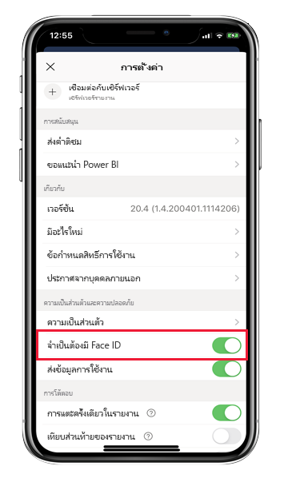
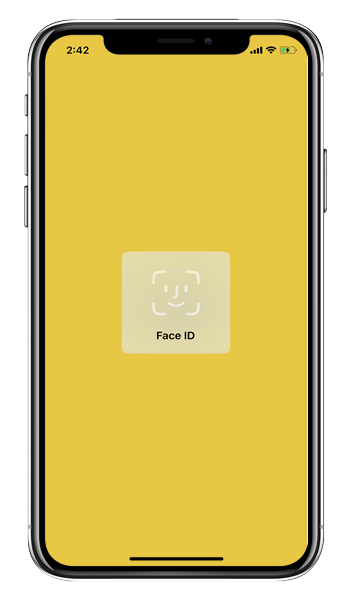
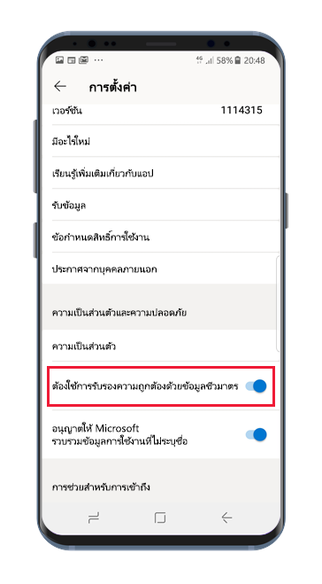
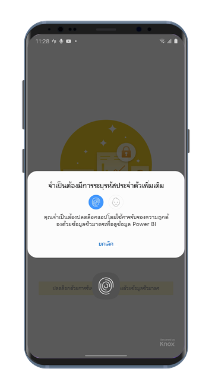

# ปกป้องแอป Power BI ด้วย Face ID, Touch ID, รหัสผ่าน หรือข้อมูลทางชีวมิติProtect Power BI app with Face ID, Touch ID, passcode, or biometric data 

ในหลายกรณี ข้อมูลที่จัดการใน Power BI จะถือเป็นความลับ และจำเป็นต้องได้รับการปกป้อง และการเข้าถึงได้โดยผู้ใช้ที่ได้รับอนุญาตเท่านั้นIn many cases, the data managed in Power BI is confidential and needs to be protected and accessed by authorized users only. 

แอป Power BI สำหรับ iOS และแอนดรอยด์ช่วยให้คุณสามารถปกป้องข้อมูลของคุณได้โดยการกำหนดค่าการระบุเพิ่มเติมThe Power BI apps for iOS and Android let you protect your data by configuring additional identification. จากนั้น ผู้ใช้จะต้องทำการยืนยันตัวตนทุกครั้งที่มีการเปิดใช้งานแอปหรือนำแอปขึ้นมาที่เบื้องหน้าThen, every time the app is launched or brought to the foreground, identification will be required. สำหรับ iOS กรณีนี้หมายความว่าคุณต้องให้ Face ID, Touch ID หรือรหัสผ่านOn iOS, this means providing Face ID, Touch ID, or a passcode. สำหรับแอนดรอยด์ กรณีนี้หมายความว่าคุณต้องให้ข้อมูลทางชีวมิติ (Fingerprint ID)On Android, it means providing biometric data (Fingerprint ID).

ใช้ได้กับ:Applies to:

|  |  |  |  |
|:--- |:--- |:--- |:--- |
|iPhonesiPhones |iPadiPads |มือถือ AndroidAndroid phones |แท็บเล็ต AndroidAndroid tablets |

## เปิด Face ID, Touch ID หรือรหัสผ่านบน iOSTurn on Face ID, Touch ID, or passcode on iOS

เพื่อใช้การยืนยันตัวตนเพิ่มเติมในแอป Power BI มือถือสำหรับ iOS ให้ไปที่การตั้งค่าแอปภายใต้ **ความเป็นส่วนตัวและการรักษาความปลอดภัย**To use additional identification in the Power BI mobile app for iOS, go to the app setting under **Privacy and Security**. คุณจะเห็นตัวเลือกในการเปิด Face ID, Touch ID หรือรหัสผ่านYou'll see the option to turn on Face ID, Touch ID, or passcode. ซึ่งตัวเลือกต่าง ๆ ที่มีจะขึ้นอยู่กับความสามารถของอุปกรณ์ของคุณThe options you see depend on the capabilities of your device.

เมื่อเปิดใช้งานการตั้งค่านี้ ทุกครั้งที่คุณเปิดใช้งานแอป Power BI หรือนำแอปขึ้นมาสู่ด้านบน ระบบจะขอให้คุณระบุ ID ของคุณก่อนที่คุณสามารถเข้าถึงแอปได้When this setting is turned on, every time you launch the app or bring it to the foreground, it will ask you to provide your ID before you can access the app.

ชนิดของ ID ที่ระบบร้องขอจากคุณจะขึ้นอยู่กับความสามารถของอุปกรณ์ของคุณThe type of ID you will be asked to provide depends on your device's capabilities. ถ้าอุปกรณ์ของคุณสนับสนุน Face ID คุณจำเป็นต้องใช้ Face IDIf your device supports Face ID, you'll need to use Face ID. ถ้าสนับสนุน Touch ID คุณจำเป็นต้องใช้ Touch IDIf it supports Touch ID, you'll need to use Touch ID. ถ้าอุปกรณ์ของคุณรองรับทั้งสองระบบ จากนั้นคุณจำเป็นต้องระบุรหัสผ่านIf neither are supported, then you'll need to provide a passcode. รูปภาพด้านล่างแสดงให้เห็นถึงหน้าจอการรับรองความถูกต้องของ Face IDThe image below shows the Face ID authentication screen.

## เปิดใช้งานข้อมูลทางชีวมิติ (Fingerprint ID) บนแอนดรอยด์Turn on biometric data (Fingerprint ID) on Android

เพื่อใช้การยืนยันตัวตนเพิ่มเติมในแอป Power BI มือถือสำหรับแอนดรอยด์ ให้ไปที่การตั้งค่าแอปภายใต้ **ความเป็นส่วนตัวและการรักษาความปลอดภัย**To use additional identification in the Power BI mobile app for Android, go to the app setting under **Privacy and Security**. คุณจะเห็นตัวเลือกเพื่อเปิดใช้งานข้อมูลทางชีวมิติYou'll see the option to turn on biometric data.

เมื่อเปิดใช้งานการตั้งค่านี้ ทุกครั้งที่คุณเปิดใช้งานแอป Power BI หรือนำแอปขึ้นมาสู่ด้านบน ระบบจะขอให้คุณระบุข้อมูลทางชีวมิติ (Fingerprint ID) ของคุณก่อนที่คุณสามารถเข้าถึงแอปได้When this setting is turned on, every time you launch the app or bring it to the foreground, it will ask you to provide your biometric data (Fingerprint ID) before you can access the app.

รูปภาพด้านล่างแสดงให้เห็นถึงหน้าจอการรับรองความถูกต้องด้วยลายนิ้วมือThe image below shows the fingerprint authentication screen.

>[!NOTE]
>เพื่อให้คุณสามารถใช้แอปสำหรับอุปกรณ์เคลื่อนที่ได้ คุณจำเป็นต้องทำการตั้งค่าการยืนยันความถูกต้องทางชีวมิติ ซึ่งคุณจะต้องตั้งค่าชีวมิติบนอุปกรณ์แอนดรอยด์ของคุณก่อนTo be able to use mobile app's  Require Biometric Authentification setting, you must first set up biometrics on your Android device. ถ้าอุปกรณ์ของคุณไม่รองรับชีวมิติ คุณจะไม่สามารถป้องกันการเข้าถึงข้อมูล Power BI ของคุณโดยใช้การตั้งค่าแอปสำหรับอุปกรณ์เคลื่อนที่นี้ได้If your device doesn't support biometrics, you will not be able to secure access to your Power BI data using this mobile app setting.
>
>ถ้าผู้ดูแลระบบของคุณได้[เปิดใช้งานการเข้าถึงจากระยะไกลแบบปลอดภัย](#mdm-enforcement-of-secure-access-to-your-power-bi-mobile-app)ของแอปสำหรับอุปกรณ์เคลื่อนที่ และคุณยังไม่ได้ตั้งค่าชีวมิติบนอุปกรณ์ของคุณเพื่อเข้าถึงแอป คุณต้องตั้งค่าดังกล่าวก่อนIf your administrator has [remotely turned on secure access](#mdm-enforcement-of-secure-access-to-your-power-bi-mobile-app) for the mobile app, you must set up biometrics on your device in order to access the app, if you haven't already done so. ถ้าอุปกรณ์ของคุณไม่รองรับชีวมิติ การตั้งค่าระยะไกลจะไม่ส่งผลกระทบใด ๆ ต่อคุณIf your device doesn't support biometrics, the remote setting will not affect you. แต่การเข้าถึงแอปของคุณจะไม่มีการรักษาความปลอดภัยใด ๆAccess to your mobile app will remain unsecured.

## MDM จะบังคับให้มีการเข้าถึงแอป Power BI บนอุปกรณ์เคลื่อนที่ของคุณอย่างปลอดภัยMDM enforcement of secure access to your Power BI mobile app.

บางองค์กรมีนโยบายด้านความปลอดภัยและข้อกำหนดการปฏิบัติตามข้อบังคับที่บังคับใช้กับการระบุเพิ่มเติมก่อนที่คุณสามารถเข้าถึงข้อมูลที่มีความละเอียดอ่อนทางธุรกิจได้Some organizations have security policies and compliance requirements that enforce additional identification before you can access business sensitive data.

เพื่อสนับสนุนเรื่องนี้ แอป Power BI สำหรับอุปกรณ์เคลื่อนช่วยให้ผู้ดูแลระบบสามารถควบคุมการตั้งค่าการเข้าถึงแอปอย่างปลอดภัย โดยเข้าใช้การตั้งค่าการกำหนดค่าแอปจาก Microsoft Intune และโซลูชันการจัดการอุปกรณ์เคลื่อนที่ (MDM) อื่นTo support this, the Power BI mobile app allows admins to control the mobile app secure access setting by pushing the app configuration settings from Microsoft Intune and other mobile device management (MDM) solutions. ผู้ดูแลระบบสามารถใช้นโยบายการปกป้องแอปเพื่อเปิดการตั้งค่านี้สำหรับผู้ใช้ทั้งหมด หรือกลุ่มของผู้ใช้Admins can use the app protection policy to turn on this setting for all users or for a group of users. คุณสามารถศึกษารายละเอียดได้ที่ [การใช้ MDM เพื่อกำหนดค่าแอป Power BI จากระยะไกลสำหรับอุปกรณ์เคลื่อนที่](mobile-app-configuration.md#data-protection-settings-ios-and-android)See [Use MDM to remotely configure the Power BI mobile app](mobile-app-configuration.md#data-protection-settings-ios-and-android) for detail.

## ขั้นตอนถัดไปNext steps
* [การใช้ MDM เพื่อกำหนดค่าแอป Power BI จากระยะไกลสำหรับอุปกรณ์เคลื่อนที่Use MDM to remotely configure Power BI mobile app](mobile-app-configuration.md)
