# <a name="using-oauth-to-connect-to-power-bi-report-server-and-ssrs"></a><span data-ttu-id="30ace-103">ใช้ OAuth เพื่อเชื่อมต่อกับเซิร์ฟเวอร์รายงาน Power BI และ SSRS</span><span class="sxs-lookup"><span data-stu-id="30ace-103">Using OAuth to connect to Power BI Report Server and SSRS</span></span>

<span data-ttu-id="30ace-104">คุณสามารถใช้ OAuth เพื่อเชื่อมต่อกับเซิร์ฟเวอร์รายงาน Power BI และ Reporting Services เพื่อแสดงรายงานอุปกรณ์มือถือ หรือ KPI</span><span class="sxs-lookup"><span data-stu-id="30ace-104">You can use OAuth to connect to Power BI Report Server and Reporting Services to display mobile reports or KPIs.</span></span> <span data-ttu-id="30ace-105">เรียนรู้วิธีการกำหนดค่าสภาพแวดล้อมของคุณ เพื่อสนับสนุนการรับรองความถูกต้อง OAuth ด้วยแอป Power BI สำหรับอุปกรณ์เคลื่อนที่ เพื่อเชื่อมต่อกับเซิร์ฟเวอร์รายงาน Power BI และ SQL Server Reporting Services 2016 หรือใหม่กว่า</span><span class="sxs-lookup"><span data-stu-id="30ace-105">Learn how to configure your environment to support OAuth authentication with the Power BI mobile app to connect to Power BI Report Server and SQL Server Reporting Services 2016 or later.</span></span>

> [!NOTE]
> <span data-ttu-id="30ace-106">การดูรายงาน Power BI ที่โฮสต์อยู่ในเซิร์ฟเวอร์รายงานของ Power BI โดยใช้ WAP เพื่อตรวจสอบสิทธิ์ไม่ได้รับการสนับสนุนสำหรับแอป iOS และ Android ในขณะนี้</span><span class="sxs-lookup"><span data-stu-id="30ace-106">Viewing Power BI Reports hosted in Power BI Report Server using WAP to authenticate is now supported for iOS and Android apps.</span></span>

## <a name="requirements"></a><span data-ttu-id="30ace-107">ข้อกำหนด</span><span class="sxs-lookup"><span data-stu-id="30ace-107">Requirements</span></span>

<span data-ttu-id="30ace-108">Windows Server 2016 เป็นที่ต้องการสำหรับเซิร์ฟเวอร์ Web Application Proxy (WAP) และ Active Directory Federation Services (ADFS)</span><span class="sxs-lookup"><span data-stu-id="30ace-108">Windows Server 2016 is required for the Web Application Proxy (WAP) and Active Directory Federation Services (ADFS) servers.</span></span> <span data-ttu-id="30ace-109">คุณไม่จำเป็นต้องมีโดเมนระดับการทำงาน Windows 2016</span><span class="sxs-lookup"><span data-stu-id="30ace-109">You don't need to have a Windows 2016 functional level domain.</span></span>

## <a name="domain-name-services-dns-configuration"></a><span data-ttu-id="30ace-110">การกำหนดค่าบริการชื่อโดเมน (DNS)</span><span class="sxs-lookup"><span data-stu-id="30ace-110">Domain Name Services (DNS) configuration</span></span>

<span data-ttu-id="30ace-111">แอป Power BI สำหรับอุปกรณ์เคลื่อนที่จะเชื่อมต่อกับ URL สาธารณะ</span><span class="sxs-lookup"><span data-stu-id="30ace-111">The public URL will be that the Power BI mobile app will connect to.</span></span> <span data-ttu-id="30ace-112">ตัวอย่างเช่น อาจมีลักษณะคล้ายกับต่อไปนี้</span><span class="sxs-lookup"><span data-stu-id="30ace-112">For example, it may look similar to the following.</span></span>

```https
https://reports.contoso.com
```

<span data-ttu-id="30ace-113">ระเบียน DNS สำหรับ**รายงาน**ของคุณเชื่อมต่อกับที่อยู่ IP สาธารณะของเซิร์ฟเวอร์ Web Application Proxy (WAP)</span><span class="sxs-lookup"><span data-stu-id="30ace-113">Your DNS record for **reports** to the public IP address of the Web Application Proxy (WAP) server.</span></span> <span data-ttu-id="30ace-114">นอกจากนี้คุณจำเป็นต้องกำหนดค่าระเบียน DNS สาธารณะสำหรับเซิร์ฟเวอร์ ADFS ของคุณ</span><span class="sxs-lookup"><span data-stu-id="30ace-114">You also need to configure a public DNS record for your ADFS server.</span></span> <span data-ttu-id="30ace-115">ตัวอย่างเช่น คุณอาจกำหนดค่าเซิร์ฟเวอร์ ADFS ด้วย URL ต่อไปนี้</span><span class="sxs-lookup"><span data-stu-id="30ace-115">For example, you may have configured the ADFS server with the following URL.</span></span>

```https
https://fs.contoso.com
```

<span data-ttu-id="30ace-116">ระเบียน DNS สำหรับ **fs** ของคุณเชื่อมต่อกับที่อยู่ IP สาธารณะของเซิร์ฟเวอร์ Web Application Proxy (WAP) เนื่องจากมีการเผยแพร่เป็นส่วนหนึ่งของแอปพลิเคชัน WAP</span><span class="sxs-lookup"><span data-stu-id="30ace-116">Your DNS record for **fs** to the public IP address of the Web Application Proxy (WAP) server as it will be published as part of the WAP application.</span></span>

## <a name="certificates"></a><span data-ttu-id="30ace-117">ใบรับรอง</span><span class="sxs-lookup"><span data-stu-id="30ace-117">Certificates</span></span>

<span data-ttu-id="30ace-118">คุณต้องกำหนดค่าใบรับรองสำหรับทั้งแอปพลิเคชัน WAP และเซิร์ฟเวอร์ ADFS</span><span class="sxs-lookup"><span data-stu-id="30ace-118">You need to configure certificates for both the WAP application and the ADFS server.</span></span> <span data-ttu-id="30ace-119">ใบรับรองเหล่านี้ทั้งสองต้องเป็นส่วนหนึ่งของหน่วยงานใบรับรองที่ถูกต้องที่อุปกรณ์เคลื่อนที่ของคุณรู้จัก</span><span class="sxs-lookup"><span data-stu-id="30ace-119">Both of these certificates must be part of a valid certificate authority that your mobile devices recognize.</span></span>

## <a name="reporting-services-configuration"></a><span data-ttu-id="30ace-120">การกำหนดค่า Reporting Services</span><span class="sxs-lookup"><span data-stu-id="30ace-120">Reporting Services configuration</span></span>

<span data-ttu-id="30ace-121">ไม่มีอะไรมากที่ต้องกำหนดค่าทางด้านบริการรายงาน</span><span class="sxs-lookup"><span data-stu-id="30ace-121">There isn't much to configure on the Reporting Services side.</span></span> <span data-ttu-id="30ace-122">เราต้องการตรวจสอบให้แน่ใจว่า เรามีชื่อบริการหลักที่ถูกต้อง (SPN) เพื่อเปิดใช้งานการรับรองความถูกต้อง Kerberos ที่เหมาะสมให้เกิดขึ้น และเซิร์ฟเวอร์ Reporting Services จะถูกเปิดใช้งานสำหรับการรับรองความถูกต้องในการเจรจา</span><span class="sxs-lookup"><span data-stu-id="30ace-122">We just need to make sure that we have a valid Service Principal Name (SPN) to enable the proper Kerberos authentication to occur and that the Reporting Services server is enabled for negotiate authentication.</span></span>

### <a name="service-principal-name-spn"></a><span data-ttu-id="30ace-123">ชื่อบริการหลัก (SPN)</span><span class="sxs-lookup"><span data-stu-id="30ace-123">Service Principal Name (SPN)</span></span>

<span data-ttu-id="30ace-124">SPN เป็นตัวระบุเฉพาะสำหรับบริการที่ใช้การรับรองความถูกต้อง Kerberos</span><span class="sxs-lookup"><span data-stu-id="30ace-124">The SPN is a unique identifier for a service that uses Kerberos authentication.</span></span> <span data-ttu-id="30ace-125">คุณต้องตรวจสอบให้แน่ใจว่า คุณมี SPN HTTP ที่เหมาะสมสำหรับเซิร์ฟเวอร์รายงานของคุณ</span><span class="sxs-lookup"><span data-stu-id="30ace-125">You need to make sure you have a proper HTTP SPN present for your report server.</span></span>

<span data-ttu-id="30ace-126">สำหรับข้อมูลเกี่ยวกับวิธีการกำหนดค่าชื่อบริการหลัก (SPN) ที่เหมาะสมสำหรับเซิร์ฟเวอร์รายงานของคุณ ดู[ลงทะเบียน ชื่อบริการหลัก (SPN) สำหรับเซิร์ฟเวอร์รายงาน](/sql/reporting-services/report-server/register-a-service-principal-name-spn-for-a-report-server)</span><span class="sxs-lookup"><span data-stu-id="30ace-126">For information on how to configure the proper Service Principal Name (SPN) for your report server, see [Register a Service Principal Name (SPN) for a Report Server](/sql/reporting-services/report-server/register-a-service-principal-name-spn-for-a-report-server).</span></span>

### <a name="enabling-negotiate-authentication"></a><span data-ttu-id="30ace-127">การเปิดใช้งานการรับรองความถูกต้องในการเจรจา</span><span class="sxs-lookup"><span data-stu-id="30ace-127">Enabling negotiate authentication</span></span>

<span data-ttu-id="30ace-128">ในการเปิดใช้งานเซิร์ฟเวอร์รายงานเพื่อใช้การรับรองความถูกต้อง Kerberos คุณต้องกำหนดค่าชนิดของการรับรองความถูกต้องของเซิร์ฟเวอร์รายงานให้เป็น RSWindowsNegotiate</span><span class="sxs-lookup"><span data-stu-id="30ace-128">To enable a report server to use Kerberos authentication, you need to configure the Authentication Type of the report server to be RSWindowsNegotiate.</span></span> <span data-ttu-id="30ace-129">คุณสามารถทำได้ภายในไฟล์ rsreportserver.config</span><span class="sxs-lookup"><span data-stu-id="30ace-129">You do it in the rsreportserver.config file.</span></span>

```xml
<AuthenticationTypes>  
    <RSWindowsNegotiate />  
    <RSWindowsKerberos />  
    <RSWindowsNTLM />  
</AuthenticationTypes>
```

<span data-ttu-id="30ace-130">สำหรับข้อมูลเพิ่มเติม ดู[ปรับเปลี่ยนแฟ้มการกำหนดค่า Reporting Services](/sql/reporting-services/report-server/modify-a-reporting-services-configuration-file-rsreportserver-config) และ[กำหนดค่าการรับรองความถูกต้องของ Windows บนเซิร์ฟเวอร์รายงาน](/sql/reporting-services/security/configure-windows-authentication-on-the-report-server)</span><span class="sxs-lookup"><span data-stu-id="30ace-130">For more information, see [Modify a Reporting Services Configuration File](/sql/reporting-services/report-server/modify-a-reporting-services-configuration-file-rsreportserver-config) and [Configure Windows Authentication on a Report Server](/sql/reporting-services/security/configure-windows-authentication-on-the-report-server).</span></span>

## <a name="active-directory-federation-services-adfs-configuration"></a><span data-ttu-id="30ace-131">การกำหนดค่า Active Directory Federation Services (ADFS)</span><span class="sxs-lookup"><span data-stu-id="30ace-131">Active Directory Federation Services (ADFS) Configuration</span></span>

<span data-ttu-id="30ace-132">คุณต้องกำหนดค่า ADFS บนเซิร์ฟเวอร์ Windows 2016 ภายในสภาพแวดล้อมของคุณ</span><span class="sxs-lookup"><span data-stu-id="30ace-132">You need to configure ADFS on a Windows 2016 server within your environment.</span></span> <span data-ttu-id="30ace-133">การกำหนดค่าสามารถทำได้ผ่านตัวจัดการเซิร์ฟเวอร์ และการเลือกเพิ่มบทบาทและคุณลักษณะซึ่งอยู่ด้านล่างจัดการ</span><span class="sxs-lookup"><span data-stu-id="30ace-133">The configuration can be done through the Server Manager and selecting Add Roles and Features under Manage.</span></span> <span data-ttu-id="30ace-134">สำหรับข้อมูลเพิ่มเติม ดู[Active Directory Federation Services](/windows-server/identity/active-directory-federation-services)</span><span class="sxs-lookup"><span data-stu-id="30ace-134">For more information, see [Active Directory Federation Services](/windows-server/identity/active-directory-federation-services).</span></span>

### <a name="create-an-application-group"></a><span data-ttu-id="30ace-135">สร้างกลุ่มแอปพลิเคชัน</span><span class="sxs-lookup"><span data-stu-id="30ace-135">Create an application group</span></span>

<span data-ttu-id="30ace-136">ภายในหน้าจอการจัดการ AD FS คุณต้องสร้างกลุ่มแอปพลิเคชันสำหรับ Reporting Services ซึ่งจะรวมข้อมูลสำหรับแอป Power BI สำหรับอุปกรณ์เคลื่อนที่</span><span class="sxs-lookup"><span data-stu-id="30ace-136">Within the AD FS Management screen, you want to create an application group for Reporting Services, which will include information for the Power BI Mobile apps.</span></span>

<span data-ttu-id="30ace-137">คุณสามารถสร้างกลุ่มแอปพลิเคชัน ด้วยขั้นตอนต่อไปนี้</span><span class="sxs-lookup"><span data-stu-id="30ace-137">You can create the application group with the following steps.</span></span>

1. <span data-ttu-id="30ace-138">ภายในแอปการจัดการ AD FS ให้คลิกขวาที่ **กลุ่มแอปพลิเคชัน** และเลือก **เพิ่มกลุ่มแอปพลิเคชัน...**</span><span class="sxs-lookup"><span data-stu-id="30ace-138">Within the AD FS Management app, right-click **Application Groups** and select **Add Application Group…**</span></span>

   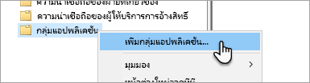

2. <span data-ttu-id="30ace-140">ภายในการเพิ่มตัวช่วยสร้างกลุ่มแอปพลิเคชัน ใส่**ชื่อ**สำหรับกลุ่มแอปพลิเคชันและเลือก**แอปพลิเคชันดั้งเดิมที่เข้าถึง API เว็บ**</span><span class="sxs-lookup"><span data-stu-id="30ace-140">Within the Add Application Group Wizard, provide a **name** for the application group and select **Native application accessing a web API**.</span></span>

   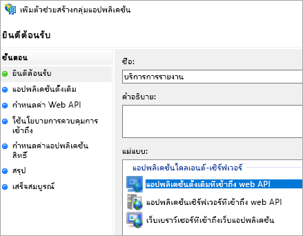

3. <span data-ttu-id="30ace-142">เลือก **ถัดไป**</span><span class="sxs-lookup"><span data-stu-id="30ace-142">Select **Next**.</span></span>

4. <span data-ttu-id="30ace-143">ใส่**ชื่อ**สำหรับแอปพลิเคชันที่คุณกำลังเพิ่ม</span><span class="sxs-lookup"><span data-stu-id="30ace-143">Provide a **name** for the application you are adding.</span></span> 

5. <span data-ttu-id="30ace-144">ในขณะ **ID ไคลเอ็นต์**ของคุณจะถูกสร้างโดยอัตโนมัติ ใส่ใน *484d54fc-b481-4eee-9505-0258a1913020* สำหรับทั้ง iOS และ Android</span><span class="sxs-lookup"><span data-stu-id="30ace-144">While the **Client ID** will be auto generated for your, enter in *484d54fc-b481-4eee-9505-0258a1913020* for both iOS and Android.</span></span>

6. <span data-ttu-id="30ace-145">คุณต้องการเพิ่ม **URL เปลี่ยนเส้นทาง**ต่อไปนี้:</span><span class="sxs-lookup"><span data-stu-id="30ace-145">You want to add the following **Redirect URLs**:</span></span>

   <span data-ttu-id="30ace-146">**รายการสำหรับ Power BI สำหรับอุปกรณ์เคลื่อนที่ – iOS:**</span><span class="sxs-lookup"><span data-stu-id="30ace-146">**Entries for Power BI Mobile – iOS:**</span></span>  
   <span data-ttu-id="30ace-147">msauth://code/mspbi-adal://com.microsoft.powerbimobile</span><span class="sxs-lookup"><span data-stu-id="30ace-147">msauth://code/mspbi-adal://com.microsoft.powerbimobile</span></span>  
   <span data-ttu-id="30ace-148">msauth://code/mspbi-adalms://com.microsoft.powerbimobilems</span><span class="sxs-lookup"><span data-stu-id="30ace-148">msauth://code/mspbi-adalms://com.microsoft.powerbimobilems</span></span>  
   <span data-ttu-id="30ace-149">mspbi adal://com.microsoft.powerbimobile</span><span class="sxs-lookup"><span data-stu-id="30ace-149">mspbi-adal://com.microsoft.powerbimobile</span></span>  
   <span data-ttu-id="30ace-150">mspbi adalms://com.microsoft.powerbimobilems</span><span class="sxs-lookup"><span data-stu-id="30ace-150">mspbi-adalms://com.microsoft.powerbimobilems</span></span>

   <span data-ttu-id="30ace-151">**ต้องใช้ขั้นตอนต่อไปนี้เท่านั้นสำหรับแอป Android:**</span><span class="sxs-lookup"><span data-stu-id="30ace-151">**Android Apps only need the following steps:**</span></span>  
   <span data-ttu-id="30ace-152">urn:ietf:wg:oauth:2.0:oob</span><span class="sxs-lookup"><span data-stu-id="30ace-152">urn:ietf:wg:oauth:2.0:oob</span></span>

   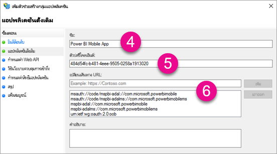
7. <span data-ttu-id="30ace-154">เลือก **ถัดไป**</span><span class="sxs-lookup"><span data-stu-id="30ace-154">Select **Next**.</span></span>

8. <span data-ttu-id="30ace-155">ใส่ URL สำหรับเซิร์ฟเวอร์รายงานของคุณ</span><span class="sxs-lookup"><span data-stu-id="30ace-155">Supply the URL for your Report Server.</span></span> <span data-ttu-id="30ace-156">URL นี้เป็น URL ภายนอกที่จะเข้าชม Web Application Proxy ของคุณ</span><span class="sxs-lookup"><span data-stu-id="30ace-156">The URL is the external URL that will hit your Web Application Proxy.</span></span> <span data-ttu-id="30ace-157">ซึ่งควรอยู่ในรูปแบบต่อไปนี้</span><span class="sxs-lookup"><span data-stu-id="30ace-157">It should be in the following format.</span></span>

   > [!NOTE]
   > <span data-ttu-id="30ace-158">URL นี้เป็นตัวพิมพ์ใหญ่-เล็ก</span><span class="sxs-lookup"><span data-stu-id="30ace-158">This URL is case sensitive!</span></span>

   <span data-ttu-id="30ace-159">*https://< report server url >/*</span><span class="sxs-lookup"><span data-stu-id="30ace-159">*https://< report server url >/*</span></span>

   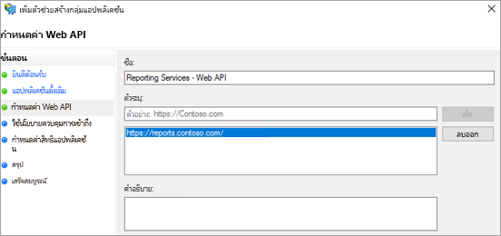
9. <span data-ttu-id="30ace-161">เลือก **ถัดไป**</span><span class="sxs-lookup"><span data-stu-id="30ace-161">Select **Next**.</span></span>

10. <span data-ttu-id="30ace-162">เลือก**นโยบายการควบคุมการเข้าถึง**ที่เหมาะกับความต้องการขององค์กรของคุณ</span><span class="sxs-lookup"><span data-stu-id="30ace-162">Choose the **Access Control Policy** that fits your organization's needs.</span></span>

    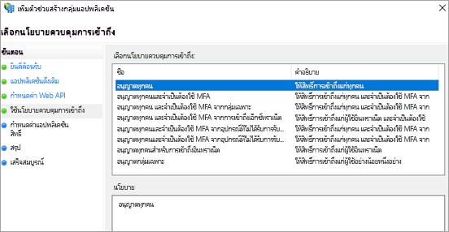

11. <span data-ttu-id="30ace-164">เลือก **ถัดไป**</span><span class="sxs-lookup"><span data-stu-id="30ace-164">Select **Next**.</span></span>

12. <span data-ttu-id="30ace-165">เลือก **ถัดไป**</span><span class="sxs-lookup"><span data-stu-id="30ace-165">Select **Next**.</span></span>

13. <span data-ttu-id="30ace-166">เลือก **ถัดไป**</span><span class="sxs-lookup"><span data-stu-id="30ace-166">Select **Next**.</span></span>

14. <span data-ttu-id="30ace-167">เลือก**ปิด**</span><span class="sxs-lookup"><span data-stu-id="30ace-167">Select **Close**.</span></span>

<span data-ttu-id="30ace-168">เมื่อเสร็จสมบูรณ์ คุณควรเห็นคุณสมบัติของกลุ่มแอปพลิเคชันของคุณที่คล้ายกับต่อไปนี้</span><span class="sxs-lookup"><span data-stu-id="30ace-168">When completed, you should see the properties of your application group look similar to the following.</span></span>

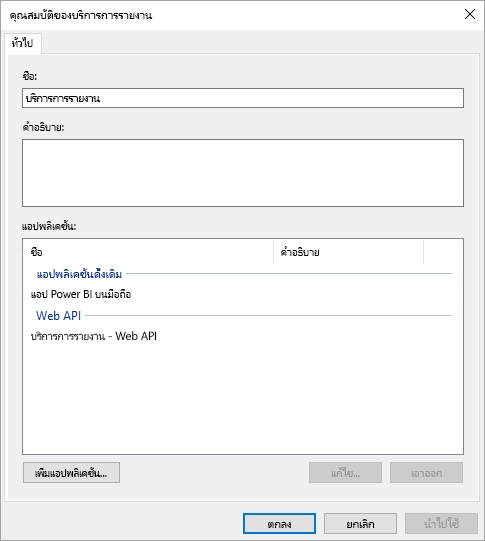

## <a name="web-application-proxy-wap-configuration"></a><span data-ttu-id="30ace-170">การกำหนดค่า Web Application Proxy (WAP)</span><span class="sxs-lookup"><span data-stu-id="30ace-170">Web Application Proxy (WAP) Configuration</span></span>

<span data-ttu-id="30ace-171">คุณต้องเปิดใช้งานบทบาท Windows ของ Web Application Proxy (ROLE) บนเซิร์ฟเวอร์ในสภาพแวดล้อมของคุณ</span><span class="sxs-lookup"><span data-stu-id="30ace-171">You want to enable the Web Application Proxy (Role) Windows role on a server in your environment.</span></span> <span data-ttu-id="30ace-172">ซึ่งต้องอยู่บนเซิร์ฟเวอร์ Windows 2016</span><span class="sxs-lookup"><span data-stu-id="30ace-172">It must be on a Windows 2016 server.</span></span> <span data-ttu-id="30ace-173">สำหรับข้อมูลเพิ่มเติม ดู [Web Application Proxy ใน Windows Server 2016 ](/windows-server/remote/remote-access/web-application-proxy/web-application-proxy-windows-server)และ[เผยแพร่แอปพลิเคชันโดยใช้การรับรองความถูกต้องล่วงหน้า AD FS](/windows-server/remote/remote-access/web-application-proxy/Publishing-Applications-using-AD-FS-Preauthentication#a-namebkmk14apublish-an-application-that-uses-oauth2-such-as-a-windows-store-app)</span><span class="sxs-lookup"><span data-stu-id="30ace-173">For more information, see [Web Application Proxy in Windows Server 2016](/windows-server/remote/remote-access/web-application-proxy/web-application-proxy-windows-server) and [Publishing Applications using AD FS Preauthentication](/windows-server/remote/remote-access/web-application-proxy/Publishing-Applications-using-AD-FS-Preauthentication#a-namebkmk14apublish-an-application-that-uses-oauth2-such-as-a-windows-store-app).</span></span>

### <a name="constrained-delegation-configuration"></a><span data-ttu-id="30ace-174">การกำหนดค่าการมอบหมายที่มีข้อจำกัด</span><span class="sxs-lookup"><span data-stu-id="30ace-174">Constrained delegation configuration</span></span>

<span data-ttu-id="30ace-175">เพื่อการเปลี่ยนจากการรับรองความถูกต้องของ OAuth เป็นการรับรองความถูกต้องของ Windows เราจำเป็นต้องใช้การมอบหมายที่มีข้อจำกัดด้วยการเปลี่ยนโพรโทคอล</span><span class="sxs-lookup"><span data-stu-id="30ace-175">In order to transition from OAuth authentication to Windows authentication, we need to use constrained delegation with protocol transitioning.</span></span> <span data-ttu-id="30ace-176">นี่คือส่วนหนึ่งของการกำหนดค่า Kerberos</span><span class="sxs-lookup"><span data-stu-id="30ace-176">This is part of the Kerberos configuration.</span></span> <span data-ttu-id="30ace-177">เราได้กำหนด SPN ของ Reporting Services SPN ภายในการกำหนดค่า Reporting Services แล้ว</span><span class="sxs-lookup"><span data-stu-id="30ace-177">We already defined the Reporting Services SPN within the Reporting Services configuration.</span></span>

<span data-ttu-id="30ace-178">เราต้องกำหนดค่าการมอบหมายที่มีข้อจำกัดบนบัญชีผู้ใช้ภายในเครื่องของเซิร์ฟเวอร์ WAP ภายใน Active Directory</span><span class="sxs-lookup"><span data-stu-id="30ace-178">We need to configure constrained delegation on the WAP Server machine account within Active Directory.</span></span> <span data-ttu-id="30ace-179">คุณอาจจำเป็นต้องทำงานกับผู้ดูแลโดเมนถ้าคุณไม่มีสิทธิ์ใน Active Directory</span><span class="sxs-lookup"><span data-stu-id="30ace-179">You may need to work with a domain administrator if you don't have rights to Active Directory.</span></span>

<span data-ttu-id="30ace-180">หากต้องการกำหนดค่าการมอบหมายที่มีข้อจำกัด คุณต้องทำตามขั้นตอนต่อไปนี้</span><span class="sxs-lookup"><span data-stu-id="30ace-180">To configure constrained delegation, you want to do the following steps.</span></span>

1. <span data-ttu-id="30ace-181">บนเครื่องที่มีเครื่องมือ Active Directory ติดตั้งไว้แล้ว ให้เปิดใช้**ผู้ใช้และคอมพิวเตอร์ Active Directory**</span><span class="sxs-lookup"><span data-stu-id="30ace-181">On a machine that has the Active Directory tools installed, launch **Active Directory Users and Computers**.</span></span>

2. <span data-ttu-id="30ace-182">ค้นหาบัญชีผู้ใช้ภายในเครื่องสำหรับเซิร์ฟเวอร์ WAP ของคุณ</span><span class="sxs-lookup"><span data-stu-id="30ace-182">Find the machine account for your WAP server.</span></span> <span data-ttu-id="30ace-183">ตามค่าเริ่มต้น บัญชีผู้ใช้ดังกล่าวจะอยู่ในคอนเทนเนอร์ของคอมพิวเตอร์</span><span class="sxs-lookup"><span data-stu-id="30ace-183">By default, it will be in the computers container.</span></span>

3. <span data-ttu-id="30ace-184">คลิกขวาที่เซิร์ฟเวอร์ WAP และไปที่ **คุณสมบัติ**</span><span class="sxs-lookup"><span data-stu-id="30ace-184">Right-click the WAP server and go to **Properties**.</span></span>

4. <span data-ttu-id="30ace-185">เลือกแถบ **การมอบหมาย**</span><span class="sxs-lookup"><span data-stu-id="30ace-185">Select the **Delegation** tab.</span></span>

5. <span data-ttu-id="30ace-186">เลือก**เชื่อถือคอมพิวเตอร์เครื่องนี้สำหรับการมอบหมายบริการที่ระบุเท่านั้น**แล้วเลือก**ใช้โพรโทคอลการรับรองความถูกต้องใด ๆ**</span><span class="sxs-lookup"><span data-stu-id="30ace-186">Select **Trust this computer for delegation to specified services only** and then **Use any authentication protocol**.</span></span>

   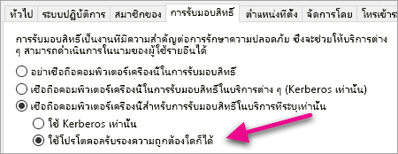

   <span data-ttu-id="30ace-188">ซึ่งเป็นการตั้งค่าการมอบหมายที่มีข้อจำกัดสำหรับบัญชีผู้ใช้ภายในเครื่องของเซิร์ฟเวอร์ WAP</span><span class="sxs-lookup"><span data-stu-id="30ace-188">This sets up constrained delegation for this WAP Server machine account.</span></span> <span data-ttu-id="30ace-189">เราจึงต้องระบุบริการที่เครื่องนี้ได้รับอนุญาตให้ผู้รับมอบสิทธิ์</span><span class="sxs-lookup"><span data-stu-id="30ace-189">We then need to specify the services that this machine is allowed to delegate to.</span></span>

6. <span data-ttu-id="30ace-190">เลือก**เพิ่ม...**</span><span class="sxs-lookup"><span data-stu-id="30ace-190">Select **Add…**</span></span> <span data-ttu-id="30ace-191">ด้านล่างกล่องบริการ</span><span class="sxs-lookup"><span data-stu-id="30ace-191">under the services box.</span></span>

   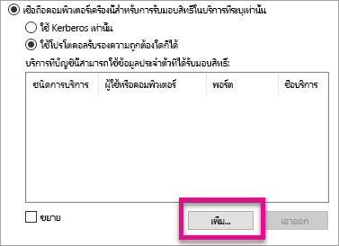

7. <span data-ttu-id="30ace-193">เลือก**ผู้ใช้หรือคอมพิวเตอร์...**</span><span class="sxs-lookup"><span data-stu-id="30ace-193">Select **Users or Computers…**</span></span>

8. <span data-ttu-id="30ace-194">ใส่บัญชีผู้ใช้บริการที่คุณกำลังใช้สำหรับ Reporting Services</span><span class="sxs-lookup"><span data-stu-id="30ace-194">Enter the service account that you are using for Reporting Services.</span></span> <span data-ttu-id="30ace-195">บัญชีนี้คือบัญชีที่คุณเพิ่ม SPN เข้าไปภายในการกำหนดค่า Reporting Services</span><span class="sxs-lookup"><span data-stu-id="30ace-195">This account is the account you added the SPN to within the Reporting Services configuration.</span></span>

9. <span data-ttu-id="30ace-196">เลือก SPN สำหรับ Reporting Services จากนั้น เลือก**ตกลง**</span><span class="sxs-lookup"><span data-stu-id="30ace-196">Select the SPN for Reporting Services and then select **OK**.</span></span>

   > [!NOTE]
   > <span data-ttu-id="30ace-197">คุณอาจเห็นเพียง NetBIOS SPN</span><span class="sxs-lookup"><span data-stu-id="30ace-197">You may only see the NetBIOS SPN.</span></span> <span data-ttu-id="30ace-198">ซึ่งแท้จริงแล้วจะเลือกทั้ง NetBIOS และ FQDN SPNs ถ้ามีอยู่ทั้งสอง</span><span class="sxs-lookup"><span data-stu-id="30ace-198">It will actually select both the NetBIOS and FQDN SPNs if they both exist.</span></span>

   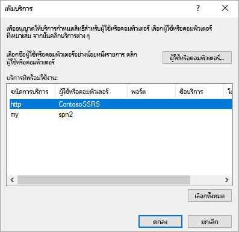

10. <span data-ttu-id="30ace-200">ผลลัพธ์ควรมีลักษณะคล้ายกับต่อไปนี้เมื่อมีการเลือกกล่องกาเครื่องหมาย**ขยาย**</span><span class="sxs-lookup"><span data-stu-id="30ace-200">The result should look similar to the following when the **Expanded** checkbox is checked.</span></span>

    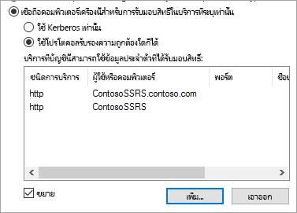

11. <span data-ttu-id="30ace-202">เลือก**ตกลง**</span><span class="sxs-lookup"><span data-stu-id="30ace-202">Select **OK**.</span></span>

### <a name="add-wap-application"></a><span data-ttu-id="30ace-203">เพิ่มแอปพลิเคชัน WAP</span><span class="sxs-lookup"><span data-stu-id="30ace-203">Add WAP Application</span></span>

<span data-ttu-id="30ace-204">ในขณะที่คุณสามารถเผยแพร่แอปพลิเคชันภายในคอนโซลการจัดการการเข้าถึงรายงาน เราจะต้องสร้างแอปพลิเคชันผ่านทาง PowerShell</span><span class="sxs-lookup"><span data-stu-id="30ace-204">While you can publish applications within the Report Access Management Console, we will want to create the application via PowerShell.</span></span> <span data-ttu-id="30ace-205">นี่คือคำสั่งเพื่อเพิ่มแอปพลิเคชัน</span><span class="sxs-lookup"><span data-stu-id="30ace-205">Here is the command to add the application.</span></span>

```powershell
Add-WebApplicationProxyApplication -Name "Contoso Reports" -ExternalPreauthentication ADFS -ExternalUrl https://reports.contoso.com/ -ExternalCertificateThumbprint "0ff79c75a725e6f67e3e2db55bdb103efc9acb12" -BackendServerUrl https://ContosoSSRS/ -ADFSRelyingPartyName "Reporting Services - Web API" -BackendServerAuthenticationSPN "http/ContosoSSRS.contoso.com" -UseOAuthAuthentication
```

| <span data-ttu-id="30ace-206">พารามิเตอร์</span><span class="sxs-lookup"><span data-stu-id="30ace-206">Parameter</span></span> | <span data-ttu-id="30ace-207">ข้อคิดเห็น</span><span class="sxs-lookup"><span data-stu-id="30ace-207">Comments</span></span> |
| --- | --- |
| <span data-ttu-id="30ace-208">**ADFSRelyingPartyName**</span><span class="sxs-lookup"><span data-stu-id="30ace-208">**ADFSRelyingPartyName**</span></span> |<span data-ttu-id="30ace-209">ชื่อ API เว็บที่คุณสร้างขึ้นเป็นส่วนหนึ่งของกลุ่มแอปพลิเคชันภายใน ADFS</span><span class="sxs-lookup"><span data-stu-id="30ace-209">The Web API name that you created as part of the Application Group within ADFS.</span></span> |
| <span data-ttu-id="30ace-210">**ExternalCertificateThumbprint**</span><span class="sxs-lookup"><span data-stu-id="30ace-210">**ExternalCertificateThumbprint**</span></span> |<span data-ttu-id="30ace-211">ใบรับรองที่จะใช้สำหรับผู้ใช้ภายนอก</span><span class="sxs-lookup"><span data-stu-id="30ace-211">The certificate to use for the external users.</span></span> <span data-ttu-id="30ace-212">เป็นสิ่งสำคุัญมากที่ใบรับรองนั้นจะต้องถูกต้องสำหรับการใช้งานบนอุปกรณ์เคลื่อนที่และมาจากผู้ออกใบรับรองที่เชื่อถือได้</span><span class="sxs-lookup"><span data-stu-id="30ace-212">It is important that the certificate is valid on mobile devices and come from a trusted certificate authority.</span></span> |
| <span data-ttu-id="30ace-213">**BackendServerUrl**</span><span class="sxs-lookup"><span data-stu-id="30ace-213">**BackendServerUrl**</span></span> |<span data-ttu-id="30ace-214">URL ไปยังเซิร์ฟเวอร์รายงานจากเซิร์ฟเวอร์ WAP</span><span class="sxs-lookup"><span data-stu-id="30ace-214">The URL to the Report Server from the WAP server.</span></span> <span data-ttu-id="30ace-215">ถ้าเซิร์ฟเวอร์ WAP อยู่ใน DMZ คุณอาจต้องใช้ชื่อโดเมนแบบเต็ม</span><span class="sxs-lookup"><span data-stu-id="30ace-215">If the WAP server is in a DMZ, you may need to use a fully qualified domain name.</span></span> <span data-ttu-id="30ace-216">ตรวจสอบให้แน่ใจว่าคุณสามารถเข้าชม URL นี้จากเว็บเบราว์เซอร์บนเซิร์ฟเวอร์ WAP</span><span class="sxs-lookup"><span data-stu-id="30ace-216">Make sure you can hit this URL from the web browser on the WAP server.</span></span> |
| <span data-ttu-id="30ace-217">**BackendServerAuthenticationSPN**</span><span class="sxs-lookup"><span data-stu-id="30ace-217">**BackendServerAuthenticationSPN**</span></span> |<span data-ttu-id="30ace-218">SPN ที่คุณสร้างขึ้นเป็นส่วนหนึ่งของการกำหนดค่า Reporting Services</span><span class="sxs-lookup"><span data-stu-id="30ace-218">The SPN you created as part of the Reporting Services configuration.</span></span> |

### <a name="setting-integrated-authentication-for-the-wap-application"></a><span data-ttu-id="30ace-219">ตั้งค่าการรับรองความถูกต้องรวมสำหรับแอปพลิเคชัน WAP</span><span class="sxs-lookup"><span data-stu-id="30ace-219">Setting Integrated Authentication for the WAP Application</span></span>

<span data-ttu-id="30ace-220">หลังจากที่คุณเพิ่มแอปพลิเคชัน WAP คุณต้องตั้งค่า BackendServerAuthenticationMode เพื่อใช้ IntegratedWindowsAuthentication</span><span class="sxs-lookup"><span data-stu-id="30ace-220">After you add the WAP Application, you need to set the BackendServerAuthenticationMode to use IntegratedWindowsAuthentication.</span></span> <span data-ttu-id="30ace-221">คุณต้องใช้ ID จากแอปพลิเคชัน WAP เพื่อตั้งค่า</span><span class="sxs-lookup"><span data-stu-id="30ace-221">You need the ID from the WAP Application in order to set it.</span></span>

```powershell
Get-WebApplicationProxyApplication "Contoso Reports" | fl
```


<span data-ttu-id="30ace-223">เรียกใช้คำสั่งต่อไปนี้เพื่อตั้งค่า BackendServerAuthenticationMode โดยใช้ ID ของแอปพลิเคชัน WAP</span><span class="sxs-lookup"><span data-stu-id="30ace-223">Run the following command to set the BackendServerAuthenticationMode using the ID of the WAP Application.</span></span>

```powershell
Set-WebApplicationProxyApplication -id 30198C7F-DDE4-0D82-E654-D369A47B1EE5 -BackendServerAuthenticationMode IntegratedWindowsAuthentication
```


## <a name="connecting-with-the-power-bi-mobile-app"></a><span data-ttu-id="30ace-225">เชื่อมต่อกับแอป Power BI สำหรับอุปกรณ์เคลื่อนที่</span><span class="sxs-lookup"><span data-stu-id="30ace-225">Connecting with the Power BI Mobile App</span></span>

<span data-ttu-id="30ace-226">ภายในแอป Power BI สำหรับอุปกรณ์เคลื่อนที่ คุณต้องเชื่อมต่อกับอินสแตนซ์ Reporting Services ของคุณ</span><span class="sxs-lookup"><span data-stu-id="30ace-226">Within the Power BI mobile app, you want to connect to your Reporting Services instance.</span></span> <span data-ttu-id="30ace-227">เมื่อต้องการทำเช่นนั้น ให้ใส่ **URL ภายนอก**สำหรับแอปพลิเคชัน WAP ของคุณ</span><span class="sxs-lookup"><span data-stu-id="30ace-227">To do that, supply the **External URL** for your WAP Application.</span></span>

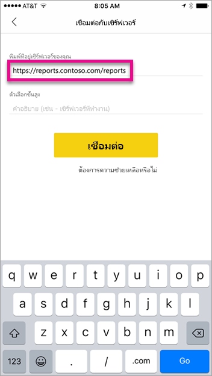

<span data-ttu-id="30ace-229">เมื่อคุณเลือก **เชื่อมต่อ** ระบบจะนำทางคุณไปยังหน้าการลงชื่อเข้าใช้ ADFS ของคุณ</span><span class="sxs-lookup"><span data-stu-id="30ace-229">When you select **Connect**, you be directed to your ADFS sign-in page.</span></span> <span data-ttu-id="30ace-230">ใส่ข้อมูลประจำตัวที่ถูกต้องสำหรับโดเมนของคุณ</span><span class="sxs-lookup"><span data-stu-id="30ace-230">Enter valid credentials for your domain.</span></span>

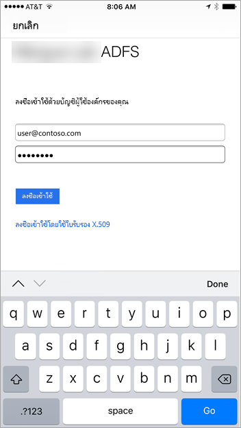

<span data-ttu-id="30ace-232">หลังจากที่คุณเลือก **ลงชื่อเข้าใช้** คุณจะเห็นองค์ประกอบจากเซิร์ฟเวอร์ Reporting Services ของคุณ</span><span class="sxs-lookup"><span data-stu-id="30ace-232">After you select **Sign in**, you see the elements from your Reporting Services server.</span></span>

## <a name="multi-factor-authentication"></a><span data-ttu-id="30ace-233">การรับรองตัวตนแบบหลายปัจจัย</span><span class="sxs-lookup"><span data-stu-id="30ace-233">Multi-factor authentication</span></span>

<span data-ttu-id="30ace-234">คุณสามารถเปิดใช้งานการรับรองความถูกต้องแบบหลายปัจจัยเพื่อเปิดใช้งานความปลอดภัยเพิ่มเติมสำหรับสภาพแวดล้อมของคุณ</span><span class="sxs-lookup"><span data-stu-id="30ace-234">You can enable multi-factor authentication to enable additional security for your environment.</span></span> <span data-ttu-id="30ace-235">เมื่อต้องการเรียนรู้เพิ่มเติม ดู[กำหนดค่า AD FS 2016 และ Azure MFA](/windows-server/identity/ad-fs/operations/configure-ad-fs-and-azure-mfa)</span><span class="sxs-lookup"><span data-stu-id="30ace-235">To learn more, see [Configure AD FS 2016 and Azure MFA](/windows-server/identity/ad-fs/operations/configure-ad-fs-and-azure-mfa).</span></span>

## <a name="troubleshooting"></a><span data-ttu-id="30ace-236">การแก้ไขปัญหา</span><span class="sxs-lookup"><span data-stu-id="30ace-236">Troubleshooting</span></span>

### <a name="you-receive-the-error-failed-to-login-to-ssrs-server"></a><span data-ttu-id="30ace-237">คุณได้รับข้อผิดพลาดว่า “ไม่สามารถเข้าสู่ระบบเซิร์ฟเวอร์ SSRS”</span><span class="sxs-lookup"><span data-stu-id="30ace-237">You receive the error "Failed to login to SSRS server"</span></span>

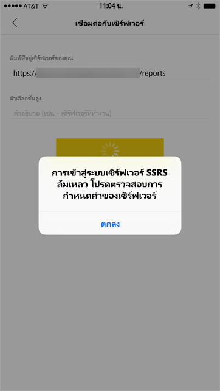

<span data-ttu-id="30ace-239">คุณสามารถตั้งค่า [Fiddler](https://www.telerik.com/fiddler) เพื่อทำหน้าที่เป็นพร็อกซีสำหรับอุปกรณ์เคลื่อนที่ของคุณเพื่อดูว่าการร้องขอไปได้ไกลเท่าใด</span><span class="sxs-lookup"><span data-stu-id="30ace-239">You can set up [Fiddler](https://www.telerik.com/fiddler) to act as a proxy for your mobile devices to see how far the request made it.</span></span> <span data-ttu-id="30ace-240">เพื่อเปิดใช้งานพร็อกซี Fiddler สำหรับอุปกรณ์โทรศัพท์ของคุณ คุณต้องตั้งค่า [CertMaker สำหรับ iOS และ Android](https://www.telerik.com/fiddler/add-ons) บนเครื่องที่เรียกใช้ Fiddler</span><span class="sxs-lookup"><span data-stu-id="30ace-240">To enable a Fiddler proxy for your phone device, you need to setup the [CertMaker for iOS and Android](https://www.telerik.com/fiddler/add-ons) on the machine running Fiddler.</span></span> <span data-ttu-id="30ace-241">Add-on จาก Telerik สำหรับ Fiddler</span><span class="sxs-lookup"><span data-stu-id="30ace-241">The add-on is from Telerik for Fiddler.</span></span>

<span data-ttu-id="30ace-242">หากการลงชื่อเข้าใช้สำเร็จเรียบร้อยเมื่อใช้ Fiddler คุณอาจมีใบรับรองที่ออกพร้อมกับแอปพลิเคชัน WAP หรือเซิร์ฟเวอร์ ADFS</span><span class="sxs-lookup"><span data-stu-id="30ace-242">If the sign-in works successfully when using Fiddler, you may have a certificate issue with either the WAP application or the ADFS server.</span></span> 

## <a name="next-steps"></a><span data-ttu-id="30ace-243">ขั้นตอนถัดไป</span><span class="sxs-lookup"><span data-stu-id="30ace-243">Next steps</span></span>

[<span data-ttu-id="30ace-244">ลงทะเบียนชื่อบริการหลัก (SPN) สำหรับเซิร์ฟเวอร์รายงาน</span><span class="sxs-lookup"><span data-stu-id="30ace-244">Register a Service Principal Name (SPN) for a Report Server</span></span>](/sql/reporting-services/report-server/register-a-service-principal-name-spn-for-a-report-server)  
[<span data-ttu-id="30ace-245">ปรับเปลี่ยนแฟ้มการกำหนดค่า Reporting Services</span><span class="sxs-lookup"><span data-stu-id="30ace-245">Modify a Reporting Services Configuration File</span></span>](/sql/reporting-services/report-server/modify-a-reporting-services-configuration-file-rsreportserver-config)  
[<span data-ttu-id="30ace-246">กำหนดค่าการรับรองความถูกต้องของ Windows บนเซิร์ฟเวอร์รายงาน</span><span class="sxs-lookup"><span data-stu-id="30ace-246">Configure Windows Authentication on a Report Server</span></span>](/sql/reporting-services/security/configure-windows-authentication-on-the-report-server)  
[<span data-ttu-id="30ace-247">Active Directory Federation Services</span><span class="sxs-lookup"><span data-stu-id="30ace-247">Active Directory Federation Services</span></span>](/windows-server/identity/active-directory-federation-services)  
[<span data-ttu-id="30ace-248">Web Application Proxy ใน Windows Server 2016</span><span class="sxs-lookup"><span data-stu-id="30ace-248">Web Application Proxy in Windows Server 2016</span></span>](/windows-server/remote/remote-access/web-application-proxy/web-application-proxy-windows-server)  
[<span data-ttu-id="30ace-249">เผยแพร่แอปพลิเคชันโดยใช้การรับรองความถูกต้องล่วงหน้า AD FS</span><span class="sxs-lookup"><span data-stu-id="30ace-249">Publishing Applications using AD FS Preauthentication</span></span>](/windows-server/remote/remote-access/web-application-proxy/Publishing-Applications-using-AD-FS-Preauthentication#a-namebkmk14apublish-an-application-that-uses-oauth2-such-as-a-windows-store-app)  
[<span data-ttu-id="30ace-250">กำหนดค่า AD FS 2016 และ Azure MFA</span><span class="sxs-lookup"><span data-stu-id="30ace-250">Configure AD FS 2016 and Azure MFA</span></span>](/windows-server/identity/ad-fs/operations/configure-ad-fs-and-azure-mfa)  
<span data-ttu-id="30ace-251">มีคำถามเพิ่มเติมหรือไม่</span><span class="sxs-lookup"><span data-stu-id="30ace-251">More questions?</span></span> [<span data-ttu-id="30ace-252">ลองไปที่ชุมชน Power BI</span><span class="sxs-lookup"><span data-stu-id="30ace-252">Try the Power BI Community</span></span>](https://community.powerbi.com/)