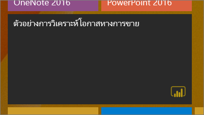
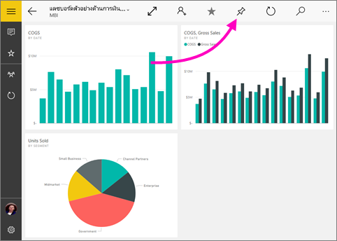
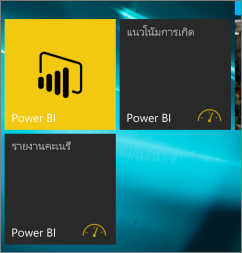

# ปักหมุดแดชบอร์ดลงในหน้าจอเริ่มต้นของ Windows 10 ของคุณจากแอป Power BI บนอุปกรณ์เคลื่อนที่Pin a dashboard to your Windows 10 Start screen from the Power BI mobile app
คุณสามารถปักหมุดแดชบอร์ด Power BI ลงในหน้าจอเริ่มต้นของ Windows จากแอป Power BI บนอุปกรณ์เคลื่อนที่สำหรับ Windows 10You can pin Power BI dashboards to the Windows Start screen from the Power BI mobile app for Windows 10. เมื่อคุณแตะไทล์บนหน้าจอเริ่มต้น แดชบอร์ดจะที่เปิดขึ้นในแอป Power BI บนอุปกรณ์เคลื่อนที่สำหรับ Windows 10When you tap the tile on the Start screen, the dashboard opens in the Power BI mobile app for Windows 10.

>[!NOTE]
>การสนับสนุนแอปอุปกรณ์เคลื่อนที่ Power BI สำหรับ **โทรศัพท์ที่ใช้ Windows 10 Mobile** จะถูกยกเลิกในวันที่ 16 มีนาคม 2021Power BI mobile app support for **phones using Windows 10 Mobile** will be discontinued on March 16, 2021. [ศึกษาเพิ่มเติมLearn more](/legal/powerbi/powerbi-mobile/power-bi-mobile-app-end-of-support-for-windows-phones)

## ปักหมุดแดชบอร์ดไปยังหน้าจอเริ่มต้นของคุณเป็นไทล์Pin a dashboard to your Start screen as a tile
1. เปิดแดชบอร์ดOpen a dashboard.
2. แตะ **ปักหมุดเพื่อเริ่มต้น**Tap **Pin to Start** .
   
   
   
   ไปที่หน้าจอเริ่มต้นของอุปกรณ์เพื่อดูไทล์Go to your device's Start screen to see the tile.
   
   

## ขั้นตอนถัดไปNext steps
* [ดาวน์โหลดแอป Power BI บนอุปกรณ์เคลื่นที่สำหรับ Windows 10](https://go.microsoft.com/fwlink/?LinkID=526478)จาก Windows Store[Download the Power BI mobile app for Windows 10](https://go.microsoft.com/fwlink/?LinkID=526478) from the Windows Store  
* [เริ่มต้นใช้งานแอป Power BI สำหรับอุปกรณ์เคลื่อนที่สำหรับ Windows 10Get started with the Power BI mobile app for Windows 10](mobile-windows-10-phone-app-get-started.md)  
* [Power BI คืออะไรWhat is Power BI?](../../fundamentals/power-bi-overview.md)
* มีคำถามหรือไม่Questions? [ลองถามชุมชน Power BITry asking the Power BI Community](https://community.powerbi.com/)