# สำรวจรายงานในแอปอุปกรณ์เคลื่อนที่ Power BIExplore reports in the Power BI mobile apps
นำไปใช้กับ:Applies to:

|  |  |  |  |  |
|:---: |:---: |:---: |:---: |:---: |
| iPhoneiPhones |iPadiPads |โทรศัพท์ AndroidAndroid phones |แท็บเล็ต AndroidAndroid tablets |อุปกรณ์ Windows 10Windows 10 devices |

>[!NOTE]
>การสนับสนุนแอปอุปกรณ์เคลื่อนที่ Power BI สำหรับ **โทรศัพท์ที่ใช้ Windows 10 Mobile** จะถูกยกเลิกในวันที่ 16 มีนาคม 2021Power BI mobile app support for **phones using Windows 10 Mobile** will be discontinued on March 16, 2021. [ศึกษาเพิ่มเติมLearn more](/legal/powerbi/powerbi-mobile/power-bi-mobile-app-end-of-support-for-windows-phones)

รายงาน Power BI คือมุมมองแบบโต้ตอบของข้อมูลของคุณ ที่มีการแสดงผลด้วยภาพที่แสดงการค้นพบและข้อมูลเชิงลึกแตกต่างจากข้อมูลนั้นA Power BI report is an interactive view of your data, with visuals that represent different findings and insights from that data. การดูรายงานในแอปอุปกรณ์เคลื่อนที่ Power BI เป็นขั้นตอนที่สามในกระบวนการแบบสามขั้นตอนViewing reports in the Power BI mobile apps is the third step in a three-step process:

1. [สร้างรายงานใน Power BI Desktop](../../create-reports/desktop-report-view.md)[Create reports in Power BI Desktop](../../create-reports/desktop-report-view.md). คุณยังสามารถ [ปรับรายงานให้เหมาะสมสำหรับโทรศัพท์](mobile-apps-view-phone-report.md) ใน Power BI Desktop ได้You can even [optimize a report for phones](mobile-apps-view-phone-report.md) in Power BI Desktop.
2. เผยแพร่รายงานเหล่านั้นไปยังบริการ Power BI [(https://powerbi.com)](https://powerbi.com)หรือ[เซิร์ฟเวอร์รายงาน Power BI](../../report-server/get-started.md)Publish those reports to the Power BI service [(https://powerbi.com)](https://powerbi.com) or [Power BI Report Server](../../report-server/get-started.md).  
3. โต้ตอบกับรายงานเหล่านั้นในแอปอุปกรณ์เคลื่อนที่ Power BIInteract with the reports in the Power BI mobile apps.

## เปิดรายงาน Power BI ในแอปอุปกรณ์เคลื่อนที่Open a Power BI report in the mobile app
รายงาน Power BI ถูกเก็บไว้ในตำแหน่งที่ต่างกันในแอปอุปกรณ์เคลื่อนที่ตามตำแหน่งที่คุณได้รับรายงานเหล่านั้นPower BI reports are stored in different places in the mobile app, depending on where you got them. รายงานเหล่านั้นอาจอยู่ในแอป แชร์กับฉัน พื้นที่ทำงาน (รวมถึงพื้นที่ทำงานขงฉัน) หรือบนเซิร์ฟเวอร์รายงานได้They can be in Apps, Shared with me, Workspaces (including My Workspace), or on a report server. ในบางครั้ง คุณเข้าถึงแดชบอร์ดที่เกี่ยวข้องเพื่อเข้าถึงรายงาน และในบางครั้ง ก็มีแสดงรายการไว้Sometimes, you go through a related dashboard to get to a report, and sometimes they're listed.

ในรายการและเมนู คุณจะพบไอคอนถัดจากชื่อรายงาน ซึ่งช่วยให้คุณเข้าใจว่ารายการนี้คือรายงานIn lists and menus, you'll find an icon next to a report name, which helps you understand that the item is a report:

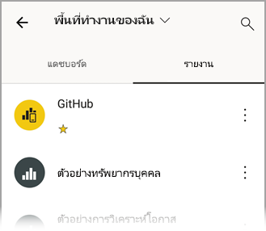

มีสองไอคอนสำหรับรายงานในแอปสำหรับอุปกรณ์เคลื่อนที่ Power BI:There are two icons for reports in the Power BI mobile apps:

*  ระบุรายงานที่จะปรากฏในการจัดตำแหน่งตามแนวนอนในแอปindicates a report that will appear in landscape orientation in the app. ซึ่งจะมีลักษณะเหมือนกับการจัดตำแหน่งที่ปรากฏในเบราว์เซอร์It will look the same as it looks in a browser.

*  ระบุรายงานที่มีหน้ารายงานที่ปรับให้เหมาะสมสำหรับโทรศัพท์อย่างน้อยหนึ่งหน้า ซึ่งจะแสดงในการจัดตำแหน่งตามแนวตั้งindicates a report that has at least one phone-optimized page that will appear in portrait orientation.

> [!NOTE]
> เมื่อคุณถือโทรศัพท์ของคุณตามการจัดตำแหน่งในแนวนอน คุณจะได้รับเค้าโครงแนวนอนเสมอ แม้ว่าหน้ารายงานจะมีเค้าโครงแบบอุปกรณ์มือถือก็ตามWhen you hold your phone in a landscape orientation, you'll always get the landscape layout, even if the report page is in mobile layout.

หากต้องการรับรายงานจากแดชบอร์ด ให้แตะที่ **ตัวเลือกเพิ่มเติม** (...) ตรงมุมขวาบนของไทล์ จากนั้นจึงแตะที่ **เปิดรายงาน**:To get to a report from a dashboard, tap **More options** (...) in the upper-right corner of a tile and then tap **Open report**:
  
  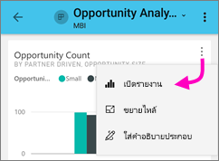
  
  ไม่สามารถเปิดไทล์ทั้งหมดเป็นรายงานได้Not all tiles can be opened as reports. ตัวอย่างเช่น ไทล์ที่สร้างขึ้นเมื่อคุณถามคำถามในกล่องการถามตอบจะไม่เปิดรายงานเมื่อคุณแตะFor example, tiles that are created when you ask a question in the Q&A box don't open reports when you tap them.
  
## ซูมข้อมูลของคุณZoom in on your data   
ใช้การถ่างนิ้วเพื่อซูมรายงานของคุณเพื่อดูรายละเอียดมากขึ้นUse the pinch gesture to zoom into your reports to examine them in greater detail. หุบนิ้วเข้าเพื่อซูมออกUnpinch to zoom back out again. ขยายนิ้วเพื่อซูมบนโทรศัพท์ Android และ iOS และแท็บเล็ตPinch-to-zoom is supported on Android and iOS phones and tablets.

## โต้ตอบกับรายงานInteract with reports
หลังจากที่คุณมีรายงานที่เปิดในแอปแล้ว คุณสามารถเริ่มทำงานกับรายงานดังกล่าวได้After you have a report open in the app, you can start working with it. คุณสามารถดำเนินงานได้หลายรูปแบบด้วยรายงานและข้อมูลในรายงานYou can do many things with your report and its data. ในส่วนท้ายของรายงาน คุณจะพบการดำเนินการซึ่งคุณสามารถใช้กับรายงานได้In the report footer, you'll find actions that you can take on the report. ด้วยการแตะและการแตะยาวบนข้อมูลที่แสดงในรายงาน คุณยังสามารถแบ่งส่วนและตัดข้อมูลได้By tapping and long tapping on the data shown in the report, you can also slice and dice the data.

### การโต้ตอบแบบแตะครั้งเดียวเทียบกับการโต้ตอบแบบสองครั้งSingle-tap versus double-tap interaction
เมื่อคุณดาวน์โหลดแอป Power BI สำหรับอุปกรณ์เคลื่อนที่ จะมีการตั้งค่าสำหรับการโต้ตอบแบบแตะครั้งเดียวWhen you download the Power BI mobile app, it is set for single tap interaction. ซึ่งหมายความว่าเมื่อคุณแตะในวิชวลเพื่อทำการดำเนินการบางอย่างเช่น การเลือกรายการตัวแบ่งส่วนข้อมูล การเน้นข้าม การคลิกที่ลิงก์หรือปุ่ม ฯลฯ การแตะทั้งสองเลือกวิชวลและดำเนินการตามที่คุณต้องการThis means that when you tap in a visual to do some action, such as selecting a slicer item, cross highlighting, clicking on a link or button, etc., the tap both selects the visual and performs the action you wanted.

ถ้าคุณต้องการ คุณสามารถสลับไปยังการโต้ตอบแบบแตะสองครั้งได้If you prefer, you can switch to double-tap interaction. ด้วยการแตะสองครั้ง การแตะครั้งแรกที่วิชวลเพื่อเลือก และจากนั้นแตะอีกครั้งในวิชวลเพื่อดำเนินการตามที่คุณต้องการWith double tap interaction, you first tap on a visual to select it, and then tap again in the visual to perform your desired action.

เมื่อต้องการสลับไปยังการโต้ตอบแบบสองครั้งแตะหรือสลับกลับไปยังการโต้ตอบแบบแตะครั้งเดียว ให้ไปที่[การตั้งค่าการโต้ตอบของแอป](./mobile-app-interaction-settings.md)To switch to double-tap interaction, or to switch back to single-tap interaction, go to [app interaction settings](./mobile-app-interaction-settings.md).

### เลือกแบบครั้งเดียวเมื่อเทียบกับโหมดเลือกแบบหลายรายการสำหรับการเลือกจุดข้อมูลSingle-select versus multi-select mode for data point selection

ในรายงาน คุณสามารถแตะที่จุดข้อมูลเพื่อเลือกIn a report, you tap on a data point to select it. คุณสามารถเลือกว่าคุณต้องการใช้โหมดเลือกแบบครั้งเดียวหรือเลือกแบบหลายรายการYou can choose whether you want to use single-select or multi-select mode. ในโหมดเลือกแบบครั้งเดียว เมื่อคุณแตะจุดข้อมูลเพื่อเลือก การเลือกนั้นจะแทนที่การเลือกก่อนหน้าใดๆ ที่คุณได้ทำไว้In single-select mode, when you tap on a data point to select it, that selection replaces any previous selection you've made. ในโหมดเลือกแบบหลายรายการ เมื่อคุณแตะจุดข้อมูลเพื่อเลือก การเลือกของคุณจะถูก *เพิ่ม* ไปยังการเลือกใดๆ ที่คุณมีอยู่ในขณะนี้และผลลัพธ์รวมของการเลือกทั้งหมดของคุณจะได้รับการเน้นในภาพทั้งหมดของรายงานIn multi-select mode, when you tap on a data point to select it, your selection is *added* to any selection you currently have, and the combined result of all your selections is highlighted across all the report's visuals.

หากต้องการยกเลิกการเลือกจุดข้อมูล เพียงแค่แตะอีกครั้งTo deselect a selected data point, simply tap it again.

เมื่อต้องการสลับไปมาระหว่างโหมดการเลือกแบบครั้งเดียวและเลือกแบบหลายรายการ ให้ไปที่[การตั้งค่าการโต้ตอบแอป](./mobile-app-interaction-settings.md)To switch between single-select and multi-select mode, go to the [app interaction settings](./mobile-app-interaction-settings.md).

### การใช้การแตะและการแตะแบบยาวUsing tap and long tap
การแตะจะเหมือนกับการคลิกเมาส์A tap is the same as a mouse click. ดังนั้นถ้าคุณต้องการไฮไลท์รายงานแบบเชื่อมโยงตามจุดข้อมูล ให้แตะจุดข้อมูลนั้นSo, if you want to cross-highlight the report based on a data point, tap that data point.
เมื่อคุณแตะค่าตัวแบ่งส่วนข้อมูล ค่าจะถูกเลือกและส่วนที่เหลือของรายงานจะแบ่งอตามค่านั้นWhen you tap a slicer value, the value is selected and the rest of the report is sliced by that value.
เมื่อคุณแตะที่ลิงก์ ปุ่ม หรือบุ๊กมาร์ก การดำเนินการที่ผู้สร้างรายงานกำหนดไว้จะเกิดขึ้นWhen you tap a link, button, or bookmark, the action defined by the report author will occur.

คุณอาจสังเกตเห็นว่าเมื่อคุณแตะบนการแสดงผลด้วยภาพ เส้นขอบจะปรากฏขึ้นYou probably noticed that when you tap a visual, a border appears. ที่มุมบนขวาของเส้นขอบ คุณจะเห็น **ตัวเลือกเพิ่มเติม** (...) ถ้าคุณแตะจุดไข่ปลา คุณจะเห็นเมนูการดำเนินการที่คุณสามารถทำได้ใการแสดงผลด้วยภาพนั้น:In the upper-right corner of the border, you'll see **More options** (...). If you tap the ellipsis, you'll see a menu of actions you can take on that visual:

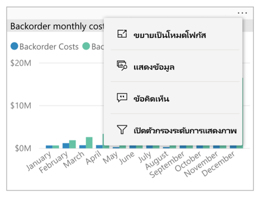

### คำแนะนำเครื่องมือและการดำเนินการเจาะรายละเอียดTooltip and drill actions
เมื่อคุณแตะเป็นเวลานาน (แตะค้างไว้) ที่จุดข้อมูล คำแนะนำเครื่องมือซึ่งระบุค่าที่แสดงจุดข้อมูลจะปรากฏขึ้นWhen you long tap (tap and hold) a data point, a tooltip that shows the values the data point represents will appear:

ถ้าผู้สร้างรายงานกำหนดค่าคำแนะนำเครื่องมือของหน้ารายงาน คำแนะนำเครื่องมือค่าเริ่มต้นจะถูกแทนที่ด้วยคำแนะนำเครื่องมือของหน้ารายงาน:If the report author configured a report page tooltip, the default tooltip is replaced with the report page tooltip:

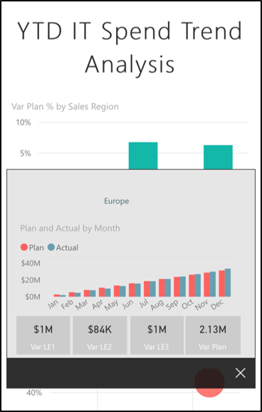

> [!NOTE]
> คำแนะนำเครื่องมือรายงานรองรับอุปกรณ์ที่มีวิวพอร์ต 640 พิกเซลและ 320 พิกเซลReport tooltips are supported for devices of at least 640 pixels and 320 pixel viewports. ถ้าอุปกรณ์ของคุณมีขนาดเล็กกว่า แอปจะแสดงคำแนะนำเครื่องมือค่าเริ่มต้นIf your device is smaller, the app shows default tooltips.

ผู้สร้างรายงานสามารถกำหนดลำดับชั้นในข้อมูลและความสัมพันธ์ระหว่างหน้ารายงานต่าง ๆReport authors can define hierarchies in the data and relationships among report pages. ลำดับชั้นช่วยให้สามารถดูรายละเอียดแนวลึก ดูข้อมูลสรุป และลงรายละเอียดหน้ารายงานอื่นจากการแสดงผลด้วยภาพและค่าได้Hierarchies allow you to drill down, drill up, and drill through to another report page from a visual and a value. ดังนั้น เมื่อคุณแตะแบบยาวที่ค่า นอกเหนือจากคำแนะนำเครื่องมือ ตัวเลือกการดูรายละเอียดที่เกี่ยวข้องจะปรากฏในส่วนท้าย:So, when you long tap a value, in addition to the tooltip, the relevant drill options will appear in the footer:

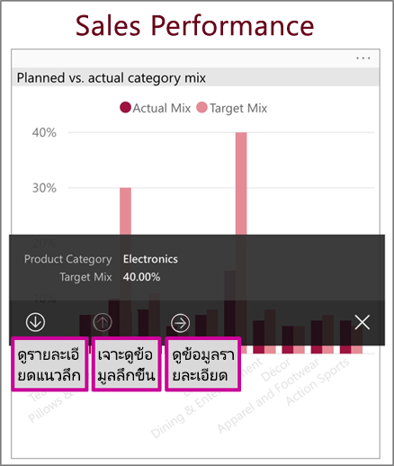

เมื่อคุณแตะส่วนที่เฉพาะเจาะจงของการแสดงผลด้วยภาพ จากนั้นจึงแตะตัวเลือก *การเข้าถึงรายละเอียด* Power BI จะนำคุณไปยังหน้าอื่นในรายงาน ซึ่งกรองตามค่าที่คุณแตะWhen you tap a specific part of a visual and then tap the *drillthrough* option, Power BI takes you to a different page in the report, filtered to the value you tapped. ผู้สร้างรายงานสามารถกำหนดหนึ่งหรือหลายตัวเลือกสำหรับการเข้าถึงรายละเอียด ซึ่งแต่ละตัวเลือกจะนำคุณไปยังรายงานคนละหน้าA report author can define one or more drillthrough options, each taking you to a different page. ในกรณีดังกล่าว คุณสามารถเลือกได้ว่าตัวเลือกใดที่คุณต้องการเข้าถึงรายละเอียดIn that case, you can choose which option you want to drill through. ปุ่มย้อนกลับจะนำคุณกลับไปยังหน้าก่อนหน้าThe back button takes you back to the previous page.

หากต้องการดูข้อมูลเพิ่มเติม กรุณาอ่านวิธีการ [เพิ่มการเข้าถึงรายละเอียดใน Power BI Desktop](../../create-reports/desktop-drillthrough.md)For more information, read about how to [add drillthrough in Power BI Desktop](../../create-reports/desktop-drillthrough.md).
   
   > [!IMPORTANT]
   > ในแอปสำหรับอุปกรณ์เคลื่อนที่ Power BI การดำเนินการดูรายละเอียดในเมทริกซ์และภาพตารางจะเปิดใช้งานผ่านค่าเซลล์เท่านั้น โดยไม่ผ่านคอลัมน์หรือส่วนหัวของแถวIn the Power BI mobile apps, drill actions in matrix and table visuals are enabled through cell values only, not through column or row headers.
   
   
   
### การใช้การดำเนินการในส่วนท้ายของรายงานUsing the actions in the report footer
จากส่วนท้ายของรายงาน คุณสามารถดำเนินการได้หลายอย่างบนหน้ารายงานปัจจุบันหรือในรายงานทั้งหมดFrom the report footer, you can perform several actions on the current report page or on the entire report. ส่วนท้ายช่วยให้คุณสามารถเข้าถึงการดำเนินการที่ใช้บ่อยที่สุดได้อย่างรวดเร็วThe footer provides quick access to the most commonly used actions. คุณสามารถเข้าถึงการดำเนินการอื่น ๆ ได้โดยการแตะที่ปุ่ม **ตัวเลือกเพิ่มเติม** (...):You can access other actions by tapping the **More options** (...) button:

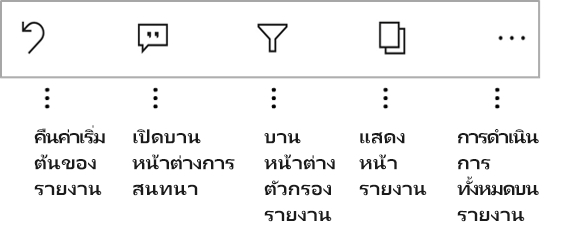

คุณสามารถดำเนินการเหล่านี้ได้จากส่วนท้าย:You can perform from these actions from the footer:
* รีเซ็ตตัวกรองรายงานและการเลือกไฮไลต์แบบเชื่อมโยงกลับไปยังสถานะเดิมReset the report filter and cross-highlight selections back to their original state.
* เปิดบานหน้าต่างการสนทนาเพื่อดูข้อคิดเห็น หรือเพิ่มข้อคิดเห็นไปที่รายงานนี้Open the conversation pane to view comments or to add comments to the report.
* เปิดบานหน้าต่างตัวกรองเพื่อดูหรือปรับเปลี่ยนตัวกรองที่ถูกนำไปใช้ในรายงานในขณะนี้Open the filter pane to view or modify the filter currently applied to the report.
* ระบุรายการหน้าต่าง ๆ ในรายงานList all pages in the report. การแตะที่ชื่อหน้าจะโหลดและแสดงหน้านั้นTapping a page name will load and present that page.
คุณสามารถย้ายระหว่างหน้ารายงานโดยการปัดนิ้วจากขอบของหน้าจอของคุณไปยังศูนย์กลางYou can move between report pages by swiping from the edge of your screen to the center.
* ดูการดำเนินการทั้งหมดบนรายงานView all report actions.

#### การดำเนินการทั้งหมดบนรายงานAll report actions
เมื่อคุณแตะที่ปุ่ม **ตัวเลือกเพิ่มเติม** (...) ในส่วนท้ายของรายงาน คุณจะเห็นการดำเนินการทั้งหมดที่คุณสามารถทำได้บนรายงาน:When you tap the **More options** (...) button in the report footer, you'll see all the actions that you can perform on a report:

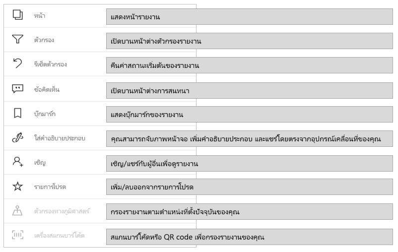

การดำเนินการบางอย่างอาจถูกปิดใช้งาน ทั้งนี้ขึ้นอยู่กับความสามารถของรายงานที่ระบุSome of the actions might be disabled because they're dependent on the specific report capabilities.
ตัวอย่างเช่น:For example:

**บุ๊กมาร์ก** จะปรากฏขึ้นเฉพาะเมื่อมีการตั้งค่า [บุ๊กมาร์ก](mobile-reports-in-the-mobile-apps.md#bookmarks) ในรายงาน**Bookmarks** is present only if [bookmarks](mobile-reports-in-the-mobile-apps.md#bookmarks) have been set in the report. ทั้งบุ๊กมาร์กส่วนตัวที่คุณสามารถกำหนดในบริการของ Power BI และบุ๊กมาร์กที่กำหนดโดยผู้สร้างรายงานจะแสดงขึ้นBoth personal bookmarks that you can define in Power BI service and bookmarks defined by the report creator are shown. หากมีการกำหนดหนึ่งในบุ๊กมาร์กให้เป็นบุ๊กมาร์กค่าเริ่มต้นแล้ว รายงานจะเปิดไปยังมุมมองนั้นเมื่อโหลดรายงานIf one of the bookmarks has been defined as the default bookmark, the report will open to that view when it loads.

**คำอธิบายประกอบและการแชร์** อาจปิดใช้งานถ้ามี [นโยบายการป้องกัน Intune](/intune/app-protection-policies) ในองค์กรของคุณที่ห้ามการแชร์จากแอปอุปกรณ์เคลื่อนที่ Power BI**Annotate and share** might be turned off if there's an [Intune protection policy](/intune/app-protection-policies) in your organization that prohibits sharing from a Power BI mobile app.

**เชิญ** จะถูกเปิดใช้งานเฉพาะเมื่อคุณมีสิทธิ์ในการแชร์รายงานกับผู้อื่นเท่านั้น**Invite** is enabled only if you have permission to share the report with others. คุณจะมีสิทธิ์เฉพาะในกรณีที่คุณเป็นเจ้าของรายงาน หรือถ้าเจ้าของให้สิทธิ์แก่คุณในการแชร์ต่อYou'll have permission only if you're the owner of the report or if the owner has given you reshare permission.

**การกรองตามตำแหน่งที่ตั้งปัจจุบัน** จะเปิดใช้งาน หากผู้สร้างรายงานจัดประเภทข้อมูลในรายงานด้วยข้อมูลทางภูมิศาสตร์**Filter by current location** is enabled if the report author categorized the report with geographical data. สำหรับข้อมูลเพิ่มเติม กรุณาอ่านเกี่ยวกับ[การระบุข้อมูลทางภูมิศาสตร์ในรายงาน](../../transform-model/desktop-mobile-geofiltering.md)For more information, read about [identifying geographical data in a report](../../transform-model/desktop-mobile-geofiltering.md).

**สแกนเพื่อกรองรายงานตามบาร์โค้ด** จะเปิดใช้งานเฉพาะเมื่อมีการแท็กชุดข้อมูลในรายงานของคุณเป็น **บาร์โค้ด****Scan to filter the report by barcode** is enabled only if the dataset in your report is tagged as **Barcode**. สำหรับข้อมูลเพิ่มเติม กรุณาอ่านเกี่ยวกับ [การแท็กบาร์โค้ดใน Power BI Desktop](../../transform-model/desktop-mobile-barcodes.md)For more information, read about [tagging barcodes in Power BI Desktop](../../transform-model/desktop-mobile-barcodes.md).

### บุ๊กมาร์กBookmarks

แอป Power BI สำหรับอุปกรณ์เคลื่อนที่รองรับทั้งบุ๊กมาร์กรายงานซึ่งผู้สร้างรายงานได้กำหนดและบุ๊กมาร์กส่วนตัวที่ี่คุณสามารถกำหนดในบริการของ Power BIThe Power BI mobile app supports both report bookmarks that the report creator has defined and personal bookmarks that you can define in the Power BI service. คุณสามารถค้นหาเมนูบุ๊กมาร์กภายใต้ **ตัวเลือกเพิ่มเติม** (...) บน [แถบเครื่องมือการดำเนินการรายงาน](mobile-reports-in-the-mobile-apps.md#all-report-actions)You can find the bookmarks menu under **More options** (...) on the [report actions toolbar](mobile-reports-in-the-mobile-apps.md#all-report-actions).

บุ๊กมาร์กค่าเริ่มต้นจะถูกระบุด้วยไอคอนพิเศษDefault bookmarks are indicated by a special icon. สำหรับบุ๊กมาร์กส่วนบุคคล คุณสามารถตั้งค่า ยกเลิกหรือเปลี่ยนการตั้งค่าเริ่มต้นโดยการแตะ **ตัวเลือกเพิ่มเติม (...)** ถัดจากบุ๊กมาร์กที่คุณต้องการเปลี่ยนแปลง และการเลือก **สร้างค่าเริ่มต้น** หรือ **ล้างข้อมูลค่าเริ่มต้น**For personal bookmarks you can set, unset, or change the default setting by tapping **More options (...)** next to the bookmark you want to change and choosing **Make default** or **Clear default**.

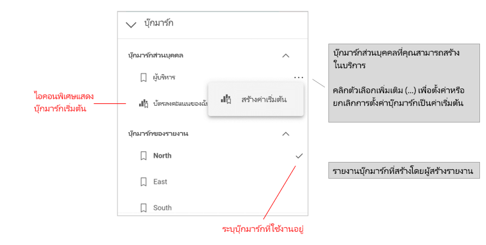

เมื่อมุมมองบุ๊กมาร์กของรายงานเปิดขึ้น ชื่อของบุ๊กมาร์กจะปรากฏที่ด้านบนของรายงานWhen a bookmark view of a report is open, the name of the bookmark appears at the top of the report.

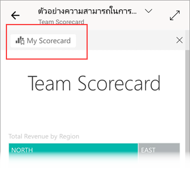

[เรียนรู้เพิ่มเติมเกี่ยวกับบุ๊กมาร์กในบริการ Power BI](../end-user-bookmarks.md)[Learn more about bookmarks in the Power BI service](../end-user-bookmarks.md).

## ตรวจสอบความผิดปกติในชุดข้อมูลเวลาInvestigate anomalies in time series data

[การตรวจหาสิ่งผิดปกติ](https://powerbi.microsoft.com/blog/anomaly-detection-preview/) เป็นคุณลักษณะของ Power BI ที่ตรวจหาสิ่งผิดปกติโดยอัตโนมัติ (เช่น ค่าที่อยู่นอกช่วงที่คาดไว้) บนแผนภูมิเส้นพร้อมชุดข้อมูลเวลา[Anomaly detection](https://powerbi.microsoft.com/blog/anomaly-detection-preview/) is a Power BI feature that automatically detects anomalies (i.e. values that lay outside expected ranges) on line charts with time series data. นอกจากนี้ยังให้คำอธิบายที่เป็นไปได้โดยจัดอันดับตามความสามารถในการอธิบายสำหรับสาเหตุของค่าที่ผิดปกติIn addition, it provides possible explanations, ranked according their explanatory strength, for the cause of the anomalous values. การตรวจหาสิ่งผิดปกติจะพร้อมใช้งานหากผู้สร้างรายงานเปิดใช้งานบนแผนภูมิแล้วAnomaly detection is available if it has been enabled on the chart by the report creator. 

เมื่อคุณดูรายงานที่เปิดใช้งานการตรวจหาสิ่งผิดปกติบนแผนภูมิที่มีชุดข้อมูลเวลาคุณจะเห็นความผิดปกติที่ระบุบนแผนภูมิเช่นเดียวกับที่คุณทำในบริการของ Power BI และใน Power BI DesktopWhen you view a report that has anomaly detection enabled on a chart with time series data, you’ll see the the anomalies indicated on chart, just like you would in the Power BI service and in Power BI Desktop. 

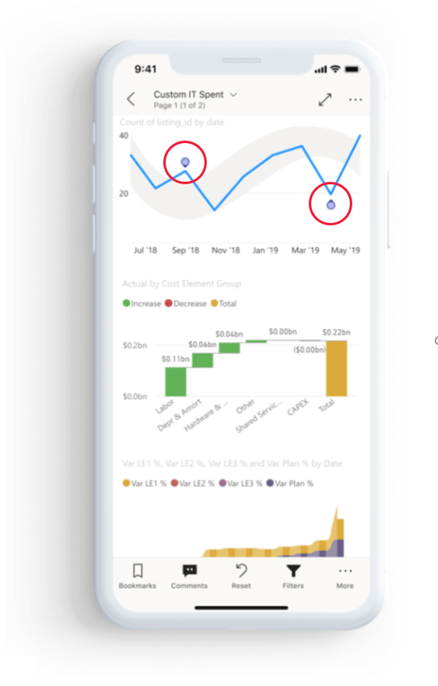

หากต้องการดูข้อมูลเพิ่มเติมและคำอธิบายคุณต้องเปิดแผงความผิดปกติTo see additional information and the explanations, you need to open the Anomalies panel. มีหลายวิธีในการทำขั้นตอนนี้:There are a number of ways to do this:
* แตะตัวบ่งชี้ความผิดปกติบนแผนภูมิTap the anomaly indication on the chart. 
* แตะ **ตัวเลือกเพิ่มเติม (…)** และเลือก **แสดงความผิดปกติ** จากเมนูที่ปรากฏขึ้นTap **More options (…)** and choose **Show anomalies** from the menu that appears.    
* แตะจุดข้อมูลเพื่อแสดงคำแนะนำเครื่องมือและเลือก **ความผิดปกติ**Tap the data point to display a tooltip, and choose **Anomalies**.

รูปภาพด้านล่างแสดงให้เห็นถึงสามวิธีในการเปิดแผงความผิดปกติThe image below illustrates the three ways of opening the Anomalies panel.

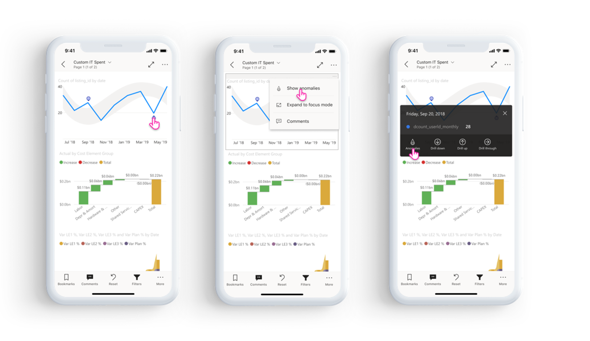

ในแผงความผิดปกติคุณจะเห็นคำอธิบายภาษาธรรมชาติเกี่ยวกับความผิดปกติที่ตรวจพบรวมถึงปัจจัยที่เชื่อมโยงซึ่งเรียงตามความสามารถในการอธิบายIn the anomalies panel you’ll see a natural language explanation of the anomaly detected, as well as associated factors sorted by their explanatory strength. ปัดจากขวาไปซ้ายเพื่อดูปัจจัยที่เกี่ยวข้องทั้งหมดและจุดแข็งของสิ่งนั้นSwipe from right to left to view all relevant factors and their strengths.

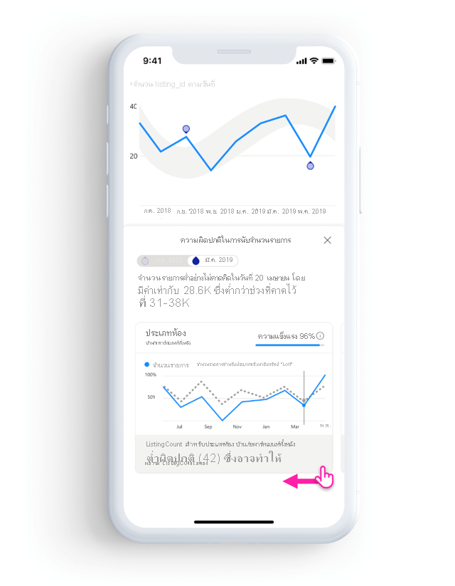

ในขณะที่แผงความผิดปกติจะปรากฏให้เห็น แต่รายงานสำหรับอุปกรณ์เคลื่อนที่ยังคงเลื่อนอยู่ข้างใต้ได้ ดังนั้นคุณจึงสามารถโต้ตอบกับรายงานของคุณ การแบ่งส่วนและการแบ่งส่วนข้อมูลเพื่อทำความเข้าใจความผิดปกติในข้อมูลของคุณได้ดีขึ้นWhile the Anomalies panel is visible, the mobile report is still scrollable under it, so you can continue interacting with your report, slicing and dicing to better understand anomalies in your data. สำหรับการโต้ตอบแต่ละครั้ง Power BI จะเรียกใช้การตรวจหาสิ่งผิดปกติอีกครั้งเพื่อตรวจจับสิ่งผิดปกติในข้อมูลในขอบเขตFor each interaction, Power BI re-runs anomaly detection to detect anomalies in the data in scope. 

## รีเฟรชข้อมูลของคุณRefresh your data

หากคุณไม่แน่ใจว่าคุณกำลังดูข้อมูลล่าสุดคุณสามารถดึงข้อมูลใหม่ลงในรายงานของคุณจากบริการของ Power BI:If you're not sure you’re viewing the most up-to-date data, you can pull new data down to your report from the Power BI service:

* บนอุปกรณ์ iOS และแท็บเล็ต Android ให้ดึงลงเล็กน้อยจากบนลงล่างบนหน้ารายงานOn iOS devices and Android tablets, pull down slightly from top to bottom on the report page.
* บนโทรศัพท์ Android คุณสามารถใช้การดำเนินการแบบดึงลงหรือปุ่มรีเฟรชโดยขึ้นอยู่กับว่าคุณได้ตั้งค่าในการ [ตั้งค่าการโต้ตอบ](mobile-app-interaction-settings.md) อย่างไรOn Android phones, you can use either the pull-down action or a refresh button, depending on how you've set it up in the [interaction settings](mobile-app-interaction-settings.md).
* บนอุปกรณ์ Windows ให้ใช้ปุ่มรีเฟรชที่มุมบนขวาของจอแสดงผลOn Windows devices, use the refresh button in the upper right of the display.

    หน้ารายงานที่มี [การรีเฟรชหน้าอัตโนมัติ](../../create-reports/desktop-automatic-page-refresh.md) จะรีเฟรชโดยอัตโนมัติตามที่กำหนดค่าไว้ (เฉพาะแอป Windows เท่านั้น)Report pages that have [auto page refresh](../../create-reports/desktop-automatic-page-refresh.md) will automatically refresh as configured (Windows app only).

>[!NOTE]
>วิธีการรีเฟรชข้างต้นไม่รีเฟรชชุดข้อมูลเบื้องต้นThe above refresh methods do not refresh the underlying dataset. แต่มีการปรับปรุงรายงานที่คุณกำลังดูบนแอปสำหรับอุปกรณ์เคลื่อนที่ที่มีข้อมูลใหม่ๆ ที่อาจมีอยู่ใน Power BIRather, they update the report you're viewing on the mobile app with any new data that might exist in Power BI.

### ฉันจะทราบได้อย่างไรว่ารายงานของฉันถูกรีเฟรชครั้งล่าสุดเมื่อใดHow do I know when my report was last refreshed?

หากต้องการทราบว่ารายงานของคุณได้รับการรีเฟรชครั้งล่าสุดหรือไม่ ให้แตะส่วนหัวรายงานTo find out when your report was last refreshed, tap the report header. แผนภูมิการนำทางไปยังรายงานจะแสดงรวมถึงวันที่และเวลาของการรีเฟรชครั้งล่าสุดThe navigation tree to the report will be displayed, including the date and time of the last refresh. 

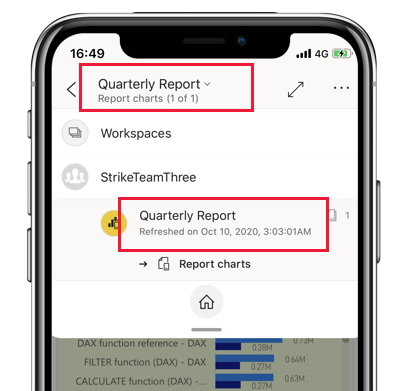
 
## กำหนดค่าประสบการณ์การใช้งานของคุณด้วยรายงานConfigure your experience with reports
แอป Power BI สำหรับอุปกรณ์เคลื่อนที่มีจำนวนการตั้งค่าที่ช่วยให้คุณสามารถควบคุมประสบการณ์การใช้งานรายงานของคุณได้The Power BI mobile app has a number of settings that enable you to control your report experience. ในขณะนี้ คุณสามารถกำหนดค่าCurrently you can configure
* **การโต้ตอบกับวิชวลรายงาน**: คุณสามารถเลือกใช้การโต้ตอบแบบแตะครั้งเดียวหรือการโต้ตอบแบบแตะสองครั้ง**Interaction with report visuals**: You can choose to use either single-tap or double-tap interaction.
* **วิธีการรีเฟรชข้อมูล**: คุณสามารถเลือกที่จะใช้ปุ่มรีเฟรชหรือการดำเนินการแบบดึงลงสำหรับการรีเฟรชข้อมูลรายงานได้**Data refresh method**: You can choose to have either a refresh button or a pull-down action for refreshing report data.
* **การแสดงผลส่วนท้ายของรายงาน**: คุณสามารถเลือกที่จะแสดงส่วนท้ายที่เทียบชิดขอบที่จะมองเห็นได้เสมอ หรือส่วนท้ายแบบไดนามิกที่ซ่อนและปรากฏขึ้นใหม่ตามการดำเนินการของคุณ (ตัวอย่างเช่น การเลื่อน)**Report footer visibility**: You can choose to have either a docked footer that is always visible, or a dynamic footer that hides and reappears depending on your actions (scrolling, for instance).

ดู [การตั้งค่าการโต้ตอบของแอป](./mobile-app-interaction-settings.md) สำหรับข้อมูลเกี่ยวกับวิธีการเปลี่ยนการตั้งค่าเหล่านี้See [app interaction settings](./mobile-app-interaction-settings.md) for information about how to change these settings.

## ขั้นตอนถัดไปNext steps
* [ดูและโต้ตอบกับรายงาน Power BI ที่ปรับให้เหมาะสมกับโทรศัพท์ของคุณView and interact with Power BI reports optimized for your phone](mobile-apps-view-phone-report.md)
* [สร้างเวอร์ชันของรายงานที่ปรับให้เหมาะสมที่สุดสำหรับโทรศัพท์แล้วCreate a version of a report that's optimized for phones](../../create-reports/desktop-create-phone-report.md)
* มีคำถามหรือไม่Questions? [ลองถามชุมชน Power BITry asking the Power BI Community](https://community.powerbi.com/)