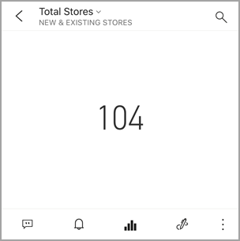
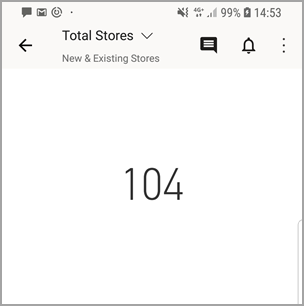

# ตั้งค่าการแจ้งเตือนข้อมูลในแอป Power BI สำหรับอุปกรณ์เคลื่อนที่Set data alerts in the Power BI mobile apps
นำไปใช้กับ:Applies to:

|  |  |  |  |  |
|:--- |:--- |:--- |:--- |:--- |
| iPhoneiPhones |iPadiPads |โทรศัพท์ AndroidAndroid phones |แท็บเล็ต AndroidAndroid tablets |อุปกรณ์ Windows 10Windows 10 devices |

คุณสามารถตั้งค่าการแจ้งเตือนบนแดชบอร์ดในแอป Power BI สำหรับอุปกรณ์เคลื่อนที่และในบริการของ Power BIYou can set alerts on dashboards in the Power BI mobile apps and in the Power BI service. ข้อความแจ้งเตือนจะเตือนคุณเมื่อมีการเปลี่ยนแปลงข้อมูลในไทล์เกินขีดจำกัดที่คุณตั้งค่าAlerts notify you when data in a tile changes beyond limits you set. ข้อความแจ้งเตือนสำหรับไทล์ที่มีจำนวนเดียว เช่น บัตรและตัวประเมิน แต่ไม่มีข้อมูลการสตรีมAlerts work for tiles featuring a single number, such as cards and gauges, but not with streaming data. คุณสามารถตั้งค่าการแจ้งเตือนข้อมูลบนอุปกรณ์เคลื่อนที่ของคุณ และดูเอกสารเหล่านั้นในบริการของ Power BI และกลับกันได้You can set data alerts on your mobile device and see them in the Power BI service, and vice versa. มีเพียงคุณเท่านั้นที่สามารถดูการแจ้งเตือนข้อมูลที่คุณตั้งค่า แม้ว่าคุณแชร์แดชบอร์ดหรือสแนปช็อตของไทล์Only you can see the data alerts you set, even if you share a dashboard or a snapshot of a tile.

คุณสามารถกำหนดการแจ้งเตือนหากคุณมีสิทธิ์การใช้งาน Power BI Pro หรือหากแดชบอร์ดที่แชร์กันอยู่ในความจุแบบพรีเมี่ยมYou can set alerts on tiles if you have a Power BI Pro license, or if the shared dashboard is in a Premium capacity. 

> [!WARNING]
> การแจ้งเตือนข้อมูลแสดงข้อมูลของคุณData-driven alert notifications provide information about your data. ถ้าอุปกรณ์ของคุณถูกขโมย เราขอแนะนำให้ไปยังบริการของ Power BI เพื่อปิดกฎการแจ้งเตือนทั้งหมดที่อิงข้อมูลIf your device gets stolen, we recommend going to the Power BI service to turn off all data-driven alert rules. 
> 
> เรียนรู้เพิ่มเติมเกี่ยวกับ[การจัดการการแจ้งเตือนข้อมูลในบริการของ Power BI](../../create-reports/service-set-data-alerts.md)Learn more about [managing data alerts in the Power BI service](../../create-reports/service-set-data-alerts.md).
> 
> 

## การแจ้งเตือนข้อมูลบน iPhone หรือ iPadData alerts on an iPhone or iPad
### ตั้งค่าการแจ้งเตือนบน iPhone หรือ iPadSet an alert on an iPhone or iPad
1. แตะหมายเลขหรือไทล์ตัวประเมินในแดชบอร์ดเพื่อเปิดในโหมดโฟกัสTap a number or gauge tile in a dashboard to open it in focus mode.  
   
   
2. แตะไอคอน bell:::image type="icon" source="media/mobile-set-data-alerts-in-the-mobile-apps/power-bi-iphone-alert-icon.png" border="false":::เพื่อเพิ่มข้อความแจ้งเตือน  
3. แตะ **เพิ่มกฎการแจ้งเตือน**Tap **Add alert rule**.
   
   
4. เลือกรับการแจ้งเตือนที่มากหรือน้อยกว่าค่าหนึ่ง จากนั้นตั้งค่าChoose to receive alerts above or below a value, then set the value.
   
   
5. ตัดสินใจว่า จะรับการแจ้งเตือนเป็นรายชั่วโมงหรือรายวัน และเลือกว่าจะรับอีเมล์เมื่อคุณได้รับการแจ้งเตือนด้วยหรือไม่Decide whether to receive hourly or daily alerts, and whether to also receive an email when you get the alert.
   
   > [!NOTE]
   > คุณไม่ได้รับข้อความแจ้งเตือนทุกชั่วโมงหรือทุกวันเว้นแต่ว่าข้อมูลมีการรีเฟรชจริงในเวลานั้นYou don't receive alerts every hour or every day unless the data has actually refreshed in that time.
   > 
   > 
6. คุณสามารถเปลี่ยนชื่อเรื่องการแจ้งเตือนด้วยYou can change the alert title, too.
7. แตะ **บันทึก**Tap **Save**.
8. ไทล์เดียวสามารถมีการแจ้งเตือนสำหรับค่าทั้งเหนือและต่ำกว่าค่าเกณฑ์A single tile can have alerts for values both above and below thresholds. ใน **จัดการการแจ้งเตือน** แตะ **เพิ่มกฎการแจ้งเตือน**In **Manage alerts**, tap **Add alert rule**.
   
   

### จัดการการแจ้งเตือนบน iPhone หรือ iPad ของคุณManage alerts on your iPhone or iPad
คุณสามารถจัดการการแจ้งเตือนแต่ละรายการบนอุปกรณ์เคลื่อนที่ของคุณ หรือ[จัดการการแจ้งเตือนของคุณทั้งหมดในบริการของ Power BI](../../create-reports/service-set-data-alerts.md)ได้You can manage individual alerts on your mobile device or [manage all your alerts in the Power BI service](../../create-reports/service-set-data-alerts.md).

1. ในแดชบอร์ด แตะตัวเลขหรือไทล์ตัวประเมินที่มีข้อความแจ้งเตือนIn a dashboard, tap a number or gauge tile that has an alert.  
   
   

2. แตะไอคอน bell :::image type="icon" source="media/mobile-set-data-alerts-in-the-mobile-apps/power-bi-iphone-has-alert-icon.png" border="false":::  
3. แตะชื่อของการแจ้งเตือนเพื่อแก้ไข แตะตัวเลื่อนเพื่อปิดการแจ้งเตือนทางอีเมล์ หรือแตะถังขยะเพื่อลบการแจ้งเตือนTap the name of the alert to edit it, tap the slider to turn off email alerts, or tap the garbage can to delete the alert.
   
    

## การแจ้งเตือนข้อมูลบนอุปกรณ์ AndroidData alerts on an Android device
### ตั้งค่าการแจ้งเตือนบนอุปกรณ์ AndroidSet an alert on an Android device
1. ในแดชบอร์ด Power BI แตะตัวเลขหรือไทล์ตัวประเมินเพื่อเปิดIn a Power BI dashboard, tap a number or gauge tile to open it.  
2. แตะไอคอน bell:::image type="icon" source="media/mobile-set-data-alerts-in-the-mobile-apps/power-bi-android-alert-icon.png" border="false":::เพื่อเพิ่มข้อความแจ้งเตือน  
   
   
3. แตะไอคอนเครื่องหมายบวก (+)Tap the plus icon (+).
   
   
4. เลือกเพื่อรับการแจ้งเตือนที่เหนือหรือต่ำกว่าค่าหนึ่ง และพิมพ์ค่าChoose to receive alerts above or below a value, and type the value.
   
   
5. แตะ **เสร็จสิ้น**Tap **Done**.
6. ตัดสินใจว่า จะรับการแจ้งเตือนเป็นรายชั่วโมงหรือรายวัน และเลือกว่าจะรับอีเมล์เมื่อคุณได้รับการแจ้งเตือนด้วยหรือไม่Decide whether to receive hourly or daily alerts, and whether to also receive an email when you get the alert.
   
   > [!NOTE]
   > คุณไม่ได้รับข้อความแจ้งเตือนทุกชั่วโมงหรือทุกวันเว้นแต่ว่าข้อมูลมีการรีเฟรชจริงในเวลานั้นYou don't receive alerts every hour or every day unless the data has actually refreshed in that time.
   > 
   > 
7. คุณสามารถเปลี่ยนชื่อเรื่องการแจ้งเตือนด้วยYou can change the alert title, too.
8. แตะ **บันทึก**Tap **Save**.

### จัดการการแจ้งเตือนบนอุปกรณ์ AndroidManage alerts on an Android device
คุณสามารถจัดการการแจ้งเตือนแต่ละรายการในแอป Power BI สำหรับอุปกรณ์เคลื่อนที่หรือ[จัดการการแจ้งเตือนของคุณทั้งหมดในบริการของ Power BI](../../create-reports/service-set-data-alerts.md) ได้You can manage individual alerts in the Power BI mobile app or [manage all your alerts in the Power BI service](../../create-reports/service-set-data-alerts.md).

1. ในแดชบอร์ด แตะตัวเลขหรือไทล์ตัวประเมินที่มีข้อความแจ้งเตือนIn a dashboard, tap a card or gauge tile that has an alert.  
2. แตะไอคอน bell ทึบ:::image type="icon" source="media/mobile-set-data-alerts-in-the-mobile-apps/power-bi-android-filled-alert-bell.png" border="false":::  
3. แตะการแจ้งเตือนเพื่อเปลี่ยนแปลงค่า หรือปิดการแจ้งเตือนTap the alert to change a value or turn it off.
   
    
4. แตะไอคอนเครื่องหมายบวก (+) เมื่อต้องเพิ่มการแจ้งเตือนอื่นให้ไทล์เดียวกันTap the plus icon (+) to add another alert to the same tile.
5. หากต้องลบการแจ้งเตือนทั้งหมด แตะไอคอนถังขยะTo delete the alert altogether, tap the garbage can icon ..

## การแจ้งเตือนข้อมูลบนอุปกรณ์ WindowsData alerts on a Windows device

>[!NOTE]
>การสนับสนุนแอปอุปกรณ์เคลื่อนที่ Power BI สำหรับ **โทรศัพท์ที่ใช้ Windows 10 Mobile** จะถูกยกเลิกในวันที่ 16 มีนาคม 2021Power BI mobile app support for **phones using Windows 10 Mobile** will be discontinued on March 16, 2021. [ศึกษาเพิ่มเติมLearn more](/legal/powerbi/powerbi-mobile/power-bi-mobile-app-end-of-support-for-windows-phones)

### ตั้งค่าการแจ้งเตือนข้อมูลบนอุปกรณ์ WindowsSet data alerts on a Windows device
1. แตะหมายเลขหรือไทล์ตัวประเมินในแดชบอร์ดเพื่อเปิดTap a number or gauge tile in a dashboard to open it.  
2. แตะไอคอน bell:::image type="icon" source="media/mobile-set-data-alerts-in-the-mobile-apps/power-bi-windows-10-alert-bell-off.png" border="false":::เพื่อเพิ่มข้อความแจ้งเตือน  
   
   
3. แตะไอคอนเครื่องหมายบวก (+)Tap the plus icon (+).
   
   
4. เลือกเพื่อรับการแจ้งเตือนที่เหนือหรือต่ำกว่าค่าหนึ่ง และพิมพ์ค่าChoose to receive alerts above or below a value, and type the value.
   
   
5. ตัดสินใจว่า จะรับการแจ้งเตือนเป็นรายชั่วโมงหรือรายวัน และเลือกว่าจะรับอีเมล์เมื่อคุณได้รับการแจ้งเตือนด้วยหรือไม่Decide whether to receive hourly or daily alerts, and whether to also receive an email when you get the alert.
   
   > [!NOTE]
   > คุณไม่ได้รับข้อความแจ้งเตือนทุกชั่วโมงหรือทุกวันเว้นแต่ว่าข้อมูลมีการรีเฟรชจริงในเวลานั้นYou don't receive alerts every hour or every day unless the data has actually refreshed in that time.
   > 
   > 
6. คุณสามารถเปลี่ยนชื่อเรื่องการแจ้งเตือนด้วยYou can change the alert title, too.
7. แตะตัวกาเครื่องหมายTap the check mark.
8. ไทล์เดียวสามารถมีการแจ้งเตือนสำหรับค่าทั้งเหนือและต่ำกว่าค่าเกณฑ์A single tile can have alerts for values both above and below thresholds. ใน **จัดการการแจ้งเตือน** แตะเครื่องหมายบวก (+)In **Manage alerts**, tap the plus sign (+).
   
   

### จัดการการแจ้งเตือนบนอุปกรณ์ WindowsManage alerts on a Windows device
คุณสามารถจัดการการแจ้งเตือนแต่ละรายการในแอป Power BI สำหรับอุปกรณ์เคลื่อนที่หรือ[จัดการการแจ้งเตือนของคุณทั้งหมดในบริการของ Power BI](../../create-reports/service-set-data-alerts.md) ได้You can manage individual alerts in the Power BI mobile app or [manage all your alerts in the Power BI service](../../create-reports/service-set-data-alerts.md).

1. ในแดชบอร์ด แตะตัวเลขหรือไทล์ตัวประเมินที่มีข้อความแจ้งเตือนIn a dashboard, tap a card or gauge tile that has an alert.  
2. แตะไอคอน bell :::image type="icon" source="media/mobile-set-data-alerts-in-the-mobile-apps/power-bi-windows-10-alert-bell-on.png" border="false":::  
   
   
3. แตะการแจ้งเตือนเพื่อเปลี่ยนแปลงค่า หรือปิดการแจ้งเตือนTap the alert to change a value or turn it off.
   
    
4. เมื่อต้องลบการแจ้งเตือนทั้งหมด คลิกขวา หรือแตะ ค้าง > **ลบ**To delete the alert altogether, right-click or tap and hold > **Delete**.

## รับการแจ้งเตือนReceiving alerts
คุณจะได้รับข้อความแจ้งเตือนใน [ศูนย์การแจ้งเตือน](mobile-apps-notification-center.md)ของ Power BI บนอุปกรณ์เคลื่อนที่ของคุณ หรือ ในบริการของ Power BI พร้อมกับการแจ้งเตือนเกี่ยวกับแดชบอร์ดใหม่่มีคนแชร์กับคุณYou receive alerts in the Power BI [Notification Center](mobile-apps-notification-center.md) on your mobile device or in the Power BI service, along with notifications about new dashboards that someone has shared with you.

แหล่งข้อมูลจะถูกตั้งค่าการรีเฟรชรายวัน แม้ว่าบางแหล่งข้อมูลจะมีการรีเฟรชบ่อยกว่าData sources are often set to refresh daily, although some refresh more often. เมื่อข้อมูลในแดชบอร์ดได้รับการรีเฟรช ถ้าข้อมูลที่มีการติดตามถึงค่าเกณฑ์หนึ่งใดที่คุณตั้ง หลายสิ่งที่จะเกิดขึ้นWhen the data in the dashboard is refreshed, if the data being tracked reaches one of the thresholds you've set, several things will happen.

1. Power BI จะตรวจสอบเพื่อดูว่าเกินหนึ่งชั่วโมงหรือ 24 ชั่วโมงแล้วหรือไม่ (ขึ้นอยู่กับตัวเลือกที่คุณเลือก) นับตั้งแต่มีการส่งการแจ้งเตือนล่าสุดPower BI checks to see if it's been more than an hour or more than 24 hours (depending on the option you selected) since the last alert was sent.
   
   ตราบใดที่ข้อมูลเกินค่าเกณฑ์ คุณจะได้รับการแจ้งเตือนทุกชั่วโมงหรือทุกๆ 24 ชั่วโมงAs long as the data is past the threshold, you'll get an alert every hour or every 24 hours.
2. ถ้าคุณได้ตั้งค่าการแจ้งเตือนให้ส่งอีเมล์ คุณจะพบสิ่งที่เหมือนสิ่งนี้้ในกล่องอีเมลเข้าของคุณIf you've set the alert to send you an email, you'll find something like this in your Inbox.
   
   
3. Power BI จะเพิ่มข้อความใน [ศูนย์การแจ้งเตือน](mobile-apps-notification-center.md) ของคุณและเพิ่มจุดสีเหลืองที่ไอคอนกระดิ่ง :::image type="icon" source="media/mobile-set-data-alerts-in-the-mobile-apps/powerbi-alert-tile-notification-icon.png" border="false":::บนแถบชื่อเรื่อง (iOS และ Android) หรือไปที่ปุ่มการนำทางส่วนกลาง  (อุปกรณ์ Windows 10)

4. แตะไอคอนกระดิ่ง :::image type="icon" source="media/mobile-set-data-alerts-in-the-mobile-apps/powerbi-alert-tile-notification-icon.png" border="false":::หรือปุ่มนำทางส่วนกลาง  เพื่อ [เปิด **ศูนย์การแจ้งเตือน** ของคุณ](mobile-apps-notification-center.md)และดูรายละเอียดการแจ้งเตือน
   
     

> [!NOTE]
> ข้อความแจ้งเตือนทำงานกับข้อมูลที่ได้รับการรีเฟรชเท่านั้นAlerts only work on data that is refreshed. เมื่อมีการรีเฟรชข้อมูล Power BI จะค้นหาเพื่อดูว่าข้อความแจ้งเตือนถูกตั้งค่าสำหรับข้อมูลนั้นหรือไม่When data refreshes, Power BI looks to see if an alert is set for that data. ถ้าข้อมูลได้ถึงค่าเกณฑ์การแจ้งเตือน ข้อความแจ้งเตือนจะถูกเริ่มIf the data has reached an alert threshold, an alert is triggered.
> 
> 

## เคล็ดลับและการแก้ไขปัญหาTips and troubleshooting
* ข้อความแจ้งเตือนในขณะนี้ไม่ได้สนับสนุนไทล์ Bing หรือไทล์การ์ด ที่มีหน่วยวัดวันที่/เวลาAlerts currently aren't supported for Bing tiles or card tiles with date/time measures.
* ข้อความแจ้งเตือนจะทำงานกับข้อมูลตัวเลขเท่านั้นAlerts only work with numeric data.
* ข้อความแจ้งเตือนทำงานกับข้อมูลที่ได้รับการรีเฟรชเท่านั้นAlerts only work on data that is refreshed. ข้อความแจ้งเตือนจะไม่ทำงานกับข้อมูลแบบคงที่They don't work on static data.
* ข้อความแจ้งเตือนจะไม่ทำงานกับไทล์ที่ประกอบด้วยข้อมูลสตรีมAlerts don't work with tiles that contain streaming data.

## ขั้นตอนถัดไปNext steps
* [จัดการการแจ้งเตือนของคุณในบริการของ Power BIManage your alerts in the Power BI service](../../create-reports/service-set-data-alerts.md)
* [ศูนย์การแจ้งเตือนอุปกรณ์เคลื่อนที่ power BIPower BI Mobile Notification Center](mobile-apps-notification-center.md)
* มีคำถามหรือไม่Questions? [ลองถามชุมชน Power BITry asking the Power BI Community](https://community.powerbi.com/)