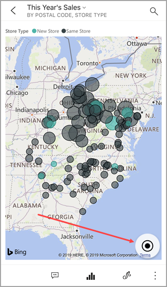
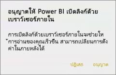
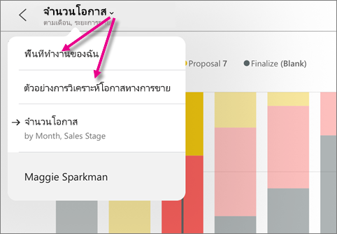
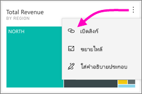
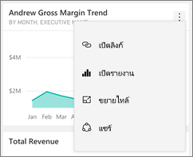
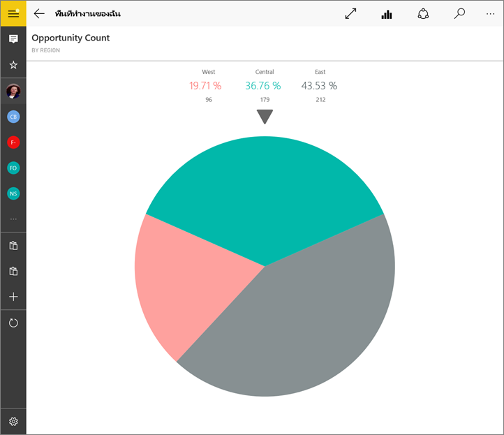
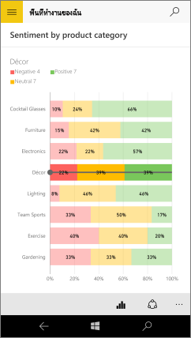

# สำรวจไทล์ในแอป Power BI สำหรับอุปกรณ์เคลื่อนที่Explore tiles in the Power BI mobile apps
นำไปใช้กับ:Applies to:

|  |  |  |  |  |
|:--- |:--- |:--- |:--- |:--- |
| iPhoneiPhones |iPadiPads |โทรศัพท์ AndroidAndroid phones |แท็บเล็ต AndroidAndroid tablets |อุปกรณ์ Windows 10Windows 10 devices |

ไทล์คือสแนปช็อตแบบสดของข้อมูลของคุณ ที่ปักหมุดไว้ที่แดชบอร์ดTiles are live snapshots of your data, pinned to a dashboard. ค่าของไทล์จะเปลี่ยนเมื่อมีการเปลี่ยนแปลงข้อมูลTheir values change as the data changes. **คุณ [เพิ่มไทล์ไปยังแดชบอร์ดในบริการของ Power BI](../end-user-tiles.md)****You [add tiles to a dashboard in the Power BI service](../end-user-tiles.md).** 

จากนั้นในแอป Power BI สำหรับอุปกรณ์เคลื่อนที่ ให้คุณเปิดไทล์ในโหมดโฟกัส และโต้ตอบกับไทล์นั้นThen in the Power BI mobile apps, you open tiles in focus mode and interact with them. คุณสามารถเปิดไทล์ด้วยการแสดงผลด้วยภาพ รวมถึงไทล์ตาม Bing และ R. ทุกชนิดYou can open tiles with all kinds of visuals, including tiles based on Bing and R.

## ไทล์ในแอป iOSTiles in the iOS apps

1. เปิด[แดชบอร์ดในแอปสำหรับอุปกรณ์เคลื่อนที่สำหรับ iOS](mobile-apps-view-dashboard.md)Open a [dashboard in the mobile app for iOS](mobile-apps-view-dashboard.md).
2. แตะไทล์Tap a tile. ซึ่งจะเปิดขึ้นในโหมดโฟกัส โดยสามารถดูและสำรวจข้อมูลของไทล์ได้ง่ายขึ้นIt opens in focus mode, where it's easier to view and explore the tile data. ในโหมดโฟกัสคุณสามารถ:In focus mode you can:
   
   ในแผนภูมิเส้น แผนภูมิแท่ง หรือแผนภูมิคอลัมน์ ให้แตะเพื่อดูค่าสำหรับส่วนเฉพาะของการแสดงภาพIn a line, bar, or column chart, tap to view the values for specific parts of the visualization.
   
    
   
   *ตัวอย่างเช่น ในแผนภูมิเส้นนี้ ค่าที่เลือกคือค่าสำหรับ **ยอดขายของปีนี้** และ **ยอดขายของปีล่าสุด** ใน **เดือนสิงหาคม****For example, in this line chart, the selected values are for **This Year Sales** and **Last Year Sales** in **August**.*  
   
   ในแผนภูมิวงกลม ให้แตะชิ้นของแผนภูมิวงกลมเพื่อแสดงค่าชิ้นส่วนที่ด้านบนของวงกลมIn a pie chart, tap a slice of the pie to show the value of the slice at the top of the pie.  
   
   
3. ในแผนผัง ให้แตะไอคอน **จัดกึ่งกลางแผนผัง** เพื่อจัดกึ่งกลางแผนผังกับตำแหน่งที่ตั้งปัจจุบันของคุณIn a map, tap the **Center Map** icon  to center the map to your current location.

   

4. แตะไอคอนดินสอ เพื่อ[ใส่คำอธิบายไทล์](mobile-annotate-and-share-a-tile-from-the-mobile-apps.md#annotate-and-share-the-tile-report-or-visual) และจากนั้นแตะไอคอนแชร์  เพื่อ[แชร์ให้กับผู้อื่น](mobile-annotate-and-share-a-tile-from-the-mobile-apps.md#annotate-and-share-the-tile-report-or-visual)Tap the pencil icon  to [annotate a tile](mobile-annotate-and-share-a-tile-from-the-mobile-apps.md#annotate-and-share-the-tile-report-or-visual) and then the share icon  to [share it with others](mobile-annotate-and-share-a-tile-from-the-mobile-apps.md#annotate-and-share-the-tile-report-or-visual).

5. [เพิ่มการแจ้งเตือนไปยังไทล์](mobile-set-data-alerts-in-the-mobile-apps.md)[Add an alert to the tile](mobile-set-data-alerts-in-the-mobile-apps.md). Power BI จะแจ้งให้คุณทราบ ถ้าค่าสูงกว่าหรือต่ำกว่าเป้าหมายIf the values go above or below targets, Power BI will notify you.

6. ในบางครั้งผู้สร้างแดชบอร์ดได้เพิ่มลิงก์ลงในไทล์Sometimes the dashboard creator has added a link to a tile. ถ้าเป็นเช่นนั้น จะมีไอคอนลิงก์If so, it has a link icon  เมื่ออยู่ในโหมดโฟกัส:when it's in focus mode:
   
    
   
    ลิงก์สามารถไปที่แดชบอร์ด Power BI อื่น หรือ URL ภายนอกได้Links can go to other Power BI dashboards or to an external URL. คุณสามารถ[แตะลิงก์](../../create-reports/service-dashboard-edit-tile.md#hyperlink)เพื่อเปิดภายในแอป Power BI ได้You can [tap the link](../../create-reports/service-dashboard-edit-tile.md#hyperlink) to open it inside the Power BI app. Power BI จะขอให้คุณอนุญาต ถ้าเป็นไซต์ภายนอกIf it's an external site, Power BI asks you to allow it.
   
    
   
    หลังจากที่คุณเปิดลิงก์ในแอป Power BI แล้ว คุณสามารถคัดลอกลิงก์ และเปิดในหน้าต่างเบราว์เซอร์แทนAfter you open the link in the Power BI app, you can copy the link and open it in a browser window instead.
7. [เปิดรายงาน](mobile-reports-in-the-mobile-apps.md)  ที่เป็นไปตามไทล์[Open the report](mobile-reports-in-the-mobile-apps.md)  that the tile is based on.
8. เมื่อต้องการออกจากโหมดโฟกัสไทล์ ให้แตะชื่อไทล์ จากนั้นแตะชื่อแดชบอร์ด หรือ **My Workspace**To leave tile focus mode, tap the tile name, then tap the dashboard name or **My Workspace**.
   
    

## ไทล์ในแอปสำหรับอุปกรณ์เคลื่อนสำหรับโทรศัพท์และแท็บเล็ต AndroidTiles in the mobile app for Android phones and tablets
1. เปิด[แดชบอร์ดในแอป Power BI สำหรับอุปกรณ์เคลื่อนที่](mobile-apps-view-dashboard.md)Open a [dashboard in the Power BI mobile app](mobile-apps-view-dashboard.md).
2. แตะไทล์เพื่อเปิดในโหมดโฟกัส ซึ่งสามารถดูและสำรวจข้อมูลของไทล์ได้ง่ายขึ้นTap a tile to open it in focus mode, where it's easier to view and explore the tile data.
   
   
   
    ในโหมดโฟกัสคุณสามารถ:In focus mode, you can:
   
   * แตะแผนภูมิเมื่อต้องย้ายแถบในแผนภูมิเส้น แผนภูมิแท่ง แผนภูมิคอลัมน์ หรือแผนภูมิฟอง เมื่อต้องดูค่าสำหรับจุดเฉพาะในการแสดงภาพTap the chart to move the bar in a line, bar, column, or bubble chart, to view the values for a specific point in the visualization.  
   * แตะไอคอนดินสอ เพื่อ[ใส่คำอธิบายไทล์](mobile-annotate-and-share-a-tile-from-the-mobile-apps.md#annotate-and-share-the-tile-report-or-visual) และจากนั้นแตะไอคอนแชร์สแนปช็อต  เพื่อ[แชร์ให้กับผู้อื่น](mobile-annotate-and-share-a-tile-from-the-mobile-apps.md#annotate-and-share-the-tile-report-or-visual)Tap the Pencil icon  to [annotate a tile](mobile-annotate-and-share-a-tile-from-the-mobile-apps.md#annotate-and-share-the-tile-report-or-visual) and then the Share snapshot icon  to [share it](mobile-annotate-and-share-a-tile-from-the-mobile-apps.md#annotate-and-share-the-tile-report-or-visual) with others.
   * แตะไอคอนเปิดรายงาน Tap the Open report icon  ในการ [ดูรายงาน](mobile-reports-in-the-mobile-apps.md) ในแอปมือถือto [view the report](mobile-reports-in-the-mobile-apps.md) in the mobile app.
3. ในบางครั้งผู้สร้างแดชบอร์ดได้เพิ่มลิงก์ลงในไทล์Sometimes the dashboard creator has added a link to a tile. ดังนั้น เมื่อคุณแตะที่จุดไข่ปลาแนวตั้ง ( **...** ) คุณจะเห็น **เปิดลิงก์** :If so, when you tap the vertical ellipsis (**...**) you see **Open link** :
   
    
   
    ลิงก์สามารถไปที่แดชบอร์ด Power BI อื่น หรือ URL ภายนอกได้Links can go to other Power BI dashboards or to an external URL. คุณสามารถ[แตะลิงก์](../../create-reports/service-dashboard-edit-tile.md#hyperlink)เพื่อเปิดภายในแอป Power BI ได้You can [tap the link](../../create-reports/service-dashboard-edit-tile.md#hyperlink) to open it inside the Power BI app. Power BI จะขอให้คุณอนุญาต ถ้าเป็นไซต์ภายนอกIf it's an external site, Power BI asks you to allow it.
   
    
   
    หลังจากที่คุณเปิดลิงก์ในแอป Power BI แล้ว คุณสามารถคัดลอกลิงก์ และเปิดในหน้าต่างเบราว์เซอร์แทนAfter you open the link in the Power BI app, you can copy the link and open it in a browser window instead.
4. แตะลูกศรที่มุมบนซ้ายเพื่อปิดไทล์ และกลับไปยังแดชบอร์ดTap the arrow in the upper-left corner to close the tile and return to the dashboard.

## ไทล์ในแอปสำหรับอุปกรณ์เคลื่อนที่ Windows 10Tiles in the Windows 10 mobile app

>[!NOTE]
>การสนับสนุนแอปอุปกรณ์เคลื่อนที่ Power BI สำหรับ **โทรศัพท์ที่ใช้ Windows 10 Mobile** จะถูกยกเลิกในวันที่ 16 มีนาคม 2021Power BI mobile app support for **phones using Windows 10 Mobile** will be discontinued on March 16, 2021. [ศึกษาเพิ่มเติมLearn more](/legal/powerbi/powerbi-mobile/power-bi-mobile-app-end-of-support-for-windows-phones)

1. เปิด[แดชบอร์ดในแอป Power BI สำหรับอุปกรณ์เคลื่อนที่](mobile-apps-view-dashboard.md)สำหรับ Windows 10Open a [dashboard in the Power BI mobile app](mobile-apps-view-dashboard.md) for Windows 10.
2. แตะเอลลิปซิสแนวตั้งบนไทล์Tap the vertical ellipsis on the tile. จากตรงนี้คุณสามารถ:From here, you can: 
   
    
   
    [แชร์สแนปช็อตของไทล์](mobile-windows-10-phone-app-get-started.md)[Share a snapshot of the tile](mobile-windows-10-phone-app-get-started.md).
   
    แตะ **เปิดรายงาน** เพื่อ [ดูรายงานอ้างอิง](mobile-reports-in-the-mobile-apps.md)Tap **Open Report**  to [view the underlying report](mobile-reports-in-the-mobile-apps.md).
   
    [เปิดลิงก์](../../create-reports/service-dashboard-edit-tile.md#hyperlink)ถ้ามีลิงก์[Open the link](../../create-reports/service-dashboard-edit-tile.md#hyperlink), if it has a link. ลิงก์สามารถไปที่แดชบอร์ด Power BI อื่น หรือ URL ภายนอกได้Links can go to Power BI dashboards or to an external URL.
3. แตะ **ขยายไทล์** Tap **Expand Tile** . ซึ่งจะเปิดขึ้นในโหมดโฟกัส โดยสามารถดูและสำรวจข้อมูลของไทล์ได้ง่ายขึ้นIt opens in focus mode, where it's easier to view and explore the tile data. ในโหมดโฟกัสคุณสามารถ:In this mode you can:
   
   หมุนแผนภูมิวงกลมเพื่อแสดงค่าชิ้นส่วนที่ด้านบนของวงกลมSpin a pie chart to show the values of the slice at the top of the pie.  
   
   
   
   แตะแผนภูมิเมื่อต้องย้ายแถบในแผนภูมิเส้น แผนภูมิแท่ง แผนภูมิคอลัมน์ หรือแผนภูมิฟอง เมื่อต้องดูค่าสำหรับจุดเฉพาะในการแสดงภาพTap the chart to move the bar in a line, bar, column, or bubble chart, to view the values for a specific point in the visualization.  
   
   
   
   *ในแผนภูมิแท่งนี้ ค่าสำหรับแถบ **Decor** จะแสดงที่ด้านบนของแผนภูมิ**In this bar chart, the values for the **Decor** bar are shown at the top of the chart.*
   
   แตะไอคอน **สลับไปยังโหมดการนำเสนอ** Tap the **Switch to presentation mode** icon  หากต้องการเปิดไทล์ในโหมดการนำเสนอโดยไม่มีแถบนำทางและเมนูto open the tile in presentation mode, without the navigation and menu bars.
   
   > [!NOTE]
   > คุณยังสามารถ[ดูแดชบอร์ดและรายงานในโหมดการนำเสนอ](mobile-windows-10-app-presentation-mode.md)ในแอป Power BI สำหรับอุปกรณ์เคลื่อนที่สำหรับ Windows 10 ได้You can also [view dashboards and reports in presentation mode](mobile-windows-10-app-presentation-mode.md) in the Power BI mobile app for Windows 10.
   > 
   > 
   
   ในแผนผัง ให้แตะไอคอน **จัดกึ่งกลางแผนผัง** เพื่อจัดกึ่งกลางแผนผังกับตำแหน่งที่ตั้งปัจจุบันของคุณIn a map, tap the **Center Map** icon  to center the map to your current location.
   
   
   
   แตะไอคอนแชร์ภาพหน้าจอ เพื่อ[แชร์ไทล์](mobile-windows-10-phone-app-get-started.md)กับผู้อื่นTap the Share Snapshot icon  to [share a tile](mobile-windows-10-phone-app-get-started.md) with others.   
   
   แตะไอคอนเปิดรายงาน เพื่อ[ดูรายงาน](mobile-reports-in-the-mobile-apps.md)ที่เป็นไปตามไทล์Tap the Open Report icon  to [view the report](mobile-reports-in-the-mobile-apps.md) that the tile is based on. 
4. แตะลูกศรย้อนกลับหรือปุ่มย้อนกลับเพื่อปิดไทล์ และกลับไปยังแดชบอร์ดTap the back arrow or the back button to close the tile and return to the dashboard.

## ขั้นตอนถัดไปNext steps
* [Power BI คืออะไรWhat is Power BI?](../../fundamentals/power-bi-overview.md)
* มีคำถามหรือไม่Questions? [ลองถามชุมชน Power BITry asking the Power BI Community](https://community.powerbi.com/)