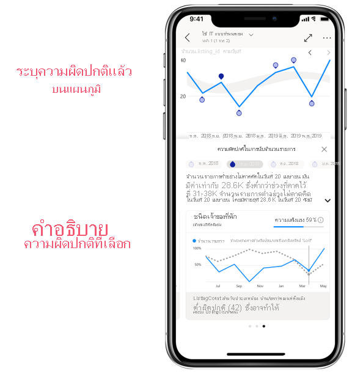
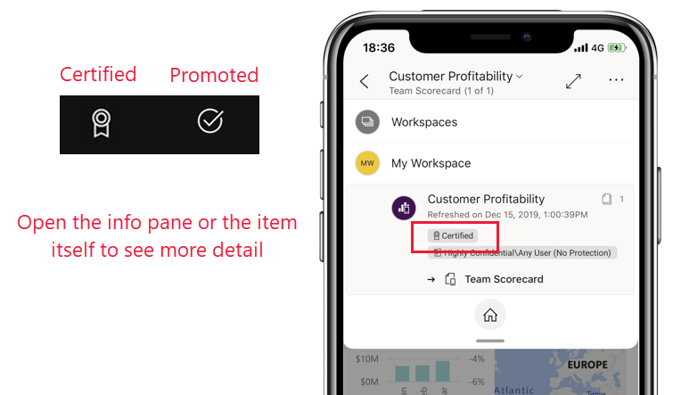
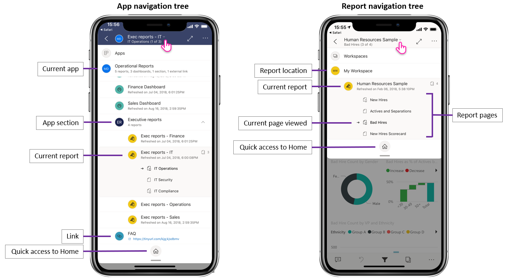
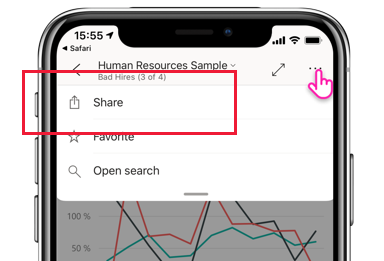
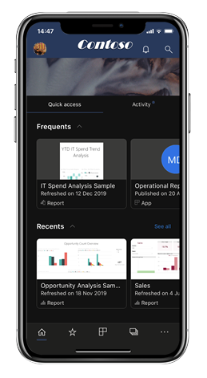
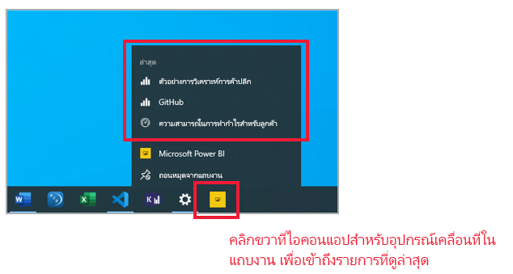
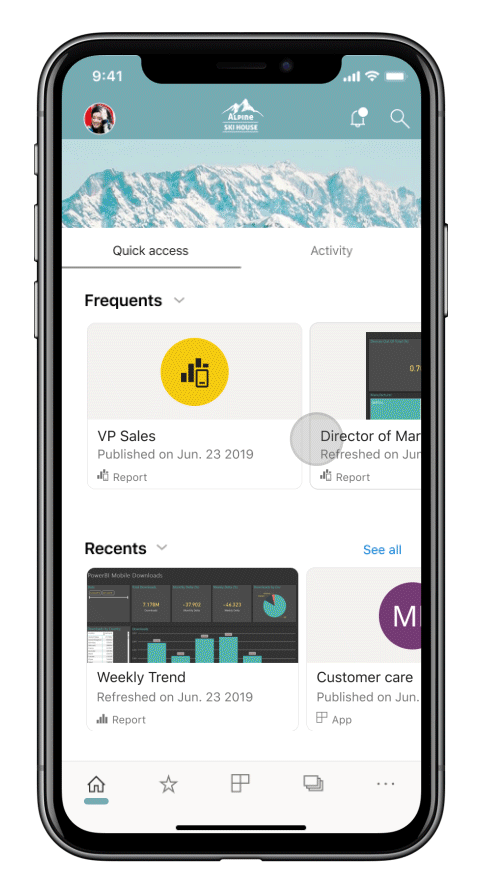
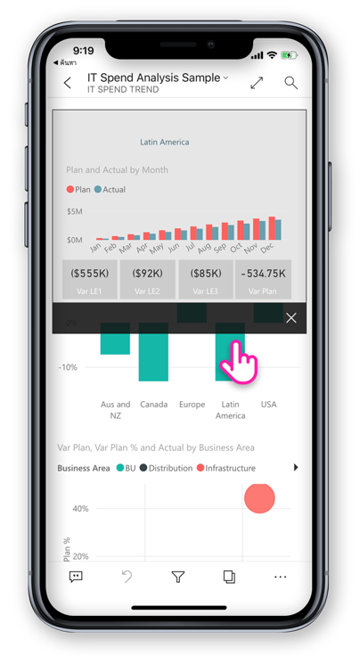
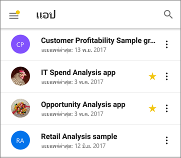
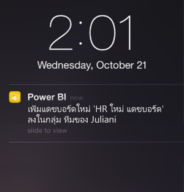

# มีอะไรใหม่ในแอปมือถือสำหรับ Power BIWhat's new in the mobile apps for Power BI
สำหรับ "ข้อมูลอะไรใหม่" ที่เกี่ยวข้อง ให้ดูFor related "What's New" information, see:

* [บล็อกทีมของ power BI สำหรับแอป mobilePower BI team blog for the mobile apps](https://powerbi.microsoft.com/blog/tag/mobile/)
* [มีอะไรใหม่ใน Power BI DesktopWhat's new in Power BI Desktop](../../fundamentals/desktop-latest-update.md)  
* [มีอะไรใหม่ในบริการ Power BIWhat's new in the Power BI service](../../fundamentals/service-whats-new.md)

>[!NOTE]
>การสนับสนุนแอปอุปกรณ์เคลื่อนที่ Power BI สำหรับ **โทรศัพท์ที่ใช้ Windows 10 Mobile** จะถูกยกเลิกในวันที่ 16 มีนาคม 2021The Power BI mobile app support for **phones using Windows 10 Mobile** will be discontinued on March 16, 2021. [ศึกษาเพิ่มเติมLearn more](/legal/powerbi/powerbi-mobile/power-bi-mobile-app-end-of-support-for-windows-phones)

## ธันวาคม 2020December 2020
### เราได้เพิ่มการตรวจหาสิ่งผิดปกติให้กับแอปสำหรับอุปกรณ์เคลื่อนที่We've added anomaly detection to the mobile apps
หากผู้สร้างรายงานได้ตั้งค่าการตรวจหาสิ่งผิดปกติสำหรับการแสดงผลด้วยภาพของรายงาน คุณสามารถดูได้ว่าข้อมูลของคุณมีจุดสูงสุดสูงหรือต่ำอย่างไม่คาดคิดซึ่งเกิดจากค่าผิดปกติของข้อมูล (เช่น ความผิดปกติ)If the report creator has set up anomaly detection for a report visual, you can see if there are unexpectedly high peaks or low dips in your data caused by data outliers (i.e., anomalies). [เรียนรู้เพิ่มเติม!Learn more!](mobile-reports-in-the-mobile-apps.md#investigate-anomalies-in-time-series-data)

### ค้นหาเนื้อหาที่รับรองโดยองค์กรของคุณได้อย่างง่ายดายEasily find your org's endorsed content
เนื้อหาที่ได้รับการ [เลื่อนระดับหรือได้รับการรับรอง](../../collaborate-share/service-endorsement-overview.md) ในบริการ Power BI ได้รับการติดแท็กในแอปด้วยป้ายแล้วContent that's been [promoted or certified](../../collaborate-share/service-endorsement-overview.md) in the Power BI service is now tagged in the app with a badge. ผู้สร้างรายงานโปรโมตเนื้อหาของตนเพื่อแสดงว่าพร้อมให้คุณใช้ (โปรโมต) หรือรับรองเนื้อหาของพวกเขาเพื่อแสดงว่าได้รับการอนุมัติจากองค์กรของคุณ (รับการรับรองแล้ว)Report creators promote their content to show that it's ready for you to use (promoted) or certify their content to show that it's been approved by your org (certified).

### เราได้เพิ่มโหมดสีเข้มลงใน Power BI บนมือถือ (Android)We've added dark mode to Power BI mobile (Android)
ลองใช้โหมดสีเข้มใหม่ในแอปสำหรับอุปกรณ์เคลื่อนที่ Power BI สำหรับอุปกรณ์ AndroidTry out the new dark mode in the Power BI mobile app for Android devices. ในโหมดมืดคุณจะเห็นข้อความสีบนพื้นหลังสีเข้มลดความสว่างของหน้าจอและทำให้ง่ายต่อการดูเนื้อหาของคุณIn dark mode, you'll see light text on a dark background, reducing the brightness of the screen and making it easier to see your content. คุณสามารถสลับระหว่างธีมในการตั้งค่าลักษณะที่ปรากฏของแอปYou can switch between themes in the app appearance settings. [ศึกษาเพิ่มเติมLearn more](mobile-apps-dark-mode.md)

### ขยายมุมมองด้วยโหมดเต็มหน้าจอ (iPad)Maximize the view with full-screen mode (iPads)
เราได้เพิ่มปุ่มใหม่ไปยังแอปบนอุปกรณ์เคลื่อนที่สำหรับ iPad ที่ช่วยให้คุณสามารถลบส่วนหัวและท้ายกระดาษของแอป ทำให้คุณมีพื้นที่สูงสุดในการดูเนื้อหาของคุณWe've now added a new button to the mobile app for iPads that lets you remove app headers and footers, giving you the maximum space for viewing your content. เพียงแตะปุ่มสลับเป็นแบบเต็มหน้าจอSimply tap the full-screen toggle button  ที่มุมบนขวาของหน้าจอเพื่อสลับโหมดin the top right corner of the screen to switch between modes.

## พฤศจิกายน 2020November 2020
### ขยายมุมมองด้วยโหมดเต็มหน้าจอ (แท็บเล็ต Android)Maximize the view with full-screen mode (Android tablets)
เราได้เพิ่มปุ่มใหม่ไปยังแอปบนอุปกรณ์เคลื่อนที่สำหรับแท็บเล็ต Android ที่ช่วยให้คุณสามารถลบส่วนหัวและท้ายกระดาษของแอป ทำให้คุณมีพื้นที่สูงสุดในการดูเนื้อหาของคุณWe've added a new button to the mobile app for Android tablets that lets you remove app headers and footers, giving you the maximum space for viewing your content. เพียงแตะปุ่มสลับเป็นแบบเต็มหน้าจอSimply tap the full-screen toggle button  ที่มุมบนขวาของหน้าจอเพื่อสลับโหมดin the top right corner of the screen to switch between modes.

## ตุลาคม 2020October 2020
### การรีเฟรชหน้าอัตโนมัติตอนนี้ได้รับการรองรับ (Windows)Automatic page refresh is now supported (Windows)

ตอนนี้หน้ารายงานที่กำหนดค่าด้วย [การรีเฟรชหน้าอัตโนมัติ](../../create-reports/desktop-automatic-page-refresh.md) จะรีเฟรชโดยอัตโนมัติในแอป Power BI สำหรับอุปกรณ์ WindowsNow, report pages configured with [auto page refresh](../../create-reports/desktop-automatic-page-refresh.md) will also automatically refresh in the Power BI app for Windows devices. และนี่ไม่ได้หมายความว่าเพียงแค่มุมมองรายงานปกติAnd this doesn't mean just in regular report view. ด้วยการรีเฟรชหน้าอัตโนมัติ [การนำเสนอและสไลด์โชว์ของคุณ](mobile-windows-10-app-presentation-mode.md#slideshows) จะอัปเดตในแบบเรียลไทม์เพื่อให้แน่ใจว่าคุณจะแสดงข้อมูลทางธุรกิจล่าสุดและข้อมูลเชิงลึกอย่างต่อเนื่องWith auto page refresh, your [presentations and slideshows](mobile-windows-10-app-presentation-mode.md#slideshows) will also update in real-time, ensuring that you're always displaying the latest business data and insights.

### การรองรับสำหรับจอแสดงผลรอยบาก (iOS)Support for notch displays (iOS)
เราได้เพิ่มการรองรับสำหรับการแสดงผลบน iPhone และ Ipad ให้คุณเพิ่มพื้นที่หน้าจอสำหรับรายงานและแดชบอร์ดของคุณWe've added support for notch displays on iPhone and iPads, giving you more screen space for your reports and dashboards. 

## กันยายน 2020September 2020
### แอป Power BI (ตัวอย่าง) สำหรับ HoloLens 2 อยู่ในร้านค้า!Power BI app (preview) for HoloLens 2 is out in the stores!

แอป Power BI สำหรับ HoloLens 2 มอบประสบการณ์การใช้งานอย่างเต็มที่The Power BI app for HoloLens 2 brings you an entirely immersive experience. ด้วยการใช้ระบบท่าทางมือของ HoloLens 2 คุณสามารถรับรายงานและแดชบอร์ดที่คุณชื่นชอบออกจากสายพานเครื่องมือ ปรับขนาดและวางไว้รอบตัวคุณในพื้นที่ที่คุณต้องการและแม้แต่เรียกดูหน้ารายงานUsing HoloLens 2’s hand gesture system, you can get your favorite reports and dashboards out of the tool belt, resize and place them around you in space where you need them, and even browse through the pages of the report. การอัปเดตรายงานและแดชบอร์ดในขณะที่คุณกำลังใช้แอป ดังนั้นถ้ามีการเปลี่ยนแปลงข้อมูลคุณจะเห็นการเปลี่ยนแปลงเหล่านั้นทันทีReports and dashboards update while you’re using the app, so if data changes you’ll see those changes right away. เรียนรู้เพิ่มเติมใน [เอกสาร](mobile-hololens2-app.md) ของเราและ [บล็อก](https://powerbi.microsoft.com/blog/power-bi-app-for-mixed-reality-now-available-for-hololens-2/)!Learn more in our [documentation](mobile-hololens2-app.md) and [blog](https://powerbi.microsoft.com/blog/power-bi-app-for-mixed-reality-now-available-for-hololens-2/)!

## สิงหาคม 2020August 2020
### เราได้ปรับปรุงวิธีการนำทางไปยังเนื้อหาของคุณ (iOS และ Android)We've improved how you navigate to your content (iOS and Android)
ในตอนนี้ คุณสามารถไปยังเนื้อหาส่วนต่าง ๆ ของคุณได้อย่างรวดเร็วและง่ายดายด้วย **ทรีการนำทางใหม่** ซึ่งสามารถใช้งานได้จากหัวข้อแบบเลื่อนลงในรายงาน แผงหน้าปัด และแอปNow you can get around your content quickly and easily with a **new navigation tree**, available from the header drop down in reports, dashboards, and apps. คุณจะเห็นลำดับชั้นของตำแหน่งของเนื้อหาของคุณได้อย่างรวดเร็ว และคุณสามารถนำทางตามลำดับชั้นเนื้อหาไปยังเนื้อหาข้างเคียง หรือแม้กระทั่งกลับไปยังหน้าหลักของคุณได้อย่างรวดเร็วYou see the location hierarchy of your content at a glance, and you can easily navigate up the content hierarchy, go to sibling content, or even get quickly back to your home page. หากรายการที่คุณดูเป็นส่วนหนึ่งของแอป ทรีจะแสดงเนื้อหาทั้งหมดของแอป -- ส่วน ลิงค์ และรายงานต่าง ๆ รวมถึงแผงหน้าปัดทั้งหมดIf the item you’re viewing is part of an app, the tree displays the entire contents of the app--sections, links, and all reports and dashboards. ถ้ารายการที่คุณกำลังดูเป็นรายงาน ระบบจะแสดงรายการหน้ารายงานที่มองเห็นได้ทั้งหมดด้วยIf the item you’re viewing is a report, you’ll also find a list of all visible report pages. คุณจะสามารถย้ายจากหน้าหนึ่งไปยังหน้าอื่น ๆ ได้อย่างง่ายดายกว่าที่เคยIt's never been so easy to get from one page to another! ลองตรวจสอบดูCheck it out! 

### แบ่งปันข้อมูลจาก Power BI โดยใช้แอปสำหรับอุปกรณ์เคลื่อนที่ที่คุณชื่นชอบ (iOS และ Android)Share from Power BI using your favorite apps (iOS and Android)
ในตอนน ี้คุณสามารถแบ่งปันลิงก์ไปยังเนื้อหา Power BI ให้แก่ผู้ที่อยู่ในรายชื่อผู้ติดต่อของคุณได้Now you can share links to Power BI content with your contacts. ใช้การแชร์แบบใหม่ที่หัวข้อเพื่อส่งลิงค์โดยใช้แอปการทำงานร่วมกันที่คุณมีในอุปกรณ์ของคุณ เช่น Microsoft Teams แอปเมล ฯลฯ ลิงค์จะจับภาพมุมมองปัจจุบัน ดังนั้นคุณจีึงสามารถแบ่งปันมุมมองรายงานที่กรองแล้วได้Use the new share action in the header to send the link, using any collaboration app you have on your device, such as Microsoft Teams, a mail app, etc. The link captures the current view, so you can even share filtered report views.

### สามารถย่อและขยายมุมมองรายงานได้จากทั้งโทรศัพท์และแท็บเล็ต (iOS และ Android)Pinch and zoom is now available in all report views - on both phones and tablets (iOS and Android)   
เราได้เปิดใช้งานการย่อและซูมในมุมมองรายงานทั้งหมด ซึ่งช่วยให้คุณสามารถซูมและย่อเนื้อหารายงานบนโทรศัพท์หรือแท็บเล็ตของคุณได้ง่ายยิ่งขึ้นWe've enabled pinch and zoom in all report views, making it easier for you to zoom in and out of your report content, whether you're on your phone or on your tablet.

### เล่นสไลด์โชว์อัตโนมัติเมื่อเริ่มต้น (Windows)Auto play a slideshow on startup (Windows)
คุณสามารถเลือกให้เล่นรายงานโดยอัตโนมัติในสไลด์โชว์เมื่อแอป Power BI Windows เริ่มทำงานYou can choose a report to automatically play in a slideshow when the Power BI Windows app is launched. ซึ่งจะมีประโยชน์ในการสร้างประสบการณ์เหมือนกับการใช้คีออสที่มีการแสดงรายงานต่อสาธารณะโดยไม่ต้องมีการดำเนินการเองThis is useful for creating a kiosk-like experience that runs a report in public displays without any manual intervention. [เรียนรู้เพิ่มเติม!Learn more!](mobile-windows-10-app-presentation-mode.md#auto-play-a-slideshow-on-startup)

## กรกฎาคม 2020July 2020
### ตอนนี้แอป Power BI สำหรับอุปกรณ์เคลื่อนที่สำหรับ Windows รองรับการสร้างแบรนด์ขององค์กรแล้วThe Power BI mobile app for Windows now supports organizational branding
ในขณะนี้การเปลี่ยนแปลงใดก็ตามที่ผู้ดูแลทำกับรูปลักษณ์และความรู้สึกของ Power BI เพื่อให้ตรงกับธีมการสร้างแบรนด์ขององค์กรคุณจะปรากฏในแอป Power BI สำหรับอุปกรณ์เคลื่อนที่Now, any changes the administrator makes to the look and feel of Power BI in order to match your organization's branding theme will also appear in the Power BI mobile app. การเปลี่ยนแปลงดังกล่าวอาจมีชุดรูปแบบสีใหม่สำหรับแถบนำทางด้านบน โลโก้ขององค์กรของคุณ และรูปแบนเนอร์Such changes might include a new color scheme for the top navigation bar, your organization's logo, and a banner image.  

### ปิดใช้งานการลงชื่อเข้าระบบครั้งเดียวผ่านการกำหนดค่าระยะไกล (iOS และ Android)Disable single sign-on via remote configuration (iOS and Android)
ขณะนี้ผู้ดูแลระบบ IT สามารถปิดใช้งานการลงชื่อเข้าใช้แบบครั้งเดียวไปยังแอป Power BI สำหรับอุปกรณ์เคลื่อน เพิ่มความปลอดภัยและการปฏิบัติตามการอนุญาตบนอุปกรณ์ที่มีผู้ใช้หลายคนIT administrators can now remotely disable single sign-on to the Power BI mobile app, enhancing security and permissions compliance on multi-user devices. [เรียนรู้เพิ่มเติม!Learn more!](mobile-app-configuration.md#disable-single-sign-on-ios-and-android)

## มิถุนายน 2020June 2020
### แสดงบุ๊กมาร์กของคุณในการนำเสนอสไลด์ (Windows)Show your bookmarks in slideshows (Windows)
ขณะนี้คุณสามารถใส่บุ๊กมาร์กรายงานและบุ๊กมาร์กส่วนบุคคลในการนำเสนอสไลด์ของคุณได้โดยอัตโนมัติในฐานะส่วนหนึ่งของงานนำเสนอเพื่อเน้นข้อมูลเชิงลึกที่เฉพาะเจาะจงในข้อมูลของคุณNow you can include report and personal bookmarks in your slideshows, automatically as part of the presentation, to highlight specific insights in your data.
[ลองใช้ดูได้!Check it out!](mobile-windows-10-app-presentation-mode.md#use-presentation-mode)

## พฤษภาคม 2020May 2020
### เราได้เพิ่มโหมดมืดลงใน Power BI บนมือถือ (iOS)We've added dark mode to Power BI mobile (iOS)
ลองใช้โหมดมืดใหม่ในแอป Power BI สำหรับอุปกรณ์เคลื่อนที่สำหรับ iOS13Try out the new dark mode in the Power BI mobile app for iOS13. ในโหมดมืดคุณจะเห็นข้อความสีบนพื้นหลังสีเข้มลดความสว่างของหน้าจอและทำให้ง่ายต่อการดูเนื้อหาของคุณIn dark mode, you'll see light text on a dark background, reducing the brightness of the screen and making it easier to see your content. คุณสามารถสลับระหว่างธีมในการตั้งค่าลักษณะที่ปรากฏของแอปYou can switch between themes in the app appearance settings. [ศึกษาเพิ่มเติมLearn more](mobile-apps-dark-mode.md)

### ใช้บุ๊กมาร์กในโหมดการนำเสนอ (Windows)Apply bookmarks in presentation mode (Windows)
ขณะนี้เมื่อนำเสนอรายงานในโหมดการนำเสนอ คุณสามารถใช้ทั้งบุ๊กมาร์กส่วนบุคคลและบุ๊กมาร์กรายงานกับหน้ารายงานได้เพื่อบอกเล่าเรื่องราวเกี่ยวกับข้อมูลของคุณNow, when presenting a report in presentation mode, you can apply both personal and report bookmarks to report pages, telling the story about your data. [ลองใช้ดูได้!Check it out!](mobile-windows-10-app-presentation-mode.md#use-presentation-mode)

## เมษายน 2020April 2020

### การแชร์จากพื้นที่ทำงานพร้อมใช้งานแล้วSharing from workspaces is now available
เราได้เพิ่มความสามารถในการแชร์รายงานและแดชบอร์ดจากพื้นที่ทำงานแล้วWe've added the capability to share reports and dashboards from workspaces. ในขณะนี้คุณสามารถแชร์เนื้อหาของคุณได้จาก "พื้นที่ทำงานของฉัน" และจากพื้นที่ทำงานอื่นๆ หากเจ้าของพื้นที่ทำงานอนุญาต เช่นเดียวกับในบริการ Power BIYou can now share your content from "My workspace" and from other workspaces if the workspace owner allows it, just like in the Power BI service. 

### แดชบอร์ดสนับสนุนโหมดเต็มหน้าจอ (iOS และ Android) แล้วในขณะนี้Dashboards now support full-screen mode (iOS and Android)
ในขณะนี้คุณสามารถดูแดชบอร์ดของคุณได้ในโหมดเต็มหน้าจอ ซึ่งช่วยให้คุณมีพื้นที่ในการดูเนื้อหาแดชบอร์ดมากขึ้นNow you can view your dashboards in full-screen mode, giving you more space to view your dashboard content. 

## มีนาคม 2020March 2020

### ใช้ทางลัดและ Google Search เพื่อเปิดใช้เนื้อหาของคุณ (แอนดรอยด์)Use shortcuts and Google Search to launch your content (Android)
เราได้ผสานทั้ง้ทางลัดและ Google Search เข้าไว้ในแอป Power BI เพื่อให้คุณสามารถค้นหาและเปิดใช้ข้อมูลของคุณได้อย่างง่ายดายWe've made it easier to find and launch your data by integrating both shortcuts and Google Search with the Power BI app. สร้างทางลัดเพื่อเข้าถึงรายงานและแดชบอร์ดที่คุณชื่นชอบได้โดยตรงจากหน้าจอหลักของอุปกรณ์ของคุณได้อย่างง่ายดายCreate shortcuts for easy access to your favorite reports and dashboards directly from your device's home screen. แล้วใช้ Google Search เพื่อค้นหาและเปิดเนื้อหา Power BI ของคุณได้อย่างรวดเร็วAnd use Google Search to quickly search for and open your Power BI content. เรียนรู้เพิ่มเติมเกี่ยวกับ [ทางลัดของแอปแอนดรอยด์](mobile-app-quick-access-shortcuts.md)และ [Google Search](mobile-app-find-access-google-search.md)!Learn more about [Android app shortcuts](mobile-app-quick-access-shortcuts.md) and [Google Search](mobile-app-find-access-google-search.md)!

### ความปลอดภัยขั้นสูงที่ใช้การป้องกันอุปกรณ์ (ตัวอย่าง) (แอนดรอยด์)Enhanced security using device protection (preview) (Android)
ใช้ความสามารถในการป้องกันที่อุปกรณ์ของคุณมีอยู่แล้วเพื่อปกป้องแอป Power BI ของคุณและรับสิทธิส่วนบุคคลที่คุณต้องการUse your device's built-in protection capabilities to secure your Power BI app and get the privacy you need. การใช้การรับรองความถูกต้องทางชีวมิติ (รหัสลายนิ้วมือ) เพื่อเข้าถึงแอป Power BI ที่ช่วยให้คุณมั่นใจว่าระบบจะเก็บข้อมูลของคุณไว้เป็นส่วนตัวเฉพาะคุณและคุณจะสามารถมองเห็นได้แต่เพียงผู้เดียวเท่านั้นRequiring biometric authentication (Fingerprint ID) for accessing the Power BI app ensures your data is kept private and seen by your eyes only. [เรียนรู้เกี่ยวกับการเข้าถึงที่ปลอดภัยอย่างง่ายดายLearn about native secure access](mobile-native-secure-access.md)

### การสแกนพร้อมใช้งานบน iPad แล้วในขณะนี้Scanning is now available on iPad
ในขณะนี้ คุณสามารถสแกนบาร์โค้ดจาก iPad ของคุณเพื่อกรองรายงานของคุณและใช้คิวอาร์โค้ดเพื่อเปิดรายงานอย่างรวดเร็วNow, right from your iPad, you can scan barcodes to filter your reports, and use QR codes to open reports quickly.  

### ประสบการณ์การกรองที่อัปเดตใหม่Updated filtering experience
ตัวกรองในแอป Power BI มีฟังก์ชันทำงานใหม่และการออกแบบใหม่Filters in the Power BI app have new functionality and a new design. ซึ่งรวมถึงการมองเห็นตัวกรองที่นำไปใช้กับการแสดงรายงานได้ดียิ่งขึ้นและความสามารถในการล็อกและซ่อนตัวกรองThis includes improved visibility of applied filters affecting report visuals, and the ability to lock and even hide filters. การเปลี่ยนแปลงเหล่านี้ยังให้ความเข้ากันได้ที่ดียิ่งขึ้นด้วยการกรองในบริการของ Power BIThese changes also provide better compatibility with filtering in the Power BI service.

## กุมภาพันธ์ 2562February 2020

### โหมดการเลือกหลายรายการ (Android และ iOS)Multi-select mode (Android and iOS)

เราได้เพิ่มความสามารถในการเลือกหลายจุดข้อมูลในหน้ารายงานWe've added the capability to select multiple data points on a report page. เมื่อเปิดใช้งานการเลือกได้หลายจุดข้อมูล แต่ละจุดที่คุณแตะจะถูกเพิ่มไปยังจุดข้อมูลอื่นที่เลือกพร้อมกับผลลัพธ์ที่รวมกันจะถูกไฮไลท์โดยอัตโนมัติในทุกๆ ภาพของหน้าWhen multi-select is turned on, each data point you tap gets added to the other selected data points, with the combined results automatically highlighted in all the visuals on the page. เมื่อต้องการเปิดใช้งานโหมดการเลือกหลายหน้า ให้ไปที่หน้า[การตั้งค่าแอปสำหรับอุปกรณ์เคลื่อนที่](./mobile-app-interaction-settings.md)To turn on multi-select mode, go to the [mobile app settings](./mobile-app-interaction-settings.md) page.

>[!NOTE]
>โหมดการเลือกได้หลายจุดข้อมูลจะได้รับการรองรับบนเซิร์ฟเวอร์รายงาน Power BI ในรุ่นเซิร์ฟเวอร์รายงานถัดไปMulti-select mode will be supported on Power BI Report Server in the next Report Server release.

### ส่วนท้ายของรายงานสามารถมองเห็นได้ในแอปอุปกรณ์เคลื่อนที่สำหรับ iPhone แล้วตอนนี้Report footer can now always be visible in the mobile app for iPhones

ส่วนท้ายของรายงานที่เทียบชิดขอบ ตอนนี้เมื่อคุณเปิดรายงานบนโทรศัพท์ของคุณ คุณจะพบส่วนท้ายรายงานที่เทียบชิดด้านล่างของหน้ารายงานซึ่งสามารถมองเห็นได้และพร้อมใช้งานเสมอโดยไม่คำนึงถึงการดำเนินการของคุณในหน้าOn your iPhone, like on your Android phone, you can now decide to dock the report footer at the bottom of the report page, where it is always visible and available, regardless of your actions on the page. ซึ่งจะทำให้ง่ายต่อการใช้ตัวเลือกทั้งหมดที่มีให้This makes it easy to use all the options it provides. หากวางส่วนท้ายของรายงานแบบเทียบชิด ให้สลับ **ส่วนท้ายของรายงานแบบเทียบชิด** ที่หน้า [การตั้งค่าแอปอุปกรณ์เคลื่อนที่](./mobile-app-interaction-settings.md)To dock the footer, toggle the **Docked report footer** switch on the [mobile app settings](./mobile-app-interaction-settings.md) page.

### การสนับสนุนสำหรับรายงาน PBIRS (ตัวอย่าง)Support for PBIRS reports (preview) (Windows)

ขณะนี้คุณสามารถเปิดรายงานของเซิร์ฟเวอร์รายงาน Power BI (PBIRS) ของคุณในแอป Power BIYou can now open your Power BI Report Server (PBIRS) reports in the Power BI app.

### เข้าถึงรายการล่าสุดของคุณอย่างรวดเร็ว (Windows)Quickly access your recent items (Windows)

คลิกขวาที่ไอคอนของแอป Power BI ในแถบงานของ Windows เพื่อรับรายการข้อมูลทั้งหมดที่คุณเพิ่งดู คลิกที่ข้อมูลในรายการเพื่อกลับไปเยี่ยมชมอย่างรวดเร็วRight click on Power BI app's icon in Windows taskbar to get a list of all your recently viewed items. คลิกที่รายการใดรายการหนึ่งในรายการเพื่อกลับไปเยี่ยมชมอย่างรวดเร็วClick any item on the list to make a quick return visit.

## มกราคม 2020January 2020

### แชร์คำอธิบายประกอบที่สร้างในโหมดการนำเสนอผลงาน (Windows)Share annotations created in presentation mode (Windows)

คำอธิบายประกอบที่คุณสร้างในงานนำเสนอ จะกลายเป็นส่วนหนึ่งของงานนำเสนอ และเป็นส่วนประกอบสำคัญของการอภิปรายAnnotations you create during presentations become an integral part of the presentation and a key component of the discussion. ในตอนนี้ เมื่อคุณใส่คำอธิบายประกอบรายงานในโหมดการนำเสนอคุณสามารถแชร์สแนปช็อตของหน้ารายงานกับเพื่อนร่วมงานของคุณได้Now, when you annotate reports in presentation mode, you can share a snapshot of the report page with your colleagues. [ศึกษาเพิ่มเติมLearn more](./mobile-windows-10-app-presentation-mode.md#use-presentation-mode)

## ธันวาคม 2019December 2019

### ส่วนท้ายของรายงานที่เทียบชิดขอบและปุ่มรีเฟรช - ประสบการณ์ใหม่สำหรับการโต้ตอบกับรายงาน (Android)Docked report footer and a refresh button - new experiences for interacting with reports (Android)

เราได้ยินจากผู้ใช้ Android ว่าประสบการณ์ในการใช้รายงานไม่เหมาะสม - เป็นการยากที่จะใช้ส่วนท้ายของรายงานและการดึงเพื่อรีเฟรชนั้นมีความอ่อนไหวเกินไปในบางอุปกรณ์We've heard from our Android users that their experience using reports is not optimal - that it is hard to use the report footer and that pull-to-refresh is too sensitive in some devices. ดังนั้นในรุ่นนี้ เราได้เปลี่ยนลักษณะการทำงานเหล่านี้:Therefore, in this release, we've changed these behaviors:
* **ส่วนท้ายของรายงานที่เทียบชิดขอบ** - ตอนนี้เมื่อคุณเปิดรายงานบนโทรศัพท์ของคุณ คุณจะพบส่วนท้ายรายงานที่เทียบชิดด้านล่างของหน้ารายงานซึ่งสามารถมองเห็นได้และพร้อมใช้งานเสมอโดยไม่คำนึงถึงการดำเนินการของคุณในหน้า**Docked report footer** - now, when you open a report on your phone, you'll find the report footer docked at the bottom of the report page, where it's always visible and available, regardless of your actions on the page. ซึ่งจะทำให้ง่ายต่อการใช้ตัวเลือกทั้งหมดที่มีให้This makes it easy to use all the options it provides.
* **ปุ่มรีเฟรชบนส่วนหัวของรายงาน** - คุณยังจะพบปุ่มรีเฟรชในส่วนหัวของรายงาน ทำให้ง่ายต่อการรีเฟรชรายงานตรงตามที่คุณต้องการ**Refresh button on report header** - you'll also find a refresh button in the report header, making it easy to refresh the report exactly when you intend to.

ผู้ใช้ที่ชอบลักษณะการทำงานก่อนหน้านี้มากกว่าสามารถเรียกคืนลักษณะการทำงานเหล่านี้ได้ด้วย[การตั้งค่าการโต้ตอบ](./mobile-app-interaction-settings.md)แบบใหม่ที่ขยายของแอปสำหรับอุปกรณ์เคลื่อนที่Those users who prefer the previous behavior can restore these behaviors with the mobile app's new, expanded [interaction settings](./mobile-app-interaction-settings.md).

นอกจากนี้ ผู้ดูแลระบบไอทีสามารถ[แทนที่การตั้งค่าเริ่มต้นใหม่ได้จากระยะไกล](./mobile-app-configuration.md#interaction-settings-ios-and-android) ในนามของผู้ใช้ โดยใช้เครื่องมือ MDM ของตัวเลือกที่มีไฟล์กำหนดค่าแอปIn addition, IT admins can [remotely override the new default settings](./mobile-app-configuration.md#interaction-settings-ios-and-android) on behalf of their users, using their MDM tool of choice with an app configuration file. ด้วยวิธีนี้ ผู้ใช้ทุกคนในองค์กรสามารถมีลักษณะการทำงานที่กำหนดค่าไว้สำหรับพวกเขาเหมือนกันIn this way all users in an organization can have the same behavior configured for them.

> [!NOTE]
> การตั้งค่าการโต้ตอบสำหรับปุ่มรีเฟรชและสำหรับการเทียบชิดขอบส่วนท้ายของรายงานจะยังไม่มีผลกับรายงานของเซิร์ฟเวอร์รายงานInteraction settings for the refresh button and for docking the report footer do not currently have an effect on Report Server reports. สิ่งนี้จะเปลี่ยนไปเมื่อมีการเปิดตัวเซิร์ฟเวอร์รายงานในเดือนมกราคม!This will change with the January Report Server release!

### ตั้งค่าบุ๊กมาร์กเริ่มต้นจากแอปสำหรับอุปกรณ์เคลื่อนที่ของคุณSet default bookmarks from your mobile app
ตอนนี้ คุณสามารถตั้งค่าบุ๊กมาร์กเริ่มต้นสำหรับรายงานของคุณได้โดยตรงจากแอป Power BI สำหรับอุปกรณ์เคลื่อนที่ของคุณNow you can set default bookmarks for your reports directly from your Power BI mobile app. จากนั้น ทุกครั้งที่คุณเปิดรายงานจะมีการใช้บุ๊กมาร์กเริ่มต้นโดยอัตโนมัติThen, every time you open a report, its default bookmark will be applied automatically. [เรียนรู้เพิ่มเติม!Learn more!](./mobile-reports-in-the-mobile-apps.md#bookmarks)

### การกรองตามตำแหน่งที่ตั้งบนแท็บเล็ต AndroidFiltering by location on Android tablets
การกรองทางภูมิศาสตร์ช่วยให้คุณสามารถกรองรายงานของคุณโดยยึดตามตำแหน่งที่ตั้งปัจจุบันของคุณGeo-filtering lets you filter your reports based on your current location. ตอนนี้คุณลักษณะนี้ยังมีอยู่ในแอป Power BI สำหรับแท็บเล็ต AndroidThis feature is now also available in the Power BI app for Android tablets. [เรียนรู้เพิ่มเติม!Learn more!](./mobile-apps-geographic-filtering.md)

## พฤศจิกายน 2019November 2019

### ขณะนี้รูปลักษณ์ใหม่ของแอป Power BI เปิดอยู่ตามค่าเริ่มต้นPower BI app's new look is now on by default
 
ในตอนนี้เมื่อคุณเปิดแอป แถบรูปลักษณ์ใหม่และการนำทางจะเปิดใช้งานโดยอัตโนมัติ ช่วยลดความซับซ้อนของวิธีการค้นหาและเปิดเนื้อหาของคุณNow when you open the app, the new look and navigation bars are automatically turned on, simplifying the way you find and open content. ใช้ [โฮมเพจ](mobile-apps-home-page.md) ของแอปเป็นจุดเริ่มต้นของคุณ โดยคุณจะสามารถเข้าถึงเนื้อหาที่สำคัญที่สุดของคุณได้อย่างรวดเร็วเช่นเดียวกับ [ฟีดกิจกรรม](mobile-apps-home-page.md#activity-feed) ที่ช่วยให้คุณอัปเดตการแจ้งและการเตือนล่าสุดทั้งหมดของคุณและอื่นๆ อีกมากมายให้เป็นปัจจุบันUse the app's [home page](mobile-apps-home-page.md) as your starting point - you'll get quick access to your most important content, as well as an [activity feed](mobile-apps-home-page.md#activity-feed) that keeps you up-to-date with all your latest alerts, notifications, and more.

### ดูกิจกรรม Power BI ล่าสุดทั้งหมดของคุณSee all your latest Power BI activity
 
ฟีดกิจกรรมช่วยให้คุณติดตามสิ่งที่เกิดขึ้นกับเนื้อหา Power BI ของคุณในเวลาจริงThe activity feed helps you keep track of what's happening with your Power BI content, in real-time. เพียงไปที่โฮมเพจของแอปและเปิดแท็บกิจกรรมเพื่อดูการแจ้ง การเตือน และข้อคิดเห็นล่าสุดทั้งหมดของคุณ @mentionsและอื่นๆ อีกมากมายSimply go to the app's home page and open the Activity tab to view all your latest notifications, alerts, comments, @mentions, and more. [เรียนรู้เพิ่มเติม](mobile-apps-home-page.md#activity-feed)[Learn more](mobile-apps-home-page.md#activity-feed).

### ใช้บุ๊กมาร์กในรายงานของคุณUse bookmarks in your reports

แอปสำหรับอุปกรณ์เคลื่อนที่ Power BI ปัจจุบันรองรับบุ๊กมาร์กที่สร้างขึ้นใน Power BIThe Power BI mobile app now supports bookmarks created in Power BI. เมื่อคุณเปิดแอป คุณสามารถใช้ประโยชน์จากบุ๊กมาร์กที่สร้างขึ้นโดยผู้สร้างรายงานและบุ๊กมาร์กส่วนบุคคลใดๆ ที่คุณสร้างขึ้นด้วยตัวคุณเองWhen you open the app, you can take advantage of bookmarks created by the report author and any personal bookmarks that you yourself have created. [เรียนรู้เพิ่มเติม](mobile-reports-in-the-mobile-apps.md#bookmarks)[Learn more](mobile-reports-in-the-mobile-apps.md#bookmarks).

## ตุลาคม 2019October 2019

### การสนับสนุน Android สำหรับการกำหนดค่าระยะไกลของการตั้งค่าการเข้าถึงเซิร์ฟเวอร์รายงานAndroid support for remote configuration of Report Server access settings

เราได้เพิ่มการสนับสนุน Android สำหรับการกำหนดค่าระยะไกลของการตั้งค่าการเข้าถึงเซิร์ฟเวอร์รายงานของแอป Power BI สำหรับอุปกรณ์เคลื่อนที่We added Android support for remote configuration of the Power BI mobile app's Report Server access settings. ขณะนี้ผู้ดูแลระบบไอทีสามารถใช้เครื่องมือ MDM ขององค์กรของพวกเขาเพื่อกำหนดค่าการตั้งค่าเหล่านั้นได้ทั้งบนอุปกรณ์ iOS และ Android จากระยะไกลIT admins can now use their organization's MDM tool to remotely configure those settings on both iOS and Android devices. ดูรายละเอียดเพิ่มเติมใน [กำหนดค่าการเข้าถึงแอป Power BI สำหรับอุปกรณ์เคลื่อนที่ไปยังเซิร์ฟเวอร์รายงานจากระยะไกล](../../report-server/configure-powerbi-mobile-apps-remote.md)See [Configure Power BI mobile app access to Report Server remotely](../../report-server/configure-powerbi-mobile-apps-remote.md) for details.

### การเข้าถึงรายละเอียดข้อมูลแบบข้ามรายงานCross-report drillthrough

เดือนนี้เราได้เพิ่มการสนับสนุนสำหรับการเจาะลึกรายละเอียดข้อมูลแบบข้ามรายงานThis month we've added support for cross-report drillthrough. ขณะนี้คุณสามารถแตะที่จุดข้อมูลเพื่อเจาะลึกเพื่อเข้าถึงรายละเอียดรายงานและหน้ารายงานอื่นได้You can now tap on a data point to drill through to access other reports and report pages. เมื่อคุณเจาะลึกไปจนถึงหน้าเป้าหมายแล้ว เนื้อหาในหน้านั้นจะถูกกรองตามการตั้งค่าการเจาะลึกรายละเอียดWhen you drill through to a target page, the content in that page is filtered based on the drillthrough settings.

> [!NOTE]
> การเจาะลึกรายละเอียดแบบข้ามรายงานจะพร้อมใช้งานเฉพาะเมื่อมีการเปิดใช้งานในระหว่างการสร้างรายงานCross-report drillthrough is only available if it was enabled during report creation. [เรียนรู้เพิ่มเติมเกี่ยวกับการเจาะลึกรายละเอียดแบบข้ามรายงาน](../../create-reports/desktop-cross-report-drill-through.md)[Learn more about cross-report drillthrough](../../create-reports/desktop-cross-report-drill-through.md).

### ป้ายกำกับระดับความอ่อนไหวของข้อมูลData sensitivity labels

ขณะนี้คุณสามารถดูป้ายกำกับระดับความอ่อนไหวที่เจ้าของเนื้อหากำหนดไว้ในรายงาน แดชบอร์ด ชุดข้อมูล และกระแสข้อมูฃเพื่อจำแนกความอ่อนไหวของข้อมูลได้แล้วYou can now see sensitivity labels that content owners have set on reports, dashboards, datasets, and dataflows to classify the sensitivity of their data. ป้ายกำกับระดับความอ่อนไหวกำหนดว่าจะแบ่งปันเนื้อหากับผู้ใช้รายอื่นอย่างไรSensitivity labels determine how content can be shared with other users. [เรียนรู้เพิ่มเติมเกี่ยวกับการใช้ป้ายกำกับระดับความอ่อนไหวของข้อมูลใน Power BI](../../admin/service-security-data-protection-overview.md)[Learn more about data sensitivity labels in Power BI](../../admin/service-security-data-protection-overview.md).

### สนับสนุนการนำทางบนแอปแบบกำหนดเอง (Windows)Support for custom app navigation (Windows)

ขณะนี้ ได้เพิ่มการสนับสนุนการนำทางบนแอปแบบกำหนดเองสำหรับอุปกรณ์ Windows นอกเหนือจาก iOS และ Android (โปรดดู [มีอะไรใหม่บ้างในเดือนกันยายน](#september-2019))Support for custom app navigation has now been added for Windows devices in addition to iOS and Android (see [September's What's new entry](#september-2019)).

## กันยายน 2019September 2019

### การสนับสนุนสำหรับการนำทางแอปแบบกำหนดเอง (iOS และ Android)Support for custom app navigation (iOS and Android)

เราได้เพิ่มการรองรับสำหรับส่วนการสืบค้นแอปแบบกำหนดเองWe've added support for custom app navigation. ตอนนี้ หากคุณเปิดแอปใน Power BI Mobile ส่วนการสืบค้นเนื้อหากำหนดเองที่จัดทำผ่านระบบจัดทำแอปจะพร้อมใช้งานNow, when you open an app in Power BI Mobile, the custom navigation experience built by the app creator will be available. ส่วนการสืบค้นแอปสามารถจัดเรียงได้จากเนื้อหา และสามารถรวมรายการใหม่ เช่น ลิงค์และหัวข้อแบบยุบได้App navigation can be organized by content, and can include new items such as links and collapsible sections.
อ่านรายละเอียดเพิ่มเติมเกี่ยวกับ[ส่วนการสืบค้นกำหนดเอง](https://powerbi.microsoft.com/blog/designing-custom-navigation-for-power-bi-apps-is-now-available/)Read more about [custom navigation](https://powerbi.microsoft.com/blog/designing-custom-navigation-for-power-bi-apps-is-now-available/).

## สิงหาคม 2019August 2019

### การแนะนำ Power BI บนมือถือรูปลักษณ์ใหม่ (ตัวอย่าง) (iOS และ Android)Introducting Power BI Mobile new look (preview) (iOS and Android)

เราได้รีเฟรชแอปของเราและแนะนำประสบการณ์การใช้งานใหม่ การเพิ่มโฮมเพจที่ช่วยให้สามารถเข้าถึงเนื้อหาที่ใช้บ่อยๆ ของคุณได้อย่างรวดเร็ว และบานหน้าต่างนำทางใหม่ที่เสนอวิธีการนำทางผ่านแอปได้อย่างง่ายดายWe've refreshed our app and introduced new experiences, adding a home page that provides quick access to your commonly used content, and new nav panes that give you an easy way of navigating through the app. ด้วยประสบการณ์ใหม่ที่สดใส จะช่วยให้คุณค้นหาสิ่งที่คุณต้องการได้รวดเร็วและง่ายดายยิ่งขึ้นเมื่อคุณต้องการWith the new and refreshed experiences, it's now quicker and easier to find what you need, when you need it.
เนื่องจากรูปลักษณ์ใหม่อยู่ในการแสดงตัวอย่าง คุณจะต้องเปิดเพื่อใช้งานอย่างเพลิดเพลินSince the new look is in preview, you will need to turn it on to enjoy it.
เรียนรู้เพิ่มเติมเกี่ยวกับ [Power BI บนมือถือในรูปลักษณ์ใหม่](https://powerbi.microsoft.com/blog/introducing-power-bi-mobile-apps-new-look-preview/)Read more about [Power BI Mobile new look](https://powerbi.microsoft.com/blog/introducing-power-bi-mobile-apps-new-look-preview/).

### การเข้าถึงที่ปลอดภัยด้วยพร็อกซีแอปพลิเคชัน Azure Active Directory (AD) (iOS และ Android)Secured access with Azure Active Directory (AD) Application Proxy (iOS and Android)

เราเป็นพันธมิตรกับทีม Azure Active Directory เพื่อรวมแอปพลิเคชัน Power BI สำหรับอุปกรณ์เคลื่อนที่กับพร็อกซีแอปพลิเคชัน Azure Active Directory (Azure AD)We partnered with Azure Active Directory team to integrate Power BI mobile applications with Azure Active Directory (Azure AD) Application Proxy. ด้วยการกำหนดค่านี้ คุณสามารถเชื่อมต่อกับเซิร์ฟเวอร์รายงานที่โฮสต์ภายในขอบเขตองค์กรจากแอป Power BI สำหรับอุปกรณ์เคลื่อนที่โดยไม่จำเป็นต้องตั้งค่าการกำหนดค่าภายในองค์กรที่ซับซ้อนWith this configuration you can connect to Report Server hosted inside the enterprise boundaries from Power BI Mobile app, without the need to set up complex on-premises configuration. อ่านเพิ่มเติมเกี่ยวกับ[การรวมพร็อกซีแอปพลิเคชัน Power BI สำหรับอุปกรณ์เคลื่อนที่และ Azure AD](https://powerbi.microsoft.com/blog/access-on-prem-report-server-from-your-power-bi-mobile-app-with-azure-active-directory-application-proxy/)Read more on [Power BI mobile and Azure AD Application Proxy integration](https://powerbi.microsoft.com/blog/access-on-prem-report-server-from-your-power-bi-mobile-app-with-azure-active-directory-application-proxy/). เรียนรู้[วิธีการกำหนดค่าพร็อกซีแอปพลิเคชัน Azure AD และ Power BI](/azure/active-directory/manage-apps/application-proxy-integrate-with-power-bi)Learn [how to configure Azure AD Application Proxy and Power BI](/azure/active-directory/manage-apps/application-proxy-integrate-with-power-bi).

## กรกฎาคม 2019July 2019

### เคล็ดลับเครื่องมือหน้ารายงานReport page tooltips

ตอนนี้เคล็ดลับเครื่องมือหน้ารายงานไม่ได้รับการสนับสนุนเมื่อดูรายงานในแอปมือถือReport page tooltips are now supported when viewing reports in your mobile app. เพียงแค่กดค้างบนวิชวลที่มีเคล็ดลับเครื่องมือรายงานและเคล็ดลับนั้นจะแสดงขึ้นSimply press and hold on a visual that has a report tooltip tied to it and it will be shown.  

 
> [!NOTE]
> เคล็ดลับเครื่องมือรายงานได้รับการสนับสนุนสำหรับอุปกรณ์ที่มีขนาดใหญ่กว่า 640 พิกเซลและ 320 มุมมองพื้นที่ทำงานReport tooltips are supported for devices greater than 640 pixel size and 320 viewport. อุปกรณ์ขนาดเล็กกว่าจะเคล็ดลับเครื่องมือค่าเริ่มต้นSmaller devices use default tooltips.

## มิถุนายน 2019June 2019

### การสแกนบาร์โค้ดพร้อมใช้งานแล้วตอนนี้ใน AndroidBarcode scanning is now available in Android
ตอนนี้คุณสามารถใช้แอป Power BI บน Android (โทรศัพท์และแท็บเล็ต) เพื่อสแกนบาร์โค้ดที่พิมพ์บนผลิตภัณฑ์หรือชั้นวางที่ร้านค้าของคุณเพื่อแสดงรายงาน Power BI ที่เกี่ยวข้อง ซึ่งกรองโดยค่าที่สแกนNow you can use your Power BI app on Android (phone and tablet) to scan barcodes printed on products or shelves at your store to display related Power BI reports filtered by the scanned value. อ่านเพิ่มเติมเกี่ยวกับ[กรองข้อมูลของคุณด้วยบาร์โค้ด](mobile-apps-scan-barcode-iphone.md)More about [filtering your data with barcodes](mobile-apps-scan-barcode-iphone.md).

### การสนับสนุนรายงาน PBIX ที่โฮสต์ใน PBI-RS ผ่านการกำหนดค่า ADFS (iOS, Android)Supporting PBIX reports hosted in PBI-RS over ADFS configuration (iOS, Android)

ขณะนี้ รายงาน Power BI (PBIX) ที่โฮสต์ใน PBI RS ผ่านการกำหนดค่า ADFS สามารถเข้าถึงได้จากแอป Power BI สำหรับอุปกรณ์เคลื่อนที่Power BI Reports (PBIX) hosted in PBI-RS over ADFS configuration can now be accessed also from Power BI mobile apps.

## พฤษภาคม 2019May 2019

### ฝ่ายสนับสนุนทางลัดของ Siri (iOS)Siri Shortcuts support (iOS)
ผู้ใช้สามารถสร้างทางลัดของ Siri ในรายงาน Power BI และแดชบอร์ด และเปิดโดยตรงจากอินเทอร์เฟซเสียงของ Siri ได้Users can create Siri Shortcuts to their Power BI reports and dashboards, and then open them directly from Siri voice interface. [อ่านวิธีการใช้ทางลัดของ Siri ในแอป Power BI ของระบบ iOS](https://powerbi.microsoft.com/blog/introducing-siri-integration-with-power-bi-mobile-ios-app-preview/)[Read how to use Siri Shortcuts in Power BI iOS app](https://powerbi.microsoft.com/blog/introducing-siri-integration-with-power-bi-mobile-ios-app-preview/).

### การค้นหาอุปกรณ์ (iOS)Device search (iOS)
การรวม Power BI กับการค้นหาอุปกรณ์ iOS (สปอตไลต์)Integrating Power BI with iOS device search (Spotlight). ขณะนี้ การค้นหาเนื้อหาใน iPhone หรือ iPad จะมีรายการ Power BI ด้วยเช่นกันSearching for content in iPhone or iPad will now include Power BI items as well. เมื่อผู้ใช้ใช้การค้นหาอุปกรณ์แบบเดิม รายงาน Power BI, แดชบอร์ด, แอป, พื้นที่ทำงาน และบุคคลที่ตรงกับเกณฑ์การค้นหา จะแสดงอยู่ในผลลัพธ์ด้วยเช่นกันWhen users use device native search, Power BI reports, dashboards, apps, workspaces and people matching the search criteria, will be listed in the results as well. [ไปบล็อกโพสต์เพื่อเรียนรู้เพิ่มเติม](https://powerbi.microsoft.com/blog/introducing-siri-integration-with-power-bi-mobile-ios-app-preview/)[Visit the blog post to learn more](https://powerbi.microsoft.com/blog/introducing-siri-integration-with-power-bi-mobile-ios-app-preview/).

### การโต้ตอบรายงานแบบแตะครั้งเดียว - GASingle tap report interaction - GA

ขณะนี้ การแตะครั้งเดียวคือ GA และจะเป็นการโต้ตอบเริ่มต้นด้วยการแตะสำหรับผู้ใช้รายใหม่Single tap is now GA, and will become the default touch interaction for new users. ผู้ใช้จะยังคงไม่สามารถปิดใช้งาน และมีแตะสองครั้งในการตั้งค่าแอปUsers will still be able to turn it off and have double tap in the app settings.

### การป้องกันการเข้าถึงตามเงื่อนไขที่ปรับปรุง (iOS, Android)Enhanced conditional access protection (iOS, Android)

เราได้รวมเข้ากับ[ความสามารถในการเข้าถึงตามเงื่อนไขที่มีการป้องกันแอปใหม่](/azure/active-directory/conditional-access/app-protection-based-conditional-access) ของ Azure AD เพื่อเพิ่มความปลอดภัย โดยการจำกัดการเข้าถึง Power BI ก่อนที่จะใช้นโยบายเกี่ยวกับแอปWe integrated with Azure AD [new app protection-based conditional access capability](/azure/active-directory/conditional-access/app-protection-based-conditional-access) to increase security by limiting access to Power BI before app policy is applied.

### การป้องกันอุปกรณ์ (iOS)Device protection (iOS)

ผู้ใช้สามารถใช้การป้องกันที่มีอยู่ในอุปกรณ์เพื่อรักษาความปลอดภัยของ Power BI ด้วยการขอ Face ID, Touch ID หรือรหัสผ่านเพื่อการเข้าถึง Power BIUsers can use device built-in protection to secure Power BI, by asking for Face ID, Touch ID or passcode for accessing Power BI. ผู้ใช้ที่ใช้การตั้งค่าแอปสามารถควบคุมการดำเนินการนี้ได้ และรวมถึงผู้ดูแลระบบที่ใช้ Intune และเครื่องมือ MDM อื่น ๆThis can be control by the user using the app settings, but also by admins using Intune and any other MDM tool. [เรียนรู้เพิ่มเติม](./mobile-native-secure-access.md)[Learn more](./mobile-native-secure-access.md).

### การนำเสนอภาพนิ่งรายงานแบบหนึ่งหน้า (Windows)One page report Slideshow (Windows)

การสนับสนุนการรีเฟรชโดยอัตโนมัติยังมีไว้สำหรับรายงานแบบหนึ่งหน้าในการนำเสนอภาพนิ่งSupporting auto refresh also for one-page reports in slideshow. ดังนั้น ถ้ามีการอัปเดตแหล่งข้อมูลเบื้องต้น้ของรายงาน เราจะเลือกและอัปเดตข้อมูลในหน้าSo, if the report's underlying data source is updated, we will pick it up and update the data in the page.

## เมษายน 2019April 2019

### ภาพผู้ทรงอิทธิพลหลักKey Influencers visual 

ขณะนี้ ภาพผู้ทรงอิทธิพลหลักพร้อมใช้งานแล้วบนแอปสำหรับอุปกรณ์เคลื่อนที่Key Influencers visual is now available on your mobile app. ภาพนี้จะช่วยให้คุณทำการวิเคราะห์ตัวควบคุมหลักกับข้อมูลของคุณด้วยการแตะเพียงไม่กี่ครั้งThis visual lets you perform analysis of key drivers over your data with just a few taps.

### เพิ่มข้อคิดเห็นลงในเนื้อหารายงาน (Android และ iOS)Add comments to report content (Android and iOS)

ตอนนี้ คุณสามารถใช้ข้อคิดเห็นเพื่อทำงานร่วมกันและแชร์คำติชมของคุณบนหน้ารายงานและการแสดงผลด้วยภาพNow you can use comments to collaborate and share your feedback on report pages and visuals. อ่านเพิ่มเติมเกี่ยวกับการแสดงข้อคิดเห็นของรายงานในบริการ Power BI และอุปกรณ์เคลื่อนที่ [ในบล็อกนี้](https://powerbi.microsoft.com/blog/announcing-report-commenting-for-power-bi-service-and-mobile/)Read more about report commenting in Power BI Service and Mobile [in this blog](https://powerbi.microsoft.com/blog/announcing-report-commenting-for-power-bi-service-and-mobile/). 

### ขยายมุมมองด้วยโหมดเต็มหน้าจอ (Android และ iOS)Maximize the view with full screen mode (Android and iOS)

เราได้เพิ่มปุ่มใหม่ที่ช่วยให้คุณสามารถควบคุมเมื่อต้องการเน้นข้อมูลของคุณ โดยการลบส่วนหัวและส่วนท้ายของรายงาน และขยายพื้นที่การดูรายงานของคุณสูงสุดWe added new button that let you control when to focus on your data by removing report headers and footers and giving you maximum space for viewing your reports.

## มีนาคม 2019March 2019

### การสนับสนุนผู้เยี่ยมชมภายนอกในแอป Power BI (iOS, Android)Supporting external guest users in Power BI apps (iOS, Android)

คุณสามารถเข้าถึงเนื้อหา Power BI ที่แชร์กับคุณจากองค์กรอื่น ๆ โดยตรงจากแอป (หรือที่เรียกว่า B2B)You can access Power BI content shared with you from other organization directly from the app (also known as B2B). อ่านเพิ่มเติมเกี่ยวกับ Power BI แอปสำหรับอุปกรณ์เคลื่อน B2B [ที่นี่](https://powerbi.microsoft.com/blog/power-bi-mobile-apps-now-support-azure-ad-b2b-guest-users/)Read more on Power BI mobile apps B2B [here](https://powerbi.microsoft.com/blog/power-bi-mobile-apps-now-support-azure-ad-b2b-guest-users/).

### การเพิ่มประสิทธิภาพโหมดการนำเสนองาน Windows พร้อมการนำเสนอภาพนิ่ง (Windows)Enhancing Windows presentation mode with slideshow (Windows)

ด้วย[การนำเสนอภาพนิ่ง](https://powerbi.microsoft.com/blog/enhancing-presentation-mode-with-slideshow-in-windows-power-bi-app/)คุณสามารถใช้การแสดงผลแบบสาธารณะในสำนักงานของคุณเพื่อเรียกใช้รายงาน Power BI แบบเต็มหน้าจอซึ่งจะหมุนเองโดยอัตโนมัติระหว่างหน้ารายงานWith [slideshow](https://powerbi.microsoft.com/blog/enhancing-presentation-mode-with-slideshow-in-windows-power-bi-app/) you can use public displays located in your office to run Power BI reports in full screen that will auto rotate between report pages.  

### การสนับสนุนรายงาน PBI-RS ในการกำหนดค่า ADFS และ WAP (iOS เท่านั้น)Supporting PBI-RS reports over ADFS and WAP configuration (iOS only)

ขณะนี้ รายงาน Power BI (PBIX) ที่โฮสต์ใน PBI RS ในการกำหนดค่า ADFS สามารถเข้าถึงได้จากแอป Power BI ระบบ iOSPower BI Reports (PBIX) hosted in PBI-RS over ADFS configuration can now be accessed from Power BI iOS app.

### การเปิดใช้งานการโต้ตอบแบบแตะครั้งเดียวกับภาพในรายงานEnabling single tap interaction with report visuals

เราได้เปลี่ยนการโต้ตอบรายงาน ดังนั้นคุณจะต้องแตะบนภาพ ปุ่ม หรือตัวแบ่งส่วนข้อมูลเพียงครั้งเดียวเท่านั้นเพื่อโต้ตอบกับข้อมูลทันทีWe changed report interaction so it will require only one tap on a visual, button, or slicer to interact with its data right away. ผู้ใช้จะไม่จำเป็นต้องแตะบนภาพเพื่อเลือก และแตะอีกครั้งเพื่อโต้ตอบ การแตะครั้งเดียวจะดำเนินการทั้งหมดUsers will no longer need to tap on a visual to select it and to tap again to interact with it,  a single tap will do them both.

> [!NOTE]
> ผู้ใช้เดิมจะต้องเปิดใช้งานลักษณะการทำงานนี้ในการตั้งค่าแอปExisting users will need to turn on this behavior in the app setting. สำหรับข้อมูลเพิ่มเติม ให้ดูที่บทความ[วิธีการกำหนดค่าการโต้ตอบรายงานแบบแตะครั้งเดียว](./mobile-app-interaction-settings.md)For more information, see the [How to configure single tap report interaction](./mobile-app-interaction-settings.md) article.

## มกราคม - กุมภาพันธ์ 2019January - February 2019
 
### ภาพ VisioVisio visuals

เปิดใช้งานการลงชื่อเข้าใช้ครั้งเดียว (sso) ในภาพ Visio ดังนั้นไม่จำเป็นต้องมีขั้นตอนการลงชื่อเข้าใช้ครั้งเดียวใดๆ เพิ่มเติมเมื่อดูรายงาน ด้วยภาพ Visio ในแอปEnabling Single sign on (SSO) in Visio visuals, so no additional sign-in steps are required when viewing report with Visio visual in the app. 

### การแสดงความคิดเห็นในแดชบอร์ดกำลังจะมีให้ใช้ในแอป Power BI Mobile WindowsDashboard commenting is coming to Power BI Mobile Windows app

คุณสามารถเพิ่มข้อคิดเห็นที่แดชบอร์ดและไทล์บางตัวได้โดยตรงเพื่อพูดคุยเกี่ยวกับข้อมูลของคุณ และทุกคนที่ดูแดชบอร์ดจะเห็นข้อคิดเห็นของคุณYou can add comments directly to dashboards and specific tiles to discuss your data, and anyone viewing the dashboard will see your comments. 

## ธันวาคม 2018December 2018

### ตัวกรองตอนนี้พร้อมใช้งานสำหรับรายงานแนวนอนFilter is now available for landscape reports 

บานหน้าต่างตัวกรองของรายงานตอนนี้พร้อมใช้งานสำหรับรายงานแนวนอน (นอกเหนือจากรายงานโทรศัพท์)Report's filter pane is now available for landscape reports (in addition to phone report).

## พฤศจิกายน 2018November 2018

### ส่วนหัวแบบเป็นภาพที่ทันสมัยModern visual header 

รายงานที่ใช้ 'ส่วนหัวแบบเป็นภาพที่ทันสมัย' ใหม่จะไม่จัดสรรพื้นที่สำหรับส่วนหัวอีกต่อไป ซึ่งทำให้มีที่ว่างน้อยลงและมีพื้นที่สำหรับการจัดรูปแบบการแสดงข้อมูลของคุณมากขึ้นReports using the new 'modern visual header' will no longer allocate space for headers, resulting in less empty space and more room for your visualizations.

### ปรับปรุงโหมดการนำเสนอ (Windows)Enhance presentation mode (Windows)

ปรับปรุงโหมดการนำเสนอสำหรับอุปกรณ์ Surface Hub และ Windows 10Enhanced presentation mode for Surface Hub and Windows 10 devices.  เพลิดเพลินไปกับประสบการณ์ใหม่ที่ปรับปรุงขึ้นมาให้กับห้องประชุม Surface Hub ด้วยการปรับปรุงเครื่องมืองานนำเสนอ เครื่องมือสำหรับการทำงานร่วมกัน ไร้กรอบและมุมมองหน้าจอขนาดใหญ่ให้เหมาะสม เพื่อให้คุณสามารถโฟกัสกับข้อมูลของคุณEnjoy an enhanced Surface Hub meeting room experience, with improved presentation and collaboration tools, and a chromeless, large-screen optimized view, so you can focus on your data. โหมดการนำเสนอยังมีเครื่องมือเช่นการใช้หมึกเพื่อช่วยให้คุณนำเสนอได้อย่างมีประสิทธิภาพและมีการอภิปรายเกี่ยวกับข้อมูลของคุณPresentation mode also provides tools such inking to help you effectively present and have discussions about your data. อ่านเพิ่มเติมเกี่ยวกับโหมดการนำเสนอ[ที่นี่](https://powerbi.microsoft.com/blog/presentation-mode-in-power-bi-windows-app/)Read more about presentation mode [here](https://powerbi.microsoft.com/blog/presentation-mode-in-power-bi-windows-app/).

### เค้าโครงรายงานแนวตั้งในแท็บเล็ต (iOS และ Android)Portrait report layout in tablets (iOS and Android)

ขณะนี้เราใช้เค้าโครงรายงานสำหรับโทรศัพท์เมื่อมีเค้าโครงดังกล่าว เพื่อแสดงรายงานบนแท็บเล็ตในโหมดการวางแนวตั้งWe now use phone report layout, when it exists, for displaying reports on tablet in portrait mode orientation. อ่านเพิ่มเติมเกี่ยวกับ[วิธีการสร้างเค้าโครงโทรศัพท์ในบริการ Power BI หรือ Desktop](/power-bi/desktop-create-phone-report/)Read more on [how to create phone layout in Power BI Service or Desktop](/power-bi/desktop-create-phone-report/).

### สนับสนุนรายงานสตริงแบบสอบถามSupporting report query string 

ตอนนี้การเปิดลิงก์รายงานที่รวมเอาสตริงแบบสอบถามสามารถเปิดในแอปบนอุปกรณ์เคลื่อน และสามารถกรองไว้ล่วงหน้าตามเงื่อนไขกำหนดไว้ในสตริงแบบสอบถามได้Opening report link that includes query string will now be opened in the mobile app and be pre-filtered based on the conditions defined in the query string. เรียนรู้เพิ่มเติมเกี่ยวกับ[วิธีการสร้าง url ของรายงาน ด้วยสตริงแบบสอบถาม](/power-bi/service-url-filters/)Learn more on [how to create report url with query string](/power-bi/service-url-filters/).  

### ข้อมูลประจำตัวที่ใช้ร่วมกัน (ตอนนี้ใน Android)Shared credentials (now in Android)

การลงชื่อเข้าใช้ใน Power BI จากแอปมือถือจะง่ายกว่าที่เคยSigning in to Power BI from your mobile app has never been easier. ด้วยข้อมูลประจำตัวที่แชร์ เราได้ทำให้ขั้นตอนการลงชื่อเข้าใช้ง่ายขึ้น ด้วยการใช้ข้อมูลประจำตัวของแอป Microsoft 365 อื่นๆ เพื่อยืนยันตัวตนของคุณในบริการของ Power BIWith shared credentials, we simplified the sign-in process by using other Microsoft 365 app credentials on the device to authenticate you in the Power BI service.

### URL ในแอป (ตอนนี้ใน Android)In-app URLs (now in Android) 

ลิงก์ในรายงานที่จะชี้ไปยังวัตถุอื่นของ Power BI จะเปิดขึ้นในแอปโดยตรงLinks in reports that point to other Power BI artifacts now open directly inside the app. ซึ่งจะช่วยให้คุณสร้างโฟล์วการนำทางแบบกำหนดเองได้ ยกตัวอย่างเช่น การเชื่อมโยงจากรายงานไปยังแดชบอร์ดThis enables you to build custom navigation flows, for example, linking from a report into a dashboard.

### แสดงข้อมูลและคัดลอกค่าShow data and copy values

เมนูการดำเนินการแสดงผลรายงาน (...) ในขณะนี้มีตัวเลือกให้การแสดงข้อมูลเบื้องต้นในรูปแบบตารางReport visual action menu (...) now has the option to show the underlying data in table format. ในตาราง คุณสามารถแตะยาวเพื่อเลือก และคัดลอกค่าจากตารางนั้น (สมมติว่าไม่มีนโยบายมีมาจำกัดการคัดลอก Intune)Once in the table, you can long-tap to select and copy values from that table (assuming that there is no Intune policy restricting copying).

## ตุลาคม 2018October 2018

### ตัวอย่างรายงานแบบแบ่งหน้า (ทุกอุปกรณ์)Paginated report preview (all devices)

ตอนนี้มีรายงานแบบแบ่งหน้าพร้อมใช้ในบริการของ Power BI แล้วPaginated reports are now available on Power BI service. ผู้ใช้ที่เข้าถึงรายงานแบบแบ่งหน้าในบริการของ Power BI ได้จะสามารถเข้าถึงรายงานเหล่านี้ได้จากแอปอุปกรณ์เคลื่อนที่Users with access to paginated reports in Power BI Service can also access these reports from their mobile app. 

โปรดอ่าน[บล็อกโพสต์เกี่ยวกับรายงานแบบแบ่งหน้าในมือถือ](https://powerbi.microsoft.com/blog/power-bi-paginated-reports-also-available-in-power-bi-mobile-apps-preview/)ของ Power BIRead the Power BI [blog post about paginated reports in mobile](https://powerbi.microsoft.com/blog/power-bi-paginated-reports-also-available-in-power-bi-mobile-apps-preview/).

### ข้อมูลประจำตัวที่แชร์ (iOS)Shared credentials (iOS)

การลงชื่อเข้าใช้ใน Power BI จากแอปมือถือจะง่ายกว่าที่เคยSigning in to Power BI from your mobile app has never been easier. ด้วยข้อมูลประจำตัวที่แชร์ เราได้ทำให้ขั้นตอนการลงชื่อเข้าใช้ง่ายขึ้น ด้วยการใช้ข้อมูลประจำตัวของแอป Microsoft 365 อื่นๆ เพื่อยืนยันตัวตนของคุณในบริการของ Power BIWith shared credentials, we simplified the sign-in process by using other Microsoft 365 app credentials on the device to authenticate you in the Power BI service.

### URL ในแอป (iOS)In-app URLs (iOS) 

ลิงก์ในรายงานที่จะชี้ไปยังวัตถุอื่นของ Power BI จะเปิดขึ้นในแอปโดยตรงLinks in reports that point to other Power BI artifacts now open directly inside the app. ซึ่งจะช่วยให้คุณสร้างโฟล์วการนำทางแบบกำหนดเองได้ ยกตัวอย่างเช่น การเชื่อมโยงจากรายงานไปยังแดชบอร์ดThis enables you to build custom navigation flows, for example, linking from a report into a dashboard.

### ส่วนรองรับ iOS12 และ watchOS 5iOS12 and watchOS 5 support 

เราได้อัปเดตแอป Power BI สำหรับ iOS เพื่อให้ทำงานได้อย่างราบรื่นกับระบบ OS ใหม่บนอุปกรณ์มือถือและนาฬิกาWe have updated Power BI app for iOS to work seamlessly with the new OS on mobile devices and watch.

## กันยายน 2018September 2018

### การแก้ไขรายงานบนโทรศัพท์ในเบราว์เซอร์ (อุปกรณ์ทั้งหมด)Phone report editing in the browser (all devices)

ตอนนี้ คุณสามารถสร้างเค้าโครงรายงานบนโทรศัพท์สำหรับรายงานที่เผยแพร่แล้วในบริการของ Power BI และไม่ใช่เฉพาะใน Power BI Desktop เท่านั้นNow you can create a phone report layout for a report that is already published in the Power BI service, and not just in Power BI Desktop. คุณสามารถสร้างเค้าโครงรายงานบนโทรศัพท์ได้ในโหมดแก้ไขในเบราว์เซอร์ของคุณYou create it in Edit mode in your browser.

### แดชบอร์ดการแสดงข้อคิดเห็น (iOS และ Android)Dashboard commenting (iOS and Android) 

คุณสามารถเพิ่มข้อคิดเห็นที่แดชบอร์ดและไทล์บางตัวได้โดยตรงเพื่อพูดคุยเกี่ยวกับข้อมูลของคุณ และทุกคนที่ดูแดชบอร์ดจะเห็นข้อคิดเห็นของคุณYou can add comments directly to dashboards and specific tiles to discuss your data, and anyone viewing the dashboard will see your comments. คุณสามารถดึงบุคคลอื่น ๆ ในองค์กรของคุณให้ร่วมออกความเห็นโดยอ้างถึง@mentioningพวกเขาYou can also pull others in your organization into the conversation by @mentioning them. บุคคลเหล่านั้นที่คุณอ้างถึง @mentionedจะได้รับจากการแจ้งเตือนพุชพร้อมด้วยข้อความของคุณไปยังโทรศัพท์มือถือของพวกเขาThose you've @mentioned receive a push notification with your message to their mobile phone.

ในขณะนี้พร้อมใช้งานในอุปกรณ์ iOS และ AndroidCurrently available for iOS and Android devices. การสนับสนุนของ Windows ในเร็ว ๆ นี้Windows support coming soon.

อ่านโพสต์ในบล็อก Power BI [เกี่ยวกับข้อคิดเห็นในแดชบอร์ด](https://powerbi.microsoft.com/blog/announcing-dashboard-comments-in-power-bi/)Read the Power BI [blog post about dashboard comments](https://powerbi.microsoft.com/blog/announcing-dashboard-comments-in-power-bi/).

### ลงชื่อเข้าระบบครั้งเดียว (Windows)Single Sign-On (Windows)

การลงชื่อเข้าระบบครั้งเดียว (SSO) เป็นหนึ่งในความสามารถที่ต้องการมากที่สุดสำหรับ Power BI บนมือถือสำหรับ WindowsSingle Sign-On (SSO) is one of the most requested capabilities for Power BI mobile for Windows. ตอนนี้ คุณสามารถใช้บัญชีองค์กรหลักของคุณด้วยการลงชื่อเข้าใช้ในอุปกรณ์เคลื่อนที่ Windows ที่ใช้โดเมนร่วมกัน และยังสามารถยังลงชื่อเข้าใช้บริการของ Power BI ได้Now you can use your primary organizational account not only to sign in to your domain-joined Windows mobile devices, but also to sign in seamlessly to the Power BI service. อ่านเพิ่มเติมเกี่ยวกับ [SSO และแอปสำหรับอุปกรณ์เคลื่อนที่ Windows ](mobile-windows-10-app-single-sign-on-sso.md)Read more about [SSO and the Windows mobile apps](mobile-windows-10-app-single-sign-on-sso.md).

## เดือนก่อนPrevious months

### กรกฎาคม 2018July 2018

#### เฉพาะ iOS และ AndroidiOS and Android only

**ตัวกรองที่แชร์****Shared filters**

ตอนนี้คุณสามารถรับรายงานที่แชร์ตัวกรองและตัวแบ่งส่วนข้อมูลYou can now receive reports with shared filters and slicers.

**รองรับภาพพื้นหลัง****Background image support**

เมื่อคุณดูรายงานในโหมดแนวนอนบนอุปกรณ์มือถือ คุณจะเห็นภาพพื้นหลังแบบเดียวกับที่เห็นใน Power BI บนเว็บWhen you view a report in landscape mode on your mobile device, you see the same background images that you see in Power BI on the web.

### มิถุนายน 2018June 2018

#### รายงานพื้นที่ทำงานแบบสมบูรณ์Full-canvas reports

แถบการดำเนินการด้านบนและด้านล่างจะหายไปไม่นานหลังจากการโหลดรายงาน ดังนั้น คุณจะสามารถดูรายงานได้มากขึ้นในทันทีTop and bottom action bars now disappear shortly after your report loads, so you can see more of your report at once.

#### ขนาดพื้นที่รายงานแบบโทรศัพท์ที่เพิ่มขึ้นIncreased phone report canvas size

เราได้เพิ่มขนาดพื้นที่รายงานแบบโทรศัพท์ให้มีพื้นที่ว่างสำหรับการแสดงภาพมากขึ้นกว่าแต่ก่อนWe increased phone report canvas size to have room for more visuals than before.

### พฤษภาคม 2018May 2018

#### เข้าถึงรายละเอียดในมือถือ: แอปสำหรับอุปกรณ์เคลื่อนที่ทั้งหมดMobile drill-through: all mobile apps

คุณสามารถเข้าถึงรายละเอียดจากจุดข้อมูลที่เลือก ไปยังอีกหน้ารายงานในแอปสำหรับอุปกรณ์เคลื่อนที่ ถ้าได้กำหนดการกระทำนั้นโดยผู้สร้างรายงานYou can drill through from a selected data point to another report page in the mobile apps, if the report author has defined that action. 

#### ปุ่มย้อนกลับ: แอปสำหรับอุปกรณ์เคลื่อนที่ทั้งหมดBack button: all mobile apps

ตอนนี้ เมื่อคุณนำทางในรายงานโดยปัดนิ้ว, เลือกหน้ารายงานบนแถบการดำเนินการ หรือใช้การเข้าถึงรายละเอียด ปุ่มย้อนกลับจะนำคุณกลับไปยังหน้าก่อนหน้าที่คุณกำลังดูอยู่Now when you navigate through a report by swiping, choosing a report page on the action bar, or using drill-through, the back button takes you back to the previous page you were looking at. 

#### ธีมแดชบอร์ด: แอปสำหรับอุปกรณ์เคลื่อนที่ทั้งหมดDashboard themes: all mobile apps

เมื่อผู้เขียนรายงานกำหนดธีมแดชบอร์ดในบริการของ Power BI หน้าตาของแดชบอร์ดจะเปลี่ยนในแอปมือถือด้วยWhen report authors customize dashboard themes in the Power BI service, the look and feel of the dashboard will change in the mobile app, too. แต่คุณจะไม่เห็นรูปภาพพื้นหลังHowever, you won't see background images.

#### iOS: กำหนดค่าการเข้าถึงเซิร์ฟเวอร์รายงานจากระยะไกล สำหรับแอปอุปกรณ์เคลื่อนที่ iOS ของ Power BIiOS: Configure Power BI iOS mobile app access to a report server remotely

ผู้ดูแลระบบ IT ของคุณสามารถใช้เครื่องมือ MDM เพื่อกำหนดค่าการเข้าถึงเซิร์ฟเวอร์รายงานของแอปสำหรับอุปกรณ์เคลื่อนที่ iOS ของ Power BI ได้แล้วตอนนี้Your IT admin can now use an MDM tool to configure Power BI iOS mobile app access to a report server. ดู [กำหนดค่าแอปสำหรับอุปกรณ์เคลื่อนที่ iOS ของ Power BI สำหรับการเข้าถึงไปยังเซิร์ฟเวอร์รายงานจากระยะไกล](../../report-server/configure-powerbi-mobile-apps-remote.md) สำหรับรายละเอียดSee [Configure Power BI iOS mobile app access to a report server remotely](../../report-server/configure-powerbi-mobile-apps-remote.md) for details.

#### Power BI สำหรับแอปความเป็นจริงผสม (ตัวอย่าง)Power BI for Mixed Reality app (Preview)

Power BI สำหรับแอปความเป็นจริงผสม ตอนนี้อยู่ใน Microsoft Store แล้วThe Power BI for Mixed Reality app is now in the Microsoft Store. ดูแดชบอร์ดและรายงานของคุณ ขณะรวมอยู่ในโลกเสมือน หรือวางอยู่ในตำแหน่งเฉพาะในบริบทของสภาพแวดล้อมของคุณView your dashboards and reports while immersed in the virtual world, or place them and view them in specific locations in the context of your environment. ดูวิดีโอ [แนะนำ Power BI บน HoloLens](https://www.youtube.com/watch?v=J_X_nOFUBss) ใหม่สำหรับบริบทหรืออ่านบทความเกี่ยวกับ [Power BI สำหรับแอปความเป็นจริงผสม](./mobile-hololens2-app.md) ใหม่See the new [Introducing Power BI on HoloLens](https://www.youtube.com/watch?v=J_X_nOFUBss) video for context, or read the article about the new [Power BI for Mixed Reality app](./mobile-hololens2-app.md).

### เมษายน 2018April 2018

#### ดูข้อมูลโดยละเอียดและดูข้อมูลสรุปบนมือถือMobile drill-down and drill-up

ตอนนี้คุณสามารถดูรายละเอียดแนวลึก และดูข้อมูลสรุปในวิชวลรายงานบนอุปกรณ์เคลื่อนที่ของคุณYou can now drill down and drill up to dive into report visuals on your mobile device. เพื่อเข้าถึงคุณลักษณะใหม่นี้ แตะค้างที่วิชวลรายงานเพื่อเปิดเมนูแนะนำเครื่องมือ จากนั้นแตะปุ่มดูรายละเอียดเพื่อสำรวจข้อมูลของคุณที่ลึกซึ้งขึ้นTo access this new feature, tap and hold to open the tooltip menu on a report visual, and then tap the drill buttons to explore your data in depth. อ่านเพิ่มเติมเกี่ยวกับ[ดูข้อมูลโดยละเอียดและดูข้อมูลสรุป ในแอปสำหรับอุปกรณ์เคลื่อนที่](https://powerbi.microsoft.com/blog/drill-down-up-in-power-bi-mobile-apps/)More about [drilling up and down in the mobile apps](https://powerbi.microsoft.com/blog/drill-down-up-in-power-bi-mobile-apps/).

#### ตัวกรองแบบถาวรPersistent filters

เราเพิ่งอัปเดตตัวกรองและตัวแบ่งส่วนข้อมูลรายงาน เพื่อให้บันทึกโดยอัตโนมัติจาก Power BI บนเว็บไปยังแอป Power BI สำหรับอุปกรณ์เคลื่อนที่We recently updated report filters and slicers, so they are automatically saved from Power BI on the web to the Power BI mobile app. ตอนนี้ ตัวกรองและตัวแบ่งส่วนข้อมูลที่คุณตั้งค่าในแอปสำหรับอุปกรณ์เคลื่อนที่ จะถูกบันทึกไปยัง Power BI บนเว็บโดยอัตโนมัติNow, filters and slicers you set in the mobile app are automatically saved to Power BI on the web.

### มีนาคม 2018March 2018

#### Power BI สำหรับแอปความเป็นจริงผสม (ตัวอย่าง)Power BI for Mixed Reality app (Preview)

ในการย้ายล่าสุดเมื่อต้องการนำข้อมูลที่ที่คุณอยู่ เราได้สร้าง Power BI สำหรับแอปความเป็นจริงผสมIn the latest move to bring data where you are, we've created the Power BI for Mixed Reality app. ดูแดชบอร์ดและรายงานของคุณ ขณะรวมอยู่ในโลกเสมือน หรือวางอยู่ในตำแหน่งเฉพาะในบริบทของสภาพแวดล้อมของคุณView your dashboards and reports while immersed in the virtual world, or place them and view them in specific locations in the context of your environment. อ่านเพิ่มเติมเกี่ยวกับ[Power BI สำหรับแอปความเป็นจริงผสม](./mobile-hololens2-app.md)ใหม่Read more about the new [Power BI for Mixed Reality app](./mobile-hololens2-app.md).

#### แชร์รายงานและแดชบอร์ดภายนอกShare reports and dashboards externally

แชร์แดชบอร์ดและรายงานกับผู้ใช้ภายนอกองค์กรของคุณจากแอปได้โดยตรงShare dashboards and reports with users outside of your organization, directly from the app. การแชร์ถูกเปิดใช้งาน สำหรับบัญชีผู้ใช้ขององค์กรและเครือข่ายสังคมภายนอกExternal sharing in enabled for both organizational and social accounts. 

#### ตัวกรองแบบถาวรPersistent filters

เมื่อคุณปรับตัวกรองและตัวแบ่งส่วนข้อมูลใน Power BI บนเว็บ ตัวเลือกของคุณจะถูกบันทึกไปยังแอปสำหรับอุปกรณ์เคลื่อนที่ของคุณด้วย ดังนั้นคุณจึงสามารถไปยังจุดที่คุณใช้งานค้างไว้ได้When you set filters and slicers in Power BI on the web, your filter choices are saved to your mobile app as well, so you can pick up where you left off.

#### รีเฟรชรายงานบน iPadRefresh reports on the iPad

ตอนนี้รายงาน Power BI มีปุ่มรีเฟรชในแอป iPadPower BI reports now have a refresh button in the iPad app.

### กุมภาพันธ์ 2018February 2018

#### แชร์รายงานShare reports

ในตอนนี้ คุณสามารถแชร์รายงานได้โดยตรงจากแอป mobileNow you can share a report directly from the mobile apps. อ่านเพิ่มเติมเกี่ยวกับ[การแชร์แดชบอร์ดและรายงานจากแอปมือถือ](mobile-share-dashboard-from-the-mobile-apps.md)Read more about [sharing dashboards and reports from the mobile apps](mobile-share-dashboard-from-the-mobile-apps.md)

#### เกร็ดคำแนะนำเครื่องมือที่ปรับปรุงImproved tooltips

เมื่อคุณแตะและกดค้างรายงานรูปภาพเพื่อเข้าไปยังเกร็ดคำแนะนำ ขณะนี้คุณสามารถลากนิ้วของคุณผ่านภาพเพื่อสำรวจรายละเอียดเกี่ยวกับจุดข้อมูลแต่ละจุดได้ตลอดเวลาWhen you tap and hold on a report visual to access tooltips, you can now drag your finger across the visual to explore details about each data point along the way.

### มกราคม 2018January 2018

#### รายการโปรดของรายงานReport favorites

แท็กรายงานให้เป็นรายการโปรดเพื่อให้ปรากฏบนการหน้า **รายการโปรด**Tag reports as favorites so they appear on the **Favorites** page. อ่านข้อมูลเพิ่มเติมเกี่ยวกับ [รายการโปรดในแอป Power BI สำหรับอุปกรณ์เคลื่อนที่](mobile-apps-favorites.md)Read more about [favorites in the Power BI mobile apps](mobile-apps-favorites.md).

#### ดูรายงานทีแชร์View shared reports

ในตอนนี้เมื่อมีบางคนแชร์รายงานกับคุณ มันจะแสดงอยู่บนเพจ **แชร์กับฉัน** พร้อมด้วยแดชบอร์ดNow when someone shares a report with you, it's listed on the **Shared with me** page along with dashboards.

#### ปรับปรุงการรองรับไฮเปอร์ลิงก์แล้วImproved hyperlink support

ขณะนี้คุณสามารถแตะลิงก์ในวิชวล Power BI เพื่อเปิดลิงก์เหล่านั้นในเบราว์เซอร์มือถือของคุณYou can now tap links in Power BI visuals to open them in your mobile browser.

#### Intune integration (Android)Intune integration (Android)

รองรับการเข้าถึงตามเงื่อนไขที่ใช้ Intune mobile device managementSupport for conditional access using Intune mobile device management.

### ธันวาคม 2017December 2017

#### จัดการการรักษาความปลอดภัยที่ได้รับการปรับปรุงImproved security management 

เราได้เพิ่มการรองรับการเข้าถึงแบบมีเงื่อนไข (CA) และ Microsoft Intune mobile device management (MDM) เพื่อจะรักษาความปลอดภัยของข้อมูลขององค์กรคุณได้ดีขึ้นWe've added support for conditional access (CA) and Microsoft Intune mobile device management (MDM) on Android devices, to better secure your organization's data. พร้อมใช้งานบน iOSIt's already available on iOS.

#### การจัดการสิทธิ์ที่ถูกปรับปรุงImproved permission management

เราได้ทำการเปลี่ยนแปลงบางอย่างเพื่อให้สามารถจัดการสิทธิ์ของผู้ใช้สำหรับชุดข้อมูล แดชบอร์ด และรายงานได้แม่นยำยิ่งขึ้นWe've made some changes that allow for more precise management of user permissions for datasets, dashboards, and reports.

#### แอปที่ติดตั้งโดยอัตโนมัติAuto-installed apps

คุณไม่จำเป็นต้องติดตั้งแอปใน Power BI เลยYou don't need to install some of the apps in Power BI at all. Power BI creators ในองค์กรของคุณสามารถสร้าง *apps* ที่ประกอบด้วยคอลเลกชันของแดชบอร์ดและรายงานได้Power BI app creators in your organization can create *apps* that contain a collection of dashboards and reports. จากนั้นสามารถเผยแพร่แอป และตั้งค่าให้ติดตั้งโดยอัตโนมัติใน Power BI service และแอปมือถือ Power BIThen they can publish the app and set it to install automatically in the Power BI service and the Power BI mobile apps. เมื่อแอปถูกตั้งค่าการติดตั้งสำหรับคุณ จะปรากฏโดยอัตโนมัติในเมนู **Apps** ของคุณWhen an app is set to install for you, it automatically appears in your **Apps** menu:

### พฤศจิกายน 2017November 2017
#### การปรับให้ iPhone X เหมาะสมiPhone X optimization

เราได้ปรับเค้าโครงแอปให้เหมาะสมกับ iPhone X ดังนั้นคุณสามารถสำรวจข้อมูลบนอุปกรณ์ทุกเครื่องตามแบบของคุณWe've optimized the app layout for iPhone X, so you can explore your data in style on every device.

### ตุลาคม 2017October 2017
#### ตัวกรองสำหรับรายงานโทรศัพท์ใน AndroidFilters for phone reports in Android

ถ้าคุณสร้างรายงาน ด้วยหน้าปรับโทรศัพท์ให้เหมาะสมใน Power BI Desktop และรายงานมีตัวกรอง ซึ่งตอนนี้คุณสามารถใช้ตัวกรองเหล่านั้นในรายงานบนโทรศัพท์ Android ของคุณIf you create a report with phone-optimized pages in Power BI Desktop, and the report has filters, you can now apply those filters in the phone report on your Android. อ่านเพิ่มเติมเกี่ยวกับตัวกรองสำหรับรายงาน Power BI บน AndroidRead more about filters for Power BI reports on Android.

#### แสดงข้อมูลในรายงานShow data in reports

ในตอนนี้คุณสามารถสลับรูปภาพในรายงานของคุณไปยังมุมมองตารางเพื่อดูตัวเลขเบื้องหลังข้อมูลYou can now switch visuals in your reports to a table view to see the numbers behind the data. เพื่อเข้าถึงฟีเจอร์นี้ ให้แตะ "แสดงข้อมูล" จากรูปภาพ...เมนูบนรายงานของคุณหรือไอคอนใหม่บนเมนูการดำเนินการของภาพที่ถูกขยายTo access this feature, tap "Show data" from the visual's ... menu on your report or the new icon on the expanded visual's action menu.

### กันยายน 2017September 2017
#### ตัวกรองสำหรับรายงานโทรศัพท์ใน iPhonesFilters for phone reports in iPhones
ถ้าคุณสร้างรายงาน ด้วยหน้าปรับโทรศัพท์ให้เหมาะสมใน Power BI Desktop และรายงานมีตัวกรอง ซึ่งตอนนี้คุณสามารถใช้ตัวกรองเหล่านั้นในรายงาน์บนโทรศัพท iPhone ของคุณIf you create a report with phone-optimized pages in Power BI Desktop, and the report has filters, you can now apply those filters in the phone report on your iPhone. อ่านเพิ่มเติมเกี่ยวกับ[ตัวกรองสำหรับรายงาน Power BI บน Iphone](https://powerbi.microsoft.com/blog/filters-coming-for-phone-reports-on-ios/)Read more about [filters for Power BI reports on iPhones](https://powerbi.microsoft.com/blog/filters-coming-for-phone-reports-on-ios/).

### สิงหาคม 2017August 2017
#### รองรับการตั้งค่าพร็อกซี iOSiOS proxy settings support
ขณะนี้คุณสามารถตั้งการตั้งค่าพร็อกซีในแอป mobile iOS Power BIYou can now set proxy settings in the Power BI iOS mobile app. ซึ่งหมายความ ว่า Power BI จะทำงานกับการเชื่อมต่อ VPN บนอุปกรณ์เคลื่อนที่ ซึ่งอนุญาตให้ผู้ใช้และองค์กร ได้ใช้ประโยชน์จากของ Power BI ในขณะเดินทางได้อย่างปลอดภัยThis means that Power BI will now work with VPN connections on your mobile device, allowing more users and organizations to securely leverage the power of Power BI on the go.

### กรกฎาคม 2017July 2017
อ่าน[สรุปฟีเจอร์แอปสำหรับอุปกรณ์เคลื่อนทีเดือนกรกฎาคม 2017 ](https://powerbi.microsoft.com/blog/power-bi-service-and-mobile-july-feature-summary/#ios-preview)Read the [mobile apps feature summary for July 2017](https://powerbi.microsoft.com/blog/power-bi-service-and-mobile-july-feature-summary/#ios-preview)

#### อุปกรณ์ iOSiOS devices
**ประสบการณ์ Q&A ใหม่เกี่ยวบน iOS (ตัวอย่าง)** แทนที่จะได้รับคำตอบคำถามของคุณเท่านั้น คุณสามารถใช้ภาษาธรรมชาติเพื่อรับข้อมูลที่มีขอบเขตเชิงลึกได้**New Q&A experience on iOS (Preview)** Instead of just receiving an answer to your question, you can now use natural language to get scoped insights. แม้คุณจะไม่แน่ใจว่าสิ่งที่คุณกำลังค้นหาคืออะไร ระบบ Q&A จะช่วยให้ข้อมูลเชิงลึกมีความเกี่ยวข้องกับข้อมูลของคุณEven if you're not sure what you're looking for, Q&A proactively surfaces insights relevant to your data. ประสบการณ์ Q&A ใหม่บนมือถือ ถูกพัฒนาขึ้นในการทำงานร่วมกันกับทีมวิจัย Microsoft ได้แสดงเทคโนโลยีที่มีประสิทธิภาพภายในผลิตภัณฑ์ของเราThe new Q&A experience on mobile, developed in collaboration with the Microsoft Research team, showcases powerful technologies within our product. ลองบทเรียน[ถามคำถามเกี่ยวกับข้อมูลของคุณในแอปมือถือบน iOS ](mobile-apps-ios-qna.md)Try the tutorial, [Ask questions about your data in the iOS mobile apps](mobile-apps-ios-qna.md).

### รูปภาพแบบตอบสนองResponsive visuals
**รูปภาพแบบตอบสนองสำหรับรายงานโทรศัพท์และแดชบอร์ด** คุณสามารถตั้งค่าภาพในแดชบอร์ดหรือรายงานให้เป็นแแบบ *ตอบสนอง* เพื่อจะเปลี่ยนแปลงแบบไดนามิกเพื่อแสดงจำนวนสูงสุดของข้อมูลและข้อมูลเชิงลึก โดยไม่ไม่ข้อจำกัดของหน้าจอ**Responsive visual for phone reports and dashboards** You can set the visuals in your dashboard or report to be *responsive*, to change dynamically to display the maximum amount of data and insight, no matter the screen size. อ่าน[บล็อกเกี่ยวกับรูปภาพแบบตอบสนอง](https://powerbi.microsoft.com/blog/power-bi-desktop-july-feature-summary-2/#responsiveVisuals)Read the [blog about responsive visuals](https://powerbi.microsoft.com/blog/power-bi-desktop-july-feature-summary-2/#responsiveVisuals).

### มิถุนายน 2107June 2107
#### อุปกรณ์ทั้งหมดAll devices
**ทำให้เป็นแอปโปรด** คุณสามารถทำให้แดชบอร์ดเป็นรายการโปรดได้แล้ว**Make apps favorites** You can already make a dashboard a favorite. ล่าสุด[แอปที่เพิ่ม Power BI](../../collaborate-share/service-create-distribute-apps.md) และตอนนี้คุณสามารถทำให้เป็นแอปโปรดได้เช่นกันRecently, [Power BI added apps](../../collaborate-share/service-create-distribute-apps.md), and now you can make apps favorites, too. 

### พฤษภาคม 2017May 2017
#### อุปกรณ์ทั้งหมดAll devices
**เมนูใหม่: แชร์กับฉัน** ไปที่แชร์กับฉันในเมนูแอปสำหรับอุปกรณ์เคลื่อนที่ เพื่อดูเนื้อหาทั้งหมดทีถูกแชร์กับคุณ**New menu: Shared with me** Go to Shared with me in the mobile app menu to see all the content that's been shared with you.

**เมนูใหม่: Apps** แอปเป็นคอลเลกชันของแดชบอร์ดและรายงานซึ่งถูกสร้างขึ้นตามวัตถุประสงค์โดยองค์กรของคุณ เพื่อการจัดส่งเมตริกหลักสำหรับการตัดสินใจที่มีข้อมูลเป็นส่วนผลักดันให้ยิ่งง่ายและรวดเร็วขึ้น**New menu: Apps** An app is a collection of dashboards and reports built by your organization to deliver key metrics for faster and easier data-driven decisions.

อ่านเพิ่มเติมเกี่ยวกับ[วิธีที่ Power BI จัดระเบียบเนื้อหาของคุณ](mobile-apps-quickstart-view-dashboard-report.md)Read more about [how your Power BI content is organized](mobile-apps-quickstart-view-dashboard-report.md).

#### อุปกรณ์ iOS และ AndroidiOS and Android devices
**แสดงตัวอย่าง power BI Report Server** สร้า และเผยแพร่รายงาน Power BI ภายในองค์กร**Power BI Report Server preview** Create and publish Power BI reports on premises. จากนั้น[ดูและโต้ตอบกับพวกเขาในอุปกรณ์เคลื่อนที่ iOS หรือ Android ](mobile-app-ssrs-kpis-mobile-on-premises-reports.md)ของคุณThen [view and interact with them in your iOS or Android](mobile-app-ssrs-kpis-mobile-on-premises-reports.md) mobile device. 

### เมษายน 2017April 2017
อ่าน[สรุปฟีเจอร์แอปสำหรับอุปกรณ์เคลื่อนทีเดือนเมษายน 2017 ](https://powerbi.microsoft.com/blog/power-bi-mobile-apps-feature-summary-march-april-2017/)Read the [mobile apps feature summary for April 2017](https://powerbi.microsoft.com/blog/power-bi-mobile-apps-feature-summary-march-april-2017/)

#### อุปกรณ์ทั้งหมดAll devices
**รายงานพื้นหลังสีสำหรับโทรศัพท์** เมื่อคุณกำหนดสีพื้นหลังสำหรับรายงานใน Power BI Desktop รายงานบนโทรศัพท์จะมีสีพื้นหลังเดียวกัน**Background color for phone reports** When you define a background color for a report in Power BI Desktop, the phone report will have the same background color. อ่านเพิ่มเติมเกี่ยวกับ[การปรับหน้ารายงานให้เหมาะสมกับโทรศัพท์](../../create-reports/desktop-create-phone-report.md)More about [optimizing report pages for phones](../../create-reports/desktop-create-phone-report.md).

**พัฒนาวิชวล Power BI ที่เหมาะกับอุปกรณ์เคลื่อนที่** ให้อ่าน [คู่มือสำหรับนักพัฒนา](https://github.com/PowerBi-Projects/PowerBI-visuals/blob/master/Tutorial/MobileGuideline.md)สำหรับเคล็ดลับเกี่ยวกับการสร้างวิชวล Power BI ที่ดูดี และทำงานได้ดีบนอุปกรณ์เคลื่อนที่**Develop mobile-friendly Power BI visual** Read this [Developer guide](https://github.com/PowerBi-Projects/PowerBI-visuals/blob/master/Tutorial/MobileGuideline.md) for tips on creating Power BI visuals that look good and work well on mobile devices.

#### อุปกรณ์ iOSiOS devices
**พูดคุยกับข้อมูลของคุณ ถามคำถามโดยการพูด** ตอนนี้คุณสามารถ [ถามคำถามของข้อมูลของคุณด้วย Q&A](mobile-apps-ios-qna.md)โดยการพูดคุยแทนที่การพิมพ์**Talk to your data: ask questions by speaking** Now you can [ask questions of your data with Q&A](mobile-apps-ios-qna.md) by talking rather than typing. 

### มีนาคม 2017March 2017
อ่าน[สรุปฟีเจอร์แอปสำหรับอุปกรณ์เคลื่อนทีเดือนมีนาคม 2017](https://powerbi.microsoft.com/blog/power-bi-mobile-apps-feature-summary-march-2017/)Read the [mobile apps feature summary for March 2017](https://powerbi.microsoft.com/blog/power-bi-mobile-apps-feature-summary-march-2017/).

#### อุปกรณ์ทั้งหมดAll devices
**การโต้ตอบกับตัวแบ่งส่วนข้อมูล****Slicer interactions**

เราได้ปรับปรุงการโต้ตอบแบบสัมผัสสำหรับตัวแบ่งส่วนข้อมูลเวลาWe've improved touch interaction for time slicers.

#### อุปกรณ์ iOSiOS devices
**ถามคำถามของข้อมูลของคุณด้วย Q&A และส่งคำติชม** ลองถามคำถามของข้อมูลของคุณด้วย Q&A และจากนั้นส่งรูปหน้ายิ้มหรือหน้าบึ้งถึงเราเพื่อแจ้งให้เราทราบว่าคุณมีความพึงพอใจต่อเราในระดับใด**Ask questions of your data with Q&A - and give us feedback** Try asking questions of your data with Q&A, and then give us a smile or frown to let us know how we did.

**ใช้ 3D touch สำหรับการกระทำทั่วไป** กดจ้ำบนไอคอนแอป Power BI บนหน้าจอหลัก ของ iPhone 6s หรือรุ่นที่ใหม่กว่าเมื่อต้อง การเข้าถึงการแจ้งเตือน ค้นหา และแดชบอร์ดที่ใช้ล่าสุด**Use 3D touch for common actions** Deep-press the Power BI app icon on the home screen of your iPhone 6s or later to access notifications, search, and recently used dashboards.

**รองรับภาษาจากขวาไปซ้าย** แอปสำหรับอุปกรณ์เคลื่อนของ Power BI ขณะนี้รองรับภาษาขวาไปซ้าย**Support for right-to-left languages** Power BI mobile apps now support right-to-left languages. ในบริบทนี้ "จากขวาไปซ้ายภาษา" หมายถึงระบบการเขียนภาษาฮิบรูและภาษาอาหรับ ซึ่งจะถูกเขียนจากขวาไปซ้าย และจำเป็นต้องมีรูปร่างตามบริบทIn this context, "right-to-left languages" refers to Hebrew and Arabic writing systems, which are written from right to left and require contextual shaping. ดูรายชื่อ [ภาษาที่แอปมือถือ Power BI รองรับ](mobile-apps-supported-languages.md)See the list of [Supported languages in the Power BI mobile apps](mobile-apps-supported-languages.md).

#### อุปกรณ์ AndroidAndroid devices
**เชื่อมต่อกับเซิร์ฟเวอร์ SSRS มากกว่าหนึ่งรายการ****Connect to more than one SSRS server** 

ขณะนี้่คุณสามารถมีการเชื่อมต่อกับเซิร์ฟเวอร์ SQL Server Reporting Services(SSRS) ได้สูงสุดห้าเซิร์ฟเวอร์ในเวลาเดียวกันNow you can have connections to up to five SQL Server Reporting Services (SSRS) servers at the same time.

**ร้องขอการเข้าถึงแดชบอร์ด****Request access to dashboards** 

ถ้าคุณสามารถสแกนรหัส QR สำหรับแดชบอร์ดที่คุณไม่สามารถเข้าถึง ขณะนี้คุณสามารถส่งคำขอสำหรับการเข้าถึงได้จากอุปกรณ์เคลื่อนที่ได้If you scan a QR code for a dashboard that you don't have access to, now you can submit a request for access right from the mobile app.

### กุมภาพันธ์ 2017February 2017
#### อุปกรณ์ทั้งหมดAll devices
**เลื่อนได้ง่ายขึ้น****Scrolling made easier** 

ในตอนนี้คุณสามารถเลื่อนดูในแท่งและแผนภูมิคอลัมน์ในรายงานโดยการสัมผัสแผนภูมิ แทนที่สัมผัสแถบเลื่อนทางด้านข้างNow you can scroll in bar and column charts in a report by touching the chart itself, rather than touching the scroll bar on the side.

#### อุปกรณ์ iOSiOS devices
**ถามคำถามของข้อมูลของคุณกับตัวอย่างของ Q&A****Ask questions of your data with a preview of Q&A** 

ด้วย Q&A คุณถามคำถามเกี่ยวกับข้อมูลของคุณ โดยใช้คำของคุณเอง และ Power BI จะให้คำตอบWith Q&A, you ask questions about your data in your own words, and Power BI provides the answers. Q&A นั้นใช้ได้ใน Power BI service https://powerbi.comQ&A is already in the Power BI service on https://powerbi.com. ในตอนนี้[พร้อมใช้งานในแอปมือถือบน iPhone หรือ iPad ของคุณ](mobile-apps-ios-qna.md)Now it's also [available in the mobile app on your iPhone or iPad](mobile-apps-ios-qna.md).

**เชื่อมต่อกับเซิร์ฟเวอร์ SSRS มากกว่าหนึ่งรายการ****Connect to more than one SSRS server** 

ขณะนี้่คุณสามารถมีการเชื่อมต่อกับเซิร์ฟเวอร์ SQL Server Reporting Services(SSRS) ได้สูงสุดห้าเซิร์ฟเวอร์ในเวลาเดียวกันNow you can have connections to up to five SQL Server Reporting Services (SSRS) servers at the same time.

#### แท็บเล็ต AndroidAndroid tablets
**แอปสำหรับอุปกรณ์เคลื่อน Power BI** สำหรับแท็บเล็ต Android ใช้งานได้ทั่วโลก**The Power BI mobile app** for Android tablets is now available globally. เริ่มต้นใช้งานการ[Power BI บนแท็บเล็ต Android](mobile-android-app-get-started.md)Get started with the [Power BI on your Android tablet](mobile-android-app-get-started.md).

#### อุปกรณ์ iOS และ AndroidiOS and Android devices
**เมนูใหม่สำหรับแดชบอร์ดไทล์** นำทางไปยังรายงานต้นแบบ ขยายไทล์ หรือจัดการการแจ้งเตือน ทั้งหมดได้โดยตรงจากเมนูบนไทล์บนแดชบอร์ด**New menu for dashboard tiles** Navigate to the underlying report, expand the tile, or manage an alert, all directly from a menu on the tile on a dashboard. 

เมนูนี้ใหม่สำหรับ iOS, Android ในโหมดแนวนอน และแท็บเล็ต AndroidThis menu is new for iOS, Android phones in landscape mode, and Android tablets. มีแล้วในโทรศัพท์ Windows และ Android ในโหมดแนวตั้งIt was already in Windows and Android phones in portrait modes.

### มกราคม 2017January 2017
อ่าน[สรุปฟีเจอร์แอปสำหรับอุปกรณ์เคลื่อนที่เดือนมกราคม 2017 ](https://powerbi.microsoft.com/blog/power-bi-mobile-apps-feature-summary-january-2017)Read the [January 2017 mobile apps blog feature summary](https://powerbi.microsoft.com/blog/power-bi-mobile-apps-feature-summary-january-2017).

#### อุปกรณ์ทั้งหมดAll devices
**โหลดแถวมากกว่า 100 แถวในตารางและเมทริกซ์** ขณะน้ ถ้าคุณมีตารางขนาดใหญ่หรือเมทริกซ์บนแดชบอร์ดหรือรายงานของคุณ เราจะแสดงข้อมูลมากที่สุดเท่าที่เป็นไปได้ในไทล์**Load more than 100 rows in tables and matrices** Now, if you have a large table or matrix on your dashboard or report, we show as much data as possible in the tile. แล้วในโหมดโฟกัส คุณสามารถเลื่อนลงไปโหลดแถวเพิ่มThen in focus mode, you can scroll down to load additional rows.

**รายงานโทรศัพท์ ความพร้อมใช้งานทั่วไป** รายงานโทรศัพท์ Power BI จะพร้อมใช้งานแบบทั่วไปแล้ว**Phone report - general availability** Power BI phone reports are now generally available. ใน Power BI Desktop คุณสามารถปรับแต่งมุมมองแนวตั้งของรายงานที่มีอยู่สำหรับผู้ชมผ่านมือถือIn Power BI Desktop, you can tailor a portrait view of an existing report for mobile viewers. เรียนรู้เพิ่มเติมเกี่ยวกับ[การเขียนรายงานโทรศัพท์ใน Power BI Desktop](../../create-reports/desktop-create-phone-report.md)และ[รายงานประสบการณ์การใช้งานบนโทรศัพท์](mobile-apps-view-phone-report.md)Learn more about [authoring phone reports in Power BI Desktop](../../create-reports/desktop-create-phone-report.md) and the [report experience on phones](mobile-apps-view-phone-report.md).

#### iOSiOS
**การรับรองตัวตน SSRS ที่ใช้แสดงตัวอย่าง Active Directory Federation Services (ADFS)** ตอนนี้คุณสามารถลงชื่อเข้าใช้เซิร์ฟเวอร์ SQL Server Reporting Services ภายในองค์กรจากอุปกรณ์เคลื่อนทีกับบัญชีองค์กรของคุณ**SSRS Authentication using Active Directory Federation Services (ADFS) Preview** Now you can sign in to on-premises SQL Server Reporting Services servers from your mobile device with your organizational account. อ่านเพิ่มเติมเกี่ยวกับ[การใช้ OAuth เพื่อเชื่อมต่อกับเซิร์ฟเวอร์ SSRS](mobile-oauth-ssrs.md)Read more about [using OAuth to connect to SSRS servers](mobile-oauth-ssrs.md).

#### AndroidAndroid
**การรับรองตัวตน SSRS ที่ใช้แสดงตัวอย่าง Active Directory Federation Services (ADFS)** ตอนนี้คุณสามารถลงชื่อเข้าใช้เซิร์ฟเวอร์ SQL Server Reporting Services ภายในองค์กรจากอุปกรณ์เคลื่อนทีกับบัญชีองค์กรของคุณ**SSRS Authentication using Active Directory Federation Services (ADFS) Preview** Now you can sign in to on-premises SQL Server Reporting Services servers from your mobile device with your organizational account. อ่านเพิ่มเติมเกี่ยวกับ[การใช้ OAuth เพื่อเชื่อมต่อกับเซิร์ฟเวอร์ SSRS](mobile-oauth-ssrs.md)Read more about [using OAuth to connect to SSRS servers](mobile-oauth-ssrs.md).

**ใหม่และปรับปรุงแล้ว: ใส่คำอธิบายประกอบ และแชร์ข้อมูลเชิงลึกได้อย่างรวดเร็ว** การแชร์และการใส่คำอธิบายประกอบทำงานอย่างสมบูรณ์บนอุปกรณ์ Android**New and improved: Annotate and share insights quickly** Sharing and annotating are now fully functional on Android devices. เมนูที่ถูกปรับปรุง ทำให้การใส่คำอธิบายประกอบง่ายและรวดเร็วขึ้น และแชร์ข้อมูลเชิงลึก และคุณยังสามารถแชร์รายงานมีคำอธิบายประกอบหรือจากแอป Power BI โดยตรงThe improved menu makes it easier and quicker to annotate and share insights, and you can also share an annotated report or directly from the Power BI app.

### ธันวาคม 2016December 2016
อ่านคำ[สรุปฟีเจอร์แอปสำหรับอุปกรณ์เคลื่อนทีเดือนธันวาคม 2016 ](https://powerbi.microsoft.com/blog/power-bi-mobile-apps-feature-summary-december-2016)Read the [December 2016 mobile apps blog feature summary](https://powerbi.microsoft.com/blog/power-bi-mobile-apps-feature-summary-december-2016).

#### อุปกรณ์ทั้งหมดAll devices
**รีเฟรชเบื้องหลังแบบออฟไลน์****Offline background refresh**

เพื่อให้แน่ใจว่า คุณสามารถเข้าถึงข้อมูลล่าสุดของคุณในขณะออฟไลน์ เราดำเนินการรีเฟรชในเบื้องหลังของแอป เพื่อให้ข้อมูลธุรกิจของคุณให้ทันเหตุการ แม้ว่าคุณยังไม่ได้เข้าสักพักแล้วTo make sure you can access your latest data while offline, we perform a refresh in the background of the app so your business information is up to date, even if you haven't accessed it for a while. เมื่อต้องตรวจสอบว่าบางแดชบอร์ดมีข้อมูลล่าสุดเสมอ ก็เพียงทำเครื่องหมายให้เป็นรายการโปรดTo make sure certain dashboards are always up to date, just mark them as favorites. เรียนรู้เพิ่มเติมเกี่ยวกับ[ความสามารถของแบบออฟไลน์ในแอป mobile Power BI](mobile-apps-offline-data.md)Learn more about [offline capabilities in the Power BI mobile apps](mobile-apps-offline-data.md).

#### อุปกรณ์ iOSiOS devices
**ใส่คำอธิบายประกอบ และแชร์****Annotate and share**

ในตอนนี้ คุณสามารถใส่คำอธิบายประกอบและแชร์ไทล์ รายงาน หรือการแสดงรูปภาพจากแอป Power BI สำหรับอุปกรณ์ iOSNow you can annotate and share a tile, report, or visualization from the Power BI mobile app for iOS. 

* [บน iPhoneOn the iPhone](mobile-annotate-and-share-a-tile-from-the-mobile-apps.md)
* [บน iPadOn the iPad](mobile-annotate-and-share-a-tile-from-the-mobile-apps.md)

**ร้องขอการเข้าถึงแดชบอร์ด****Request access to dashboards**

ถ้าคุณสามารถสแกนรหัส QR สำหรับแดชบอร์ดที่คุณไม่สามารถเข้าถึง ขณะนี้คุณสามารถส่งคำขอสำหรับการเข้าถึงได้จากอุปกรณ์เคลื่อนที่If you scan a QR code for a dashboard that you don't have access to, now you can submit a request for access right from the mobile app.

**กำหนด URL บนไทล์รูปภาพ****Custom URL on image tile**

ถ้าไทล์ของรูปภาพมี URL แบบกำหนดโดยเจ้าของแดชบอร์ด เมื่อคุณแตะไทล์ คุณจะไปยัง URL นั้นโดยตรงโดยไม่ต้องเปิดไทล์ในโหมดโฟกัสIf an image tile has a custom URL defined by the dashboard owner, when you tap the tile you go directly to that URL without opening the tile in focus mode. 

#### iPhoneiPhone
**การปรับปรุง Apple Watch****Apple watch improvements**

ตอนนี้คุณสามารถรีเฟรชข้อมูล Apple Watch โดยตรงจากแอป WatchYou can now refresh Apple Watch data directly from the Watch app. ในหน้าดัชนีแดชบอร์ด กดจ้ำเพื่อรีเฟรชข้อมูลของคุณIn the dashboard index page, deep press to refresh your data. (แอปสำหรับอุปกรณ์เคลื่อน Power BI ต้องทำงานในเบื้องหลังบน iPhone ของคุณ)(The Power BI mobile app must be running in the background on your iPhone for this to work).

#### AndroidAndroid
**กำหนด URL บนไทล์รูปภาพ****Custom URL on image tile**

ถ้าไทล์ของรูปภาพมี URL แบบกำหนดโดยเจ้าของแดชบอร์ด เมื่อคุณแตะไทล์ คุณจะไปยัง URL นั้นโดยตรงโดยไม่ต้องเปิดไทล์ในโหมดโฟกัสIf an image tile has a custom URL defined by the dashboard owner, when you tap the tile you go directly to that URL without opening the tile in focus mode. รวมทั้แดชบอร์ดที่ประกอบด้วย Url แบบกำหนดเองที่กำหนดไว้ล่วงหน้าสามารถเดี๋ยวนี้เปลี่ยนเส้นทางผู้อ่านรายงานภายในแอปAlso, dashboard tiles containing predefined custom URLs can now redirect readers to reports within the app.

### พฤศจิกายน 2016November 2016
อ่านคำ[สรุปฟีเจอร์แอปสำหรับอุปกรณ์เคลื่อนทีเดือนพฤศจิกายน 2016 ](https://powerbi.microsoft.com/blog/power-bi-mobile-apps-feature-summary-november-2016/)Read the [November 2016 Power BI mobile apps feature summary](https://powerbi.microsoft.com/blog/power-bi-mobile-apps-feature-summary-november-2016/).

#### แท็บเล็ต AndroidAndroid tablets
**แอป Power BI mobile สำหรับแท็บเล็ต Android** ใช่ตัวอย่างอยู่ที่นี่**Power BI mobile app for Android tablets** Yes, the preview is here.

* ใช้งาน[Power BI บนแท็บเล็ต Android ของคุณ](mobile-android-app-get-started.md)Experience [Power BI on your Android tablet](mobile-android-app-get-started.md)
* สำรวจ[Reporting Services mobile reports และ Kpi บนแท็บเล็ต Android ของคุณ](mobile-app-ssrs-kpis-mobile-on-premises-reports.md)Explore [Reporting Services mobile reports and KPIs on your Android tablet](mobile-app-ssrs-kpis-mobile-on-premises-reports.md)

#### อุปกรณ์ AndroidAndroid devices
**แสดงตัวอย่าง: Intune Mobile Application Management** Power BI รองรับ Microsoft Intune Mobile Application Manager (MAM) ตอนนี้อยู่ในตัวอย่างสำหรับผู้ใช้ Power BI Pro บนอุปกรณ์ Android**Preview: Intune Mobile Application Management** Power BI support for Microsoft Intune Mobile Application Manager (MAM) is now in preview for Power BI Pro users on Android devices. 

**รายการโปรด** แท็กแดชบอร์ดโปรดของคุณบนอุปกรณ์ Android  และดู [แดชบอร์ด Power BI โปรด และ Reporting Services mobile reports และ Kpi](mobile-android-app-get-started.md#view-your-favorite-dashboards-and-reports) ทั้งหมดของคุณ ที่เก็บไว้ในตำแหน่งที่ตั้งที่สะดวกแห่งหนึ่ง**Favorites** Tag your favorite dashboards on your Android device, and see all your [favorite Power BI dashboards and Reporting Services mobile reports and KPIs](mobile-android-app-get-started.md#view-your-favorite-dashboards-and-reports) collected in one convenient location. 

#### อุปกรณ์ iOSiOS devices
**ลิงค์** Url ในไทล์และการแสดงภาพสามารถคลิกได้ และเปิดในเบราว์เซอร์ได้**Links** URLs in tiles and visualizations are now clickable, and open in a browser.

#### อุปกรณ์ WindowsWindows devices
**จัดกึ่งกลางแผนผัง** เพื่อโฟกัสข้อมูลที่ใกล้กับตำแหน่งที่ตั้งของคุณ**Center a map** to focus on data near you in your location

### กันยายน/ตุลาคม 2016September/October 2016
อ่านคำ[สรุปฟีเจอร์แอปสำหรับอุปกรณ์เคลื่อนทีเดือนตุลาคม 2016 ](https://powerbi.microsoft.com/blog/power-bi-mobile-apps-feature-summary-october-2016/)Read the [October 2016 Power BI mobile apps feature summary](https://powerbi.microsoft.com/blog/power-bi-mobile-apps-feature-summary-october-2016/).

#### อุปกรณ์ทั้งหมดAll devices
**รายการโปรดใช้เป็นเพจเริ่มต้น** ถ้าคุณได้ทำเครื่องหมายใดๆ ของแดชบอร์ดว่ารายการโปรด จากนั้นเพจเริ่มต้นของคุณจะเป็นรายการโปรดของคุณ**Favorites as landing page** If you've marked any of your dashboards as favorites, then your landing page will be your Favorites entry. 

**การนำทางที่ได้ปรับปรุง** การนำทางหลักมีรูปลักษณ์ใหม่ และการนำทางของกลุ่มถูกย้ายไปยังแค็ตตาล็อกกลุ่ม**Improved navigation** The main navigation has a new look, and groups navigation has moved to the groups catalog. 

**การปรับปรุงประสิทธิภาพการทำงานรายงานและแดชบอร์ด** ปรับปรุงประสบการณ์การใช้งานการโหลดรายงานและแดชบอร์ดในแอป mobile Power BI**Report and dashboard performance improvements** Improved the experience of loading reports and dashboards in the Power BI mobile apps

**การแจ้งเตือนที่ได้ปรับปรุง** สำหรับการแจ้งเตือนที่อิงตามข้อมูลของคุณ ขณะนี้ประกอบด้วยข้อมูลมากขึ้นที่เกี่ยวกับสิ่งที่ถูกทริกเกอร์การแจ้งเตือนและเหตุผล**Enhanced alert notifications** Notifications for your data-driven alerts now contain more information on what triggered the alert and why.

#### iOS บน IphoneiOS on iPhones
**การปรับปรุงการรีเฟรชของ Apple Watch** Apple Watch ได้รับการปรับปรุงสำหรับ Watch OS3**Apple Watch refresh improvements** The Apple Watch mobile app has been improved for Watch OS3

#### โทรศัพท์ AndroidAndroid phones
**รีเฟรชไทล์ที่ถูกเพิ่มด้วยตนเอง** ตอนนี้คุณสามารถรีเฟรชไทล์ของแดชบอร์ดของคุณได้ด้วยตนเอง**Added manual tile refresh** You can now manually refresh your dashboard tiles. สำหรับไทล์ที่ยึดตาม DirectQuery นี้จะรับข้อมูลล่าสุดจากชุดข้อมูลFor tiles based on DirectQuery, this will retrieve the latest data from the dataset.

#### มือถือ Windows 10Windows 10 phones
**การกรองทางภูมิศาสตร์** บนโทรศัพท์ Windows 10 ของคุณ คุณสามารถกรองรายงานโดยยึดตามตำแหน่งที่ตั้งปัจจุบันของคุณ และดูเฉพาะข้อมูลคุณต้องการ**Geographic filtering** On your Windows 10 phone you can now filter your report based on your current location, and see only the data you need.

**แสดงภาพ sandDance** แสดงภาพแบบกำหนดเองนี้ใช้งานได้บน Surface Hub**SandDance visualization** This custom visualization is now available on the Surface Hub

### สิงหาคม 2016August 2016
#### โทรศัพท์ทั้งหมดAll phones
**รายการโปรด** ดูแดชบอร์ดโปรดของคุณจากแอปสำหรับอุปกรณ์เคลื่อนที่ Power BI ทั้งหมด และจัดการรายการโปรดจากแอป Power BI สำหรับอุปกรณ์เคลื่อนสำหรับ iOS และอุปกรณ์ Windows 10**Favorites** View your favorite dashboards from all Power BI mobile apps, and manage the list of favorites from the Power BI mobile apps for iOS and Windows 10 devices. อ่านเพิ่มเติมเกี่ยวกับ[รายการโปรดในแอป Power BI สำหรับอุปกรณ์เคลื่อนที่](mobile-apps-favorites.md)Read more about [favorites in the Power BI mobile apps](mobile-apps-favorites.md).

**การจัดประเภทข้อมูลแดชบอร์ด** ดูการจัดประเภทข้อมูล ว่าเจ้าของแดชบอร์ดถูกกำหนดแดชบอร์ดของพวกเขา**Dashboard data classification** See the data classifications that dashboard owners have assigned their dashboards. อ่านเพิ่มเติมเกี่ยวกับ[การจัดประเภทแดชบอร์ด](../../create-reports/service-data-classification.md)Read more about [classifying dashboards](../../create-reports/service-data-classification.md).

**แจ้งเตือนตามข้อมูล** ได้รับแจ้ง ด้วยข้อความแจ้งเตือนเมื่อเปลี่ยนแปลงข้อมูล ด้วยวิธีที่กำหนดไว้ล่วงหน้าสำหรับ KPI ตัววัด และการ์ดไทล์**Data-driven alerts** Get notified by an alert when your data changes in pre-set ways for KPI, gauge, and card tiles. เรียนรู้เพิ่มเติมเกี่ยวกับLearn more about:

* [การแจ้งเตือนบนแอป Power BI สำหรับโทรศัพท์ Android](mobile-set-data-alerts-in-the-mobile-apps.md)[Alerts on the Power BI app for Android phones](mobile-set-data-alerts-in-the-mobile-apps.md). 
* [การแจ้งเตือนบนแอป Power BI สำหรับ iOS](mobile-set-data-alerts-in-the-mobile-apps.md)[Alerts on the Power BI apps for iOS](mobile-set-data-alerts-in-the-mobile-apps.md). 
* [การแจ้งเตือนบนแอป Power BI สำหรับอุปกรณ์ Windows 10](mobile-set-data-alerts-in-the-mobile-apps.md)[Alerts on the Power BI app for Windows 10 devices](mobile-set-data-alerts-in-the-mobile-apps.md).

#### iOS บน Iphone และ IpadiOS on iPhones and iPads
**ไทล์เต็มหน้าจอในโหมดโฟกัสบน iPad** เมื่อคุณแตะไทล์บน iPad ของคุณ ไทล์จะเปิดแบบเต็มหน้าจอในตอนนี้ในโหมดโฟกัส การใช้ประโยชน์จากขนาดหน้าจอ iPad ทั้งหมด**Tiles full-screen in focus mode on iPad** When you tap a tile on your iPad, the tile will now open full-screen in focus mode, taking advantage of the entire iPad screen size.

**รีเฟรชไทล์ด้วยตนเอง** รีเฟรชไทล์ของคุณด้วยตนเอง โดยเปิดแดชบอร์ดในแอป Power BI สำหรับอุปกรณ์ iOS และดึงลงจากด้านบนของหน้าจอ**Manually refresh tiles** Manually refresh your tiles by opening the dashboard in the Power BI mobile app for iOS and pulling down from the top of the screen. 

**รองรับ Intune MAM** เพิ่มการรองรับความสามารถสำหรับ Microsoft Intune mobile application management (MAM)**Support for Intune MAM** Added support for Microsoft Intune mobile application management (MAM) capabilities.

อ่านเพิ่มเติมเกี่ยวกับ[Microsoft Intune บนแอปสำหรับอุปกรณ์เคลื่อนของ Power BI](../../admin/service-admin-mobile-intune.md)Read more about [Microsoft Intune on Power BI mobile apps](../../admin/service-admin-mobile-intune.md).

#### อุปกรณ์ Windows 10Windows 10 devices
**โหมดเต็มหน้าจอและโหมดการนำเสนอ** แสดงรายงานในโหมดการนำเสนอบน Surface Hub และแสดงแดชบอร์ด รายงาน และไทล์ในโหมดเต็มหน้าจอบนอุปกรณ์ Windows 10**Full-screen and presentation modes** Display reports in presentation mode on Surface Hub, and display dashboards, reports, and tiles in full-screen mode on Windows 10 devices.

### กรกฎาคม 2016July 2016
#### โทรศัพท์ทั้งหมดAll phones
ในบริการ Power BI ขณะนี้คุณสามารถ[สร้างมุมมองของแดชบอร์ดโดยเฉพาะสำหรับโทรศัพท์](../../create-reports/service-create-dashboard-mobile-phone-view.md) ในโหมดแนวตั้งได้In the Power BI service you can now [create a view of a dashboard specifically for phones](../../create-reports/service-create-dashboard-mobile-phone-view.md) in portrait mode. 

#### โทรศัพท์ AndroidAndroid phones
**แท็บรายการโปรด** เข้าถึงแดชบอร์ดโปรดของคุณทั้งหมดจากตำแหน่งที่ตั้งเดียว**Favorites tab** Access all your favorite dashboards from a single location.

**การจัดการความปลอดภัยที่ถูกปรับปรุง** เลือกการจัดประเภทความเสี่ยงสำหรับข้อมูลทางธุรกิจที่แสดงอยู่ในแดชบอร์ดอันใดอันหนึ่ง**Improved security management** Select a risk classification for the business data presented in a specific dashboard.

**คำเตือนและแบนเนอร์ที่ถูกปรับปรุง** เราได้ปรับปรุงคำเตือนและแบนเนอร์สำหรับแอปมือถือ**Improved warning and banners** We've improved warnings and banners for the mobile app.

**รหัส QR สำหรับหน้ารายงาน** รหัส A QR ที่สร้างขึ้นใน service จะเชื่อมโยงไปยังหน้าใดหน้าหนึ่งแทนที่จะเป็นรายงานทั้งหมด**QR codes for report pages** A QR code generated in the service will link to a specific page rather than the entire report.

**การแจ้งเตือนที่ถูกปรับปรุง** แจ้งเตือนตามข้อมูลถูกจัดรูปแบบตามตำแหน่งที่ตั้งของอุปกรณ์ของคุณ**Improved alerts** Data-driven alerts are now formatted based on your device's locale.

#### iOS บน Iphone และ IpadiOS on iPhones and iPads
**การจัดการความปลอดภัยที่ถูกปรับปรุง** เลือกการจัดประเภทความเสี่ยงสำหรับข้อมูลทางธุรกิจที่แสดงอยู่ในแดชบอร์ดอันใดอันหนึ่ง**Improved security management** Select a risk classification for the business data presented in a specific dashboard.

**Mobile insights** มุมมองสรุปข้อมูล (max, min และทั้งหมด) บนแผนภูมิคอลัมน์แผนภูมิไทล์**Mobile insights** View summary data (max, min, and all) on clustered column chart tiles.

**การรีเฟรชด้วยตนเองที่ถูกปรับปรุง** ขณะนี้คุณสามารีเฟรชไทล์แดชบอร์ดของคุณได้ด้วยตนเอง**Improved manual refresh** You can now manually refresh your dashboard tiles. สำหรับไทล์ที่ยึดตามคิวรีโดยตรง สิ่งนี้รับข้อมูลล่าสุดจากแบบจำลองข้อมูลFor tiles based on Direct Query, this retrieves the latest data from the data model.

**คำเตือนและแบนเนอร์ที่ถูกปรับปรุง** เราได้ปรับปรุงคำเตือนและแบนเนอร์สำหรับแอปมือถือ**Improved warning and banners** We've improved warnings and banners for the mobile app.

**รหัส QR สำหรับหน้ารายงาน** รหัส A QR ที่สร้างขึ้นใน service จะเชื่อมโยงไปยังหน้าใดหน้าหนึ่งแทนที่จะเป็นรายงานทั้งหมด**QR codes for report pages** A QR code generated in the service will link to a specific page rather than the entire report.

**การปรับปรุงทั่วไป** เราได้ปรับปรุงข้อความข้อผิดพลาดสำหรับไทล์ในแอปมือถือ**General improvements** We've improved error messages for tiles in the mobile app.

#### อุปกรณ์ Windows 10Windows 10 devices
**การจัดการความปลอดภัยที่ถูกปรับปรุง** เลือกการจัดประเภทความเสี่ยงสำหรับข้อมูลทางธุรกิจที่แสดงอยู่ในแดชบอร์ดอันใดอันหนึ่ง**Improved security management** Select a risk classification for the business data presented in a specific dashboard.

**คำเตือนและแบนเนอร์ที่ถูกปรับปรุง** เราได้ปรับปรุงคำเตือนและแบนเนอร์สำหรับแอปมือถือ**Improved warning and banners** We've improved warnings and banners for the mobile app.

### มิถุนายน 2016June 2016
ดู[โพสต์ในบล็อกแอปสำหรับอุปกรณ์เคลื่อนที่ Power BI เดือนมิถุนายน](https://powerbi.microsoft.com/blog/power-bi-mobile-apps-update-june-2016/)สำหรับรายละเอียดเพิ่มเติมSee the [June Power BI mobile apps blog post](https://powerbi.microsoft.com/blog/power-bi-mobile-apps-update-june-2016/) for more details.

#### รหัส QR ในขณะนี้แสดงความจริงแบบเสริม (iOS)QR codes now display in augmented reality (iOS)
ตอนนี เมื่อคุณสแกนคิวอาร์โค้ดที่สร้างขึ้นโดย Power BI service ไทล์แสดงในความเป็นจริงเสริมNow when you scan a QR code generated by the Power BI service, the tile renders in augmented reality. 

อ่านเพิ่มเติมเกี่ยวกับ[การเชื่อมต่อกับข้อมูลในโลกแห่งความจริง](mobile-apps-data-in-real-world-context.md)More about [connecting to data in the real world](mobile-apps-data-in-real-world-context.md).

#### กรองข้อมูล ด้วยบาร์โค้ด (iPhone)Filter data with barcodes (iPhone)
ตอนนี้คุณสามารถสแกนบาร์โค้ดที่ถูกพิมพ์บนผลิตภัณฑ์หรือชั้นที่ร้านค้าของคุณ เพื่อแสดงรายงาน Power BI ที่เกี่ยวข้องซึ่งกรองตามค่าที่สแกนNow you can scan barcodes printed on products or shelves at your store to display related Power BI reports filtered by the scanned value. 

อ่านเพิ่มเติมเกี่ยวกับ[กรองข้อมูลของคุณด้วยบาร์โค้ด](mobile-apps-scan-barcode-iphone.md)More about [filtering your data with barcodes](mobile-apps-scan-barcode-iphone.md).

#### รายงานมือถือของ SQL Server 2016 Reporting ServicesSQL Server 2016 Reporting Services mobile reports
ขณะนี้คุณสามารถไล่ดูจาก Reporting Services KPI หรือรายงานมือถือ ไปถึงรายงานมือถืออื่นหรือ URL ที่กำหนดเองได้Now you can drill through from a Reporting Services KPI or a mobile report to another mobile report or to any custom URL.

#### ศูนย์การแจ้งเตือนNotification center
ศูนย์การแจ้งเตือนในแอปสำหรับอุปกรณ์เคลื่อนของ Power BI ของคุณแสดงข้อมูลใหม่หรือแดชบอร์ดที่แชร์กับคุณ หรือการเปลี่ยนแปลงไปยังกลุ่มที่คุณเป็นเจ้าสมาชิกThe notification center in your Power BI mobile app shows new data or dashboards that are shared with you, or changes to groups you belong to.

### พฤษภาคม 2016May 2016
#### อุปกรณ์ iOS และโทรศัพท์ AndroidiOS devices and Android phones
* **รหัส QR** พร้อมใช้งาน **สำหรับรายงาน** เช่นกัน**QR codes** are now available **for reports**, too. สแกนรหัส ด้วยแอป Power BI ของคุณโดยตรงไปยังรายงานที่เกี่ยวข้อง การนำทางหรือการค้นหาไม่จำเป็นScan the code with your Power BI app to go directly to a related report, with no navigation or search needed.
* **ปรับปรุงการจัดการข้อมูล** สำหรับ SQL Server 2016 Reporting Services: ลดเวลาในการโหลดและปริมาณการใช้ข้อมูลบนอุปกรณ์ของคุณ**Improved data management** for SQL Server 2016 Reporting Services: Reduced load times and data consumption on your device.
* **รายงานชุดอุปกรณ์มือถือรูปแบบ SQL Server 2016**: ดูธีมสำหรับรายงานอุปกรณ์มือถือบนอุปกรณ์ของคุณ**SQL Server 2016 themed mobile reports**: See themes for mobile reports on your device.
* **การกรองทางภูมิศาสตร์:** : ตัวกรองรายงานอ้างอิงจากข้อมูลที่อยู่ล่าสุดของคุณ**Geo-filtering**: Filter reports by your current location.

### เมษายน 2016April 2016
ดู[บล็อกแอปมือถือ Power BI เดือนเมษายน](https://powerbi.microsoft.com/blog/power-bi-mobile-apps-update-april-2016/)สำหรับรายละเอียดเพิ่มเติมSee the [April Power BI Mobile Apps blog](https://powerbi.microsoft.com/blog/power-bi-mobile-apps-update-april-2016/) for more details.

#### แอปทั้งหมดAll apps
* เลือกตัวเลือกมากกว่าหนึ่งรายการในตัวแบ่งส่วนข้อมูลรายงานSelect more than one option in a report slicer.

#### แอปสำหรับอุปกรณ์เคลื่อนที่ androidAndroid mobile app
* **SQL Server 2016 [Reporting Services mobile report](mobile-app-ssrs-kpis-mobile-on-premises-reports.md)** ตอนนี้บนโทรศัพท์ Android**SQL Server 2016 [Reporting Services mobile reports](mobile-app-ssrs-kpis-mobile-on-premises-reports.md)** now on Android phones.
* **แกลเลอรีรายงาน** เปิดรายงานของคุณโดยตรงในแกลเลอรีรายงาน**Report gallery** Open your reports directly in the report gallery.
* **การรับรองตัวตนแบบ NTLM** รองรับรายงานมือถือใน SQL Server 2016 Reporting Services**NTLM authentication** support for mobile reports in SQL Server 2016 Reporting Services.

#### แอป Power BI สำหรับอุปกรณ์ Windows 10Power BI app for Windows 10 devices
* **โหมดการนำเสนอ** แสดงแดชบอร์ด Power BI และรายงานในโหมดการนำเสนอจากแอป Power BI**Presentation mode** Display Power BI dashboards and reports in presentation mode from the Power BI app.
* **SQL Server 2016 [Reporting Services mobile reports](mobile-app-windows-10-ssrs-kpis-mobile-reports.md)** ขณะนี้บนอุปกรณ์ Windows 10**SQL Server 2016 [Reporting Services mobile reports](mobile-app-windows-10-ssrs-kpis-mobile-reports.md)** now on Windows 10 devices.
* ดู **เกล็ดเครื่องมือข้อมูล** เมื่อวางเคอร์เซอร์ของคุณเหนือแดชบอร์ดไทล์See **data tooltips** when you hover your mouse over a dashboard tile.

### มีนาคม 2016March 2016
อ่าน[บล็อก Power BI Mobile Apps สำหรับเดือนมีนาคม 2016 ](https://powerbi.microsoft.com/blog/power-bi-mobile-apps-update-march-2016/)Read the [Power BI Mobile Apps blog for March 2016](https://powerbi.microsoft.com/blog/power-bi-mobile-apps-update-march-2016/).

#### แอปสำหรับมือถือ iPhoneiPhone mobile app
**Apple Watch** ดูไทล์ Power BI ของคุณและ KPI บน [Apple Watch](mobile-apple-watch.md) ของคุณ**Apple Watch** View your Power BI tiles and KPIs on your [Apple Watch](mobile-apple-watch.md).

**iOS 9.0 และใหม่กว่า** เพื่อรองรับประสบการณ์การใช้งานที่ดีที่สุดเป็นไปได้และฟิวเจอร์ใหม่สำหรับ Power BI ตอนนี้เราสนับสนุนเฉพาะอุปกรณ์ที่ใช้ iOS 9.0 และใหม่กว่า**iOS 9.0 and later** To accommodate the best possible experience and new features for Power BI, we are now supporting only devices running iOS 9.0 and later.

**ค้นหาทั้งหมด** เพิ่มรายการใหม่ "ดูล่าสุด" และการค้นหาเพื่อให้คุณสามารถค้นหาข้อมูลคุณต้องการได้อย่างรวดเร็ว**Global search** Added a new "recently viewed" list and global search so you can find the data you need quickly.

**แกลเลอรีรายงาน** เปิดรายงานของคุณโดยตรงในแกลเลอรีรายงาน**Report gallery** Open your reports directly in the report gallery.

**ข้อมูลใหม่ออฟไลน์** การรีเฟรชเบื้องหลังใหมได้อัปเดตข้อมูลแคชของคุณโดยอัตโนมัติ เมื่อคุณกำลังออนไลน์ เพื่อให้คุณมีข้อมูลล่าสุด [แม้แต่เมื่อคุณกำลังออฟไลน์](mobile-apps-offline-data.md)**Fresh data offline** New background refresh automatically updates your cached data when you're online, so you have the freshest data [even when you're offline](mobile-apps-offline-data.md). 

**Bing และ R tiles** เปิด Bing และ R tiles ในโหมดโฟกัส**Bing and R tiles** Open Bing and R tiles in focus mode.

#### แอปสำหรับอุปกรณ์เคลื่อนที่ androidAndroid mobile app
**รายงานอุปกรณ์มือถือ SQL Server 2016 และ KPI** [ดูรายงานอุปกรณ์มือถือ SQL Server 2016 และ KPI](mobile-app-ssrs-kpis-mobile-on-premises-reports.md) และนำทางระหว่างโฟลเดอร์ SSRS**SQL Server 2016 mobile reports and KPIs** [View SQL Server 2016 mobile reports and KPIs](mobile-app-ssrs-kpis-mobile-on-premises-reports.md), and navigate between SSRS folders.

**ดูรายงาน** เปิดรายงานจากไทล์บนแดชบอร์ดของคุณ**View reports** Open reports from tiles on your dashboards.

**ข้อมูลใหม่ออฟไลน์** การรีเฟรชเบื้องหลังใหมได้อัปเดตข้อมูลแคชของคุณโดยอัตโนมัติ เมื่อคุณกำลังออนไลน์ เพื่อให้คุณมีข้อมูลล่าสุด [แม้แต่เมื่อคุณกำลังออฟไลน์](mobile-apps-offline-data.md)**Fresh data offline** New background refresh automatically updates your cached data when you're online, so you have the freshest data [even when you're offline](mobile-apps-offline-data.md). 

#### แอป Power BI สำหรับอุปกรณ์ Windows 10Power BI app for Windows 10 devices
**Quick access** เข้าถึงแดชบอร์ด รายงาน และกลุ่มที มีรายการใหม่ "ดูล่าสุด" และการค้นหาทั้งหมดเพื่อให้คุณสามารถค้นหาข้อมูลคุณต้องการ**Quick access** Access your dashboards, reports, and groups quickly with a new "recently viewed" list and global search so you can find the data you need.

**Bing และ R tiles** เปิด Bing และ R tiles ในโหมดโฟกัส**Bing and R tiles** Open Bing and R tiles in focus mode.

**ไทล์สดเพิ่มเติมบนหน้าจอเริ่มต้น** [ปักหมุด KPI และเรียงการ์ดลงในหน้าจอเริ่มต้นของคุณ](mobile-pin-dashboard-start-screen-windows-10-phone-app.md) ด้วยความที่เป็นไทล์สด ดังนั้นคุณสามารถดูเมตริกที่สำคัญทั้งหมดของคุณได้อย่างรวดเร็ว**More live tiles on your Start screen** [Pin KPIs and row cards to your Start screen](mobile-pin-dashboard-start-screen-windows-10-phone-app.md) as live tiles, so you can see all of your critical metrics at a glance.

**หุบนิ้วเพื่อย่อ/ขยาย** ใช้การหุบนิ้วเพื่อซูมบนแท็บเล็ตของคุณเพื่อตรวจสอบแดชบอร์ดในอย่างละเอียดยิ่งขึ้น**Pinch to zoom** Use pinch-to-zoom on your tablet to examine dashboards in greater detail.

**แจ้งเตือน** รับการแจ้งเตือนเมื่อชุดข้อมูล รายงาน และแดชบอร์ดที่ปรับปรุง ด้วยข้อมูลใหม่**Notifications** Get notified when your datasets, reports, and dashboards update with new data.

**แกลเลอรีรายงาน** เปิดรายงานของคุณโดยตรงในแกลเลอรีรายงาน**Report gallery** Open your reports directly in the report gallery.

### กุมภาพันธ์ 2016February 2016
#### AndroidAndroid
ดูแดชบอร์ดใน[โหมดแนวนอนบนโทรศัพท์ Android ](mobile-apps-view-dashboard.md#view-dashboards-on-your-android-phone)View dashboards in [landscape mode on Android phones](mobile-apps-view-dashboard.md#view-dashboards-on-your-android-phone). 

#### แอป Power BI สำหรับอุปกรณ์ Windows 10Power BI app for Windows 10 devices
มุมมอง[รายงานบนโทรศัพท์ Windows 10](mobile-reports-in-the-mobile-apps.md)View [reports on your Windows 10 phone](mobile-reports-in-the-mobile-apps.md).

ใช้เวลาเร็วกว่า [ในการเข้าถึงแดชบอร์ดมือ Windows 10 ของคุณ](mobile-tiles-in-the-mobile-apps.md): แชร์ไทล์ภาพหน้าจอหรือเปิดให้รายงานโดยตรงจากแดชบอร์ดFaster time to [insights on your Windows 10 mobile dashboards](mobile-tiles-in-the-mobile-apps.md): Share a tile snapshot or open a report directly from the dashboard.

### มกราคม 2016January 2016
การปรับปรุงในเดือนมกราคมทั้งหมดมีอยู่[แอป Power BI สำหรับโทรศัพท์ Windows 10](mobile-windows-10-phone-app-get-started.md)ใหม่ เผยแพร่ในเดือน 2015 ธันวาคมAll of the January improvements are already in the new [Power BI app for Windows 10 phones](mobile-windows-10-phone-app-get-started.md), released in December 2015. ในตอนนี้ พวกเขากำลังเผยแพร่ไปยังแอป Power BI อื่น ๆ สำหรับอุปกรณ์เคลื่อนที่Now they're rolling out to the other Power BI apps for mobile devices. อ่านโพสต์ในบล็อกเกี่ยวกับการปรับปรุงเหล่านี้Read the blog post about these improvements.

**รองรับข้อมูลแบบเรียลไทม์** รีเฟรชแดชบอร์ดแบบเรียลไทม์ เพื่อให้คุณไม่จำเป็นต้องรีเฟรชเอกสารด้วยตนเอง**Real-time data support** Dashboards refresh in real time, so you don't need to refresh them manually.

**ตัวบ่งชี้แบบออฟไลน์** เมื่อคุณไม่มีสัญญาณ คุณเห็นตัวบ่งชี้แบบออฟไลน์ด้านบนของแดชบอร์ดของคุณ**Offline indicators** When you don't have signal, you see an offline indicator at the top of your dashboard.

**เข้าถึงข้อมูลที่แคช** ข้อมูลในแคชไม่หมดอายุ เพื่อให้คุณสามารถเข้าถึงข้อมูลของคุณแคชไว้โดยไม่จำกัดในขณะออฟไลน์**Access cached data** Cached data no longer expires, so you have access to your cached data indefinitely while offline.

**R tiles และ web widgets** ดูไทล์ชนิดใหม่เหล่านี้ในแดชบอร์ดบนอุปกรณ์เคลื่อนที่ของคุณใหม่**R tiles and web widgets** View these new tile types in dashboards on your mobile device.

**แดชบอร์ด Bing** ใน Power BI service คุณสามารถสร้างในตอนนี้ [ผลลัพธ์การค้นหาแดชบอร์ด โดยใช้ Bing](../../connect-data/service-connect-to-services.md)และดูบนอุปกรณ์เคลื่อนที่ของคุณได้**Bing dashboards** In the Power BI service, you can now create [dashboards with Bing search results](../../connect-data/service-connect-to-services.md), and view them on your mobile device.

**หน้ารายงานปักหมุดเป็นไทล์ของแดชบอร์ด** หลังจากที่คุณสามารถปักหมุดหน้ารายงานทั้งหมดไปยังแดชบอร์ดใน Power BI service คุณสามารถดูหน้ารายงานในแอป Power BI บน iPhone ของคุณ หรือ บนโทรศัพท์ Android ของคุณได้**Report pages pinned as tiles to dashboards** Now that you can pin a whole report page to a dashboard in the Power BI service, you can view report pages in the Power BI app on your iPhone or on your Android phone.

### ธันวาคม 2015December 2015
ทีม Power BI จบปี 2015 อย่างเข้มแข็ง เพิ่มหลักและการปรับปรุงหลายตัวThe Power BI team ended 2015 strong, with several major additions and updates.

#### รายงานมือถือใน iOS ของ SQL Server 2016 Reporting ServicesSQL Server 2016 Reporting Services mobile reports in iOS
ในตอนนี้คุณสามารถดูรายงานมือถือของ SQL Server ในแอป Power BI บนอุปกรณ์ iOS ของคุณ ไม่ว่าจะเป็น iPad หรือ iPhoneNow you can view your SQL Server mobile reports in the Power BI app on your iOS device, be it iPad or iPhone. อ่านเพิ่มเติมRead more:

* โพสต์ในบล็อก[SSRS 16 SQL บนแอป Power BI สำหรับ iOS](https://powerbi.microsoft.com/blog/sql-16-ssrs-on-power-bi-app-for-ios/
)[SQL 16 SSRS on Power BI app for iOS](https://powerbi.microsoft.com/blog/sql-16-ssrs-on-power-bi-app-for-ios/
) blog post
* มุมมอง[SQL Server mobile reports และ Kpi ในเอกสารแอป iPhone และ iPad](mobile-app-ssrs-kpis-mobile-on-premises-reports.md)View [SQL Server mobile reports and KPIs in the iPhone and iPad apps](mobile-app-ssrs-kpis-mobile-on-premises-reports.md) documentation

#### แอป power BI สำหรับโทรศัพท์ Windows 10Power BI app for Windows 10 phones
แอป Power BI ใหม่สำหรับโทรศัพท์ Windows 10 ถูกปรับให้เหมาะสำหรับระบบสัมผัสและประสิทธิภาพของอุปกรณ์เคลื่อนThe new Power BI app for Windows 10 phones is optimized for touch and mobile productivity. สำรวจแดชบอร์ดและรายงาน เชิญเพื่อนร่วมงานเพื่อดูข้อมูลและแชร์ข้อมูลเชิงลึกผ่านทางอีเมล เมื่อต้องการมีส่วนร่วมกับทีมของคุณExplore dashboards and reports, invite colleagues to view data, and share insights over email to engage your team. ยิ่งกว่านั้นคุณสามารถ[ปักหมุดแดชบอร์ด Power BI กับหน้าจอเริ่มโทรศัพท์ Windows](mobile-pin-dashboard-start-screen-windows-10-phone-app.md)Plus you can [pin Power BI dashboards to your Windows phone Start screen](mobile-pin-dashboard-start-screen-windows-10-phone-app.md).

* อ่าน[โทรศัพท์โพสต์ในบล็อกแอป Power BI สำหรับ Windows 10 ](https://powerbi.microsoft.com/blog/announcing-the-power-bi-app-for-windows-10-mobile/)Read the [Power BI app for Windows 10 phones blog post](https://powerbi.microsoft.com/blog/announcing-the-power-bi-app-for-windows-10-mobile/).
* [เริ่มต้นใช้งานแอป Power BI สำหรับ Windows 10 โทรศัพท์](mobile-windows-10-phone-app-get-started.md)[Get started with the Power BI app for Windows 10 phones](mobile-windows-10-phone-app-get-started.md).

#### ส่วนเพิ่มเติมอื่นๆOther additions
อ่าน[โพสต์ในบล็อกแอปสำหรับอุปกรณ์เคลื่อน Power BI เดือนธันวาคม](https://powerbi.microsoft.com/blog/power-bi-mobile-apps-update-2d00-december-2015/)สำหรับรายละเอียดเพิ่มเติมRead the [Power BI mobile apps December blog post](https://powerbi.microsoft.com/blog/power-bi-mobile-apps-update-2d00-december-2015/) for more details.

* รับการแจ้งเตือนเมื่อผู้ร่วมงานแชร์แดชบอร์ดกับคุณReceive notifications when a colleague shares a dashboard with you. (iOS)(iOS)
* ดูหน้ารายงานเต็มที่ปักหมุดในแดชบอร์ดของคุณView entire pinned report pages in your dashboards. (iOS และ Android)(iOS and Android)
* [สแกนรหัส QR](https://powerbi.microsoft.com/blog/bridge-the-gap-between-your-physical-world-and-your-bi-using-qr-codes/)และไปยังไทล์ที่เกี่ยวข้องโดยตรงบนโทรศัพท์ Android ของคุณ[Scan a QR code](https://powerbi.microsoft.com/blog/bridge-the-gap-between-your-physical-world-and-your-bi-using-qr-codes/) and go directly to a relevant tile on your Android phone.

### พฤศจิกายน 2015November 2015
อ่าน[โพสต์ในบล็อก Power BI mobile เดือนๆฤศจิกายน 2015](https://powerbi.microsoft.com/blog/power-bi-mobile-apps-update-2d00-november-2015/)Read the [November 2015 Power BI mobile blog post](https://powerbi.microsoft.com/blog/power-bi-mobile-apps-update-2d00-november-2015/).

#### แอปสำหรับอุปกรณ์เคลื่อนที่ Power BI ทั้งหมดAll Power BI mobile apps
* ประสบการณ์การต้อนรับใหม่A new welcome experience.
* ปรับปรุงความจุของข้อมูลแผนภูมิImproved chart data capacity.

#### แอปสำหรับอุปกรณ์เคลื่อนที่ Android และ iOSiOS and Android mobile apps
* เดี๋ยวนี้องค์กรสามารถ[กำหนดค่าแอปสำหรับอุปกรณ์เคลื่อนที่ Power BI สำหรับ iOS และ Android โดยใช้ Microsoft Intune](../../admin/service-admin-mobile-intune.md)เพื่อจัดการอุปกรณ์และแอปพลิเคชันได้Enterprises can now [configure Power BI mobile apps for iOS and Android with Microsoft Intune](../../admin/service-admin-mobile-intune.md) to manage devices and applications.

#### แอปสำหรับอุปกรณ์เคลื่อนของ iPhoneiPhone mobile app
* [เพิ่มไทล์รูปภาพไปยังแดชบอร์ด](mobile-iphone-app-get-started.md)ได้โดยตรงจาก iPhone ของคุณ[Add a picture tile to a dashboard](mobile-iphone-app-get-started.md) directly from your iPhone.
* [สร้างรหัส QR ในบริการ Power BI](../../create-reports/service-create-qr-code-for-tile.md) แล้วสแกนจาก iPhone ของคุณเมื่อต้องเปิดแอป Power BI เพื่อไทล์แบบเฉพาะเจาะจง[Create QR codes in the Power BI service](../../create-reports/service-create-qr-code-for-tile.md), then scan them from your iPhone to open the Power BI app to a specific tile.

#### แอป Power BI สำหรับอุปกรณ์ WindowsThe Power BI app for Windows devices
* [ลิงค์โดยตรงจากไทล์ไปยัง URL ที่เฉพาะเจาะจง](../../create-reports/service-dashboard-edit-tile.md#hyperlink)[Link directly from a tile to a specific URL](../../create-reports/service-dashboard-edit-tile.md#hyperlink).

### ตุลาคม 2015October 2015
อ่านคำ[โพสต์ในบล็อก Power BI mobile กลางเดือนตุลาคม](https://powerbi.microsoft.com/blog/power-bi-mobile-mid-october-updates-are-here/)Read the [mid-October Power BI mobile blog post](https://powerbi.microsoft.com/blog/power-bi-mobile-mid-october-updates-are-here/).

#### แอปสำหรับอุปกรณ์เคลื่อนที่ Power BI ทั้งหมดAll Power BI mobile apps
* แผนภูมิเส้นกับแกน y แบบตามเปอร์เซ็นต์ในขณะนี้คำนวณช่วงแบบเป็นภาพตามข้อมูลจริงของคุณLine charts with a percentage-based Y-axis now calculate the visual range according to your actual data. กราฟตอนนี้เริ่มต้นจากจุดข้อมูลต่ำสุดในแผนภูมิ แทนจากค่าเริ่มต้นThe graph now starts from the lowest data point in the chart, instead of from a default value.
* บรรทัด คอลัมน์ และแผนภูมิแท่งตอนนี้สามารถมีป้ายชื่อข้อมูลLine, column, and bar charts can now have data labels. 
  
    

#### iPhoneiPhone
* อัพเดตอยู่เสมอด้วยแดชบอร์ดใหม่ล่าสุดของกลุ่มของคุณ รับการแจ้งเตือนบน iPhone ของคุณแต่ละครั้งที่สมาชิกในทีมเพิ่มแดชบอร์ดไปยังหนึ่งในกลุ่มของคุณStay up to date with your groups' newest dashboards -- receive notifications on your iPhone each time a team member adds a dashboard to one of your groups.
  
    
* คุณสามารถดูแดชบอร์ดแนวนอน โดยหมุนโทรศัพท์ของคุณYou can now view dashboards horizontally, just by turning your phone. อ่านเพิ่มเติมเกี่ยวกับ[โหมดแนวนอนในแอป iPhone](https://powerbi.microsoft.com/blog/enjoy-the-landscape-with-the-power-bi-iphone-app/)Read more about [landscape mode in the iPhone app](https://powerbi.microsoft.com/blog/enjoy-the-landscape-with-the-power-bi-iphone-app/).
  
    

### กันยายน 2015September 2015
การปรับปรุงในแอป Power BI สำหรับอุปกรณ์เคลื่อน Android, iOS (iPhone และ iPad), และ WindowsImprovements in the Power BI mobile apps -- Android, iOS (iPhone and iPad), and Windows. อ่านคำ[โพสต์ในบล็อก Power BI mobile กลางเดือนกันยายน](https://powerbi.microsoft.com/blog/power-bi-mobile-mid-september-updates-are-here/)Read the [mid-September Power BI mobile blog post](https://powerbi.microsoft.com/blog/power-bi-mobile-mid-september-updates-are-here/).

#### AndroidAndroid
* รองรับพื้นที่การทำงานแบบเป็นกลุ่ม: ทำงานรวมกันกับเพื่อนร่วมงานในกลุ่มในพื้นที่ทำงานเดียวกันSupport for group workspaces: Collaborate with colleagues in group workspaces. 
* รองรับผู้ใช้งานที่ไม่ได้รับอนุญาต:  สำหรับกรณีที่ผู้ใช้ไม่สามารถเข้าใช้ระบบในแอปได้ เราได้เพิ่มวิธีที่จะทำให้ติดต่อหรือส่งคำติชมให้เราได้อย่างเร็วขึ้นและสะดวกขึ้นSupport for non-authenticated users:  For the few scenarios when users fail or can't sign in to the app, we added a fast, convenient way to contact support and send feedback.
* ปรับปรุงประสบการณ์ของผู้ใช้เมื่อเข้าถึงแดชบอร์ดโดยใช้ตามบทบาทความปลอดภัยImproved user experience when accessing dashboards using role-based security.          
* ปรับปรุงการจัดรูปแบบข้อมูลของแผนภูมิและจัดแนวของแดชบอร์ดไทล์ทั้งหมดImproved data formatting of charts and alignment of all dashboard tiles. 

#### iOS (iPhone และ iPad)iOS (iPhone and iPad)
* ตัวนำทางใหม่ที่ได้รับการปรับปรุงแล้ว: ตัวนำทางการวาดใหม่ที่เพิ่มขนาดของจอให้ใหญ่ขึ้นและปรับปรุงระบบนำทางทั่วทั้งแอปNew & improved navigation: New drawer navigation maximizes screen real estate and improves navigation throughout the app. 
* กลุ่มพื้นที่ทำงาน: ทำงานรวมกันกับเพื่อนร่วมงานในกลุ่มในพื้นที่ทำงานเดียวกันGroup workspaces: Collaborate with colleagues in group workspaces. 
* อัปเกรดคุณภาพของกระบวนการรับรองตัวตน ประสิทธิภาพการทำงาน ปรับปรุงฟังก์ชันการทำงานการ และเพิ่มประสิทธิภาพของกระบวนการรับรองความถูกต้องของแอป รวมถึงการสนับสนุนสำหรับ SSO (ลงชื่อเข้าระบบครั้งเดียว)Authentication process upgrade Quality, performance, and functionality improvements enhance the app authentication process, including support for SSO (Single Sign-On). 
* ปรับปรุงการแสดงข้อมูลของไทล์แผนภูมิเส้นเมื่อต้องการบีบอัดแกน x ได้ดียิ่งขึ้นImproved data representation of line chart tiles to better compress the x-axis.
* ปรับปรุงประสบการณ์ของผู้ใช้เมื่อใช้การรักษาความปลอดภัยตามบทบาทImproved user experience when using with role-based security.
* ปรับปรุงประสบการณ์ระบบสัมผัสบนไทล์ของแผนภูมิแบบเมทริกซ์: ตอนนี้คุณสามารถดูข้อมูลไปทั่วข้อมูลเมทริกซ์และดูข้อมูลอื่น ๆ ได้อย่างง่ายดายTouch-optimized improvements for matrix chart tiles: Now you can easily scroll through your matrix data and view all its data easily and intuitively.
* ปรับปรุงการจัดรูปแบบข้อมูลของแผนภูมิและจัดแนวของแดชบอร์ดไทล์Improved data formatting of charts and alignments of dashboard tiles. 
* นำการรองรับ iOS 7 ออก: เพื่อให้มาตรฐานรักษาความปลอดภัยของ Power BI อยู่ในระดับสูงสุด เราจึงไม่สามารถรองรับหรืออนุญาตให้ติดตั้งบน iOS7 ได้อีกต่อไปRemoval of iOS 7 support: To maintain highest security standards for Power BI, we will no longer support iOS 7 installed devices. iOS 8 และข้างต้นจำเป็นiOS 8 and above is required. 
* ส่งคำติชมและการให้คะแนนเข้าไปในแอป: เพิ่มความสามารถภายในแอปในการส่งคำติชมและให้คะแนนกลับคืนสู่บริษัทเพื่อที่เราจะได้นำไปพัฒนาตามแนวทางที่วางไว้และสามารถทำโฆษณาได้ง่ายขึ้นจากในแอปSend feedback and rating added in app: Added in-app capability to send feedback and provide ratings so that we can increase the community's influence on our roadmap and promote issues easily and directly from the app.

#### WindowsWindows
* ไทล์แผนถูกปรับปรุงเพื่อให้แสดงผลในโหมดในโฟกัสสูงสุดของอสังหาริมทรัพย์บนหน้าจอImproved map tile rendering in in-focus mode to maximize screen real estate.
* ปรับปรุงประสบการณ์ของผู้ใช้เมื่อเข้าถึงแดชบอร์ดโดยใช้ตามบทบาทความปลอดภัยImproved user experience when accessing dashboards using role-based security. 
* ความสามารถใหม่ช่วยให้คุณสามารถกลับไปกลับมาระเรียกดูแดชบอร์ดไทล์และสำรวจเหล่าได้โดยตรงในโหมดในโฟกัส โดยไม่จำเป็นต้องกลับไปยังแดชบอร์ดเพื่อเลือกไทล์ถัดไปA new capability allows you to browse back and forth through dashboard tiles exploring them directly in in-focus mode without the need to return to the dashboard to select the next tile.
* เพิ่มเติมความเสถียรและประสิทธิภาพการปรับปรุงการทำงานAdditional stability and performance improvements.