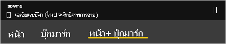
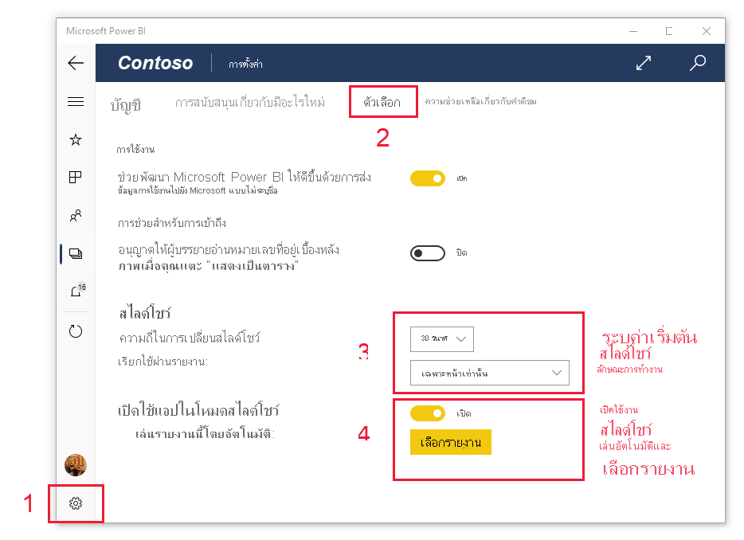

# ดูรายงานและแดชบอร์ดในโหมดงานนำเสนอบน Surface Hub และอุปกรณ์ Windows 10View reports and dashboards in presentation mode on Surface Hub and Windows 10 devices
คุณสามารถใช้โหมดการนำเสนอเพื่อแสดงรายงานและแดชบอร์ดแบบเต็มหน้าจอบนอุปกรณ์ Windows 10 และ Surface HubYou can use presentation mode to display reports and dashboards in full-screen on Windows 10 devices and Surface Hub. โหมดการนำเสนอมีประโยชน์สำหรับการแสดง Power BI ในการประชุม หรือบนโปรเจคเตอร์เฉพาะในสำนักงาน หรือแม้แต่เพียงเพื่อการขยายพื้นที่บนหน้าจอขนาดเล็กPresentation mode is useful for displaying Power BI at meetings or conferences, or on a dedicated projector at the office, or even just for maximizing space on a small screen.

ในโหมดการนำเสนอ:In presentation mode:
* "chrome" ทั้งหมด (เช่นแถบการนำทางและเมนู) หายไปทำให้ง่ายต่อการเน้นข้อมูลในรายงานของคุณAll the "chrome" (such as the navigation and menu bars) disappears, making it easier to focus on the data in your report.
* แถบเครื่องมือการดำเนินการจะพร้อมใช้งานเพื่อให้คุณสามารถโต้ตอบกับข้อมูลของคุณและเพื่อควบคุมการนำเสนอได้An action toolbar becomes available to enable you to interact with your data and to control the presentation.
* คุณสามารถเล่นสไลด์โชว์ที่วนอัตโนมัติระหว่างหน้าบุ๊คมาร์คหรือทั้งหน้าและบุ๊คมาร์คYou can play a slideshow that cycles automatically between pages, bookmarks, or both pages and bookmarks.

>[!NOTE]
>การสนับสนุนแอปอุปกรณ์เคลื่อนที่ Power BI สำหรับ **โทรศัพท์ที่ใช้ Windows 10 Mobile** จะถูกยกเลิกในวันที่ 16 มีนาคม 2021Power BI mobile app support for **phones using Windows 10 Mobile** will be discontinued on March 16, 2021. [ศึกษาเพิ่มเติมLearn more](/legal/powerbi/powerbi-mobile/power-bi-mobile-app-end-of-support-for-windows-phones)

## ใช้โหมดการนำเสนอUse presentation mode
ในแอป Power BI สำหรับอุปกรณ์เคลื่อนที่ ให้แตะไอคอน **สลับไปยังโหมดการนำเสนอ**In the Power BI mobile app, tap the **Switch to presentation mode** icon.
 แอป Chrome หายไปและแถบเครื่องมือแอคชันปรากฏที่ด้านล่างของหน้าจอหรือทางด้านขวาและซ้าย (ขึ้นอยู่กับขนาดหน้าจอของคุณ) The app chrome disappears and the action toolbar appears at the bottom of the screen or on the right and left sides (depending on your screen size).

จากแถบเครื่องมือ คุณสามารถแตะเพื่อดำเนินการต่อไปนี้:From the toolbar you can tap to perform the following actions:

| ไอคอนIcon | การดำเนินการAction |
|------|--------|
||**กลับไป** ที่หน้าก่อนหน้า**Go back** to the previous page. การแตะที่ไอคอนเป็นระยะเวลานานจะปรากฏหน้าต่าง breadcrumbs ช่วยคุณนำทางไปยังโฟลเดอร์ที่มีรายงานหรือแดชบอร์ดของคุณA long tap on the icon pops up the breadcrumbs windows, allowing you to navigate to the folder containing your report or dashboard.|
||**สลับหน้า** ไปยังหน้าอื่นของรายงานในงานนำเสนอของคุณ**Switch pages** to another page of the report in your presentation.|
||**ใช้บุ๊กมาร์ก** เพื่อแสดงมุมมองเฉพาะของข้อมูลของคุณที่บุ๊กมาร์กจับ**Apply a bookmark** to present the particular view of your data that that bookmark captures. คุณสามารถใช้ทั้งบุ๊กมาร์กส่วนบุคคลและรายงานYou can apply both personal and report bookmarks.|
||**เลือกสีหมึก** เมื่อคุณใช้ปากกา Surface เพื่อวาด และใส่คำอธิบายประกอบบนหน้ารายงานของคุณ**Choose an ink color** when you use your Surface pen to draw and annotate on your report page.|
||**ลบเครื่องหมายหมึก** ที่คุณอาจดำเนินการด้วยปากกา Surface เพื่อวาดและใส่คำอธิบายประกอบบนหน้ารายงานของคุณ**Erase ink marks** you might have made with the Surface pen to draw and annotate on your report page.          |
||**รีเซ็ตเป็นมุมมองเริ่มต้น** และล้างตัวกรองใดๆ ตัวแบ่งส่วนข้อมูล หรือการเปลี่ยนแปลงมุมมองข้อมูลอื่นๆ ที่คุณอาจทำในระหว่างการนำเสนอ**Reset to default view** and clear any filters, slicers, or any other data view changes you might have made during the presentation.|
||**แชร์** รูปภาพของมุมมองการนำเสนอกับเพื่อนร่วมงานของคุณ**Share** an image of the presentation view with your colleagues. รูปภาพจะประกอบด้วยคำอธิบายประกอบใดๆ ที่คุณได้ทำกับปากกา Surface ในระหว่างการนำเสนอThe image will include any annotations you have made with the Surface pen during the presentation.|
||**รีเฟรช** รายงาน**Refresh** the report.|
||**เล่นสไลด์โชว์** ซ่อนแถบแอ็คชันและเริ่มสไลด์โชว์**Play the slideshow**, hiding the action bar and starting the slideshow. ตัวเลือกจะช่วยให้คุณสามารถเลือกการหมุนอัตโนมัติระหว่างหน้า บุ๊กมาร์ก หรือทั้งหน้าและบุ๊กมาร์กได้A selector allows you to choose to auto-rotate between pages, bookmarks, or both pages and bookmarks. ตามค่าเริ่มต้นสไลด์โชว์จะหมุนอัตโนมัติระหว่างหน้าทุกๆ 30 วินาทีBy default the slideshow auto-rotates between pages once every 30 seconds. คุณสามารถเปลี่ยนการตั้งค่าเหล่านี้ใน [**การตั้งค่า > ตัวเลือก**](#slideshow-settings)You can change these settings in [**Settings > Options**](#slideshow-settings). ดู [รายละเอียดเพิ่มเติม](#slideshows) เกี่ยวกับสไลด์โชว์See [more detail](#slideshows) about slideshows|
||**ออก** จากโหมดการนำเสนอ**Exit** presentation mode.|
||**ค้นหา** สำหรับวัตถุอื่นๆ ใน Power BI**Search** for other artifacts in Power BI.|

คุณสามารถยกเลิกการปลดแถบเครื่องมือและลากแล้วปล่อยไปยังที่ใดก็ได้บนหน้าจอYou can undock the toolbar and drag and drop it to anywhere on the screen. ซึ่งจะเป็นประโยชน์สำหรับหน้าจอขนาดใหญ่ เมื่อคุณต้องการเน้นบริเวณที่ระบุในรายงานของคุณ และต้องการให้มีเครื่องมือที่พร้อมใช้งานอยู่ถัดจากรายงานด้วยThis is useful for large screens, when you want to focus on a specific area in your report and want to have the tools available next to it. เพียงแค่วางนิ้วของคุณบนแถบเครื่องมือ และปัดลงในพื้นที่รายงานJust place your finger on the toolbar and swipe it into the report canvas.

## สไลด์Slideshows

คุณสามารถเล่นสไลด์โชว์เพื่อวนซ้ำโดยอัตโนมัติผ่านการนำเสนอของคุณYou can play a slideshow to automatically cycle through your presentation. คุณสามารถตั้งค่าสไลด์โชว์เพื่อวนผ่านหน้า บุ๊กมาร์ก หรือทั้งหน้าและบุ๊กมาร์กได้You can set the slideshow to cycle through pages, bookmarks, or both pages and bookmarks. ในระหว่างการเล่นสไลด์โชว์ หน้ารายงานที่มี [การรีเฟรชหน้าอัตโนมัติ](../../create-reports/desktop-automatic-page-refresh.md) จะยังคงรีเฟรชโดยอัตโนมัติตามที่กำหนดค่าไว้ เพื่อให้แน่ใจว่ามีการแสดงข้อมูลล่าสุดอยู่เสมอDuring the slideshow, report pages with [auto page refresh](../../create-reports/desktop-automatic-page-refresh.md) will continue to automatically refresh as configured, ensuring that the most current data is always shown.

เมื่อคุณเลือกปุ่ม **เล่น** บนแถบเครื่องมือการดำเนินการ สไลด์โชว์จะเริ่มต้นWhen you select the **Play** button on the action toolbar, the slideshow begins. ตัวควบคุมจะปรากฏขึ้นเพื่อให้คุณสามารถหยุดสไลด์โชว์ชั่วคราวหรือเปลี่ยนแปลงสิ่งที่กำลังเล่นอยู่: หน้า, บุ๊กมาร์ก หรือทั้งหน้าและบุ๊กมาร์กA controller appears that allows you to pause the slideshow or to change what's being played: pages, bookmarks, or both pages and bookmarks.

 ตัวควบคุมแสดงชื่อของมุมมองที่แสดงอยู่ในปัจจุบัน (หน้า หรือบุ๊กมาร์กและหน้า)The controller shows the name of the currently displayed view (page or bookmark and page). ในรูปด้านบนเราเห็นว่าในรายงานที่เรียกว่า **ยอดขาย** เรากำลังดูบุ๊กมาร์ก **เอเชียแปซิฟิก** บนหน้า **ประสิทธิภาพการทำงานการขาย**In the image above, we see that in the report called **Sales**, we are currently viewing the **Asia Pacific** bookmark on the **Sales Performance** page.

ตามค่าเริ่มต้น ระบบจะแสดงสไลด์โชว์ในหน้าเท่านั้น โดยมีอัตราการเปลี่ยนภาพในทุก ๆ 30 วินาทีBy default, a slideshow cycles through pages only, at a rate of one every 30 seconds. คุณสามารถเปลี่ยนลักษณะการทำงานเริ่มต้นใน [การตั้งค่าสไลด์โชว์ได้](#slideshow-settings)You can change the default behavior in the [Slideshow settings](#slideshow-settings).

### เล่นสไลด์โชว์อัตโนมัติเมื่อเริ่มต้นAuto play a slideshow on startup

คุณสามารถตั้งค่าแอป Power BI สำหรับอุปกรณ์เคลื่อนที่ให้เริ่มเล่นสไลด์โชว์โดยอัตโนมัติเมื่อใดก็ตามที่มีการเปิดใช้งานแอปได้You can set up the Power BI mobile app to start playing a slideshow automatically whenever the app is launched. ตัวเลือกนี้จะมีประโยชน์ในการสร้างประสบการณ์เหมือนกับการใช้คีออสที่มีการแสดงรายงานต่อสาธารณะโดยไม่ต้องมีการดำเนินการเองThis option is useful for creating a kiosk-like experience that runs a report in public displays without any manual intervention. โปรดดูรายละเอียดการตั้งค่าการเล่นรายงานอัตโนมัติได้ที่[การตั้งค่าสไลด์โชว์](#slideshow-settings)See [Slideshow settings](#slideshow-settings) for detail about setting up a report for autoplay.

### การตั้งค่าสไลด์โชว์Slideshow settings

ตามค่าเริ่มต้น ระบบจะแสดงสไลด์โชว์ในหน้าเท่านั้น โดยมีอัตราการเปลี่ยนภาพในทุก ๆ 30 วินาทีBy default, a slideshow cycles through pages only, at a rate of one every 30 seconds. คุณสามารถเปลี่ยนการตั้งค่าเริ่มต้นเหล่านี้ได้โดยไปที่ **การตั้งค่า > ตัวเลือก** ดังภาพที่แสดงด้านล่างYou can change this default behavior by going to **Settings > Options**, as illustrated below. คุณยังสามารถเปิดใช้งานการเล่นอัตโนมัติและเลือกรายงานที่จะเล่นได้อีกด้วยYou can also turn on autoplay and choose a report to play.

1. เลือกไอคอนการตั้งค่าSelect the settings icon.

1. เปิดแท็บตัวเลือกOpen the options tab.

1. หากต้องการ คุณสามารถเปลี่ยนการตั้งค่าเริ่มต้นให้สไลด์โชว์แสดงบนตำแหน่งที่คุณต้องการได้ (หน้า บุ๊คมาร์ก หรือทั้งสองตำแหน่ง) และสามารถกำหนดความถี่ในการเปลี่ยนสไลด์ได้If desired, change the default settings for what the slideshow will cycle over (pages, bookmarks, or both) and how frequently the slides will transition.

1. หากคุณต้องการให้เริ่มเล่นรายงานโดยอัตโนมัติเมื่อเปิดแอป ให้เปิดทอกเกิลแล้วเลือก **เลือกรายงาน**If you want your report to start playing automatically when the app is launched, turn on the toggle and choose **Select Report**. คุณจะสามารถค้นหารายงานที่คุณมีสิทธิ์เข้าถึงได้You will be able to search for reports you have access to.

## ขั้นตอนถัดไปNext steps
* [แสดงแดชบอร์ดและรายงานในโหมดเต็มหน้าจอจากบริการของ Power BIDisplay dashboards and reports in full-screen mode from the Power BI service](../end-user-focus.md)
* มีคำถามหรือไม่Questions? [ลองถามชุมชน Power BITry asking the Power BI Community](https://community.powerbi.com/)