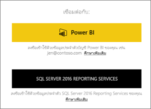
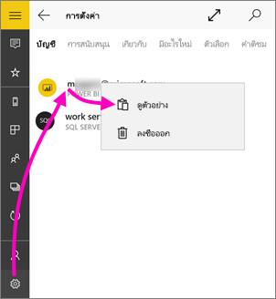
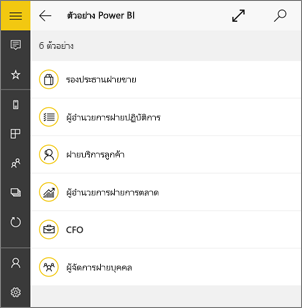
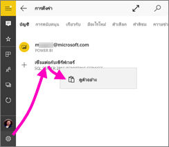
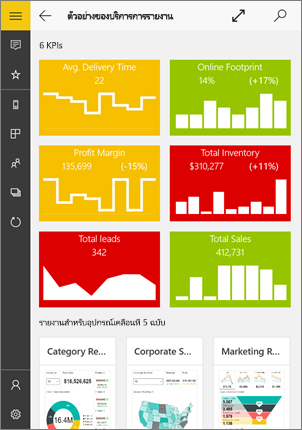
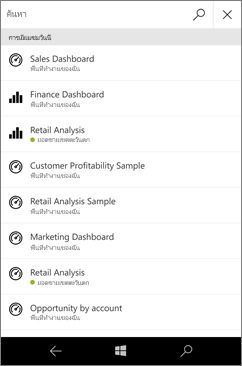
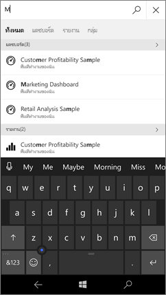
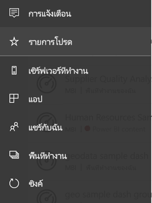
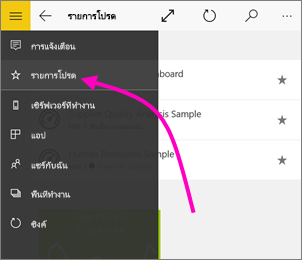
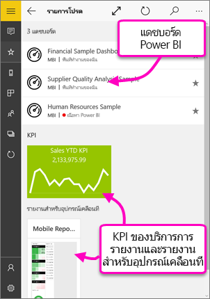

# เริ่มใช้งานแอป Power BI สำหรับอุปกรณ์เคลื่อนที่สำหรับ Windows 10Get started with the Power BI mobile app for Windows 10
แอป Power BI สำหรับอุปกรณ์เคลื่อนที่บน Windows 10 นำ Power BI ไปยังแท็บเล็ตหรือโทรศัพท์ของคุณThe Power BI mobile app for Windows 10 brings Power BI to your tablet or phone. คุณจะได้รับการเข้าถึงข้อมูลทางธุรกิจของคุณที่มีการปรับปรุงล่าสุดผ่านทางอุปกรณ์เคลื่อนที่ที่เปิดใช้งานระบบสัมผัสYou get up-to-date, touch-enabled mobile access to your business information. ดูและโต้ตอบกับแดชบอร์ดบริษัทของคุณจากที่ใดก็ได้บน [หน้าจอเริ่มต้นของ Windows](mobile-pin-dashboard-start-screen-windows-10-phone-app.md)View and interact with your company dashboards from anywhere - right on your [Windows Start screen](mobile-pin-dashboard-start-screen-windows-10-phone-app.md).

คุณ[สร้างแดชบอร์ดและรายงานในบริการของ Power BI](../../fundamentals/service-get-started.md) ด้วยข้อมูลของคุณYou [create dashboards and reports in the Power BI service](../../fundamentals/service-get-started.md) with your data. 

จากนั้น โต้ตอบกับแดชบอร์ดและรายงานของคุณ สำรวจข้อมูล บันทึก แล้วแชร์ ทั้งหมดจากแอป Power BI สำหรับอุปกรณ์เคลื่อนที่สำหรับ Windows 10Then interact with your dashboards and reports, explore the data, and share them, all from the Power BI mobile app for Windows 10.

## สิ่งแรกที่ต้องทำFirst things first
* [**ดาวน์โหลดแอป Power BI บนอุปกรณ์เคลื่อนที่สำหรับ Windows 10**](https://go.microsoft.com/fwlink/?LinkID=526478) จาก Windows Store[**Get the Power BI mobile app for Windows 10**](https://go.microsoft.com/fwlink/?LinkID=526478) from the Windows Store.
  
  อุปกรณ์ของคุณต้องทำงานบน Windows 10Your device must run Windows 10. แอปสามารถใช้งานได้บนอุปกรณ์ที่มี RAM อย่างน้อย 3 GB และพื้นที่เก็บข้อมูลภายใน 8 GBThe app can run on devices with at least 3-GB RAM and 8-GB internal storage.

  >[!NOTE]
  >การสนับสนุนแอปอุปกรณ์เคลื่อนที่ Power BI สำหรับ **โทรศัพท์ที่ใช้ Windows 10 Mobile** จะถูกยกเลิกในวันที่ 16 มีนาคม 2021Power BI mobile app support for **phones using Windows 10 Mobile** will be discontinued on March 16, 2021. [ศึกษาเพิ่มเติมLearn more](/legal/powerbi/powerbi-mobile/power-bi-mobile-app-end-of-support-for-windows-phones)
   
* ดูว่า[มีอะไรใหม่ในแอป Power BI สำหรับอุปกรณ์เคลื่อนที่](mobile-whats-new-in-the-mobile-apps.md)Find out'[what's new in the Power BI mobile apps](mobile-whats-new-in-the-mobile-apps.md).

## ลงทะเบียนสำหรับบริการของ Power BI บนเว็บSign up for the Power BI service on the web
ถ้าคุณยังไม่ได้ลงทะเบียน ให้ไปยัง[บริการของ Power BI](https://powerbi.com/)If you haven't signed up yet, go to the [Power BI service](https://powerbi.com/). ลงทะเบียนสำหรับบัญชีของคุณเองเพื่อสร้างและจัดเก็บแดชบอร์ดและรายงานและนำข้อมูลของคุณมารวมเข้าด้วยกันSign up for your own account to create and store dashboards and reports, and bring your data together. จากนั้น ลงชื่อเข้าใช้ Power BI จากอุปกรณ์ Windows 10 ของคุณเพื่อดูแดชบอร์ดของคุณเองจากที่ไหนก็ได้Then, sign in to Power BI from your Windows 10 device to see your own dashboards from anywhere.

1. ในบริการของ Power BI แตะ [ลงทะเบียน](https://go.microsoft.com/fwlink/?LinkID=513879) เพื่อสร้างบัญชี Power BIIn the Power BI service, tap [Sign up](https://go.microsoft.com/fwlink/?LinkID=513879) to create a Power BI account.
2. เริ่มต้น[สร้างแดชบอร์ดและรายงานของคุณเอง](../../fundamentals/service-get-started.md)Start [creating your own dashboards and reports](../../fundamentals/service-get-started.md).

## เริ่มต้นใช้งานแอป Power BIGet started with the Power BI app
1. บนหน้าจอเริ่มต้นของอุปกรณ์ Windows 10 ให้เปิดแอป Power BIOn the Start screen of your Windows 10 device, open the Power BI app.
   
   
2. เมื่อต้องการดูแดชบอร์ดและรายงาน Power BI ของคุณ แตะ **Power BI**To view your Power BI dashboards and reports, tap **Power BI**. ลงชื่อเข้าใช้ด้วยข้อมูลประจำตัวเดียวกันกับข้อมูลประจำตัวบัญชี Power BI บนเว็บของคุณSign in with the same credentials as your Power BI account on the web. 
   
   เมื่อต้องการดูรายงานอุปกรณ์มือถือและ KPI ของ Reporting Services ของคุณ ให้แตะ **SQL Server 2016 Reporting Services**To view your Reporting Services mobile reports and KPIs, tap **SQL Server 2016 Reporting Services**. ลงชื่อเข้าใช้ด้วยข้อมูลประจำตัว SQL Server Reporting Services ของคุณSign in with your SQL Server Reporting Services credentials.
   
   
3. แตะ **เริ่มต้นสำรวจ** เพื่อดูแดชบอร์ดของคุณเองTap **Start exploring**  to view your own dashboards.

## ลองใช้ตัวอย่าง Power BI และ Reporting ServicesTry the Power BI and Reporting Services samples
แม้ว่าจะยังไม่ลงทะเบียน คุณสามารถเล่นกับตัวอย่าง Power BI และ Reporting Services ได้Even without signing up, you can play with the Power BI and Reporting Services samples. หลังจากคุณดาวน์โหลดแอป คุณสามารถดูตัวอย่าง หรือเริ่มต้นใช้งานAfter you download the app, you can view the samples or get started. กลับไปยังตัวอย่างเมื่อใดก็ตามที่คุณต้องการ จากโฮมเพจแดชบอร์ดGo back to the samples whenever you want from the dashboards home page.

### ตัวอย่าง Power BIPower BI samples
คุณสามารถดูและโต้ตอบกับตัวอย่างแดชบอร์ด Power BI ได้You can view and interact with the Power BI dashboard samples. แต่มีบางสิ่งที่คุณไม่สามารถทำได้กับแดชบอร์ดดังกล่าวBut, there are a few things you can't do with them. คุณไม่สามารถเปิดรายงานเบื้องหลังแดชบอร์ด แชร์ตัวอย่างกับผู้อื่น หรือทำให้เป็นรายการโปรดของคุณYou can't open the reports behind the dashboards, share the samples with others, or make them your favorites.

1. แตะปุ่มการนำทางส่วนกลางTap the global navigation button  ในมุมบนซ้ายin the upper-left corner.
2. แตะไอคอน **การตั้งค่า** แตะชื่อของคุณ จากนั้นแตะ **ดูตัวอย่าง**Tap **Settings** icon , tap your name, then tap **View samples**.
   
   
3. เลือกบทบาท และสำรวจแดชบอร์ดตัวอย่างสำหรับบทบาทนั้นPick a role and explore the sample dashboard for that role.  
   
   

### ตัวอย่างรายงานอุปกรณ์มือถือของ Reporting ServicesReporting Services mobile report samples
1. แตะปุ่มการนำทางส่วนกลางTap the global navigation button  ในมุมบนซ้ายin the upper-left corner.
2. แตะไอคอน **การตั้งค่า** คลิกขวา หรือแตะค้าง **เชื่อมต่อกับเซิร์ฟเวอร์** แล้วแตะ **ดูตัวอย่าง**Tap **Settings** icon , right-click or tap and hold **Connect to server**, then tap **View samples**.
   
   
3. เปิดโฟลเดอร์รายงานการขายปลีกหรือรายงานการขาย เพื่อสำรวจ KPI และรายงานอุปกรณ์มือถือของโฟลเดอร์เหล่านี้Open the Retail Reports or Sales Reports folder to explore their KPIs and mobile reports.
   
   

## ค้นหาแดชบอร์ด รายงาน และแอปSearch for dashboards, reports, and apps
ค้นหาแดชบอร์ด รายงาน และแอปของคุณได้อย่างรวดเร็ว โดยพิมพ์ในกล่องค้นหาที่ด้านบนของแอปเสมอFind your dashboards, reports, and apps quickly by typing in the search box, always at the top of the app.

1. แตะไอคอนค้นหาที่มุมขวาบนTap the search icon in the upper-right corner.
   
   
   
   Power BI แสดงแดชบอร์ด รายงาน และแอปล่าสุดของคุณPower BI displays your most recent dashboards, reports, and apps.
   
   
2. เมื่อคุณเริ่มพิมพ์ Power BI จะแสดงผลลัพธ์ที่เกี่ยวข้องทั้งหมดAs you start typing, Power BI displays all relevant results.
   
   

## ค้นหาเนื้อหาของคุณในแอป Power BI สำหรับอุปกรณ์เคลื่อนที่Find your content in the Power BI mobile apps
แดชบอร์ดและรายงานของคุณได้รับการจัดเก็บไว้คนละแห่งในแอป Power BI สำหรับอุปกรณ์เคลื่อนที่ ขึ้นอยู่กับว่ามาจากที่ใดYour dashboards and reports are stored in different locations in the Power BI mobile apps, depending on where they came from. อ่านเกี่ยวกับ[การค้นหาเนื้อหาของคุณในแอปสำหรับอุปกรณ์เคลื่อนที่](mobile-apps-quickstart-view-dashboard-report.md)Read  about [finding your content in the mobile apps](mobile-apps-quickstart-view-dashboard-report.md). นอกจากนี้ คุณสามารถค้นหาสิ่งต่างๆ ที่คุณมีในแอป Power BI สำหรับอุปกรณ์เคลื่อนที่Plus you can always search for anything you have in the Power BI mobile apps. 

## ดูแดชบอร์ด KPI และรายงานโปรดของคุณView your favorite dashboards, KPIs, and reports
ดูแดชบอร์ด Power BI โปรดทั้งหมดของคุณ ร่วมกับ KPI และรายงานอุปกรณ์มือถือของ Reporting Services ในหน้ารายการโปรดในแอปสำหรับอุปกรณ์เคลื่อนที่View your favorite Power BI dashboards, together with Reporting Services KPIs and mobile reports, on the Favorites page in the mobile apps. เมื่อคุณทำให้แดชบอร์ดเป็น *รายการโปรด* ในแอป Power BI สำหรับอุปกรณ์เคลื่อนที่ คุณสามารถเข้าถึงแดชบอร์ดดังกล่าวได้จากทุกอุปกรณ์ของคุณ รวมถึงบริการของ Power BI ในเบราว์เซอร์ของคุณได้When you make a dashboard a *favorite* in the Power BI mobile app, you can access it from all of your devices, including the Power BI service in your browser. 

* แตะ **รายการโปรด**Tap **Favorites**.
  
   
  
   รายการโปรด Power BI ของคุณและรายการโปรดของคุณจากพอร์ทัลเว็บ Reporting Services อยู่ในหน้านี้ทั้งหมดYour Power BI favorites and your favorites from the Reporting Services web portal are all on this page.
  
   

อ่านข้อมูลเพิ่มเติมเกี่ยวกับ [รายการโปรดในแอป Power BI สำหรับอุปกรณ์เคลื่อนที่](mobile-apps-favorites.md)Read more about [favorites in the Power BI mobile apps](mobile-apps-favorites.md).

## งานอื่น ๆOther tasks
ต่อไปนี้คือสิ่งอื่นๆ ที่คุณสามารถทำในแอป Power BI สำหรับ Windows 10 กับแดชบอร์ดและรายงานใน Power BI ตลอดจนรายงานอุปกรณ์มือถือและ KPI ของ Reporting Services ในพอร์ทัลเว็บ Reporting ServicesHere are some other things you can do in the Power BI app for Windows 10 devices with dashboards and reports in Power BI, and Reporting Services mobile reports and KPIs in the Reporting Services web portal.

### แดชบอร์ดและรายงาน Power BIPower BI dashboards and reports
* ดู[แอปของคุณ](../../collaborate-share/service-create-distribute-apps.md)View [your apps](../../collaborate-share/service-create-distribute-apps.md).
* ดู[แดชบอร์ด](mobile-apps-view-dashboard.md)ของคุณView your [dashboards](mobile-apps-view-dashboard.md).
* [ปักหมุดไทล์และแดชบอร์ด Power BI](mobile-pin-dashboard-start-screen-windows-10-phone-app.md) เป็นไทล์รายงานสดบนหน้าจอเริ่มต้นของอุปกรณ์ของคุณ[Pin Power BI tiles and dashboards](mobile-pin-dashboard-start-screen-windows-10-phone-app.md) to your device's Start screen as live tiles.
* [แชร์ไทล์](mobile-windows-10-phone-app-get-started.md)[Share tiles](mobile-windows-10-phone-app-get-started.md).
* แชร์[แดชบอร์ด](mobile-share-dashboard-from-the-mobile-apps.md)Share [dashboards](mobile-share-dashboard-from-the-mobile-apps.md).

### รายงานอุปกรณ์มือถือและ KPI ของ Reporting ServicesReporting Services mobile reports and KPIs
* [ดูรายงานอุปกรณ์มือถือและ KPI ของ Reporting Services](mobile-app-windows-10-ssrs-kpis-mobile-reports.md) ในแอป Power BI สำหรับอุปกรณ์เคลื่อนที่สำหรับอุปกรณ์ Windows 10[View Reporting Services mobile reports and KPIs](mobile-app-windows-10-ssrs-kpis-mobile-reports.md) in the Power BI app for Windows 10 devices.
* สร้าง [KPI บนพอร์ทัลเว็บ Reporting Services](/sql/reporting-services/working-with-kpis-in-reporting-services)Create [KPIs on the Reporting Services web portal](/sql/reporting-services/working-with-kpis-in-reporting-services).
* [สร้างรายงานอุปกรณ์มือถือของคุณเองด้วย SQL Server Mobile Report Publisher](/sql/reporting-services/mobile-reports/create-mobile-reports-with-sql-server-mobile-report-publisher) และเผยแพร่ไปยังพอร์ทัลเว็บ Reporting Services[Create your own mobile reports with the SQL Server Mobile Report Publisher](/sql/reporting-services/mobile-reports/create-mobile-reports-with-sql-server-mobile-report-publisher), and publish them to the Reporting Services web portal.

## ขั้นตอนถัดไปNext steps
* [ดาวน์โหลดแอป Power BI](https://go.microsoft.com/fwlink/?LinkID=526478) จาก Windows Store[Download the Power BI app](https://go.microsoft.com/fwlink/?LinkID=526478) from the Windows Store  
* [Power BI คืออะไรWhat is Power BI?](../../fundamentals/power-bi-overview.md)
* มีคำถามหรือไม่Questions? [ลองถามชุมชน Power BITry asking the Power BI Community](https://community.powerbi.com/)