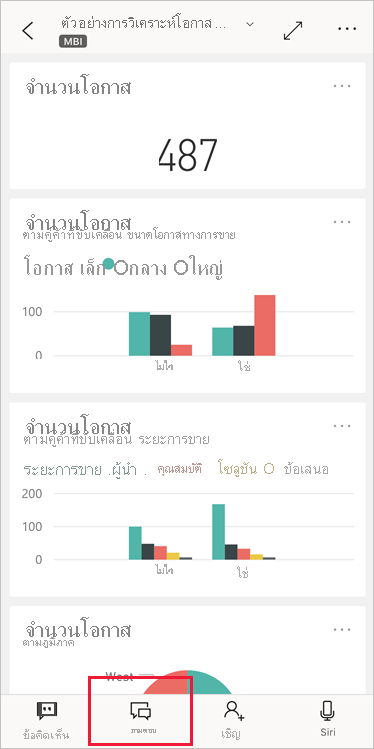

# บทช่วยสอน: ถามเกี่ยวกับข้อมูลของคุณกับ Q&A นักวิเคราะห์เสมือนในแอป Power BI iOSTutorial: Ask questions about your data with the Q&A virtual analyst in the Power BI iOS apps

วิธีง่ายที่สุดในการเรียนรู้เกี่ยวกับข้อมูลของคุณ คือ การถามคำถามเกี่ยวกับข้อมูลของคุณโดยใช้ถ้อยคำของคุณเองThe easiest way to learn about your data is to ask questions about it in your own words. ในบทช่วยสอนนี้ คุณถามคำถามและดูข้อมูลเชิงลึกที่แนะนำเกี่ยวกับข้อมูลตัวอย่าง กับนักวิเคราะห์เสมือนของถามตอบ ในแอปมือถือ Microsoft Power BI บน iPad หรือ iPhone ของคุณIn this tutorial, you ask questions and view featured insights about sample data with the Q&A virtual analyst in the Microsoft Power BI mobile app on your iPad or iPhone. 

นำไปใช้กับ:Applies to:

|  |  |
|:--- |:--- |
| iPhoneiPhones |iPadiPads |

นักวิเคราะห์เสมือนของถามตอบ เป็นประสบการณ์การสนทนาข่าวกรองธุรกิจ ที่เข้าถึงข้อมูลการถามตอบเบื้องต้นใน [บริการของ Power BI](https://powerbi.com)The Q&A virtual analyst is a conversational BI experience that accesses underlying Q&A data in the [Power BI service](https://powerbi.com). ซึ่งแนะนำข้อมูลเชิงลึก และคุณสามารถพิมพ์ หรือพูดคำถามของคุณเองIt suggests data insights, and you can type or speak your own questions.

ในบทช่วยสอนนี้ คุณจะได้:In this tutorial, you will:

> [!div class="checklist"]
> * ติดตั้งแอป Power BI บนมือถือสำหรับ iOSInstall the Power BI mobile app for iOS
> * ดาวน์โหลดรายงานและแดชบอร์ดตัวอย่าง Power BIDownload a Power BI sample dashboard and report
> * ดูข้อมูลเชิงลึกที่แนะนำโดยแอปสำหรับอุปกรณ์เคลื่อนที่See what featured insights the mobile app suggests

## ข้อกำหนดเบื้องต้นPrerequisites

* **ลงทะเบียนใช้งาน Power BI**: ถ้าคุณไม่ได้ลงทะเบียน Power BI ให้ [ลงทะเบียนรุ่นทดลองใช้ฟรี](https://app.powerbi.com/signupredirect?pbi_source=web)ก่อนที่คุณจะเริ่มต้นใช้งาน**Sign up for Power BI**: If you're not signed up for Power BI, [sign up for a free trial](https://app.powerbi.com/signupredirect?pbi_source=web) before you begin.
* **ติดตั้งแอป Power BI สำหรับ iOS**: [ดาวน์โหลดแอป iOS](https://apps.apple.com/app/microsoft-power-bi/id929738808) จาก Apple App Store ไปยัง iPad, iPhone หรือ iPod Touch ของคุณ**Install the Power BI for iOS app**: [Download the iOS app](https://apps.apple.com/app/microsoft-power-bi/id929738808) from the Apple App Store to your iPad, iPhone, or iPod Touch. เวอร์ชันต่อไปนี้รองรับแอป Power BI สำหรับ iOS:The following versions support the Power BI for iOS app:
  * iPad ที่มี iOS 11 หรือใหม่กว่าiPad with iOS 11 or later.
  * iPhone 5 และสูงกว่า ที่มี iOS 11 หรือใหม่กว่าiPhone 5 and above, with iOS 11 or later. 
  * iPod Touch ที่มี iOS 11 หรือใหม่กว่าiPod Touch with iOS 11 or later.
* **ดาวน์โหลดข้อมูลตัวอย่าง**: ขั้นตอนแรกคือดาวน์โหลด **ตัวอย่างการวิเคราะห์โอกาส** ไปยังบริการ Power BI**Download sample data**: The first step is to download the **Opportunity Analysis Sample** to the Power BI service. ดู [การดาวน์โหลดตัวอย่างไปยังพื้นที่ทำงานของฉันในบริการ Power BI](./mobile-apps-download-samples.md) สำหรับคำแนะนำเกี่ยวกับวิธีการดำเนินการนี้See [Downloading samples to My workspace in the Power BI service](./mobile-apps-download-samples.md) for instructions on how to do this.

เมื่อคุณดำเนินการข้อกำหนดเบื้องต้นเสร็จสิ้นและดาวน์โหลดข้อมูลตัวอย่างแล้ว คุณก็พร้อมที่จะดูตัวอย่างบนอุปกรณ์ iOS ของคุณOnce you've completed the prerequisites and downloaded the sample data, you're ready to view the samples on your iOS device.

## ลองใช้ข้อมูลเชิงลึกที่แนะนำTry featured insights
1. บน iPhone หรือ iPad ของคุณ เปิดแอป Power BI แล้วลงชื่อเข้าใช้ด้วยข้อมูลประจำตัวของบัญชีผู้ใช้ Power BI ของคุณ ซึ่งเป็นบัญชีเดียวกันกับที่คุณใช้ในบริการของ Power BI ในเบราว์เซอร์On your iPhone or iPad, open the Power BI app and sign in with your Power BI account credentials, the same ones you used in the Power BI service in the browser.

2. บนแถบนำทางของหน้าหลัก ให้แตะไอคอน **พื้นที่ทำงาน**On the home page navigation bar, tap the  **Workspaces** icon.

    

3. เมื่อเปิดหน้าพื้นที่ทำงานแล้ว ให้แตะ **พื้นที่ทำงานของฉัน** จากนั้นแดชบอร์ด **ตัวอย่างการวิเคราะห์โอกาส** เพื่อเปิดWhen the Workspaces page opens, tap **My Workspaces** and then the **Opportunity Analysis Sample** dashboard to open it.

3. บนแดชบอร์ดตัวอย่างการวิเคราะห์โอกาส ให้แตะไอคอนนักวิเคราะห์เสมือนของถามตอบในเมนูการดำเนินการOn the Opportunity Analysis Sample dashboard, tap the Q&A virtual analyst icon on the action menu.

    

    นักวิเคราะห์เสมือนของถามตอบจะมีตัวอย่างคำแนะนำ เพื่อเริ่มต้นใช้งานThe Q&A virtual analyst offers some suggestions to get started.

    

3. แตะ **ข้อมูลเชิงลึกที่แนะนำ**Tap **featured insights**.

4. นักวิเคราะห์เสมือนของถามตอบจะแนะนำตัวอย่างข้อมูลเชิงลึกให้คุณทราบThe Q&A virtual analyst suggests some insights. เลื่อนไปทางขวา แล้วแตะ **ข้อมูลเชิงลึก 2**Scroll to the right and tap **Insight 2**.

    

   นักวิเคราะห์เสมือนของถามตอบจะแสดงข้อมูลเชิงลึก 2The Q&A virtual analyst displays Insight 2.

    

5. แตะแผนภูมิเพื่อเปิดในโหมดโฟกัสTap the chart to open it in focus mode.

    

6. แตะลูกศรที่มุมซ้ายบน เพื่อกลับไปยังประสบการการใช้งานของนักวิเคราะห์เสมือนของถามตอบTap the arrow in the upper-left corner to go back to the Q&A virtual analyst experience.

## ล้างแหล่งข้อมูลClean up resources

เมื่อคุณจบบทช่วยสอนนี้แล้ว คุณสามารถลบแดชบอร์ด, รายงาน และชุดข้อมูลของตัวอย่างการวิเคราะห์โอกาสทางการขายได้When you've finished the tutorial, you can delete the Opportunity Analysis sample dashboard, report, and dataset.

1. เปิดบริการ Power BI ([บริการ Power BI](https://app.powerbi.com)) และลงชื่อเข้าใช้Open the Power BI service ([Power BI service](https://app.powerbi.com)) and sign in.

2. ในบานหน้าต่างการนำทาง ให้เลือก **พื้นที่ทำงานของฉัน**In the navigation pane, select **My Workspace**.

3. คลิกที่แท็บแดชบอร์ด จากนั้นบนบรรทัดตัวอย่างการวิเคราะห์โอกาส ให้คลิกที่ถังขยะClick the dashboards tab, and then on the Opportunity Analysis Sample line click the trash can.

    

    เวลานี้ให้เลือกแท็บรายงานและทำแบบเดียวกันNow select the reports tab and do the same.

4. เวลานี้ให้เลือกแท็บชุดข้อมูล คลิก **ตัวเลือกเพิ่มเติม** (...) จากนั้นเลือก **ลบ**Now select the datasets tab, click **More options** (...), and then choose **Delete**.

    

## ขั้นตอนถัดไปNext steps

คุณได้ลอง นักวิเคราะห์เสมือนของถามตอบ ในแอปมือถือ Power BI สำหรับ iOS แล้วYou've tried the Q&A virtual assistant in the Power BI mobile apps for iOS. เรียนรู้เพิ่มเติมเกี่ยวกับ ถามตอบในบริการของ Power BILearn more about Q&A in the Power BI service.
> [!div class="nextstepaction"]
> [การถามตอบในบริการ Power BIQ&A in the Power BI service](../end-user-q-and-a.md)