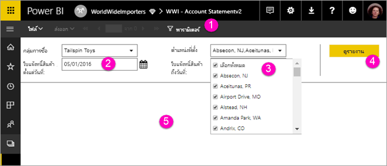

# ดูพารามิเตอร์สำหรับรายงานแบบแบ่งหน้าในบริการของ Power BIView parameters for paginated reports in the Power BI service

ในบทความนี้ คุณจะได้เรียนรู้วิธีการโต้ตอบกับพารามิเตอร์สำหรับรายงานแบบแบ่งหน้าในบริการของ Power BIIn this article, you learn how to interact with parameters for paginated reports in the Power BI service.  พารามิเตอร์รายงานจะให้วิธีการกรองข้อมูลรายงานA report parameter provides a way to filter report data. พารามิเตอร์เสนอรายการค่าที่พร้อมใช้งานParameters offer a list of available values. คุณสามารถเลือกค่าหนึ่งหรือหลายค่าหรือพิมพ์ในกล่องข้อความพารามิเตอร์เพื่อค้นหาค่าYou can choose one or many values, or type in a parameter text box to search for values. บางครั้งพารามิเตอร์มีค่าเริ่มต้น และบางครั้งคุณต้องเลือกค่าก่อนคุณจึงจะเห็นรายงานSometimes parameters have a default value, and sometimes you have to choose a value before you see the report.  

เมื่อคุณดูรายงานที่มีพารามิเตอร์ แถบเครื่องมือตัวแสดงรายงานจะแสดงพารามิเตอร์แต่ละตัว เพื่อให้คุณระบุค่าได้แบบโต้ตอบWhen you view a report that has parameters, the report viewer toolbar displays each parameter so you can interactively specify values. ภาพประกอบต่อไปนี้จะแสดงพื้นที่พารามิเตอร์สำหรับรายงานที่มีพารามิเตอร์สำหรับ **กลุ่มการซื้อ**, **พื้นที่**, **จากวันที่** และ **ไปยังวันที่**The following illustration shows the parameter area for a report with parameters for **Buying Group**, **Location**, a **From Date**, and a **To Date**.  

## แผงพารามิเตอร์ในบริการของ Power BIParameters pane in the Power BI service

  
1.  **แผงพารามิเตอร์** แถบเครื่องมือตัวดูรายงานจะแสดงการแจ้งเตือนเช่น "จำเป็น" หรือค่าเริ่มต้นสำหรับพารามิเตอร์แต่ละตัว**Parameters pane** The report viewer toolbar displays a prompt such as "Required" or a default value for each parameter.    
  
2.  **พารามิเตอร์ใบแจ้งหนี้ตั้งแต่วันที่ / ถึงวันที่** พารามิเตอร์วันที่สองตัวมีค่าเริ่มต้น**Invoices From / To Date parameters** The two date parameters have default values. พิมพ์วันที่ในกล่องข้อความหรือเลือกวันที่จากปฏิทินเพื่อเปลี่ยนวันที่To change the date, type a date in the text box or choose a date in the calendar.  
  
3.  **พารามิเตอร์ตำแหน่ง** พารามิเตอร์ตำแหน่งได้รับการตั้งค่าเพื่อให้คุณได้เลือกค่าหนึ่งค่า หลายค่า หรือค่าทั้งหมด**Location parameter** The Location parameter is set to allow you to select one, many, or all values. 
  
4.  **ดูรายงาน** หลังจากที่คุณใส่หรือเปลี่ยนค่าพารามิเตอร์ ให้คลิกที่ **ดูรายงาน** เพื่อเรียกใช้รายงาน**View Report**  After you enter or change parameter values, click **View Report** to run the report. 

5. **ค่าเริ่มต้น** ถ้าพารามิเตอร์ทั้งหมดมีค่าเริ่มต้น รายงานจะทำงานอัตโนมัติในการดูครั้งแรก**Default values** If all parameters have default values, the report runs automatically on first view. พารามิเตอร์บางตัวในรายงานนี้ไม่มีค่าเริ่มต้น คุณจึงจะไม่เห็นรายงานจนกว่าคุณจะเลือกค่าSome parameters in this report didn't have default values, so you don't see the report until you select values.  

## ขั้นตอนถัดไปNext steps

[รายงานที่มีการแบ่งหน้าในบริการ Power BIPaginated reports in the Power BI service](end-user-paginated-report.md)
