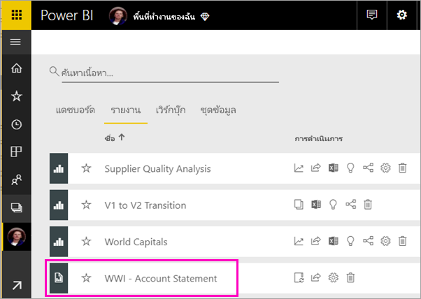
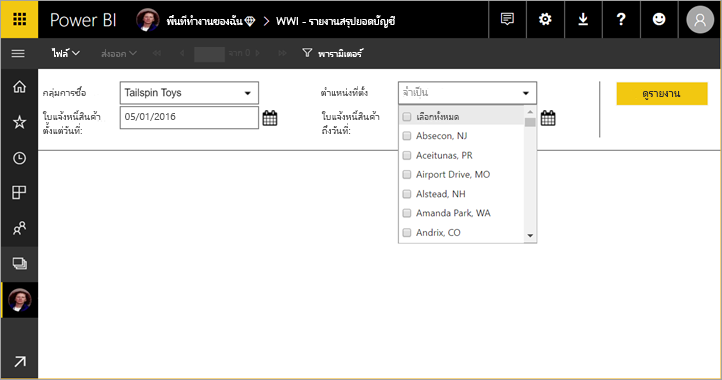
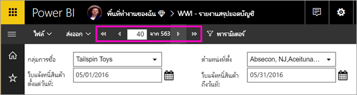
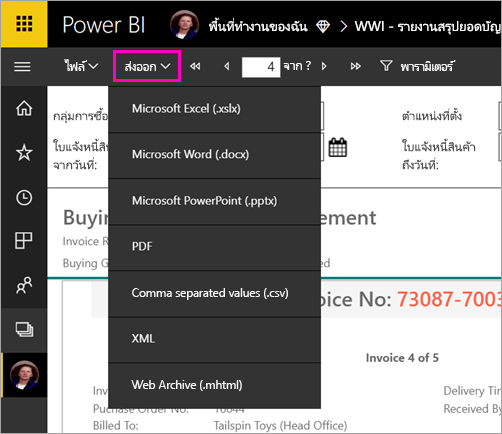

# ดูรายงานแบบแบ่งหน้าในบริการของ Power BIView a paginated report in the Power BI service

ในบทความนี้ คุณจะได้เรียนรู้เกี่ยวกับการดูรายงานแบบแบ่งหน้าในบริการของ Power BIIn this article, you learn about viewing a paginated report to the Power BI service. รายงานแบบแบ่งหน้าคือรายงานที่สร้างไว้ในตัวสร้างรายงาน และอัปโหลดไปยังพื้นที่ทำงานที่อยู่ในความจุพรีเมียมPaginated reports are reports created in Report Builder and uploaded to any  workspace in a Premium capacity. มองหาไอคอนรูปข้าวหลามตัดLook for the diamond icon  ถัดจากชื่อพื้นที่ทำงานnext to the workspace name. 

รายงานที่มีการแบ่งหน้าจะมีไอคอนเป็นของตัวเองPaginated reports have their own icon ..

คุณยังสามารถส่งออกรายงานแบบแบ่งหน้าได้ในหลายรูปแบบ:You can also export paginated reports to a number of formats: 

- Microsoft ExcelMicrosoft Excel
- Microsoft WordMicrosoft Word
- Microsoft PowerPointMicrosoft PowerPoint
- PDFPDF
- ค่าที่คั่นด้วยเครื่องหมายจุลภาคComma-separated values
- XMLXML
- ที่เก็บข้อมูลเว็บ (.mhtml)Web archive (.mhtml)

## ดูรายงานที่มีการแบ่งหน้าView a paginated report

1. เลือกรายงานแบบแบ่งหน้าในพื้นที่ทำงานSelect the paginated report in the workspace.

    

2. ถ้ารายงานแบบแบ่งหน้ามีพารามิเตอร์ อย่างเช่นตัวนี้ คุณอาจไม่เห็นรายงานในตอนที่เปิดขึ้นครั้งแรกIf the report has parameters, as this one does, you may not see the report when you first open it. เลือกพารามิเตอร์ จากนั้นเลือก **ดูรายงาน**Select parameters, then select **View Report**. 

     

    คุณยังสามารถเปลี่ยนพารามิเตอร์ได้ตลอดเวลาYou can also change the parameters at any time.

1. เลื่อนผ่านแต่ละหน้าในรายงานได้โดยเลือกลูกศรที่ด้านบนของหน้า หรือโดยการพิมพ์หมายเลขหน้าลงในกล่องPage through the report by selecting the arrows at the top of the page, or by typing a page number in the box.
    
   

4. เลือก **ส่งออก** เพื่อค้นหารูปแบบที่จะใช้ส่งออกรายงานแบบแบ่งหน้าSelect **Export** to find a format to export your paginated reports.

    

## ขั้นตอนถัดไปNext steps

[รายงานที่มีการแบ่งหน้าในบริการ Power BIPaginated reports in the Power BI service](end-user-paginated-report.md)
