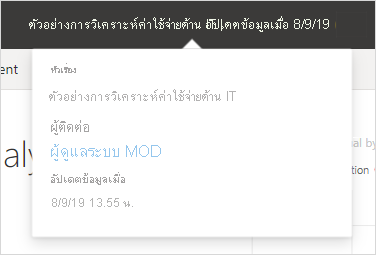

# 'รูปลักษณ์ใหม่' ของบริการของ Power BI

บริการของ Power BI (app.powerbi.com) มีรูปลักษณ์ใหม่ซึ่งช่วยให้การดูและการโต้ตอบกับรายงานของคุณนั้นง่ายขึ้น รูปลักษณ์ใหม่นั้นใช้งานได้ง่ายขึ้นและช่วยสร้างความคุ้นเคยกับผลิตภัณฑ์ Microsoft อื่น ๆ ในบริการ Power BI เราได้จัดทำเนื้อหารายงานเป็นจุดสนใจหลักโดยเปลี่ยนเป็นธีมสีอ่อนลงและอัปเดตไอคอน 

ต้องการเกี่ยวกับรูปลักษณ์ใหม่ใน **Power BI Desktop** อย่างนั้นหรือ คุณสามารถอ่านได้ที่ใช้ [ชุดแถบเครื่องมือที่อัปเดตแล้วใน Power BI Desktop](../create-reports/desktop-ribbon.md)

ต่อไปนี้คือภาพรวมของสิ่งที่เปลี่ยนไปในรูปลักษณ์ใหม่ ดูส่วนที่มีหมายเลขสำหรับรายละเอียดต่าง ๆ:

กำลังมองหาการดำเนินการที่เฉพาะเจาะจงหรือไม่ ดู ["รูปลักษณ์ใหม่": การดำเนินการไปที่ไหน](service-new-look-where-actions.md)

## 1. รายการในแนวตั้งของหน้า 
ในมุมมองรายงาน ชื่อหน้ารายงานอยู่ในรายการในบานหน้าต่างแนวตั้ง ซึ่งจะสะดุดตา มองเห็นได้ง่าย และคล้ายกับการนำทางใน Word และ PowerPoint คุณสามารถเพิ่มหรือลดส่วนที่เหลือของพื้นที่รายงานได้ โดยการปรับขนาดบานหน้าต่างแนวตั้ง หรือเลือกลูกศรคู่เพื่อปิดใช้งานทั้งหมด

หากคุณมีสิทธิ์ในการแก้ไขสำหรับรายงาน คุณสามารถตั้งค่าดังกล่าวได ้ดังนั้น ชื่อหน้าจะอยู่ที่ด้านล่าง เนื่องจากอยู่ในมุมมองการแก้ไขรายงาน ดูรายละเอียดของ [ตั้งค่าบานหน้าต่างหน้า](../create-reports/power-bi-report-settings.md#set-the-pages-pane) ในบทความ "เปลี่ยนการตั้งค่าสำหรับรายงาน Power BI"

## 2. แถบการดำเนินการแบบง่าย 

แถบการดำเนินการที่อัปเดตแล้วในคุณสมบัติที่เป็นที่นิยม คำสั่งที่เกี่ยวข้องมากที่สุด ด้านหน้าและศูนย์กลางสำหรับผู้ใช้รายงาน การส่งออกแชร์ การแชท ในทีม และการสมัครใช้งานจะสามารถทำได้ง่ายขึ้น 

## 3. คำสั่งรายงานอยู่ที่ไหน

เราไม่ได้ลบฟังก์ชันใด ๆ ออกจากรูปลักษณ์เก่า เลือก **ตัวเลือกเพิ่มเติม (...)** สำหรับคำสั่งขั้นสูงเพิ่มเติมอื่น ๆ ดู ["รูปลักษณ์ใหม่": การดำเนินการจะมีผลกับตำแหน่งใด](service-new-look-where-actions.md) สำหรับรายละเอียด

## 4. ประสบการณ์ใช้งานตัวกรองใหม่

คุณจะเห็นบานหน้าต่างตัวกรองใหม่สำหรับรายงานตามค่าเริ่มต้นด้วยรูปลักษณ์ใหม่ และเมื่อคุณโฮเวอร์เหนือไอคอนตัวกรองสำหรับการแสดงผลด้วยภาพ คุณจะเห็นตัวกรองและตัวแบ่งส่วนข้อมูลที่ส่งผลต่อการแสดงผลด้วยภาพนั้น

## ดูรายละเอียดรายงาน 

ดูรายละเอียดต่าง ๆ เช่น วันที่รีเฟรชล่าสุดและข้อมูลติดต่อ ได้อย่างรวดเร็วและถูกต้องในแบนเนอร์ด้านบน  เปิดเมนูเพื่อดูรายละเอียดเพิ่มเติมเกี่ยวกับรายงาน คุณยังสามารถส่งอีเมลไปยังเจ้าของรายงานได้

## ไม่มีการเปลี่ยนแปลงในโหมดแก้ไขรายงาน 

เรายังรักษาประสบการณ์ในการเขียนให้เหมือนกับประสบการณ์ใช้งานในเครื่องเดสก์ท็อป การเปลี่ยนแปลงรูปลักษณ์ใหม่จะนำไปใช้กับมุมมองการอ่านเท่านั้น

## ประสบการณ์การใช้งาน ‘รูปลักษณ์ใหม่’ ของแดชบอร์ด 

แดชบอร์ดยังมีแถบแอคชันแบบประยุกต์เช่นกัน ซึ่งเป็นเช่นเดียวกับรายงานและแอป เพื่อประสบการณ์ที่สอดคล้องกันแต่จะยังคงมีความแตกต่างในการทำงาน ต่อไปนี้เป็นภาพรวมของการดำเนินการในแดชบอร์ด
 

## ขั้นตอนถัดไป

- [ใช้ชุดแถบเครื่องมือที่อัปเดตแล้วใน Power BI Desktop (ตัวอย่าง)](../create-reports/desktop-ribbon.md)
- [Power BI สำหรับผู้ใช้งาน](end-user-consumer.md)
