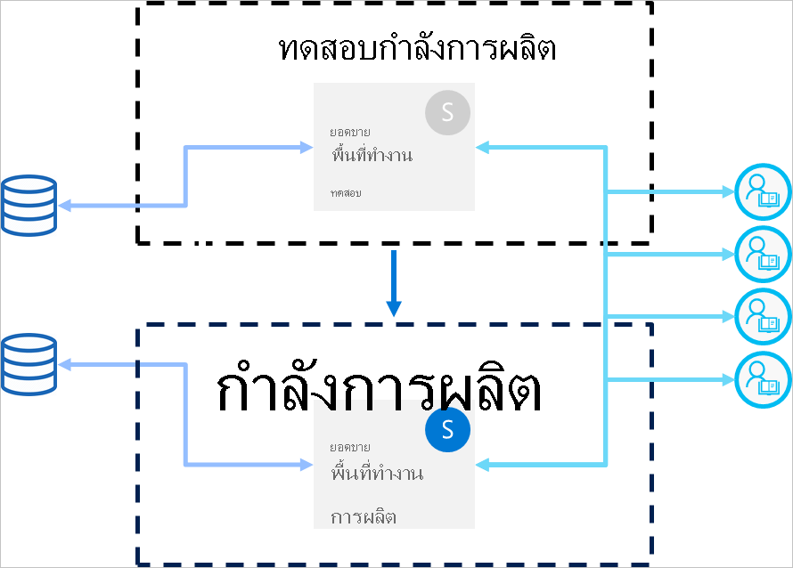

# แนวปฏิบัติที่ดีที่สุดสำหรับไปป์ไลน์การปรับใช้งานDeployment pipelines best practices

บทความนี้ให้คำแนะนำสำหรับผู้สร้าง BI ที่กำลังจัดการเนื้อหาของพวกเขาตลอดระยะเวลาของวงจรThis article provides guidance for BI creators who are managing their content throughout its lifecycle. โดยจะมุ่งเน้นไปที่การใช้ประโยชน์จากไปป์ไลน์การปรับใช้เป็นเครื่องมือการจัดการวงจรชีวิตเนื้อหา BIIt focuses on leveraging deployment pipelines as a BI content lifecycle management tool.

บทความแบ่งออกเป็นสี่ส่วน:The article is divided into four sections:

* **การเตรียมเนื้อหา** - เตรียมเนื้อหาของคุณสำหรับการจัดการวงจรชีวิต**Content preparation** - Prepare your content for lifecycle management.

* **การพัฒนา** - เรียนรู้เกี่ยวกับวิธีที่ดีที่สุดในการสร้างเนื้อหาในขั้นตอนการพัฒนาไปป์ไลน์การปรับใช้**Development** - Learn about the best ways of creating content in the deployment pipelines development stage.

* **การทดสอบ** - ทำความเข้าใจวิธีการใช้ขั้นตอนการทดสอบไปป์ไลน์การปรับใช้เพื่อทดสอบสภาพแวดล้อมของคุณ**Test** - Understand how to use the deployment pipelines test stage, to test your environment.

* **การผลิต** - ใช้ขั้นตอนการผลิตไปป์ไลน์การปรับใช้เมื่อทำให้เนื้อหาของคุณพร้อมใช้งาน**Production** - Utilize the deployment pipelines production stage when making your content available for consumption.

## การเตรียมเนื้อหาContent preparation

เตรียมเนื้อหาของคุณสำหรับการจัดการอย่างต่อเนื่องตลอดวงจรชีวิตของเนื้อหานั้นPrepare your content for on-going management throughout its lifecycle. ตรวจสอบให้แน่ใจว่าคุณตรวจทานข้อมูลในส่วนนี้ก่อนที่คุณจะดำเนินการต่อไปนี้:Make sure you review the information in this section, before you do any of the following:

* เผยแพร่เนื้อหาของคุณไปยังการผลิตRelease your content to production

* เริ่มต้นใช้ไปป์ไลน์การปรับใช้สำหรับพื้นที่ทำงานเฉพาะStart using a deployment pipeline for a specific workspace

* เผยแพร่งานของคุณPublish your work

### ปฏิบัติต่อแต่ละพื้นที่ทำงานในฐานะชุดการวิเคราะห์ที่สมบูรณ์Treat each workspace as a complete package of analytics

ตามแนวคิดแล้ว พื้นที่ทำงานควรมีมุมมองที่ครบถ้วนสำหรับหนึ่งด้าน (เช่น แผนก หน่วยธุรกิจ โครงการ หรือวิธีการแบบ vertical) ในองค์กรของคุณIdeally, a workspace should contain a complete view of one aspect (such as department, business unit, project, or vertical) in your organization. ซึ่งทำให้ง่ายต่อการจัดการสิทธิ์สำหรับผู้ใช้ที่แตกต่างกัน และอนุญาตให้มีการเผยแพร่เนื้อหาสำหรับพื้นที่ทำงานทั้งหมดเพื่อควบคุมตามกำหนดการที่วางแผนไว้This makes it easier to manage permissions for different users, and allows content releases for the entire workspace to be controlled according to a planned schedule.  

หากคุณกำลังใช้ [ชุดข้อมูลส่วนกลาง](../connect-data/service-datasets-across-workspaces.md) ที่ใช้ร่วมกันทั่วทั้งองค์กร เราขอแนะนำให้คุณสร้างพื้นที่ทำงานสองประเภท:If you're using [centralized datasets](../connect-data/service-datasets-across-workspaces.md) that are used across the organization, we recommend that you create two types of workspaces:

* **พื้นที่ทำงานการสร้างแบบจำลองและข้อมูล** - พื้นที่ทำงานเหล่านี้จะมีชุดข้อมูลส่วนกลางทั้งหมด**Modeling and data workspaces** - These workspaces will contain all the centralized datasets

* **พื้นที่ทำงานการรายงาน** - พื้นที่ทำงานเหล่านี้จะมีรายงานและแดชบอร์ดที่สัมพันธ์กันทั้งหมด**Reporting workspaces** - These workspaces will contain all dependent reports and dashboards

### วางแผนการสร้างแบบจำลองการให้สิทธิ์ของคุณPlan your permission model

ไปป์ไลน์การปรับใช้เป็นวัตถุ Power BI ที่มี [สิทธิ์](deployment-pipelines-process.md#permissions) ของตัวเองA deployment pipeline is a Power BI object, with its own [permissions](deployment-pipelines-process.md#permissions). นอกจากนี้ ไปป์ไลน์ยังประกอบด้วยพื้นที่ทำงานที่มีสิทธิ์ของตนเองIn addition, the pipeline contains workspaces, that have their own permissions.

หากต้องการใช้งานเวิร์กโฟลว์ที่ปลอดภัยและง่ายดาย ให้วางแผนบุคคลที่จะสามารถการเข้าถึงแต่ละส่วนของไปป์ไลน์To implement a secure and easy workflow, plan who gets access to each part of the pipeline. ข้อควรพิจารณาที่ควรคำนึงถึงคือ:Some of the considerations to take into account are:

* ใครควรมีสิทธิ์เข้าถึงไปป์ไลน์Who should have access to the pipeline?

* การดำเนินการใดบ้างที่ผู้ใช้ที่มีสิทธิ์เข้าถึงไปป์ไลน์สามารถทำได้ในแต่ละขั้นตอนWhich operations should users with pipeline access be able to perform in each stage?

* ใครจะเป็นผู้ตรวจสอบเนื้อหาในขั้นตอนการทดสอบWho's reviewing content in the test stage?

* ผู้ตรวจสอบเนื้อหาในขั้นการทดสอบควรมีสิทธิ์เข้าถึงไปป์ไลน์หรือไม่Should the test stage reviewers have access to the pipeline?

* ใครจะดูแลขั้นตอนการปรับใช้งานไปยังการผลิตWho will oversee deployment to the production stage?

* พื้นที่ทำงานใดที่คุณจะมอบหมายWhich workspace are you assigning?

* คุณจะมอบหมายพื้นที่ทำงานไปยังขั้นตอนใดWhich stage are you assigning your workspace to?

* คุณต้องการเปลี่ยนแปลงสิทธิ์ของพื้นที่ทำงานที่คุณมอบหมายอยู่หรือไม่?Do you need to make changes to the permissions of the workspace you're assigning?

### เชื่อมต่อขั้นตอนต่างๆ กับฐานข้อมูลที่ต่างกันConnect different stages to different databases

ฐานข้อมูลการผลิตควรมีความเสถียรและพร้อมใช้งานเสมอA production database should always be stable and available. เป็นการดีกว่าที่จะไม่ใช้คิวรีที่สร้างโดยผู้สร้าง BI มากเกินไป สำหรับการพัฒนาหรือทดสอบชุดข้อมูลIt's better not to overload it with queries generated by BI creators for their development or test datasets. สร้างฐานข้อมูลแยกต่างหากสำหรับการพัฒนาและการทดสอบBuild separate databases for development and testing. เนื่องจากจะช่วยปกป้องข้อมูลการผลิต และไม่เป็นการโอเวอร์โหลดฐานข้อมูลการพัฒนาด้วยปริมาณของข้อมูลการผลิตทั้งหมด ซึ่งสามารถทำให้กระบวนการต่างๆ ช้าลงได้This helps protect production data, and doesn't overload the development database with the entire volume of production data, which can slow down things.

>[!NOTE]
>ถ้าองค์กรของคุณกำลังใช้ [ชุดข้อมูลส่วนกลางที่ใช้ร่วมกัน](../connect-data/service-datasets-share.md) คุณสามารถข้ามคำแนะนำนี้ได้If your organization is using [shared centralized datasets](../connect-data/service-datasets-share.md), you can skip this recommendation.

### ใช้พารามิเตอร์ในแบบจำลองของคุณUse parameters in your model

เนื่องจากคุณไม่สามารถแก้ไขแหล่งข้อมูลของชุดข้อมูลในบริการของ Power BI ได้ เราขอแนะนำให้ใช้ [พารามิเตอร์](/power-query/power-query-query-parameters) เพื่อจัดเก็บรายละเอียดการเชื่อมต่อ เช่น ชื่ออินสแตนซ์และชื่อฐานข้อมูล แทนที่จะใช้สตริงการเชื่อมต่อแบบคงที่As you can't edit datasets data sources in Power BI service, we recommend using [parameters](/power-query/power-query-query-parameters) to store connection details such as instance names and database names, instead of using a static connection string. สิ่งนี้จะช่วยให้คุณสามารถจัดการการเชื่อมต่อผ่านพอร์ทัลเว็บบริการของ Power BI เว็บหรือ [ใช้ API](/rest/api/power-bi/datasets/updateparametersingroup) ได้ในขั้นตอนถัดไปThis allows you to manage the connections through the Power BI service web portal, or [using APIs](/rest/api/power-bi/datasets/updateparametersingroup), at a later stage.

ในไปป์ไลน์การปรับใช้ คุณสามารถกำหนดค่ากฎพารามิเตอร์เพื่อตั้งค่าเฉพาะสำหรับขั้นตอนการพัฒนา การทดสอบ และการผลิตIn deployment pipelines, you can configure parameter rules to set specific values for the development, test, and production stages.

ถ้าคุณไม่ได้ใช้พารามิเตอร์สำหรับสตริงการเชื่อมต่อของคุณคุณสามารถกำหนดกฎแหล่งข้อมูลเพื่อระบุสตริงการเชื่อมต่อสำหรับชุดข้อมูลที่ระบุไว้ได้If you don’t use parameters for your connection string, you can define data source rules to specify a connection string for a given dataset. อย่างไรก็ตามในไปป์ไลน์การปรับใช้ การดำเนินการนี้ไม่ได้รับการรองรับสำหรับแหล่งข้อมูลทั้งหมดHowever, in deployment pipelines, this isn't supported for all data sources. หากต้องการตรวจสอบว่าคุณสามารถกำหนดค่ากฎสำหรับแหล่งข้อมูลของคุณได้หรือไม่ โปรดดู [ข้อจำกัดของกฎชุดข้อมูล](deployment-pipelines-get-started.md#dataset-rule-limitations)To verify that you can configure rules for your data source, see [dataset rule limitations](deployment-pipelines-get-started.md#dataset-rule-limitations).

พารามิเตอร์ยังมีการใช้เพิ่มเติม เช่น ทำการเปลี่ยนแปลงไปยังคิวรี ตัวกรอง และข้อความที่แสดงในรายงานได้Parameters have additional uses, such as making changes to queries, filters, and the text displayed in the report.

## การพัฒนาDevelopment

ส่วนนี้จะให้คำแนะนำสำหรับการทำงานกับขั้นตอนการพัฒนาของไปป์ไลน์การปรับใช้This section provides guidance for working with the deployment pipelines development stage.

### ใช้ Power BI Desktop เพื่อแก้ไขรายงานและชุดข้อมูลของคุณUse Power BI Desktop to edit your reports and datasets

พิจารณาให้ Power BI Desktop เป็นสภาพแวดล้อมการพัฒนาในเครื่องของคุณConsider Power BI Desktop as your local development environment. Power BI Desktop ช่วยให้คุณสามารถลอง สำรวจ และตรวจสอบการอัปเดตในรายงานและชุดข้อมูลของคุณได้Power BI Desktop allows you to try, explore, and review updates to your reports and datasets. เมื่อทำงานเสร็จแล้ว คุณสามารถอัปโหลดเวอร์ชันใหม่ของคุณไปยังขั้นตอนการพัฒนาได้Once the work is done, you can upload your new version to the development stage. เนื่องจากเหตุผลต่อไปนี้ ขอแนะนำให้แก้ไขไฟล์ PBIX ในเดสก์ท็อป (และไม่ใช่ในบริการของ Power BI):Due to the following reasons, it's recommended to edit PBIX files in the Desktop (and not in Power BI service):

* การทำงานร่วมกับผู้สร้างด้วยกันบนไฟล์ PBIX เดียวกันจะง่ายขึ้นถ้าการเปลี่ยนแปลงทั้งหมดจะถูกดำเนินการบนเครื่องมือเดียวกันIt is easier to collaborate with fellow creators on the same PBIX file, if all changes are being done on the same tool.

 * การเปลี่ยนแปลงบนออนไลน์ แล้วจึงดาวน์โหลดไฟล์ PBIX จากนั้นอัปโหลดใหม่อีกครั้ง จะเป็นการทำซ้ำรายงานและชุดข้อมูลMaking online changes, downloading the PBIX file, and then uploading it again, creates reports and datasets duplication.

* คุณสามารถใช้การควบคุมเวอร์ชันเพื่อให้ไฟล์ PBIX ของคุณเป็นปัจจุบันได้You can use version control to keep your PBIX files up to date.

### การควบคุมเวอร์ชันสำหรับไฟล์ PBIXVersion control for PBIX files

ถ้าคุณต้องการจัดการประวัติเวอร์ชันต่างๆ ของรายงานและชุดข้อมูลของคุณ ให้ใช้ [การซิงค์อัตโนมัติของ Power BI ด้วย OneDrive](../collaborate-share/service-connect-to-files-in-app-workspace-onedrive-for-business.md)If you want to manage the version history of your reports and datasets, use [Power BI's autosync with OneDrive](../collaborate-share/service-connect-to-files-in-app-workspace-onedrive-for-business.md). การดำเนินการนี้จะทำให้ไฟล์ของคุณอัปเดตเป็นเวอร์ชันล่าสุดThis will keep your files updated with the latest version. นอกจากนี้ยังจะช่วยให้คุณสามารถเรียกใช้เวอร์ชันที่เก่ากว่าได้เมื่อจำเป็นIt will also enable you to retrieve older versions if needed.

>[!NOTE]
>ใช้การซิงค์อัตโนมัติกับ OneDrive (หรือที่เก็บอื่น ๆ) เท่านั้นด้วยไฟล์ PBIX ในขั้นตอนการพัฒนาของไปป์ไลน์การปรับใช้Use auto-sync with OneDrive (or any other repository) only with the PBIX files in the deployment pipeline's development stage. ไม่ต้องซิงค์ไฟล์ PBIX ลงในขั้นตอนการทดสอบและการผลิตของไปป์ไลน์การปรับใช้Do not sync PBIX files into the deployment pipeline's test and production stages. การดำเนินการนี้จะทำให้เกิดปัญหาในการปรับใช้เนื้อหาทั่วทั้งไปป์ไลน์This will cause problems with deploying content across the pipeline.

### แยกการพัฒนาแบบจำลองจากการพัฒนารายงานและแดชบอร์ดSeparate modeling development from report and dashboard development

สำหรับการปรับใช้ในระดับองค์ก รขอแนะนำให้แยกการพัฒนาชุดข้อมูลและการพัฒนารายงานและแดชบอร์ดออกจากกันFor enterprise scale deployments, it's recommended to separate dataset development, and the development of reports and dashboards. หากต้องการทำการเปลี่ยนแปลงไปยังรายงานหรือชุดข้อมูลเท่านั้น ให้ใช้ตัวเลือกปรับใช้โดยการคัดเลือกของไปป์ไลน์การปรับใช้To promote changes to only a report or a dataset, use the deployment pipelines selective deploy option.  

วิธีการนี้ควรเริ่มต้นจาก Power BI Desktop โดยการสร้างไฟล์ PBIX ที่แยกต่างหากสำหรับชุดข้อมูลและรายงานThis approach should start from Power BI Desktop, by creating a separate PBIX file for datasets and reports. ตัวอย่างเช่น คุณสามารถสร้างไฟล์ชุดข้อมูล PBIX และอัปโหลดไปยังขั้นตอนการพัฒนาได้For example, you can create a dataset PBIX file and uploaded it to the development stage. หลังจากนั้นผู้เขียนรายงานของคุณสามารถสร้างไฟล์ PBIX ขึ้นใหม่สำหรับรายงานเท่านั้น และ [เชื่อมต่อกับชุดข้อมูลที่เผยแพร่แล้ว](../connect-data/service-datasets-discover-across-workspaces.md) โดยใช้การเชื่อมต่อสดLater, your report authors can create a new PBIX only for the report, and [connect it to the published dataset](../connect-data/service-datasets-discover-across-workspaces.md) using a live connection. เทคนิคนี้ช่วยให้ผู้สร้างแต่ละคนทำงานแยกกันในการสร้างแบบจำลองและการจัดรูปแบบการแสดงข้อมูล และปรับใช้กับการผลิตได้อย่างอิสระThis technic allows different creators to separately work on modeling and visualizations, and deploy them to production independently.

ด้วย [ชุดข้อมูลที่ใช้ร่วมกัน](../connect-data/service-datasets-share.md) คุณยังสามารถใช้วิธีนี้ทั่วทั้งพื้นที่ทำงานได้With [shared datasets](../connect-data/service-datasets-share.md), you can also use this method across workspaces.

### จัดการแบบจำลองของคุณโดยใช้ความสามารถในการอ่าน/เขียน XMLAManage your models using XMLA read/write capabilities

การแยกการพัฒนาแบบจำลองออกจากการพัฒนารายงานและแดชบอร์ดช่วยให้คุณสามารถใช้ความสามารถขั้นสูงได้ เช่น การควบคุมแหล่งข้อมูล การผสานการเปลี่ยนแปลง และกระบวนการอัตโนมัติต่างๆSeparating modeling development from report and dashboard development, allows you to use advanced capabilities such as source control, merging diff changes, and automated processes. การเปลี่ยนแปลงเหล่านี้ควรดำเนินการในขั้นตอนการพัฒนาเพื่อให้เนื้อหาสุดท้ายสามารถถูกปรับใช้ไปยังขั้นตอนการทดสอบและการผลิตได้These changes should be done in the development stage, so that finalized content can be deployed to the test and production stages. สิ่งนี้ช่วยให้การเปลี่ยนแปลงผ่านกระบวนการแบบรวมกับรายการที่เกี่ยวข้องกันอื่นๆ ก่อนที่จะถูกปรับใช้ไปยังขั้นตอนการผลิตThis allows changes to go through a unified process with other dependent items, before they're deployed to the production stage.

คุณสามารถแยกการพัฒนาแบบจำลองจากการแสดงภาพได้โดยการจัดการ [ชุดข้อมูลที่ใช้ร่วมกัน](../connect-data/service-datasets-share.md) ในพื้นที่ทำงานภายนอกโดยใช้ความสามารถของ XMLA r/wYou can separate modeling development from visualizations, by managing a [shared dataset](../connect-data/service-datasets-share.md) in an external workspace, using XMLA r/w capabilities. ชุดข้อมูลที่ใช้ร่วมกันสามารถเชื่อมต่อกับรายงานหลายรายการในพื้นที่ทำงานต่างๆ ที่ได้รับการจัดการในหลายไปป์ไลน์ได้The shared dataset can connect to multiple reports in various workspaces that are managed in multiple pipelines.

## ทดสอบTest

ส่วนนี้จะให้คำแนะนำสำหรับการทำงานกับขั้นตอนการทดสอบของไปป์ไลน์การปรับใช้This section provides guidance for working with the deployment pipelines test stage.

### จำลองสภาพแวดล้อมการผลิตของคุณSimulate your production environment

นอกเหนือจากการตรวจสอบว่ารายงานหรือแดชบอร์ดใหม่มีลักษณะที่ดีแล้ว การดูวิธีดำเนินการจากมุมมองของผู้ใช้ปลายทางยังเป็นสิ่งสำคัญเช่นเดียวกันOther than verifying that new reports or dashboards look alright, it's also important to see how they perform from an end user's perspective. ขั้นตอนการทดสอบของไปป์ไลน์การปรับใช้ช่วยให้คุณสามารถจำลองสภาพแวดล้อมการผลิตจริงสำหรับวัตถุประสงค์ในการทดสอบThe deployment pipelines test stage, allows you to simulate a real production environment for testing purposes.

ตรวจสอบให้แน่ใจว่าสามปัจจัยเหล่านี้ได้รับการแก้ไขในสภาพแวดล้อมการทดสอบของคุณ:Make sure that these three factors are addressed in your test environment:

* ปริมาณข้อมูลData volume

* ปริมาณการใช้งานUsage volume

* ความจุที่คล้ายกับในการผลิตA similar capacity as in production

เมื่อทำการทดสอบ คุณสามารถใช้ความจุเดียวกันกับขั้นตอนการผลิตได้When testing, you can use the same capacity as the production stage. อย่างไรก็ตามการดำเนินการนี้สามารถทำให้การผลิตไม่เสถียรในระหว่างการทดสอบการโหลดHowever, this can make production unstable during load testing. หากต้องการหลีกเลี่ยงการผลิตที่ไม่เสถียร ให้ใช้ความจุอื่นที่มีแหล่งข้อมูลคล้ายคลึงกันกับความจุในการผลิต เพื่อทำการทดสอบTo avoid unstable production, use another capacity similar in resources to the production capacity, for testing. เพื่อหลีกเลี่ยงค่าใช้จ่ายเพิ่มเติมคุณสามารถใช้ [ความจุ Azure A](../developer/embedded/azure-pbie-create-capacity.md) ในการชำระเงินสำหรับเวลาการทดสอบเท่านั้นTo avoid extra costs, you can use [Azure A capacities](../developer/embedded/azure-pbie-create-capacity.md) to pay only for the testing time.

### ใช้กฎชุดข้อมูลที่มีแหล่งข้อมูลในชีวิตจริงUse dataset rules with a real-life data source

หากคุณกำลังใช้ขั้นตอนการทดสอบเพื่อจำลองการใช้ข้อมูลในชีวิตจริง ขอแนะนำให้แยกแหล่งข้อมูลการพัฒนาและการทดสอบออกจากกันIf you're using the test stage to simulate real life data usage, it's recommended to separate the development and test data sources. ฐานข้อมูลการพัฒนาควรมีขนาดค่อนข้างเล็ก และฐานข้อมูลการทดสอบควรมีลักษณะคล้ายคลึงฐานข้อมูลการผลิตมากที่สุดเท่าที่จะเป็นไปได้The development database should be relatively small, and the test database should be as similar as possible to the production database. ใช้ [กฎแหล่งข้อมูล](deployment-pipelines-get-started.md#step-4---create-dataset-rules) เพื่อสลับแหล่งข้อมูลในขั้นตอนการทดสอบUse [data source rules](deployment-pipelines-get-started.md#step-4---create-dataset-rules) to switch data sources in the test stage.

การควบคุมจำนวนข้อมูลที่คุณนำเข้าจากแหล่งข้อมูลของคุณจะมีประโยชน์ถ้าคุณกำลังใช้แหล่งข้อมูลการผลิตในระยะทดสอบControlling the amount of data you import from your data source, is useful if you're using a production data source in the test stage. เมื่อต้องการทำเช่นนี้ ให้เพิ่มพารามิเตอร์ไปยังคิวรีแหล่งข้อมูลของคุณใน Power BI DesktopTo do this, add a parameter to your data source query in Power BI Desktop. ใช้กฎพารามิเตอร์เพื่อควบคุมจำนวนข้อมูลที่นำเข้า หรือแก้ไขค่าของพารามิเตอร์Use parameter rules to control the amount of imported data, or edit the parameter's value.
คุณยังสามารถใช้วิธีนี้ได้ถ้าคุณไม่ต้องการโอเวอร์โหลดความจุของคุณYou can also use this approach if you don't want to overload your capacity.

### วัดประสิทธิภาพการทำงานMeasure performance

เมื่อคุณจำลองขั้นตอนการผลิต [ตรวจสอบการโหลดรายงานและการโต้ตอบ](../guidance/monitor-report-performance.md) และดูว่าการเปลี่ยนแปลงที่คุณทำมีผลกระทบหรือไม่When you simulate a production stage, [check the report load and the interactions](../guidance/monitor-report-performance.md), and find out if the changes you made impact them.

นอกจากนี้คุณยังจำเป็นต้อง [ควบคุมการโหลดบนความจุ](../admin/service-admin-premium-monitor-capacity.md) เพื่อให้คุณสามารถตรวจจับการโหลดจำนวนมากก่อนที่จะเข้าถึงการผลิตได้You also need to [monitor the load on the capacity](../admin/service-admin-premium-monitor-capacity.md), so that you can catch extreme loads before they reach production.  

>[!NOTE]
>ขอแนะนำให้ตรวจสอบการโหลดปริมาณความจุอีกครั้งหลังจากปรับใช้การอัปเดตไปยังขั้นตอนการผลิตIt's recommended to monitor capacity loads again, after deploying updates to the production stage.

### ตรวจสอบรายการที่เกี่ยวข้องCheck related items

เวลาที่เกี่ยวข้องอาจได้รับผลกระทบจากการเปลี่ยนแปลงชุดข้อมูลหรือรายงานRelated times can be affected by changes to datasets or reports. ในระหว่างการทดสอบ ให้ตรวจสอบว่าการเปลี่ยนแปลงของคุณจะไม่ส่งผลกระทบหรือทำลายประสิทธิภาพการทำงานของรายการที่มีอยู่ซึ่งอาจขึ้นอยู่กับรายการที่อัปเดตDuring testing, verify that your changes don't impact or break the performance of existing items, which can be dependent on the updated ones.

คุณสามารถค้นหารายการที่เกี่ยวข้องได้อย่างง่ายดายโดยใช้ [มุมมองสายข้อมูล](../collaborate-share/service-data-lineage.md) ของพื้นที่ทำงานYou can easily find the related items using the workspace [lineage view](../collaborate-share/service-data-lineage.md).

### ทดสอบแอปของคุณTest your app

หากคุณกำลังกระจายเนื้อหาไปยังผู้ใช้ปลายทางของคุณผ่านแอป ให้ตรวจสอบเวอร์ชันใหม่ของแอปก่อนที่จะอยู่ในขั้นการผลิตIf you are distributing content to your end users through an app, review the app's new version, before it's in production. เนื่องจากแต่ละขั้นตอนของไปป์ไลน์การปรับใช้มีพื้นที่ทำงานของตนเอง คุณสามารถเผยแพร่และอัปเดตแอปสำหรับขั้นตอนการพัฒนาและการทดสอบได้อย่างง่ายดายAs each deployment pipeline stage has its own workspace, you can easily publish and update apps for development and test stages. การดำเนินการนี้จะช่วยให้คุณสามารถทดสอบแอปจากมุมมองของผู้ใช้ปลายทางได้This will allow you to test the app from an end user's point of view.

>[!IMPORTANT]
>กระบวนการปรับใช้ไม่รวมการอัปเดตเนื้อหาหรือการตั้งค่าของแอปThe deployment process does not include updating the app content or settings. เมื่อต้องการนำการเปลี่ยนแปลงไปใช้กับเนื้อหาหรือการตั้งค่า คุณจำเป็นต้องอัปเดตแอปในขั้นตอนไปป์ไลน์ที่จำเป็นด้วยตนเองTo apply changes to content or settings, you need to manually update the app in the required pipeline stage.

## การผลิตProduction

ส่วนนี้จะให้คำแนะนำในขั้นตอนการผลิตของไปป์ไลน์การปรับใช้This section provides guidance to the deployment pipelines production stage.

### จัดการว่าใครสามารถปรับใช้กับการผลิตได้Manage who can deploy to production

เนื่องด้วยการปรับใช้กับการผลิตควรได้รับการจัดการอย่างระมัดระวัง การให้บุคคลเฉพาะที่กำหนดจัดการการดำเนินการที่ละเอียดอ่อนนี้จึงเป็นวิธีที่ดีAs deploying to production should be handled carefully, it's good practice to let only specific people manage this sensitive operation. อย่างไรก็ตามคุณอาจต้องการให้ผู้สร้าง BI ทั้งหมดสำหรับพื้นที่ทำงานเฉพาะสามารถเข้าถึงไปป์ไลน์ได้However, you probably want all BI creators for a specific workspace to have access to the pipeline. คุณสามารถจัดการได้โดยใช้ [สิทธิ์ของพื้นที่ทำงาน](deployment-pipelines-process.md#permissions) การผลิตThis can be managed using production [workspace permissions](deployment-pipelines-process.md#permissions).  

เมื่อต้องการปรับใช้เนื้อหาระหว่างขั้นตอน ผู้ใช้จำเป็นต้องมีสิทธิ์สมาชิกหรือผู้ดูแลระบบสำหรับทั้งสองขั้นตอนTo deploy content between stages, users need to have either member or admin permissions for both stages. ตรวจสอบให้แน่ใจว่ามีเฉพาะบุคคลที่คุณต้องการให้ปรับใช้กับการผลิตเท่านั้นจะมีสิทธิ์ในพื้นที่ทำงานการผลิตMake sure that only the people you want deploying to production, will have production workspace permissions. ผู้ใช้อื่นสามารถมีบทบาทเป็นผู้มีส่วนร่วมการผลิตพื้นที่ทำงานหรือผู้ชมOther users can have production workspace contributor or viewer roles. พวกเขาจะสามารถดูเนื้อหาจากภายในไปป์ไลน์ แต่จะไม่สามารถปรับใช้ได้They will be able to see content from within the pipeline but won't be able to deploy.

นอกจากนี้คุณควรจำกัดการเข้าถึงไปป์ไลน์โดยการเปิดใช้งานสิทธิ์การเข้าถึงไปป์ไลน์ให้กับผู้ใช้ที่เป็นส่วนหนึ่งของกระบวนการสร้างเนื้อหาเท่านั้นIn addition, you should limit access to the pipeline by only enabling pipeline permissions to users that are part of the content creation process.

### ตั้งกฎเพื่อให้แน่ใจในเรื่องของความพร้อมใช้งานขั้นตอนการผลิตSet rules to ensure production stage availability

[กฎชุดข้อมูล](deployment-pipelines-get-started.md#step-4---create-dataset-rules) เป็นวิธีที่มีประสิทธิภาพในการตรวจสอบให้แน่ใจว่ามีการเชื่อมต่อข้อมูลในการผลิตอยู่เสมอและพร้อมใช้งานสำหรับผู้ใช้[Dataset rules](deployment-pipelines-get-started.md#step-4---create-dataset-rules) are a powerful way to ensure the data in production is always connected and available to users. เมื่อกฎชุดข้อมูลถูกนำไปใช้ การปรับใช้สามารถทำงานได้ในขณะที่คุณมีความมั่นใจว่าผู้ใช้ปลายทางจะเห็นข้อมูลที่เกี่ยวข้องโดยไม่มีการรบกวนOnce dataset rules are applied, deployments can run while you have the assurance that end users will see the relevant info without disturbance.

ตรวจสอบให้แน่ใจว่าคุณได้ตั้งค่ากฎชุดข้อมูลการผลิตสำหรับแหล่งข้อมูลและพารามิเตอร์ที่กำหนดไว้ในชุดข้อมูลMake sure that you set production dataset rules for data sources and parameters defined in the dataset.

### อัปเดตแอปการผลิตUpdate the production app

การปรับใช้ในไปป์ไลน์จะอัปเดตเนื้อหาพื้นที่ทำงานแต่จะไม่อัปเดตแอปที่เกี่ยวข้องโดยอัตโนมัติDeployment in a pipeline updates the workspace content, but it doesn't update the associated app automatically. หากคุณกำลังใช้แอปสำหรับการกระจายเนื้อหา โปรดอย่าลืมอัปเดตแอปหลังจากทำการปรับใช้กับการผลิต เพื่อที่ผู้ใช้ปลายทางจะสามารถใช้งานเวอร์ชันล่าสุดได้ทันทีIf you're using an app for content distribution, don't forget to update the App after deploying to production, so that end users will immediately be able to use the latest version.  

### การแก้ไขด่วนไปยังเนื้อหาQuick fixes to content

ในกรณีที่มีข้อผิดพลาดในการผลิตที่จำเป็นต้องมีการแก้ไขด่วน อย่าอัปโหลดเวอร์ชันใหม่ของ PBIX โดยตรงไปยังขั้นตอนการผลิต หรือทำการเปลี่ยนแปลงแบบออนไลน์ในบริการของ Power BIIn case there are bugs in production that require a quick fix, don't be tempted to either upload a new PBIX version directly to the production stage, or make an online change in Power BI service. การปรับใช้ย้อนกลับไปยังขั้นตอนการทดสอบและการพัฒนาไม่สามารถทำได้เมื่อมีเนื้อหาอยู่ในขั้นตอนเหล่านั้นDeploying backwards to test and development stages isn't possible when there's already content in those stages. นอกจากนี้ การปรับใช้การแก้ไขโดยไม่ทำการทดสอบก่อนเป็นวิธีปฏิบัติที่ไม่ดีFurthermore, deploying a fix without testing it first is bad practice. ดังนั้นวิธีที่ถูกต้องในการจัดการกับปัญหานี้ คือ การใช้การแก้ไขในขั้นตอนการพัฒนา และส่งไปยังส่วนที่เหลือของขั้นตอนของไปป์ไลน์การปรับใช้Therefore, the correct way to treat this problem, is to implement the fix in the development stage, and push it to the rest of the deployment pipeline stages. วิธีนี้ช่วยตรวจสอบว่าการแก้ไขด่วนนั้นทำงานได้ถูกต้อง ก่อนที่จะปรับใช้ไปยังการผลิตThis allows checking that the fix works, before deploying it to production. การปรับใช้งานได้ทั่วทั้งไปป์ไลน์ใช้เวลาดำเนินการเพียงไม่กี่นาทีDeploying across the pipeline takes only a few minutes.

## ขั้นตอนถัดไปNext steps

>[!div class="nextstepaction"]
>[บทนำไปป์ไลน์การปรับใช้Introduction to deployment pipelines](deployment-pipelines-overview.md)

>[!div class="nextstepaction"]
>[เริ่มต้นกับไปป์ไลน์การปรับใช้Get started with deployment pipelines](deployment-pipelines-get-started.md)

>[!div class="nextstepaction"]
>[ทำความเข้าใจกระบวนการไปป์ไลน์การปรับใช้Understand the deployment pipelines process](deployment-pipelines-process.md)

>[!div class="nextstepaction"]
>[การแก้ไขปัญหาไปป์ไลน์การปรับใช้Deployment pipelines troubleshooting](deployment-pipelines-troubleshooting.md)