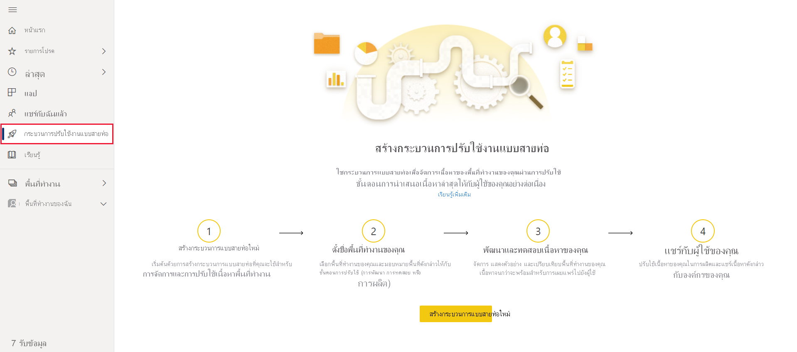
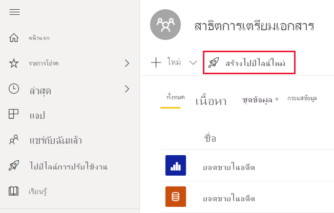
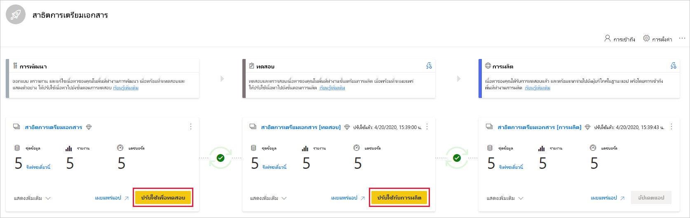
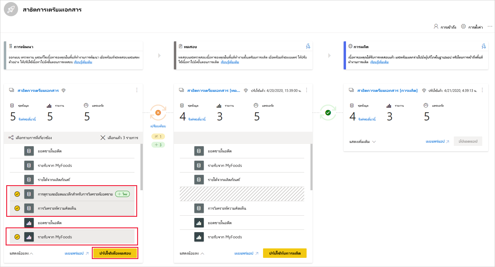
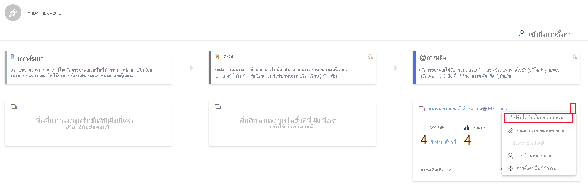
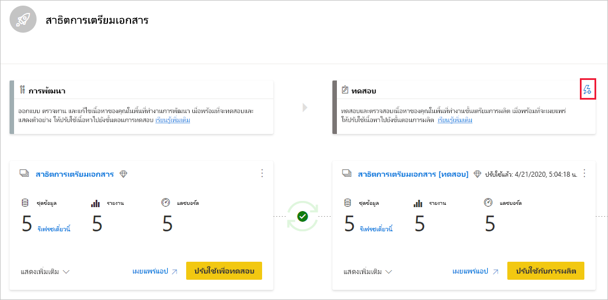
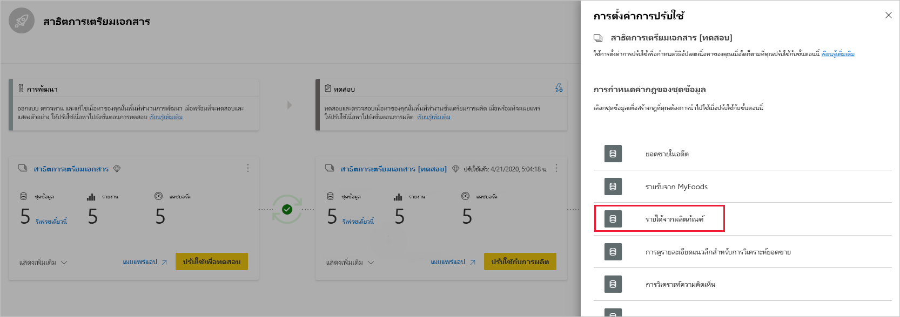
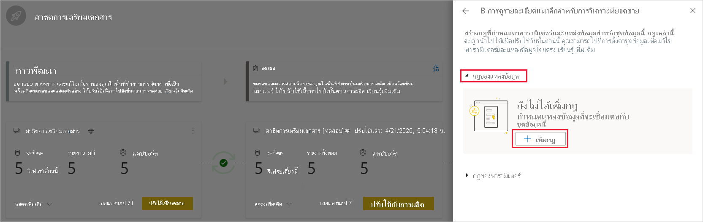
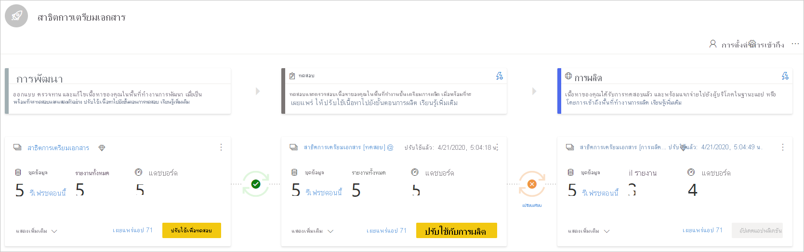

# เริ่มต้นกับไปป์ไลน์การปรับใช้Get started with deployment pipelines

บทความนี้จะแนะนำการตั้งค่าพื้นฐานที่จำเป็นสำหรับการใช้ไปป์ไลน์การปรับใช้This article walks you through the basic settings required for using deployment pipelines.

## การเข้าถึงไปป์ไลน์การปรับใช้Accessing deployment pipelines

คุณจะสามารถเข้าถึงคุณลักษณะของไปป์ไลน์การปรับใช้ได้ถ้าตรงตามเงื่อนไขต่อไปนี้:You'll be able to access the deployment pipelines feature, if the following conditions are met:

* คุณมีสิทธิการใช้งาน Premium ต่อไปนี้หนึ่งรายการ:You have one of the following Premium licenses:

    * คุณเป็นผู้ใช้ Power BI แบบ [Pro](../admin/service-admin-purchasing-power-bi-pro.md) และคุณเป็นสมาชิกขององค์กรที่มีความจุแบบ PremiumYou're a Power BI [Pro user](../admin/service-admin-purchasing-power-bi-pro.md), and you belong to an organization that has Premium capacity.

    * [Premium Per User (PPU)](../admin/service-premium-per-user-faq.md)[Premium Per User (PPU)](../admin/service-premium-per-user-faq.md).

* คุณเป็นผู้ดูแลระบบของ[ประสบการณ์ในพื้นที่ทำงานใหม่](../collaborate-share/service-create-the-new-workspaces.md)You're an admin of a [new workspace experience](../collaborate-share/service-create-the-new-workspaces.md).

>[!NOTE]
> คุณยังสามารถดูปุ่มไปป์ไลน์การปรับใช้ถ้าคุณได้สร้างไปป์ไลน์ก่อนหน้านี้หรือถ้ามีการแชร์ไปป์ไลน์กับคุณYou'll also be able to see the deployment pipelines button, if you previously created a pipeline, or if a pipeline was shared with you.

## ขั้นตอนที่ 1 - สร้างไปป์ไลน์การปรับใช้งานStep 1 - Create a deployment pipeline

คุณสามารถสร้างไปป์ไลน์จากแท็บไปป์ไลน์การปรับใช้หรือจากพื้นที่ทำงานYou can create a pipeline from the deployment pipelines tab, or from a workspace.

หลังจากสร้างไปป์ไลน์แล้วคุณสามารถแชร์กับผู้ใช้อื่นหรือลบออกได้After the pipeline is created, you can share it with other users or delete it. เมื่อคุณแชร์ไปป์ไลน์กับผู้อื่น ผู้ใช้ที่คุณแชร์ไปป์ไลน์จะได้รับการ [การเข้าถึงไปป์ไลน์](deployment-pipelines-process.md#user-with-pipeline-access)When you share a pipeline with others, the users you share the pipeline with will be given [access to the pipeline](deployment-pipelines-process.md#user-with-pipeline-access). การเข้าถึงไปป์ไลน์ช่วยให้ผู้ใช้สามารถดู แชร์ แก้ไข และลบไปป์ไลน์ได้Pipeline access enables users to view, share, edit, and delete the pipeline.

### สร้างไปป์ไลน์จากแท็บไปป์ไลน์การปรับใช้Create a pipeline from the deployment pipelines tab

หากต้องการสร้างไปป์ไลน์จากแท็บไปป์ไลน์การปรับใช้ ให้เดินเนินการดังนี้:To create a pipeline from the deployment pipelines tab, do the following:

1. ใน Power BI service จากบานหน้าต่างนำทาง ให้เลือก **ไปป์ไลน์การปรับใช้** และจากนั้นเลือก **สร้างไปป์ไลน์**In Power BI service, from the navigation pane, select **Deployment pipelines** and then select **Create pipeline**.

2. ในกล่องโต้ตอบ *สร้างการปรับใช้ไปป์ไลน์* ใส่ชื่อและคำอธิบายสำหรับไปป์ไลน์และเลือก **สร้าง**In the *Create a deployment pipeline* dialog box, enter a name and description for the pipeline, and select **Create**.

### สร้างไปป์ไลน์จากพื้นที่ทำงานCreate a pipeline from a workspace

คุณสามารถสร้างไปป์ไลน์จากพื้นที่ทำงานที่มีอยู่แล้ว โดยถือว่าคุณคือผู้ดูแลระบบของ [ประสบการณ์พื้นที่ทำงานใหม่](../collaborate-share/service-create-the-new-workspaces.md)You can create a pipeline from an existing workspace, providing you're the admin of a [new workspace experience](../collaborate-share/service-create-the-new-workspaces.md).

1. จากพื้นที่ทำงาน ให้เลือก **สร้างไปป์ไลน์**From the workspace, select **Create a pipeline**.

    > [!div class="mx-imgBorder"]
    > 

2. ในกล่องโต้ตอบ *สร้างการปรับใช้ไปป์ไลน์* ใส่ชื่อและคำอธิบายสำหรับไปป์ไลน์และเลือก **สร้าง**In the *Create a deployment pipeline* dialog box, enter a name and description for the pipeline, and select **Create**.

>[!NOTE]
>ถ้าพื้นที่ทำงานไม่ได้อยู่ในความจุ Premium ขององค์กร หรือความจุ PPU ของคุณ คุณจะได้รับการแจ้งเตือนเพื่อ [กำหนดพื้นที่ทำงานให้กับความจุ](../admin/service-admin-premium-manage.md#assign-a-workspace-to-a-capacity)If the workspace isn't assigned to your organization's Premium capacity, or to your PPU capacity, you'll get a notification to [assign it to a capacity](../admin/service-admin-premium-manage.md#assign-a-workspace-to-a-capacity).  

## ขั้นตอนที่ 2 - กำหนดพื้นที่ทำงานให้กับไปป์ไลน์การปรับใช้Step 2 - Assign a workspace to a deployment pipeline

หลังจากสร้างไปป์ไลน์แล้ว คุณจำเป็นต้องเพิ่มเนื้อหาที่คุณต้องการจัดการไปยังไปป์ไลน์After creating a pipeline, you need to add the content you want to manage to the pipeline. การเพิ่มเนื้อหาลงในไปป์ไลน์จะทำได้โดยการกำหนดพื้นที่ทำงานให้กับขั้นตอนไปป์ไลน์Adding content to the pipeline is done by assigning a workspace to the pipeline stage. คุณสามารถกำหนดพื้นที่ทำงานให้กับขั้นตอนใดๆได้You can assign a workspace to any stage. 

คุณสามารถกำหนดหนึ่งพื้นที่ทำงานให้กับไปป์ไลน์การปรับใช้You can assign one workspace to a deployment pipeline. ไปป์ไลน์การปรับใช้จะสร้างการลอกแบบ ของเนื้อหาพื้นที่ทำงานเพื่อใช้ในขั้นตอนที่แตกต่างกันของไปป์ไลน์Deployment pipelines will create clones of the workspace content, to be used in different stages of the pipeline.

ทำตามขั้นตอนเหล่านี้เพื่อกำหนดพื้นที่ทำงานในไปป์ไลน์การปรับใช้:Follow these steps to assign a workspace in a deployment pipeline:

1. ในไปป์ไลน์การปรับใช้ที่สร้างขึ้นใหม่ ให้เลือก **กำหนดพื้นที่ทำงาน**In the newly created deployment pipeline, select **Assign a workspace**.

2. ในเมนูดรอปดาวน์ *เลือกพื้นที่ทำงาน* เลือกพื้นที่ทำงานที่คุณต้องการกำหนดให้กับไปป์ไลน์In the *Choose the workspace* drop-down menu, select the workspace you want to assign to the pipeline.

    >[!NOTE]
    >ถ้าคุณกำลังสร้างไปป์ไลน์จากพื้นที่ทำงาน คุณสามารถข้ามขั้นตอนนี้เนื่องจากมีการเลือกพื้นที่ทำงานอยู่แล้วIf you're creating a pipeline from a workspace, you can skip this stage as the workspace is already selected.

3. เลือกขั้นตอนที่คุณต้องการกำหนดพื้นที่ทำงานให้Select the stage you want to assign the workspace to.

### ข้อจำกัดการกำหนดพื้นที่ทำงานWorkspace assignment limitations

* พื้นที่ทำงานต้องเป็น [ประสบการณ์ของพื้นที่ทำงานใหม่](../collaborate-share/service-create-the-new-workspaces.md)The workspace must be a [new workspace experience](../collaborate-share/service-create-the-new-workspaces.md).

* คุณต้องเป็นผู้ดูแลระบบของพื้นที่ทำงานYou must be an admin of the workspace.

* พื้นที่ทำงานไม่ได้ถูกกำหนดให้กับไปป์ไลน์อื่นThe workspace is not assigned to any other pipeline.

* พื้นที่ทำงานต้องอยู่ใน [ความจุแบบ Premium](../admin/service-premium-what-is.md)The workspace must reside on a [Premium capacity](../admin/service-premium-what-is.md).

* คุณไม่สามารถกำหนดพื้นที่ทำงานด้วย [ตัวอย่าง Power BI](../create-reports/sample-datasets.md) ไปยังขั้นตอนของไปป์ไลน์You cannot assign a workspace with [Power BI samples](../create-reports/sample-datasets.md) to a pipeline stage.

>[!NOTE]
>เฉพาะพื้นที่ทำงานที่สามารถใช้กับไปป์ไลน์การปรับใช้เท่านั้นที่จะแสดงในรายการของพื้นที่ทำงานที่คุณสามารถเลือกได้Only workspaces that can be used with deployment pipelines, will show in the list of workspaces you can select from.

## ขั้นตอนที่ 3 - ปรับใช้กับขั้นตอนที่ว่างเปล่าStep 3 - Deploy to an empty stage

[ผู้ใช้ Pro ใดๆ](../admin/service-admin-purchasing-power-bi-pro.md) ที่เป็นสมาชิกหรือผู้ดูแลระบบในพื้นที่ทำงานต้นทางสามารถปรับใช้เนื้อหาไปยังขั้นตอนที่ว่างเปล่า (ขั้นตอนที่ไม่มีเนื้อหา)Any [Pro user](../admin/service-admin-purchasing-power-bi-pro.md) that's a member or admin in the source workspace, can deploy content to an empty stage (a stage that doesn't contain content). พื้นที่ทำงานต้องอยู่ในความจุสำหรับการปรับใช้เพื่อให้เสร็จสมบูรณ์The workspace must reside on a capacity for the deployment to be completed.

เมื่อปรับใช้เนื้อหาไปยังขั้นตอนที่ว่างเปล่า ความสัมพันธ์ระหว่างรายการจะถูกเก็บไว้When deploying content to an empty stage, the relationships between the items are kept. ตัวอย่างเช่นรายงานที่ถูกผูกกับชุดข้อมูลในขั้นตอนแหล่งข้อมูลจะมีการลอกแบบควบคู่ไปกับชุดข้อมูลและโคลนจะถูกผูกไว้ในพื้นที่ทำงานเป้าหมายFor example, a report that is bound to a dataset in the source stage, will be cloned alongside its dataset, and the clones will be similarly bound in the target workspace.

เมื่อการปรับใช้เสร็จสมบูรณ์ ให้รีเฟรชชุดข้อมูลOnce the deployment is complete, refresh the dataset. สำหรับข้อมูลเพิ่มเติม ดู [ปรับใช้เนื้อหาไปยังขั้นตอนที่ว่างเปล่า](deployment-pipelines-process.md#deploying-content-to-an-empty-stage)For more information, see [deploying content to an empty stage](deployment-pipelines-process.md#deploying-content-to-an-empty-stage).

### ปรับใช้เนื้อหาทั้งหมดDeploying all content

เลือกขั้นตอนที่จะปรับใช้และจากนั้นเลือกปุ่มปรับใช้Select the stage to deploy from and then select the deployment button. กระบวนการปรับใช้สร้างพื้นที่ทำงานซ้ำในขั้นตอนเป้าหมายThe deployment process creates a duplicate workspace in the target stage. พื้นที่ทำงานนี้ประกอบด้วยเนื้อหาทั้งหมดที่มีอยู่ในขั้นตอนปัจจุบันThis workspace includes all the content existing in the current stage.

### การปรับใช้ที่เลือกSelective deployment

เมื่อต้องการปรับใช้เฉพาะรายการที่ระบุ ให้เลือก **แสดงลิงก์เพิ่มเติม** แล้วจากนั้นเลือกรายการที่คุณต้องการปรับใช้To deploy only specific items, select the **Show more** link, and then select the items you wish to deploy. เมื่อคลิกปุ่มปรับใช้ เฉพาะรายการที่เลือกเท่านั้นที่จะถูกปรับใช้ในขั้นตอนถัดไปWhen clicking the deploy button, only the selected items are deployed to the next stage.

เนื่องจากแดชบอร์ด รายงาน และชุดข้อมูลที่เกี่ยวข้องและมีการขึ้นต่อกัน คุณสามารถใช้ปุ่มเลือกที่เกี่ยวข้องเพื่อตรวจสอบรายการทั้งหมดที่รายการเหล่านั้นจะขึ้นอยู่ด้วยSince dashboards, reports and datasets are related and have dependencies, you can use the select related button to check all items that those items are dependent on. ตัวอย่างเช่นหากคุณต้องการปรับใช้รายงานไปยังขั้นตอนถัดไปการคลิกปุ่มเลือกที่เกี่ยวข้องจะทำเครื่องหมายชุดข้อมูลที่รายงานเชื่อมต่อด้วยเพื่อให้ทั้งคู่ใช้งานได้ทันทีและรายงานจะไม่แตกFor example, if you want to deploy a report to the next stage, clicking the select related button will mark the dataset that the report is connected to, so that both will be deployed at once and the report will not break.

>[!NOTE]
> * คุณไม่สามารถปรับใช้รายงานหรือแดชบอร์ดไปยังขั้นตอนถัดไปได้ถ้าไม่มีรายการที่ขึ้นอยู่ด้วยอยู่ในขั้นตอนที่คุณกำลังปรับใช้อยู่You can't deploy a report or dashboard to next stage if the items it's dependent on do not exist in the stage you are deploying to.
> * คุณอาจได้รับผลลัพธ์ที่ไม่คาดคิดถ้าคุณเลือกที่จะปรับใช้รายงานหรือแดชบอร์ดโดยไม่มีชุดข้อมูลYou might get unexpected results if you choose to deploy a report or dashboard without its dataset. สิ่งนี้สามารถเกิดขึ้นได้เมื่อชุดข้อมูลในขั้นตอนเป้าหมายมีการเปลี่ยนแปลงและไม่เหมือนกับชุดข้อมูลในขั้นตอนที่คุณกำลังปรับใช้อีกต่อไปThis can happen when the dataset in the target stage, has changed and is no longer identical to the one in the stage you're deploying from.

### การปรับใช้ย้อนหลังBackwards deployment

คุณสามารถเลือกที่จะปรับใช้เป็นขั้นตอนก่อนหน้า ตัวอย่างเช่นในสถานการณ์ที่คุณกำหนดพื้นที่ทำงานที่มีอยู่ให้กับขั้นตอนการผลิตและจากนั้นปรับใช้ย้อนกลับก่อนขั้นตอนทดสอบและจากนั้นไปที่การพัฒนาYou can choose to deploy to a previous stage, for example in a scenario where you assign an existing workspace to a production stage and then deploy it backwards, first to the test stage, and then to the development one.

การปรับใช้ไปยังขั้นตอนก่อนหน้านี้จะทำงานเฉพาะเมื่อขั้นตอนก่อนหน้าว่างเปล่าDeploying to a previous stage works only if the previous stage is empty. เมื่อปรับใช้กับขั้นตอนก่อนหน้า คุณไม่สามารถเลือกรายการที่ระบุได้When deploying to a previous stage, you can't select specific items. เนื้อหาทั้งหมดในขั้นตอนจะถูกปรับใช้All content in the stage will be deployed.

## ขั้นตอนที่ 4 - สร้างกฎชุดข้อมูลStep 4 - Create dataset rules

เมื่อทำงานในไปป์ไลน์การปรับใช้ ขั้นตอนที่แตกต่างกันอาจมีการกำหนดค่าที่แตกต่างกันWhen working in a deployment pipeline, different stages may have different configurations. ตัวอย่างเช่น แต่ละขั้นตอนสามารถมีฐานข้อมูลที่แตกต่างกัน หรือพารามิเตอร์คิวรีที่แตกต่างกันFor example, each stage can have different databases or different query parameters. ขั้นตอนการพัฒนาอาจคิวรีตัวอย่างข้อมูลจากฐานข้อมูลในขณะที่การทดสอบและขั้นตอนการผลิตคิวรีฐานข้อมูลทั้งหมดThe development stage might query sample data from the database, while the test and production stages query the entire database.

เมื่อคุณปรับใช้เนื้อหาระหว่างขั้นตอนไปป์ไลน์ การกำหนดค่ากฎชุดข้อมูลช่วยให้คุณสามารถอนุญาตให้มีการเปลี่ยนแปลงกับเนื้อหาในขณะที่ยังคงมีการตั้งค่าบางอย่างได้When you deploy content between pipeline stages, configuring dataset rules enables you to allow changes to content, while keeping some settings intact.

กฎชุดข้อมูลถูกกำหนดบนแหล่งข้อมูลและพารามิเตอร์ในแต่ละชุดข้อมูลDataset rules are defined on data sources and parameters, in each dataset. กฎชุดข้อมูลจะกำหนดค่าของแหล่งข้อมูลหรือพารามิเตอร์สำหรับชุดข้อมูลที่ระบุThey determine the values of the data sources or parameters for a specific dataset. ตัวอย่างเช่น ถ้าคุณต้องการให้ชุดข้อมูลในขั้นตอนการผลิตชี้ไปยังฐานข้อมูลการผลิต คุณสามารถกำหนดกฎสำหรับการดำเนินการนี้ได้For example, if you want a dataset in a production stage to point to a production database, you can define a rule for this. มีการกำหนดกฎในขั้นตอนการผลิตภายใต้ชุดข้อมูลที่เหมาะสมThe rule is defined in the production stage, under the appropriate dataset. เมื่อกำหนดกฎแล้วเนื้อหาที่ปรับใช้จากการทดสอบไปยังการผลิตจะได้รับค่าตามที่กำหนดในกฎชุดข้อมูลและจะมีผลตลอดเวลาตราบเท่าที่กฎไม่เปลี่ยนแปลงและถูกต้องOnce the rule is defined, content deployed from test to production, will inherit the value as defined in the dataset rule, and will always apply as long as the rule is unchanged and valid.

>[!NOTE]
> กฎชุดข้อมูลจะทำงานเฉพาะเมื่อแหล่งข้อมูลต้นทางและเป้าหมายเป็นชนิดเดียวกันเท่านั้นDataset rules work only when the source and target data source are of the same type.

### สร้างกฎชุดข้อมูลCreate a dataset rule

1. ในขั้นตอนไปป์ไลน์ที่คุณต้องการสร้างกฎชุดข้อมูล ให้เลือก **การตั้งค่าการปรับใช้**In the pipeline stage you want to create a dataset rule for, select **Deployment settings**.

    

2. จากบานหน้าต่างการตั้งค่าการปรับใช้ เลือกชุดข้อมูลที่คุณต้องการสร้างกฎFrom the Deployment settings pane, select the dataset you want to create a rule for.

    

3. เลือกชนิดของกฎที่คุณต้องการสร้าง ขยายรายการและจากนั้นเลือก **เพิ่มกฎ**Select the type of rule you want to create, expand the list, and then select **Add rule**.

     

### ชนิดกฎชุดข้อมูลDataset rule types

มีกฎสองชนิดที่คุณสามารถสร้างได้:There are two types of rules you can create:

* **กฎแหล่งข้อมูล** รายการแหล่งข้อมูลจะถูกนำมาจากชุดข้อมูลของขั้นตอนไปป์ไลน์ต้นทาง**Data source rules** The data source list is taken from the dataset of the source pipeline stage. จากรายการแหล่งข้อมูล เลือกแหล่งข้อมูลที่จะแทนที่From the data source list, select a data source to be replaced. ใช้หนึ่งในวิธีต่อไปนี้เพื่อเลือกค่าที่จะแทนที่อีกค่าจากขั้นตอนต้นทาง:Use one of the following methods to select a value to replace the one from the source stage:

    1. เลือกจากรายการSelect from a list.

    2. เลือก **อื่น ๆ** และเพิ่มแหล่งข้อมูลใหม่ด้วยตนเองSelect **Other** and manually add the new data source. คุณสามารถเปลี่ยนไปยังแหล่งข้อมูลจากชนิดเดียวกันเท่านั้นYou can only change to a data source from the same type.

* **กฎพารามิเตอร์** เลือกพารามิเตอร์จากรายการพารามิเตอร์ ค่าปัจจุบันจะแสดงขึ้น**Parameter rules** Select a parameter from the list of parameters; the current value is shown. แก้ไขค่าเป็นค่าที่คุณต้องการให้มีผลหลังจากการปรับใช้แต่ละครั้งEdit the value to the value you want to take effect after each deployment.

### ข้อจำกัดของกฎชุดข้อมูลDataset rule limitations

* คุณต้องเป็นเจ้าของชุดข้อมูลเพื่อสร้างกฎชุดข้อมูลYou must be the dataset owner to create a dataset rule.

* ไม่สามารถสร้างกฎชุดข้อมูลในขั้นตอนการพัฒนาได้Dataset rules cannot be created in the development stage.

* เมื่อรายการถูกเอาออกหรือลบกฎจะถูกลบด้วยWhen an item is removed or deleted, its rules are deleted too. ไม่สามารถคืนค่ากฎเหล่านี้ได้These rules cannot be restored.

* หากแหล่งข้อมูลหรือพารามิเตอร์ที่กำหนดไว้ในกฎมีการเปลี่ยนแปลงหรือลบออกจากชุดข้อมูลต้นทาง กฎจะไม่ถูกต้องและการปรับใช้จะล้มเหลวIf the data source or parameters defined in a rule are changed or removed from the source dataset, the rule will not be valid and the deployment will fail.

* ไม่สามารถกำหนดกฎพารามิเตอร์สำหรับพารามิเตอร์ที่มีชนิดเป็น *ทุกชนิด* หรือ *ไบนารี*Parameter rules cannot be defined for parameters that are of type *Any* or *Binary*. สำหรับข้อมูลเพิ่มเติม โปรดดู [ข้อจำกัดของพารามิเตอร์การปรับปรุงชุดข้อมูล](/rest/api/power-bi/datasets/updateparameters)For more information, see [datasets update parameters restrictions](/rest/api/power-bi/datasets/updateparameters).

* กฎแหล่งข้อมูลสามารถกำหนดได้สำหรับแหล่งข้อมูลต่อไปนี้เท่านั้น:Data source rules can only be defined for the following data sources:
    * Azure Analysis ServicesAzure Analysis Services
    * Azure SynapseAzure Synapse
    * SQL Server Analysis Services (SSAS)SQL Server Analysis Services (SSAS)
    * Azure SQL ServerAzure SQL Server
    * SQL serverSQL server
    * Odata FeedOdata Feed
    * OracleOracle
    * SapHana (รองรับเฉพาะโหมดการนำเข้า ไม่ใช่โหมดคิวรีโดยตรง)SapHana (only supported for import mode; not direct query mode)
    * SharePointSharePoint
    * TeradataTeradata

    สำหรับแหล่งข้อมูลอื่นเราขอแนะนำให้ [ ใช้พารามิเตอร์เพื่อกำหนดค่าแหล่งข้อมูลของคุณ](deployment-pipelines-best-practices.md#use-parameters-in-your-model)For other data sources, we recommend [using parameters to configure your data source](deployment-pipelines-best-practices.md#use-parameters-in-your-model).

## ขั้นตอนที่ 5 - ปรับใช้เนื้อหาจากขั้นตอนหนึ่งไปยังอีกขั้นStep 5 - Deploy content from one stage to another

เมื่อคุณมีเนื้อหาในขั้นตอนไปป์ไลน์แล้วคุณสามารถปรับใช้กับขั้นตอนถัดไปได้Once you have content in a pipeline stage, you can deploy it to the next stage. การปรับใช้เนื้อหาไปยังขั้นตอนอื่นมักจะทำหลังจากคุณได้ดำเนินการบางอย่างในไปป์ไลน์Deploying content to another stage is usually done after you've performed some actions in the pipeline. ตัวอย่างเช่น ทำการเปลี่ยนแปลงการพัฒนาเนื้อหาของคุณในขั้นตอนการพัฒนา หรือทดสอบเนื้อหาของคุณในขั้นตอนการทดสอบFor example, made development changes to your content in the development stage, or tested your content in the test stage. เวิร์กโฟลว์ทั่วไปสำหรับการย้ายเนื้อหาจากขั้นตอนหนึ่งไปอีกขั้นคือการพัฒนาเพื่อทดสอบแล้วทดสอบกับการผลิตA typical workflow for moving content from stage to stage, is development to test, and then test to production. คุณสามารถเรียนรู้เพิ่มเติมเกี่ยวกับกระบวนการนี้ได้ในส่วน [ ปรับใช้เนื้อหาไปยังพื้นที่ทำงานที่มีอยู่](deployment-pipelines-process.md#deploy-content-to-an-existing-workspace)You can learn more about this process, in the [deploy content to an existing workspace](deployment-pipelines-process.md#deploy-content-to-an-existing-workspace) section.

ในการปรับใช้เนื้อหาไปยังขั้นตอนถัดไปในไปป์ไลน์การปรับใช้ ให้เลือกปุ่มปรับใช้ที่ด้านล่างของขั้นตอนTo deploy content to the next stage in the deployment pipeline, select the deploy button at the bottom of the stage.

เมื่อตรวจสอบการ์ดขั้นตอนทดสอบและการผลิต คุณสามารถดูเวลาการปรับใช้ล่าสุดWhen reviewing the test and production stage cards, you can see the last deployment time. ซึ่งแสดงเนื้อหาครั้งล่าสุดที่ถูกปรับใช้กับขั้นตอนThis indicates the last time content was deployed to the stage.

เวลาการปรับใช้จะเป็นประโยชน์สำหรับการสร้างเมื่อขั้นตอนได้รับการอัปเดตครั้งล่าสุดDeployment time is useful for establishing when a stage was last updated. นอกจากนี้ยังสามารถเป็นประโยชน์ถ้าคุณต้องการติดตามเวลาระหว่างการทดสอบและการปรับใช้การผลิตIt can also be helpful if you want to track time between test and production deployments.

## การเปรียบเทียบขั้นตอนComparing stages

เมื่อสองลำดับขั้นตอนมีเนื้อหา เนื้อหาจะถูกเปรียบเทียบโดยยึดตามเมตาดาต้าของรายการเนื้อหาWhen two sequential stages have content, the content is compared based on the content items metadata. การเปรียบเทียบนี้ไม่รวมการเปรียบเทียบข้อมูลหรือเวลาการรีเฟรชระหว่างขั้นตอนThis comparison doesn't include comparing data or refresh time between stages.

 

เพื่อให้สามารถแสดงข้อมูลเชิงลึกของวิชวลได้อย่างรวดเร็วในความแตกต่างระหว่างสองลำดับขั้นตอน ตัวบ่งชี้ไอคอนเปรียบเทียบจะปรากฏขึ้นTo allow a quick visual insight into the differences between two sequential stages, a comparison icon indicator appears between them. ตัวบ่งชี้การเปรียบเทียบมีสองสถานะ:The comparison indicator has two states:

* **ตัวบ่งชี้สีเขียว** – เมตาดาต้าสำหรับแต่ละรายการเนื้อหาในทั้งสองขั้นตอนจะเหมือนกัน**Green indicator** – The metadata for each content item in both stages, is the same.

* **ตัวบ่งชี้สีส้ม** - ปรากฏขึ้นหากเป็นไปตามเงื่อนไขหนึ่งในเหล่านี้:**Orange indicator** - Appears if one of these conditions is met:
    * บางรายการเนื้อหาในแต่ละขั้นตอนมีการเปลี่ยนแปลงหรืออัปเดต (มีเมตาดาต้าที่แตกต่างกัน)Some of the content items in each stage, were changed or updated (have different metadata).
    * มีความแตกต่างในจำนวนของรายการระหว่างขั้นตอนThere is a difference in the number of items between the stages.

เมื่อสองลำดับขั้นตอนไม่เหมือนกัน ลิงก์ **เปรียบเทียบ** จะปรากฏขึ้นใต้ไอคอนการเปรียบเทียบสีส้มWhen two sequential stages aren't the same, a **compare** link appears underneath the orange comparison icon. การคลิกที่ลิงก์จะเปิดรายการเนื้อหาในทั้งสองขั้นตอนในมุมมองการเปรียบเทียบClicking the link opens the content item list in both stages in Compare view. มุมมองการเปรียบเทียบช่วยให้คุณติดตามการเปลี่ยนแปลงหรือความแตกต่างระหว่างรายการในแต่ละขั้นตอนไปป์ไลน์Compare view helps you track changes or differences between items, in each pipeline stage. รายการที่เปลี่ยนแปลงจะได้รับหนึ่งในป้ายกำกับต่อไปนี้:Changed items get one of the following labels:

* **ใหม่** - รายการใหม่ในขั้นตอนต้นทาง**New** – A new item in the source stage. นี่คือรายการที่ไม่มีในขั้นตอนเป้าหมายThis is an item that doesn't exist in the target stage. หลังจากการปรับใช้ รายการนี้จะถูกลอกแบบไปยังขั้นตอนเป้าหมายAfter deployment, this item will be cloned to the target stage.

* **ที่แตกต่างกัน** – รายการที่มีอยู่ทั้งในแหล่งที่มาและขั้นตอนเป้าหมาย เป็นหนึ่งในเวอร์ชันที่มีการเปลี่ยนแปลงหลังจากการปรับใช้ครั้งล่าสุด**Different** – An item that exists both in the source and the target stage, were one of the versions was changed after the last deployment. หลังจากการปรับใช้ รายการในขั้นตอนต้นทางจะเขียนทับรายการในขั้นตอนเป้าหมายโดยไม่คำนึงถึงตำแหน่งที่ทำการเปลี่ยนแปลงAfter deployment, the item in the source stage will overwrite the item in the target stage, regardless of where the change was made.

* **หายไปจาก** – ป้ายชื่อนี้แสดงว่ารายการปรากฏในขั้นตอนเป้าหมายแต่ไม่อยู่ในขั้นตอนต้นทาง**Missing from** – This label indicates that an item appears in the target stage, but not in the source stage.

    >[!NOTE]
    >การใช้งานจะไม่ส่งผลกระทบรายการ *หายไปจาก*Deployment will not impact *missing from* items.

 

## การแทนที่เนื้อหาOverriding content

เมื่อคุณปรับใช้หลังจากทำการเปลี่ยนแปลงเนื้อหาในขั้นตอนต้นทาง เนื้อหาที่คุณเปลี่ยนในขั้นตอนเป้าหมายจะถูกเขียนทับWhen you deploy after making changes to content in the source stage, the content you changed in the target stage is overwritten. หลังจากที่คลิก *ปรับใช้* แล้วคุณจะได้รับคำเตือนเป็นรายการจำนวนของรายการที่จะถูกเขียนทับAfter clicking *deploy*, you'll get a warning listing the number of items that will be overwritten.

คุณสามารถเรียนรู้เพิ่มเติมเกี่ยวกับ [รายการที่จะถูกคัดลอกไปยังขั้นตอนถัดไป](deployment-pipelines-process.md#deployed-items)และ [รายการที่ไม่ถูกคัดลอก](deployment-pipelines-process.md#unsupported-items)ใน [ทำความเข้าใจกระบวนการปรับใช้](deployment-pipelines-process.md)You can learn more about [which items are copied to the next stage](deployment-pipelines-process.md#deployed-items), and [which items are not copied](deployment-pipelines-process.md#unsupported-items), in [Understand the deployment process](deployment-pipelines-process.md).

## ขั้นตอนถัดไปNext steps

>[!div class="nextstepaction"]
>[บทนำสู่ไปป์ไลน์การปรับใช้Introduction to deployment pipelines](deployment-pipelines-overview.md)

>[!div class="nextstepaction"]
>[ทำความเข้าใจกระบวนการไปป์ไลน์การปรับใช้Understand the deployment pipelines process](deployment-pipelines-process.md)

>[!div class="nextstepaction"]
>[การแก้ไขปัญหาไปป์ไลน์การปรับใช้Deployment pipelines troubleshooting](deployment-pipelines-troubleshooting.md)

>[!div class="nextstepaction"]
>[แนวทางปฏิบัติที่ดีที่สุดสำหรับไปป์ไลน์การปรับใช้Deployment pipelines best practices](deployment-pipelines-best-practices.md)