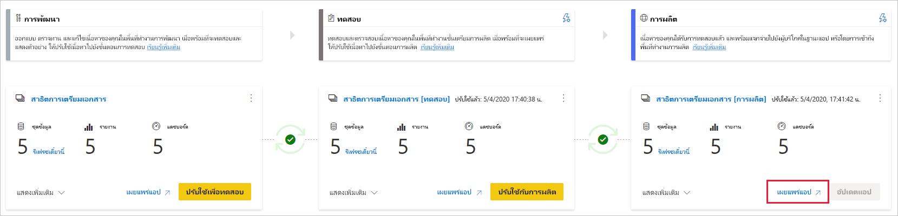
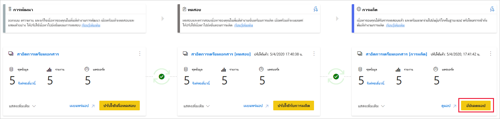

# ทำความเข้าใจขั้นตอนการปรับใช้งานUnderstand the deployment process

กระบวนการปรับใช้ช่วยให้คุณสามารถโคลนเนื้อหาจากขั้นตอนหนึ่งในไปป์ไลน์ไปยังอีกขั้นหนึ่ง จากการพัฒนาโดยทั่วไปจนถึงการทดสอบและจากการทดสอบไปยังการผลิตThe deployment process lets you clone content from one stage in the pipeline to another, typically from development to test, and from test to production.

ในระหว่างการปรับใช้ Power BI จะคัดลอกเนื้อหาจากขั้นตอนปัจจุบันไปยังเป้าหมายDuring deployment, Power BI copies the content from the current stage, into the target one. การเชื่อมต่อระหว่างรายการที่คัดลอกจะถูกเก็บไว้ในระหว่างกระบวนการคัดลอกThe connections between the copied items are kept during the copy process. Power BI ยังใช้กฎชุดข้อมูลที่กำหนดค่าไว้กับเนื้อหาที่อัปเดตแล้วในขั้นตอนเป้าหมายPower BI also applies the configured dataset rules to the updated content in the target stage. การจัดวางเนื้อหาอาจใช้เวลาสักครู่โดยขึ้นอยู่กับจำนวนของรายการที่ถูกปรับใช้Deploying content may take a while, depending on the number of items being deployed. ในช่วงเวลานี้คุณสามารถนำทางไปยังหน้าอื่นๆ ในพอร์ทัล Power BI แต่คุณไม่สามารถใช้เนื้อหาในขั้นตอนเป้าหมายได้During this time, you can navigate to other pages in the Power BI portal, but you cannot use the content in the target stage.

## ปรับใช้เนื้อหาไปยังขั้นตอนที่ว่างDeploying content to an empty stage

เมื่อคุณปรับใช้เนื้อหาไปยังขั้นตอนที่ว่าง เมตาดาต้าของรายงาน แดชบอร์ด และชุดข้อมูลในพื้นที่ทำงานที่คุณกำลังจัดวางจะถูกคัดลอกไปยังขั้นตอนที่คุณกำลังปรับใช้When you deploy content to an empty stage, the metadata of the reports, dashboards, and datasets in the workspace you're deploying from, is copied to the stage you're deploying to. พื้นที่ทำงานใหม่สำหรับขั้นตอนที่คุณปรับใช้จะถูกสร้างขึ้นบนความจุแบบพรีเมียมA new workspace for the stage you deployed to, is created on a Premium capacity.

มีสองวิธีในการปรับใช้เนื้อหาจากหนึ่งขั้นตอนไปยังรายการถัดไปThere are two ways to deploy content from one stage to the next one. คุณสามารถปรับใช้เนื้อหาทั้งหมดหรือคุณสามารถ [เลือกรายการเนื้อหาที่จะปรับใช้ได้](deployment-pipelines-get-started.md#selective-deployment)You can deploy all the content, or you can [select which content items to deploy](deployment-pipelines-get-started.md#selective-deployment).

นอกจากนี้คุณยังสามารถปรับใช้เนื้อหาย้อนหลังจากขั้นตอนถัดไปในไปป์ไลน์การปรับใช้ไปยังรายการก่อนหน้าYou can also deploy content backwards, from a later stage in the deployment pipeline, to an earlier one.

หลังจากที่การปรับใช้เสร็จสมบูรณ์ให้รีเฟรชชุดข้อมูลเพื่อให้คุณสามารถใช้เนื้อหาที่คัดลอกใหม่ได้After the deployment is complete, refresh the datasets so that you can use the newly copied content. จำเป็นต้องมีการรีเฟรชชุดข้อมูลเนื่องจากไม่มีการคัดลอกข้อมูลจากขั้นตอนหนึ่งไปยังรายการอื่นThe dataset refresh is required because data isn't copied from one stage to another. เมื่อต้องการทำความเข้าใจเกี่ยวกับคุณสมบัติของรายการที่จะคัดลอกในระหว่างกระบวนการปรับใช้และคุณสมบัติของรายการที่ไม่ได้คัดลอกให้ตรวจทาน [คุณสมบัติของรายการที่คัดลอกในระหว่างส่วนปรับใช้](#item-properties-copied-during-deployment)To understand which item properties are copied during the deployment process, and which item properties are not copied, review the [item properties copied during deployment](#item-properties-copied-during-deployment) section.

### การสร้างพื้นที่ทำงานความจุแบบพรีเมียมCreating a Premium capacity workspace

ในระหว่างการปรับใช้ครั้งแรก ไปป์ไลน์การปรับใช้จะตรวจสอบว่าคุณมีสิทธิ์ความจุแบบพรีเมียมหรือไม่During first-time deployment, deployment pipelines checks if you have Premium capacity permissions.  

ถ้าคุณมีสิทธิ์ความจุ เนื้อหาของพื้นที่ทำงานจะถูกคัดลอกไปยังขั้นตอนที่คุณกำลังปรับใช้ และพื้นที่ทำงานใหม่สำหรับขั้นตอนดังกล่าวจะถูกสร้างขึ้นบนความจุแบบพรีเมียมIf you have capacity permissions, the content of the workspace is copied to the stage you're deploying to, and a new  workspace for that stage is created on the Premium capacity.

ถ้าคุณไม่มีสิทธิ์ความจุ พื้นที่ทำงานจะถูกสร้างขึ้นแต่ไม่มีการคัดลอกเนื้อหาIf you don't have capacity permissions, the workspace is created but the content isn’t copied. คุณสามารถขอให้ผู้ดูแลความจุเพิ่มพื้นที่ทำงานของคุณไปยังความจุ หรือขอสิทธิ์ในการกำหนดสำหรับความจุYou can ask a capacity admin to add your workspace to a capacity, or ask for assignment permissions for the capacity. หลังจากที่พื้นที่ทำงานถูกกำหนดให้กับความจุ คุณสามารถปรับใช้เนื้อหาไปยังพื้นที่ทำงานนี้ได้Later, when the workspace is assigned to a capacity, you can deploy content to this workspace.

หากคุณกำลังใช้ [Premium Per User (PPU)](../admin/service-premium-per-user-faq.md) พื้นที่ทำงานของคุณจะถูกสร้างขึ้นโดยอัตโนมัติตามความจุที่เชื่อมโยงกับ PPU ของคุณIf you're using [Premium Per User (PPU)](../admin/service-premium-per-user-faq.md), your workspace is automatically created in the capacity associated with your PPU. ในกรณีดังกล่าวไม่จำเป็นต้องมีสิทธิ์ความจุIn such cases capacity permissions are not required. อย่างไรก็ตาม พื้นที่ทำงานที่สร้างขึ้นจากผู้ใช้ PPU สามารถเข้าถึงได้โดยผู้ใช้ PPU รายอื่นเท่านั้นHowever, workspaces created by a PPU user, can only be accessed by other PPU users. นอกจากนี้เนื้อหาที่สร้างในพื้นที่ทำงานดังกล่าวสามารถใช้ได้โดยผู้ใช้ PPU เท่านั้นIn addition, content created in such workspaces can only be consumed by PPU users.

### พื้นที่ทำงานและความเป็นเจ้าของเนื้อหาWorkspace and content ownership

ผู้ใช้จะกลายเป็นเจ้าของชุดข้อมูลแบบโคลนโดยอัตโนมัติและผู้ดูแลระบบเดียวของพื้นที่ทำงานใหม่The deploying user automatically becomes the dataset owner of the cloned datasets, and the only admin of the new workspace.

## ปรับใช้เนื้อหาไปยังพื้นที่ทำงานที่มีอยู่Deploy content to an existing workspace

การปรับใช้เนื้อหาในไปป์ไลน์การผลิตที่ใช้งานได้ไปยังขั้นตอนที่มีพื้นที่ทำงานที่มีอยู่รวมถึงต่อไปนี้:Deploying content in a working production pipeline, to a stage that has an existing workspace, includes the following:

* ปรับใช้เนื้อหาใหม่ด้วยการเพิ่มไปยังขั้นตอนที่มีเนื้อหาอยู่แล้วDeploying new content as an addition, to a stage that already contains content.

* เนื้อหาใหม่ที่ปรับใช้เพื่อแทนที่เนื้อหาเก่าในขั้นตอนการทำงานปัจจุบันNew content deployed to replace old content, in a current working  stage.

### กระบวนการปรับใช้Deployment process

เนื้อหาจากขั้นตอนปัจจุบันจะถูกคัดลอกไปยังขั้นตอนเป้าหมายContent from the current stage is copied over to the target stage. Power BI ระบุเนื้อหาที่มีอยู่ในขั้นตอนเป้าหมายและเขียนทับข้อมูลดังกล่าวPower BI identifies existing content in the target stage and overwrites it. ในการระบุว่ารายการเนื้อหาใดที่ต้องถูกเขียนทับไปป์ไลน์การปรับใช้จะใช้การเชื่อมต่อระหว่างรายการหลักกับโคลนของมันTo identify which content item needs to be overwritten, deployment pipelines uses the connection between the parent item and its clones. การเชื่อมต่อนี้จะถูกเก็บไว้เมื่อมีการสร้างเนื้อหาใหม่This connection is kept when new content is created. การดำเนินการเขียนทับจะเขียนทับเนื้อหาของรายการเท่านั้นThe overwrite operation only overwrites the content of the item. ID, URL และสิทธิ์ของรายการยังคงไม่เปลี่ยนแปลงThe item's ID, URL, and permissions remain unchanged.

ในขั้นตอนเป้าหมาย [คุณสมบัติของรายการที่ไม่ได้คัดลอก](deployment-pipelines-process.md#item-properties-that-are-not-copied)ยังคงอยู่เหมือนก่อนการปรับใช้In the target stage, [item properties that are not copied](deployment-pipelines-process.md#item-properties-that-are-not-copied), remain as they were before deployment. เนื้อหาใหม่และรายการใหม่จะถูกคัดลอกจากขั้นตอนปัจจุบันไปยังขั้นตอนเป้าหมายNew content and new items are copied from the current stage to the target stage.

### รีเฟรชชุดข้อมูลRefreshing the dataset

ข้อมูลในชุดข้อมูลเป้าหมายจะถูกเก็บไว้เมื่อเป็นไปได้Data in the target dataset is kept when possible. ถ้าไม่มีการเปลี่ยนแปลงไปยังชุดข้อมูล ข้อมูลจะถูกเก็บไว้เหมือนก่อนที่จะมีการใช้งานIf there are no changes to a dataset, the data is kept as it was before the deployment.

เมื่อมีการเปลี่ยนแปลงเล็กๆ เช่นการเพิ่มตารางหรือหน่วยวัด Power BI จะเก็บข้อมูลเดิมและการรีเฟรชถูกปรับให้เหมาะสมเพื่อรีเฟรชเฉพาะสิ่งที่จำเป็นเท่านั้นWith small changes, such as adding a table or measures, Power BI keeps the original data, and the refresh is optimized to refresh only what's needed. สำหรับการทำลาย schema ที่เปลี่ยนแปลงหรือการเปลี่ยนแปลงในการเชื่อมต่อแหล่งข้อมูลจำเป็นต้องรีเฟรชแบบเต็มFor breaking schema changes, or changes in the data source connection, a full refresh is required.

### ข้อกำหนดสำหรับการปรับใช้กับขั้นตอนด้วยพื้นที่ทำงานที่มีอยู่Requirements for deploying to a stage with an existing workspace

ตราบใดที่เนื้อหาที่มีการปรับใช้อยู่บน [ความจุแบบพรีเมียม](../admin/service-premium-what-is.md) ผู้ใช้ที่เป็นไปตามเงื่อนไขต่อไปนี้สามารถปรับใช้กับขั้นตอนด้วยพื้นที่ทำงานที่มีอยู่:As long as the deployed content resides on a [premium capacity](../admin/service-premium-what-is.md), a user that meets the following conditions, can deploy it to a stage with an existing workspace:

* ผู้ใช้ที่มี[สิทธิการใช้งาน Pro](../admin/service-admin-purchasing-power-bi-pro.md) หรือ[ผู้ใช้ PPU](../admin/service-premium-per-user-faq.md) ซึ่งเป็นสมาชิกของพื้นที่ทำงานทั้งสองในขั้นตอนการปรับใช้แหล่งที่มาและเป้าหมายA user with a [Pro license](../admin/service-admin-purchasing-power-bi-pro.md) or a [PPU user](../admin/service-premium-per-user-faq.md), who's a member of both workspaces in the source and target deployment stages.

* เจ้าของชุดข้อมูลทั้งหมดในพื้นที่ทำงานเป้าหมายที่จะถูกปรับใช้An owner of all the datasets in the target workspace that are about to be deployed.

สำหรับข้อมูลเพิ่มเติมให้ตรวจทานส่วน [สิทธิ์](#permissions)For more information, review the [permissions](#permissions) section.

## รายการที่ปรับใช้Deployed items

เมื่อคุณปรับใช้เนื้อหาจากขั้นตอนไปป์ไลน์หนึ่งไปยังอีกขั้นตอน เนื้อหาที่คัดลอกจะประกอบด้วยรายการ Power BI ต่อไปนี้:When you deploy content from one pipeline stage to another, the copied content contains the following Power BI items:

* ชุดข้อมูลDatasets

* รายงานReports

* แดชบอร์ดDashboards

### รายการที่ไม่รองรับUnsupported items

ไปป์ไลน์การปรับใช้ไม่รองรับรายการต่อไปนี้:Deployment pipelines doesn't support the following items:

* ชุดข้อมูลที่ไม่ได้มาจาก PBIXDatasets that do not originate from a PBIX

* รายงานที่ยึดตามชุดข้อมูลที่ไม่ได้รับการรองรับReports based on unsupported datasets

* [พื้นที่ทำงานของแอปเทมเพลตTemplate app workspaces](../connect-data/service-template-apps-create.md#create-the-template-workspace)

* รายงานที่มีการแบ่งหน้าPaginated reports

* กระแสข้อมูลDataflows

* ส่งชุดข้อมูลPUSH datasets

* เวิร์กบุ๊กWorkbooks

## คุณสมบัติรายการที่คัดลอกในระหว่างการปรับใช้Item properties copied during deployment

ในระหว่างการปรับใช้คุณสมบัติของรายการต่อไปนี้จะถูกคัดลอกและเขียนทับคุณสมบัติของรายการที่ขั้นตอนเป้าหมาย:During deployment, the following item properties are copied and overwrite the item properties at the target stage:

* แหล่งข้อมูล ([กฎชุดข้อมูล](deployment-pipelines-get-started.md#step-4---create-dataset-rules) ได้รับการรองรับ)Data sources ([dataset rules](deployment-pipelines-get-started.md#step-4---create-dataset-rules) are supported)

* พารามิเตอร์ ([กฎชุดข้อมูล](deployment-pipelines-get-started.md#step-4---create-dataset-rules) ได้รับการรองรับ)Parameters ([dataset rules](deployment-pipelines-get-started.md#step-4---create-dataset-rules) are supported)

* ภาพวิชวลรายงานReport visuals

* หน้ารายงานReport pages

* ไทล์แดชบอร์ดDashboard tiles

* เมตาดาต้าแบบจำลองModel metadata

* ความสัมพันธ์ของรายการItem relationships

### คุณสมบัติรายการที่ไม่ได้คัดลอกItem properties that are not copied

ไม่มีการคัดลอกคุณสมบัติของรายการต่อไปนี้ในระหว่างการปรับใช้:The following item properties are not copied during deployment:

* ข้อมูล - ข้อมูลไม่ได้รับการคัดลอก เมตาดาต้าเท่านั้นที่จะถูกคัดลอกData - Data isn't being copied, only metadata is copied

* URLURL

* IDID

* สิทธิ์ - สำหรับพื้นที่ทำงานหรือรายการที่ระบุPermissions - For a workspace or a specific item

* การตั้งค่าพื้นที่ทำงาน - แต่ละขั้นตอนจะมีพื้นที่ทำงานของตัวเองWorkspace settings - Each stage has its own workspace

* เนื้อหาของแอปและการตั้งค่า - เพื่อปรับใช้งานแอปของคุณดู [ปรับใช้งานแอป Power BI](#deploying-power-bi-apps)App content and settings - To deploy your apps, see [deploying Power BI apps](#deploying-power-bi-apps)

ยังไม่มีการคัดลอกคุณสมบัติชุดข้อมูลต่อไปนี้ในระหว่างการปรับใช้:The following dataset properties are also not copied during deployment:

* การกำหนดบทบาทRole assignment

* กำหนดตารางเวลาการรีเฟรชRefresh schedule

* ข้อมูลประจำตัวของแหล่งข้อมูลData source credentials

* การตั้งค่าการแคชของคิวรี (สามารถสืบทอดมาจากความจุ)Query caching settings (can be inherited from the capacity)

* การตั้งค่าการรับรองEndorsement settings

## ฟีเจอร์ชุดข้อมูลที่ได้รับการรองรับSupported dataset features

ไปป์ไลน์การปรับใช้รองรับฟีเจอร์ชุดข้อมูล Power BI จำนวนมากDeployment pipelines supports many Power BI dataset features. ส่วนนี้แสดงรายการฟีเจอร์ชุดข้อมูล Power BI สองรายการที่สามารถปรับปรุงการใช้งานไปป์ไลน์ของคุณได้ดังนี้:This section lists two Power BI dataset features that can enhance your deployment pipelines experience:

* [การรีเฟรชแบบเพิ่มหน่วยIncremental refresh](#incremental-refresh)

* [โมเดลแบบรวมComposite models](#composite-models)

### การรีเฟรชแบบเพิ่มIncremental refresh

ไปป์ไลน์การปรับใช้สนับสนุน [การรีเฟรชแบบเพิ่มหน่วย](../admin/service-premium-incremental-refresh.md) ซึ่งเป็นคุณลักษณะที่ช่วยให้ชุดข้อมูลขนาดใหญ่มีการรีเฟรชที่รวดเร็วและน่าเชื่อถือมากขึ้น และใช้ทรัพยากรน้อยลงDeployment pipelines supports [incremental refresh](../admin/service-premium-incremental-refresh.md), a feature that allows large datasets faster and more reliable refreshes, with lower consumption.

ด้วยไปป์ไลน์การปรับใช้ คุณสามารถทำการอัปเดตชุดข้อมูลที่มีการรีเฟรชแบบเพิ่มหน่วยโดยที่ยังรักษาทั้งข้อมูลและพาร์ติชันเอาไว้With deployment pipelines, you can make updates to a dataset with incremental refresh while retaining both data and partitions. เมื่อคุณปรับใช้ชุดข้อมูล นโยบายจะถูกคัดลอกไปด้วยWhen you deploy the dataset, the policy is copied along.

#### การเปิดใช้งานการรีเฟรชแบบเพิ่มหน่วยในไปป์ไลน์Activating incremental refresh in a pipeline

หากต้องการเปิดใช้งานการรีเฟรชแบบเพิ่มหน่วย [เปิดใน Power BI Desktop](../admin/service-premium-incremental-refresh.md#configure-incremental-refresh) จากนั้นเผยแพร่ชุดข้อมูลของคุณTo enable incremental refresh, [turn it on in Power BI Desktop](../admin/service-premium-incremental-refresh.md#configure-incremental-refresh), and then publish your dataset. หลังจากที่คุณเผยแพร่ นโยบายการรีเฟรชแบบเพิ่มหน่วยจะคล้ายกันในทั้งไปป์ไลน์ และสามารถสร้างได้เฉพาะใน Power BI Desktop เท่านั้นAfter you publish, the incremental refresh policy is similar across the pipeline, and can be authored only in Power BI Desktop.

เมื่อมีการกำหนดค่าไปป์ไลน์ของคุณให้มีการรีเฟรชแบบเพิ่มหน่วย เราขอแนะนำให้คุณใช้โฟลว์ต่อไปนี้:Once your pipeline is configured with incremental refresh, we recommend that you use the following flow:

1. ทำการเปลี่ยนแปลงในไฟล์ PBIX ของคุณใน Power BI DesktopMake changes to your PBIX file in Power BI Desktop. เพื่อไม่ให้เสียเวลา คุณสามารถทำการเปลี่ยนแปลงโดยใช้ตัวอย่างของข้อมูลของคุณTo avoid long waiting times, you can make changes using a sample of your data.

2. อัปโหลดไฟล์ PBIX ของคุณไปยังขั้นตอน *การพัฒนา*Upload your PBIX file to the *development* stage.

3. ปรับใช้เนื้อหาของคุณไปยังขั้นตอน *การทดสอบ*Deploy your content to the *test* stage. หลังจากการปรับใช้ การเปลี่ยนแปลงที่คุณทำจะมีผลกับชุดข้อมูลทั้งหมดที่คุณกำลังใช้อยู่After deployment, the changes you made will apply to the entire dataset you're using.

4. ตรวจทานการเปลี่ยนแปลงที่คุณทำไว้ในขั้นตอน *การทดสอบ* และหลังจากที่คุณตรวจสอบแล้ว ให้ปรับใช้กับขั้นตอน *การผลิต*Review the changes you made in the *test* stage, and after you verify them, deploy to the *production* stage.

#### ตัวอย่างการใช้งานUsage examples

ด้านล่างนี้คือตัวอย่างบางส่วนของวิธีการที่คุณสามารถนำการรีเฟรชแบบเพิ่มหน่วยไปใช้ร่วมกับไปป์ไลน์การปรับใช้Below are a few examples of how you may integrate incremental refresh with deployment pipelines.

* [สร้างไปป์ไลน์ใหม่](deployment-pipelines-get-started.md#step-1---create-a-deployment-pipeline) และเชื่อมต่อกับพื้นที่ทำงานที่มีชุดข้อมูลที่เปิดใช้งานการรีเฟรชแบบเพิ่มหน่วย[Create a new pipeline](deployment-pipelines-get-started.md#step-1---create-a-deployment-pipeline) and connect to it a workspace with a dataset that has incremental refresh enabled.

* เปิดใช้งานการรีเฟรชแบบเพิ่มหน่วยในชุดข้อมูลที่อยู่ในพื้นที่ทำงาน *การพัฒนา*Enable incremental refresh in a dataset that's already in a *development* workspace.  

* สร้างไปป์ไลน์จากพื้นที่ทำงานการผลิตที่มีชุดข้อมูลที่ใช้การรีเฟรชแบบเพิ่มหน่วยCreate a pipeline from a production workspace that has a dataset that uses incremental refresh. การดำเนินการนี้ทำได้โดยการกำหนดพื้นที่ทำงานให้กับขั้นตอน *การผลิต* ของไปป์ไลน์ใหม่ และใช้ [การปรับใช้แบบย้อนหลัง](deployment-pipelines-get-started.md#backwards-deployment) เพื่อปรับใช้กับขั้นตอน *การทดสอบ* และจากนั้นขั้นตอน *การพัฒนา*This is done by assigning the workspace to a new pipeline's *production* stage, and using [backwards deployment](deployment-pipelines-get-started.md#backwards-deployment) to deploy to the *test* stage, and then to the *development* stage.

* เผยแพร่ชุดข้อมูลที่ใช้การรีเฟรชแบบเพิ่มหน่วยไปยังพื้นที่ทำงานที่เป็นส่วนหนึ่งของไปป์ไลน์ที่มีอยู่Publish a dataset that uses incremental refresh to a workspace that's part of an existing pipeline.

#### ข้อจำกัดและข้อควรพิจารณาLimitations and considerations

สำหรับการรีเฟรชแบบเพิ่มหน่วย ไปป์ไลน์การปรับใช้สนับสนุนเฉพาะชุดข้อมูลที่ใช้ [เมตาดาต้าชุดข้อมูลที่ผ่านการเสริมประสิทธิภาพ](../connect-data/desktop-enhanced-dataset-metadata.md)For incremental refresh, deployment pipelines only supports datasets that use [enhanced dataset metadata](../connect-data/desktop-enhanced-dataset-metadata.md). ตั้งแต่การเปิดตัวของ Power BI Desktop ในเดือนกันยายน 2020 ชุดข้อมูลทั้งหมดที่สร้างหรือปรับเปลี่ยนด้วย Power BI Desktop จะปรับใช้เมตาดาต้าชุดข้อมูลที่ผ่านการเสริมประสิทธิภาพโดยอัตโนมัติBeginning with the September 2020 release of Power BI Desktop, all datasets created or modified with Power BI Desktop automatically implement enhanced dataset metadata.

เมื่อเผยแพร่ชุดข้อมูลไปยังไปป์ไลน์ที่ทำงานอยู่ที่เปิดใช้งานการรีเฟรชแบบเพิ่มหน่วย การเปลี่ยนแปลงต่อไปนี้จะส่งผลให้การปรับใช้ล้มเหลวเนื่องจากมีโอกาสในการสูญเสียข้อมูล:When republishing a dataset to an active pipeline with incremental refresh enabled, the following changes will result in deployment failure due to data loss potential:

* เผยแพร่ชุดข้อมูลที่ไม่ได้ใช้การรีเฟรชแบบเพิ่มหน่วย เพื่อแทนที่ชุดข้อมูลที่มีการเปิดใช้งานการรีเฟรชแบบเพิ่มหน่วยRepublishing a dataset that doesn't use incremental refresh, to replace a dataset that has incremental refresh enabled.

* การเปลี่ยนชื่อตารางที่มีการเปิดใช้งานการรีเฟรชแบบเพิ่มหน่วยRenaming a table that has incremental refresh enabled.

* การเปลี่ยนชื่อคอลัมน์ที่ไม่ผ่านการคำนวณในตารางที่มีการเปิดใช้งานการรีเฟรชแบบเพิ่มหน่วยRenaming non-calculated columns in a table with incremental refresh enabled.

การเปลี่ยนแปลงอื่น ๆ เช่นการเพิ่มคอลัมน์ การเอาคอลัมน์ออก และการเปลี่ยนชื่อคอลัมน์ที่ผ่านการคำนวณ อนุญาตให้ดำเนินการได้Other changes such as adding a column, removing a column, and renaming a calculated column, are permitted. อย่างไรก็ตาม ถ้าการเปลี่ยนแปลงมีผลต่อการแสดงผล คุณจะต้องรีเฟรชก่อนจึงจะเห็นการเปลี่ยนแปลงHowever, if the changes affect the display, you'll need to refresh before the change is visible.

### โมเดลแบบรวมComposite models

การใช้[แบบจำลองแบบรวม](../transform-model/desktop-composite-models.md) คุณสามารถตั้งค่ารายงานที่มีการเชื่อมต่อข้อมูลหลายรายการได้Using [composite models](../transform-model/desktop-composite-models.md) you can set up a report with multiple data connections.

คุณสามารถใช้ฟังก์ชันแบบจำลองแบบรวมเพื่อเชื่อมต่อชุดข้อมูล Power BI ไปยังชุดข้อมูลภายนอกเช่น บริการวิเคราะห์ Azure ได้You can use the composite models functionality to connect a Power BI dataset to an external dataset such as Azure Analysis Services. สำหรับข้อมูลเพิ่มเติม โปรดดู[การใช้ DirectQuery สำหรับชุดข้อมูล Power BI และบริการวิเคราะห์ Azure](../connect-data/desktop-directquery-datasets-azure-analysis-services.md)For more information, see [Using DirectQuery for Power BI datasets and Azure Analysis Services](../connect-data/desktop-directquery-datasets-azure-analysis-services.md).

ในไปป์ไลน์การปรับใช้ คุณสามารถใช้แบบจำลองแบบรวมเพื่อเชื่อมต่อชุดข้อมูลไปยังชุดข้อมูล Power BI อื่นภายนอกไปยังไปป์ไลน์ได้In a deployment pipeline, you can use composite models to connect a dataset to another Power BI dataset external to the pipeline.  

#### ข้อจำกัดLimitations

การเชื่อมต่อแบบจำลองแบบรวมต่อไปนี้ไม่ได้รับการรองรับ:The following composite models connections are not supported:

* การเชื่อมต่อชุดข้อมูลที่อยู่ในพื้นที่ทำงานเดียวกันConnecting datasets that reside in the same workspace.

* การเชื่อมต่อชุดข้อมูลที่อยู่ในไปป์ไลน์ที่แตกต่างกันConnecting datasets that reside in distinct pipelines.

* การเชื่อมต่อชุดข้อมูลที่อยู่ในพื้นที่ทำงานเดียวกันConnecting datasets that reside in the same pipeline. 

## ปรับใช้แอป Power BIDeploying Power BI apps

[แอป Power BI](../consumer/end-user-apps.md) เป็นวิธีที่แนะนำสำหรับการกระจายเนื้อหาไปยังผู้บริโภค Power BI ฟรี[Power BI apps](../consumer/end-user-apps.md) are the recommended way of distributing content to free Power BI consumers. การใช้ไปป์ไลน์การปรับใช้ คุณสามารถจัดการแอป Power BI ในไปป์ไลน์การปรับใช้เพื่อให้คุณมีการควบคุมและมีความยืดหยุ่นมากขึ้นเมื่อมาถึงวงจรชีวิตแอปของคุณUsing deployment pipelines you can manage Power BI apps in a deployment pipeline, so that you have more control and flexibility when it comes to your app's lifecycle.

สร้างแอปสำหรับขั้นตอนไปป์ไลน์การปรับใช้แต่ละขั้นตอน เพื่อให้คุณสามารถทดสอบการอัปเดตแอปแต่ละครั้งจากมุมมองของผู้ใช้ปลายทางCreate an app for each deployment pipeline stage, so that you can test each app update from an end user's point of view. ไปป์ไลน์การปรับใช้จะช่วยให้คุณสามารถจัดการกระบวนการนี้ได้อย่างง่ายดายA deployment pipeline allows you to manage this process easily. ใช้ปุ่มเผยแพร่หรือมุมมองในการ์ดพื้นที่ทำงานเพื่อเผยแพร่หรือดูแอปในขั้นตอนไปป์ไลน์ที่ระบุUse the publish or view button in the workspace card, to publish or view the app in a specific pipeline stage.

ในขั้นตอนการผลิต ปุ่มการดำเนินการหลักที่มุมล่างขวาเปิดหน้าการอัปเดตแอปใน Power BI เพื่อให้การอัปเดตข้อมูลเนื้อหาใดๆ พร้อมใช้งานสำหรับผู้ใช้แอปIn the production stage, the main action button on the bottom-right corner opens the update app page in Power BI, so that any content updates become available to app users.

>[!IMPORTANT]
>กระบวนการปรับใช้ไม่รวมการอัปเดตเนื้อหาหรือการตั้งค่าของแอปThe deployment process does not include updating the app content or settings. เมื่อต้องการนำการเปลี่ยนแปลงไปใช้กับเนื้อหาหรือการตั้งค่า คุณจำเป็นต้องอัปเดตแอปในขั้นตอนไปป์ไลน์ที่จำเป็นด้วยตนเองTo apply changes to content or settings, you need to manually update the app in the required pipeline stage.

## การอนุญาตPermissions

สิทธิ์ของไปป์ไลน์และสิทธิ์ในพื้นที่ทำงานได้รับอนุญาตและจัดการแยกต่างหากPipeline permissions and workspace permissions are granted and managed separately. ตัวอย่างเช่นผู้ใช้ที่มีการเข้าถึงไปป์ไลน์ที่ไม่มีสิทธิ์ในพื้นที่ทำงานจะสามารถดูไปป์ไลน์และแชร์กับผู้อื่นได้For example, a user with pipeline access that doesn't have workspace permissions, will be able to view the pipeline and share it with others. อย่างไรก็ตามผู้ใช้รายนี้จะไม่สามารถดูเนื้อหาของพื้นที่ทำงานในไปป์ไลน์ หรือในหน้าพื้นที่ทำงาน และจะไม่สามารถทำการปรับใช้ได้However, this user will not be able to view the content of the workspace in the pipeline, or in the workspace page, and will not be able to perform deployments.

### ผู้ใช้ที่มีการเข้าถึงไปป์ไลน์User with pipeline access

ผู้ใช้ที่มีการเข้าถึงไปป์ไลน์มีสิทธิ์ดังต่อไปนี้:Users with pipeline access have the following permissions:

* ดูไปป์ไลน์View the pipeline

* แชร์ไปป์ไลน์กับผู้อื่นShare the pipeline with others

* แก้ไขและลบไปป์ไลน์Edit and delete the pipeline

>[!NOTE]
>การเข้าถึงไปป์ไลน์ไม่ได้ให้สิทธิ์ในการดูหรือดำเนินการกับเนื้อหาพื้นที่ทำงานPipeline access doesn't grant permissions to view or take actions on the workspace content.

### ผู้ชมพื้นที่ทำงานWorkspace viewer

ผู้ชมพื้นที่ทำงานที่มี *การเข้าถึงไปป์ไลน์* ยังสามารถทำสิ่งต่อไปนี้ได้:Workspace viewers that have *pipeline access*, can also do the following:

* บริโภคเนื้อหาConsume content

>[!NOTE]
>ผู้ชมพื้นที่ทำงานไม่สามารถเข้าถึงชุดข้อมูลหรือแก้ไขเนื้อหาพื้นที่ทำงานได้Workspace viewers cannot access the dataset or edit workspace content.

### ผู้สนับสนุนพื้นที่ทำงานWorkspace contributor

ผู้สนับสนุนพื้นที่ทำงานที่มี *การเข้าถึงไปป์ไลน์* ยังสามารถทำสิ่งต่อไปนี้ได้:Workspace contributors that have *pipeline access*, can also do the following:

* บริโภคเนื้อหาConsume content

* เปรียบเทียบขั้นตอนCompare stages

* ดูชุดข้อมูลView datasets

### สมาชิกพื้นที่ทำงานWorkspace member

สมาชิกพื้นที่ทำงานที่มี *การเข้าถึงไปป์ไลน์* ยังสามารถทำสิ่งต่อไปนี้ได้:Workspace members that have *pipeline access*, can also do the following:

* ดูเนื้อหาพื้นที่ทำงานView workspace content

* เปรียบเทียบขั้นตอนCompare stages

* ปรับใช้รายงานและแดชบอร์ดDeploy reports and dashboards

* เอาพื้นที่ทำงานออกRemove workspaces

### ผู้ดูแลระบบพื้นที่ทำงานWorkspace admin

ผู้ดูแลระบบพื้นที่ทำงานที่มี *การเข้าถึงไปป์ไลน์* สามารถดำเนินการแบบ *สมาชิกพื้นที่ทำงาน* และยังทำสิ่งต่อไปนี้:Workspace administrators that have *pipeline access*, can perform *workspace member* actions, and also do the following:

* กำหนดพื้นที่ทำงานAssign workspaces

* เอาพื้นที่ทำงานออกRemove workspaces

### เจ้าของชุดข้อมูลDataset owner

เจ้าของชุดข้อมูลที่เป็นสมาชิกพื้นที่ทำงานหรือผู้ดูแลระบบยังสามารถทำสิ่งต่อไปนี้ได้:Dataset owners that are either workspace members or admins, can also do the following:

* อัปเดตชุดข้อมูลUpdate datasets

* กำหนดค่ากฎConfigure rules

>[!NOTE]
>ในส่วนนี้จะอธิบายสิทธิ์ของผู้ใช้ในไปป์ไลน์การปรับใช้This section describes user permissions in deployment pipelines. สิทธิ์ที่แสดงในส่วนนี้อาจมีแอปพลิเคชันที่แตกต่างกันในคุณลักษณะ Power BI อื่นๆThe permissions listed in this section may have different applications in other Power BI features.

## ข้อจำกัดLimitations

ส่วนนี้แสดงรายการส่วนใหญ่ของขีดจำกัดในไปป์ไลน์การปรับใช้This section lists most of the limitations in deployment pipelines.

* พื้นที่ทำงานต้องอยู่ใน [ความจุแบบพรีเมียม](../admin/service-premium-what-is.md)The workspace must reside on a [premium capacity](../admin/service-premium-what-is.md).

* รายการ power BI เช่นรายงานและแดชบอร์ดที่มี [ป้ายชื่อระดับความลับของ Power BI](../admin/service-security-sensitivity-label-overview.md)ไม่สามารถปรับใช้ได้Power BI items such as reports and dashboards that have Power BI [sensitivity labels](../admin/service-security-sensitivity-label-overview.md), cannot be deployed.

* จำนวนสูงสุดของรายการ Power BI ที่สามารถปรับใช้ได้ในการจัดวางเดี่ยวคือ 300The maximum number of Power BI items that can be deployed in a single deployment is 300.

* ไม่รองรับการดาวน์โหลดไฟล์ PBIX หลังการปรับใช้Downloading a PBIX file after deployment isn't supported.

* สำหรับรายการของข้อจำกัดของพื้นที่ทำงาน ดู [ข้อจำกัดของการกำหนดพื้นที่ทำงาน](deployment-pipelines-get-started.md#workspace-assignment-limitations)For a list of workspace limitations, see [workspace assignment limitations](deployment-pipelines-get-started.md#workspace-assignment-limitations).

* สำหรับรายการของรายการที่ไม่ได้รับการรองรับ ดู [รายการที่ไม่ได้รับการรองรับ](#unsupported-items)For a list of unsupported items, see [unsupported items](#unsupported-items).

### ข้อจำกัดของชุดข้อมูลDataset limitations

* ชุดข้อมูลที่ใช้การเชื่อมต่อข้อมูลแบบเรียลไทม์ไม่สามารถจัดวางได้Datasets that use real-time data connectivity cannot be deployed.

* ในระหว่างการปรับใช้ถ้าชุดข้อมูลเป้าหมายใช้ [การเชื่อมต่อแบบสด](../connect-data/desktop-report-lifecycle-datasets.md) ชุดข้อมูลต้นฉบับต้องใช้โหมดการเชื่อมต่อนี้เช่นกันDuring deployment, if the target dataset is using a [live connection](../connect-data/desktop-report-lifecycle-datasets.md), the source dataset must use this connection mode too.

* หลังจากที่มีการปรับใช้ การดาวน์โหลดชุดข้อมูล (จากขั้นตอนที่ได้รับการจัดวาง) จะไม่ได้รับการรองรับAfter deployment, downloading a dataset (from the stage it's been deployed to) is not supported.

* สำหรับรายการของข้อจำกัดของกฎชุดข้อมูล ดู [ข้อจำกัดของกฎชุดข้อมูล](deployment-pipelines-get-started.md#dataset-rule-limitations)For a list of dataset rule limitations, see [dataset rule limitations](deployment-pipelines-get-started.md#dataset-rule-limitations).

## ขั้นตอนถัดไปNext steps

>[!div class="nextstepaction"]
>[บทนำสู่ไปป์ไลน์การปรับใช้Introduction to deployment pipelines](deployment-pipelines-overview.md)

>[!div class="nextstepaction"]
>[แนวทางปฏิบัติที่ดีที่สุดสำหรับไปป์ไลน์การปรับใช้Deployment pipelines best practices](deployment-pipelines-best-practices.md)

>[!div class="nextstepaction"]
>[เริ่มต้นกับไปป์ไลน์การปรับใช้Get started with deployment pipelines](deployment-pipelines-get-started.md)

>[!div class="nextstepaction"]
>[การแก้ไขปัญหาไปป์ไลน์การปรับใช้Deployment pipelines troubleshooting](deployment-pipelines-troubleshooting.md)
