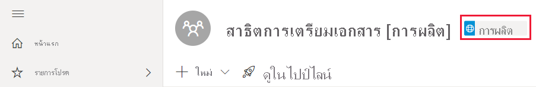

# การแก้ไขปัญหาไปป์ไลน์การปรับใช้Deployment pipelines troubleshooting

ใช้บทความนี้เพื่อแก้ไขปัญหาในไปป์ไลน์การปรับใช้Use this article to troubleshoot issues in deployment pipelines.

## ทั่วไปGeneral

### ไปป์ไลน์การปรับใช้ใน Power BI คืออะไรWhat's deployment pipelines in Power BI?

เมื่อต้องการทำความเข้าใจเกี่ยวกับการปรับใช้ไปป์ไลน์ใน Power BI โปรดดู [ภาพรวมของไปป์ไลน์การปรับใช้](deployment-pipelines-overview.md)To understand what's deployment pipelines in Power BI, refer to the [deployment pipelines overview](deployment-pipelines-overview.md).

### ฉันจะเริ่มต้นอย่างไรกับไปป์ไลน์การปรับใช้How do I get started with deployment pipelines?

เริ่มต้นไปป์ไลน์การปรับใช้โดยใช้ [คำแนะนำเริ่มต้น](deployment-pipelines-get-started.md)Get started with deployment pipelines using the [get started instructions](deployment-pipelines-get-started.md).

### เหตุใดฉันจึงไม่เห็นปุ่มไปป์ไลน์การปรับใช้Why can't I see the deployment pipelines button?

ถ้าไม่เป็นไปตามเงื่อนไขต่อไปนี้คุณจะไม่สามารถดูปุ่มไปป์ไลน์การปรับใช้ได้If the following conditions are not met, you'll not be able to see the deployment pipelines button.

* คุณมีสิทธิการใช้งาน Premium ต่อไปนี้หนึ่งรายการ:You have one of the following Premium licenses:

    * คุณเป็นผู้ใช้ Power BI แบบ [Pro](../admin/service-admin-purchasing-power-bi-pro.md) และคุณเป็นสมาชิกขององค์กรที่มีความจุแบบ PremiumYou're a Power BI [Pro user](../admin/service-admin-purchasing-power-bi-pro.md), and you belong to an organization that has Premium capacity.

    * [Premium Per User (PPU)](../admin/service-premium-per-user-faq.md)[Premium Per User (PPU)](../admin/service-premium-per-user-faq.md).

* คุณเป็นผู้ดูแลระบบของ[ประสบการณ์ในพื้นที่ทำงานใหม่](../collaborate-share/service-create-the-new-workspaces.md)You're an admin of a [new workspace experience](../collaborate-share/service-create-the-new-workspaces.md).

### เหตุใดฉันจึงไม่เห็นแท็กขั้นตอนไปป์ไลน์ในพื้นที่ทำงานของฉันWhy can't I see the pipeline stage tag in my workspace?

ไปป์ไลน์การปรับใช้จะแสดงแท็กขั้นตอนไปป์ไลน์ในพื้นที่ทำงานที่กำหนดให้กับไปป์ไลน์Deployment pipelines displays a pipeline stage tag in workspaces that are assigned to a pipeline. แท็กสำหรับขั้นตอน *การพัฒนา* และ *การทดสอบ* จะมองเห็นได้เสมอTags for the *Development* and *Test* stages are always visible. อย่างไรก็ตาม คุณจะเห็นแท็ก *การผลิต* เท่านั้นถ้าคุณมี [สิทธิ์ในการเข้าถึงไปป์ไลน์](deployment-pipelines-process.md#user-with-pipeline-access) หรือถ้าคุณเป็น [ผู้ดูแลระบบพื้นที่ทำงาน](deployment-pipelines-process.md#workspace-admin)However, you'll only see the *Production* tag if you have [access to the pipeline](deployment-pipelines-process.md#user-with-pipeline-access) or if you're a [workspace admin](deployment-pipelines-process.md#workspace-admin).

> [!div class="mx-imgBorder"]
> 

## สิทธิ์การใช้งานLicensing

### สิทธิ์การใช้งานใดที่จำเป็นในการดำเนินการไปป์ไลน์การปรับใช้What licenses are needed to work with deployment pipelines?

หากต้องการใช้ไปป์ไลน์การปรับใช้ คุณจำเป็นต้องมีสิทธิการใช้งานใดสิทธิการใช้งานหนึ่งต่อไปนี้:To use deployment pipelines, you need to have one of the following licenses:

* สิทธิการใช้งานของ[ผู้ใช้ Pro](../admin/service-admin-purchasing-power-bi-pro.md) ที่มีพื้นที่ทำงานที่อยู่บน[ความจุรแบบ Premium](../admin/service-premium-what-is.md)A [Pro user](../admin/service-admin-purchasing-power-bi-pro.md) license, with a workspace that resides on a [Premium capacity](../admin/service-premium-what-is.md).

* [Premium Per User (PPU)](../admin/service-premium-per-user-faq.md)[Premium Per User (PPU)](../admin/service-premium-per-user-faq.md).

สำหรับข้อมูลเพิ่มเติม ดู [การเข้าถึงไปป์ไลน์การปรับใช้](deployment-pipelines-get-started.md#accessing-deployment-pipelines)For more information, see [accessing deployment pipelines](deployment-pipelines-get-started.md#accessing-deployment-pipelines).

### ฉันสามารถกำหนดความจุชนิดใดให้กับพื้นที่ทำงานในไปป์ไลน์ได้What type of capacity can I assign to a workspace in a pipeline?

พื้นที่ทำงานทั้งหมดในขั้นตอนการปรับใช้จะต้องอยู่ภายในความจุสำหรับไปป์ไลน์เพื่อให้สามารถใช้ได้All workspaces in a deployment pipeline must reside within a capacity for the pipeline to be functional. อย่างไรก็ตามคุณสามารถใช้ความจุที่แตกต่างกันสำหรับพื้นที่ทำงานที่แตกต่างกันในไปป์ไลน์However, you can use different capacities for different workspaces in a pipeline. คุณยังสามารถใช้ชนิดความจุที่แตกต่างกันสำหรับพื้นที่ทำงานที่แตกต่างกันในไปป์ไลน์เดียวกันได้You can also use different capacity types for different workspaces in the same pipeline.

สำหรับการพัฒนาและการทดสอบ คุณสามารถใช้ความจุ A หรือ EM ควบคู่ไปกับบัญชี Pro Power BI สำหรับผู้ใช้แต่ละรายFor development and testing, you can use A or EM capacity alongside a Pro Power BI account for each user. คุณยังสามารถใช้ PPU สำหรับผู้ใช้แต่ละรายในขั้นตอนการพัฒนาและการทดสอบได้อีกด้วยYou can also use a PPU for each user in the development and test stages.

สำหรับพื้นที่ทำงานการผลิต คุณต้องมีความจุ PFor production workspaces, you need a P capacity. ถ้าคุณเป็น ISV แจกจ่ายเนื้อหาผ่านแอปพลิเคชันแบบฝังตัวคุณยังสามารถใช้ความจุ A หรือ EM สำหรับการผลิตได้If you're an ISV distributing content through embedded applications, you can also use A or EM capacities for production. นอกจากนี้ PPUs ยังสามารถใช้สำหรับพื้นที่ทำงานการผลิตPPUs can also be used for production workspaces.

>[!NOTE]
>เมื่อคุณสร้างพื้นที่ทำงานด้วย PPU เฉพาะผู้ใช้ PPU รายอื่นเท่านั้นที่จะสามารถเข้าถึงพื้นที่ทำงานและใช้เนื้อหาได้When you create a workspace with a PPU, only other PPU users will be able to access the workspace and consume its content.

## ทางเทคนิคTechnical

### เหตุใดฉันจึงไม่สามารถดูพื้นที่ทำงานของฉันทั้งหมดได้เมื่อฉันพยายามกำหนดพื้นที่ทำงานให้กับไปป์ไลน์Why can't I see all my workspaces when I try to assign a workspace to a pipeline?

เมื่อต้องการกำหนดพื้นที่ทำงานให้กับไปป์ไลน์ต้องเป็นไปตามเงื่อนไขต่อไปนี้:To assign a workspace to a pipeline, the following conditions must be met:

* พื้นที่ทำงานเป็น [ประสบการณ์พื้นที่ทำงานใหม่](../collaborate-share/service-create-the-new-workspaces.md)The workspace is a [new workspace experience](../collaborate-share/service-create-the-new-workspaces.md)

* คุณเป็นผู้ดูแลระบบของพื้นที่ทำงานYou're an admin of the workspace

* พื้นที่ทำงานไม่ได้ถูกกำหนดให้กับไปป์ไลน์อื่นThe workspace is not assigned to any other pipeline

* พื้นที่ทำงานอยู่บน [ความจุแบบพรีเมียม](../admin/service-premium-what-is.md)The workspace resides on a [premium capacity](../admin/service-premium-what-is.md)

พื้นที่ทำงานที่ไม่เป็นไปตามเงื่อนไขเหล่านี้จะไม่แสดงในรายการของพื้นที่ทำงานที่คุณสามารถเลือกได้Workspaces that don't meet these conditions, are not displayed in the list of workspaces you can select from.

### ฉันสามารถกำหนดพื้นที่ทำงานให้กับขั้นตอนทั้งหมดในไปป์ไลน์ได้อย่างไรHow can I assign workspaces to all the stages in a pipeline?

คุณสามารถกำหนดพื้นที่ทำงานได้หนึ่งรายการต่อไปป์ไลน์You can assign one workspace per pipeline. เมื่อพื้นที่ทำงานถูกกำหนดให้กับไปป์ไลน์คุณสามารถปรับใช้กับขั้นตอนไปป์ไลน์ถัดไปได้Once a workspace is assigned to a pipeline, you can deploy it to the next pipeline stages. ในระหว่างการปรับใช้ครั้งแรก พื้นที่ทำงานใหม่จะถูกสร้างขึ้นด้วยสำเนาของรายการในขั้นตอนต้นทางDuring first-time deployment, a new workspace is created with copies of the items in the source stage. ความสัมพันธ์ของรายการที่คัดลอกจะถูกเก็บไว้The relationships of the copied items are kept. สำหรับข้อมูลเพิ่มเติม ดูวิธีการ [กำหนดพื้นที่ทำงานให้กับไปป์ไลน์การปรับใช้](deployment-pipelines-get-started.md#step-2---assign-a-workspace-to-a-deployment-pipeline)For more information, see how to [assign a workspace to a deployment pipeline](deployment-pipelines-get-started.md#step-2---assign-a-workspace-to-a-deployment-pipeline).

### เหตุใดการปรับใช้ครั้งแรกของฉันจึงล้มเหลวWhy did my first deployment fail?

การปรับใช้ครั้งแรกของคุณอาจล้มเหลวเนื่องจากมีเหตุผลหลายประการYour first deployment may have failed due to a number of reasons. บางสาเหตุเหล่านี้จะแสดงอยู่ในตารางด้านล่างSome of these reasons are listed in the table below.

|ข้อผิดพลาดError  |การดำเนินการAction  |
|---------|---------|
|คุณไม่มี [สิทธิ์ความจุแบบพรีเมียม](deployment-pipelines-process.md#creating-a-premium-capacity-workspace)You don't have [premium capacity permissions](deployment-pipelines-process.md#creating-a-premium-capacity-workspace).     |หากคุณทำงานในองค์กรที่มีความจุแบบ Premium คุณสามารถขอให้ผู้ดูแลความจุเพิ่มพื้นที่ทำงานของคุณไปยังความจุ หรือขอสิทธิ์ในการกำหนดสำหรับความจุIf you work in an organization that has a Premium capacity, ask a capacity admin to add your workspace to a capacity, or ask for assignment permissions for the capacity. หลังจากที่พื้นที่ทำงานอยู่ในความจุให้ปรับใช้ใหม่After the workspace is in a capacity, redeploy.  ถ้าคุณไม่ได้ทำงานในองค์กรที่มีความจุแบบ Premium ให้พิจารณาซื้อ [Premium Per User (PPU)](../admin/service-premium-per-user-faq.md)If you don't work in an organization with Premium capacity, consider purchasing [Premium Per User (PPU)](../admin/service-premium-per-user-faq.md).        |
|คุณไม่มีสิทธิ์ในพื้นที่ทำงานYou don't have workspace permissions.     |หากต้องการปรับใช้ คุณจะต้องเป็นสมาชิกพื้นที่ทำงานTo deploy, you need to be a workspace member. ขอให้ผู้ดูแลระบบพื้นที่ทำงานของคุณมอบสิทธิ์ที่เหมาะสมให้แก่คุณAsk your workspace admin to grant you the appropriate permissions.         |
|ผู้ดูแลระบบ Power BI ของคุณได้ปิดใช้งานการสร้างพื้นที่ทำงานYour Power BI admin disabled the creation of workspaces.     |ติดต่อผู้ดูแลระบบ Power BI ของคุณเพื่อขอรับการสนับสนุนContact your Power BI admin for support.         |
|พื้นที่ทำงานของคุณไม่เป็น [ประสบการณ์พื้นที่ทำงานใหม่](../collaborate-share/service-create-the-new-workspaces.md)Your workspace isn't a [new workspace experience](../collaborate-share/service-create-the-new-workspaces.md).     |สร้างเนื้อหาของคุณในประสบการณ์พื้นที่ทำงานใหม่Create your content in the new workspace experience. ถ้าคุณมีเนื้อหาในพื้นที่ทำงานคลาสสิกคุณสามารถ [อัปเกรด](../collaborate-share/service-upgrade-workspaces.md) ไปยังประสบการณ์พื้นที่ทำงานใหม่If you have content in a classic workspace, you can [upgrade](../collaborate-share/service-upgrade-workspaces.md) it to a new workspace experience.         |
|คุณกำลังใช้ [การปรับใช้แบบเลือก](deployment-pipelines-get-started.md#selective-deployment) และไม่ได้เลือกชุดข้อมูลของเนื้อหาของคุณYou're using [selective deployment](deployment-pipelines-get-started.md#selective-deployment) and are not selecting your content's dataset.     |ทำรายการใดรายการหนึ่งต่อไปนี้:Do one of the following:   ยกเลิกการเลือกเนื้อหาที่เชื่อมโยงกับชุดข้อมูลของคุณUnselect the content that is linked to your dataset. เนื้อหาที่ไม่ได้เลือกของคุณ (เช่นรายงานหรือแดชบอร์ด) จะไม่ถูกคัดลอกไปยังขั้นตอนต่อไปYour unselected content (such as reports or dashboards) will not be copied to the next stage.   เลือกชุดข้อมูลที่เชื่อมโยงกับเนื้อหาที่เลือกSelect the dataset that's linked to the selected content. ชุดข้อมูลของคุณจะถูกคัดลอกไปยังขั้นตอนถัดไปYour dataset will be copied to the next stage.         |

### ฉันได้รับคำเตือนว่าฉันมี 'วัตถุที่ไม่ได้รับการรองรับ' ในพื้นที่ทำงานของฉันเมื่อฉันพยายามปรับใช้I'm getting a warning that I have 'unsupported artifacts' in my workspace when I'm trying to deploy. ฉันจะทราบได้อย่างไรว่าวัตถุใดที่ไม่ได้รับการรองรับHow can I know which artifacts are not supported?

สำหรับรายการที่ครอบคลุมของรายการและวัตถุที่ไม่ได้รับการรองรับในไปป์ไลน์การปรับใช้ดูส่วนต่อไปนี้:For a comprehensive list of items and artifacts that are not supported in deployment pipelines, see the following sections:

* [รายการที่ไม่รองรับUnsupported items](deployment-pipelines-process.md#unsupported-items)

* [คุณสมบัติรายการที่ไม่ได้คัดลอกItem properties that are not copied](deployment-pipelines-process.md#item-properties-that-are-not-copied)

### ทำไมการปรับใช้ของฉันล้มเหลวเนื่องจากกฎที่เสียหายWhy did my deployment fail due to broken rules?

ถ้าคุณมีปัญหาในการกำหนดค่ากฎของชุดข้อมูลให้เยี่ยมชม [กฎชุดข้อมูล](deployment-pipelines-get-started.md#step-4---create-dataset-rules)และตรวจสอบให้แน่ใจว่าคุณได้ทำตาม [ข้อจำกัดของกฎชุดข้อมูล](deployment-pipelines-get-started.md#dataset-rule-limitations)If you have problems configuring dataset rules, visit [dataset rules](deployment-pipelines-get-started.md#step-4---create-dataset-rules), and make sure you follow the [dataset rule limitations](deployment-pipelines-get-started.md#dataset-rule-limitations).

ถ้าการปรับใช้ของคุณได้รับการดำเนินการสำเร็จก่อนหน้านี้และไม่สามารถทำงานกับกฎที่เสียหายแบบฉับพลันได้ อาจเกิดจากชุดข้อมูลถูกเผยแพร่ใหม่If your deployment was previously successful, and is suddenly failing with broken rules, it may be due to a dataset being republished. การเปลี่ยนแปลงต่อไปนี้ไปยังชุดข้อมูลต้นทางให้ผลลัพธ์ในการปรับใช้ล้มเหลว:The following changes to the source dataset, result in a failed deployment:

**กฎพารามิเตอร์****Parameter rules**

* พารามิเตอร์ที่ถูกเอาออกA removed parameter

* ชื่อพารามิเตอร์ที่มีการเปลี่ยนแปลงA changed parameter name

**กฎของแหล่งข้อมูล****Data source rules**

กฎชุดข้อมูลของคุณมีค่าที่ขาดหายไปYour dataset rules are missing values. ซึ่งอาจเกิดขึ้นหากมีการเปลี่ยนแปลงชุดข้อมูลของคุณThis may have happened if your dataset changed.

เมื่อการปรับใช้ที่สำเร็จก่อนหน้านี้ล้มเหลวเนื่องจากลิงก์ที่เสียหาย คำเตือนจะปรากฏขึ้นWhen a previously successful deployment fails due to broken links, a warning is displayed. คุณสามารถเลือก **กำหนดค่ากฎ** เพื่อนำทางไปยังแผงการตั้งค่าการปรับใช้ที่มีการทำเครื่องหมายชุดข้อมูลที่ล้มเหลวYou can select **Configure rules** to navigate to the deployment settings pane, where the failed dataset is marked. เมื่อคุณเลือกชุดข้อมูล กฎที่ถูกฝ่าฝืนจะถูกทำเครื่องหมายWhen you select the dataset, the broken rules are marked.

เมื่อต้องการปรับใช้สำเร็จ ให้แก้ไขหรือลบกฎที่เสียหายและปรับใช้ใหม่To deploy successfully, fix or remove the broken rules, and redeploy.

### ฉันจะเปลี่ยนแหล่งข้อมูลในขั้นตอนไปป์ไลน์ได้อย่างไรHow can I change the data source in the pipeline stages?

คุณไม่สามารถเปลี่ยนการเชื่อมต่อแหล่งข้อมูลในบริการของ Power BIYou can’t change the data source connection in Power BI service.

ถ้าคุณต้องการเปลี่ยนแหล่งข้อมูลในขั้นตอนการทดสอบหรือการผลิตคุณสามารถใช้ [กฎชุดข้อมูล](deployment-pipelines-get-started.md#step-4---create-dataset-rules) หรือ [Api](/rest/api/power-bi/datasets/updateparametersingroup)If you want to change the data source in the test or production stages, you can use [dataset rules](deployment-pipelines-get-started.md#step-4---create-dataset-rules) or [APIs](/rest/api/power-bi/datasets/updateparametersingroup). กฎชุดข้อมูลจะมีผลหลังจากการปรับใช้ครั้งถัดไปเท่านั้นDataset rules will only come into effect after the next deployment.

### ฉันแก้ไขบักในการผลิตแล้ว แต่ตอนนี้ฉันไม่สามารถเลือกปุ่ม "ปรับใช้กับขั้นตอนก่อนหน้า"I fixed a bug in production, but now I can't select the 'deploy to previous stage' button. เหตุใดจึงเป็นสีเทาWhy is it greyed out?

คุณสามารถปรับใช้งานย้อนกลับไปยังขั้นตอนที่ว่างเปล่าได้เท่านั้นYou can only deploy backwards to an empty stage. ถ้าคุณมีเนื้อหาในขั้นตอนการทดสอบคุณจะไม่สามารถปรับใช้งานย้อนหลังจากการผลิตได้If you have content in the test stage, you will not be able to deploy backwards from production.

หลังจากสร้างไปป์ไลน์ให้ใช้ขั้นตอนการพัฒนาเพื่อพัฒนาเนื้อหาของคุณและขั้นตอนการทดสอบเพื่อตรวจทานและทดสอบAfter creating the pipeline, use the development stage to develop your content, and the test stages to review and test it. คุณสามารถแก้ไขบักในขั้นตอนเหล่านี้และจากนั้นปรับใช้สภาพแวดล้อมแบบคงที่ไปยังขั้นตอนการผลิตYou can fix bugs in these stages, and then deploy the fixed environment to the production stage.

>[!NOTE]
>การปรับใช้ย้อนหลังรองรับเฉพาะ [การปรับใช้เต็มรูปแบบ](deployment-pipelines-get-started.md#deploying-all-content) เท่านั้นBackwards deployment only supports [full deployment](deployment-pipelines-get-started.md#deploying-all-content). ไม่รองรับ [การปรับใช้ที่เลือก](deployment-pipelines-get-started.md#selective-deployment)It doesn't support [selective deployment](deployment-pipelines-get-started.md#selective-deployment)

### ไปป์ไลน์การปรับใช้รองรับหลายพรมแดนหรือไม่?Does deployment pipelines support multi-geo?

รองรับหลายพรมแดนMulti-geo is supported. ซึ่งอาจใช้เวลานานในการปรับใช้เนื้อหาระหว่างขั้นตอนในพรมแดนแตกต่างกันIt may take longer to deploy content between stages in different geos.

## การอนุญาตPermissions

### แบบจำลองสิทธิ์ของไปป์ไลน์การปรับใช้คืออะไรWhat is the deployment pipelines permissions model?

แบบจำลองสิทธิ์ของไปป์ไลน์การปรับใช้ได้รับการอธิบายไว้ในส่วน [สิทธิ์](deployment-pipelines-process.md#permissions)The deployment pipelines permissions model is described the [permissions](deployment-pipelines-process.md#permissions) section.

### ใครสามารถปรับใช้เนื้อหาระหว่างขั้นตอนได้Who can deploy content between stages?

สามารถปรับใช้เนื้อหาไปยังขั้นตอนที่ว่างเปล่าหรือไปยังขั้นตอนที่มีเนื้อหาได้Content can be deployed to an empty stage or to a stage that contains content. เนื้อหาต้องอยู่ใน [ความจุแบบพรีเมียม](../admin/service-premium-what-is.md)The content must reside on a [premium capacity](../admin/service-premium-what-is.md).

* **การปรับใช้งานไปยังขั้นตอนที่ว่างเปล่า** - [ผู้ใช้ Pro](../admin/service-admin-purchasing-power-bi-pro.md) หรือ [PPU](../admin/service-premium-per-user-faq.md) ใดก็ตามที่เป็นสมาชิกหรือผู้ดูแลระบบในพื้นที่ทำงานต้นทาง**Deploying to an empty stage** - Any [Pro](../admin/service-admin-purchasing-power-bi-pro.md) or [PPU](../admin/service-premium-per-user-faq.md) user, that's a member or admin in the source workspace.

* **ปรับใช้กับขั้นตอนที่มีเนื้อหา** - [ผู้ใช้ Pro](../admin/service-admin-purchasing-power-bi-pro.md) หรือ [PPU](../admin/service-premium-per-user-faq.md) ใดก็ตามที่เป็นสมาชิกหรือผู้ดูแลระบบของทั้งสองพื้นที่ทำงานในขั้นตอนปรับใช้แหล่งที่มาและเป้าหมาย**Deploying to a stage with content** - Any [Pro](../admin/service-admin-purchasing-power-bi-pro.md) or [PPU](../admin/service-premium-per-user-faq.md) user, who's a member or admin of both workspaces in the source and target deployment stages.

* **การแทนที่ชุดข้อมูล** - การปรับใช้แทนที่แต่ละชุดข้อมูลที่รวมอยู่ในขั้นตอนเป้าหมายแม้ว่าจะไม่มีการเปลี่ยนแปลงชุดข้อมูล**Overriding a dataset** - Deployment overrides each dataset that is included in the target stage, even if the dataset wasn't changed. ผู้ใช้ต้องเป็นเจ้าของชุดข้อมูลในขั้นตอนเป้าหมายทั้งหมดที่ระบุในการปรับใช้The user must be the owner of all the target stage datasets specified in the deployment.

### ฉันจำเป็นต้องใช้สิทธิ์ใดในการกำหนดค่ากฎชุดข้อมูลWhich permissions do I need to configure dataset rules?

ในการกำหนดค่ากฎชุดข้อมูลในไปป์ไลน์การปรับใช้คุณต้องเป็นเจ้าของชุดข้อมูลTo configure dataset rules in deployment pipelines, you must be the dataset owner.

### เหตุใดฉันจึงไม่เห็นพื้นที่ทำงานในไปป์ไลน์Why can't I see workspaces in the pipeline?

สิทธิ์ของไปป์ไลน์และพื้นที่ทำงานได้รับการจัดการแยกกันPipeline and workspace permissions are managed separately. คุณอาจมีสิทธิ์ในการใช้งานไปป์ไลน์ แต่ไม่สามารถใช้สิทธิ์ในพื้นที่ทำงานได้You may have pipeline permissions, but not workspace permissions. สำหรับข้อมูลเพิ่มเติมให้ตรวจทานส่วน [สิทธิ์](deployment-pipelines-process.md#permissions)For more information, review the [permissions](deployment-pipelines-process.md#permissions) section.

## ขั้นตอนถัดไปNext steps

>[!div class="nextstepaction"]
>[บทนำไปป์ไลน์การปรับใช้Introduction to deployment pipelines](deployment-pipelines-overview.md)

>[!div class="nextstepaction"]
>[เริ่มต้นกับไปป์ไลน์การปรับใช้Get started with deployment pipelines](deployment-pipelines-get-started.md)

>[!div class="nextstepaction"]
>[ทำความเข้าใจกระบวนการไปป์ไลน์การปรับใช้Understand the deployment pipelines process](deployment-pipelines-process.md)

>[!div class="nextstepaction"]
>[แนวทางปฏิบัติที่ดีที่สุดสำหรับไปป์ไลน์การปรับใช้Deployment pipelines best practices](deployment-pipelines-best-practices.md)