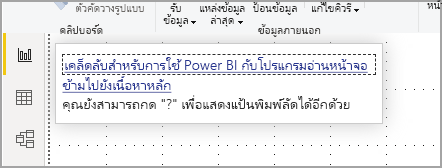
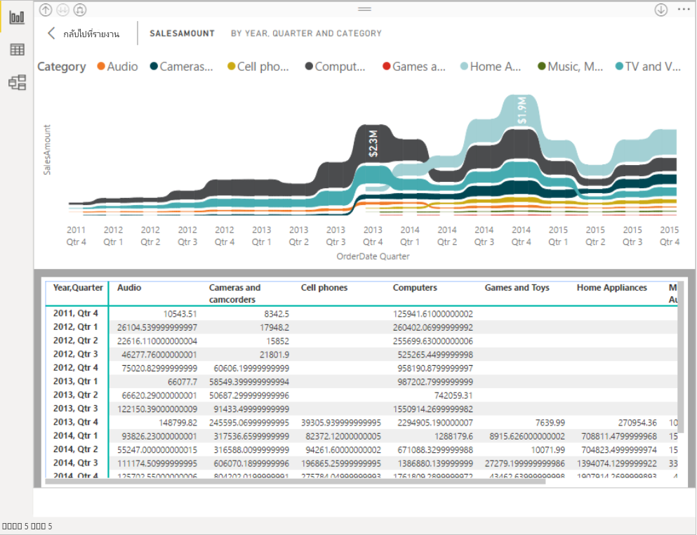

# ใช้รายงาน Power BI ด้วยคุณลักษณะการเข้าถึงConsume Power BI reports by using accessibility features
Power BI มีคุณลักษณะที่อยู่ภายในจำนวนมากที่ช่วยให้ผู้ทุพพลภาพสามารถใช้ และโต้ตอบกับรายงาน Power BI ได้อย่างง่ายขึ้นPower BI has many built-in features to help people with disabilities more easily consume and interact with Power BI reports. เครื่องมือเหล่านี้ช่วยให้ผู้ใช้ได้รับข้อมูลเดียวกันจากรายงานเหมือนกับผู้ที่ไม่ได้ใช้เทคโนโลยีช่วยเหลือThese tools help users get the same information from a report as those who don’t use assistive technology.

มีสองสามคำที่ต้องทราบเมื่อคุณอ่านบทความนี้:There are a couple terms to know as you read through this article:

* **โฟกัส** คือตำแหน่งที่เมาส์ของคุณวางอยู่บนหน้า**Focus** is where your mouse is on the page. โดยปกติแล้ว โฟกัสจะถูกระบุด้วยเส้นขอบสีน้ำเงินรอบออบเจ็กต์Focus is usually indicated by a blue border surrounding an object.
* **พื้นที่ทำงาน** คือพื้นที่ในหน้ารายงานของคุณ**Canvas** is the page area of your report.

ส่วนต่อไปนี้อธิบายถึงเครื่องมือช่วยสำหรับการเข้าถึงที่สามารถใช้ได้สำหรับการใช้รายงาน Power BIThe following sections describe the accessibility tools available for consuming Power BI reports.

## การนำทางของแป้นพิมพ์Keyboard navigation

เมื่อคุณเปิดใช้งาน Power BI Desktop หรือบริการของ Power BI ทันทีที่คุณกด **Tab** คำแนะนำเครื่องมือจะปรากฏขึ้นที่มุมด้านขวาบนWhen you launch Power BI Desktop or the Power BI service, as soon as you press **Tab**, a tooltip appears in the upper-right hand corner. ลิงก์ที่ชื่อว่า **เคล็ดลับสำหรับการใช้ Power BI กับโปรแกรมอ่านหน้าจอ** จะนำคุณไปยังบทความนี้ ซึ่งให้ข้อมูลเกี่ยวกับวิธีการใช้รายงานด้วยเครื่องมือช่วยสำหรับการเข้าถึงThe link titled **Tips for using Power BI with a screen reader** directs you to this article, providing information on how to consume a report with accessibility tools. การคลิกที่ลิงก์ **ข้ามไปยังเนื้อหาหลัก** จะนำคุณไปยังพื้นที่รายงานClicking on the **Skip to main content** link takes you to the report canvas.

กดปุ่ม **?**Pressing **?** เปิดกล่องโต้ตอบด้วยแป้นพิมพ์ลัดที่ใช้บ่อยที่สุดใน Power BIopens a dialog with the most frequently used keyboard shortcuts in Power BI. หากต้องการดูรายการแป้นพิมพ์ลัดทั้งหมดที่มีอยู่ใน Power BI คุณสามารถไปที่ลิงก์ด้านล่างของกล่องโต้ตอบ ซึ่งจะนำคุณไปยังเอกสารคู่มือ Power BI เกี่ยวกับ [แป้นพิมพ์ลัด](desktop-accessibility-keyboard-shortcuts.md)To see a full list of keyboard shortcuts available in Power BI, you can navigate to the link at the bottom of the dialog, which takes you to the Power BI  documentation on [keyboard shortcuts](desktop-accessibility-keyboard-shortcuts.md).

คุณสามารถสลับโฟกัสระหว่างแท็บหน้ารายงาน หรือออบเจ็กต์บนหน้ารายงานที่กำหนดไว้โดยใช้ **Ctrl+F6** ได้You can switch focus between the report page tabs, or objects on a given report page using **Ctrl + F6**. เมื่อโฟกัสอยู่บนหน้ารายงานที่โหลด ใช้แป้น **แท็บ** เพื่อเลื่อนโฟกัสไปยังแต่ละวัตถุบนหน้า ซึ่งรวมถึงกล่องข้อความ รูปภาพ รูปร่าง และแผนภูมิทั้งหมดWhen focus is on a loaded report page, use the **Tab** key to shift focus to each object on the page, which includes all textboxes, images, shapes, and charts. 

โดยทั่วไปแล้ว การใช้ **Enter** เพื่อเลือกหรือเข้า และการใช้ **Esc** เพื่อออกจากเป็นคำสั่งทั่วไปใน Power BIIn general, using **Enter** to select or enter, and using **Esc** to exit are common commands in Power BI.

### การนำทางแป้นพิมพ์สำหรับวิชวลKeyboard navigation for visuals

ผู้สร้างรายงาน Power BI หลายรายมีการจัดทำรายงานที่ประกอบด้วยข้อมูลจำนวนมากMany Power BI report creators are building reports that contain a lot of data. ในขณะที่คุณย้ายผ่านวิชวล การดำเนินการนี้อาจสร้างความน่ารำคาญให้กับแท็บในทุกองค์ประกอบของวิชวลได้As you move through a visual, it can be annoying to tab through every element in a visual. การนำทางแป้นพิมพ์สำหรับวิชวลได้รับการออกแบบให้เป็นลำดับชั้น ที่มีสามระดับKeyboard navigation for visuals has been designed as a hierarchy, with three levels. เราจะอธิบายรายละเอียดเกี่ยวกับระดับทั้งสามในย่อหน้าต่อไปนี้Those three levels are described in the following paragraphs.

เมื่อต้องการนำทางผ่านระดับแรกเมื่อคุณนำทางไปยังวิชวล ให้กด **Ctrl + ลูกศรขวา** เพื่อเข้าสู่วิชวลนั้นTo navigate through the first level, when you navigate to a visual press **Ctrl + right arrow** to enter that visual. เมื่อคุณเข้าไปยังวิชวลนั้นแล้ว คุณสามารถกด **Tab** เพื่อวนรอบผ่านส่วนหลักของวิชวลได้Once you enter that visual, you can press **Tab** to cycle through the main areas of the visual. พื้นที่หลักเหล่านั้นที่คุณสามารถวนรอบได้คือพื้นที่การลงจุดข้อมูล หมวดหมู่แกน (หากใช้กับวิชวล) และคำอธิบายแผนภูมิ (หากมีหนึ่งชวล)Those main areas you can cycle through are the data plot area, the axis categories (if applicable to the visual), and the legend (if the visual has one).

ภาพเคลื่อนไหว .gif ต่อไปนี้แสดงวิธีการที่ผู้ใช้วนรอบผ่านระดับแรกของวิชวล:The following .gif shows how a user cycles through the first level of a visual:

ระดับที่สองของลำดับชั้นคือการเข้าสู่หนึ่งในพื้นที่หลัก (พื้นที่การลงจุดข้อมูล หมวดหมู่แกน x คำอธิบายแผนภูมิ) ของวิชวลThe second level of the hierarchy is entering one of the main areas (data plot area, x-axis categories, legend) of the visual. เมื่อคุณใช้รายงาน คุณสามารถย้ายเข้าไปยังหนึ่งในพื้นที่หลักเหล่านี้ได้ และวนรอบผ่านจุดข้อมูลหรือหมวดหมู่ในส่วนนั้นของวิชวลAs you consume a report, you can move into one of these main areas and cycle through the data points or categories in that section of the visual. เมื่อคุณตัดสินใจว่าพื้นที่ใดที่คุณต้องการสำรวจเพิ่มเติม คุณสามารถกด **Enter** เพื่อวนรอบผ่านพื้นที่เฉพาะนั้นได้Once you decide which area you’d like to explore further, you can press **Enter** to cycle through that specific area.

หากคุณต้องการเลือกจุดข้อมูลทั้งหมดในซีรีส์ ให้นำทางไปยังคำอธิบายแผนภูมิและกด **Enter**If you’d like to select all the data points in a series, navigate to the legend and press **Enter**. เมื่ออยู่ในคำอธิบายแผนภูมิแล้ว คุณสามารถกด **Tab** เพื่อนำทางไปยังหมวดหมู่ที่แตกต่างกันในคำอธิบายแผนภูมิได้Once in the legend, you can press **Tab** to navigate through the different categories in the legend. กด **Enter** เพื่อเลือกซีรีส์ข้อมูลที่ระบุPress **Enter** to select a specific series.

หากคุณต้องการเลือกจุดข้อมูลเฉพาะเจาะจง ให้นำทางไปยังพื้นที่การลงจุดข้อมูลและกด **Enter**If you’d like to select specific data points, navigate to the data plot area and press **Enter**. เมื่ออยู่ในพื้นที่การลงจุดข้อมูล คุณสามารถกด **Tab** เพื่อนำทางผ่านจุดข้อมูลเหล่านั้นได้Once in the data plot area you can press **Tab** to navigate through the data points. ถ้าวิชวลของคุณมีซีรีส์หลายชุด คุณสามารถกด **ลูกศรขึ้น** หรือ **ลูกศรลง** เพื่อข้ามไปยังจุดข้อมูลในซีรีส์ที่แตกต่างกันได้If your visual has multiple series, you can press the **Up arrow** or **Down arrow** to jump to the data points in a different series.

หากคุณต้องการเลือกจุดข้อมูลทั้งหมดในแกนข้อมูลจัดกลุ่ม ให้นำทางไปยังป้ายชื่อแกนและกด **Enter**If you’d like to select all the data points in a categorical axis, navigate to the axis labels and press **Enter**. เมื่ออยู่ในป้ายชื่อแกน คุณสามารถกด **Tab** เพื่อนำทางผ่านชื่อของป้ายชื่อนั้นได้Once in the axis labels, you can press **Tab** to navigate through the label names. กด **Enter** เพื่อเลือกชื่อของป้ายชื่อPress **Enter** to select a label name.

หากคุณสำรวจไปยังเลเยอร์แล้ว คุณสามารถกด **Esc** เพื่อออกมาจากเลเยอร์นั้นได้If you’ve navigated into a layer, you can press **Esc** to come out of that layer. ภาพเคลื่อนไหว .gif ต่อไปนี้แสดงวิธีที่ผู้ใช้สามารถเข้าและออกจากระดับของวิชวล และเลือกจุดข้อมูล ป้ายชื่อประเภทแกน x ข้ามไปยังซีรีส์อื่น และเลือกจุดข้อมูลทั้งหมดในซีรีส์The following .gif shows how a user can enter and exit the levels of a visual and select data points, x-axis category labels, jump to a different series, and select all the data points in a series.

ถ้าคุณพบว่าตัวเองไม่สามารถนำทางไปยังออบเจ็กต์หรือวิชวลได้ในขณะที่ใช้แป้นพิมพ์ อาจเป็นเพราะผู้สร้างรายงานได้ตัดสินใจที่จะซ่อนออบเจ็กต์นั้นจากลำดับแท็บIf you find yourself unable to navigate to an object or visual while using a keyboard, it may be because the report author has decided to hide that object from the tab order. โดยทั่วไปผู้สร้างรายงานจะซ่อนออบเจ็กต์ตกแต่งจากลำดับแท็บReport authors commonly hide decorative objects from the tab order. ถ้าคุณพบว่าคุณไม่สามารถแท็บผ่านรายงานในลักษณะที่เป็นตรรกะได้ คุณควรติดต่อผู้สร้างรายงานIf you find that you cannot tab through a report in a logical manner, you should contact the report author. ผู้สร้างรายงานสามารถตั้งค่าลำดับแท็บสำหรับออบเจ็กต์และวิชวลได้Report authors can set the tab order for objects and visuals.

### การนำทางแป้นพิมพ์สำหรับตัวแบ่งส่วนข้อมูลKeyboard navigation for slicers

ตัวแบ่งส่วนข้อมูลยังมีฟังก์ชันการช่วยสำหรับการเข้าถึงที่มีอยู่แล้วภายในด้วยSlicers also have accessibility functionality built in. เมื่อเลือกตัวแบ่งส่วนข้อมูล หากต้องการปรับค่าของตัวแบ่งส่วนข้อมูล ให้ใช้ **CTRL+ลูกศรขวา** เพื่อเลื่อนผ่านการควบคุมต่าง ๆ ภายในตัวแบ่งส่วนข้อมูลWhen you select a slicer, to adjust the value of a slicer use **Ctrl + Right arrow** to move through the various controls within the slicer. ตัวอย่างเช่น เมื่อคุณเริ่มต้นกด **Ctrl + ลูกศรขวา** โฟกัสจะอยู่ที่ยางลบFor example, when you initially press **Ctrl + Right arrow**, the focus is on the eraser. จากนั้นการกด **spacebar** จะเทียบเท่ากับการคลิกปุ่มยางลบ ซึ่งจะลบค่าทั้งหมดบนตัวแบ่งส่วนข้อมูลThen, pressing the **spacebar** is equivalent to clicking the eraser button, which erases all values on the slicer.

คุณสามารถเลื่อนผ่านการควบคุมต่าง ๆ ในตัวแบ่งส่วนข้อมูลด้วยการกด **Tab** การกด **Tab** เมื่ออยู่ที่ปุ่มยางลบจะย้ายไปที่ปุ่มดรอปดาวน์You can move through the controls in a slicer by pressing **Tab**. Pressing **Tab** when on the eraser moves to the drop-down button. การกดปุ่ม **Tab** อีกครั้งจะย้ายไปที่ค่าตัวแบ่งส่วนข้อมูลแรก (หากมีค่าตัวแบ่งส่วนข้อมูลหลายค่า อย่างเช่น ช่วง)Another **Tab** then moves to the first slicer value (if there are multiple values for the slicer, such as a range).

### การสลับหน้าSwitching pages

เมื่อโฟกัสอยู่บนแท็บหน้ารายงาน ใช้แป้น **แท็บ** หรือ **ลูกศร** เพื่อย้ายโฟกัสจากรายงานหน้าหนึ่งไปอีกหน้าหนึ่งWhen focus is on report page tabs, use the **Tab** or **Arrow** keys to move focus from one report page to the next. โปรแกรมอ่านหน้าจอจะอ่านออกเสียงชื่อของหน้ารายงาน และสถานะการเลือกในปัจจุบันThe screen reader reads out the title of the report page, and whether it's currently selected. หากต้องการโหลดหน้ารายงานที่กำลังโฟกัสในขณะนี้ ใช้แป้น **Enter** หรือ **spacebar**To load the report page currently under focus, use the **Enter** key or **spacebar**.

### การเข้าถึงส่วนหัวของวิชวลAccessing the visual header
ในขณะที่คุณนำทางไปมาระหว่างวิชวล คุณสามารถกด **Alt + Shift + F10** เพื่อย้ายโฟกัสไปยังส่วนหัวของวิชวลได้As you navigate between visuals, you can press **Alt + Shift + F10** to move focus to the visual header. ส่วนหัวของวิชวลประกอบด้วยตัวเลือกต่าง ๆ รวมถึงการเรียงลำดับ การส่งออกข้อมูลที่อยู่เบื้องหลังแผนภูมิและโหมดโฟกัสThe visual header contains various options including sorting, exporting the data behind the chart, and Focus mode. ไอคอนที่คุณเห็นในส่วนหัวของวิชวลจะขึ้นอยู่กับตัวเลือกที่ผู้สร้างรายงานได้ตัดสินใจที่จะแสดงThe icons you see in the visual header will depend on the options the report author has decided to show.

## โปรแกรมอ่านหน้าจอScreen reader

เมื่อดูรายงาน คุณควรออกจากโหมดสแกนซึ่งเป็นวิธีที่ดีที่สุดWhen viewing a report it's best to leave scan mode off. Power BI ควรมีการจัดการมากขึ้นเช่นเดียวกับแอปพลิเคชันและน้อยลงเช่นเดียวกับเอกสาร ดังนั้นจึงได้รับการตั้งค่าด้วยการนำทางแบบกำหนดเองเพื่อให้ง่ายต่อการนำทางPower BI should be treated more like an application and less like a document, so it’s been set up with custom navigation to make it easier to navigate. เมื่อใช้โปรแกรมอ่านหน้าจอกับ Power BI Desktop คุณควรตรวจสอบให้แน่ใจว่าโปรแกรมอ่านหน้าจอของคุณเปิดอยู่ก่อนที่คุณจะเปิด Power BI DesktopWhen using a screen reader with Power BI Desktop, you should also make sure your screen reader is open before you open Power BI Desktop.

เมื่อคุณกำลังสำรวจรอบออบเจ็กต์ โปรแกรมอ่านหน้าจออ่านชนิดของออบเจ็กต์และชื่อของออบเจ็กต์ (ถ้ามี)When navigating around objects, the screen reader reads the type of object and the object's title (if it has one). นอกจากนี้ โปรแกรมอ่านหน้าจอยังอ่านคำอธิบายของออบเจ็กต์นั้น (ข้อความแสดงแทน) ถ้าผู้สร้างรายงานกำหนดไว้The screen reader also reads a description of that object (alt text) if it's provided by the report author.

### แสดงข้อมูลShow data
คุณสามารถกด **Alt+Shift+F11** เพื่อแสดงเวอร์ชันที่สามารถเข้าถึงได้ของหน้าต่าง **แสดงข้อมูล**You can press **Alt + Shift + F11** to present an accessible version of the **Show data** window. หน้าต่างนี้ช่วยให้คุณสำรวจข้อมูลที่ใช้ในภาพในตาราง HTML โดยใช้แป้นพิมพ์ลัดเดียวกันกับที่คุณใช้กับโปรแกรมอ่านหน้าจอของคุณตามปกติThis window lets you explore the data used in the visual in an HTML table, using the same keyboard shortcuts you normally use with your screen reader.

คุณลักษณะ **แสดงข้อมูล** เป็นตาราง HTML ที่เข้าถึงได้เฉพาะโปรแกรมอ่านหน้าจอผ่านแป้นพิมพ์ลัดนี้เท่านั้นThe **Show data** feature is an HTML table that is only accessible to a screen reader through this keyboard shortcut. หากคุณเปิด **แสดงข้อมูล** จากตัวเลือกในส่วนหัวของวิชวล ตารางที่ *ไม่* สามารถเข้ากันได้กับโปรแกรมอ่านหน้าจอจะแสดงขึ้นIf you open **Show data** from the option in the visual header, a table that is *not* screen reader compatible is displayed.  เมื่อใช้ **แสดงข้อมูล** ผ่านแป้นพิมพ์ลัด ให้เปิดโหมดสแกนเพื่อใช้ประโยชน์จากปุ่มลัดทั้งหมดที่โปรแกรมอ่านหน้าจอมีให้When using **Show data** through keyboard shortcuts, turn on scan mode to take advantage of all the hot keys your screen reader provides.

เมื่อต้องการออกจากมุมมอง **แสดงข้อมูล** และกลับไปยังรายงาน ให้กด **Esc**To exit the **Show Data** view and return to a report, press **Esc**.

## โหมดความคมชัดสูงHigh contrast modes

บริการของ Power BI พยายามตรวจหาการตั้งค่าความคมชัดสูงที่เลือกสำหรับ WindowsThe Power BI service attempts to detect the high contrast settings selected for Windows. ประสิทธิภาพและความถูกต้องของการตรวจหาดังกล่าวจะขึ้นอยู่กับเบราว์เซอร์ที่แสดงบริการของ Power BIThe effectiveness and accuracy of that detection depends on the browser showing the Power BI service. ถ้าคุณต้องการตั้งค่าธีมด้วยตนเองในบริการของ Power BI คุณสามารถเลือก **มุมมอง > สีความคมชัดสูง** แล้วเลือกธีมที่คุณต้องการนำไปใช้กับรายงานได้If you want to set the theme manually in the Power BI service, you can select **View > High contrast colors** and then select the theme you would like to apply to the report.

## ขั้นตอนถัดไปNext steps

คอลเลกชันของบทความเกี่ยวกับการช่วยสำหรับการเข้าถึง Power BI มีดังต่อไปนี้:The collection of articles for Power BI accessibility are the following:

* [ภาพรวมของการช่วยสำหรับการเข้าถึงใน Power BIOverview of accessibility in Power BI](desktop-accessibility-overview.md) 
* [การสร้างรายงาน Power BI ที่สามารถเข้าถึงได้Creating accessible Power BI reports](desktop-accessibility-creating-reports.md) 
* [การสร้างรายงาน Power BI ด้วยเครื่องมือช่วยสำหรับการเข้าถึงCreating Power BI reports with accessibility tools](desktop-accessibility-creating-tools.md)
* [แป้นพิมพ์ลัดการช่วยสำหรับการเข้าถึงรายงาน Power BIAccessibility keyboard shortcuts for Power BI reports](desktop-accessibility-keyboard-shortcuts.md)
* [รายการตรวจสอบการช่วยสำหรับการเข้าถึงรายงานReport accessibility checklist](desktop-accessibility-creating-reports.md#report-accessibility-checklist)
