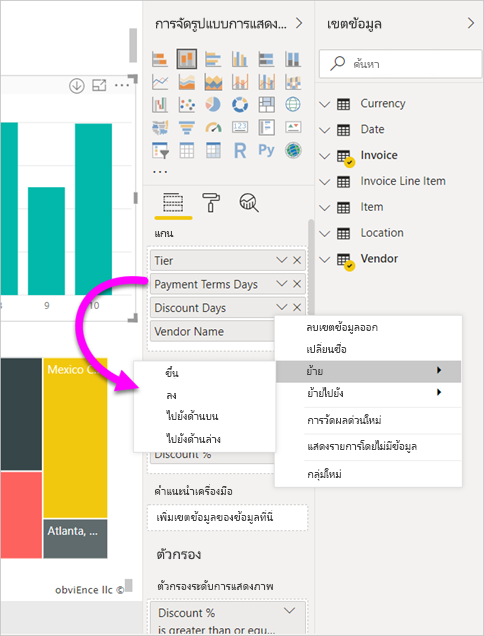

# ออกแบบรายงาน Power BI สำหรับการเข้าถึงDesign Power BI reports for accessibility
คุณสามารถออกแบบและสร้างรายงานที่น่าสนใจได้ในขณะที่ยังมีการออกแบบการช่วยสำหรับการเข้าถึงYou can design and create compelling reports while also designing for accessibility. เมื่อใดก็ตามที่สร้างรายงาน ไม่ว่าผู้ชมของคุณคือใคร คุณควรสร้างรายงานให้สามารถใช้งานได้โดยผู้คนจำนวนมากที่สุดเท่าที่จะเป็นไปได้โดยไม่จำเป็นต้องปรับเปลี่ยนเพื่อการออกแบบพิเศษWhenever building a report, no matter who your audience is, you should create your reports to be usable by as many people as possible, without the need to be adapted for a sort of special design.

บทความนี้อธิบายถึงคุณลักษณะและเครื่องมือการช่วยสำหรับการเข้าถึงสำหรับการสร้างรายงานที่สามารถเข้าถึงได้ใน Power BIThis article describes the accessibility features and tools for creating accessible reports in Power BI.

โดยทั่วไป เมื่อใช้ Power BI กับตัวอ่านหน้าจอ เราแนะนำให้ปิดโหทดสแกนหรือโหมดเรียกดูIn general, when using Power BI with a screen reader, we recommend turning scan mode or browse mode off.

หากต้องการปรับปรุงกระบวนการสร้างรายงานด้วยโปรแกรมอ่านหน้าจอ เมนูบริบทจะพร้อมใช้งานTo improve the process of creating reports with screen readers, a context menu is available. เมนูอนุญาตให้ย้ายเขตข้อมูลในช่องเก็บด้านบนหรือด้านล่างในรายการ **เขตข้อมูล**The menu allows moving fields in the well up or down in the **Fields** list. เมนูยังช่วยให้ย้ายเขตข้อมูลไปยังช่องเก็บอื่นๆ เช่น **คำอธิบายแผนภูมิ** หรือ **ค่า** หรืออื่น ๆThe menu also allows moving the field to other wells, such as **Legend** or **Value** or others.

## ประเภทของคุณลักษณะการช่วยสำหรับการเข้าถึงTypes of accessibility features

Power BI มีความสามารถในการสร้างรายงานที่สามารถเข้าถึงได้ แต่ในฐานะผู้สร้างรายงาน จะขึ้นอยู่กับคุณว่าจะรวมข้อมูลเหล่านั้นในรายงานของคุณหรือไม่Power BI provides capability to create accessible reports, but as the report author, it's up to you to incorporate them in your reports. มีคุณลักษณะการช่วยสำหรับการเข้าถึงสามประเภทที่อธิบายไว้ในบทความนี้:There are three categories of accessibility features described in this article:

* คุณลักษณะการช่วยสำหรับการเข้าถึงที่มีอยู่ภายใน (ไม่จำเป็นต้องกำหนดค่า)Built-in accessibility features (no configuration required)
* คุณลักษณะการช่วยสำหรับการเข้าถึงที่มีอยู่ภายใน (่จำเป็นต้องกำหนดค่า)Built-in accessibility features (requiring configuration)
* คำแนะนำและข้อควรพิจารณาอื่น ๆOther tips and considerations

เราจะกล่าวถึงแต่ละหมวดหมู่เหล่านี้ในส่วนต่อไปนี้We discuss each of these categories in the following sections.

## คุณลักษณะการช่วยสำหรับการเข้าถึงที่มีอยู่ภายในBuilt-in accessibility features

Power BI มีคุณลักษณะการเข้าถึงติดตั้งอยู่ภายในผลิตภัณฑ์ ซึ่งไม่จำเป็นต้องมีการกำหนดค่าใด ๆ จากผู้สร้างรายงานPower BI has accessibility features built into the product, which don't require any configuration from the report author. คุณลักษณะเหล่านี้มีดังต่อไปนี้:These features are the following:

* การนำทางของแป้นพิมพ์Keyboard navigation
* ความเข้ากันได้ของโปรแกรมอ่านหน้าจอScreen-reader compatibility
* มุมมองสีความคมชัดสูงHigh contrast colors view
* โหมดโฟกัสFocus mode
* แสดงตารางข้อมูลShow data table

นอกจากนี้ยังมีคุณลักษณะที่ช่วยให้เกิดประสบการณ์การใช้งานรายงานThere are also features that help with the report consumption experience. บทความที่อธิบายคุณลักษณะเหล่านั้นสามารถพบได้ในส่วน[ขั้นตอนถัดไป](#next-steps)ที่ด้านท้ายของบทความนี้.Articles describing those features can be found in the [Next steps](#next-steps) section, at the end of this article.

ลองมาดูที่คุณลักษณะการช่วยสำหรับการเข้าถึงที่มีอยู่ภายในเหล่านี้แต่ละรายการตามลำดับLet's take a look at each of these built-in accessibility features, in turn. 

### การนำทางของแป้นพิมพ์Keyboard navigation

ในฐานะผู้เขียนรายงาน คุณไม่จำเป็นต้องกังวลว่าผู้ใช้ของคุณจะสามารถใช้แป้นพิมพ์เพื่อนำทางผ่านรายงานได้หรือไม่As a report author, you don't have to worry whether your consumers can use their keyboard to navigate through a report. วิชวล Power BI คือแป้นพิมพ์ทั้งหมดที่สามารถนำทางได้ และผู้ใช้รายงานของคุณสามารถเดินผ่านจุดข้อมูลต่าง ๆ ในวิชวล สลับระหว่างแท็บหน้า และเข้าถึงความสามารถในการโต้ตอบ รวมถึงการไฮไลต์แบบเชื่อมโยง การกรอง และการแบ่งส่วนPower BI visuals are all keyboard navigable and your report consumer can walk through the data points in visuals, switch between page tabs, and have access to interactive capabilities including cross-highlighting, filtering, and slicing.

ในขณะที่เป็นผู้ใช้รายงานนำทางไปรอบ ๆ รายงาน โฟกัสจะแสดงขึ้นเพื่อระบุตำแหน่งที่ผู้ใช้อยู่ในรายงานAs a report consumer navigates around a report, focus shows up to indicate where the user is in the report. ทั้งนี้ขึ้นอยู่กับเบราว์เซอร์ที่ใช้ โหมดโฟกัสอาจปรากฏขึ้นแตกต่างกันDepending on the browser being used, focus mode may appear differently.

หากต้องการเข้าถึงแป้นพิมพ์ลัดที่ใช้บ่อยที่สุด คุณสามารถกด *?*To access the most frequently used keyboard shortcuts, you can press *?* เมื่อต้องการแสดงกล่องโต้ตอบแป้นพิมพ์ลัดto display a keyboard shortcut dialog. หากต้องการเรียนรู้เพิ่มเติม ดูบทความเหล่านี้เกี่ยวกับประสบการณ์การใช้งานและแป้นพิมพ์ลัดใน [ขั้นตอนถัดไป](#next-steps) ที่ส่วนท้ายของบทความนี้To learn more, see these articles on accessible consumption experiences and keyboard shortcuts in the [Next steps](#next-steps) section at the end of this article.

### ความเข้ากันได้ของโปรแกรมอ่านหน้าจอScreen reader compatibility

โดยทั่วไป ทุกออบเจ็กต์ใน Power BI มีการนำทางของแป้นพิมพ์ที่เข้ากันได้สำหรับโปรแกรมอ่านหน้าจอด้วยIn general, every object in Power BI that has keyboard navigation is also compatible for screen readers. เมื่อผู้ใช้รายงานนำทางไปยังวิชวล โปรแกรมอ่านหน้าจอจะอ่านชื่อเรื่อง ชนิดวิชวล และข้อความ alt ใด ๆ ถ้ามีการตั้งค่าไว้When a report consumer navigates to a visual, the screen reader will read out the title, visual type, and any alt text if that has been set.

### มุมมองสีความคมชัดสูงHigh contrast color view

Power BI สนับสนุนความคมชัดสูงสำหรับรายงานPower BI has high contrast support for reports. หากคุณใช้โหมดความคมชัดสูงใน Windows Power BI Desktop จะตรวจหาธีมความคมชัดสูงที่กำลังใช้ใน Windows โดยอัตโนมัติ และใช้การตั้งค่าเหล่านั้นในรายงานของคุณIf you're using a high contrast mode in Windows, Power BI Desktop automatically detects which high contrast theme is being used in Windows and applies those settings to your reports. สีความคมชัดสูงเหล่านั้นจะติดตามไปกับรายงานเมื่อเผยแพร่ไปยังบริการของ Power BI หรือที่อื่น ๆThose high contrast colors follow the report when published to the Power BI service or elsewhere.

บริการของ Power BI ยังพยายามที่จะตรวจหาการตั้งค่าความคมชัดสูงที่เลือกสำหรับ Windows แต่ประสิทธิภาพและแม่นยำของตรวจหา ขึ้นอยู่กับเบราว์เซอร์ที่ใช้สำหรับบริการของ Power BIThe Power BI service also attempts to detect the high contrast settings selected for Windows, but how effective and accurate that detection is depends on the browser being used for the Power BI service. ถ้าคุณต้องการตั้งค่าธีมด้วยตนเองในบริการของ Power BI ในมุมขวาบน คุณสามารถเลือก **มุมมอง > สีความคมชัดสูง** แล้วเลือกธีมที่คุณต้องการนำไปใช้กับรายงานได้If you want to set the theme manually in the Power BI service, in the top-right corner you can select **V > High contrast** colors and then select the theme you would like to apply to the report.

### โหมดโฟกัสFocus mode
หากผู้ใช้รายงานกำลังดูวิชวลในแแดชบอร์ด พวกเขาสามารถขยายวิชวลให้เต็มหน้าจอมากขึ้นโดยไปที่เมนูบริบทของวิชวลและเลือก **เปิดในโหมดโฟกัส**If a report consumer is looking at a visual in a dashboard, they can expand the visual to fill up more of their screen by navigating to the context menu of the visual and selecting **Open in focus mode**.

### แสดงตารางข้อมูลShow data table
ผู้ใช้รายงานยังสามารถดูข้อมูลในวิชวลในรูปแบบตารางโดยการกด **Alt + Shift + F11**Report consumers can also view the data in a visual in a tabular format by pressing **Alt+Shift+F11**. ตารางนี้คล้ายกับการกด **แสดงข้อมูล** ในเมนูบริบทของวิชวล แต่จะแสดงตารางที่เป็นโปรแกรมอ่านหน้าจอที่ใช้งานง่ายThis table is similar to pressing **Show Data** in the visual context menu, but it shows a table that is screen reader friendly.

## คุณลักษณะการช่วยสำหรับการเข้าถึงที่มีอยู่ภายใน ซึ่งจำเป็นต้องกำหนดค่าBuilt-in accessibility features requiring configuration

Power BI มีคุณลักษณะการช่วยสำหรับการเข้าถึงที่มีอยู่ภายในผลิตภัณฑ์ และจำเป็นต้องมีการกำหนดค่าจากผู้สร้างรายงานPower BI has accessibility features that are built into the product and require configuration from the report author.  คุณลักษณะเหล่านี้ประกอบด้วย:These features include:

* ข้อความทั้งหมดAlt text
* ลำดับแท็บTab order
* ป้ายชื่อและชื่อเรื่องTitles & labels
* ตัวทำเครื่องหมายMarkers
* ธีมรายงานReport themes

## ข้อความทั้งหมดAlt text

ข้อความแสดงแทน (คำอธิบายข้อความทางเลือก) จะถูกนำมาใช้เพื่ออธิบายลักษณะที่ปรากฏและฟังก์ชันของวิชวลและรูปภาพบนหน้ารายงานสำหรับผู้ใช้โปรแกรมอ่านหน้าจอAlt text (alternative text descriptions) are used to describe the appearance and function of visuals and images on the report page to screen reader users. ผู้สร้างรายงานควรเพิ่มข้อความแสดงแทนลงในวัตถุทั้งหมดที่แสดงข้อมูลที่มีความหมายในรายงานReport authors should add alt text to every object that conveys meaningful information on a report. การใช้ข้อความแสดงแทนช่วยให้ผู้ใช้รายงานของคุณมีความเข้าใจสิ่งที่คุณพยายามสื่อสารด้วยวิชวล แม้ว่าพวกเขาไม่สามารถมองเห็นวิชวล รูปภาพ รูปร่าง หรือกล่องข้อความProviding alt text ensures that consumers of your report understand what you are trying to communicate with a visual, even if they cannot see the visual, image, shape, or textbox. คุณสามารถใส่ข้อความแสดงแทนสำหรับวัตถุใด ๆ บนรายงาน Power BI Desktop ได้โดยการเลือกวัตถุ (เช่น วิชวล รูปร่าง และอื่นๆ) และในบานหน้าต่าง **การแสดงภาพ** ให้เลือกส่วน **รูปแบบ**  ให้ขยาย **ทั่วไป** เลื่อนไปด้านล่างและกรอกข้อมูลลงในกล่องข้อความ **ข้อความแสดงแทน**You can provide alt text for any object on a Power BI Desktop report by selecting the object (such as a visual, shape, and so on) and in the **Visualizations** pane, select the **Format** section, expand **General**, scroll to the bottom, and fill in the **Alt Text** textbox. กล่องข้อความ **ข้อความแสดงแทน** มีขีดจำกัด 250 ตัวอักขระThe **Alt Text** textbox has a limit of 250 characters.

ข้อความแสดงแทนควรประกอบด้วยข้อมูลเกี่ยวกับข้อมูลเชิงลึกที่คุณต้องการให้ผู้ใช้รายงานสามารถนำออกจากวิชวลได้Alt text should include information about the insight that you'd like the report consumer to take away from a visual. เนื่องจากโปรแกรมอ่านหน้าจอจะอ่านชื่อเรื่องและชนิดของวิชวล คุณจะต้องกรอกข้อมูลในคำอธิบายเท่านั้นBecause a screen reader reads out the title and type of a visual, you only need to fill in a description. ตัวอย่างของข้อความแสดงแทนสำหรับวิชวลต่อไปนี้อาจเป็น: *ความพึงพอใจของผู้ใช้สุทธิตามสีของผลิตภัณฑ์ที่ขายและแบ่งตามประเภทผลิตภัณฑ์*An example of alt text for the following visual could be: *Net user satisfaction by color of product sold, further broken down by product class.*

โปรดทราบว่าการเรียกใช้จุดข้อมูลเชิงลึกหรือประเด็นเฉพาะอาจไม่ใช่สิ่งที่ดีที่สุดที่จะใส่ในข้อความแสดงแทนแบบคงที่เนื่องจากข้อมูลใน Power BI เป็นแบบไดนามิกKeep in mind that calling out an insight or specific data points may not be the best thing to put in static alt text, because data in Power BI is dynamic. หากคุณต้องการใช้ข้อความแสดงแทนแบบไดนามิก ให้ดูส่วนถัดไปที่อธิบายการจัดรูปแบบตามเงื่อนไขสำหรับข้อความแสดงแทนIf you'd like to use dynamic alt text, see the next section that describes conditional formatting for alt text.

### การจัดรูปแบบตามเงื่อนไขสำหรับข้อความแสดงแทนConditional formatting for alt text

คุณลักษณะหนึ่งที่ทำให้ Power BI น่าสนใจคือคุณลักษณะของข้อมูลดังกล่าวเป็นแบบไดนามิกOne feature that makes Power BI so compelling is that its data is dynamic. คุณสามารถใช้หน่วยวัด DAX และการจัดรูปแบบตามเงื่อนไขเพื่อสร้างข้อความแสดงแทนแบบไดนามิกได้You can use DAX measures and conditional formatting to create dynamic alt text. โปรแกรมอ่านหน้าจอจะสามารถเรียกใช้ค่าเฉพาะกับข้อมูลที่ผู้ใช้รายงานกำลังดูอยู่Screen readers are then able to call out values specific to the data that a report consumer is viewing.

### ลำดับแท็บTab order
การตั้งค่าลำดับแท็บช่วยให้ผู้ใช้แป้นพิมพ์สามารถสำรวจรายงานของคุณตามลำดับที่ตรงกับวิธีการที่ผู้ใช้ประมวลผลวิชวลรายงานSetting the tab order helps keyboard users navigate your report in an order that matches the way users visually process the report visuals. ถ้าคุณมีรูปร่างตกแต่งและรูปภาพในรายงานของคุณ คุณควรลบออกรูปเหล่านั้นจากลำดับแท็บIf you're including decorative shapes and images in your report, you should remove those from the tab order. 

หากต้องการตั้งค่าลำดับแท็บ ให้เลือกแท็บ **มุมมอง** ใน Ribbon และเลือกปุ่ม **บานหน้าต่างการเลือก** เพื่อแสดงบานหน้าต่างการเลือก.To set the tab order, select the **View** tab in the ribbon and select the **Selection Pane** button to display the Selection pane.

ใน **บานหน้าต่างการเลือก** การเลือก **ลำดับแท็บ** จะแสดงลำดับของแท็บปัจจุบันสำหรับรายงานของคุณ.In the **Selection pane**, selecting **Tab order** displays the current tab order for your report. คุณสามารถเลือกออบเจ็กต์ จากนั้นใช้ปุ่มลูกศรขึ้นและลงเพื่อย้ายออบเจ็กต์ในลำดับชั้น หรือคุณสามารถเลือกออบเจ็กต์ด้วยเมาส์และลากไปยังตำแหน่งที่คุณต้องการจัดให้เป็นรายการได้You can select an object, then use the up and down arrow buttons to move the object in the hierarchy, or you can select an object with your mouse and drag it into the position you'd like it the list. การคลิกที่ตัวเลขถัดจากวัตถุจะซ่อนวัตถุจากลำดับแท็บClicking on the number next to an object hides the object from the tab order.

### ชื่อและป้ายชื่อTitles and labels
ชื่อวิชวลและหน้ารายงานเป็นคุณลักษณะการช่วยสำหรับการเข้าถึงที่สำคัญที่กำหนดทิศทางผู้ใช้รายงานVisual and report page titles are important accessibility features that orient the report consumer. หลีกเลี่ยงการใช้คำย่อหรือศัพท์เทคนิคเฉพาะในชื่อรายงานของคุณ หากคุณแชร์รายงานให้กับผู้ใช้ใหม่หรือบุคคลที่อยู่ภายนอกองค์กรของคุณพวกเขาอาจไม่ทราบว่าคำศัพท์หรือตัวย่อของคุณหมายถึงอะไรAvoid using acronyms or jargon in your report titles; if you share the report to a new user or someone who is external to your organization, they may not know what your terms or acronyms mean. รูปภาพต่อไปนี้แสดงวิชวลที่มีคำย่อในชื่อเรื่อง (ทางด้านซ้าย) และชื่อเรื่องที่ชัดเจนสำหรับวิชวลทางด้านขวาThe following image shows a visual with an acronym in the title (on the left), and a clearer title for the visual on the right.

ภายในวิชวล ตรวจสอบให้แน่ใจว่าชื่อเรื่องใดๆ ป้ายชื่อแกน ค่าคำอธิบายแผนภูมิ และป้ายชื่อข้อมูลสามารถอ่านและเข้าใจง่ายWithin a visual, make sure that any titles, axis labels, legend values, and data labels are easy to read and understand. เปรียบเทียบภาพต่อไปนี้ ซึ่งภาพแรกมีตัวเลขหรือคำอธิบายข้อมูลน้อยและภาพที่สองมีจำนวนมากCompare the following images, where the first image has few numbers or descriptions of the data, and the second has many.

ด้วยป้ายชื่อข้อมูล คุณยังสามารถเลือกที่จะเปิดหรือปิดป้ายชื่อสำหรับแต่ละชุดข้อมูลในวิชวลของคุณ หรือวางป้ายชื่อเหล่านั้นไว้ด้านบนหรือด้านล่างของชุดข้อมูลได้With data labels, you can even choose to turn on or off the labels for each series in your visual or position them above or below a series. แม้ว่า Power BI จะพยายามอย่างดีที่สุดในการวางป้ายชื่อข้อมูลไว้ด้านบนหรือด้านล่างเส้นบรรทัด แต่บางครั้งก็อาจไม่ชัดเจนมากWhile Power BI does its best to place data labels above or below a line, sometimes it is not very clear. ในวิชวลต่อไปนี้ ป้ายชื่อข้อมูลจะถูกสลับและไม่สามารถอ่านได้ง่ายIn the following visual, the data labels are jumbled and not easy to read.

การจัดตำแหน่งป้ายชื่อข้อมูลของคุณที่ด้านบนหรือด้านล่างชุดของคุณสามารถช่วยได้ โดยเฉพาะอย่างยิ่งถ้าคุณกำลังใช้แผนภูมิเส้นที่มีหลายบรรทัดPositioning your data labels above or below your series can help, especially if you're using a line chart with multiple lines. ด้วยการปรับปรุงบางอย่าง ป้ายชื่อข้อมูลตอนนี้ดูดีขึ้นมากWith a few adjustments, the data labels now look much better.

### ตัวทำเครื่องหมายMarkers

วิธีการนี้เป็นวิธีปฏิบัติที่ดีที่สุดในการหลีกเลี่ยงการใช้สี (รวมถึงคุณลักษณะการจัดรูปแบบตามเงื่อนไข) เป็นวิธีเดียวในการสื่อข้อมูลIt's a best practice to avoid using color (including features conditional formatting) as the only way of conveying information. แต่คุณสามารถใช้ตัวทำเครื่องหมายในการสื่อชุดข้อมูลที่แตกต่างกันได้Instead, you can use markers to convey different series.

สำหรับแผนภูมิเส้น, แผนภูมิพื้นที่ และแผนภูมิผสม เช่นเดียวกับแผนภูมิกระจายและแผนภูมิฟอง คุณสามารถเปิดใช้ตัวทำเครื่องหมาย และใช้รูปร่างเครื่องหมายที่แตกต่างกันสำหรับแต่ละเส้นบรรทัดFor Line, Area, and Combo visuals, as well as for Scatter and Bubble visuals, you can turn markers on, and use a different Marker shape for each line.

เมื่อต้องการเปิดใช้งานตัวเครื่องหมาย เลือกส่วนรูปแบบในบานหน้าต่างการแสดงภาพ ขยายส่วน **รูปร่าง** จากนั้นเลื่อนลงเพื่อค้นหาการสลับ **แสดงตัวทำเครื่องหมาย** และ **เปิด** ตัวทำเครื่องหมาย ดังที่แสดงในรูปต่อไปนี้To turn Markers on, select the Format section in the Visualizations pane, expand the **Shapes** section, then scroll down to find the **Show Markers** toggle and turn it to **On**, as shown in the following image. 

คุณยังสามารถใช้ **กำหนดชุดข้อมูล** เพื่อเลือกชื่อของแต่ละเส้นบรรทัด (หรือพื้นที่ถ้าใช้แผนภูมิพื้นที่) จากกล่องดรอปดาวน์ในส่วนรูปร่างนั้นYou can also use **Customize Series** to select the name of each line (or area, if using an Area chart) from the drop-down box in that Shapes section. ด้านล่างเมนูดรอปดาวน์ คุณสามารถปรับเปลี่ยนลักษณะต่าง ๆ ของเครื่องหมายที่ใช้สำหรับเส้นที่เลือก รวมไปถึงรูปร่าง สี และขนาดBelow the drop-down, you can then adjust many aspects of the marker used for the selected line, including its shape, color, and size.

แม้ว่าเราแนะนำผู้สร้างรายงานเพื่อเปิดใช้งานป้ายชื่อข้อมูลและตัวทำเครื่องหมาย แต่การเปิดใช้งานป้ายชื่อและตัวทำเครื่องหมายทั้งหมดสำหรับทุกวิชวลอาจเกิดการรบกวนและทำให้รายงานของคุณสามารถเข้าถึงได้น้อยลงWhile we suggest report authors to turn on data labels and markers, turning them all on for every visual may be distracting and make your report less accessible. ในรูปต่อไปนี้ คุณสามารถเปรียบเทียบวิชวลที่มีป้ายชื่อข้อมูลและตัวทำเครื่องหมายทั้งคู่ แล้วทำให้กลายเป็นเวอร์ชันที่เข้าใจได้มากขึ้นโดยปิดป้ายชื่อข้อมูลIn the following image, you can compare a visual that has data labels and markers both on, and then a more understandable version with data labels off.

หากคุณไม่แน่ใจว่าวิชวลหรือรายงานของคุณซับซ้อนมากเกินไปหรือไม่ ให้ทดสอบโดยการทำ[การทดสอบด้วยการหรี่ตา](https://chrome.google.com/webstore/detail/the-squint-test/gppnipfbappicilfniaimcnagbpfflpg)If you're not sure whether your visual or report is too busy, test that by doing a [squint test](https://chrome.google.com/webstore/detail/the-squint-test/gppnipfbappicilfniaimcnagbpfflpg).  ถ้าคุณต้องเปิดตามองป้ายชื่อข้อมูลมากกว่าจุดข้อมูล ให้ปิดป้ายชื่อข้อมูลของคุณIf your eyes are drawn more to the data labels than the data points, turn off your data labels.

### ธีม ความคมชัด และสีที่เป็นมิตรกับผู้ที่ตาบอดสีThemes, contrast and colorblind-friendly colors

คุณควรตรวจสอบให้แน่ใจว่ารายงานของคุณมีความคมชัดเพียงพอ ระหว่างข้อความและสีพื้นหลังYou should ensure that your reports have enough contrast between text and any background colors. เกณฑ์ความสำเร็จ 1.4.3 ของ WCAG 2.1 ระบุว่าข้อความและสีพื้นหลังควรมีอัตราส่วนความคมชัดอย่างน้อย 4.5: 1WCAG 2.1 success criterion 1.4.3 delineates that text and background color should have a contrast ratio of at least 4.5:1. มีเครื่องมือหลายอย่างเช่น [ตัววิเคราะห์ความคมชัดของสี](https://developer.paciellogroup.com/resources/contrastanalyser/)[WebAIM](https://webaim.org/resources/contrastchecker/)และ [สีที่สามารถเข้าถึงได้](https://accessible-colors.com/) คุณสามารถใช้เพื่อตรวจสอบสีรายงานของคุณได้There are several tools such as [Color Contrast Analyzer](https://developer.paciellogroup.com/resources/contrastanalyser/), [WebAIM](https://webaim.org/resources/contrastchecker/), and [Accessible Colors](https://accessible-colors.com/) you can use to check your report colors.

นอกจากนี้ คุณยังควรพิจารณาว่าผู้ดูรายงานบางรายอาจมีข้อบกพร่องด้านการมองเห็นสีYou should also consider that some report viewers may have color vision deficiencies. เครื่องมือเช่น [Coblis](https://www.color-blindness.com/coblis-color-blindness-simulator/) และ [Vischeck](https://www.vischeck.com/vischeck/vischeckImage.php) จะจำลองว่าผู้ดูรายงานมีความบกพร่องของสีที่แตกต่างกันอย่างไรบ้างTools like [Coblis](https://www.color-blindness.com/coblis-color-blindness-simulator/) and [Vischeck](https://www.vischeck.com/vischeck/vischeckImage.php) simulate what report viewers with different color deficiencies see.  การใช้สีน้อยลงหรือสีขาวดำในรายงานสามารถช่วยแก้ไขปัญหาการสร้างรายงานที่ไม่สามารถเข้าถึงได้Using fewer colors or a monochrome palette in your report can help mitigate creating reports that are inaccessible.

การผสมสีบางอย่างเป็นเรื่องยากสำหรับผู้ใช้ที่มีข้อบกพร่องด้านการมองเห็นสีในการแยกความแตกต่างCertain color combinations are particularly difficult for users with color vision deficiencies to distinguish. ซึ่งรวมถึงการผสมสีต่อไปนี้:These include the following combinations: 

* สีเขียวและสีแดงgreen and red
* สีเขียวและสีน้ำตาลgreen and brown
* สีน้ำเงินและสีม่วงblue and purple
* สีเขียวและสีน้ำเงินgreen and blue
* สีเขียวอ่อนและสีเหลืองlight green and yellow
* สีน้ำเงินและสีเทาblue and grey
* สีเขียวและสีเทาgreen and grey
* สีเขียวและสีดำgreen and black

หลีกเลี่ยงการใช้สีเหล่านี้ร่วมกันในแผนภูมิหรือบนหน้ารายงานเดียวกันAvoid using these colors together in a chart, or on the same report page. Power BI มีธีมในตัวเพื่อช่วยให้รายงานของคุณสามารถเข้าถึงได้มากขึ้น แต่ควรตรวจสอบรายงานของคุณด้วยเครื่องมือเพิ่มเติมที่แนะนำในบทความนี้Power BI has some built-in themes to help make your report more accessible, but it's best practice to check your report with some of the additional tools suggested in this article.

## คำแนะนำและข้อควรพิจารณาTips and considerations
ส่วนนี้มีคำแนะนำ เคล็ดลับ และข้อควรพิจารณาเมื่อสร้างรายงานโดยคำนึงถึงการช่วยสำหรับการเข้าถึงThis section provides some guidance, tips, and considerations to keep in mind when creating reports with accessibility in mind.

### ทำความเข้าใจสิ่งที่ผู้ดูรายงานของคุณต้องการUnderstand what your audience wants

การสร้างรายงานเป็นกระบวนการแบบทำซ้ำCreating a report is an iterative process. ก่อนที่คุณจะเริ่มการวางวิชวลบนหน้า ให้พูดคุยกับผู้ใช้รายงานเพื่อทำความเข้าใจว่าข้อมูลใดที่พวกเขาต้องการได้รับจากรายงาน และวิธีการที่พวกเขาต้องการดูBefore you begin placing visuals on the page, speak to some of your report consumers to have a better understanding of what information they want to get from your report and how they want to see it.  

การสร้างในการช่วยสำหรับการเข้าถึงควรเป็นส่วนหนึ่งของกระบวนการนี้Building in accessibility should be part of this process. คุณอาจพบว่าวิสัยทัศน์ของคุณไม่ใช่สิ่งที่ผู้ใช้รายงานของคุณจำเป็นต้องทราบYou might find out that your vision is not what your report consumers have in mind. หลังจากที่คุณได้จัดเตรียมแบบร่างเริ่มต้นของรายงานแล้ว ให้แสดงแบบร่างนั้นไปยังผู้ใช้รายงานและรวบรวมคำติชมเพิ่มเติมOnce you have prepared an initial draft of your report, show it to a report consumer and gather more feedback. ในฐานะผู้สร้างรายงาน การรวบรวมคำติชมสามารถช่วยลดการร้องขอการเปลี่ยนแปลงจากผู้ใช้รายงานที่ไม่พึงพอใจในอนาคตAs a report author, gathering feedback can help mitigate a future deluge of requests for changes from unhappy report consumers.

### ทำให้รายงานของคุณเรียบง่ายและสอดคล้องกันKeep your report simple and consistent

ทำให้รายงานของคุณเรียบมากง่ายที่สุดเท่าที่จะทำได้Keep your report as simple as possible. ผู้คนมักจะพยายามใส่ภาพมากเกินไปในวิชวลเดียวPeople often try to put too much into a single visual. บ่อยครั้งที่การแบ่งออกเป็นหลาย ๆ วิชวลทำให้วิชวลดูเรียบง่ายขึ้น และเข้าใจง่ายOften breaking it out into multiple visuals makes it simpler and easy to understand. ลองใช้หลาย ๆ วิชวลหากพวกเขาแสดงแฟเช็ตของข้อมูล และใช้ตัวกรองหรือการโต้ตอบด้วยวิชวลเพื่อสร้างประสบการณ์ที่หลากหลายConsider using multiple visuals if they show different facets of the data and use filters or visual interactions to create a rich experience. ในเวลาเดียวกัน ต้องควบคุมให้จำนวนของวิชวลบนหน้าอยู่ในระดับต่ำสุดAt the same time, keep the number of visuals on a page to a minimum. พยายามหลีกเลี่ยงการซ้ำซ้อนและความไม่เป็นระเบียบของหน้าTry to avoid unnecessary redundancy and page clutter. คุณไม่จำเป็นต้องใช้สองวิชวลในการแสดงสิ่งเดียวกันYou don't need two visuals to show the same thing. ผู้ใช้รายงานอาจรู้สึกสับสนกับข้อมูลทั้งหมดที่ได้รับจากวิชวลมากเกินไป หรือพวกเขาอาจมีช่วงความสนใจที่จำกัด และเสียสมาธิReport consumers may get overwhelmed from all the information being given from too many visuals, or they may have a limited attention span and get distracted. ไม่เพียงแต่ทำให้รายงานของคุณใช้งานได้ง่ายขึ้น แต่การแสดงวิชวลมากเกินไปในหน้าเดียวสามารถทำให้ประสิทธิภาพการทำงานของรายงานช้าลงNot only does this make your report easier to consume, but also having too many visuals on a page can slow down the performance of your report.

ทำให้รายงานของคุณสอดคล้องกันโดยใช้สีแบบอักษรและรูปแบบที่เหมือนกันสำหรับองค์ประกอบของวิชวลทั้งหมดในรายงานKeep your report consistent by using the same font color and style for the visual elements across your report. ใช้ขนาดตัวอักษรเดียวกันสำหรับชื่อวิชวลทั้งหมด เช่นเดียวกับที่คุณควรใช้กับป้ายชื่อข้อมูลและชื่อแกนUse the same font size for all visual titles, just as you should for data labels and axis titles. หากคุณใช้ตัวแบ่งส่วนข้อมูลในหน้ารายงานหลายหน้า ให้เก็บไว้ในตำแหน่งเดียวกันในทุก ๆ หน้าของรายงานIf you're using slicers on multiple report pages, keep them in the same location on every page of your report.

### ทดสอบสำหรับการมองเห็นต่ำTest for low vision

วิธีที่รวดเร็วในการทดสอบว่ารายงานจะมีลักษณะอย่างไรสำหรับผู้ใช้ที่มีการมองเห็นในระดับต่ำจะเป็นการลดความสว่างของหน้าจอหรืออุปกรณ์เคลื่อนที่A quick way to test what a report would look like for consumers with low vision would be to turn down the brightness of your screen or mobile device.  มี Add-on ของเบราว์เซอร์ที่คุณสามารถใช้เพื่อช่วยให้คุณสามารถทำการทดสอบด้วยการหรี่ตาได้There are browser add-ons you can use that can help you perform a squint test.

## รายการตรวจสอบการช่วยสำหรับการเข้าถึงรายงานReport accessibility checklist

นอกเหนือจากการจัดหาเครื่องมือและฟังก์ชันการช่วยสำหรับการเข้าถึงแล้ว Power BI ยังมีรายการตรวจสอบดังต่อไปนี้ที่คุณสามารถใช้ได้เมื่อสร้างรายงานIn addition to providing accessibility tools and functionality, Power BI provides the following checklist you can use when creating reports. รายการตรวจสอบนี้ช่วยให้มั่นใจว่ารายงานของคุณสามารถเข้าถึงได้และพร้อมให้บริการแก่ผู้ชมกลุ่มที่ใหญ่ที่สุดก่อนที่คุณจะเผยแพร่This checklist helps ensure your reports are accessible, and available to the largest audience, before you publish it. 

### ภาพทั้งหมดAll visuals

* ตรวจสอบให้แน่ใจว่าสีมีความแตกต่างกันระหว่างชื่อเรื่อง ป้ายชื่อแกน และป้ายชื่อข้อมูล ข้อความและพื้นหลังอย่างน้อย 4.5:1Ensure color contrast between title, axis label, and data label text and the background are at least 4.5:1.
* หลีกเลี่ยงการใช้สีเป็นเครื่องมือในการสื่อข้อมูลเพียงอย่างเดียวAvoid using color as the only means of conveying information. ใช้ข้อความหรือไอคอนเพื่อเสริมหรือแทนที่สีUse text or icons to supplement or replace the color.
* แทนที่ศัพท์เทคนิคเฉพาะหรือคำย่อที่ไม่จำเป็นReplace unnecessary jargon or acronyms.
* ตรวจสอบให้แน่ใจว่ามีการเพิ่ม **ข้อความแสดงแทน** ในวิชวลที่ไม่มีการปรับแต่งทั้งหมดบนหน้าEnsure **alt text** is added to all non-decorative visuals on the page.
* ตรวจสอบว่าหน้ารายงานของคุณสามารถใช้งานได้กับผู้ใช้ที่มีความบกพร่องในการมองเห็นสีCheck that your report page works for users with color vision deficiency.

### ตัวแบ่งส่วนข้อมูลSlicers
* ถ้าคุณมีคอลเลกชันตัวแบ่งส่วนข้อมูลหลายรายการบนหน้ารายงานของคุณ ตรวจสอบให้แน่ใจว่าการออกแบบของคุณสอดคล้องกันในทุกหน้าIf you have a collection of several slicers on your report pages, ensure your design is consistent across pages. ใช้ตัวอักษร สี และตำแหน่งเชิงพื้นที่เดียวกันมากที่สุดเท่าที่เป็นไปได้Use the same font, colors, and spatial position as much as possible.

### กล่องข้อความTextbox
* ตรวจสอบให้แน่ใจว่าสีมีความแตกต่างกันระหว่างแบบอักษรและพื้นหลังอย่างน้อย 4.5:1Ensure color contrast between font and background are at least 4.5:1.
* ตรวจสอบให้แน่ใจว่าได้ใส่เนื้อหาข้อความในกล่อง **ข้อความแสดงแทน** เพื่อให้โปรแกรมอ่านหน้าจอสามารถอ่านได้Make sure to put text contents in the **alt text** box so screen readers can read them.

### การโต้ตอบกับวิชวลVisual interactions
* ข้อมูลสำคัญสามารถเข้าถึงได้ผ่านการโต้ตอบหรือไม่Is key information only accessible through an interaction? ถ้าเป็นเช่นนั้น จัดเรียงวิชวลของคุณเพื่อให้มีการกรองวิชวลล่วงหน้าโดยทำให้ข้อสรุปที่สำคัญชัดเจนยิ่งขึ้นIf so, rearrange your visuals so they are pre-filtered to make the important conclusion more obvious.
* คุณกำลังใช้บุ๊กมาร์กสำหรับการนำทางหรือไม่Are you using bookmarks for navigation? ลองนำทางรายงานของคุณด้วยแป้นพิมพ์เพื่อให้แน่ใจว่าประสบการณ์ดังกล่าวเป็นที่ยอมรับสำหรับผู้ใช้เฉพาะแป้นพิมพ์Try navigating your report with a keyboard to ensure the experience is acceptable for keyboard-only users.

### ลำดับการจัดเรียงSort order
* คุณได้ตั้งใจที่จะตั้งค่าลำดับการจัดเรียงของแต่ละวิชวลบนหน้าหรือไม่Have you purposefully set the sort order of each visual on the page? ตาราง **แสดงข้อมูล** ที่สามารถเข้าถึงได้จะแสดงข้อมูลในลำดับการจัดเรียงที่คุณได้ตั้งค่าไว้ในวิชวลThe accessible **Show Data** table shows the data in the sort order you have set on the visual.

### คำแนะนำเครื่องมือTooltips
* อย่าใช้กล่องแสดงคำอธิบายเพื่อสื่อสารข้อมูลสำคัญDon't use tooltips to convey important information. ผู้ใช้ที่มีปัญหาการเคลื่อนไหวและผู้ใช้ที่ไม่ได้ใช้เมาส์จะมีปัญหาในการเข้าถึงUsers with motor issues and users who do not use a mouse will have difficulties accessing them.
* เพิ่มคำแนะนำเครื่องมือลงในแผนภูมิเป็นข้อมูลเสริมDo add tooltips to charts as ancillary information. ซึ่งรวมอยู่ในตาราง **แสดงข้อมูล** ที่สามารถเข้าถึงได้สำหรับแต่ละวิชวลIt is included in the accessible **Show Data** table for each visual.

### VideoVideo
* หลีกเลี่ยงวิดีโอที่เริ่มต้นโดยอัตโนมัติเมื่อมีการแสดงหน้าAvoid video that automatically starts when the page is rendered.
* ตรวจสอบให้แน่ใจว่าวิดีโอของคุณมีคำบรรยายหรือแสดงบทสนทนาEnsure your video has captions or provide a transcript.

### เสียงAudio
* หลีกเลี่ยงเสียงที่เริ่มต้นโดยอัตโนมัติเมื่อมีการแสดงหน้าAvoid audio that automatically starts when the page is rendered.
* ใส่คำบรรยายสำหรับเสียงใด ๆProvide a transcript for any audio.

### รูปร่างShapes
* ตรวจสอบให้แน่ใจว่ามีการทำเครื่องหมายรูปร่างการตกแต่งเป็นซ่อนอยู่ในลำดับแท็บ ดังนั้นจึงไม่ได้ประกาศโดยโปรแกรมอ่านหน้าจอMake sure any decorative shapes are marked as hidden in tab order, so they aren't announced by a screen reader.
* หลีกเลี่ยงการใช้รูปร่างการตกแต่งมากเกินไปในจุดที่อาจรบกวนสมาธิAvoid using too many decorative shapes to the point where they are distracting.
* เมื่อใช้รูปร่างเพื่อเรียกจุดข้อมูล ให้ใช้ **ข้อความแสดงแทน** เพื่ออธิบายสิ่งที่จะถูกเรียกWhen using shapes to call out data points, use **alt text** to explain what is being called out.

### รูปภาพImages
* เมื่อใช้รูปร่างเพื่อเรียกจุดข้อมูล ให้ใช้ **ข้อความแสดงแทน** เพื่ออธิบายสิ่งที่จะถูกเรียกWhen using images to call out data points, use **alt text** to explain what is being called out.
* ตรวจสอบให้แน่ใจว่ามีการทำเครื่องหมายรูปภาพการตกแต่งเป็นซ่อนอยู่ในลำดับแท็บ ดังนั้นจึงไม่ได้ประกาศโดยโปรแกรมอ่านหน้าจอMake sure any decorative images are marked as hidden in tab order, so they aren't announced by a screen reader.
* หลีกเลี่ยงการใช้รูปภาพการตกแต่งมากเกินไปในจุดที่อาจรบกวนสมาธิAvoid using too many decorative images, to the point where they are distracting.

### วิชวล Power BIPower BI visuals
* ตรวจสอบตาราง **แสดงข้อมูล** ที่สามารถเข้าถึงได้สำหรับวิชวล Power BICheck the accessible **Show Data** table for Power BI visuals. ถ้าข้อมูลที่แสดงไม่เพียงพอ ให้ค้นหาวิชวลอื่นIf the information shown is not enough, look for another visual.
* ถ้าใช้วิชวลแบบกำหนดเองของ *แกนเคลื่อนไหว* ตรวจสอบให้แน่ใจว่าไม่มีการเล่นอัตโนมัติIf using the *Play Axis* custom visual, ensure it does not auto play. ทำให้เห็นได้ชัดเจนว่าผู้ใช้ต้องกดปุ่มเล่น/หยุดชั่วคราวเพื่อเริ่ม/หยุดการเปลี่ยนแปลงค่าMake it obvious that the user must press the play/pause button to start/stop the changing values.

### ในทุกวิชวลบนหน้าAcross visuals on the page
* ตั้งค่าลำดับแท็บและปิดลำดับแท็บ (ทำเครื่องหมายรายการว่าซ่อนอยู่) บนรายการการตกแต่งต่าง ๆSet tab order and turn off tab order (mark the item as hidden) on any decorative items.

## ข้อควรพิจารณาและข้อจำกัดConsiderations and limitations
มีปัญหาที่ทราบแล้วและข้อจำกัดบางประการ ของคุณลักษณะการช่วยสำหรับการเข้าถึงThere are a few known issues and limitations with the accessibility features. คำอธิบายของปัญหาและข้อจำกัดเหล่านั้นมีอยู่ในรายการต่อไปนี้:Descriptions of those issues and limitations are in the following list:

* เมื่อใช้โปรแกรมอ่านหน้าจอด้วย **Power BI Desktop** คุณจะมีประสบการณ์การใช้งานที่ดีที่สุดถ้าคุณเปิดโปรแกรมอ่านหน้าจอก่อนที่จะเปิดไฟล์ใดๆ ใน **Power BI Desktop**When using screen readers with **Power BI Desktop**, you'll have the best experience if you open your screen reader before opening any files in **Power BI Desktop**.

## ขั้นตอนถัดไปNext steps

คอลเลกชันของบทความเกี่ยวกับการช่วยสำหรับการเข้าถึง Power BI มีดังต่อไปนี้:The collection of articles for Power BI accessibility are the following:

* [ภาพรวมของการช่วยสำหรับการเข้าถึงใน Power BIOverview of accessibility in Power BI](desktop-accessibility-overview.md) 
* [การใช้รายงาน Power BI ด้วยเครื่องมือการช่วยสำหรับการเข้าถึงConsuming Power BI reports with accessibility tools](desktop-accessibility-consuming-tools.md)
* [การสร้างรายงาน Power BI ด้วยเครื่องมือการช่วยสำหรับการเข้าถึงCreating Power BI reports with accessibility tools](desktop-accessibility-creating-tools.md)
* [แป้นพิมพ์ลัดการช่วยสำหรับการเข้าถึงรายงาน Power BIAccessibility keyboard shortcuts for Power BI reports](desktop-accessibility-keyboard-shortcuts.md)
* [รายการตรวจสอบการช่วยสำหรับการเข้าถึงรายงานReport accessibility checklist](#report-accessibility-checklist)
