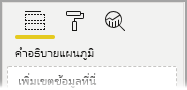
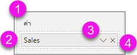
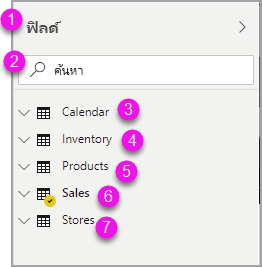
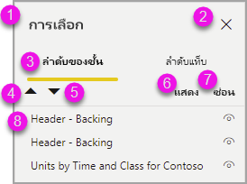

# สร้างรายงานใน Power BI โดยใช้เครื่องมือช่วยสำหรับการเข้าถึงCreating reports in Power BI using accessibility tools

สำหรับผู้สร้างรายงานที่ใช้เครื่องมือช่วยสำหรับการเข้าถึงในการสร้างรายงาน Power BI มีความสามารถที่มีอยู่ภายในหลายอย่างที่สามารถช่วยในกระบวนการได้For report creators who use accessibility tools to create reports, Power BI has many built-in capabilities that can help in the process.

บทความนี้อธิบายถึงเครื่องมือช่วยสำหรับการเข้าถึงหลายประเภทที่มีอยู่สำหรับผู้สร้างรายงานใน Power BI DesktopThis article describes the many types of accessibility tools available for report creators in Power BI Desktop.

## การนำทางระดับแอปApp-level navigation
เมื่อมีการนำทางใน Power BI Desktop คุณสามารถย้ายโฟกัสไปยังพื้นที่หลักของแอปโดยการกด **Ctrl + F6**When navigating in Power BI Desktop, you can move focus to the main areas of the app by pressing **Ctrl + F6**. การเลื่อนโฟกัสในพื้นที่หลักของ Power BI Desktop จะดำเนินไปตามลำดับต่อไปนี้:Shifting focus in the main area of Power BI Desktop progresses in the following order:

1. ออบเจ็กต์บนพื้นที่ทำงานObjects on canvas
2. แท็บหน้าPage tabs
3. บานหน้าต่าง (แต่ละรายการแยกต่างหาก จากซ้ายไปขวาสำหรับบานหน้าต่างใดก็ตามที่เปิดอยู่)Panes (each one separately, left to right for whatever ones are open)
4. ดูตัวนำทางView navigator
5. ส่วนท้ายFooter
6. ลงชื่อเข้าใช้Sign in
7. แถบเตือนสีเหลือง / ข้อผิดพลาด / การอัปเดตYellow warning / error / updates bar

ในกรณีส่วนใหญ่ การใช้ **Enter** เพื่อเลือก หรือป้อนพื้นที่ และจากนั้นใช้ **Esc** เพื่อออก เป็นกระบวนการทั่วไปใน Power BIIn most cases, using **Enter** to select, or enter an area, and then using **Esc** to exit are common procedures in Power BI.

## การนำทางด้วยริบบอนRibbon navigation

กด **Alt** เพื่อดูกล่องขนาดเล็กที่เรียกว่า *KeyTips* เหนือแต่ละคำสั่งที่มีอยู่ในมุมมองปัจจุบันของริบบอนPress **Alt** to see the little boxes called *KeyTips* over each command available in the current view of the ribbon. จากนั้นคุณสามารถกดตัวอักษรที่แสดงใน *KeyTip* ที่วางเมาส์ค้างเหนือคำสั่งที่คุณต้องการที่จะใช้Then you can press the letter shown in the *KeyTip* that hovers over the command you want to use. 

ตัวอย่างเช่น ในรูปต่อไปนี้มีการกดคีย์ **Alt** เพื่อแสดง KeyTips ซึ่งประกอบด้วยตัวอักษรสำหรับคำสั่งที่สามารถเข้าถึงได้For example, in the following image the **Alt** key has been pressed to display KeyTips, which contain the letters for available accessible commands. จากนั้นกด **M** จะเปิดแท็บ **การสร้างแบบจำลอง** บนริบบอนThen pressing **M** would open the **Modeling** tab on the ribbon.

คุณอาจเห็น KeyTips เพิ่มเติม ทั้งนี้ขึ้นอยู่กับตัวอักษรที่คุณกดDepending on which letter you press, you might see additional KeyTips. ตัวอย่างเช่น ถ้าแท็บ **หน้าหลัก** มีการใช้งานอยู่ และคุณกด **W** จากนั้นแท็บ **มุมมอง** จะปรากฏขึ้นพร้อมกับ KeyTips สำหรับกลุ่มในแท็บริบบอน **มุมมอง** ดังกล่าว คุณสามารถกดตัวอักษรที่แสดงใน KeyTips ได้ต่อไปจนกว่าคุณจะกดตัวอักษรของคำสั่งเฉพาะที่คุณต้องการใช้For example, if the **Home** tab is active and you press **W**, the **View** tab is displayed along with the KeyTips for the groups in that **View** ribbon tab. You can continue pressing letters displayed in KeyTips until you press the letter of the specific command you want to use. หากต้องการย้ายไปยัง KeyTips ชุดก่อนหน้า ให้กด **Esc** หากต้องการยกเลิกการดำเนินการที่คุณกำลังทำและซ่อน KeyTips ให้กดคีย์ **Alt**To move to the previous set of KeyTips, press **Esc**. To cancel the action you’re taking and hide the KeyTips, press the **Alt** key.

## การนำทางของบานหน้าต่างวิชวลVisual pane navigation

เมื่อต้องการนำทางบานหน้า **การแสดงข้อมูลด้วยภาพ** ก่อนอื่นคุณต้องแน่ใจว่าการโฟกัสของคุณอยู่ที่บานหน้าต่างโดยกด **Ctrl + F6** จนกว่าจะถึงบานหน้าต่างนั้นTo navigate the **Visualizations** pane, you first must make sure your focus is on the pane, by pressing **Ctrl + F6** until you reach that pane. เมื่อผู้ใช้นำทางผ่านบานหน้าต่างการแสดงข้อมูลด้วยภาพ โฟกัสแรกจะอยู่ที่ส่วนหัวWhen a user navigates through the visualizations pane, the focus first lands on the header. เริ่มต้นจากด้านบนสุด ลำดับแท็บเป็นดังต่อไปนี้ และจะแสดงในรูปภาพต่อไปนี้:Starting from the top, the tab order is the following, and is shown in the following image:

1. ชื่อส่วนหัวThe header title
2. กะรัตแบบขยาย/ยุบThe expand / collapse carat
3. ไอคอนวิชวลแรกThe first visual icon

เมื่อคุณไปยังวิชวลแล้ว คุณสามารถใช้ปุ่มลูกศรเพื่อนำทางไปยังวิชวลใดวิชวลหนึ่ง และกด **Enter** เพื่อเลือกWhen you get to the visuals, you can use arrow keys to navigate to a particular visual, and press **Enter** to select it. หากคุณใช้โปรแกรมอ่านหน้าจอ ระบบจะอ่านออกเสียงหากคุณได้สร้างแผนภูมิใหม่ และบอกให้คุณทราบว่าเป็นแผนภูมิชนิดใด หรือจะแจ้งให้คุณทราบว่าคุณได้เปลี่ยนแผนภูมิชนิดใดชนิดหนึ่งเป็นแผนภูมิชนิดอื่นIf you’re using a screen reader, it calls out if you’ve created a new chart and tell you what type it is, or it tells you that you’ve changed a chart of a particular type to another type of chart. 

หลังจากส่วนวิชวลของบานหน้าต่างแล้ว ลำดับโฟกัสจะเลื่อนไปยังบานหน้าต่าง pivots ดังที่แสดงในรูปต่อไปนี้After the visuals section of the pane, the focus order then shifts to the pane pivots, as shown in the following image.

เมื่อโฟกัสอยู่บนบานหน้าต่าง pivots การกดแท็บจะอยู่บนไอคอนสำหรับบานหน้าต่างที่เลือกเท่านั้นWhen focus is on the pane pivots, tabbing lands only on the icon for the pane that is selected. เมื่อต้องการสลับไปยังบานหน้าต่างอื่น ให้ใช้แป้นลูกศรTo switch to other panes, use arrow keys.

## พื้นที่เขตข้อมูลField well

เมื่อโฟกัสอยู่ในบานหน้าต่าง pivots ตามที่อธิบายไว้ในส่วนก่อนหน้า การกดแท็บอีกครั้งจะเลื่อนโฟกัสไปยัง **พื้นที่เขตข้อมูล**When focus is on the pane pivots, as described in the previous section, pressing tab again advances focus to the **Field Well**. 

ใน **พื้นที่เขตข้อมูล** ลำดับโฟกัสจะเลื่อนไปที่:In the **Field well**, focus order moves to:

* ชื่อของแต่ละพื้นที่ (ลำดับแรก)each well's title (first)
* ตามด้วยเขตข้อมูลที่ระบุในแต่ละพื้นที่ (ถัดไป)followed by a given field in each well (next)
* ปุ่มดรอปดาวน์เพื่อเปิดเมนูเขตข้อมูล (หลังจากนั้น)the dropdown button to open the field menu (after that)
* จากนั้นปุ่มลบ (สุดท้าย)then the removal button (last)

รูปภาพต่อไปนี้แสดงการจัดลำดับความคืบหน้าของโฟกัสนี้The following image shows this focus progression ordering.

โปรแกรมอ่านหน้าจอจะอ่านชื่อของพื้นที่และคำแนะนำเครื่องมือA screen reader will read out the well’s name and its tooltip. สำหรับเขตข้อมูลแต่ละอันที่อยู่ในพื้นที่ โปรแกรมอ่านหน้าจอจะอ่านชื่อเขตข้อมูลและคำแนะนำเครื่องมือFor each field in a well, a screen reader reads the field name and its tooltip. ถ้าพื้นที่ว่างเปล่า โฟกัสควรเลื่อนไปยังพื้นที่ว่างทั้งหมดIf a well is empty, the focus should move to the entire empty well. โปรแกรมอ่านหน้าจอควรอ่านชื่อพื้นที่ คำแนะนำเครื่องมือ และบอกว่าว่างเปล่าด้วยThe screen reader should read the well name, tooltip, and that it is empty.

เมื่อเมนูเขตข้อมูลเปิดอยู่ คุณสามารถเลื่อนดูได้โดยใช้ **แท็บ** หรือ **Shift + แท็บ** หรือปุ่มลูกศร **ขึ้น** / **ลง**When the field menu is open, you can move through it by using **Tab** or **Shift + Tab** or **Up** / **Down** arrow keys. โปรแกรมอ่านหน้าจอจะเรียกขานชื่อตัวเลือกA screen reader will call out the option names.

หากคุณต้องการย้ายเขตข้อมูลจากบักเก็ตหนึ่งในพื้นที่เขตข้อมูลไปยังอีกบักเก็ตหนึ่ง คุณสามารถใช้แป้นพิมพ์ของคุณ และใช้ **ย้าย** ไปยังตัวเลือกในเมนูพื้นที่เขตข้อมูล ดังที่แสดงในรูปต่อไปนี้If you’d like to move a field from one bucket in the field well to another bucket, you can use your keyboard, and use the **Move** to option in the field well menu, as shown in the following image.

## พื้นที่การจัดรูปแบบFormatting pane

ลำดับโฟกัสสำหรับบานหน้าต่าง **การจัดรูปแบบ** จะเลื่อนจากด้านบนลงมาด้านล่างตามลำดับของการ์ดThe focus order for the **Formatting** pane moves from the top, then down, in card order. โฟกัสเลื่อนไปรอบชื่อการ์ด ตามด้วยปุ่มสลับ **เปิด/ปิด** หากมีอยู่The focus goes around the card name, followed by its **On / Off** toggle button, if it exists. เมื่อโฟกัสอยู่ที่ชื่อการ์ด โปรแกรมอ่านหน้าจอจะอ่านชื่อของการ์ด และบอกว่าการ์ดขยายหรือยุบอยู่When the focus is on the card name, a screen reader reads out the name of the card, and whether the card is expanded or collapsed. คุณสามารถกด **Enter** เพื่อขยายหรือยุบการ์ดYou can press **Enter** to expand or collapse the card. คีย์ **Enter** ยังสามารถใช้สลับ **เปิด** หรือ **ปิด** ปุ่มสลับได้The **Enter** key also works to switch **On** or **Off** the toggle button.

หากการ์ดเปิดอยู่ **แท็บ** จะเลื่อนผ่านตัวควบคุมในการ์ดก่อนที่จะไปยังการ์ดใบถัดไปIf a card is open, **Tab** moves through the controls in the card before going on to the next card. สำหรับตัวควบคุมในการ์ด โปรแกรมอ่านหน้าจอจะเรียกขานชื่อ ค่าปัจจุบัน และชนิดตัวควบคุมFor the controls in a card, a screen reader calls out the title, the current value, and the control type.  

## การนำทางรายการเขตข้อมูลFields list navigation

คุณสามารถกด **แท็บ** เพื่อนำทางไปยังรายการ **เขตข้อมูล** ได้You can press **Tab** to navigate around the **Fields** list. คล้ายกับบานหน้าต่างการจัดรูปแบบ ถ้าตารางถูกยุบ ลำดับโฟกัสจะวนไปตามลำดับต่อไปนี้:Similar to the formatting pane, if tables are collapsed the focus order cycles through in the following order:

1. ส่วนหัวของรายการ **เขตข้อมูล**The **Fields** list header
2. แถบค้นหาThe search bar
3. ชื่อของแต่ละตารางEach table name

หากต้องการขยายตารางทั้งหมดในพื้นที่ **เขตข้อมูล** ให้กด **Alt + Shift + 9**To expand all the tables in the **Fields** well, press **Alt + Shift + 9**. หากต้องการยุบตารางทั้งหมด ให้กด **Alt + Shift + 1**To collapse all the tables press **Alt + Shift + 1**. หากต้องการขยายตารางเดียว ให้กดปุ่ม **ลูกศรขวา**To expand a single table, press the **Right arrow** key. หากต้องการยุบตารางเดียว ให้กดปุ่ม **ลูกศรซ้าย**To collapse a single table, press the **Left arrow** key. คล้ายกับบานหน้าต่างการจัดรูปแบบ ถ้ามีการขยายตารางแล้ว จากนั้นการกดแท็บและการนำทางผ่านรายการเขตข้อมูลจะประกอบด้วยเขตข้อมูลที่แสดงอยู่Similar to the formatting pane, if a table is expanded, then tabbing and navigating through the fields list includes the fields that are being shown. โปรแกรมอ่านหน้าจอจะเรียกขานว่าคุณมีการขยายหรือการยุบตารางA screen reader calls out whether you have expanded or collapsed a table.

คุณสามารถทำเครื่องหมายถูกบนเขตข้อมูลได้ด้วยการนำทางไปยังเขตข้อมูลที่ต้องการและกด **Enter**You can checkmark a field by navigating to the desired field and pressing **Enter**.   โปรแกรมอ่านหน้าจอจะเรียกขานเขตข้อมูลที่โฟกัสอยู่ และเรียกขานว่ามีการเลือกหรือไม่เลือกเขตข้อมูลA screen reader calls out the field the focus is on, and whether the field is checked or unchecked.

โดยทั่วไปผู้ใช้เมาส์จะลากและวางเขตข้อมูลไปยังพื้นที่ทำงาน หรือไปยังบักเก็ตของตัวกรองที่เกี่ยวข้องที่พวกเขาต้องการMouse users typically drag-and-drop fields to the canvas, or to the relevant filter buckets they desire. ถ้าคุณต้องการใช้แป้นพิมพ์ของคุณ คุณสามารถเพิ่มเขตข้อมูลลงในบักเก็ตของตัวกรองได้ด้วยการเข้าไปยังเมนูบริบทของเขตข้อมูลโดยการกด **Shift + F10** โดยการใช้แป้นลูกศรเพื่อนำทางไปยัง **เพิ่มไปยังตัวกรอง** จากนั้นกด **Enter** บนชนิดของตัวกรองที่คุณต้องการเพิ่มเขตข้อมูลIf you’d like to use your keyboard, you can add a field to a filter bucket by entering a field’s context menu by pressing **Shift + F10**, using arrow keys to navigate to **Add to filters**, and then pressing **Enter** on the type of filter to which you’d like to add the field.

## การนำทางของบานหน้าต่างการเลือกSelection pane navigation
บานหน้าต่าง **การเลือก** มีความคืบหน้าของลำดับโฟกัสดังต่อไปนี้:The **Selection** pane has the following focus order progression:

1. ชื่อส่วนหัวHeader title
2. ปุ่ม Exit (ออก)Exit button
3. ตัวสลับลำดับเลเยอร์/แท็บLayer / tab order switcher
4. ปุ่มเลื่อนไปยังเลเยอร์ด้านบนMove up in layer button
5. ปุ่มเลื่อนไปยังเลเยอร์ด้านล่างMove down in layer button
6. ปุ่มแสดงShow button
7. ปุ่มซ่อนHide button
8. ออบเจ็กต์Objects

คุณสามารถกดแท็บตามลำดับโฟกัสแล้วกด **Enter** เพื่อเลือกองค์ประกอบที่คุณสนใจYou can tab through the focus order and press **Enter** to select the element you're interested in.  

เมื่อคุณอยู่ที่ตัวสลับลำดับเลเยอร์/แท็บ ให้ใช้ปุ่มลูกศรซ้ายและขวาเพื่อสลับระหว่างลำดับเลเยอร์และลำดับแท็บWhen you get to the layer / tab order switcher, use the left and right arrow keys to switch between the layer order and tab order.

เมื่อคุณอยู่ที่ออบเจ็กต์ในบานหน้าต่าง **การเลือก** ให้กด **F6** เพื่อเปิดใช้งานบานหน้าต่าง **การเลือก**When you get to the objects in the **Selection** pane, press **F6** to activate the **Selection** pane. หลังจากเปิดใช้งานบานหน้าต่าง **การเลือก** แล้ว คุณสามารถใช้แป้นลูกศรขึ้น/ลงเพื่อนำทางไปยังออบเจ็กต์ต่าง ๆ ในบานหน้าต่าง **การเลือก** ได้After activating the **Selection** pane, you can use the up / down arrow keys to navigate to the different objects in the **Selection** pane.
เมื่อคุณถูกนำทางไปยังออบเจ็กต์ที่สนใจแล้ว คุณจะสามารถดำเนินการที่แตกต่างกันได้สองถึงสามวิธี:Once you’ve navigated to an object of interest, there are a few different actions you can take:

* กด **Ctrl + Shift + S** เพื่อซ่อน/แสดงออบเจ็กต์Press **Ctrl + Shift + S** to hide / show an object
* กด **Ctrl + Shift + F** เพื่อย้ายออบเจ็กต์ไปยังลำดับเลเยอร์ด้านบนPress **Ctrl + Shift + F** to move an object up in the layer order
* กด **Ctrl + Shift + B** เพื่อย้ายออบเจ็กต์ไปยังลำดับเลเยอร์ด้านล่างPress **Ctrl + Shift + B** to move an object down in the layer order
* กด **Ctrl + Space** เพื่อเลือกออบเจ็กต์หลายรายการPress **Ctrl + Space** to multi-select objects

## กล่องโต้ตอบ Power BI DesktopPower BI Desktop dialogs

คุณสามารถเข้าถึงกล่องโต้ตอบทั้งหมดใน Power BI Desktop ได้ผ่านการนำทางด้วยคีย์บอร์ด และทำงานร่วมกับโปรแกรมอ่านหน้าจอAll dialogs in Power BI Desktop are accessible through keyboard navigation and work with screen readers.

กล่องโต้ตอบใน Power BI Desktop มีดังต่อไปนี้:Dialogs in Power BI Desktop include the following:

* กล่องโต้ตอบการวัดผลด่วนQuick Measures dialog
* กล่องโต้ตอบการจัดรูปแบบตามเงื่อนไข & แถบข้อมูลConditional Formatting & data bars dialog
* ถามตอบกล่องโต้ตอบ ExplorerQ&A Explorer dialog
* เริ่มต้นใช้งานการโต้ตอบGetting Started dialog
* เมนูไฟล์และเกี่ยวกับการโต้ตอบFile menu and About dialog
* แถบคำเตือนWarning bar
* กล่องโต้ตอบการคืนค่าแฟ้มFile Restore dialog
* กล่องโต้ตอบ frownsFrowns dialog

## รองรับโหมดความคมชัดสูงHigh contrast support

เมื่อคุณใช้โหมดความคมชัดสูงใน Windows การตั้งค่าเหล่านั้นและชุดแบบสีที่คุณเลือกจะนำไปใช้กับรายงานใน Power BI Desktop ด้วยWhen you use high contrast modes in Windows, those settings and the palette you select are also applied to reports in Power BI Desktop.

Power BI Desktop ตรวจหาธีมความคมชัดสูงโดยอัตโนมัติที่ Windows กำลังใช้งาน และใช้การตั้งค่าเหล่านั้นในรายงานของคุณPower BI Desktop automatically detects which high contrast theme Windows is using and applies those settings to your reports. สีความคมชัดสูงเหล่านั้น จะติดตามไปกับรายงาน เมื่อเผยแพร่ไปยังบริการของ Power BI หรือที่อื่น ๆThose high contrast colors follow the report when published to the Power BI service, or elsewhere.

## ขั้นตอนถัดไปNext steps

คอลเลกชันของบทความเกี่ยวกับการช่วยสำหรับการเข้าถึง Power BI มีดังต่อไปนี้:The collection of articles for Power BI accessibility are the following:

* [ภาพรวมของการช่วยสำหรับการเข้าถึงใน Power BIOverview of accessibility in Power BI](desktop-accessibility-overview.md) 
* [การสร้างรายงาน Power BI ที่สามารถเข้าถึงได้Creating accessible Power BI reports](desktop-accessibility-creating-reports.md) 
* [การใช้รายงานใน Power BI ด้วยเครื่องมือช่วยสำหรับการเข้าถึงConsuming reports in Power BI with accessibility tools](desktop-accessibility-consuming-tools.md)
* [แป้นพิมพ์ลัดการช่วยสำหรับการเข้าถึงสำหรับรายงาน Power BIAccessibility keyboard shortcuts for Power BI reports](desktop-accessibility-keyboard-shortcuts.md)
* [รายการตรวจสอบการช่วยสำหรับการเข้าถึงรายงานReport accessibility checklist](desktop-accessibility-creating-reports.md#report-accessibility-checklist)

