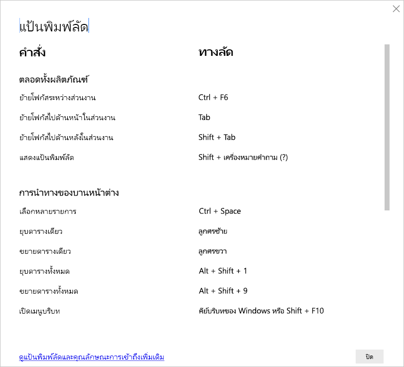

# แป้นพิมพ์ลัดใน Power BI DesktopKeyboard shortcuts in Power BI Desktop

แป้นพิมพ์ลัดจะมีประโยชน์สำหรับการย้ายไปรอบๆ ในรายงาน Power BI โดยใช้คีย์บอร์ดKeyboard shortcuts are helpful for moving around in Power BI reports using a keyboard. ตารางในบทความนี้อธิบายแป้นพิมพ์ลัดที่มีอยู่ในรายงาน Power BIThe tables in this article describe the shortcuts available in a Power BI report. 

เมื่อใช้ Power BI Desktop คุณสามารถกด **Shift + ?**When using Power BI Desktop, you can press **Shift + ?** เพื่อแสดงแป้นพิมพ์ลัด ดังที่แสดงในรูปภาพต่อไปนี้to show keyboard shortcuts, as shown in the following image.

นอกจากการใช้แป้นพิมพ์ลัดเหล่านี้ใน **Power BI Desktop** ชุดทางลัดเหล่านี้ทำงานในการใช้งานต่อไปนี้ได้เช่นกัน:In addition to using these keyboard shortcuts in **Power BI Desktop**, these shortcuts work in the following experiences as well:

* กล่องโต้ตอบ **ถามตอบ Explorer****Q&A Explorer** dialog
* กล่องโต้ตอบ **การเริ่มต้นใช้งาน****Getting Started** dialog
* กล่องโต้ตอบ **ไฟล์** เมนู และ **เกี่ยวกับ****File** menu and **About** dialog
* แถบ **คำเตือน****Warning** bar
* กล่องโต้ตอบ **การคืนค่าไฟล์****File Restore** dialog
* กล่องโต้ตอบ **Frowns****Frowns** dialog

ในความพยายามของเราอย่างต่อเนื่องเพื่อปรับปรุงการเข้าถึง รายการก่อนหน้านี้ของการใช้งานซึ่งยังคงสนับสนุนโปรแกรมอ่านหน้าจอและการตั้งค่าความคมชัดสูงIn our continued effort to improve accessibility, the previous list of experiences also support screen readers and high contrast settings.

## แป้นพิมพ์ลัดที่ใช้บ่อยFrequently used shortcuts
| ในการดำเนินการนี้To do this action           | กดปุ่มPress                |
| :------------------- | :------------------- |
| ย้ายโฟกัสระหว่างส่วนงานMove focus between sections  | **Ctrl + F6****Ctrl + F6** |
| ย้ายโฟกัสไปด้านหน้าในส่วนงานMove focus forward in section | **Tab****Tab**         |
| ย้ายโฟกัสไปด้านหลังในส่วนงานMove focus backward in section | **Shift + Tab****Shift + Tab** |
| เลือกหรือล้างการเลือกวัตถุSelect or clear selection of an object | **Enter** หรือ **spacebar****Enter** or **spacebar** |
| เลือกหลายวัตถุMulti-select objects | **Ctrl + spacebar****Ctrl + spacebar** |

## เมื่อใช้งานภาพOn visual
| ในการดำเนินการนี้To do this action           | กดปุ่มPress                |
| :------------------- | :------------------- |
| ย้ายโฟกัสไปยังเมนูภาพMove focus to visual menu | **Alt + Shift + F10****Alt + Shift + F10** |
| แสดงข้อมูลShow data | **Alt + Shift + F11****Alt + Shift + F11**  |
| ป้อนการแสดงผลด้วยภาพEnter a visual | **Ctrl + ลูกศรขวา****Ctrl + Right arrow** |
| ป้อนเลเยอร์Enter a layer | **Enter****Enter** |
| ออกจากเลเยอร์หรือการแสดงผลด้วยภาพExit a layer or visual | **Esc****Esc** |
| เลือกหรือล้างการเลือกจุดข้อมูลSelect or clear selection of a data point | **Enter** หรือ **spacebar****Enter** or **spacebar** |
| เลือกหลายรายการMulti-select | **Ctrl + Enter** หรือ **Ctrl + spacebar****Ctrl + Enter** or **Ctrl + spacebar** |
| คลิกขวาRight-click | <ul><li>คีย์บอร์ด Windows: **คีย์บริบท Windows + F10**Windows keyboard: **Windows context key + F10**. ปุ่มเปิดเมน Windows อยู่ระหว่างแป้น Alt ซ้ายและแป้นลูกศรซ้ายThe Windows context key is between the Left Alt key and the Left Arrow Key</li><li>คีย์บอร์ดอื่น ๆ: **Shift + F10**Other keyboard: **Shift + F10**</li></ul> |
| ล้างการเลือกClear selection | **Ctrl + Shift + C****Ctrl + Shift + C** |
| แสดงหรือซ่อนคำแนะนำเครื่องมือShow or hide tooltip | **Ctrl + H****Ctrl + H** |

## การนำทางของตารางและเมทริกซ์Table and matrix navigation
| ในการดำเนินการนี้To do this action          | กดปุ่มPress                |
| :------------------- | :------------------- |
| ย้ายโฟกัสขึ้น/ลงหนึ่งเซลล์ (ทุกเซลล์ในทุกพื้นที่)Move focus up / down one cell (across all cells in all areas)  | **แป้นลูกศรขึ้น** / **แป้นลูกศรลง****Up arrow key** / **Down arrow key** |
| ย้ายโฟกัสไปทางซ้าย/ขวาหนึ่งเซลล์ (ทุกเซลล์ในทุกพื้นที่)Move focus left / right one cell (across all cells in all areas)  | **แป้นลูกศรซ้าย** / **แป้นลูกศรขวา****Left arrow key** / **Right arrow key** |

## หน้าต่างการนำทางPane navigation
| ในการดำเนินการนี้To do this action           | กดปุ่มPress                |
| :------------------- | :------------------- |
| เลือกหลายรายการMulti-select | **Ctrl + spacebar****Ctrl + spacebar** |
| ยุบตารางเดียวCollapse a single table | **แป้นลูกศรซ้าย****Left arrow key** |
| ขยายตารางเดียวExpand a single table | **แป้นลูกศรขวา****Right arrow key** |
| ยุบตารางทั้งหมดCollapse all tables | **Alt + Shift + 1****Alt + Shift + 1** |
| ขยายตารางทั้งหมดExpand all tables | **Alt + Shift + 9****Alt + Shift + 9** |
| เปิดเมนูบริบทOpen a context menu | <ul><li>คีย์บอร์ด Windows: **คีย์บริบท Windows + F10**Windows keyboard: **Windows context key + F10**.  ปุ่มเปิดเมน Windows อยู่ระหว่างแป้น Alt ซ้ายและแป้นลูกศรซ้ายThe Windows context key is between the Left Alt key and the Left Arrow Key</li><li>คีย์บอร์ดอื่น ๆ: **Shift + F10**Other keyboard: **Shift + F10**</li></ul> |

## ตัวแบ่งส่วนข้อมูลSlicer
| ในการดำเนินการนี้To do this action         | กดปุ่มPress                |
| :------------------- | :------------------- |
| โต้ตอบกับตัวแบ่งส่วนข้อมูลInteract with a slicer | **Ctrl + แป้นลูกศรขวา****Ctrl + Right arrow key** |

## บานหน้าต่างการเลือกSelection pane
| ในการดำเนินการนี้To do this action           | กดปุ่มPress                |
| :------------------- | :------------------- |
| เปิดใช้งานบานหน้าต่างการเลือกActivate selection pane | **F6****F6** |
| ย้ายวัตถุขึ้นในเลเยอร์Move an object up in the layering | **Ctrl + Shift + F****Ctrl + Shift + F** |
| ย้ายวัตถุลงในเลเยอร์Move an object down in the layering | **Ctrl + Shift + B****Ctrl + Shift + B** |
| ซ่อน /แสดงวัตถุ (สลับ)Hide / show (toggle) an object | **Ctrl + Shift + S****Ctrl + Shift + S** |

## ตัวแก้ไข DAXDAX editor
| ในการดำเนินการนี้To do this action          | กดปุ่มPress                |
| :------------------- | :------------------- |
| คัดลอกบรรทัดขึ้น / ลงMove line up / down | **Alt + แป้นลูกศรขึ้น** / **แป้นลูกศรลง****Alt + Up arrow key** / **Down arrow key** |
| คัดลอกบรรทัดขึ้น / ลงCopy line up / down | **Shift + Alt + แป้นลูกศรขึ้น** / **แป้นลูกศรลง****Shift + Alt + Up arrow key** / **Down arrow key** |
| แทรกบรรทัดด้านล่างInsert line below | **Shift + Enter****Shift + Enter** |
| แทรกบรรทัดด้านบนInsert line above | **Ctrl + Shift + Enter****Ctrl + Shift + Enter** |
| ข้ามไปยังวงเล็บที่ตรงกันJump to matching bracket | **Ctrl + Shift +**  **Ctrl + Shift +** \ |
| เยื้องบรรทัด/ขยายบรรทัดลงในระยะขอบIndent line / Extend line into the margin | **Ctrl + ]**  /  **[****Ctrl + ]** / **[** |
| แทรกเคอร์เซอร์Insert cursor | **Alt + คลิก****Alt + Click** |
| เลือกบรรทัดปัจจุบันSelect current line | **Ctrl + I****Ctrl + I** |
| เลือกสิ่งที่ปรากฏทั้งหมดของสิ่งที่เลือกปัจจุบันSelect all occurrences of current selection | **Ctrl + Shift + L****Ctrl + Shift + L** |
| เลือกสิ่งที่ปรากฏทั้งหมดของคำที่เลือกปัจจุบันSelect all occurrences of current word | **Ctrl + F2****Ctrl + F2** |
| ใส่ความคิดเห็นในบรรทัดComment a line | **Ctrl + /** หรือ **Ctrl + K + C****Ctrl + /** or **Ctrl + K + C** |
| ไม่ใส่ความคิดเห็นในบรรทัดUncomment a line | **Ctrl + /** หรือ **Ctrl + K + U****Ctrl + /** or **Ctrl + K + U** |
| เพิ่มขนาดแบบอักษรIncrease font size | **Ctrl + +** หรือ **Scroll Up****Ctrl + +** Or **Scroll Up** |
| ลดขนาดแบบอักษรDecrease font size | **Ctrl + -** หรือ **Scroll Down****Ctrl + -** Or **Scroll Down** |

## ป้อนข้อมูลEnter data
| ในการดำเนินการนี้To do this action           | กดPress                |
| :------------------- | :------------------- |
| ออกจากตารางที่สามารถแก้ไขได้Exit editable grid | **Ctrl + Tab****Ctrl + Tab** |

## ข้อควรพิจารณาและข้อจำกัดConsiderations and limitations
มีปัญหาที่ทราบแล้วและข้อจำกัดบางประการ ของคุณลักษณะการช่วยสำหรับการเข้าถึงThere are a few known issues and limitations with the accessibility features. คำอธิบายของปัญหาและข้อจำกัดเหล่านั้นมีอยู่ในรายการต่อไปนี้:Descriptions of those issues and limitations are in the following list:

* เมื่อใช้โปรแกรมอ่านหน้าจอด้วย **Power BI Desktop** คุณจะมีประสบการณ์การใช้งานที่ดีที่สุดถ้าคุณเปิดโปรแกรมอ่านหน้าจอก่อนที่จะเปิดไฟล์ใดๆ ใน **Power BI Desktop**When using screen readers with **Power BI Desktop**, you'll have the best experience if you open your screen reader before opening any files in **Power BI Desktop**.
* ถ้าคุณกำลังใช้โปรแกรมผู้บรรยาย จะมีข้อจำกัดบางอย่างรอบๆ การนำทาง **แสดงข้อมูล** เป็นตาราง HTMLIf you're using Narrator, there are some limitations around navigating **Show data** as an HTML table.

## ขั้นตอนถัดไปNext steps

คอลเลกชันของบทความเกี่ยวกับการช่วยสำหรับการเข้าถึง Power BI มีดังต่อไปนี้:The collection of articles for Power BI accessibility are the following:

* [ภาพรวมของการช่วยสำหรับการเข้าถึงใน Power BIOverview of accessibility in Power BI](desktop-accessibility-overview.md) 
* [การสร้างรายงาน Power BI ที่สามารถเข้าถึงได้Creating accessible Power BI reports](desktop-accessibility-creating-reports.md) 
* [การใช้รายงานใน Power BI ด้วยเครื่องมือช่วยสำหรับการเข้าถึงConsuming reports in Power BI with accessibility tools](desktop-accessibility-consuming-tools.md)
* [การสร้างรายงาน Power BI ด้วยเครื่องมือการช่วยสำหรับการเข้าถึงCreating Power BI reports with accessibility tools](desktop-accessibility-creating-tools.md)
* [รายการตรวจสอบการช่วยสำหรับการเข้าถึงรายงานReport accessibility checklist](desktop-accessibility-creating-reports.md#report-accessibility-checklist)

คุณอาจสนใจบทความต่อไปนี้:You might also be interested in the following:

* [ใช้ธีมรายงานใน Power BI DesktopUse Report Themes in Power BI Desktop](desktop-report-themes.md)

