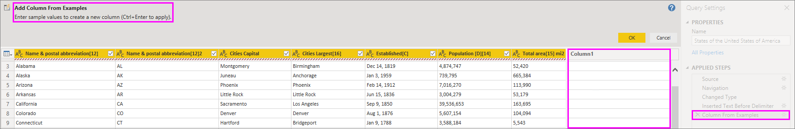

# เพิ่มคอลัมน์จากตัวอย่างใน Power BI DesktopAdd a column from examples in Power BI Desktop
ด้วย *เพิ่มคอลัมน์จากตัวอย่าง* ในตัวแก้ไข Power Query คุณสามารถเพิ่มคอลัมน์ใหม่ลงในแบบจำลองข้อมูลของคุณได้ง่ายๆ โดยการให้ค่าตัวอย่างอย่างน้อยหนึ่งรายการสำหรับคอลัมน์ใหม่With *add column from examples* in Power Query Editor, you can add new columns to your data model simply by providing one or more example values for the new columns. คุณสามารถสร้างตัวอย่างคอลัมน์ใหม่จากส่วนที่เลือกหรือใส่ค่าที่ยึดตามคอลัมน์ที่มีอยู่ทั้งหมดในตารางได้You can create the new column examples from a selection, or provide input based on all existing columns in the table.

การใช้ *เพิ่มคอลัมน์จากตัวอย่าง* ช่วยให้คุณสร้างคอลัมน์ใหม่ได้อย่างรวดเร็วและง่ายดาย และเหมาะสำหรับสถานการณ์ต่อไปนี้:Using *add column from example* lets you quickly and easily create new columns, and is great for the following situations:

- คุณทราบข้อมูลผลลัพธ์ที่คุณต้องการในคอลัมน์ใหม่ของคุณ แต่คุณไม่แน่ใจว่าการแปลง หรือคอลเลกชันของการแปลงไหน ที่จะช่วยคุณให้ได้ผลลัพธ์นั้นYou know the data you want in your new column, but you're not sure which transformation, or collection of transformations, will get you there.
- คุณทราบการแปลงที่จำเป็น แต่คุณไม่แน่ใจจะเลือกตำแหน่งไหน ในส่วนติดต่อผู้ใช้ เพื่อให้ได้ผลลัพธ์You already know which transformations you need, but you're not sure what to select in the UI to make them happen.
- คุณทราบทั้งหมดเกี่ยวกับการแปลงที่คุณต้องใช้ ด้วยนิพจน์ *คอลัมน์แบบกำหนดเอง* ในภาษา *M* แต่หนึ่ง (หรือหลาย) นิพจน์เหล่านั้นไม่มีอยู่ใน UIYou know all about the transformations you need using a *Custom Column* expression in *M* language, but one or more of those expressions aren't available in the UI.

การเพิ่มคอลัมน์จากตัวอย่างนั้นเป็นเรื่องง่ายและตรงไปตรงมาAdding a column from an example is easy and straightforward. ส่วนต่อไปจะแสดงให้เห็นว่า สามารถทำได้ง่ายเพียงใดThe next sections show just how easy it is.

## เพิ่มคอลัมน์ใหม่จากตัวย่างAdd a new column from examples

หากต้องการรับข้อมูลตัวอย่างจากวิกิพีเดียเลือก **รับข้อมูล** > **เว็บ** จากแท็บ **หน้าแรก** ของ ribbon Power BI DesktopTo get sample data from Wikipedia, select **Get Data** > **Web** from the **Home** tab of the Power BI Desktop ribbon. 

วาง URL ต่อไปนี้ลงในกล่องโต้ตอบที่ปรากฏขึ้นและเลือก **ตกลง**:Paste the following URL into the dialog that appears, and select **OK**: 

*https:\//wikipedia.org/wiki/List_of_states_and_territories_of_the_United_States**https:\//wikipedia.org/wiki/List_of_states_and_territories_of_the_United_States*

ในกล่องโต้ตอบ **ตัวนำทาง** เลือกตารางรัฐ **ของสหรัฐอเมริกา** และจากนั้นเลือก **แปลงข้อมูล**In the **Navigator** dialog box, select the **States of the United States of America** table, and then select **Transform Data**. ตารางเปิดในตัวแก้ไข Power QueryThe table opens in Power Query Editor.

หรือเมื่อต้องการเปิดข้อมูลที่โหลดแล้วจาก Power BI Desktop ให้เลือก **แก้ไขคิวรี** จากแท็บ **Home** ของ ribbonOr, to open already-loaded data from Power BI Desktop, select **Edit Queries** from the **Home** tab of the ribbon. ข้อมูลจะเปิดในตัวแก้ไข Power QueryThe data opens in Power Query Editor. 

เมื่อเปิดข้อมูลตัวอย่างในตัวแก้ไข Power Query แล้ว เลือกแท็บ **เพิ่มคอลัมน์** บน ribbon แล้้วเลือก **คอลัมน์จากตัวอย่าง**Once the sample data opens in Power Query Editor, select the **Add Column** tab on the ribbon, and then select **Column from Examples**. เลือกไอคอน **คอลัมน์จากตัวอย่าง** เพื่อสร้างคอลัมน์จากคอลัมน์ที่มีอยู่ หรือเลือกลูกศรแบบดรอปดาวน์เพื่อเลือกระหว่าง **จากคอลัมน์ทั้งหมด** หรือ **จากรายการเลือก**Select the **Column From Examples** icon itself to create the column from all existing columns, or select the drop-down arrow to choose between **From All Columns** or **From Selection**. สำหรับการฝึกปฏิบัตินี ้ให้ใช้ **จากคอลัมน์ทั้งหมด**For this walkthrough, use **From All Columns**.

## บานหน้าต่าง เพิ่มคอลัมน์จากตัวอย่างAdd Column From Examples pane
เมื่อคุณเลือก **เพิ่มคอลัมน์** > **จากตัวอย่าง** บานหน้าต่าง **เพิ่มคอลัมน์จากตัวอย่าง** จะเปิดขึ้นที่ด้านบนของตารางWhen you select **Add Column** > **From Examples**, the **Add Column From Examples** pane opens at the top of the table. **คอลัมน์่ 1** ใหม่จะปรากฏทางด้านขวาของคอลัมน์ที่มีอยู่ (คุณอาจต้องเลื่อนเพื่อดูทั้งหมด)The new **Column 1** appears to the right of the existing columns (you may need to scroll to see them all). เมื่อคุณใส่ค่าตัวอย่างของคุณในเซลล์ที่ว่างเปล่าของ **คอลัมน์ 1** Power BI จะสร้างกฎและการแปลงเพื่อให้ตรงกับตัวอย่างของคุณและใช้ข้อมูลเหล่านั้นเพื่อเติมส่วนที่เหลือของคอลัมน์When you enter your example values in the blank cells of **Column 1**, Power BI creates rules and transformations to match your examples, and uses them to fill the rest of the column.

โปรดสังเกตว่า **คอลัมน์จากตัวอย่าง** จะปรากฏเป็น **ขั้นตอนที่ใช้** ในบานหน้าต่าง **การตั้งค่าคิวรี**Notice that **Column From Examples** also appears as an **Applied Step** in the **Query Settings** pane. ดังเช่นเคย ตัวแก้ไข Power Query จะบันทึกขั้นตอนการแปลงของคุณ และปรับใช้กับคิวรีตามลำดับAs always, Power Query Editor records your transformation steps and applies them to the query in order.

ขณะที่คุณพิมพ์ตัวอย่างของคุณในคอลัมน์ใหม่ Power BI ให้คุณเห็นตัวอย่าง ว่าคอลัมน์ส่วนที่เหลือจะมีหน้าตาเป็นอย่างไรจากการแปลงที่ตรวจพบAs you type your example in the new column, Power BI shows a preview of how the rest of the column will look, based on the transformations it creates. ตัวอย่างเช่น ถ้าคุณพิมพ์ *Alabama* ในแถวแรก ที่สอดคล้องกับค่า **Alabama** ในคอลัมน์แรกของตารางFor example, if you type *Alabama* in the first row, it corresponds to the **Alabama** value in the first column of the table. ทันทีที่คุณกด Enter Power BI จะเติมในส่วนที่เหลือของคอลัมน์ใหม่โดยยึดตามค่าคอลัมน์แรก และตั้งชื่อคอลัมน์ **ชื่อและตัวย่อไปรษณีย์ [12]-สำเนา**As soon as you press Enter, Power BI fills in the rest of the new column based on the first column value, and names the column **Name & postal abbreviation[12] - Copy**.

ในตอนนี้ให้ไปที่แถว **แมสซาชูเซตส์ [E]** ของคอลัมน์ใหม่และลบส่วน **[E]** ของสตริงNow go to the **Massachusetts[E]** row of the new column and delete the **[E]** portion of the string. Power BI ตรวจพบการเปลี่ยนแปลง และใช้ตัวอย่างเพื่อสร้างการแปลงPower BI detects the change and uses the example to create a transformation. Power BI อธิบายการแปลงในบานหน้าต่าง **เพิ่มคอลัมน์จากตัวอย่าง** และเปลี่ยนชื่อคอลัมน์เป็น **ข้อความก่อนตัวคั่น**Power BI describes the transformations in the **Add Column From Examples** pane, and renames the column to **Text Before Delimiter.** 

เมื่อคุณดำเนินการต่อกับตัวอย่าง ตัวแก้ไข Power Query ก็เพิ่มการแปลงที่เกี่ยวข้องAs you continue to provide examples, Power Query Editor adds to the transformations. เมื่อคุณพอใจแล้ว เลือก **ตกลง** เพื่อบันทึกการเปลี่ยนแปลงของคุณWhen you're satisfied, select **OK** to commit your changes. 

คุณสามารถเปลี่ยนชื่อคอลัมน์ใหม่ได้ตามที่คุณต้องการโดยการคลิกสองครั้งที่ส่วนหัวของคอลัมน ์หรือคลิกขวาและเลือก **เปลี่ยนชื่อ**You can rename the new column whatever you want by double-clicking the column heading, or right-clicking it and selecting **Rename**. 

ดูวิดีโอนี้เพื่อดู **เพิ่มคอลัมน์จากตัวอย่าง** ในการดำเนินการโดยใช้แหล่งข้อมูลตัวอย่าง:Watch this video to see **Add Column From Examples** in action, using the sample data source: 

[Power BI Desktop: เพิ่มคอลัมน์จากตัวอย่าง](https://www.youtube.com/watch?v=-ykbVW9wQfw)[Power BI Desktop: Add Column From Examples](https://www.youtube.com/watch?v=-ykbVW9wQfw). 

## รายการการแปลงข้อมูลที่สนับสนุนList of supported transformations
การเปลี่ยนแปลงจำนวนมากแต่ไม่สามารถใช้ได้เมื่อใช้ **เพิ่มคอลัมน์จากตัวอย่าง**Many but not all transformations are available when using **Add Column from Examples**. รายการต่อไปนี้แสดงการแปลงข้อมูลที่สนับสนุนThe following list shows the supported transformations:

**ทั่วไป****General**

- คอลัมน์แบบมีเงื่อนไขConditional Column

**การอ้างอิง****Reference**
  
- การอ้างอิงถึงคอลัมน์ที่กำหนด ซึ่งรวมถึงตัดแต่ง ทำความสะอาด และการแปลงกรณีReference to a specific column, including trim, clean, and case transformations

**การแปลงข้อความ****Text transformations**

- การรวม (สนับสนุนการผสมกันระหว่าง สตริงที่เป็นสัญพจน์ และค่าของทั้งคอลัมน์)Combine (supports combination of literal strings and entire column values)
- แทนที่Replace
- ความยาวLength
- แยกExtract   
  - อักษรหลายตัวแรกFirst Characters
  - อักษรหลายตัวสุดท้ายLast Characters
  - ช่วงRange
  - ข้อความก่อนตัวคั่นText before Delimiter
  - ข้อความหลังตัวคั่นText after Delimiter
  - ข้อความระหว่างตัวคั่นText between Delimiters
  - ความยาวLength
  - เอาตัวอักษรออกRemove Characters
  - เก็บตัวอักษรไว้Keep Characters

> [!NOTE]
> การแปลง *ข้อความ* ทั้งหมด โดยคำนึงถึงการแปลงค่าของคอลัมน์โดย การตัดแต่ง ทำความสะอาด หรือการตัวพิมพ์เล็ก/ใหญ่ ที่จำเป็นด้วยAll *Text* transformations take into account the potential need to trim, clean, or apply a case transformation to the column value.

**แปลงวันที่****Date transformations**

- วันDay
- วันของสัปดาห์Day of Week
- ชื่อวันของสัปดาห์Day of Week Name
- วันของปีDay of Year
- เดือนMonth
- ชื่อเดือนMonth Name
- ไตรมาสของปีQuarter of Year
- สัปดาห์ของเดือนWeek of Month
- สัปดาห์ของปีWeek of Year
- ปีYear
- อายุAge
- วันเริ่มต้นปีStart of Year
- วันสิ้นปีEnd of Year
- วันเริ่มต้นเดือนStart of Month
- วันสิ้นเดือนEnd of Month
- วันเริ่มต้นไตรมาสStart of Quarter
- จำนวนวันในเดือนDays in Month
- วันสิ้นไตรมาสEnd of Quarter
- วันเริ่มต้นสัปดาห์Start of Week
- วันสิ้นสัปดาห์End of Week
- วันของเดือนDay of Month
- เวลาเริ่มต้นของวันStart of Day
- เวลาสิ้นสุดของวันEnd of Day

**การแปลงเวลา****Time transformations**

- HourHour
- นาทีMinute
- วินาทีSecond  
- แปลงเป็นเวลาท้องถิ่นTo Local Time

> [!NOTE]
> การแปลง *วันที่* และ *เวลา* ทั้งหมด โดยคำนึงถึงการแปลงค่าของคอลัมน์ไปเป็น *วันที่* หรือ *เวลา* หรือ *วันที่เวลา* ที่จำเป็นด้วยAll *Date* and *Time* transformations take into account the potential need to convert the column value to *Date* or *Time* or *DateTime*.

**การแปลงตัวเลข****Number transformations** 

- ค่าสัมบูรณ์Absolute Value
- อาร์กโคไซน์Arccosine
- อาร์กไซน์Arcsine
- อาร์กแทนเจนต์Arctangent
- แปลงเป็นตัวเลขConvert to Number
- โคไซน์Cosine
- ยกกำลังสามCube
- หารDivide
- เลขชี้กำลังExponent
- แฟกทอเรียลFactorial
- หารจำนวนเต็มInteger Divide
- เป็นเลขคู่Is Even
- เป็นเลขคี่Is Odd
- ลอการิทึมฐานธรรมชาติLn
- ลอการิทึมฐาน 10Base-10 Logarithm
- มอดุโลModulo
- คูณMultiply
- ปัดเศษลงRound Down
- ปัดเศษขึ้นRound Up
- เครื่องหมายSign
- ไซน์Sin
- รากที่สองSquare Root
- ยกกำลังสองSquare
- ลบSubtract
- ผลรวมSum
- แทนเจนต์Tangent
- บักเก็ต/ช่วงBucketing/Ranges
