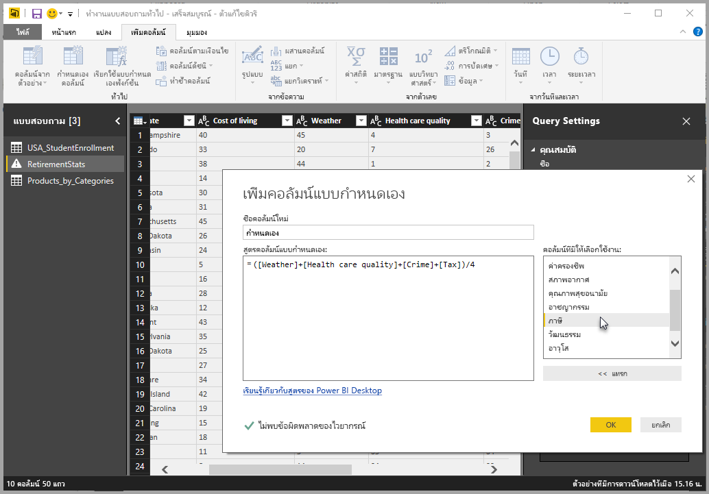
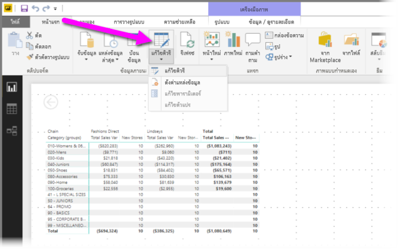
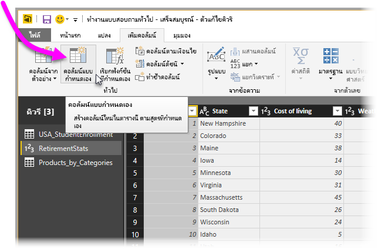
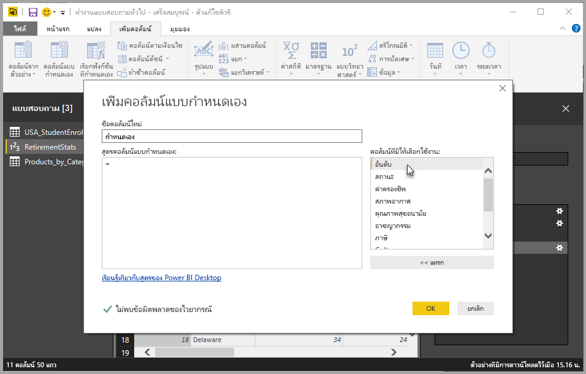
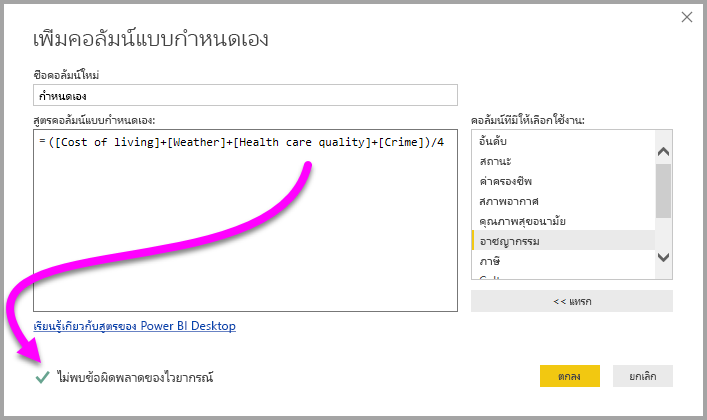
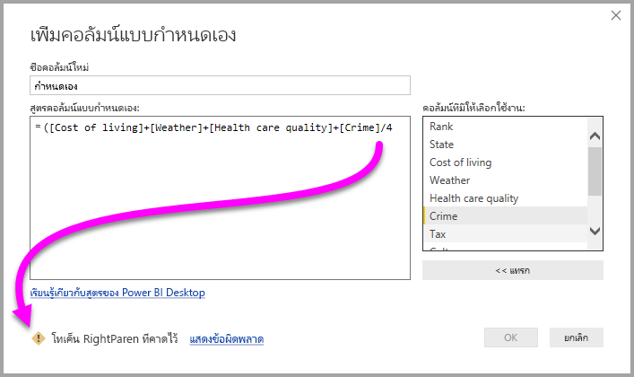
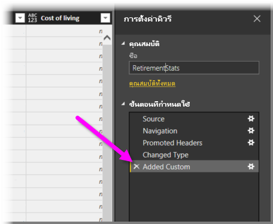
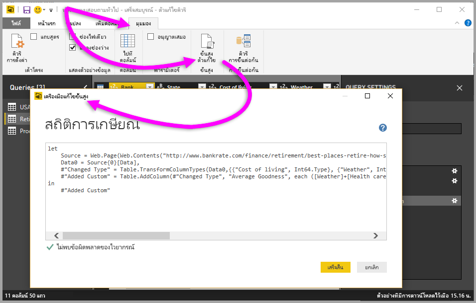

# เพิ่มคอลัมน์แบบกำหนดเองใน Power BI DesktopAdd a custom column in Power BI Desktop

ใน Power BI Desktop คุณสามารถเพิ่มคอลัมน์ของข้อมูลแบบกำหนดเองใหม่ลงในแบบจำลองของคุณได้อย่างง่ายดายโดยใช้ตัวแก้ไขคิวรีIn Power BI Desktop, you can easily add a new custom column of data to your model by using Query Editor. ด้วยตัวแก้ไขคิวรี คุณสามารถสร้างและเปลี่ยนชื่อคอลัมน์แบบกำหนดเองของคุณเพื่อสร้าง[คิวรีสูตร PowerQuery M](/powerquery-m/quick-tour-of-the-power-query-m-formula-language) สำหรับกำหนดคอลัมน์แบบกำหนดเองของคุณWith Query Editor, you create and rename your custom column to create [PowerQuery M formula queries](/powerquery-m/quick-tour-of-the-power-query-m-formula-language) to define your custom column. คิวรีสูตร PowerQuery M มี[ชุดเนื้อหาการอ้างอิงฟังก์ชันที่ครอบคลุม](/powerquery-m/power-query-m-function-reference)PowerQuery M formula queries have a [comprehensive function reference content set](/powerquery-m/power-query-m-function-reference). 

เมื่อคุณสร้างคอลัมน์แบบกำหนดเองในตัวแก้ไขคิวรีแล้ว Power BI Desktop จะเพิ่มคอลัมน์เป็น **ขั้นตอนที่ใช้** ใน **การตั้งค่าคิวรี** ของคิวรีWhen you create a custom column in Query Editor, Power BI Desktop adds it as an **Applied Step** in the **Query Settings** of the query. ซึ่งสามารถเปลี่ยนแปลง ย้าย หรือแก้ไขได้ตลอดเวลาIt can be changed, moved, or modified at any time.

## ใช้ตัวแก้ไขคิวรีเพื่อเพิ่มคอลัมน์แบบกำหนดเองUse Query Editor to add a custom column

เมื่อต้องการเริ่มต้นการสร้างคอลัมน์แบบกำหนดเอง ให้ทำตามขั้นตอนเหล่านี้:To start creating a custom column, follow these steps:

1. เปิดใช้งาน Power BI Desktop และโหลดข้อมูลบางส่วนLaunch Power BI Desktop and load some data.

2. จากแท็บ **หน้าแรก** บนริบบอน ให้เลือก **แก้ไขคิวรี** จากนั้นเลือก **แก้ไขคิวรี** จากเมนูFrom the **Home** tab on the ribbon, select **Edit Queries**, and then select **Edit Queries** from the menu.

   

   หน้าต่าง **ตัวแก้ไขคิวรี** จะปรากฏขึ้นThe **Query Editor** window appears. 

2. จากแท็บ **เพิ่มคอลัมน์** บนริบบอน ให้เลือก **คอลัมน์แบบกำหนดเอง**From the **Add Column** tab on the ribbon, select **Custom Column**.

   

   หน้าต่าง **เพิ่มคอลัมน์แบบกำหนดเอง** จะปรากฏขึ้นThe **Add Custom Column** window appears.

## หน้าต่างเพิ่มคอลัมน์แบบกำหนดเองThe Add Custom Column window

หน้าต่าง **เพิ่มคอลัมน์แบบกำหนดเอง** มีคุณลักษณะดังต่อไปนี้:The **Add Custom Column** window has the following features: 
- รายการของคอลัมน์ที่มีให้เลือกใช้งาน ในรายการ **คอลัมน์ที่มีให้เลือกใช้งาน** ทางด้านขวาA list of available columns, in the **Available columns** list on the right.

- ชื่อเริ่มต้นของคอลัมน์แบบกำหนดเองของคุณ ในกล่อง **ชื่อคอลัมน์ใหม่**The initial name of your custom column, in the **New column name** box. คุณสามารถเปลี่ยนชื่อคอลัมน์นี้ได้You can rename this column.

- [คิวรีสูตร PowerQuery M](/powerquery-m/power-query-m-function-reference) ในกล่อง **สูตรคอลัมน์แบบกำหนดเอง**[PowerQuery M formula queries](/powerquery-m/power-query-m-function-reference), in the **Custom column formula** box. คุณสามารถสร้างคิวรีเหล่านี้ด้วยการสร้างสูตรบนคอลัมน์แบบกำหนดเองที่คุณกำหนดขึ้นใหม่You create these queries by building the formula on which your new custom column is defined. 

   

## สร้างสูตรสำหรับคอลัมน์แบบกำหนดเองของคุณCreate formulas for your custom column

1. เลือกคอลัมน์จากรายการ **คอลัมน์ที่มีให้เลือกใช้งาน** ทางด้านขวา แล้วเลือก **แทรก** ใต้รายการเพื่อเพิ่มลงในสูตรของคอลัมน์แบบกำหนดเองSelect a column from the **Available columns** list on the right, and then select **Insert** below the list to add them to the custom column formula. นอกจากนี้ คุณยังสามารถเพิ่มคอลัมน์ได้โดยการดับเบิลคลิกคอลัมน์ในรายการด้วยYou can also add a column by double-clicking it in the list.

2. เมื่อคุณป้อนสูตรและสร้างคอลัมน์ของคุณ ให้สังเกตตัวบ่งชี้ที่ด้านล่างของหน้าต่าง **เพิ่มคอลัมน์แบบกำหนดเอง**As you enter the formula and build your column, note the indicator in the bottom of the **Add Custom Column** window. 

   ถ้าไม่มีข้อผิดพลาด คุณจะเห็นเครื่องหมายถูกสีเขียวและข้อความ *ไม่ตรวจพบข้อผิดพลาดทางไวยากรณ์*If there are no errors, you'll see a green check mark and the message *No syntax errors have been detected*.

   

   ถ้ามีข้อผิดพลาดทางไวยากรณ์ คุณจะเห็นไอคอนคำเตือนสีเหลืองพร้อมกับลิงก์เชื่อมโยงไปยังตำแหน่งที่มีข้อผิดพลาดเกิดขึ้นในสูตรของคุณIf there's a syntax error, you'll see a yellow warning icon, along with a link to where the error occurred in your formula.

   

3. เลือก **ตกลง**Select **OK**. 

   Power BI Desktop จะเพิ่มคอลัมน์แบบกำหนดเองของคุณไปยังแบบจำลอง และเพิ่มขั้นตอน **แบบกำหนดเองที่เพิ่ม** เข้ามาในรายการ **ขั้นตอนที่ใช้** ของคิวรีของคุณใน **การตั้งค่าคิวรี**Power BI Desktop adds your custom column to the model, and adds the **Added Custom** step to your query's **Applied Steps** list in **Query Settings**.

   

4. เมื่อต้องการปรับเปลี่ยนคอลัมน์แบบกำหนดเอง ให้ดับเบิลคลิกที่ขั้นตอน **แบบกำหนดเองที่เพิ่ม** ในรายการ **ขั้นตอนที่ใช้**To modify your custom column, double-click the **Added Custom** step in the **Applied Steps** list. 

   หน้าต่าง **เพิ่มคอลัมน์แบบกำหนดเอง** จะปรากฏขึ้นพร้อมสูตรคอลัมน์แบบกำหนดเองที่คุณสร้างขึ้นThe **Add Custom Column** window appears with the custom column formula you created.

## ใช้เครื่องมือแก้ไขขั้นสูงสำหรับคอลัมน์แบบกำหนดเองUse the Advanced Editor for custom columns

หลังจากที่คุณได้สร้างคิวรีของคุณแล้ว คุณยังสามารถใช้ **เครื่องมือแก้ไขขั้นสูง** เพื่อปรับเปลี่ยนขั้นตอนใดก็ตามของคิวรีของคุณได้After you've created your query, you can also use the **Advanced Editor** to modify any step of your query. ในการทำเช่นนั้น ทำตามขั้นตอนเหล่านี้:To do so, follow these steps:

1. ในหน้าต่าง **ตัวแก้ไขคิวรี** ให้เลือกแท็บ **มุมมอง** บนริบบอนIn the **Query Editor** window, select the **View** tab on the ribbon. 

2. เลือก **ตัวแก้ไขขั้นสูง**Select **Advanced Editor**.

   หน้า **เครื่องมือแก้ไขขั้นสูง** จะปรากฏขึ้น ซึ่งช่วยให้คุณสามารถควบคุมคิวรีของคุณได้อย่างสมบูรณ์The **Advanced Editor** page appears, which gives you full control over your query. 

   

   
## ขั้นตอนถัดไปNext steps

- คุณสามารถสร้างคอลัมน์แบบกำหนดเองได้ด้วยวิธีการอื่น เช่น การสร้างคอลัมน์ตามตัวอย่างที่คุณกำหนดไว้สำหรับตัวแก้ไขคิวรีYou can create a custom column in other ways, such as creating a column based on examples you provide to Query Editor. สำหรับข้อมูลเพิ่มเติม โปรดดู[เพิ่มคอลัมน์จากตัวอย่างใน Power BI Desktop](desktop-add-column-from-example.md)For more information, see [Add a column from an example in Power BI Desktop](desktop-add-column-from-example.md).

- สำหรับข้อมูลการอ้างอิง Power Query M โปรดดู [การอ้างอิงฟังก์ชัน Power Query M](/powerquery-m/power-query-m-function-reference)For Power Query M reference information, see [Power Query M function reference](/powerquery-m/power-query-m-function-reference).