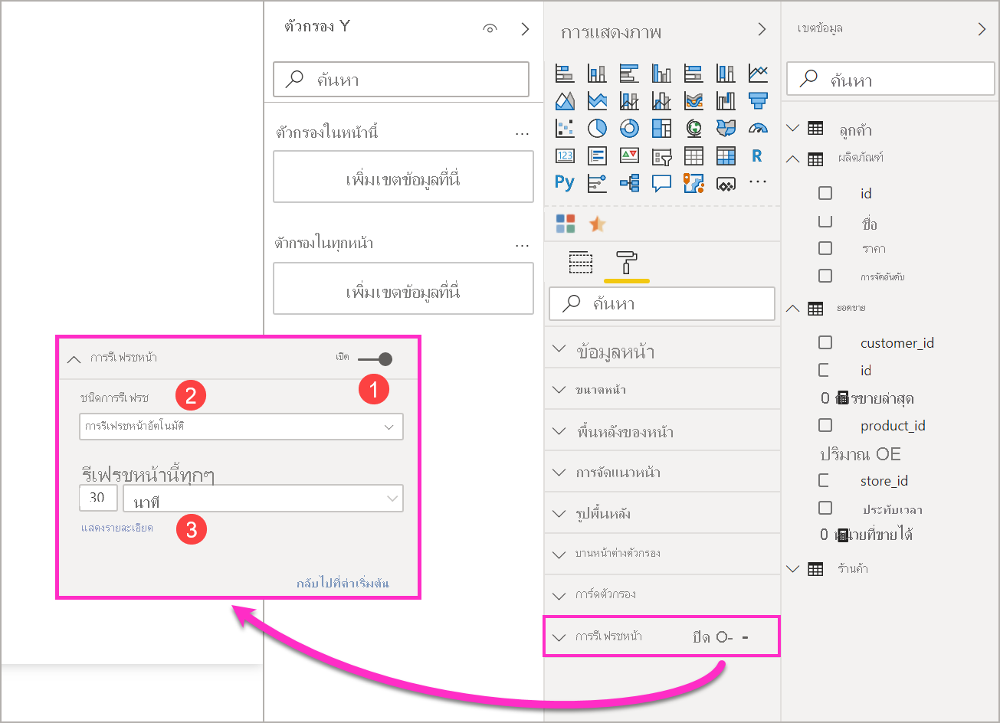
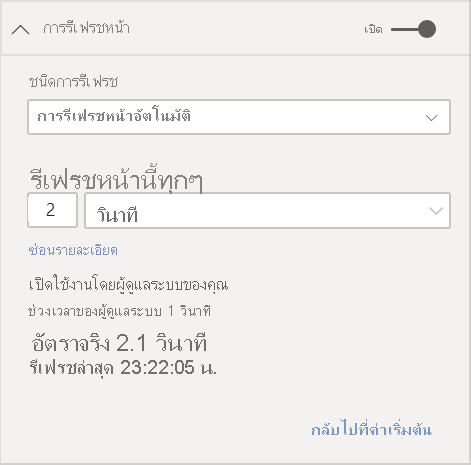
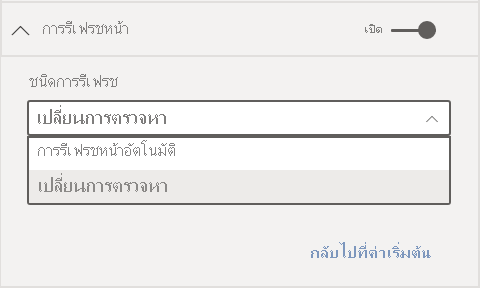
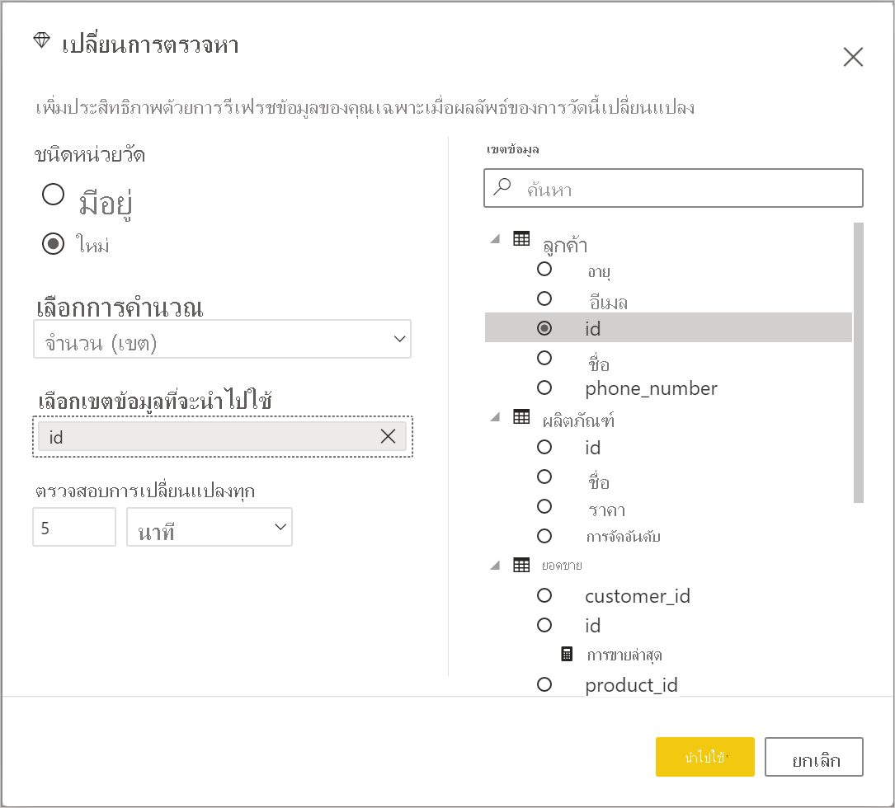
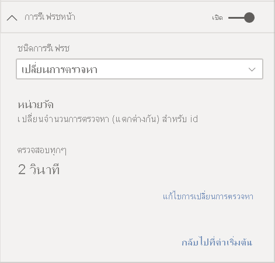
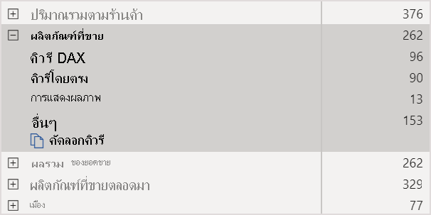
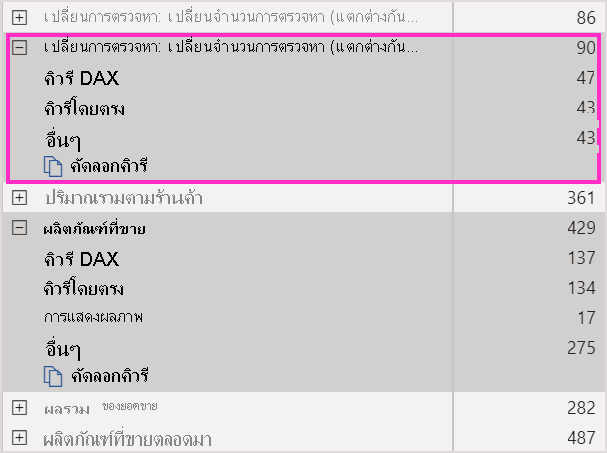

# การรีเฟรชหน้าอัตโนมัติใน Power BIAutomatic page refresh in Power BI

เมื่อคุณตรวจสอบเหตุการณ์ที่สำคัญ การรีเฟรชข้อมูลทันทีที่แหล่งข้อมูลที่ได้รับการอัปเดตเป็นสิ่งสำคัญWhen you monitor critical events, it's important for data to be refreshed as soon as the source data is updated. ตัวอย่างเช่น ในอุตสาหกรรมการผลิตเป็นสิ่งสำคัญที่ต้องทราบเมื่อเครื่องยนต์ชำรุดหรือใกล้ถึงเวลาสำหรับซ่อมบำรุงFor example, in the manufacturing industry, it's critical to know when a machine is malfunctioning or is close to malfunctioning. หากคุณกำลังตรวจสอบสัญญาณ เช่น ความคิดเห็นในโซเชียลมีเดีย คุณต้องการทราบเกี่ยวกับการเปลี่ยนแปลงอย่างกะทันหันในทันทีที่เกิดขึ้นIf you're monitoring signals like social media sentiment, you want to know about sudden changes as soon as they happen.

ฟีเจอร์การรีเฟรชหน้าอัตโนมัติใน Power BI จะช่วยให้หน้ารายงานที่ใช้งานของคุณสามารถสืบค้นข้อมูลใหม่ได้ตามจังหวะเวลาที่กำหนดไว้ล่วงหน้าสำหรับ [แหล่งที่มาของ DirectQuery](../connect-data/desktop-directquery-about.md)Automatic page refresh in Power BI enables your active report page to query for new data, at a predefined cadence, for [DirectQuery sources](../connect-data/desktop-directquery-about.md).

## ชนิดการรีเฟรชRefresh types

เมื่อใช้การรีเฟรชหน้าอัตโนมัติ จะมีชนิดการรีเฟรชสองชนิดที่พร้อมใช้งาน: ช่วงเวลาคงที ่และการตรวจสอบการเปลี่ยนแปลงWhen using automatic page refresh, there are two refresh types available: fixed interval and change detection.

### ช่วงเวลาคงที่Fixed interval

ชนิดการรีเฟรชนี้ช่วยให้คุณสามารถอัปเดตภาพทั้งหมดในหน้ารายงานตามช่วงเวลาที่คงที่ เช่น ทุกหนึ่งวินาทีหรือห้านาทีThis refresh type allows you to update all visuals in a report page based on a constant interval such as one second or five minutes. เมื่อถึงช่วงเวลาที่กำหนด ภาพทั้งหมดในหน้าดังกล่าวจะส่งคำขออัปเดตไปยังแหล่งข้อมูลและทำการอัปเดตข้อมูลWhen that specific interval is reached, all visuals in that page send an update query to the data source and update accordingly.

### การตรวจหาการเปลี่ยนแปลงChange detection

การรีเฟรชชนิดนี้จะช่วยให้คุณสามารถรีเฟรชภาพในหน้าตามการตรวจพบการเปลี่ยนแปลงในข้อมูลแทนที่จะใช้การรีเฟรชตามช่วงเวลาที่กำหนดThis refresh type allows you to refresh visuals on a page based on detecting changes in the data rather than a specific refresh interval. โดยเฉพาะอย่างยยิ่ง หน่วยวัดนี้จะสำรวจการเปลี่ยนแปลง [แหล่งที่มาของ DirectQuery](../connect-data/desktop-directquery-about.md)ของคุณSpecifically, this measure polls for changes to your [DirectQuery source](../connect-data/desktop-directquery-about.md). นอกเหนือจากการกำหนดหน่วยวัดแล้ว คุณยังต้องเลือกว่าจะให้ Power BI Desktop ตรวจสอบการเปลี่ยนแปลงบ่อยแค่ไหนBesides defining the measure, you also have to select how frequently Power BI Desktop will check for changes. เมื่อเผยแพร่ไปยังบริการ การรีเฟรชชนิดนี้ได้รับการสนับสนุนในพื้นที่ทำงานที่เป็นส่วนหนึ่งของความจุแบบพรีเมียมเท่านั้นWhen publishing to the service, this refresh type is only supported in workspaces that are part of a Premium capacity. ไม่สนับสนุนแหล่งข้อมูลของ LiveConnect เช่น การบริการด้านการวิเคราะห์และชุดข้อมูล Power BILiveConnect sources such as Analysis Services and Power BI datasets are not supported.

## รายงานผู้เขียนพร้อมด้วยการรีเฟรชหน้าอัตโนมัติใน Power BI DesktopAuthoring reports with automatic page refresh in Power BI Desktop

การรีเฟรชเพจอัตโนมัติพร้อมใช้งานสำหรับ [แหล่งข้อมูล DirectQuery](../connect-data/desktop-directquery-about.md) และบางสถานการณ์ของ LiveConnect ดังนั้นจึงจะใช้ได้เฉพาะเมื่อคุณเชื่อมต่อกับแหล่งข้อมูลที่รองรับAutomatic page refresh is available for [DirectQuery sources](../connect-data/desktop-directquery-about.md) and some LiveConnect scenarios, so it will only be available when you are connected to a supported data source. ข้อจำกัดนี้มีผลกับการรีเฟรชหน้าอัตโนมัติทั้งสองแบบThis restriction applies to both automatic page refresh types.

หากต้องการใช้การรีเฟรชหน้าอัตโนมัติใน Power BI Desktop ให้เลือกหน้ารายงานที่คุณต้องการเปิดใช้งานการรีเฟรชหน้าอัตโนมัติTo use automatic page refresh in Power BI Desktop, select the report page for which you want to enable automatic page refresh. ในบานหน้าต่าง **การแสดงผลด้วยภาพ** ให้เลือกปุ่ม **การจัดรูปแบบ** (ลูกกลิ้งทาสี) และค้นหาส่วน **รีเฟรซหน้าเพจ** ซึ่งอยู่ใกล้กับด้านล่างของบานหน้าต่างIn the **Visualizations** pane, select the **Formatting** button (a paint roller) and find the **Page refresh** section near the bottom of the pane.

1. เปิดหรือปิดการรีเฟรชหน้าTurns page refresh on or off.
2. ชนิดการรีเฟรชRefresh type
3. อินพุทและข้อมูล (ขึ้นอยู่กับชนิดการรีเฟรช)Inputs and information (depending on refresh type)

การ์ด **รีเฟรชหน้า** จะพร้อมใช้งานเฉพาะเมื่อคุณเชื่อมต่อกับ [แหล่งที่มา DirectQuery](../connect-data/desktop-directquery-about.md) เท่านั้นThe **Page refresh** card will only be available if you are connected to a [DirectQuery source](../connect-data/desktop-directquery-about.md). เมื่อต้องการเปิดใช้งานการรีเฟรชหน้าอัตโนมัติ ทอกเกิลจะต้องอยู่ในตำแหน่งเปิดTo enable automatic page refresh the toggle needs to be on the On position. ค่าที่จำเป็นต้องกรอกและข้อมูลที่มีจะขึ้นอยู่กับชนิดการรีเฟรชที่เลือกThe inputs needed and information provided will depend on the refresh type selected.

### การตั้งค่าช่วงเวลาคงที่Fixed interval setup

เมื่อเลือกชนิดการรีเฟรชเป็น **การรีเฟรชหน้าอัตโนมัติ** คุณจะต้องระบุช่วงเวลาการรีเฟรชที่ต้องการWhen selecting **Auto page refresh** as the refresh type, you need to provide the desired refresh interval. ค่าเริ่มต้นคือ 30 นาทีThe default value is 30 minutes. (ช่วงการรีเฟรชต่ำสุดคือหนึ่งวินาที) รายงานของคุณจะเริ่มต้นการรีเฟรชตามช่วงเวลาที่คุณตั้งค่า(The minimum refresh interval is one second.) Your report will begin refreshing at the interval you set.

เมื่อคลิกที่แสดงรายละเอียด Power BI จะแสดงข้อมูลเพิ่มเติมเกี่ยวกับ:When clicking on show details Power BI will provide further information on:

- ถ้าผู้ดูแลระบบของคุณเปิดใช้งานคุณสมบัตินี้ (เฉพาะเมื่อเข้าสู่บัญชี Power BI ของคุณ)If the feature is enabled by your admin (only when logged into your Power BI account)
- ช่วงเวลาต่ำสุดที่ผู้ดูแลระบบของคุณอนุญาต (เฉพาะเมื่อเข้าสู่ระบบบัญชี Power BI ของคุณ)The minimum interval allowed by your admin (only when logged into your Power BI account)
- อัตราการรีเฟรชจริง (มักจะนานกว่าช่วงเวลาที่คุณเลือก)Actual rate of refresh (usually longer than your selected interval)
- การรีเฟรชครั้งล่าสุดLast refresh time

### การตั้งค่าการตรวจหาการเปลี่ยนแปลงChange detection setup

เมื่อเลือกชนิดการรีเฟรชของคุณเป็น **การตรวจหาการเปลี่ยนแปลง** ระบบจะแสดงลิงค์ไปยัง **เพิ่มการตรวจหาการเปลี่ยนแปลง**When selecting **Change detection** as your refresh type, you are presented with a link to **Add change detection**. คุณยังสามารถเข้าถึงหน้าต่าง **การตรวจหาการเปลี่ยนแปลง** จากแท็บโมเดลในริบบอนได้อีกด้วยYou can also access the **change detection** window from the Modeling tab in the ribbon. หลังจากนั้น คลิกที่ไอคอน **การตรวจหาการเปลี่ยนแปลง** ที่ส่วน **รีเฟรชหน้า**Then click on the **Change detection** icon on the **Page refresh** section. สุดท้าย คุณยังสามารถคลิกขวาหรือเลือกลูกศรดรอปดาวน์ที่อยู่ถัดจากค่าต่าง ๆ ในค่า แล้วเลือก **การตรวจหาการเปลี่ยนแปลง** จากเมนูFinally, you can right-click or select the drop-down arrow next to any value in the Values well, and select **Change detection** from the menu.

เมื่อหน้าต่างเปิดขึ้นมา คุณจะเห็นตัวเลือก **ชนิดหน่วยวัด** ซึ่งคุณจะสามารถเลือก ใช้หน่วยวัดที่มีอยู ่หรือสร้างใหม่ตั้งแต่เริ่มต้นได้Once the window is open, you are presented with the **Measure type** option where you can select an existing measure or create a new one from scratch. เมื่อเลือกตัวเลือกที่มีอยู่ คุณเพียงแค่เลือกหน่วยวัดที่ต้องการจากรายการเขตข้อมูลหรือลากแล้วปล่อยลงในส่วน **เลือกหน่วยวัดที่มีอยู่**When selecting an existing, you just have to select the desired measure from the fields list or drag and drop it into the **Choose existing measure** section. เมื่อสร้างหน่วยวัดใหม่ คุณสามารถ **เลือกการคำนวณ** สำหรับการวัดระหว่างจำนวนนับ จำนวนที่แตกต่าง ค่าต่ำสุด ค่าสูงสุด และผลรวมได้When creating a new measure, you can **Choose a calculation** for the measure between count, count distinct, minimum, maximum and sum. ตัวอย่างเช่น คุณสามารถใช้การนับจำนวนที่แตกต่างกันเพื่อนับหมายเลขลูกค้า และใช้การรีเฟรชเมื่อมีการเพิ่มลูกค้าใหม่ลงในรายการFor example, you can use count distinct to count customer IDs and only refresh when a new customer is added to the list. เมื่อคุณเลือกหน่วยวัดแล้ว คุณจะต้องกำหนดความถี่ต้องการให้่ Power BI **ตรวจสอบการเปลี่ยนแปลง**Once you have a measure selected, you have to define how often Power BI will **Check for changes**. นั่นคือช่วงเวลาความถี่ที่ Power BI จะคำนวณการเปลี่ยนแปลงการวัดและการสำรวจความคิดเห็นThat's the interval on how often Power BI will calculate the measure and poll changes. เมื่อคุณคลิก นำไปใช้ ระบบจะแสดงหน่วยวัดใหม่ที่มีไอคอนการตรวจหาการเปลี่ยนแปลงในรายการเขตข้อมูลของคุณOnce you click apply, a new measure with the change detection icon will appear in your field list.

จากนั้น กลับไปที่ส่วนรีเฟรชหน้า คุณจะเห็นข้อมูลของหน่วยวัดที่ใช้สำหรับการตรวจหาการเปลี่ยนแปลงและช่วงเวลาที่กำหนดเพื่อใช้อ้างอิงThen, back on the page refresh section, you will see the information of which measure is being used for change detection and the defined interval for your reference.

> [!NOTE]
> อนุญาตให้ใช้หน่วยวัดการตรวจหาการเปลี่ยนแปลงรายการเดียวเท่านั้นต่อหนึ่งโมเดลOnly one change detection measure is allowed per model.

## การกำหนดช่วงเวลาการการรีเฟรชหน้าDetermining the refresh interval

เมื่อเปิดใช้งานการรีเฟรชหน้าอัตโนมัติ Power BI Desktop จะมีการส่งคิวรีไปยังแหล่งข้อมูล DirectQuery อย่างต่อเนื่องWhen automatic page refresh is enabled, Power BI Desktop is constantly sending queries to your DirectQuery source. หลังจากที่มีการส่งคิวรีแล้ว มีการความล่าช้าก่อนที่จะมีการส่งกลับข้อมูลAfter the query is sent, there's a delay before data is returned. ดังนั้นสำหรับช่วงเวลาการรีเฟรชสั้นๆ คุณควรยืนยันว่าคิวรีจะส่งกลับข้อมูลที่ถูกถามภายในช่วงเวลาที่กำหนดเรียบร้อยแล้วSo, for short refresh intervals, you should confirm that queries are successfully returning the queried data within the configured interval. หากไม่มีการส่งคืนข้อมูลภายในช่วงเวลา วิชวลจะอัปเดตน้อยกว่าที่กำหนดค่าไว้If data isn't returned within the interval, visuals will update less frequently than configured.

ใช้ข้อควรพิจารณาเหล่านี้กับการรีเฟรชทั้งสองชนิด: ช่วงเวลาคงที่และการตรวจหาการเปลี่ยนแปลงThese considerations apply for both refresh types: fixed interval and change detection. ความแตกต่างที่สำคัญคือ การตรวจหาการเปลี่ยนแปลงมีการส่งคิวรีกลับไปยังแหล่งข้อมูลเพียงครั้งเดียวตามช่วงเวลาที่กำหนดไว้และการจะมีการเริ่มรีเฟรชภาพเมื่อระบบตรวจพบว่าค่าวัดผลของการตรวจหาการเปลี่ยนแปลงมีการเปลี่ยนแปลงเท่านั้นThe main difference will be that for change detection there is only one query going back to the source at a fixed interval and the visuals refresh is triggered only when the value of the change detection measure changes.

แนวทางปฏิบัติที่ดีที่สุดคือควรตั้งค่าช่วงเวลาการรีเฟรชให้ตรงกับอัตราการเข้าถึงข้อมูลใหม่ของคุณที่คาดไว้:As a best practice, the refresh interval should at least match your expected new data arrival rate:

* ถ้าข้อมูลใหม่มาถึงแหล่งข้อมูลที่มาทุก 20 นาที ช่วงเวลาการรีเฟรชของคุณต้องไม่น้อยกว่า 20 นาทีIf new data arrives at the source every 20 minutes, your refresh interval can't be less than 20 minutes.
* หากข้อมูลใหม่มาถึงทุกๆ วินาทีให้ตั้งช่วงเวลาเป็นหนึ่งวินาทีIf new data arrives every second, set the interval to one second.

สำหรับช่วงเวลาการรีเฟรชที่ต่ำ เช่น หนึ่งวินาทีให้พิจารณาปัจจัยต่อไปนี้:For low refresh intervals like one second, take factors like the following into consideration:

- ประเภทของแหล่งข้อมูล DirectQueryThe type of the DirectQuery data source
- การโหลดคิวรีของคุณที่สร้างขึ้นThe load your queries create on it
- ระยะห่างของผู้ชมรายงานของคุณจากศูนย์ข้อมูลของความจุThe distance of your report viewers from the capacity's datacenter

คุณสามารถประมาณการเวลาส่งกลับได้โดยใช้[ตัววิเคราะห์ประสิทธิภาพ](desktop-performance-analyzer.md)ใน Power BI Desktop และในเมนูแสดงรายละเอียดในส่วนรีเฟรชหน้าสำหรับการรีเฟรชตามช่วงเวลาแบบคงที่You can estimate return times by using the [Performance Analyzer](desktop-performance-analyzer.md) in Power BI Desktop and the show details menu in the page refresh section for fixed interval refresh type. ตัววิเคราะห์ประสิทธิภาพช่วยให้คุณสามารถตรวจสอบว่าแต่ละคิวรีวิชวลมีเวลาพอที่จะส่งกลับมาพร้อมกับผลลัพธ์จากแหล่งข้อมูลหรือไม่Performance Analyzer lets you check if each visual query has enough time to come back with results from the source. นอกจากนี้ยังช่วยให้คุณกำหนดเวลาที่ใช้ในการทำงานได้ด้วยIt also lets you determine where time is spent. ขึ้นอยู่กับผลลัพธ์ของตัววิเคราะห์ประสิทธิภาพ คุณสามารถปรับปรุงแหล่งข้อมูลหรือหรือคุณสามารถทดลองใช้วิชวลและหน่วยวัดอื่นๆ ในรายงานของคุณได้Based on the results from Performance Analyzer, you can adjust the data source, or you can experiment with other visuals and measures in your report.

รูปภาพต่อไปนี้แสดงผลลัพธ์ของแหล่งข้อมูล DirectQuery ในตัววิเคราะห์ประสิทธิภาพ:This image shows the results of a DirectQuery source in Performance Analyzer:

มาพิจารณาคุณลักษณะอื่นๆ ของแหล่งข้อมูลนี้กันLet's consider some other characteristics of this data source:

- ข้อมูลมาถึงในอัตราเวลา 2 วินาทีData arrives at a rate of 2 seconds
- ตัววิเคราะห์ประสิทธิภาพแสดงคิวรีสูงสุด + เวลาการแสดงผลประมาณ 4.9 วินาที (4,688 มิลลิวินาที)Performance Analyzer shows a maximum query + display time of approximately 4.9 seconds (4,688 milliseconds)
- แหล่งข้อมูลได้รับการกำหนดค่าเพื่อจัดการคิวรีที่เกิดขึ้นพร้อมกันประมาณ 1,000 ต่อวินาทีThe data source is configured to handle approximately 1,000 concurrent queries per second
- คุณคุณหวังว่าจะให้ผู้ใช้ประมาณ 10 คนสามารถดูรายงานพร้อมกันได้You expect approximately 10 users to be viewing the report concurrently

ดังนั้นผลลัพธ์ในสมการต่อไปนี้:So that results in the following equation:

- **5 วิชวล x 10 ผู้ใช้ = 50 คิวรีโดยประมาณ****5 visuals x 10 users = approximately 50 queries**

ผลของการคำนวณนี้จะแสดงให้เห็นว่ามีการโหลดมากขึ้นกว่าแหล่งข้อมูลที่สามารถรองรับได้The result of this calculation shows much more load than the data source can support. ข้อมูลมาถึงในอัตราสองวินาทีดังนั้นควรเป็นอัตราการรีเฟรชของคุณThe data arrives at a rate of two seconds, so that should be your refresh rate. แต่เพราะว่าคิวรีใช้เวลาประมาณห้าวินาทีในการดำเนินการให้เสร็จสมบูรณ์ คุณจึงควรตั้งค่าให้มากกว่าห้าวินาทีBut because the query takes around five seconds to complete, you should set it to more than five seconds.

โปรดทราบว่าผลลัพธ์นี้อาจแตกต่างกันจากที่คุณเผยแพร่รายงานของคุณไปยังการบริการAlso note that this result might differ as you publish your report to the service. ความแตกต่างนี้เกิดขึ้นเนื่องจากรายงานจะใช้อินสแตนซ์ของ Azure Analysis Services ที่โฮสต์อยู่ในระบบคลาวด์This difference occurs because the report will use the Azure Analysis Services instance that's hosted in the cloud. คุณอาจต้องการปรับอัตราการรีเฟรชของคุณตามลำดับYou might want to adjust your refresh rates accordingly.

ไปยังบัญชีสำหรับแบบสอบถามและระยะเวลาการรีเฟรช Power BI จะเรียกใช้คิวรีรีเฟรชถัดไปเมื่อคิวรีรีเฟรชที่เหลือทั้งหมดเสร็จสมบูรณ์To account for queries and refresh timing, Power BI will only run the next refresh query when all the remaining refresh queries are complete. ดังนั้น แม้ว่าช่วงการรีเฟรชของคุณจะสั้นกว่าเวลาคิวรีของคุณที่ใช้ในการประมวลผล โดย Power BI จะรีเฟรชอีกครั้งเมื่อคิวรีที่เหลือเสร็จสมบูรณ์So even if your refresh interval is shorter than the time your queries take to process, Power BI will refresh again only after remaining queries complete.

ควรพิจารณาถึงปัจจัยดังต่อไปนี้ด้วยในกรณีที่ใช้ชนิดการรีเฟรชแบบการตรวจหาการเปลี่ยนแปลงIn the case of change detection refresh type, these considerations still apply. นอกจากนี้ [ตัววิเคราะห์ประสิทธิภาพ](desktop-performance-analyzer.md)จะแสดงผลลัพธ์สำหรับคิวรีหน่วยวัดการตรวจหาการเปลี่ยนแปลงแม้ว่าจะไม่ตรงกับภาพใด ๆ ในรายงานของคุณก็ตามAlso, the [Performance Analyzer](desktop-performance-analyzer.md) will show you the results for the change detection measure query even though it does not match to any visual in your report. เราจัดเตรียมความสามารถนี้ขึ้นเพื่อให้คุณสามารถแก้ไขปัญหาของการวัดประเภทนี้ได้โดยใช้วิธีการเดียวกับที่เราได้ระบุไว้แล้วก่อนหน้านี้We have provided this capability for you to be able to troubleshoot this particular type of measure following the same guidance we mentioned previously. ความแตกต่างที่สำคัญสำหรับชนิดการรีเฟรชนี้คือ ระบบจะส่งคิวรี่ไปยังแหล่งข้อมูลแทนเพียงครั้งเดียวเท่านั้น แทนที่จะส่งคิวรีจากภาพทั้งหมดThe main difference for this refresh type is that only one query is going to the data source instead of all queries from all visuals. ซึ่งรูปแบบนี้จะยังคงเดิมแม้ว่าจะมีผู้ใช้หลายคนดูรายงานพร้อม ๆ กันก็ตามThis is still the case if multiple users are viewing the report.

สำหรับสถานการณ์สมมติเดียวกันที่เรากล่าวถึงก่อนหน้านี้:For the same scenario we discussed before:

- **คิวรีหน่วยวัดการตรวจหาการเปลี่ยนแปลง 1 รายการสำหรับการสร้างภาพ 5 รายการ สร้างคิวรีเพียงรายการเดียวเท่านั้นต่อผู้ชมจำนวนใด ๆ ก็ตาม****1 change detection measure query for 5 visuals generates only one query for any number of viewers**

- **เมื่อหน่วยวัดการตรวจหาการเปลี่ยนแปลงสั่งให้เริ่มอัปเดตข้อมูลด้วยสาเหตุเดียวกับที่เราได้กล่าวมาแล้วโดยมีผู้ชม 10 คน x ชมภาพคนละ 5 ภาพ = ส่งคิวรีประมาณ 50 รายการ****When the change detection measure triggers an update assuming same scenario as before with 5 visuals x 10 users = approximately 50 queries**

สรุปก็คือ เมื่อใช้การตรวจหาการเปลี่ยนแปลง ระบบจะส่งคิวรีไปยังแหล่งข้อมูลเพียงรายการเดียวเท่านั้น จนกว่าจะตรวจพบการเปลี่ยนแปลงTo summarize, when using change detection only one query is sent to the data source until a change is detected. เมื่อเกิดการเปลี่ยนแปลงขึ้น ระบบจะใช้ตรรกะเดียวกับการรีเฟรชตามช่วงเวลาคงที่เพื่ออัปเดตภาพสำหรับผู้ใช้ทุกคนโดยสร้างคิวรีในจำนวนเท่ากันWhen that happens, the same logic used for fixed interval refresh type applies updating all visuals for all users generating the same number of queries. วิธีการนี้น่าจะมีประสิทธิผลมากกว่าในระยะยาวThis approach should be more efficient in the long run.

ในตอนนี้มาดูที่วิธีที่คุณสามารถตรวจสอบและวิเคราะห์ปัญหาด้านประสิทธิภาพการทำงานในฐานะแอดมินผู้ดูแลความจุข้อมูลได้Now let's look at how you can potentially detect and diagnose performance problems as a capacity administrator. นอกจากนี้คุณยังสามารถตรวจสอบส่วน [คำถามที่พบบ่อย](#frequently-asked-questions) ภายหลังในบทความนี้สำหรับคำถามเพิ่มเติมและคำตอบเกี่ยวกับประสิทธิภาพการทำงานและการแก้ไขปัญหาYou can also check the [Frequently asked questions](#frequently-asked-questions) section, later in this article, for more questions and answers about performance and troubleshooting.

## การรีเฟรชหน้าอัตโนมัติใน Power BI Desktop (ตัวอย่าง)Automatic page refresh in the Power BI service

คุณยังสามารถตั้งค่าการรีเฟรชหน้าอัตโนมัติสำหรับรายงานที่เผยแพร่ในบริการ Power BI อีกด้วยหากแหล่งข้อมูลคือ [DirectQuery](../connect-data/desktop-directquery-about.md)You can also set automatic page refresh for reports that have been published to the Power BI service as long as the data source is [DirectQuery](../connect-data/desktop-directquery-about.md).

ขั้นตอนการกำหนดค่าการรีเฟรชหน้าอัตโนมัติสำหรับรายงานในบริการ Power BI นั้นจะเหมือนกับขั้นตอนที่คุณใช้ใน Power BI DesktopTo configure automatic page refresh for reports in the Power BI service, the steps are similar to Power BI Desktop. เมื่อกำหนดค่าในบริการของ Power BI การรีเฟรชหน้าโดยอัตโนมัติยังสนับสนุนเนื้อหา [Power BI แบบฝังตัว](../developer/embedded/embedding.md)When configured in the Power BI service, automatic page refresh also supports [embedded Power BI](../developer/embedded/embedding.md) content. รูปภาพต่อไปนี้แสดงการกำหนดค่า **การรีเฟรชหน้า** สำหรับบริการของ Power BI:This image shows the **Page refresh** configuration for the Power BI service:

1. เปิดหรือปิดการรีเฟรชหน้าTurns page refresh on or off.
2. ชนิดการรีเฟรชRefresh type
3. อินพุทและข้อมูล (ขึ้นอยู่กับชนิดการรีเฟรช)Inputs and information (depending on refresh type)

> [!NOTE]
> เมื่อคุณเผยแพร่รายงานที่เปิดใช้งานการรีเฟรชหน้าอัตโนมัติจาก Power BI Desktop ไปยังบริการ คุณจะต้องให้ข้อมูลที่รับรองสำหรับแหล่งข้อมูล DirectQuery บนเมนูการตั้งค่าชุดข้อมูลWhen you publish your automatic page refresh-enabled report from Power BI Desktop to the service, you'll have to provide the credentials for the DirectQuery data source on the dataset settings menu. คุณสามารถตั้งค่าข้อมูลประจำตัวเพื่อให้ผู้ดูรายงานสามารถเข้าถึงแหล่งข้อมูลนี้ด้วยรหัสผ่านของตนเอง โดยเป็นไปตามการตั้งค่าความปลอดภัยของแหล่งข้อมูลYou can set up the credentials so report viewers access this data source with their own identities, respecting any security set up at the source. ในกรณีของหน่วยวัดการตรวจสอบการเปลี่ยนแปลง การดำเนินการดังกล่าวประเมินจากข้อมูลประจำตัวของผู้เขียนเสมอIn the case of change detection measure, it will always be evaluated with the author's credentials.

### ช่วงเวลาของการรีเฟรชหน้าPage refresh intervals

ช่วงเวลาในการรีเฟรชหน้าที่อนุญาตในบริการ Power BI จะเปลี่ยนแปลงไปตามประเภทพื้นที่ทำงานของรายงานThe page refresh types and intervals allowed in the Power BI service are affected by the report's workspace type. ซึ่งจะมีผลในกรณีดังต่อไปนี้:This applies to these scenarios:

* การเผยแพร่รายงานลงในพื้นที่ทำงานที่มีการเปิดใช้งานการรีเฟรชหน้าอัตโนมัติPublishing a report into a workspace that has automatic page refresh enabled
* การแก้ไขช่วงเวลารีเฟรชหน้าเว็บที่มีอยู่แล้วในพื้นที่ทำงานEditing a page refresh interval that's already in a workspace
* การสร้างรายงานโดยตรงในบริการCreating a report directly in the service

Power BI Desktop ไม่มีข้อจำกัดสำหรับช่วงเวลาการรีเฟรช และสามารถทำการรีเฟรชทุก ๆ นาทีได้Power BI Desktop has no restrictions for refresh intervals and can be as frequent as every second. อย่างไอย่างไรก็ตาม เมื่อมีการเผยแพร่รายงานไปยังบริการ Power BI จะมีข้อจำกัดบางประการตามที่ได้อธิบายไว้ในส่วนต่อไปนี้But when reports are published to the Power BI service, certain restrictions apply which are described in the following sections.

### ข้อจำกัดเกี่ยวกับช่วงเวลาการรีเฟรชRestrictions on refresh intervals

ในบริการ Power BI จะมีข้อจำกัดในการรีเฟรชเพจอัตโนมัติจะใช้ตามพื้นที่ทำงานที่มีการเผยแพร่รายงานไม่ว่าคุณจะใช้บริการระดับพรีเมียม การตั้งค่าผู้ดูแลระบบความจุพรีเมียมและประเภทของแหล่งข้อมูลIn the Power BI service, restrictions on automatic page refresh apply based on the workspace where the report is published, whether you're using Premium services, the Premium capacity admin settings, and the type of data source.

เพื่ออธิบายวิธีการทำงานของข้อจำกัดเหล่านี้ ให้เริ่มด้วยพื้นหลังเกี่ยวกับที่ความจุและพื้นที่ทำงาน:To clarify how these restrictions work, let's start with some background on capacities and workspaces.

*ความจุ* เป็นแนวคิด Power BI ที่สำคัญ*Capacities* are an important Power BI concept. ซึ่งแสดงถึงชุดของทรัพยากร (ที่เก็บข้อมูล ตัวประมวลผล และหน่วยความจำ) ที่ใช้เพื่อโฮสต์และนำเสนอเนื้อหาของ Power BIThey represent a set of resources (storage, processor, and memory) that are used to host and deliver Power BI content. ความจุเป็นได้ทั้งความจุที่ใช้ร่วมกันหรือความจุเฉพาะCapacities are either shared or dedicated. *ความจุที่ใช้ร่วมกัน* ที่ถูกแชร์กับลูกค้าอื่นๆ ของ MicrosoftA *shared capacity* is shared with other Microsoft customers. *ความจุเฉพาะ* มีการมอบหมายกับลูกค้ารายเดียวอย่างเต็มที่A *dedicated capacity* is fully committed to a single customer. สำหรับคำแนะนำเกี่ยวกับความจุเฉพาะให้ดูที่ [การจัดการความจุแบบพรีเมียม](../admin/service-premium-capacity-manage.md)For an introduction to dedicated capacities, see [Managing Premium capacities](../admin/service-premium-capacity-manage.md).

ในความจุที่ใช้ร่วมกัน ปริมาณงานจะทำงานบนแหล่งทรัพยากรเชิงคำนวณที่ใช้ร่วมกับลูกค้าคนอื่น ๆIn shared capacity, workloads run on computational resources shared with other customers. เนื่องจากความจุจำเป็นต้องแชร์ทรัพยากร ข้อจำกัดที่ถูกกำหนดเพื่อให้แน่ใจว่า *ใช้อย่างยุติธรรม* เช่น การตั้งค่าขนาดแบบจำลองสูงสุด (1 GB) และความถี่ในการรีเฟรชรายวันสูงสุด (แปดครั้งต่อวัน)Because the capacity needs to share resources, limitations are imposed to ensure *fair play*, such as setting a maximum model size (1 GB) and maximum daily refresh frequency (eight times per day).

*พื้นที่ทำงาน* ของ Power BI อาศัยอยู่ภายในความจุPower BI *workspaces* reside within capacities. โดยเป็นตัวแทนของการรักษาความปลอดภัย การทำงานร่วมกันและคอนเทนเนอร์การปรับใช้They represent security, collaboration, and deployment containers. ผู้ใช้ Power BI แต่ละคนมีพื้นที่ทำงานส่วนบุคคลเรียกว่า **พื้นที่ทำงานของฉัน**Each Power BI user has a personal workspace known as **My Workspace**. พื้นที่ทำงานเพิ่มเติมสามารถสร้างขึ้นเพื่อช่วยในการทำงานร่วมกันและการปรับใช้Additional workspaces can be created to enable collaboration and deployment. โดยเป็นที่รู้จักในชื่อ *พื้นที่ทำงาน*They're known as *workspaces*. ตามค่าเริ่มต้น พื้นที่ทำงานรวมถึงพื้นที่ทำงานส่วนบุคคลจะถูกสร้างขึ้นในความจุที่ใช้ร่วมกันBy default, workspaces, including personal workspaces, are created in the shared capacity.

ต่อไปนี้คือรายละเอียดสำหรับสถานการณ์พื้นที่ทำงานสองตัว:Here are some details for the two workspace scenarios:

**พื้นที่ทำงานที่ใช้ร่วมกัน****Shared workspaces**. สำหรับพื้นที่ทำงานปกติ (พื้นที่ทำงานที่ไม่ได้เป็นส่วนหนึ่งของความจุพรีเมียม) การรีเฟรชหน้าอัตโนมัติใช้ช่วงเวลาอย่างน้อย 30 นาที (ช่วงเวลาต่ำสุดที่สามารถอนุญาตได้)For regular workspaces (workspaces that aren't part of a Premium capacity), automatic page refresh has a minimum interval of 30 minutes (the lowest interval allowed). ชนิดการรีเฟรชการตรวจหาการเปลี่ยนแปลงไม่มีให้บริการในความจุที่ใช้ร่วมกันChange detection refresh type is not available in shared capacities.

**พื้นที่ทำงานแบบพรีเมียม****Premium workspaces**. การรีเฟรชหน้าอัตโนมัติที่มีให้บริการในพื้นที่ทำงานแบบพรีเมียม (ทั้งสำหรับแบบช่วงเวลาคงทีและการตรวจหาความเปลี่ยนแปลง) จะขึ้นอยู่กับการตั้งค่าปริมาณงานที่ผู้ดูแลระบบพรีเมียมของคุณได้ตั้งค่าไว้สำหรับความจุ Power BI แบบพรีเมียมThe availability of automatic page refresh in Premium workspaces (both for fixed interval and change detection) depends on the workload settings your Premium administrator has set up for the Power BI Premium capacity. มีสองตัวแปรที่อาจส่งผลกระทบต่อความสามารถของคุณในการตั้งค่าการรีเฟรชหน้าอัตโนมัติ:There are two variables that might affect your ability to set up automatic page refresh:

 - **เปิด/ปิด ฟีเจอร์****Feature on/off**. ถ้าผู้ดูแลระบบความจุของคุณได้ปิดใช้งานฟีเจอร์นี้คุณจะไม่สามารถตั้งค่าการรีเฟรชหน้าประเภทใดๆ ในรายงานที่เผยแพร่แล้วของคุณIf your capacity administrator has disabled the feature, you won't be able to set up any type of page refresh in your published report. สามารถเปิดและปิดการตรวจหาตามช่วงเวลาแบบคงที่และการตรวจสอบการเปลี่ยนแปลงได้โดยแยกกันFixed interval and change detection can be turned on and off separately.

 - **ช่วงเวลาการรีเฟรชต่ำสุด****Minimum refresh interval**. เมื่อเปิดใช้งานการรีเฟรชหน้าอัตโนมัติสำหรับช่วงเวลาคงที ่ผู้ดูแลระบบุของคุณต้องตั้งค่าช่วงการรีเฟรชต่ำสุด (ค่าเริ่มต้นคือห้านาที)When enabling automatic page refresh for fixed interval, your capacity administrator needs to set up a minimum refresh interval  (default value is five minutes). ถ้าช่วงเวลาของคุณต่ำกว่าค่าต่ำสุดบริการของ Power BI ระบบจะแทนที่การตั้งค่าช่วงเวลาของคุณเพื่อให้เป็นไปตามช่วงเวลาต่ำสุดที่กำหนดโดยผู้ดูแลระบบความจุของคุณIf your interval is lower than the minimum, the Power BI service overrides your interval to respect the minimum interval set by your capacity administrator.

 - **ช่วงการดำเนินการต่ำสุด****Minimum execution interval**. เมื่อเปิดใช้งานการตรวจสอบการเปลี่ยนแปลง ผู้ดูแลระบบของคุณต้องตั้งค่าช่วงการดำเนินการต่ำสุด (ค่าเริ่มต้นคือห้าวินาที)When enabling change detection, your capacity administrator needs to set up a minimum execution interval (default value is five seconds). ถ้าช่วงเวลาของคุณต่ำกว่าค่าต่ำสุดบริการของ Power BI ระบบจะแทนที่การตั้งค่าช่วงเวลาของคุณเพื่อให้เป็นไปตามช่วงเวลาต่ำสุดที่กำหนดโดยผู้ดูแลระบบความจุของคุณIf your interval is lower than the minimum, the Power BI service overrides your interval to respect the minimum interval set by your capacity administrator.

> [!WARNING]
> เมื่อเปิดใช้งานในชุดข้อมูลของคุณหน่วยวัดการตรวจหาการเปลี่ยนแปลงจะเปิดการเชื่อมต่อไปยังแหล่งข้อมูล DirectQuery ของคุณเพื่อคำนวณหน่วยวัดและการสำรวจความคิดเห็นสำหรับการเปลี่ยนแปลงWhen enabled in your dataset, change detection measure will open a connection to your DirectQuery data source to calculate the measure and poll for changes. การเชื่อมต่อนี้จะแตกต่างจากการเชื่อมต่อการรีเฟรชที่มีลำดับความสำคัญต่ำที่ Power BI ทำงานอยู่แล้วThis connection is different from the Low Priority refresh connections Power BI already makes.

ตารางนี้อธิบายรายละเอียดเพิ่มเติมเกี่ยวกับฟีเจอร์นี้ที่มีอยู่และข้อ จำกัดสำหรับแต่ละประเภทความจุและ [โหมดการจัดเก็บข้อมูล](../connect-data/service-dataset-modes-understand.md):This table describes with more detail where this feature is available and the limits for each capacity type and [storage mode](../connect-data/service-dataset-modes-understand.md):

| โหมดการจัดเก็บข้อมูลStorage mode                                  | ความจุเฉพาะDedicated capacity                                                                                     | ความจุที่ใช้ร่วมกันShared capacity                                                                                       |
|-----------------------------------------------|--------------------------------------------------------------------------------------------------------|-------------------------------------------------------------------------------------------------------|
| DirectQueryDirectQuery                                   | **รองรับ FI**: ใช่**FI supported**: Yes  **รองรับ CD**: ใช่**CD supported**: Yes  **ต่ำสุด**: 1 วินาที**Minimum**: 1 second  **การแทนที่ผู้ดูแล**: ใช่**Admin override**: Yes  | **รองรับ FI**: ใช่**FI supported**: Yes  **รองรับ CD**: ไม่ใช่**CD supported**: No  **ต่ำสุด**: 30 นาที**Minimum**: 30 minutes  **การแทนที่ผู้ดูแล**: ไม่ใช่**Admin override**: No |
| นำเข้าImport                                        | **รองรับ FI**: ไม่ใช่**FI supported**: No  **รองรับ CD**: ไม่ใช่**CD supported**: No  **ต่ำสุด**: N/A**Minimum**: N/A  **การแทนที่ผู้ดูแล**: N/A**Admin override**: N/A         | **รองรับ FI**: ไม่ใช่**FI supported**: No  **รองรับ CD**: ไม่ใช่**CD supported**: No  **ต่ำสุด**: N/A**Minimum**: N/A  **การแทนที่ผู้ดูแล**: N/A**Admin override**: N/A        |
| โหมดผสม (DirectQuery + แหล่งข้อมูลอื่นๆ)Mixed mode (DirectQuery + other data sources) | **รองรับ FI**: ใช่**FI supported**: Yes  **รองรับ CD**: ใช่**CD supported**: Yes  **ต่ำสุด**: 1 วินาที**Minimum**: 1 second  **การแทนที่ผู้ดูแล**: ใช่**Admin override**: Yes  | **รองรับ FI**: ใช่**FI supported**: Yes  **รองรับ CD**: ไม่ใช่**CD supported**: No  **ต่ำสุด**: 30 นาที**Minimum**: 30 minutes  **การแทนที่ผู้ดูแล**: ไม่ใช่**Admin override**: No |
| การบริการด้านการวิเคราะห์ (Azure และในองค์กร)Analysis Services (Azure and On Premises)     | **รองรับ FI**: ใช่**FI supported**: Yes  **รองรับ CD**: ไม่ใช่**CD supported**: No  **ต่ำสุด**: 30 นาที**Minimum**: 30 minutes  **การแทนที่ผู้ดูแล**: ใช่**Admin override**: Yes | **รองรับ FI**: ใช่**FI supported**: Yes  **รองรับ CD**: ไม่ใช่**CD supported**: No  **ต่ำสุด**: 30 นาที**Minimum**: 30 minutes  **การแทนที่ผู้ดูแล**: ไม่ใช่**Admin override**: No |
| ชุดข้อมูล Power BI (พร้อมแหล่งข้อมูล DirectQuery)Power BI datasets (with DirectQuery source)   | **รองรับ FI**: ใช่**FI supported**: Yes  **รองรับ CD**: ไม่ใช่**CD supported**: No  **ต่ำสุด**: 1 วินาที**Minimum**: 1 second  **การแทนที่ผู้ดูแล**: ใช่**Admin override**: Yes  | **รองรับ FI**: ใช่**FI supported**: Yes  **รองรับ CD**: ไม่ใช่**CD supported**: No  **ต่ำสุด**: 30 นาที**Minimum**: 30 minutes  **การแทนที่ผู้ดูแล**: ไม่ใช่**Admin override**: No |
| ส่งชุดข้อมูล Power BIPower BI Push datasets                        | **รองรับ FI**: ใช่**FI supported**: Yes  **รองรับ CD**: ไม่ใช่**CD supported**: No  **ต่ำสุด**: 30 นาที**Minimum**: 30 minutes  **การแทนที่ผู้ดูแล**: ใช่**Admin override**: Yes | **รองรับ FI**: ใช่**FI supported**: Yes  **รองรับ CD**: ไม่ใช่**CD supported**: No  **ต่ำสุด**: 30 นาที**Minimum**: 30 minutes  **การแทนที่ผู้ดูแล**: ไม่ใช่**Admin override**: No        |

*คำอธิบายตาราง:**Table legend:*
1. *FI: ช่วงเวลาคงที่**FI: Fixed interval*
2. *CD: การตรวจหาการเปลี่ยนแปลง**CD: Change detection*

> [!WARNING]
> เรามีปัญหาที่ทราบเมื่อทำการเชื่อมต่อจาก Power BI Desktop ไปยังการบริการด้านการวิเคราะห์หรือชุดข้อมูล Power BI และช่วงเวลาการรีเฟรชคือ 30 นาทีขึ้นไปWe have a known issue when connected from Power BI Desktop to Analysis Services or Power BI datasets and the refresh interval is 30 minutes or more. การแสดงผลด้วยภาพในหน้ารายงานอาจแสดงข้อผิดพลาดหลังจาก 30 นาทีVisuals in a report page might show an error after 30 minutes.

## ข้อควรพิจารณาและข้อจำกัดConsiderations and limitations

มีบางสิ่งที่ควรทราบเมื่อคุณใช้การรีเฟรชหน้าอัตโนมัติใน Power BI Desktop หรือในบริการของ Power BIThere are a few things to keep in mind when you use automatic page refresh in Power BI Desktop or in the Power BI service:

* ไม่รองรับโหมดการจัดเก็บข้อมูลสำหรับการรีเฟรชเพจอัตโนมัติImport storage mode is not supported for automatic page refresh.  
* โมเดลแบบรวมที่มีแหล่งข้อมูล DirectQuery อย่างน้อยหนึ่งรายการมีการรองรับComposite models that have at least one DirectQuery data source are supported.
* คุณสามารถมีหน่วยวัดการตรวจสอบการเปลี่ยนแปลงได้เพียงหนึ่งรายการต่อชุดข้อมูลเท่านั้นYou can only have one change detection measure per dataset.
* สามารถมีโมเดลที่มีหน่วยวัดการตรวจหาการเปลี่ยนแปลงได้สูงสุด 10 รายการต่อผู้เช่า Power BI หนึ่งรายการThere can only be a maximum of 10 models with change detection measure in a Power BI tenant.

### การวินิจฉัยประสิทธิภาพPerformance diagnostics

การรีเฟรชเพจอัตโนมัติมีประโยชน์สำหรับการตรวจสอบสถานการณ์จำลองและการสำรวจข้อมูลที่มีการเปลี่ยนแปลงอย่างรวดเร็วAutomatic page refresh is useful for monitoring scenarios and exploring fast-changing data. แต่บางครั้งก็สามารถโหลดความจุหรือแหล่งข้อมูลที่ไม่เหมาะสมได้But sometimes it can put undue load on the capacity or data source.

เพื่อป้องกันการโหลดแหล่งข้อมูลที่ไม่เหมาะสม Power BI มีระบบป้องกันเหล่านี้:To prevent undue load on data sources, Power BI has these safeguards:

- คิวรีการรีเฟรชหน้าอัตโนมัติทั้งหมดจะทำงานที่ลำดับความสำคัญต่ำกว่าเพื่อให้แน่ใจว่าแบบสอบถามแบบโต้ตอบ (เช่น การโหลดหน้าและภาพที่กรองข้าม) มีความสำคัญกว่าAll automatic page refresh queries run at a lower priority to ensure that interactive queries (like page load and cross-filtering visuals) take precedence.
- หากคิวรีของคุณไม่เสร็จสิ้นก่อนรอบการรีเฟรชครั้งถัดไป Power BI จะไม่ดำเนินการคิวรีรีเฟรชใหม่จนกว่าคิวรีก่อนหน้าจะเสร็จสมบูรณ์If a query hasn't finished before the next refresh cycle, Power BI doesn't issue new refresh queries until the previous query completes. ตัวอย่างเช่น ถ้าคุณมีช่วงเวลาการรีเฟรชของหนึ่งวินาทีและคิวรีของคุณโดยเฉลี่ยใช้เวลาสี่วินาที Power BI Power BI จะรันคิวรีอย่างมีประสิทธิภาพทุกสี่วินาทีเท่านั้นFor example, if you have a refresh interval of one second and your queries take an average of four seconds, Power BI effectively only issues a query every four seconds.

มีสองพื้นที่ที่คุณยังคงพบปัญหาคอขวดประสิทธิภาพการทำงาน:There are two areas where you could still encounter performance bottlenecks:

1. **ความจุ****The capacity**. คิวรีแรกที่เข้ามาในความจุแบบพรีเมียมซึ่งจะพับและประเมินคิวรี DAX ที่สร้างขึ้นจากการแสดงภาพรายงานลงในคิวรีแหล่งต้นทางThe query first hits the Premium capacity, which will fold and evaluate the DAX query generated from the report visualizations into the source queries.
2. **แหล่งข้อมูล DirectQuery****The DirectQuery data source**. คิวรีที่มีการแปลในขั้นตอนก่อนหน้านี้จะเรียกใช้กับแหล่งที่มาThe translated queries in the previous step are then run against the source. แหล่งข้อมูลจะเป็นอินสแตนซ์ของเซิร์ฟเวอร์ SQL ของคุณ แหล่งข้อมูลของ SAP Hana และอื่น ๆThe source would be your SQL Server instances, SAP Hana sources, and so on.

โดยการใช้ [แอปการวัดความจุแบบพรีเมียม](../admin/service-admin-premium-monitor-capacity.md) ที่พร้อมใช้สำหรับผู้ดูแลระบบ คุณสามารถแสดงภาพความจุของคิวรีที่มีลำดับความสำคัญต่ำนั้นถูกใช้ไปเท่าใดBy using the [Premium Capacity Metrics app](../admin/service-admin-premium-monitor-capacity.md) that's available to admins, you can visualize how much of the capacity is being used by low-priority queries.

คิวรีที่มีลำดับความสำคัญต่ำประกอบด้วยคิวรีรีเฟรชหน้าอัตโนมัติและคิวรีการรีเฟรซแบบจำลองLow-priority queries consist of automatic page refresh queries and model refresh queries. ขณะนี้ยังไม่มีวิธีแยกความแตกต่างระหว่างคิวรีการโหลดจากการรีเฟรชเพจอัตโนมัติและการรีเฟรชแบบจำลองThere's currently no way to distinguish between the load from automatic page refresh and model refresh queries.

หากคุณสังเกตเห็นว่าความจุของคุณเต็มไปด้วยคิวรีที่มีลำดับความสำคัญต่ำ คุณสามารถดำเนินการบางอย่างได้ ดังนี้:If you notice that your capacity is overloaded with low-priority queries, there are a few actions you can take:

- การขอ SKU พรีเมียมที่มีขนาดใหญ่ขึ้นRequest a larger premium SKU.
- ติดต่อเจ้าของรายงานเพื่อขอให้ลดช่วงเวลาการรีเฟรชAsk the report owner to lower the refresh interval.
- ในพอร์ทัลผู้ดูแลกำลังการผลิตคุณสามารถ:In the capacity admin portal, you can:
   - ปิดการรีเฟรชเพจอัตโนมัติสำหรับความจุนั้นTurn off automatic page refresh for that capacity.
   - เพิ่มช่วงเวลาการรีเฟรชต่ำสุดซึ่งจะส่งผลกระทบต่อรายงานทั้งหมดบนความจุนั้นRaise the minimum refresh interval, which will affect all reports on that capacity.

### คำถามที่ถามบ่อยFrequently asked questions

**ฉันเป็นผู้สร้างรายงาน ฉันกำหนดช่วงเวลาการรีเฟรชรายงานของฉันเป็นหนึ่งวินาทีบน Power BI Desktop แต่หลังจากการเผยแพร่ รายงานของฉันไม่ได้รีเฟรชในบริการ****I'm a report author. I defined my report refresh interval to one second on Power BI Desktop, but, after publishing, my report isn't refreshing in the service.**

* ตรวจสอบว่ารีเฟรชเพจอัตโนมัติถูกเปิดใช้งานแล้วสำหรับหน้าเพจEnsure that automatic page refresh is turned on for the page. เนื่องจากการตั้งค่านี้เป็นไปตามหน้าเพจ คุณจำเป็นต้องตรวจสอบให้แน่ใจว่ามีการเปิดใช้งานสำหรับแต่ละหน้าในรายงานที่คุณจะต้องการจะรีเฟรชBecause this setting is per page, you need to ensure it's turned on for each page in the report you want to refresh.
* ตรวจสอบว่าคุณได้อัปโหลดไปยังพื้นที่ทำงานด้วยความจุพรีเมียมที่แนบมาหรือไม่Check whether you uploaded to a workspace with an attached Premium capacity. ถ้าคุณยังไม่ได้กำหนดช่วงเวลาการรีเฟรชของคุณ ระบบจะล็อกเวลาไว้ที ่30 นาทีสำหรับช่วงเวลาคงที่ และจะไม่สามารถใช้การตรวจหาความเปลี่ยนแปลงได้If you haven't, your refresh interval will be locked at 30 minutes for fixed interval and it will not be available for change detection.
* ถ้ารายงานของคุณอยู่ในพื้นที่ทำงานแบบพรีเมียม ให้ตรวจสอบกับผู้ดูแลระบบของคุณว่าพวกเขาได้เปิดใช้งานฟีเจอร์นี้สำหรับความจุที่แนบมาหรือไม่If your report is on a Premium workspace, ask your admin if this feature is enabled for the attached capacity. นอกจากนี้ ให้ตรวจสอบให้แน่ใจว่าช่วงเวลาการรีเฟรชต่ำสุดสำหรับความจุนั้นต่ำกว่าหรือเท่ากับช่วงเวลาการรีเฟรชสำหรับรายงานของคุณAlso, ensure that the minimum refresh interval for the capacity is equal or lower than the interval for your report. ซึ่งจะใช้โดยแยกกันระหว่างวิธีการแบบช่วงเวลาคงที่และการตรวจหาความเปลี่ยนแปลงThis applies separately for both fixed interval and change detection

**ฉันคือผู้ดูแลระบบความจุ ฉันได้เปลี่ยนการตั้งค่าสำหรับช่วงการรีเฟรชเพจอัตโนมัติของฉัน แต่การเปลี่ยนแปลงจะไม่ปรากฏขึ้น ในอีกทางหนึ่ง รายงานยังคงรีเฟรชในอัตราที่ระบบไม่ควรทำ หรือไม่มีการรีเฟรชแม้ว่าฉันจะเปิดใช้งานการรีเฟรซเพจอัตโนมัติ****I'm a capacity admin. I changed the settings for my automatic page refresh interval, but the changes aren't reflected. In other words, reports are still refreshing at a rate they shouldn't be, or not refreshing even though I turned on automatic page refresh.**

* ใช้เวลาสูงสุด 5 นาทีในการเปลี่ยนการตั้งค่าการรีเฟรชหน้าอัตโนมัติใน UI ของผู้ดูแลระบบความจุเพื่อเผยแพร่สู่รายงานIt takes up to 5 minutes for automatic page refresh setting changes made in the capacity admin UI to propagate to reports.
* นอกเหนือจากการเปิดการรีเฟรชหน้าอัตโนมัติสำหรับความจุแล้ว คุณต้องเปิดใช้สำหรับหน้าของรายงานที่คุณต้องการเปิดใช้งานด้วยIn addition to turning on automatic page refresh for the capacity, you also need to turn it on for the pages of a report where you want to enable it.
* การรีเฟรชทั้งสองชนิดจะจัดการโดยแยกต่างหาก ดังนั้น โปรดตรวจสอบให้แน่ใจว่าชนิดของการรีเฟรชที่คุณกำลังเปิดใช้งานนั้นเปิดอยู่Both refresh types are managed separately so make sure that the type of refresh you are enabling is turned on.

**รายงานของฉันมีการดำเนินการในโหมดผสม (โหมดผสมหมายถึงรายงานมีการเชื่อมต่อ DirectQuery และแหล่งข้อมูลนำเข้า) บางวิชวลไม่ได้รีเฟรช****My report is operating in mixed mode. (Mixed mode means the report has a DirectQuery connection and an Import data source.) Some visuals aren't refreshing.**

- หากวิชวลของคุณอ้างอิงตารางการนำเข้านั้นแปลว่าเป็นไปตามคุณลักษณะการทำงานคาดหวังไว้If your visuals reference Import tables, this behavior is expected. การรีเฟรชหน้าอัตโนมัติไม่ได้รับการรองรับสำหรับการนำเข้าAutomatic page refresh isn't supported for Import.
- ดูคำถามแรกในส่วนนี้See the first question in this section.

**รายงานของฉันได้รับการรีเฟรชอย่างละเอียดในบริการ แต่จะหยุดทำงานลงทันที****My report was refreshing fine in the service, but then it suddenly stopped.**

* ลองรีเฟรชเพจเพื่อดูว่าปัญหาได้รับแก้ไขหรือไม่Try refreshing the page to see if the problem resolves itself.
* ตรวจสอบกับผู้ดูแลระบบความจุของคุณ ผู้ดูแลระบบอาจปิดใช้งานฟีเจอร์หรือเพิ่มช่วงการรีเฟรชต่ำสุดCheck with your capacity admin. The admin might have turned off the feature or raised the minimum refresh interval. (ดูคำถามที่สองในส่วนนี้)(See the second question in this section.)

**ฉันเป็นผู้สร้างรายงาน วิชวลของฉันไม่ได้รับการรีเฟรชในจังหวะที่ฉันระบุ ระบบกำลังรีเฟรชในอัตราที่ช้าลง****I'm a report author. My visuals aren't refreshing at the cadence I specified. They're refreshing at a slower rate.**

* หากคิวรีของคุณใช้เวลานานขึ้นในการใช้งาน ช่วงการรีเฟรซของคุณจะล่าช้าIf your queries are taking longer to run, your refresh interval will be delayed. การรีเฟรชเพจอัตโนมัติรอให้การค้นหาทั้งหมดเสร็จสิ้นก่อนที่จะเรียกใช้คำสั่งใหม่Automatic page refresh waits for all queries to finish before running new ones.
* ผู้ดูแลระบบความจุของคุณอาจตั้งค่าช่วงการรีเฟรชต่ำสุดที่สูงกว่าที่คุณกำหนดรายงานของคุณYour capacity admin might have set a minimum refresh interval that's higher than the one you set in your report. ขอให้ผู้ดูแลระบบความจุของคุณลดระยะเวลาการรีเฟรชต่ำสุดAsk your capacity admin to lower the minimum refresh interval.

**คิวรีรีเฟรชเพจอัตโนมัติถูกแสดงจากแคชหรือไม่****Are automatic page refresh queries served from the cache?**

* หมายเลขNo. คิวรีรีเฟรชหน้าอัตโนมัติทั้งหมดจะข้ามทุกๆ ข้อมูลแคชAll automatic page refresh queries bypass any cached data.

**หน่วยวัดการตรวจหาการเปลี่ยนแปลงของฉันไม่เรียกใช้การอัปเดตใด ๆ****My change detection measure is not triggering any updates**

* ตรวจสอบให้แน่ใจว่ามีการเปิดใช้งานการตรวจหาการเปลี่ยนแปลงของหน้าEnsure that change detection is turned on for the page. เนื่องจากการตั้งค่านี้เป็นไปตามหน้าเพจ คุณจำเป็นต้องตรวจสอบให้แน่ใจว่ามีการเปิดใช้งานสำหรับแต่ละหน้าในรายงานที่คุณจะต้องการจะรีเฟรชBecause this setting is per page, you need to ensure it's turned on for each page in the report you want to refresh.
* ตรวจสอบว่าคุณได้อัปโหลดไปยังพื้นที่ทำงานด้วยความจุพรีเมียมที่แนบมาหรือไม่Check whether you uploaded to a workspace with an attached Premium capacity. ถ้าคุณยังไม่ไดดำเนินการดังกล่าว การตรวจหาการเปลี่ยนแปลงจะไม่ทำงานIf you haven't, change detection will not work.
* ถ้ารายงานของคุณอยู่ในพื้นที่ทำงานแบบพรีเมียม ให้ตรวจสอบกับผู้ดูแลระบบของคุณว่าพวกเขาได้เปิดใช้งานฟีเจอร์นี้สำหรับความจุที่แนบมาหรือไม่If your report is on a Premium workspace, ask your admin if this feature is enabled for the attached capacity. นอกจากนี้ ให้ตรวจสอบให้แน่ใจว่าช่วงเวลาการทำงานต่ำสุดสำหรับความจุนั้นต่ำกว่าหรือเท่ากับช่วงเวลาสำหรับรายงานของคุณAlso, ensure that the minimum execution interval for the capacity is equal or lower than the interval for your report.
* หากคุณได้ตรวจสอบรายการทั้งหมดที่ระบุไว้ก่อนหน้านี้แล้ว ให้ตรวจสอบใน Power BI Desktop หรือในโหมดแก้ไขว่ามีการเปลี่ยนแปลงหน่วยวัดหรือไม่I you have checked for all of the items mentioned before, check in Power BI Desktop or in edit mode if the measure is changing at all. เพื่อการดำเนินการดังกล่าว ให้ลากรายการที่ต้องการไปในพื้นที่ทำงานแล้วตรวจสอบว่าค่ามีการเปลี่ยนแปลงหรือไม่To do this, drag it into the canvas and check if the value changes. หากค่าไม่มีการเปลี่ยนแปลง หน่วยวัดดังกล่าวอาจจะไม่ใช่ตัวเลือกที่ดีในการใช้เปลี่ยนแปลงแหล่งข้อมูลIf it does not, the measure might not be a good choice to poll for data source changes.

**เมื่อเชื่อมต่อกับการบริการด้านการวิเคราะห์ฉันจะไม่เห็นการสลับ APR****When connected to analysis services I cannot see the APR toggle**

* ตรวจสอบให้แน่ใจว่าแบบจำลองการบริการด้านการวิเคราะห์ของคุณอยู่ใน [โหมดคิวรีโดยตรง](/analysis-services/tabular-models/directquery-mode-ssas-tabular)Make sure your Analysis Services model is in [Direct Query mode](/analysis-services/tabular-models/directquery-mode-ssas-tabular).

## ขั้นตอนถัดไปNext steps

สำหรับข้อมูลเพิ่มเติม โปรดดูบทความเหล่านี้:For more information, see these articles:

* [การใช้ DirectQuery ใน Power BIUsing DirectQuery in Power BI](../connect-data/desktop-directquery-about.md)
* [ใช้แบบจำลองแบบรวมใน Power BI DesktopUse composite models in Power BI Desktop](../transform-model/desktop-composite-models.md)
* [ใช้ตัววิเคราะห์ประสิทธิภาพในการตรวจสอบประสิทธิภาพขององค์ประกอบรายงานUse Performance Analyzer to examine report element performance](desktop-performance-analyzer.md)
* [การปรับใช้งานและการจัดการความจุแบบพรีเมียมของ Power BIDeploying and managing Power BI Premium capacities](../guidance/whitepaper-powerbi-premium-deployment.md)
* [แหล่งข้อมูลใน Power BI DesktopData sources in Power BI Desktop](../connect-data/desktop-data-sources.md)
* [จัดรูปร่างและรวมข้อมูลใน Power BI DesktopShape and combine data in Power BI Desktop](../connect-data/desktop-shape-and-combine-data.md)
* [เชื่อมต่อกับเวิร์กบุ๊ก Excel ใน Power BI DesktopConnect to Excel workbooks in Power BI Desktop](../connect-data/desktop-connect-excel.md)   
* [ใส่ข้อมูลลงใน Power BI Desktop โดยตรงEnter data directly into Power BI Desktop](../connect-data/desktop-enter-data-directly-into-desktop.md)