# สร้างบุ๊กมาร์ก Power BI Desktop เพื่อแชร์ข้อมูลเชิงลึก และสร้างเรื่องราวCreate bookmarks in Power BI Desktop to share insights and build stories
ด้วย *บุ๊กมาร์ก* ใน Power BI Desktop คุณสามารถจับภาพมุมมองที่กำหนดค่าไว้ในปัจจุบันของหน้ารายงาน รวมถึงการกรองและสถานะของวิชวลWith *bookmarks* in Power BI Desktop, you capture the currently configured view of a report page, including filtering and the state of visuals. หลังจากนั้น คุณสามารถกลับไปยังสถานะดังกล่าวโดยการเลือกบุ๊กมาร์กที่บันทึกไว้Later, you can go back to that state by selecting the saved bookmark. 

นอกจากนี้คุณยังสามารถสร้างคอลเลกชันของบุ๊กมาร์ก จัดเรียงรายการต่าง ๆ ในลำดับที่คุณต้องการ และหลังจากนั้น คุณสามารถไปยังทีละบุ๊กมาร์กในงานนำเสนอเพื่อไฮไลต์ชุดข้อมูลเชิงลึก หรือเรื่องราวที่คุณต้องการบอกด้วยวิชวลและรายงานของคุณได้You can also create a collection of bookmarks, arrange them in the order you want, and later step through each bookmark in a presentation to highlight a series of insights, or the story you want to tell with your visuals and reports. 

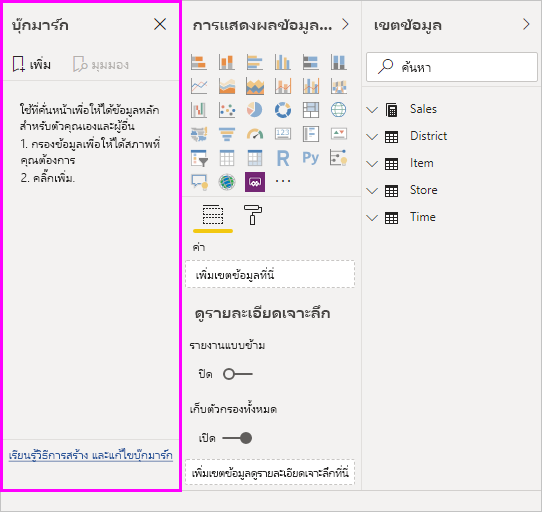

บุ๊กมาร์กสามารถใช้งานได้หลายทางThere are many uses for bookmarking. ตัวอย่างเช่น คุณสามารถใช้บุ๊กมาร์กเพื่อติดตามความคืบหน้าของคุณเองในการสร้างรายงาน (บุ๊กมาร์ก เพิ่ม ลบ และเปลี่ยนชื่อง่าย) และคุณสามารถสร้างบุ๊กมาร์กเพื่อสร้างงานนำเสนอที่คล้ายกับ PowerPoint โดยการไปยังบุ๊กมาร์กต่าง ๆ ตามลำดับ เพื่อบอกเล่าเรื่องราวรายงานของคุณFor example, you can use bookmarks to keep track of your own progress in creating reports (bookmarks are easy to add, delete, and rename) and you can create bookmarks to build a PowerPoint-like presentation that steps through bookmarks in order, thereby telling a story with your report. 

> [!TIP]
> สำหรับข้อมูลเกี่ยวกับการใช้บุ๊กมาร์กส่วนบุคคลในบริการของ Power BI โปรดดู[การประกาศเกี่ยวกับบุ๊กมาร์กส่วนบุคคลในบริการของ Power BI](https://powerbi.microsoft.com/blog/announcing-personal-bookmarks-in-the-power-bi-service/)For information about using personal bookmarks in the Power BI service, see [Announcing personal bookmarks in the Power BI Service](https://powerbi.microsoft.com/blog/announcing-personal-bookmarks-in-the-power-bi-service/). 

## การใช้บุ๊กมาร์กUsing bookmarks
เพื่อใช้บุ๊กมาร์ก เลือกแท็บ **มุมมอง** จากริบบอน Power BI Desktop จากนั้นเลือก **บานหน้าต่างบุ๊กมาร์ก**To use bookmarks, select the **View** tab from the Power BI Desktop ribbon, then select **Bookmarks Pane**. 

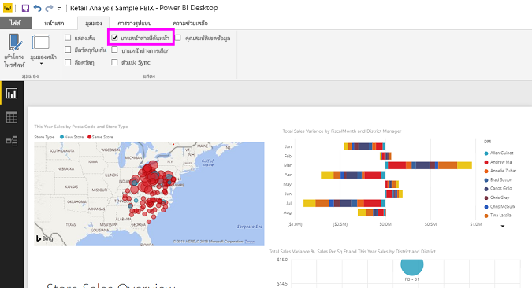

เมื่อคุณสร้างบุ๊กมาร์ก องค์ประกอบต่อไปนี้จะถูกบันทึกพร้อมบุ๊กมาร์ก:When you create a bookmark, the following elements are saved with the bookmark:

* หน้าปัจจุบันThe current page
* ตัวกรองFilters
* ตัวแบ่งส่วนข้อมูล รวมถึงชนิดตัวแบ่งส่วนข้อมูล (เช่น รายการดรอปดาวน์หรือรายการ) และสถานะของตัวแบ่งส่วนข้อมูลSlicers, including slicer type (for example, dropdown or list) and slicer state
* สถานะการเลือกการแสดงผลด้วยภาพ (เช่น ตัวกรองการไฮไลต์เชื่อมโยง)Visual selection state (such as cross-highlight filters)
* ลำดับการจัดเรียงSort order
* ตำแหน่งที่ดูรายละเอียดDrill location
* การแสดงผลวัตถุ (โดยใช้บานหน้าต่าง **การเลือก**)Visibility of an object (by using the **Selection** pane)
* โหมดโฟกัส หรือ **สปอตไลต์** ของวัตถุใด ๆ ที่มองเห็นได้The focus or **Spotlight** modes of any visible object

กำหนดค่าหน้ารายงานตามที่คุณต้องการให้ปรากฏในบุ๊กมาร์กConfigure a report page as you want it to appear in the bookmark. หลังจากนั้น หน้ารายงานของคุณและวิชวลถูกจัดเรียงในแบบที่คุณต้องการแล้ว เลือก **เพิ่ม** จากบานหน้าต่าง **บุ๊กมาร์ก** เพื่อเพิ่มบุ๊กมาร์กAfter your report page and visuals are arranged how you want them, select **Add** from the **Bookmarks** pane to add a bookmark. 

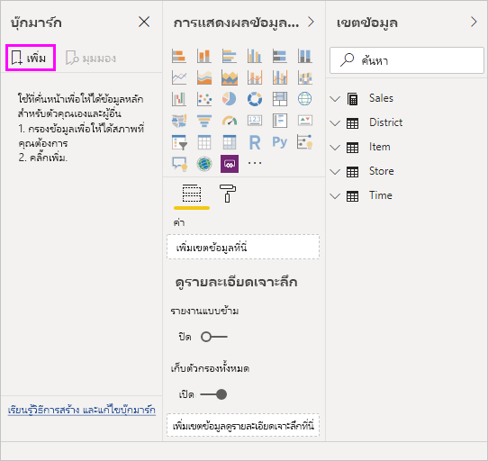

Power BI Desktop สร้างบุ๊กมาร์ก และให้ตั้งชื่อทั่วไปPower BI Desktop creates a bookmark and gives it a generic name. คุณสามารถ **เปลี่ยนชื่อ** **ลบ** หรือ **อัปเดด** บุ๊กมาร์ก ได้อย่างง่ายดายโดยการเลือกจุดไข่ปลาที่อยู่ถัดจากชื่อบุ๊กมาร์ก จากนั้นเลือกการดำเนินการจากเมนูที่ปรากฏขึ้นYou can easily **Rename**, **Delete**, or **Update** a bookmark by selecting the ellipsis next to the bookmark's name, then selecting an action from the menu that appears.

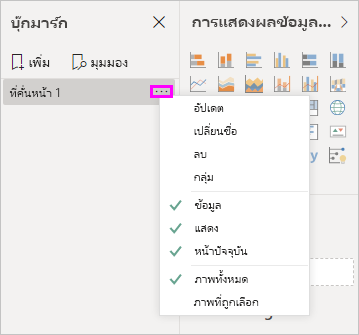

หลังจากที่คุณได้สร้างบุ๊กมาร์กแล้ว ให้แสดงโดยการเลือกในบานหน้าต่าง **บุ๊กมาร์ก**After you've created a bookmark, display it by selecting it in the **Bookmarks** pane. 

นอกจากนี้ คุณยังสามารถเลือกบุ๊กมาร์กแต่ละรายการที่จะใช้กับคุณสมบัติ **ข้อมูล** เช่น ตัวกรอง และตัวแบ่งส่วนข้อมูล, คุณสมบัติ **แสดงผล** เช่น สปอตไลต์ และการแสดงผล รวมถึงการเปลี่ยนแปลง **หน้าปัจจุบัน** ซึ่งแสดงหน้าที่มองเห็นเมื่อเพิ่มบุ๊กมาร์กYou can also select whether each bookmark will apply **Data** properties, such as filters and slicers; **Display** properties, such as spotlight and its visibility; and **Current page** changes, which present the page that was visible when the bookmark was added. ความสามารถนี้มีประโยชน์ เมื่อคุณใช้บุ๊กมาร์กเพื่อสลับระหว่างมุมมองรายงานหรือการเลือกวิชวล ซึ่งในกรณีนี้คุณจะต้องการปิดคุณสมบัติของข้อมูล เพื่อให้ตัวกรองไม่ถูกตั้งค่าใหม่เมื่อผู้ใช้งานเปลี่ยนมุมมองโดยการเลือกบุ๊กมาร์กThese capabilities are useful when you use bookmarks to switch between report views or selections of visuals, in which case you'd likely want to turn off data properties, so that filters aren't reset when users switch views by selecting a bookmark. 

เพื่อเปลี่ยนแปลงดังกล่าว เลือกที่จุดไข่ปลาที่อยู่ถัดจากชื่อบุ๊กมาร์ก จากนั้นเลือกหรือยกเลิกการเลือกเครื่องหมายที่อยู่ถัดจาก **ข้อมูล**, **การแสดงผล** และตัวควบคุมอื่น ๆTo make such changes, select the ellipsis next to the bookmark's name, then select or unselect the checkmarks next to **Data**, **Display**, and other controls. 

## การจัดเรียงบุ๊กมาร์กArranging bookmarks
เมื่อคุณสร้างบุ๊กมาร์ก คุณอาจพบว่าลำดับที่คุณสร้างขึ้นแตกต่างจากลำดับที่คุณต้องการนำเสนอให้กับผู้ชมของคุณAs you create bookmarks, you might find that the order in which you create them is different from the order you'd like to present to your audience. ไม่เป็นไร คุณสามารถเรียงลำดับบุ๊กมาร์กใหม่ได้อย่างง่ายดายNo problem, you can easily rearrange the order of bookmarks.

- ในบานหน้าต่าง **บุ๊กมาร์ก** ลากแล้วปล่อยบุ๊กมาร์กเพื่อเปลี่ยนลำดับIn the **Bookmarks** pane, drag-and-drop bookmarks to change their order. 

   แถบสีเหลืองระหว่างบุ๊กมาร์ก แสดงตำแหน่งที่บุ๊กมาร์กที่กำลังลากจะถูกวางThe yellow bar between bookmarks designates where the dragged bookmark will be placed.

   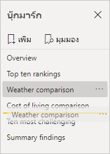

ลำดับของบุ๊กมาร์กเป็นเรื่องสำคัญ เมื่อคุณใช้คุณลักษณะ **มุมมอง** ของบุ๊กมาร์ก ตามที่จะอธิบายในส่วนถัดไปได้The order of your bookmarks can be important when you use the **View** feature of bookmarks, as described in the next section.

## ใช้บุ๊กมาร์กนำเสนอภาพนิ่งBookmarks as a slide show
เมื่อคุณมีคอลเลกชันบุ๊กมาร์ก ที่คุณต้องการนำเสนอตามลำดับ คุณสามารถเลือก **มุมมอง** จากบานหน้าต่าง **บุ๊กมาร์ก** เพื่อเริ่มการนำเสนอภาพนิ่งWhen you have a collection of bookmarks you would like to present, in order, you can select **View** from the **Bookmarks** pane to begin a slideshow.

เมื่ออยู่ในโหมด **มุมมอง** มีบางคุณสมบัติที่สังเกตได้When in **View** mode, there are some features to notice.

   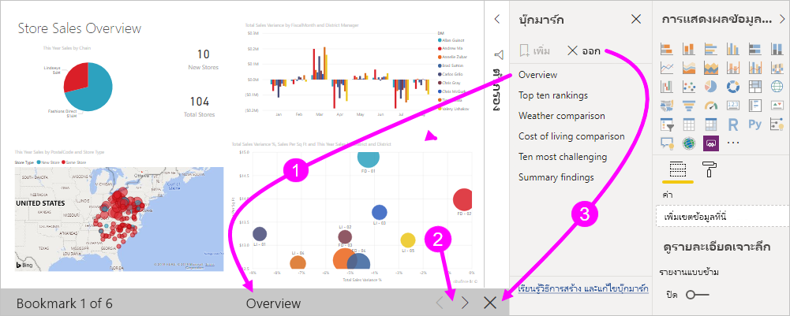

1. ชื่อบุ๊กมาร์กปรากฏในแถบชื่อเรื่องบุ๊กมาร์ก ซึ่งอยู่ด้านล่างของพื้นที่ทำงานThe name of the bookmark appears in the bookmark title bar, which appears at the bottom of the canvas.

2. แถบชื่อเรื่องบุ๊กมาร์ก มีลูกศรที่ช่วยให้คุณสามารถไปยังบุ๊กมาร์กถัดไป หรือก่อนหน้าได้The bookmark title bar has arrows that let you move to the next or previous bookmark.

3. คุณสามารถออกจากโหมด **มุมมอง** โดยการเลือก **ออกจาก** จากบานหน้าต่าง **บุ๊กมาร์ก** หรือโดยการเลือก **X** ในแถบชื่อเรื่องบุ๊กมาร์กได้You can exit **View** mode by selecting **Exit** from the **Bookmarks** pane or by selecting the **X** on the bookmark title bar. 

เมื่อคุณอยู่ในโหมด **มุมมอง** คุณสามารถปิดบานหน้าต่าง **บุ๊กมาร์ก** โดยการคลิก **X** บนบานหน้าต่างนั้นเพื่อให้มีพื้นที่เพิ่มเติมสำหรับงานนำเสนอของคุณได้When you're in **View** mode, you can close the **Bookmarks** pane, by selecting the **X** on that pane, to provide more space for your presentation. วิชวลทั้งหมดเป็นแบบโต้ตอบเมื่ออยู่ในโหมด **มุมมอง** และพร้อมสำหรับการไฮไลต์แบบเชื่อมโยง เช่นเดียวกับทีโต้ตอบกับวิชวลเหล่านั้นโดยตรงAll visuals are interactive when they're in **View** mode and available for cross-highlighting, just as they would be when you interact directly with them. 

## การมองเห็น: การใช้งานบานหน้าต่างการเลือกVisibility: Using the Selection pane
เกี่ยวกับบานหน้าต่าง **บุ๊กมาร์ก** บานหน้าต่าง **การเลือก** แสดงรายการของวัตถุทั้งหมดบนหน้าปัจจุบัน และช่วยให้คุณสามารถเลือกวัตถุ และระบุว่าสามารถมองเห็นวัตถุได้หรือไม่Related to the **Bookmarks** pane, the **Selection** pane provides a list of all objects on the current page and allows you to select an object and specify whether it's visible. 

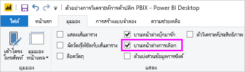

ในบานหน้าต่าง **การเลือก** คุณเลือกวัตถุและสลับว่าวัตถุสามารถมองเห็นได้หรือไม่ โดยการเลือกไอคอนรูปตาทางด้านขวาของวัตถุIn the **Selection** pane, you select an object and toggle whether the object is currently visible by selecting the eye icon to the right of the object. 

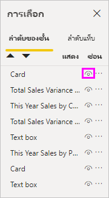

เมื่อคุณเพิ่มบุ๊กมาร์ก สถานะการมองเห็นของแต่ละวัตถุจะถูกบันทึกโดยยึดตามการตั้งค่าในบานหน้าต่าง **การเลือก**When you add a bookmark, the visibility status of each object is also saved, based on its setting in the **Selection** pane. 

สิ่งสำคัญที่ต้องทราบคือตัวแบ่งส่วนข้อมูลยังคงกรองหน้ารายงาน โดยไม่คำนึงถึงว่าตัวแบ่งส่วนข้อมูลจะมองเห็นได้หรือไม่It's important to note that slicers continue to filter a report page, regardless of whether they're visible. ด้วยเหตุนี้ คุณสามารถสร้างบุ๊กมาร์กจำนวนมาก โดยมีการตั้งค่าตัวแบ่งส่วนข้อมูลที่แตกต่างกัน และทำให้หน้ารายงานดูแตกต่างกันได้ (และไฮไลต์ข้อมูลเชิงลึกที่แตกต่างกัน) ในแต่ละบุ๊กมาร์กAs such, you can create many different bookmarks, with different slicer settings, and make a single report page appear different (and highlight different insights) in various bookmarks.

> [!NOTE]
> เมื่อใช้บานหน้าต่าง **การเลือก** ร่วมกับบุ๊กมาร์ก และเปลี่ยนการมองเห็นของการเลือก จะส่งผลในการมองเห็นที่จะย้อนกลับไปยังการตั้งค่าเริ่มต้นWhen using the **Selection** pane in combination with bookmarks, changing the visibility of a selection results in its visibility reverting to the default setting. หลังจากทำการเปลี่ยนแปลงดังกล่าวแล้ว คุณสามารถคลิกขวาที่บุ๊กมาร์กและเลือก *อัปเดต* เพื่ออัปเดตการมองเห็นได้After making such changes, you can right-click a bookmark and select *update* to update its visibility.

## บุ๊กมาร์กสำหรับรูปร่างและรูปภาพBookmarks for shapes and images
คุณยังสามารถเชื่อมโยงรูปร่างและรูปภาพไปยังบุ๊กมาร์กYou can also link shapes and images to bookmarks. ด้วยคุณลักษณะนี้ เมื่อคุณเลือกที่วัตถุ จะแสดงบุ๊กมาร์กที่เชื่อมโยงกับวัตถุนั้นWith this feature, when you select an object, it shows the bookmark associated with that object. คุณลักษณะนี้จะมีประโยชน์โดยเฉพาะอย่างยิ่งเมื่อคุณทำงานกับปุ่มThis feature can be especially useful when you work with buttons. สำหรับข้อมูลเพิ่มเติม ให้ดู [การใช้ปุ่มใน Power BI](desktop-buttons.md)For more information, see [Using buttons in Power BI](desktop-buttons.md). 

วิธีการกำหนดบุ๊กมาร์กสำหรับวัตถุ:To assign a bookmark to an object: 

1. เลือกวัตถุในพื้นที่รายงานSelect the object in the report canvas. แล้วจากบานหน้าต่าง **จัดรูปแบบรูปร่าง** ที่ปรากฏขึ้น ให้เปลี่ยนแถบเลื่อน **การดำเนินการ** เป็น **เปิด**Then, from the **Format Shape** pane that appears, turn the **Action** slider to **On**.

2. ขยายส่วน **การดำเนินการ**Expand the **Action** section. ภายใต้ **ชนิด** เลือก **บุ๊กมาร์ก**Under **Type**, select **Bookmark**.

3. ภายใต้ **บุ๊กมาร์ก** เลือกบุ๊กมาร์กUnder **Bookmarks**, select a bookmark.

   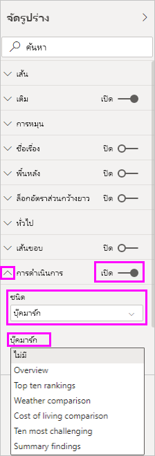

มีหลายสิ่งที่น่าสนใจ ที่คุณสามารถทำได้ ด้วยการเชื่อมโยงจากวัตถุไปเป็นบุ๊กมาร์กได้There are all sorts of interesting things you can do with object-linked bookmarking. คุณสามารถสร้างสารบัญวิชวลบนหน้ารายงานของคุณ หรือคุณสามารถกำหนดมุมมองต่าง ๆ (เช่น ชนิดของวิชวล) ของข้อมูลเดียวกันได้You can create a visual table of contents on your report page, or you can provide different views (such as visual types) of the same information.

เมื่อคุณอยู่ในโหมดการแก้ไข ให้กด **Ctrl** และเลือกลิงก์เพื่อติดตามWhen you're in editing mode, press **Ctrl** and select the link to follow it. เมื่อคุณไม่ได้อยู่ในโหมดการแก้ไข ให้เลือกวัตถุที่จะทำตามการเชื่อมโยงWhen you're not in editing mode, select the object to follow the link. 

## กลุ่มบุ๊คมาร์กBookmark groups

เริ่มด้วย Power BI Desktop รุ่นเดือนสิงหาคม 2018 คุณจะสามารถสร้างและใช้กลุ่มบุ๊กมาร์กได้Beginning with the August 2018 release of Power BI Desktop, you can create and use bookmark groups. กลุ่มบุ๊คมาร์กเป็นคอลเลกชันของบุ๊กมาร์กที่คุณระบุ ซึ่งสามารถแสดง และจัดระเบียบเป็นกลุ่มA bookmark group is a collection of bookmarks that you specify, which can be shown and organized as a group. 

วิธีการสร้างกลุ่มบุ๊กมาร์ก:To create a bookmark group: 
1. กด **Ctrl** และเลือกบุ๊กมาร์กที่คุณต้องการรวมไว้ในกลุ่มPress **Ctrl** and select the bookmarks you want to include in the group. 

2. เลือกจุดไข่ปลาถัดจากบุ๊กมาร์กที่คุณเลือก จากนั้นเลือก **กลุ่ม** จากเมนูที่ปรากฏขึ้นSelect the ellipsis next to your selected bookmarks, and then select **Group** from the menu that appears.

   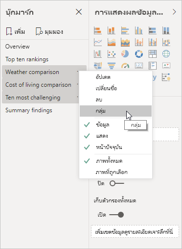

Power BI Desktop จะตั้งชื่อกลุ่ม *กลุ่ม 1* โดยอัตโนมัติPower BI Desktop automatically names the group *Group 1*. คุณสามารถเลือกจุดไข่ปลาที่อยู่ถัดจากชื่อนี้ได้ เลือก **เปลี่ยนชื่อ** และเปลี่ยนชื่อเป็นสิ่งที่คุณต้องการYou can select the ellipsis next to this name, select **Rename**, and rename it to whatever you want.

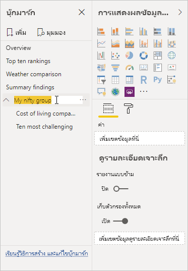

ด้วยกลุ่มบุ๊กมาร์กใด ๆ การขยายชื่อของกลุ่มบุ๊กมาร์กจะขยาย หรือยุบกลุ่มของบุ๊กมาร์กเท่านั้น และไม่แสดงบุ๊กมาร์กด้วยตัวเองAs with any bookmark group, expanding the bookmark group's name only expands or collapses the group of bookmarks, and doesn't represent a bookmark by itself. 

เมื่อคุณใช้คุณลักษณะ **มุมมอง** ของบุ๊กมาร์ก รายละเอียดต่อไปนี้จะนำไปใช้:When you use the **View** feature of bookmarks, the following details apply:

* ถ้าบุ๊กมาร์กที่เลือกอยู่ในกลุ่มเมื่อคุณเลือก **มุมมอง** จากบุ๊กมาร์ก เฉพาะบุ๊กมาร์ก *ในกลุ่มนั้น* จะแสดงในเซสชันการดูIf the selected bookmark is in a group when you select **View** from bookmarks, only the bookmarks *in that group* are shown in the viewing session. 

* ถ้าบุ๊กมาร์กที่เลือกไม่ได้อยู่ในกลุ่ม หรืออยู่ในระดับบนสุด (เช่น ชื่อกลุ่มบุ๊กมาร์ก) จากนั้นบุ๊กมาร์กทั้งหมดสำหรับทั้งรายงานจะแสดงขึ้นมา รวมถึงบุ๊กมาร์กในทุกกลุ่มIf the selected bookmark isn't in a group, or is on the top level (such as the name of a bookmark group), then all bookmarks for the entire report are played, including bookmarks in any group. 

วิธีการยกเลิกการจัดกลุ่มบุ๊กมาร์ก:To ungroup bookmarks: 
1. เลือกบุ๊กมาร์กใด ๆ ในกลุ่มและเลือกจุดไข่ปลาSelect any bookmark in a group and select the ellipsis. 

2. เลือก **ยกเลิกการจัดกลุ่ม** จากเมนูที่ปรากฏขึ้นSelect **Ungroup** from the menu that appears.

   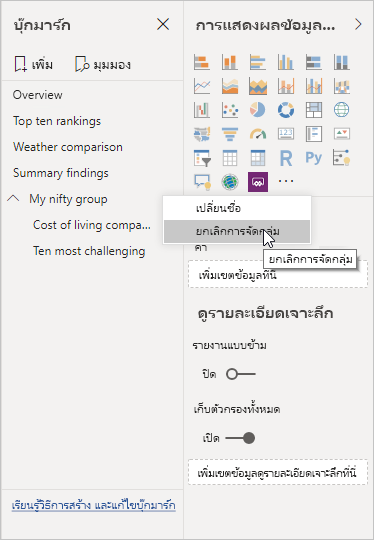

   การเลือก **ยกเลิกการจัดกลุ่ม** สำหรับบุ๊กมาร์กใด ๆ จากกลุ่มจะลบบุ๊กมาร์กทั้งหมดออกจากกลุ่ม ซึ่งจะลบกลุ่ม แต่ไม่ใช่ตัวบุ๊กมาร์กSelecting **Ungroup** for any bookmark from a group removes all bookmarks from the group; it deletes the group, but not the bookmarks themselves. 

วิธีการลบบุ๊กมาร์กเดี่ยวออกจากกลุ่ม:To remove a single bookmark from a group: 
1. **ยกเลิกการจัดกลุ่ม** สมาชิกใดก็ตามจากกลุ่มดังกล่าว ซึ่งจะลบกลุ่มทั้งหมด**Ungroup** any member from that group, which deletes the entire grouping. 

2. เลือกสมาชิกที่คุณต้องการในกลุ่มใหม่โดยการกด **Ctrl** และเลือกแต่ละบุ๊กมาร์กแล้วเลือก **จัดกลุ่ม** อีกครั้งSelect the members you want in the new group by pressing **Ctrl** and selecting each bookmark, then and select **Group** again. 

## การใช้สปอตไลต์Using spotlight
อีกคุณลักษณะที่เผยแพร่พร้อมกับบุ๊กมาร์กคือ *สปอตไลต์*Another feature released with bookmarks is *spotlight*. ด้วยสปอตไลต์ คุณสามารถดึงดูดความสนใจลงในเฉพาะแผนภูมิ เช่น เมื่อนำเสนอบุ๊กมาร์กของคุณในโหมด **มุมมอง** ได้With spotlight, you can draw attention to a specific chart, for example, when presenting your bookmarks in **View** mode.

เรามาเปรียบเทียบโหมดสปอตไลต์กับโหมดโฟกัส เพื่อดูความแตกต่างของทั้งสองโหมดLet's compare spotlight to focus mode to see how they differ:

1. ด้วยโหมดโฟกัส คุณเลือกไอคอน **โหมดโฟกัส** ของวิชวล ซึ่งทำให้วิชวลเติมพื้นที่ทั้งหมดWith focus mode, you select the **Focus mode** icon of a visual, which causes the visual to fill the entire canvas.

2. ด้วยสปอตไลต์ คุณเลือก **สปอตไลต์** จากจุดไข่ปลาของวิชวลเพื่อเน้นหนึ่งวิชวลในขนาดเดิม ซึ่งทำให้เกิดวิชวลอื่น ๆ ทั้งหมดบนหน้าเพื่อให้ใกล้เคียงกับความโปร่งใสWith spotlight, you select **Spotlight** from the ellipsis of a visual to highlight one visual in its original size, which causes all other visuals on the page to fade to near transparency. 

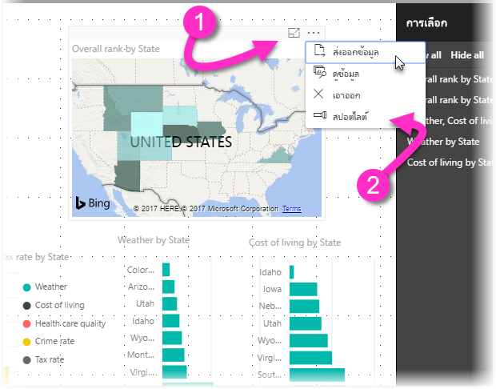

เมื่อคุณเลือกไอคอน **โหมดโฟกัส** ของวิชวลในรูปก่อนหน้านี้ หน้าจะปรากฏเป็นดังนี้:When you select the **Focus mode** icon of the visual in the previous image, the page appears as follows:

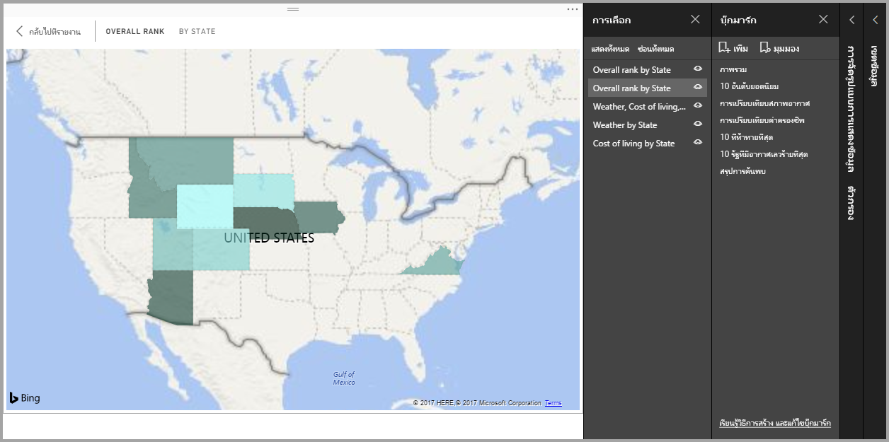

ในทางตรงข้าม เมื่อ **สปอตไลต์** ถูกเลือกจากเมนูจุดไข่ปลาของวิชวล หน้าจะปรากฎเป็นดังนี้:In contrast, when **Spotlight** is selected from the visual's ellipsis menu, the page appears as follows:

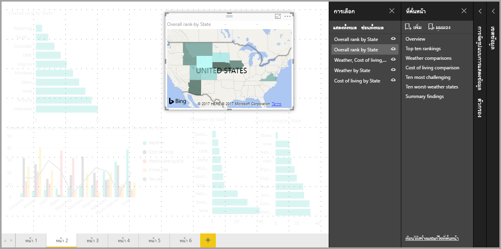

ถ้าเลือกโหมดโฟกัสหรือสปอตไลต์เมื่อคุณเพิ่มบุ๊กมาร์ก โหมดดังกล่าวจะถูกเก็บไว้ในบุ๊กมาร์กIf either the focus or spotlight mode is selected when you add a bookmark, that mode is retained in the bookmark.

## บุ๊กมาร์กในบริการของ Power BIBookmarks in the Power BI service
เมื่อคุณเผยแพร่รายงานไปยังบริการของ Power BI ที่มีอย่างน้อยหนึ่งบุ๊กมาร์ก คุณสามารถดูและโต้ตอบกับบุ๊กมาร์กเหล่านั้นในบริการของ Power BI ได้When you publish a report to the Power BI service with at least one bookmark, you can view and interact with those bookmarks in the Power BI service. เมื่อบุ๊กมาร์กพร้อมใช้งานในรายงาน คุณจะแสดงบานหน้าต่าง **การเลือก** และ **บุ๊กมาร์ก** โดยการเลือก **มุมมอง** > **บานหน้าต่างการเลือก** หรือ **มุมมอง** > **บานหน้าต่างบุ๊กมาร์ก**When bookmarks are available in a report, you display the **Selection** and **Bookmarks** panes by selecting **View** > **Selection pane** or **View** > **Bookmarks pane**. 

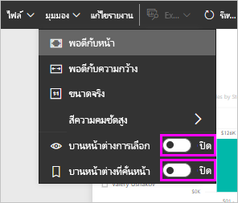

ในบริการของ Power BI บานหน้าต่าง **บุ๊กมาร์ก** จะทำงานเหมือนกับที่ทำงานใน Power BI Desktop รวมไปถึงความสามารถในการเลือก **มุมมอง** เพื่อแสดงบุ๊กมาร์กของคุณตามลำดับ เหมือนกับการนำเสนอภาพนิ่งIn the Power BI service, the **Bookmarks** pane operates just as it does in Power BI Desktop, including the ability to select **View** to show your bookmarks in order, like a slide show.

ใช้แถบชื่อเรื่องบุ๊กมาร์กสีเทาแทนลูกศรสีดำเพื่อนำทางผ่านบุ๊กมาร์กUse the gray bookmark title bar, instead of the black arrows, to navigate through the bookmarks. (ลูกศรสีดำย้ายคุณผ่านหน้ารายงาน ไม่ใช่บุ๊กมาร์ก)(The black arrows move you through report pages, not bookmarks.)

## เปิดใช้งานตัวอย่าง บุ๊กมาร์ก (เวอร์ชันก่อนเดือนมีนาคม 2018)Enable the bookmarks preview (versions prior to March 2018)
เริ่มตั้งแต่เวอร์ชัน มีนาคม 2018 ของ Power BI Desktop บุ๊กมาร์กมีให้ใช้งานโดยทั่วไปแล้วBeginning with the March 2018 version of Power BI Desktop, bookmarks are generally available. 

เราแนะนำให้คุณอัปเกรดเป็นการเผยแพร่ล่าสุดเสมอWe always suggest you upgrade to the most recent release. แต่ถ้าเวอร์ชัน Power BI Desktop ของคุณเป็นรุ่นก่อนหน้านั้น คุณยังสามารถลองคุณลักษณะบุ๊กมาร์ก เริ่มตั้งแต่รุ่นเดือนตุลาคม 2017 ของ Power BI Desktop และสำหรับรายงานที่เปิดใช้งานบุ๊กมาร์กใน บริการของ Power BI เช่นเดียวกันBut, if your version of Power BI Desktop is earlier than that release, you can try the bookmarks feature beginning with the October 2017 release of Power BI Desktop, and for bookmark-enabled reports, in the Power BI service as well. 

วิธีการเปิดใช้งานคุณลักษณะบุ๊กมาร์กแสดงตัวอย่าง:To enable the preview bookmarks feature: 

1. เลือก **ไฟล์** > **ตัวเลือกและการตั้งค่า** > **ตัวเลือก** > **คุณลักษณะตัวอย่าง** แล้วเลือก **บุ๊กมาร์ก**Select **File** > **Options and Settings** > **Options** > **Preview Features**, then select **Bookmarks**. 

   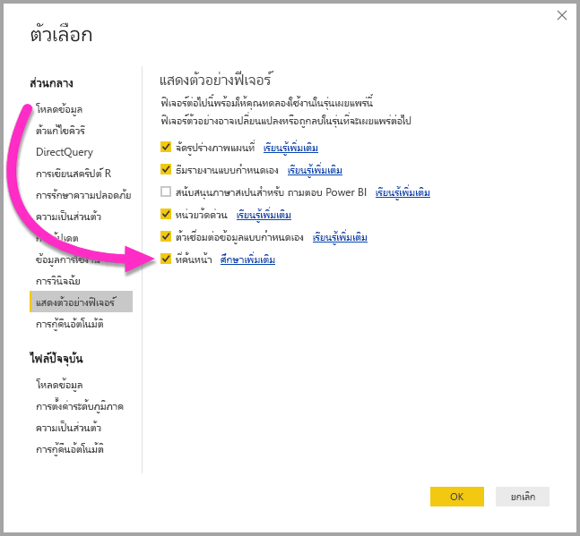

2. รีสตาร์ท Power BI Desktop เพื่อเปิดใช้งานเวอร์ชันตัวอย่างของบุ๊กมาร์กRestart Power BI Desktop to enable the preview version of bookmarks.

## ข้อจำกัดและข้อควรพิจารณาLimitations and considerations
ในบุ๊กมาร์กรุ่นนี้ มีข้อจำกัดและข้อควรพิจารณาบางอย่างIn this release of the bookmarks features, there are a few limitations and considerations to keep in mind.

* วิชวล Power BI ส่วนใหญ่ควรทำงานได้ดีกับการบุ๊กมาร์กMost Power BI visuals should work well with bookmarking. อย่างไรก็ตาม ถ้าคุณพบปัญหาเกี่ยวกับการบุ๊กมาร์กและวิชวลแบบกำหนดเอง ให้ติดต่อผู้สร้างวิชวลนั้น และขอให้พวกเขาจะเพิ่มการสนับสนุนบุ๊กมาร์กในวิชวลของตนHowever, if you encounter problems with bookmarking and a custom visual, contact the creator of that custom visual and ask them to add support for bookmarks to their visual. 
* ถ้าคุณเพิ่มวิชวลบนหน้ารายงานหลังจากการสร้างบุ๊กมาร์ก วิชวลจะแสดงในสถานะเริ่มต้นIf you add a visual on a report page after creating a bookmark, the visual is displayed in its default state. นั่นคือถ้าคุณเพิ่มตัวแบ่งส่วนข้อมูลลงในหน้าที่คุณเคยสร้างบุ๊กมาร์กไว้ก่อน ตัวแบ่งส่วนข้อมูลจะทำงานในสถานะเริ่มต้นThat is, if you introduce a slicer into a page where you previously created bookmarks, the slicer behaves in its default state.
* การย้ายวิชวลหลังจากการสร้างบุ๊กมาร์กแล้วจะมีผลในบุ๊กมาร์กโดยอัตโนมัติMoving a visual after a bookmark has been created is automatically reflected in the bookmark. 

## ขั้นตอนถัดไปNext steps
สำหรับข้อมูลเพิ่มเติมเกี่ยวกับคุณลักษณะที่คล้ายกัน หรือการโต้ตอบกับบุ๊กมาร์ก โปรดดูที่บทความต่อไปนี้:For more information about features that are similar or interact with bookmarks, see the following articles:

* [ใช้ตัวเจาะเข้าถึงรายละเอียดใน Power BI DesktopUse drillthrough in Power BI Desktop](desktop-drillthrough.md)
* [แสดงไทล์แดชบอร์ดหรือวิชวลรายงานในโหมดโฟกัสDisplay a dashboard tile or report visual in focus mode](../consumer/end-user-focus.md)
