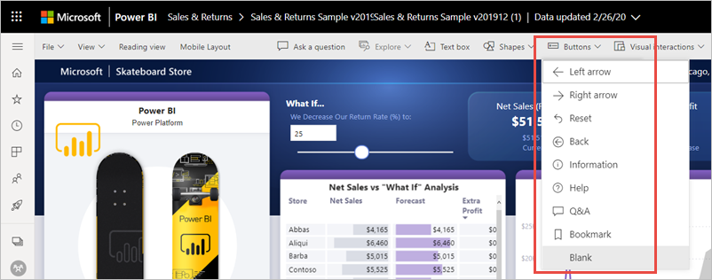
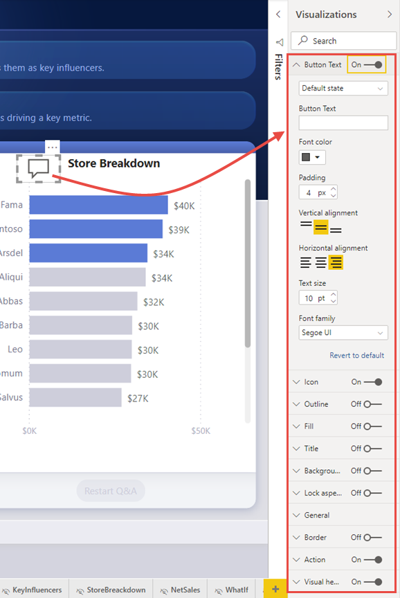
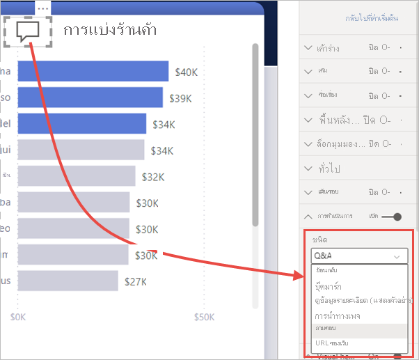

# ใช้ปุ่มใน Power BIUse buttons in Power BI
การใช้ **ปุ่ม** ใน Power BI ช่วยให้คุณสร้างรายงานที่ทำงานคล้ายกับแอป สร้างสภาพแวดล้อมที่น่าสนใจแก่ผู้ใช้ ให้ผู้ใช้สามารถโฮเวอร์ คลิก และโต้ตอบกับเนื้อหา Power BIUsing **buttons** in Power BI lets you create reports that behave similar to apps, and thereby, create an engaging environment so users can hover, click, and further interact with Power BI content. คุณสามารถเพิ่มปุ่มไปยังรายงานใน **Power BI Desktop** และใน **บริการของ Power BI** ได้You can add buttons to reports in **Power BI Desktop** and in the **Power BI service**. เมื่อคุณแชร์รายงานของคุณในบริการ Power BI ปุ่มเหล่านั้นจะช่วยสร้างประสบการณ์การใช้งานที่เหมือนกับแอปให้แก่ผู้ใช้ของคุณWhen you share your reports in the Power BI service, they provide an app-like experience for your users.

## สร้างปุ่มต่าง ๆ ในรายงานCreate buttons in reports

### สร้างปุ่มใน Power BI DesktopCreate a button in Power BI Desktop

หากต้องการสร้างปุ่มในรายงานของ **Power BI Desktop** ให้ไปที่ชุดแถบเครื่องมือ **แทรก** แล้วเลือก **ปุ่ม** และเมนูแบบหล่นลงจะปรากฏขึ้น ซึ่งคุณสามารถเลือกปุ่มที่คุณต้องการจากตัวเลือกต่าง ๆ ตามที่แสดงในรูปภาพต่อไปนี้To create a button in **Power BI Desktop**, on the **Insert** ribbon, select **Buttons** and a drop-down menu appears, where you can select the button you want from a collection of options, as shown in the following image. 

### สร้างปุ่มในบริการ Power BICreate a button in the Power BI service

หากต้องการสร้างปุ่มใน **บริการของ Power BI** ให้เปิดรายงานในมุมมองการแก้ไขTo create a button in the **Power BI service**, open the report in Editing view. เลือก **ปุ่ม** ในแถบเมนูด้านบนและเมนูแบบหล่นลงจะปรากฏขึ้น ซึ่งคุณสามารถเลือกปุ่มที่คุณต้องการจากตัวเลือกต่าง ๆ ตามที่แสดงในรูปภาพต่อไปนี้Select **Buttons** in the top menu bar and a drop-down menu appears, where you can select the button you want from a collection of options, as shown in the following image. 

## ปรับแต่งปุ่มCustomize a button

ไม่ว่าคุณจะสร้างปุ่มใน Power BI Desktop หรือบริการ Power BI กระบวนการในส่วนที่เหลือนั้นเหมือนกันWhether you create the button in Power BI Desktop or the Power BI service, the rest of the process is the same. เมื่อคุณเลือกปุ่มบนพื้นที่รายงาน บานหน้าต่าง **การแสดงภาพ** จะแสดงวิธีการหลายแบบที่คุณสามารถปรับแต่งปุ่มตามความต้องการของคุณได้When you select the button on the report canvas, the **Visualizations** pane shows you the many ways you can customize the button to fit your requirements. ตัวอย่างเช่น คุณสามารถเปิดหรือปิด **ข้อความปุ่ม** โดยการสลับแถบเลื่อนในการ์ดนั้นบนบานหน้าต่าง **การแสดงภาพ**For example, you can turn **Button Text** on or off by toggling the slider in that card of the **Visualizations** pane. คุณยังสามารถเปลี่ยนไอคอนของปุ่ม สีพื้นของปุ่ม ชื่อปุ่ม และการดำเนินการที่จะเกิดขึ้นเมื่อผู้ใช้เลือกปุ่มในรายงาน รวมไปถึงคุณสมบัติอื่น ๆ ได้You can also change the button icon, the button fill, the title, and the action that's taken when users select the button in a report, among other properties.

## ตั้งค่าคุณสมบัติของปุ่มเมื่ออยู่เฉย ๆ เมื่อโฮเวอร์เหนือ หรือถูกเลือกSet button properties when idle, hovered over, or selected

ปุ่มใน Power BI มีสามสถานะ: สถานะเริ่มต้น (ลักษณะที่ปรากฏเมื่อไม่ตัวชี้โฮเวอร์เหนือปุ่ม หรือถูกเลือก), เมื่อตัวชี้มาโฮเวอร์เหนือปุ่ม หรือเมื่อปุ่มถูกเลือก (มักจะเรียกว่าถูก *คลิก*)Buttons in Power BI have three states: default (how they appear when not hovered over or selected), when hovered over, or when selected (often referred to as being *clicked*). การ์ดจำนวนมากในบานหน้าต่าง **การจัดรูปแบบการแสดงข้อมูล** สามารถแก้ไขแยกตามสถานะทั้งสามนี้ ช่วยให้มีความยืดหยุ่นในการกำหนดปุ่มของคุณได้Many of the cards in the **Visualizations** pane can be modified individually based on those three states, providing plenty of flexibility for customizing your buttons.

การ์ดต่อไปนี้ในบานหน้าต่าง **การจัดรูปแบบการแสดงข้อมูล** ให้คุณปรับรูปแบบหรือลักษณะการทำงานของปุ่มที่ตามสถานะทั้งสามของมัน:The following cards in the **Visualizations** pane let you adjust formatting or behavior of a button based on its three states:

* ข้อความบนปุ่มButton Text
* ไอคอนIcon
* เค้าร่างOutline
* เติมFill

วิธีเลือกว่าจะแสดงปุ่มในแต่ละสถานะอย่างไร ให้ขยายการ์ดหนึ่งในนั้น แล้วเลือกรายการแบบหล่นลงที่ปรากฏด้านบนของการ์ดTo select how the button should appear for each state, expand one of those cards and select the drop-down that appears at the top of the card. ในรูปต่อไปนี้ คุณเห็นการ์ด **ไอคอน** ขยายออก โดยมีเมนูแบบหล่นลงที่เลือกไว้เพื่อแสดงสถานะสามรูปแบบ:In the following image, you see the **Icon** card expanded, with the drop-down selected to show the three states.

## เลือกการกระทำสำหรับปุ่มSelect the action for a button

คุณสามารถเลือกว่าจะดำเนินการอย่างไร เมื่อผู้ใช้เลือกปุ่มใน Power BIYou can select which action is taken when a user selects a button in Power BI. คุณสามารถเข้าถึงตัวเลือกสำหรับการกระทำของปุ่ม จากการ์ด **การกระทำ** ในบานหน้าต่าง **การจัดรูปแบบการแสดงข้อมูล** ได้You can access the options for button actions from the **Action** card in the **Visualizations** pane.

ต่อไปนี้คือตัวเลือกสำหรับการดำเนินการของปุ่มHere are the options for button actions:

- **ย้อนกลับ** จะส่งผู้ใช้กลับไปยังหน้ารายงานก่อนหน้านี้**Back** returns the user to the previous page of the report. ซึ่งมีประโยชน์สำหรับหน้าการเข้าถึงรายละเอียดThis is useful for drill-through pages.
- **บุ๊กมาร์ก** จะแสดงหน้ารายงานที่เชื่อมโยงกับบุ๊กมาร์กซึ่งกำหนดไว้สำหรับรายงานปัจจุบัน**Bookmark** presents the report page that's associated with a bookmark that is defined for the current report. เรียนรู้เพิ่มเติมเกี่ยวกับ[บุ๊กมาร์กใน Power BI](desktop-bookmarks.md)Learn more about [bookmarks in Power BI](desktop-bookmarks.md). 
- **การเข้าถึงรายละเอียด** จะนำทางผู้ใช้ไปยังหน้าการเข้าถึงรายละเอียดที่กรองตามการเลือกของผู้ใช้ โดยไม่ต้องใช้บุ๊กมาร์ก**Drill through** navigates the user to a drill-through page filtered to their selection, without using bookmarks. เรียนรู้เพิ่มเติมเกี่ยวกับ[ปุ่มการเข้าถึงรายละเอียดในรายงาน](desktop-drill-through-buttons.md)Learn more about [drill-through buttons in reports](desktop-drill-through-buttons.md).
- **การนำทางไปยังหน้า** จะนำทางผู้ใช้ไปยังหน้าต่าง ๆ ภายในรายงาน โดยไม่ต้องใช้บุ๊กมาร์กเช่นกัน**Page navigation** navigates the user to a different page within the report, also without using bookmarks. ดูรายละอียดที่ [สร้างการนำทางไปยังหน้า](#create-page-navigation) ในบทความนี้See [Create page navigation](#create-page-navigation) in this article for details.
- **ถามตอบ** จะเปิดหน้าต่าง **Q&A Explorer****Q&A** opens a **Q&A Explorer** window. 

ปุ่มบางปุ่มมีการดำเนินการตามค่าเริ่มต้นที่เลือกไว้โดยอัตโนมัติแล้วCertain buttons have a default action selected automatically. ตัวอย่างเช่น ปุ่มชนิด **ถามตอบ** จะเลือก **ถามตอบ** เป็นค่าเริ่มต้นของการกระทำFor example, the **Q&A** button type automatically selects **Q&A** as the default action. คุณสามารถเรียนรู้เพิ่มเติมเกี่ยวกับ **Q&A Explorer** ได้โดยศึกษาจาก [บล็อกโพสต์นี้](https://powerbi.microsoft.com/blog/power-bi-desktop-april-2018-feature-summary/#Q&AExplorer)You can learn more about **Q&A Explorer** by checking out [this blog post](https://powerbi.microsoft.com/blog/power-bi-desktop-april-2018-feature-summary/#Q&AExplorer).

คุณสามารถลองหรือทดสอบปุ่มที่คุณสร้างในรายงาน โดย *CTRL + คลิก* บนปุ่มคุณต้องการใช้You can try or test the buttons you create for your report by using *CTRL+CLICK* on the button you want to use. 

## สร้างการนำทางไปยังหน้าCreate page navigation

ด้วยประเภท **การดำเนินการ** ใน **การนำทางไปยังหน้า** คุณสามารถสร้างประสบการณ์การนำทางที่ครบถ้วนได้โดยไม่ต้องบันทึกหรือจัดการบุ๊กมาร์กใดๆ เลยWith the **Action** type **Page navigation**, you can build an entire navigation experience without having to save or manage any bookmarks at all.

หากต้องการตั้งค่าปุ่มการนำทางไปยังหน้า ให้สร้างปุ่ม **การนำทางไปยังหน้า** เป็นประเภทการดำเนินการ และเลือกหน้า **ปลายทาง**To set up a page navigation button, create a button with **Page navigation** as the action type, and select the **Destination** page.

คุณสามารถสร้างบานหน้าต่างการนำทางแบบกำหนดเองและเพิ่มปุ่มการนำทางลงไปได้You can build a custom navigation pane, and add the navigation buttons to it. คุณสามารถหลีกเลี่ยงการแก้ไขและการจัดการบุ๊กมาร์กได้ หากคุณต้องการเปลี่ยนหน้าที่จะแสดงในบานหน้าต่างการนำทางของคุณYou avoid having to edit and manage bookmarks if you want to change which pages to show in your navigation pane.

นอกจากนี้ คุณยังสามารถจัดรูปแบบกล่องแสดงคำอธิบายตามเงื่อนไขซึ่งคุณสามารถดำเนินการกับปุ่มประเภทอื่นได้Additionally, you can conditionally format the tooltip as you can do with other button types.

## ตั้งค่าปลายทางการนำทางตามเงื่อนไขSet the navigation destination conditionally

คุณสามารถใช้การจัดรูปแบบตามเงื่อนไขเพื่อตั้งค่าปลายทางการนำทาง ตามผลลัพธ์ของหน่วยวัดได้You can use conditional formatting to set the navigation destination, based on the output of a measure. ตัวอย่างเช่น คุณอาจต้องการประหยัดเนื้อที่บนพื้นที่รายงานของคุณ ด้วยการมีเพียงปุ่มเดียวที่ใช้เพื่อนำทางไปยังหน้าอื่นๆ ตามการเลือกของผู้ใช้For example, you may want to save space on your report canvas by having a single button to navigate to different pages based on the user’s selection.

:::image type="content" source="media/desktop-buttons/button-navigate-go.png" alt-text="นำทางด้วยปุ่ม ไป":::
 
หากต้องการสร้างตัวอย่างดังแสดงด้านบน ให้เริ่มต้นโดยสร้างตารางแบบคอลัมน์เดียวที่มีชื่อของปลายทางการนำทาง:To create the example shown above, start by creating a single-column table with the names of the navigation destinations:

:::image type="content" source="media/desktop-buttons/button-create-table.png" alt-text="สร้างตาราง":::

Power BI ใช้การจับคู่สตริงที่เหมือนกันเพื่อตั้งค่าปลายทางการเข้าถึงรายละเอียด ดังนั้นโปรดตรวจสอบให้แน่ใจว่าค่าที่ป้อนตรงกับชื่อหน้าการเข้าถึงรายละเอียดของคุณPower BI uses exact string match to set the drill-through destination, so double-check that the entered values exactly align with your drill-through page names.

หลังจากที่คุณได้สร้างตารางแล้ว ให้เพิ่มตารางลงในหน้าเป็นตัวแบ่งส่วนข้อมูลแบบเลือกครั้งเดียว:After you've created the table, add it to the page as a single-select slicer:

:::image type="content" source="media/desktop-buttons/button-navigate-slicer.png" alt-text="ตัวแบ่งส่วนข้อมูลการนำทาง":::

จากนั้นสร้างปุ่มการนำทางไปยังหน้าและเลือกตัวเลือกการจัดรูปแบบตามเงื่อนไขสำหรับปลายทาง:Then create a page navigation button and select the conditional formatting option for the destination:

:::image type="content" source="media/desktop-buttons/button-set-page-nav-destination.png" alt-text="ปุ่มการนำทางไปยังหน้า":::
 
เลือกชื่อของคอลัมน์ที่คุณสร้างขึ้น ในกรณีนี้ **เลือกปลายทาง**:Select the name of the column you created, in this case, **Select a destination**:

:::image type="content" source="media/desktop-buttons/button-select-destination.png" alt-text="เลือกปลายทาง":::

ตอนนี้ปุ่มสามารถนำทางไปยังหน้าอื่นๆ ได้โดยขึ้นอยู่กับการเลือกของผู้ใช้Now the button can navigate to different pages, depending on the user’s selection.

:::image type="content" source="media/desktop-buttons/button-navigate-go.png" alt-text="นำทางด้วยปุ่ม ไป":::
 
### รูปร่างและรูปภาพสำหรับการนำทางShapes and images for navigation

การดำเนินการนำทางไปยังหน้าสามารถรองรับรูปร่างและรูปภาพได้ ไม่ใช่เพียงแค่ปุ่มเท่านั้นPage navigation action is supported for shapes and images, not just buttons. ต่อไปนี้เป็นตัวอย่างที่ใช้หนึ่งในรูปร่างที่มีอยู่ภายใน:Here’s an example using one of the built-in shapes:

:::image type="content" source="media/desktop-buttons/button-navigation-arrow.png" alt-text="ใช้ลูกศรสำหรับการนำทาง":::
 
ต่อไปนี้คือตัวอย่างที่ใช้รูปภาพ:Here’s an example using an image:

:::image type="content" source="media/desktop-buttons/button-navigation-image.png" alt-text="ใช้รูปภาพสำหรับการนำทาง":::
 
## ปุ่มรองรับรูปภาพแบบ Fill imageButtons support fill images

ปุ่มรองรับรูปภาพแบบ Fill imageButtons support fill images. คุณสามารถปรับแต่งรูปลักษณ์และสัมผัสของปุ่มของคุณด้วยรูปภาพแบบ Fill image ร่วมกับสถานะปุ่มที่มีอยู่ภายในได้: ตามค่าเริ่มต้น เมื่อเลื่อนเมาส์ เมื่อกด และปิดใช้งาน (สำหรับการเข้าถึงรายละเอียด)You can customize the look and feel of your button with fill images combined with the built-in button states: default, on hover, on press, and disabled (for drill through).

:::image type="content" source="media/desktop-drill-through-buttons/drill-through-fill-images.png" alt-text="รูปภาพแบบ Fill image ของปุ่มการเข้าถึงรายละเอียด":::

ตั้งค่า **Fill** เป็น **เปิด** จากนั้นสร้างรูปภาพสำหรับสถานะที่แตกต่างกันSet **Fill** to **On**, then create images for the different states.

:::image type="content" source="media/desktop-drill-through-buttons/drill-through-fill-state-settings.png" alt-text="การตั้งค่ารูปภาพแบบ Fill image":::

## ขั้นตอนถัดไปNext steps
สำหรับข้อมูลเพิ่มเติมเกี่ยวกับ คุณลักษณะที่คล้ายกัน หรือการโต้ตอบกับปุ่ม โปรดดูที่บทความต่อไปนี้:For more information about features that are similar or interact with buttons, take a look at the following articles:

* [ใช้การเข้าถึงรายละเอียดในรายงาน Power BIUse drill through in Power BI reports](desktop-drillthrough.md)
* [ใช้บุ๊กมาร์กเพื่อแชร์ข้อมูลเชิงลึก และสร้างเรื่องราวใน Power BIUse bookmarks to share insights and build stories in Power BI](desktop-bookmarks.md)
* [สร้างปุ่มการเข้าถึงรายละเอียดCreate a drill-through button](desktop-drill-through-buttons.md)

