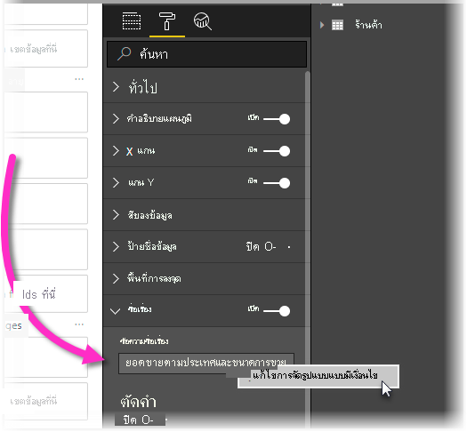
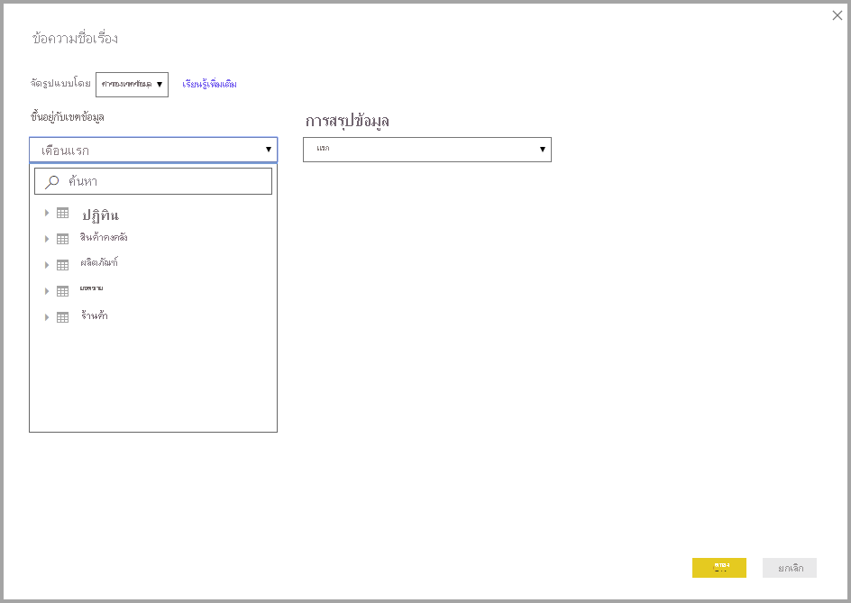

# <a name="expression-based-titles-in-power-bi-desktop"></a><span data-ttu-id="3ceb1-103">ชื่อเรื่องตามนิพจน์ใน Power BI Desktop</span><span class="sxs-lookup"><span data-stu-id="3ceb1-103">Expression-based titles in Power BI Desktop</span></span>

<span data-ttu-id="3ceb1-104">คุณสามารถสร้างชื่อเรื่องแบบไดนามิกที่กำหนดเองสำหรับวิชวลของ Power BI ของคุณได้</span><span class="sxs-lookup"><span data-stu-id="3ceb1-104">You can create dynamic, customized titles for your Power BI visuals.</span></span> <span data-ttu-id="3ceb1-105">ด้วยการสร้างนิพจน์การวิเคราะห์ข้อมูล (DAX) ที่ขึ้นอยู่กับเขตข้อมูล ตัวแปร หรือองค์ประกอบทางการเขียนโปรแกรมอื่นๆ ซึ่งชื่อเรื่องของวิชวลจะถูกปรับเปลี่ยนโดยอัตโนมัติตามความต้องการ</span><span class="sxs-lookup"><span data-stu-id="3ceb1-105">By creating Data Analysis Expressions (DAX) based on fields, variables, or other programmatic elements, your visuals' titles can automatically adjust as needed.</span></span> <span data-ttu-id="3ceb1-106">การเปลี่ยนแปลงเหล่านี้จะขึ้นอยู่กับตัวกรอง การเลือก หรือการโต้ตอบและการกำหนดค่าของผู้ใช้อื่นๆ</span><span class="sxs-lookup"><span data-stu-id="3ceb1-106">These changes are based on filters, selections, or other user interactions and configurations.</span></span>



<span data-ttu-id="3ceb1-108">สร้างชื่อเรื่องแบบไดนามิก บางครั้งเรียกว่า *ชื่อเรื่องตามนิพจน์* จะตรงไปตรงมา</span><span class="sxs-lookup"><span data-stu-id="3ceb1-108">Creating dynamic titles, sometimes called *expression-based titles*, is straightforward.</span></span> 

## <a name="create-a-field-for-your-title"></a><span data-ttu-id="3ceb1-109">สร้างเขตข้อมูลสำหรับชื่อเรื่องของคุณ</span><span class="sxs-lookup"><span data-stu-id="3ceb1-109">Create a field for your title</span></span>

<span data-ttu-id="3ceb1-110">ขั้นตอนแรกในการสร้างชื่อเรื่องตามนิพจน์คือการสร้างเขตข้อมูลในแบบจำลองของคุณเพื่อใช้สำหรับชื่อเรื่อง</span><span class="sxs-lookup"><span data-stu-id="3ceb1-110">The first step in creating an expression-based title is to create a field in your model to use for the title.</span></span> 

<span data-ttu-id="3ceb1-111">มีวิธีที่สร้างสรรค์มากมายที่จะทำให้ชื่อวิชวลของคุณสะท้อนถึงสิ่งที่คุณต้องการให้พูดหรือสิ่งที่คุณต้องการแสดง</span><span class="sxs-lookup"><span data-stu-id="3ceb1-111">There are all sorts of creative ways to have your visual title reflect what you want it to say, or what you want to express.</span></span> <span data-ttu-id="3ceb1-112">มาลองดูตัวอย่างซักสองตัวอย่างกันเถอะ</span><span class="sxs-lookup"><span data-stu-id="3ceb1-112">Let's take a look at a couple examples.</span></span>

<span data-ttu-id="3ceb1-113">คุณสามารถสร้างนิพจน์ที่เปลี่ยนแปลงตามบริบทตัวกรองที่วิชวลได้รับสำหรับชื่อแบรนด์ของผลิตภัณฑ์ได้</span><span class="sxs-lookup"><span data-stu-id="3ceb1-113">You can create an expression that changes based on the filter context that the visual receives for the product's brand name.</span></span> <span data-ttu-id="3ceb1-114">รูปภาพต่อไปนี้แสดงสูตร DAX สำหรับเขตข้อมูลดังกล่าว</span><span class="sxs-lookup"><span data-stu-id="3ceb1-114">The following image shows the DAX formula for such a field.</span></span>


<span data-ttu-id="3ceb1-116">อีกตัวอย่างหนึ่งคือการใช้ชื่อเรื่องแบบไดนามิกที่เปลี่ยนแปลงตามภาษาหรือวัฒนธรรมของผู้ใช้</span><span class="sxs-lookup"><span data-stu-id="3ceb1-116">Another example is using a dynamic title that changes based on the user's language or culture.</span></span> <span data-ttu-id="3ceb1-117">คุณสามารถสร้างชื่อเรื่องเฉพาะภาษาในหน่วยวัด DAX โดยใช้ฟังก์ชัน `USERCULTURE()`</span><span class="sxs-lookup"><span data-stu-id="3ceb1-117">You can create language-specific titles in a DAX measure by using the `USERCULTURE()` function.</span></span> <span data-ttu-id="3ceb1-118">ฟังก์ชันนี้ส่งกลับรหัสวัฒนธรรมสำหรับผู้ใช้โดยยึดตามระบบปฏิบัติการหรือการตั้งค่าเบราว์เซอร์ของผู้ใช้</span><span class="sxs-lookup"><span data-stu-id="3ceb1-118">This function returns the culture code for the user, based on their operating system or browser settings.</span></span> <span data-ttu-id="3ceb1-119">คุณสามารถใช้คำสั่ง DAX switch ดังต่อไปนี้เพื่อเลือกค่าที่ผ่านการแปลอย่างถูกต้องได้</span><span class="sxs-lookup"><span data-stu-id="3ceb1-119">You can use the following DAX switch statement to select the correct translated value.</span></span> 

```
SWITCH (
  USERCULTURE(),
  "de-DE", “Umsatz nach Produkt”,
  "fr-FR", “Ventes par produit”,
  “Sales by product”
)
```

<span data-ttu-id="3ceb1-120">หรือคุณสามารถเรียกใช้สตริงของตาราง Lookup ที่ประกอบด้วยการแปลทั้งหมดได้</span><span class="sxs-lookup"><span data-stu-id="3ceb1-120">Or you can retrieve the string from a lookup table that contains all the translations.</span></span> <span data-ttu-id="3ceb1-121">คุณวางตารางนั้นในแบบจำลองของคุณ</span><span class="sxs-lookup"><span data-stu-id="3ceb1-121">You  place that table in your model.</span></span> 

<span data-ttu-id="3ceb1-122">นี่เป็นเพียงตัวอย่างสองแบบที่คุณสามารถใช้เพื่อสร้างชื่อเรื่องตามนิพจน์แบบไดนามิกสำหรับวิชวลของคุณใน Power BI Desktop ได้</span><span class="sxs-lookup"><span data-stu-id="3ceb1-122">These are just a couple of examples you can use to create dynamic, expression-based titles for your visuals in Power BI Desktop.</span></span> <span data-ttu-id="3ceb1-123">สิ่งที่คุณสามารถทำได้กับชื่อของคุณนั้นถูกจำกัดด้วยจินตนาการและแบบจำลองของคุณเท่านั้น</span><span class="sxs-lookup"><span data-stu-id="3ceb1-123">What you can do with your titles are limited only by your imagination, and your model.</span></span>


## <a name="select-your-field-for-your-title"></a><span data-ttu-id="3ceb1-124">เลือกเขตข้อมูลสำหรับชื่อเรื่องของคุณ</span><span class="sxs-lookup"><span data-stu-id="3ceb1-124">Select your field for your title</span></span>

<span data-ttu-id="3ceb1-125">หลังจากที่คุณได้สร้างนิพจน์ DAX สำหรับเขตข้อมูลที่คุณสร้างในแบบจำลองของคุณแล้ว คุณจำเป็นต้องนำไปใช้กับชื่อของวิชวลของคุณ</span><span class="sxs-lookup"><span data-stu-id="3ceb1-125">After you've created the DAX expression for the field you create in your model, you need to apply it to your visual's title.</span></span>

<span data-ttu-id="3ceb1-126">หากต้องการเลือกเขตข้อมูลและนำไปใช้ ให้ไปที่บานหน้าต่าง **การแสดงผลด้วยภาพข้อมูล**</span><span class="sxs-lookup"><span data-stu-id="3ceb1-126">To select the field and apply it, go to the **Visualizations** pane.</span></span> <span data-ttu-id="3ceb1-127">ในพื้นที่ **รูปแบบ** ให้เลือก **ชื่อ** เพื่อแสดงตัวเลือกชื่อเรื่องสำหรับวิชวล</span><span class="sxs-lookup"><span data-stu-id="3ceb1-127">In the **Format** area, select **Title** to show the title options for the visual.</span></span> 

<span data-ttu-id="3ceb1-128">เมื่อคุณคลิกขวาที่ **ข้อความหัวเรื่อง** เมนูบริบทจะปรากฏขึ้นเพื่อให้คุณเลือก **<em>fx</em>การจัดรูปแบบตามเงื่อนไข**</span><span class="sxs-lookup"><span data-stu-id="3ceb1-128">When you right-click **Title text**, a context menu appears that allows you to select **<em>fx</em>Conditional formatting**.</span></span> <span data-ttu-id="3ceb1-129">เมื่อคุณเลือกรายการเมนูนั้น กล่องโต้ตอบ **ข้อความชื่อเรื่อง** จะปรากฏขึ้น</span><span class="sxs-lookup"><span data-stu-id="3ceb1-129">When you select that menu item, a **Title text** dialog box appears.</span></span> 



<span data-ttu-id="3ceb1-131">จากหน้าต่างนั้น คุณสามารถเลือกเขตข้อมูลที่คุณสร้างขึ้นเพื่อใช้สำหรับชื่อเรื่องของคุณได้</span><span class="sxs-lookup"><span data-stu-id="3ceb1-131">From that window, you can select the field that you created to use for your title.</span></span>

## <a name="limitations-and-considerations"></a><span data-ttu-id="3ceb1-132">ข้อจำกัดและข้อควรพิจารณา</span><span class="sxs-lookup"><span data-stu-id="3ceb1-132">Limitations and considerations</span></span>

<span data-ttu-id="3ceb1-133">มีข้อจำกัดบางอย่างสำหรับการนำชื่อเรื่องตามนิพจน์สำหรับวิชวลไปใช้งานในปัจจุบัน:</span><span class="sxs-lookup"><span data-stu-id="3ceb1-133">There are a few limitations to the current implementation of expression-based titles for visuals:</span></span>

* <span data-ttu-id="3ceb1-134">ในปัจจุบันการจัดรูปแบบตามนิพจน์ไม่รองรับวิชวลบน Python, วิชวลบน R หรือวิชวลของผู้มีอิทธิพลที่สำคัญ</span><span class="sxs-lookup"><span data-stu-id="3ceb1-134">Expression-based formatting isn’t currently supported on Python visuals, R visuals, or the Key Influencers visual.</span></span>
* <span data-ttu-id="3ceb1-135">เขตข้อมูลที่คุณสร้างขึ้นสำหรับชื่อเรื่องต้องเป็นชนิดข้อมูลสตริง</span><span class="sxs-lookup"><span data-stu-id="3ceb1-135">The field you create for the title must be a string data type.</span></span> <span data-ttu-id="3ceb1-136">หน่วยวัดที่ส่งกลับตัวเลขหรือวันที่/เวลา (หรือชนิดข้อมูลอื่นๆ) ไม่ได้รับการสนับสนุนในขณะนี้</span><span class="sxs-lookup"><span data-stu-id="3ceb1-136">Measures that return numbers or date/time (or any other data type) aren't currently supported.</span></span>
* <span data-ttu-id="3ceb1-137">ชื่อเรื่องตามนิพจน์จะไม่ถูกนำมาใช้เมื่อคุณปักหมุดวิชวลไปยังแดชบอร์ด</span><span class="sxs-lookup"><span data-stu-id="3ceb1-137">Expression based titles aren't carried over when you pin a visual to a dashboard.</span></span>

## <a name="next-steps"></a><span data-ttu-id="3ceb1-138">ขั้นตอนถัดไป</span><span class="sxs-lookup"><span data-stu-id="3ceb1-138">Next steps</span></span>

<span data-ttu-id="3ceb1-139">บทความนี้อธิบายวิธีการสร้างนิพจน์ DAX ที่เปลี่ยนชื่อเรื่องของวิชวลของคุณลงในเขตข้อมูลแบบไดนามิก ซึ่งสามารถเปลี่ยนแปลงได้เมื่อผู้ใช้โต้ตอบกับรายงานของคุณ</span><span class="sxs-lookup"><span data-stu-id="3ceb1-139">This article described how to create DAX expressions that turn the titles of your visuals into dynamic fields that can change as users interact with your reports.</span></span> <span data-ttu-id="3ceb1-140">คุณอาจพบว่าบทความต่อไปนี้มีประโยชน์เช่นกัน</span><span class="sxs-lookup"><span data-stu-id="3ceb1-140">You might find the following articles useful as well.</span></span>

* [<span data-ttu-id="3ceb1-141">การจัดรูปแบบตามเงื่อนไขในตาราง</span><span class="sxs-lookup"><span data-stu-id="3ceb1-141">Conditional formatting in tables</span></span>](desktop-conditional-table-formatting.md)
* [<span data-ttu-id="3ceb1-142">ใช้ตัวเจาะเข้าถึงรายละเอียดข้ามรายงานใน Power BI Desktop</span><span class="sxs-lookup"><span data-stu-id="3ceb1-142">Use cross-report drillthrough in Power BI Desktop</span></span>](desktop-cross-report-drill-through.md)
* [<span data-ttu-id="3ceb1-143">ใช้ตัวเจาะเข้าถึงรายละเอียดใน Power BI Desktop</span><span class="sxs-lookup"><span data-stu-id="3ceb1-143">Use drillthrough in Power BI Desktop</span></span>](desktop-drillthrough.md)
