# ใช้การจัดรูปแบบตามเงื่อนไขในตารางUse conditional formatting in tables 

ด้วยการจัดรูปแบบตามเงื่อนไขสำหรับตารางใน Power BI Desktop คุณสามารถระบุสีของเซลล์ รวมถึงการไล่ระดับสี โดยขึ้นอยู่กับค่าของเขตข้อมูลWith conditional formatting for tables in Power BI Desktop, you can specify customized cell colors, including color gradients, based on field values. นอกจากนี้คุณยังสามารถแสดงค่าเซลล์ด้วยแถบข้อมูลหรือไอคอน KPI หรือในฐานะลิงก์เว็บที่ใช้งานอยู่You can also represent cell values with data bars or KPI icons, or as active web links. คุณสามารถใช้การจัดรูปแบบตามเงื่อนไขกับข้อความหรือเขตข้อมูลใดก็ตามได้ตราบใดที่คุณจัดรูปแบบตามเขตข้อมูลที่มีตัวเลข ชื่อสี หรือรหัสฐานสิบหกหรือค่า URL ของเว็บYou can apply conditional formatting to any text or data field, as long as you base the formatting on a field that has numeric, color name or hex code, or web URL values. 

เมื่อต้องการใช้การจัดรูปแบบตามเงื่อนไข ให้เลือกการแสดงผลข้อมูลด้วยภาพแบบ **ตาราง** หรือ **เมทริกซ์** ใน Power BI DesktopTo apply conditional formatting, select a **Table** or **Matrix** visualization in Power BI Desktop. ในส่วน **เขตข้อมูล** ของบานหน้าต่าง **การแสดงผลข้อมูลด้วยภาพ** ให้คลิกขวาหรือเลือกลูกศรลงที่อยู่ถัดจากเขตข้อมูลใน **ค่า** ที่คุณต้องการจัดรูปแบบIn the **Fields** section of the **Visualizations** pane, right-click or select the down-arrow next to the field in the **Values** well that you want to format. เลือก **การจัดรูปแบบตามเงื่อนไข** จากนั้นเลือกประเภทของการจัดรูปแบบที่จะใช้Select **Conditional formatting**, and then select the type of formatting to apply.

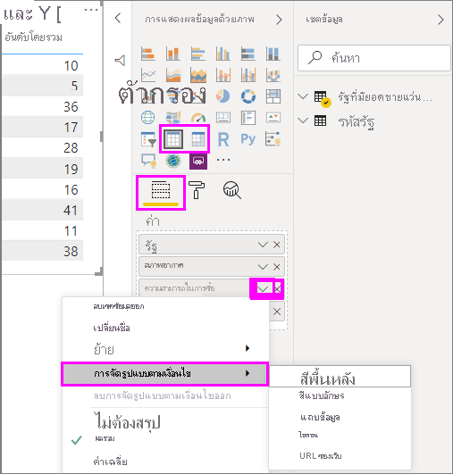

> [!NOTE]
> การจัดรูปแบบตามเงื่อนไขจะแทนที่พื้นหลังหรือสีฟอนต์แบบกำหนดเองที่คุณนำไปใช้กับเซลล์ที่มีการจัดรูปแบบตามเงื่อนไขConditional formatting overrides any custom background or font color you apply to the conditionally formatted cell.

เพื่อเอาการจัดรูปแบบตามเงื่อนไขออกจากวิชวล ให้เลือก **ลบการจัดรูปแบบตามเงื่อนไขออก** จากเมนูแบบเลื่อนลงของเขตข้อมูล จากนั้นให้เลือกชนิดของการจัดรูปแบบที่จะเอาออกTo remove conditional formatting from a visualization, select **Remove conditional formatting** from the field's drop-down menu, and then select the type of formatting to remove.

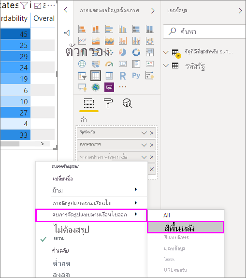

ส่วนต่อไปนี้อธิบายตัวเลือกการจัดรูปแบบตามเงื่อนไขแต่ละตัวเลือกThe following sections describe each conditional formatting option. คุณสามารถรวมตัวเลือกมากกว่าหนึ่งตัวเลือกลงในคอลัมน์ตารางเดียวYou can combine more than one option in a single table column.

## จัดรูปแบบสีพื้นหลังหรือสีฟอนต์Format background or font color

เมื่อต้องการจัดรูปแบบสีพื้นหลังหรือสีฟอนต์ของเซลล์ ให้เลือก **การจัดรูปแบบตามเงื่อนไข** สำหรับเขตข้อมูล จากนั้นเลือก **สีพื้นหลัง** หรือ **สีฟอนต์** จากเมนูดรอปดาวน์To format cell background or font color, select **Conditional formatting** for a field, and then select either **Background color** or **Font color** from the drop-down menu. 

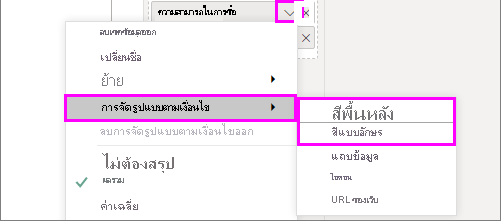

กล่องโต้ตอบ **สีพื้นหลัง** หรือ **สีฟอนต์** จะเปิดขึ้นพร้อมชื่อของเขตข้อมูลที่คุณกำลังจัดรูปแบบในชื่อเรื่องThe **Background color** or **Font color** dialog box opens, with the name of the field you're formatting in the title. หลังจากเลือกตัวเลือกการจัดรูปแบบตามเงื่อนไขแล้ว ให้เลือก **ตกลง**After selecting conditional formatting options, select **OK**. 

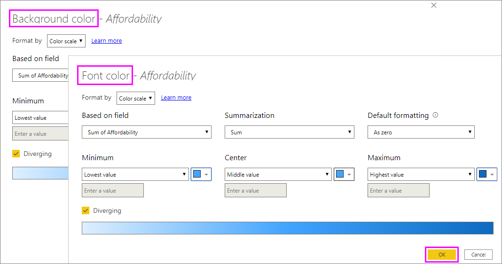

ตัวเลือก **สีพื้นหลัง** และ **สีฟอนต์** เหมือนกัน แต่มีผลกับสีพื้นหลังของเซลล์และสีฟอนต์ ตามลำดับThe **Background color** and **Font color** options are the same, but affect the cell background color and font color, respectively. คุณสามารถใช้การจัดรูปแบบตามเงื่อนไขที่เหมือนกันหรือแตกต่างกับสีฟอนต์และสีพื้นหลังของเขตข้อมูลYou can apply the same or different conditional formatting to a field's font color and background color. ถ้าคุณทำให้ฟอนต์และพื้นหลังของเขตข้อมูลมีสีเดียวกัน ฟอนต์จะรวมกันเป็นพื้นหลัง ดังนั้นคอลัมน์ตารางจะแสดงเฉพาะสีIf you make a field's font and background the same color, the font blends into the background so the table column shows only the colors.

## สีตามสเกลสีColor by color scale

เมื่อต้องการจัดรูปแบบสีพื้นหลังหรือสีฟอนต์ของเซลล์ตามสเกลสี ในเขตข้อมูล **รูปแบบตาม** ของกล่องโต้ตอบ **สีพื้นหลัง** หรือ **สีฟอนต์** ให้เลือก **สเกลสี**To format cell background or font color by color scale, in the **Format by** field of the **Background color** or **Font color** dialog box, select **Color scale**. ภายใต้ **ยึดตามเขตข้อมูล** ให้เลือกเขตข้อมูลเพื่อยึดการจัดรูปแบบUnder **Based on field**, select the field to base the formatting on. คุณสามารถจัดรูปแบบตามเขตข้อมูลปัจจุบันหรือในเขตข้อมูลใดก็ตามในแบบจำลองของคุณที่มีข้อมูลตัวเลขหรือสีได้You can base the formatting on the current field, or on any field in your model that has numerical or color data. 

ภายใต้ **การสรุป** ให้ระบุประเภทการรวมที่คุณต้องการใช้สำหรับเขตข้อมูลที่เลือกUnder **Summarization**, specify the aggregation type you want to use for the selected field. ภายใต้ **การจัดรูปแบบเริ่มต้น** ให้เลือกการจัดรูปแบบเพื่อนำไปใช้กับค่าว่างเปล่าUnder **Default formatting**, select a formatting to apply to blank values. 

ภายใต้ **ต่ำสุด** และ **สูงสุด** ให้เลือกว่าจะใช้ชุดรูปแบบสีตามค่าเขตข้อมูลต่ำสุดและสูงสุดหรือบนค่าที่คุณป้อนUnder **Minimum** and **Maximum**, choose whether to apply the color scheme based on the lowest and highest field values, or on custom values you enter. ดรอปดาวน์และเลือกตัวอย่างสี (swatch) ที่คุณต้องการนำไปใช้กับค่าต่ำสุดและสูงสุดDrop down and select the colors swatches you want to apply to the minimum and maximum values. เลือกกล่องกาเครื่องหมาย **ขยายออก** เพื่อระบุค่า **ศูนย์** และสีSelect the **Diverging** check box to also specify a **Center** value and color. 

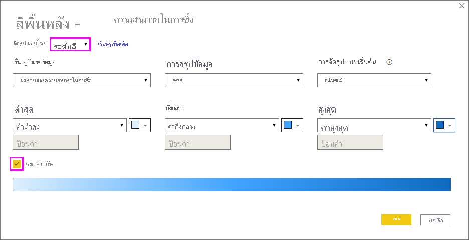

ตารางตัวอย่างที่มีการจัดรูปแบบพื้นหลังตามสเกลสีบนคอลัมน์ **Affordability** มีลักษณะดังนี้:An example table with color scale background formatting on the **Affordability** column looks like this:

ตารางตัวอย่างที่มีการจัดรูปแบบฟอนต์ตามสเกลสีบนคอลัมน์ **Affordability** มีลักษณะดังนี้:The example table with color scale font formatting on the **Affordability** column looks like this:

## สีตามกฎColor by rules

เมื่อต้องการจัดรูปแบบสีพื้นหลังหรือสีฟอนต์ของเซลล์ตามกฎ ในเขตข้อมูล **รูปแบบตาม** ของกล่องโต้ตอบ **สีพื้นหลัง** หรือ **สีฟอนต์** ให้เลือก **กฎ**To format cell background or font color by rules, in the **Format by** field of the **Background color** or **Font color** dialog box, select **Rules**. อีกครั้ง **ยึดตามเขตข้อมูล** แสดงเขตข้อมูลที่จะใช้ในการจัดรูปแบบ และ **การสรุป** แสดงชนิดการรวมสำหรับเขตข้อมูลAgain, **Based on field** shows the field to base the formatting on, and **Summarization** shows the aggregation type for the field. 

ภายใต้ **กฎ** ให้ป้อนช่วงของค่าหนึ่งหรือหลายช่วง และตั้งค่าสีสำหรับแต่ละช่วงUnder **Rules**, enter one or more value ranges, and set a color for each one. ช่วงค่าแต่ละช่วงเริ่มต้นจากเงื่อนไขค่า *ถ้า* เงื่อนไขค่า *และ* และสีEach value range has an *If value* condition, an *and* value condition, and a color. พื้นหลังของเซลล์หรือฟอนต์ในแต่ละช่วงค่าแต่ละช่วงจะเป็นสีตามสีที่กำหนดCell backgrounds or fonts in each value range are colored with the given color. ตัวอย่างต่อไปนี้มีสามกฎ:The following example has three rules:

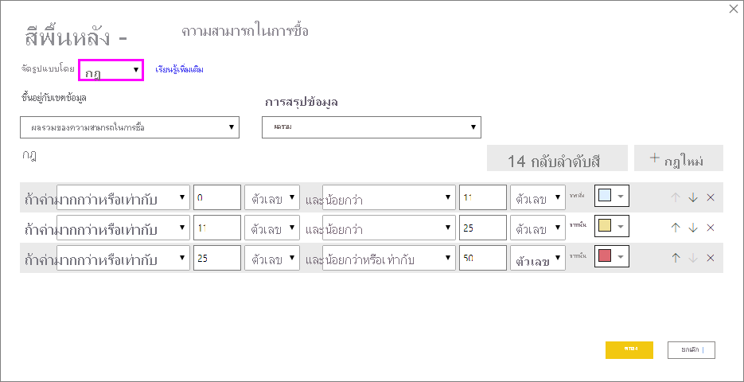

ตารางตัวอย่างที่มีการจัดรูปแบบสีพื้นหลังตามกฎบนคอลัมน์ **Affordability** มีลักษณะดังนี้:An example table with rules-based background color formatting on the **Affordability** column looks like this:

## สีตามค่าสีColor by color values

ถ้าคุณมีเขตข้อมูลหรือหน่วยวัดที่มีชื่อสีหรือข้อมูลค่าฐานสิบหก คุณสามารถใช้การจัดรูปแบบตามเงื่อนไขเพื่อนำสีเหล่านั้นไปใช้กับสีพื้นหลังหรือสีฟอนต์ของคอลัมน์ได้โดยอัตโนมัติIf you have a field or measure with color name or hex value data, you can use conditional formatting to automatically apply those colors to a column's background or font color. คุณยังสามารถใช้ตรรกะแบบกำหนดเองเพื่อนำสีไปใช้กับฟอนต์หรือพื้นหลังได้อีกด้วยYou can also use custom logic to apply colors to the font or background.

เขตข้อมูลสามารถใช้ค่าสีใดก็ตามที่แสดงอยู่ในสเปคสี CSS ที่ [https://www.w3.org/TR/css-color-3/](https://www.w3.org/TR/css-color-3/)The field can use any color values listed in the CSS color spec at [https://www.w3.org/TR/css-color-3/](https://www.w3.org/TR/css-color-3/). ค่าสีเหล่านี้อาจรวมถึง:These color values can include:
- รหัสฐานสิบหก 3 6 หรือ 8 หลัก ตัวอย่างเช่น #3E4AFF3, 6 or 8-digit hex codes, for example #3E4AFF. ตรวจสอบให้แน่ใจว่าคุณได้ใช้สัญลักษณ์ # ที่จุดเริ่มต้นของรหัสMake sure you include the # symbol at the start of the code. 
- ค่า RGB หรือ RGBA เช่น RGBA(234, 234, 234, 0.5)RGB or RGBA values, like RGBA(234, 234, 234, 0.5).
- ค่า HSL หรือ HSLA เช่น HSLA(123, 75%, 75%, 0.5)HSL or HSLA values, like HSLA(123, 75%, 75%, 0.5).
- ชื่อสี เช่น Green, SkyBlue หรือ PeachPuffColor names, such as Green, SkyBlue, or PeachPuff. 

ตารางต่อไปนี้มีชื่อสีที่เกี่ยวข้องกับแต่ละรัฐ:The following table has a color name associated with each state: 

เมื่อต้องการจัดรูปแบบคอลัมน์ **สี** ตามค่าเขตข้อมูล ให้เลือก **การจัดรูปแบบตามเงื่อนไข** สำหรับเขตข้อมูล **สี** จากนั้นเลือก **สีพื้นหลัง** หรือ **สีฟอนต์**To format the **Color** column based on its field values, select **Conditional formatting** for the **Color** field, and then select **Background color** or **Font color**. 

ในกล่องโต้ตอบ **สีพื้นหลัง** หรือ **สีฟอนต์** ให้เลือก **ค่าเขตข้อมูล** จากเขตข้อมูลดรอปดาวน์ **รูปแบบตาม**In the **Background color** or **Font color** dialog box, select **Field value** from the **Format by** drop-down field.

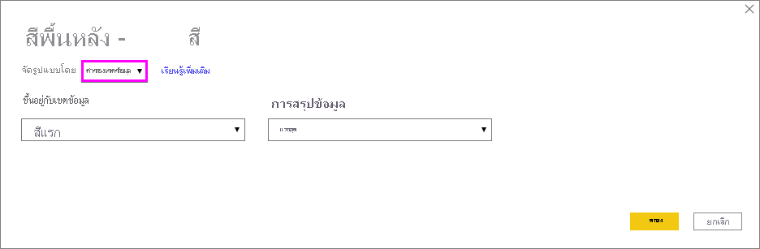

ตารางตัวอย่างที่มีการจัดรูปแบบ **สีพื้นหลัง** ตามค่าเขตข้อมูลสี ในเขตข้อมูล **สี** มีลักษณะดังนี้:An example table with color field value-based **Background color** formatting on the **Color** field looks like this:

หากคุณยังใช้ **ค่าเขตข้อมูล** เพื่อจัดรูปแบบ **สีฟอนต์** ของคอลัมน์ ผลลัพธ์จะเป็นสีทึบในคอลัมน์ **สี**:If you also use **Field value** to format the column's **Font color**, the result is a solid color in the **Color** column:

## สีที่ยึดตามการคำนวณColor based on a calculation

คุณสามารถสร้างการคำนวณที่แสดงค่าที่แตกต่างกันโดยยึดตามเงื่อนไขเชิงตรรกะทางธุรกิจที่คุณเลือกYou can create a calculation that outputs different values based on business logic conditions you select. การสร้างสูตรมักจะเร็วกว่าการสร้างกฎหลายกฎในกล่องโต้ตอบการจัดรูปแบบตามเงื่อนไขCreating a formula is usually faster than creating multiple rules in the conditional formatting dialog. 

ตัวอย่างเช่น สูตรต่อไปนี้จะใช้ค่าสีฐานสิบหกไปยังคอลัมน์ **Affordability rank** ใหม่โดยยึดตามค่าของคอลัมน์ **Affordability** ที่มีอยู่:For example, the following formula applies hex color values to a new **Affordability rank** column, based on existing **Affordability** column values:

เมื่อต้องการใช้สี ให้เลือกการจัดรูปแบบตามเงื่อนไข **สีพื้นหลัง** หรือ **สีฟอนต์** สำหรับคอลัมน์ **Affordability** และยึดการจัดรูปแบบตาม **ค่าเขตข้อมูล** ของคอลัมน์ **Affordability rank**To apply the colors, select **Background color** or **Font color** conditional formatting for the **Affordability** column, and base the formatting on the **Field value** of the **Affordability rank** column. 

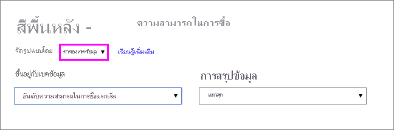

ตารางตัวอย่างที่มีสีพื้นหลัง **Affordability** ยึดตามคอลัมน์ **Affordability rank** จากการคำนวณมีลักษณะดังนี้:The example table with **Affordability** background color based on calculated **Affordability rank** looks like this:

คุณสามารถสร้างรูปแบบอื่นๆ อีกมากมายเพียงแค่ใช้จินตนาการและการคำนวณจำนวนหนึ่งYou can create many more variations, just by using your imagination and some calculations.

## เพิ่มแถบข้อมูลAdd data bars

เมื่อต้องการแสดงแถบข้อมูลตามค่าเซลล์ ให้เลือก **การจัดรูปแบบตามเงื่อนไข** สำหรับเขตข้อมูล **Affordability** จากนั้นเลือก **แถบข้อมูล** จากเมนูดรอปดาวน์To show data bars based on cell values, select **Conditional formatting** for the **Affordability** field, and then select **Data bars** from the drop-down menu. 

ในกล่องโต้ตอบ **แถบข้อมูล** ตัวเลือก **แสดงแถบอย่างเดียว** จะไม่ถูกเลือกตามค่าเริ่มต้น ดังนั้น เซลล์ของตารางจะแสดงทั้งแถบและค่าจริงIn the **Data bars** dialog, the **Show bar only** option is unchecked by default, so the table cells show both the bars and the actual values. เมื่อต้องการแสดงเฉพาะแถบข้อมูล ให้เลือกกล่องกาเครื่องหมาย **แสดงเฉพาะแถบข้อมูล**To show the data bars only, select the **Show bar only** check box.

คุณสามารถระบุค่า **ต่ำสุด** และ **สูงสุด** สีของแถบข้อมูลและทิศทาง และสีแกนได้You can specify **Minimum** and **Maximum** values, data bar colors and direction, and axis color. 

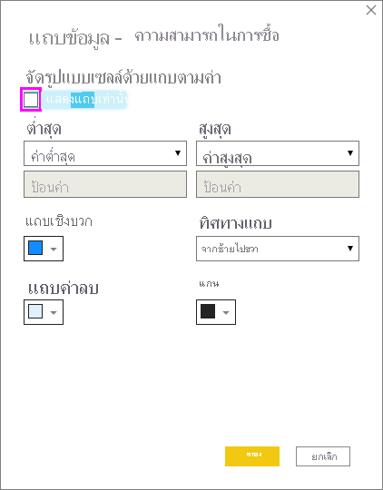

ด้วยแถบข้อมูลที่ใช้กับคอลัมน์ **Affordability** ตารางตัวอย่างจะมีลักษณะดังนี้:With data bars applied to the **Affordability** column, the example table looks like this:

## เพิ่มไอคอนAdd icons

เมื่อต้องการแสดงไอคอนตามค่าเซลล์ ให้เลือก **การจัดรูปแบบตามเงื่อนไข** สำหรับเขตข้อมูล จากนั้นเลือก **ไอคอน** จากเมนูดรอปดาวน์To show icons based on cell values, select **Conditional formatting** for the field, and then select **Icons** from the drop-down menu. 

ในกล่องโต้ตอบ **ไอคอน** ภายใต้ **จัดรูปแบบตาม** ให้เลือก **กฎ** หรือ **ค่าเขตข้อมูล**In the **Icons** dialog, under **Format by**, select either **Rules** or **Field value**. 

เมื่อต้องการจัดรูปแบบตามกฎ ให้เลือก **ยึดตามเขตข้อมูล**, วิธี **การสรุป**, **โครงร่างไอคอน**, **การจัดเรียงไอคอน**, ไอคอน **สไตล์** และอย่างน้อยหนึ่ง **กฎ**To format by rules, select a **Based on field**, **Summarization** method, **Icon layout**, **Icon alignment**, icon **Style**, and one or more **Rules**. ภายใต้ **กฎ** ให้ป้อนอย่างน้อยหนึ่งกฎที่มีเงื่อนไขค่า *ถ้า* และเงื่อนไขค่า *และ* และเลือกไอคอนเพื่อใช้กับแต่ละกฎUnder **Rules**, enter one or more rules with an *If value* condition and an *and* value condition, and select an icon to apply to each rule. 

เมื่อต้องการจัดรูปแบบตามค่าเขตข้อมูล ให้เลือก **ยึดตามเขตข้อมูล**, วิธี **การสรุป**, **โครงร่างไอคอน** และ **การจัดเรียงไอคอน**To format by field values, select a **Based on field**, **Summarization** method, **Icon layout**, and **Icon alignment**.

ตัวอย่างต่อไปนี้เพิ่มไอคอนที่ยึดตามกฎสามข้อ:The following example adds icons based on three rules:

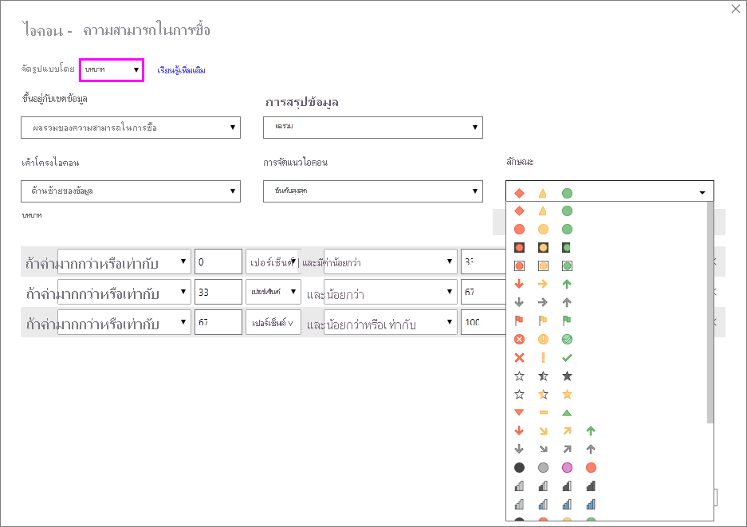

เลือก **ตกลง**Select **OK**. ด้วยไอคอนที่ใช้กับคอลัมน์ **Affordability** ตามกฎตารางตัวอย่างจะมีลักษณะดังนี้:With icons applied to the **Affordability** column by rules, the example table looks like this:

## จัดรูปแบบเป็น URL เว็บFormat as web URLs

หากคุณมีคอลัมน์หรือหน่วยวัดที่ประกอบด้วย URL เว็บไซต์ คุณสามารถใช้การจัดรูปแบบตามเงื่อนไขเพื่อใช้ URL เหล่านั้นกับเขตข้อมูลเป็นลิงก์ที่ใช้งานอยู่ได้If you have a column or measure that contains website URLs, you can use conditional formatting to apply those URLs to fields as active links. ตัวอย่างเช่น ตารางต่อไปนี้มีคอลัมน์ **Website** ที่มี URL ของเว็บไซต์สำหรับแต่ละรัฐ:For example, the following table has a **Website** column with website URLs for each state:

เมื่อต้องการแสดงชื่อรัฐแต่ละชื่อเป็นลิงก์แบบสดไปยังเว็บไซต์ ให้เลือก **การจัดรูปแบบตามเงื่อนไข** สำหรับเขตข้อมูล **State** จากนั้นเลือก **URL ของเว็บ**To display each state name as a live link to its website, select **Conditional formatting** for the **State** field, and then select **Web URL**. ในกล่องโต้ตอบ **URL ของเว็บ** ภายใต้ **ยึดตามเขตข้อมูล** ให้เลือก **เว็บไซต์** จากนั้นเลือก **ตกลง**In the **Web URL** dialog box, under **Based on field**, select **Website**, and then select **OK**. 

ด้วยการจัดรูปแบบตาม **URL ของเว็บ** ที่ใช้กับเขตข้อมูล **State** ชื่อรัฐแต่ละชื่อจะเป็นลิงก์ที่ใช้งานไปยังเว็บไซต์ของแต่ละรัฐWith **Web URL** formatting applied to the **State** field, each state name is an active link to its website. ตารางตัวอย่างต่อไปนี้มีการจัดรูปแบบตาม **URL ของเว็บ** ซึ่งนำไปใช้กับคอลัมน์ **State** และ **แถบข้อมูล** แบบเงื่อนไขและ **การจัดรูปแบบพื้นหลัง** ที่ใช้กับคอลัมน์ **Affordability**The following example table has **Web URL** formatting applied to the **State** column, and conditional **Data bars** and **Background formatting** applied to the **Affordability** column. 

## ผลรวมทั้งหมดและผลรวมย่อยTotals and subtotals

เริ่มต้นด้วยการเปิดตัวในเดือนเมษายน 2020 คุณสามารถนำกฎการจัดรูปแบบตามเงื่อนไขไปใช้กับผลรวมทั้งหมดและผลรวมย่อย สำหรับวิชวลทั้งของตารางและเมทริกซ์ได้Beginning with the April 2020 release, you can apply conditional formatting rules to totals and subtotals, for both table and matrix visuals. 

คุณสามารถใช้งานกฎการจัดรูปแบบตามเงื่อนไขได้โดยใช้ **นำไปใช้กับ** รายการแบบหล่นลงในการจัดรูปแบบตามเงื่อนไข ตามที่แสดงในรูภาพปต่อไปนี้You apply the conditional formatting rules by using the **Apply to** drop-down in conditional formatting, as shown in the following image.

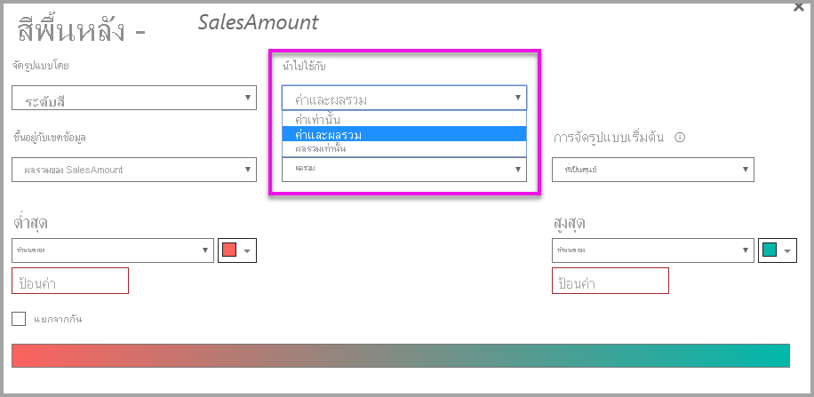

คุณต้องตั้งค่าเกณฑ์และช่วงสำหรับกฎการจัดรูปแบบตามเงื่อนไขด้วยตนเองYou must manually set the thresholds and ranges for conditional formatting rules. สำหรับเมทริกซ์ **ค่า** จะอ้างอิงถึงระดับการมองเห็นต่ำสุดของลำดับชั้นเมทริกซ์For matrices, **Values** will refer to the lowest visible level of the matrix hierarchy.

## ข้อควรพิจารณาและข้อจำกัดConsiderations and limitations
มีข้อควรพิจารณาบางประการที่ควรคำนึงถึงเมื่อทำงานเกี่ยวกับการจัดรูปแบบตารางตามเงื่อนไข:There are a few considerations to keep in mind when working with conditional table formatting:

- การจัดรูปแบบตามเงื่อนไขสามารถใช้ได้เฉพาะกับค่าของวิชวลแบบตารางหรือเมทริกซ์เท่านั้น และไม่นำไปใช้กับผลรวมย่อย ผลรวมทั้งหมด หรือแถว **Total**Conditional formatting applies only to the values of Table or Matrix visuals, and doesn't apply to any subtotals, grand totals, or the **Total** row. 
- ตารางใดก็ตามที่ไม่มีการจัดกลุ่มจะแสดงเป็นแถวเดียวที่ไม่สนับสนุนการจัดรูปแบบตามเงื่อนไขAny table that doesn't have a grouping is displayed as a single row that doesn't support conditional formatting.
- คุณไม่สามารถใช้การจัดรูปแบบไล่ระดับสีด้วยค่าสูงสุด/ต่ำสุดอัตโนมัติ หรือการจัดรูปแบบตามกฎที่มีกฎเปอร์เซ็นต์ได้ หากข้อมูลของคุณประกอบด้วยค่า *NaN*You can't apply gradient formatting with automatic maximum/minimum values, or rule-based formatting with percentage rules, if your data contains *NaN* values. NaN หมายถึง "ไม่ใช่ตัวเลข" ซึ่งเกิดจากการหารด้วยค่าศูนย์ที่ผิดพลาดโดยทั่วไปมากที่สุดNaN means "Not a number," most commonly caused by a divide by zero error. คุณสามารถใช้[ฟังก์ชัน DIVIDE() DAX ](/dax/divide-function-dax) เพื่อหลีกเลี่ยงข้อผิดพลาดเหล่านี้You can use the [DIVIDE() DAX function](/dax/divide-function-dax) to avoid these errors.
- การจัดรูปแบบตามเงื่อนไขต้องการการรวมหรือหน่วยวัดที่จะนำไปใช้กับค่าConditional formatting needs an aggregation or measure to be applied to the value. ด้วยเหตุนี้คุณจึงเห็น 'First' หรือ 'Last' ในตัวอย่าง **สีตามค่า**That's why you see 'First' or 'Last' in the **Color by value** example. ถ้าคุณกำลังสร้างรายงานของคุณกับลูกบาศก์แบบหลายมิติของ Analysis Services คุณจะไม่สามารถใช้แอตทริบิวต์สำหรับการจัดรูปแบบตามเงื่อนไขได้เว้นแต่ว่าเจ้าของลูกบาศก์ได้สร้างหน่วยวัดที่ให้ค่าIf you're building your report against an Analysis Service multidimensional cube, you won't be able to use an attribute for conditional formatting unless the cube owner has built a measure that provides the value.

## ขั้นตอนถัดไปNext steps

สำหรับข้อมูลเพิ่มเติมเกี่ยวกับการจัดรูปแบบสี โปรดดู [เคล็ดลับและลูกเล่นในการจัดรูปแบบสีใน Power BI](../visuals/service-tips-and-tricks-for-color-formatting.md)For more information about color formatting, see [Tips and tricks for color formatting in Power BI](../visuals/service-tips-and-tricks-for-color-formatting.md)