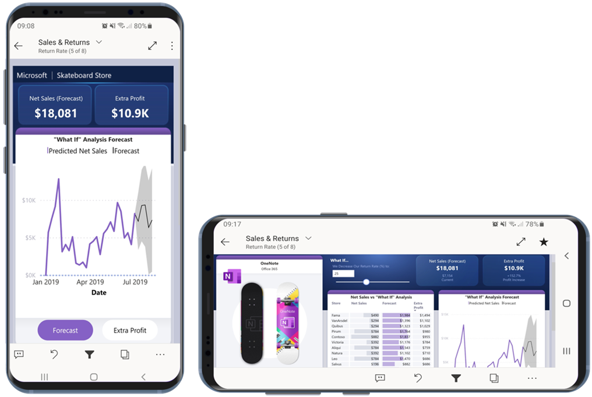
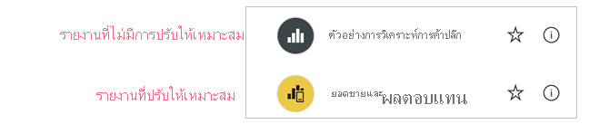
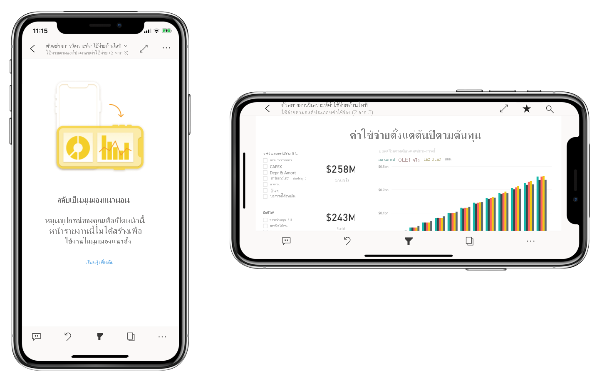

# ปรับรายงาน Power BI ให้เหมาะสมสำหรับแอปมือถือOptimize Power BI reports for the mobile app

ผู้ใช้โทรศัพท์มือถือสามารถดูหน้ารายงาน Power BI ใดๆ ก็ตามในแนวนอนได้Mobile users can view any Power BI report page in landscape orientation. อย่างไรก็ตาม ผู้เขียนรายงานสามารถสร้างมุมมองเพิ่มเติมที่ปรับให้เหมาะสมกับโทรศัพท์มือถือและแสดงในการวางแนวแบบแนวตั้งได้However, report authors can create an additional view that is optimized for mobile devices and displays in portrait orientation. ตัวเลือกการออกแบบนี้ซึ่งมีให้ใช้งานในทั้ง Power BI Desktop และในบริการของ Power BI ช่วยให้ผู้สร้างสามารถเลือกและจัดเรียงใหม่ได้เฉพาะภาพเหล่านั้นที่ทำให้การใช้งานบนโทรศัพท์มือถือเป็นไปได้This design option, which is available in both Power BI Desktop and in the Power BI service, enables authors to select and rearrange just those visuals that make sense for mobile users on the go.

Power BI มีฟีเจอร์จำนวนหนึ่งที่ช่วยให้คุณสามารถสร้างรายงานของคุณที่ปรับให้เหมาะสมกับโทรศัพท์มือถือได้:Power BI provides a number of features to help you create mobile-optimized versions of your reports:
* มุมมองเค้าโครงบนโทรศัพท์มือถือที่คุณสามารถสร้างรายงานที่ปรับให้เหมาะสมกับโทรศัพท์มือถือของคุณได้โดยการลากและวางภาพลงบนพื้นที่ทำงานของ emulator ของโทรศัพท์A mobile layout view where you can create your mobile-optimized report by dragging and dropping visuals onto a phone emulator canvas.
* ภาพและตัวแบ่งส่วนข้อมูลที่สามารถปรับให้เหมาะสมสำหรับการใช้งานบนหน้าจอขนาดเล็กของโทรศัพท์มือถือVisuals and slicers that can be optimized for use on small, mobile screens.

ความสามารถเหล่านี้ทำให้สามารถออกแบบและสร้างรายงานที่ปรับให้เหมาะสมกับโทรศัพท์มือถือได้อย่างน่าสนใจThese capabilities make it possible to design and build attractive, interactive mobile-optimized reports.

## สร้างเวอร์ชันแนวตั้งที่ปรับให้เหมาะกับโทรศัพท์มือถือของหน้ารายงานCreate a mobile-optimized portrait version of a report page

**ข้อกำหนดเบื้องต้น**: ขั้นตอนแรกคือการออกแบบและสร้างรายงานในมุมมองเว็บปกติ**Prerequisite**: The first step is to design and create the report in the regular web view. หลังจากสร้างการรายงาน คุณสามารถปรับแต่งเพื่อให้เหมาะกับโทรศัพท์และแท็บเล็ตได้After you've created the report, you can optimize it for phones and tablets.

ในการสร้างมุมมองที่ปรับให้เหมาะกับอุปกรณ์เคลื่อนที่ให้เปิดรายงานใน Power BI Desktop หรือในบริการ Power BITo create the mobile-optimized view, open the report in either Power BI Desktop or in the Power BI service. เมื่อเปิดรายงานไปที่มุมมองเค้าโครงอุปกรณ์เคลื่อนที่:When the report is open, go the mobile layout view:
   * ใน Power BI Desktop ให้เลือก ribbon **มุมมอง** และเลือก **เค้าโครงโทรศัพท์มือถือ**In Power BI Desktop, select the **View** ribbon and choose **Mobile layout**.
   * ในบริการ Power BI เลือก **แก้ไขรายงาน> เค้าโครงอุปกรณ์เคลื่อนที่**In the Power BI service, choose **Edit report > Mobile Layout**. หากมองไม่เห็นตัวเลือกแก้ไขให้ดูภายใต้ **ตัวเลือกเพิ่มเติม (... )**If the Edit option is not visible, look under **More options (...)**.

   คุณจะเห็นพื้นที่ทำงานที่สามารถเลื่อนได้เช่นโทรศัพท์ และบานหน้าต่าง **การแสดงผลด้วยภาพ** ที่สร้างรายการภาพทั้งหมดที่อยู่บนหน้ารายงานต้นฉบับYou see a scrollable canvas shaped like a phone, and a **Visualizations** pane that lists all of the visuals that are on the original report page.

* แต่ละภาพในบานหน้าต่าง **การแสดงผลด้วยภาพ** จะปรากฏขึ้นพร้อมชื่อเพื่อการระบุที่ง่ายEach visual in the **Visualizations** pane appears with its name for easy identification.
* แต่ละภาพยังมีตัวชี้วัดการมองเห็นอีกด้วยEach visual also has a visibility indicator. ตัวชี้วัดการมองเห็นของการแสดงผลด้วยภาพเปลี่ยนแลงโดยขึ้นอยู่กับสถานะการมองเห็นของภาพในสถานะปัจจุบันของมุมมองรายงานเว็บThe visibility indicator of a visual changes depending on the visibility status of the visual in the current state of the web report view. ตัวชี้วัดการมองเห็นมีประโยชน์เมื่อทำงานกับบุ๊กมาร์กThe visibility indicator is useful when working with bookmarks.

   

## เพิ่มภาพไปยังพื้นที่ทำงานของเค้าโครงโทรศัพท์มือถือAdd visuals to the mobile layout canvas
หากต้องการเพิ่มภาพลงในเค้าโครงโทรศัพท์มือถือ ให้ลากภาพจากบานหน้าต่าง **การแสดงผลด้วยภาพ** ไปยังพื้นที่ทำงานสำหรับโทรศัพท์To add a visual to the mobile layout, drag it from the **Visualizations** pane to the phone canvas. เมื่อคุณลากภาพไปยังพื้นที่ทำงาน ถาพจะจัดชิดกับเส้นตารางWhen you drag the visual to the canvas, it snaps to the grid. อีกวิธีหนึ่งคือคุณสามารถคลิกสองครั้งที่การแสดงผลด้วยภาพในบานหน้าต่างการแสดงผลด้วยภาพจากนั้นภาพจะถูกเพิ่มลงในผืนผ้าใบAlternatively, you can double-click the visual in the visualization pane and the visual will be added to the canvas.

คุณสามารถเพิ่มภาพของหน้ารายงานเว็บบางหน้าหรือทั้งหมดไปยังหน้ารายงานที่ปรับให้เหมาะสมสำหรับโทรศัพท์มือถือได้You can add some or all of the web report page visuals to the mobile-optimized report page. คุณสามารถเพิ่มแต่ละภาพได้เพียงครั้งเดียวและไม่จำเป็นต้องรวมภาพทั้งหมดYou can add each visual only once, and you don't have to include all the visuals.

>[!NOTE]
> คุณสามารถลากและวางภาพที่ซ่อนอยู่ลงบนพื้นที่ทำงานได้You can drag and drop hidden visuals onto the canvas. ภาพจะถูกวาง แต่ไม่แสดงขึ้นมาเว้นแต่จะมีการเปลี่ยนแปลงสถานะการมองเห็นในมุมมองรายงานเว็บปัจจุบันThey will be placed, but not shown unless their visibility status changes in the current web report view.

ภาพสามารถจัดเรียงเป็นชั้นๆ ได้ เพื่อสร้างรายงานแบบโต้ตอบโดยใช้บุ๊กมาร์กหรือเพื่อสร้างรายงานที่น่าสนใจโดยการวางชั้นภาพไว้เหนือรูปภาพVisuals can be layered one on top of the other to create interactive reports using bookmarks, or to build attractive reports by layering visuals over images. คุณสามารถเปลี่ยนลำดับการแบ่งชั้นของการแสดงผลด้วยภาพได้ใน [บานหน้าต่างการเลือก](#set-the-layering-order-of-visuals-on-the-mobile-layout-canvas)You can change the layering order of the visuals in the [Selection pane](#set-the-layering-order-of-visuals-on-the-mobile-layout-canvas).

เมื่อคุณวางภาพบนพื้นที่ทำงานแล้ว คุณสามารถปรับขนาดได้โดยการลากจุดจับที่ปรากฏรอบๆ ขอบของภาพเมื่อคุณเลือกภาพนั้นOnce you've placed a visual on the canvas, you can resize it by dragging the handles that appear around the edge of the visual when you select it. เมื่อต้องการรักษาอัตราส่วนกว้างยาวของภาพขณะปรับขนาด ให้กดแป้น **Shift** ในขณะที่ลากจุดปรับขนาดTo maintain the visual's aspect ratio while resizing, press the **Shift** key while dragging the resize handles.

รูปด้านล่างแสดงการลากและวางภาพจากบานหน้าต่าง **การแสดงผลด้วยภาพ** ไปยังพื้นที่ทำงานรวมถึงการปรับขนาดและการซ้อนทับบางรายการThe image below illustrates dragging and dropping visuals from the **Visualizations** pane onto the canvas, as well as resizing and overlaying some of them.

   

มาตราส่วนตารางขนาดต่าง ๆ ของหน้ารายงานในโทรศัพท์จะปรับขนาดให้เหมาะสมกับโทรศัพท์ เพื่อให้รายงานของคุณเข้ากับโทรศัพท์ทั้งหน้าจอขนาดใหญ่และขนาดเล็กThe phone report grid scales across phones of different sizes, so your report looks good on small- and large-screen phones.

## กำหนดลำดับการแบ่งชั้นของการแสดงผลด้วยภาพบนพื้นที่เค้าโครงอุปกรณ์เคลื่อนที่Set the layering order of visuals on the mobile layout canvas

ทุกครั้งที่คุณลากภาพลงบนพื้นที่ การแสดงผลด้วยภาพนั้นจะถูกเพิ่มลงบนเลเยอร์ของตัวเองที่ด้านบนของการแสดงผลด้วยภาพอื่น ๆ ที่มีอยู่แล้วบนพื้นที่Each time you drag a visual onto the canvas, it is added on its own layer on top of any other visuals that are already on the canvas. บานหน้าต่าง **การเลือก** ช่วยให้คุณสามารถเปลี่ยนลำดับการแบ่งชั้นได้The **Selection** pane enables you to change the layering order.

ในการเปิดบานหน้าต่าง **การเลือก** ให้คลิกปุ่ม **การเลือก** ในส่วน **แสดงบานหน้าต่าง** บนแท็บ **มุมมอง**To open the **Selection** pane, click the **Selection** button in the **Show panes** section on the **View** tab. 

บานหน้าต่าง **การเลือก** จะแสดงรายการการแสดงผลด้วยภาพทั้งหมดที่อยู่บนพื้นที่The **Selection** pane lists all the visuals that are on the canvas. ลำดับของรายการจะแสดงถึงลำดับชั้นบนพื้นที่ - การเรียงลำดับที่แสดงรายการแรกจะอยู่ที่ชั้นบนสุดส่วนการแสดงผลด้วยภาพที่แสดงรายการสุดท้ายจะอยู่ที่ชั้นล่างสุดThe order of the list reflects the layer ordering on the canvas - the first listed visual is on the top-most layer, the last listed visual is on the bottom-most layer. ในการเปลี่ยนลำดับ คุณสามารถลากและวางการแสดงผลด้วยภาพไปยังที่อื่นในรายการหรือเลือกภาพและใช้ปุ่มลูกศรเพื่อเลื่อนขึ้นหรือลงTo change the order, you can either drag and drop a visual to another place on the list, or select a visual and use the arrow buttons to move it up or down.

บานหน้าต่าง **การเลือก** ยังมีตัวบ่งชี้การมองเห็นสำหรับแต่ละการแสดงผลด้วยภาพในรายการ แต่ไม่สามารถเปลี่ยนการแสดงผลในมุมมองเค้าโครงอุปกรณ์เคลื่อนที่ได้ - ซึ่งต้องทำในมุมมองเค้าโครงเว็บปกติThe **Selection** pane also has a visibility indication for each visual in the list, but it is not possible to change the visibility in the mobile layout view - this must be done in the regular web layout view.

## ลบภาพออกพื้นที่ทำงานของเค้าโครงโทรศัพท์มือถือRemove visuals from the mobile layout canvas
เมื่อต้องการลบภาพออกจากเค้าโครงโทรศัพท์มือถือ ให้คลิก **X** ที่มุมบนขวาของภาพบนพื้นที่ทำงานของโทรศัพท์ หรือเลือกภาพและกด **ลบ**To remove a visual from the mobile layout, click the **X** in the top-right corner of the visual on the phone canvas, or select the visual and press **Delete**.

คุณสามารถลบการแสดงผลด้วยภาพทั้งหมดออกจากพื้นที่ทำงานได้โดยการคลิกที่ตัวลบในบานหน้าต่าง **การแสดงผลด้วยภาพ**You can remove all the visualizations from the canvas by clicking the eraser on the **Visualization** pane.

การลบภาพของคุณออกจากพื้นที่ทำงานเค้าโครงโทรศัพท์มือถือจะเป็นการลบภาพจากพื้นที่ทำงานเท่านั้นRemoving visuals from the mobile layout canvas removes them from the canvas only. ภาพจะยังคงปรากฏขึ้นในบานหน้าต่างการจัดรูปแบบการแสดงข้อมูลและรายงานต้นฉบับยังคงไม่ได้รับผลกระทบThe visuals still appear in the visualization pane, and the original report remains unaffected.

## กำหนดค่าภาพและแบ่งส่วนข้อมูลสำหรับการใช้งานในรายงานที่ปรับให้เหมาะสมกับโทรศัพท์มือถือConfigure visuals and slicers for use in mobile-optimized reports

### การแสดงผลด้วยภาพVisuals

ตามค่าเริ่มต้น ภาพจำนวนมาก โดยเฉพาะการแสดงผลด้วยภาพแบบแผนภูมิจะตอบสนองได้By default, many visuals, particularly chart-type visuals, are responsive.  ซึ่งหมายความว่าภาพจะเปลี่ยนการแสดงผลข้อมูลทั่วไปและข้อมูลเชิงลึกปริมาณมากได้ โดยไม่ขึ้นอยู่กับขนาดของหน้าจอThat means they change dynamically to display the maximum amount of data and insight, no matter the screen size.

Power BI จะจัดลำดับความสำคัญของมุมมองข้อมูล ทุกเมื่อที่เปลี่ยนแปลงขนาดภาพAs a visual changes size, Power BI gives priority to the data. เช่น การนำเอาช่องว่างภายในออกและย้ายคำอธิบายแผนภูมิไปไว้ด้านบนสุดของภาพโดยอัตโนมัติ เพื่อให้ภาพยังคงแสดงข้อมูลได้ แม้ว่าจะมีขนาดเล็กลงก็ตามFor example, it might remove padding and move the legend to the top of the visual automatically so that the visual remains informative even as it gets smaller.

 
ถ้ามีเหตุผลบางอย่างที่คุณต้องการปิดใช้งานการตอบสนอง คุณสามารถทำได้ในส่วน **ทั่วไป** ของการตั้งค่ารูปแบบของภาพIf for some reason you want to turn responsiveness off, you can do that in the **General** section of the visual's format settings.

### ตัวแบ่งส่วนข้อมูลSlicers

ตัวแบ่งส่วนข้อมูลมีการกรองในพื้นที่ทำงานสำหรับข้อมูลรายงานSlicers offer on-canvas filtering of report data. เมื่อคุณออกแบบตัวแบ่งส่วนข้อมูลในโหมดการเขียนรายงานทั่วไป คุณก็สามารถปรับเปลี่ยนการตั้งค่าตัวแบ่งส่วนข้อมูลบางรายการ เพื่อให้สามารถใช้งานในรายงานการปรับให้เหมาะสมกับโทรศัพท์มือถือดังนี้:When designing slicers in the regular report authoring mode, you can modify some slicer settings to make them more usable in mobile-optimized reports:
* คุณสามารถตัดสินใจว่าจะอนุญาตให้ผู้อ่านรายงานสามารถเลือกได้เพียงหนึ่งรายการหรือหลายรายการก็ได้You can decide whether to allow report readers to select only one item or multiple items.
* คุณสามารถทำให้ตัวแบ่งส่วนข้อมูลเป็นแนวตั้ง แนวนอน หรือแบบตอบสนองได้ (ตัวแบ่งส่วนข้อมูลแบบตอบสนองต้องเป็นแนวนอน)You can make the slicer vertical, horizontal, or responsive (responsive slicers must be horizontal).

ถ้าคุณสร้างตัวแบ่งส่วนข้อมูลให้เป็นแบบตอบสนอง เมื่อคุณเปลี่ยนขนาดและรูปร่าง ตัวแบ่งส่วนข้อมูลแบบตอบสนองก็่จะแสดงตัวเลือกมากขึ้นหรือน้อยลงIf you make the slicer responsive, as you change its size and shape it shows more or fewer options. ซึ่งสามารถเป็นแบบสูง เตี้ย กว้างหรือแคบIt can be tall, short, wide, or narrow. ถ้าคุณปรับให้มีขนาดเล็กพอ จะกลายเป็นเพียงไอคอนตัวกรองที่อยู่ในหน้ารายงานIf you make it small enough, it becomes just a filter icon on the report page.

 
อ่านข้อมูลเพิ่มเติมเกี่ยวกับ[การสร้างตัวแบ่งส่วนข้อมูลแบบตอบสนอง](power-bi-slicer-filter-responsive.md)Read more about [creating responsive slicers](power-bi-slicer-filter-responsive.md).

## รายงานที่ปรับให้เหมาะสมกับโทรศัพท์มือถือPublish a mobile-optimized report
หากต้องการเผยแพร่รายงานเวอร์ชันที่ปรับให้เหมาะสมกับโทรศัพท์มือถือ ให้[เผยแพร่รายงานหลักจาก Power BI Desktop ไปยังบริการของ Power BI](desktop-upload-desktop-files.md)To publish a mobile-optimized version of a report, [publish the main report from Power BI Desktop to the Power BI service](desktop-upload-desktop-files.md). การดำเนินการนี้จะเป็นการเผยแพร่เวอร์ชันที่ปรับให้เหมาะสมกับโทรศัพท์มือถือในเวลาเดียวกันThis publishes the mobile-optimized version at the same time.

## การดูรายงานที่ปรับให้เหมาะสมและไม่ได้ปรับบนโทรศัพท์หรือแท็บเล็ตViewing optimized and unoptimized reports on a phone or tablet

ในแอปสำหรับโทรศัพท์มือถือของ Power BI รายงานที่ปรับให้เหมาะสมกับโทรศัพท์มือถือจะแสดงด้วยไอคอนพิเศษIn the Power BI mobile apps, mobile-optimized reports are indicated by a special icon.

บนโทรศัพท์ แอปจะตรวจหาว่ารายงานได้รับการปรับให้เหมาะสมกับโทรศัพท์มือถือโดยอัตโนมัติหรือไม่On phones, the app automatically detects whether the report is mobile-optimized or not.
* ถ้ามีรายงานที่ปรับให้เหมาะสมกับโทรศัพท์มือถือ แอปจะเปิดรายงานในโหมดที่ปรับให้เหมาะสมกับโทรศัพท์มือถือโดยอัตโนมัติIf a mobile-optimized report exists, the app automatically opens the report in mobile-optimized mode.
* ถ้ารายงานที่ปรับให้เหมาะสมกับโทรศัพท์มือถือไม่มีอยู่ รายงานจะเปิดขึ้นในมุมมุมมองแนวนอนIf a mobile-optimized report doesn’t exist, the report opens in the unoptimized, landscape view.

การถือโทรศัพท์ในแนวนอนจะเปิดรายงานในมุมมองที่ไม่ได้ปรับให้เหมาะสมด้วยเค้าโครงรายงานต้นฉบับโดยไม่คำนึงว่ารายงานนั้นได้รับการปรับให้เหมาะสมหรือไม่Holding a phone in landscape orientation opens the report in the unoptimized view with the original report layout, regardless of whether the report is optimized or not.

หากคุณเพิ่มได้ปรับให้เหมาะสมเฉพาะบางหน้า เมื่อผู้อ่านมาที่หน้าที่ไม่ได้ปรับให้เหมาะสม พวกเขาจะได้รับแจ้งให้เปลี่ยนเป็นมุมมองแนวนอนIf you optimize only some pages, when readers come to an unoptimized page they will be prompted to switch to landscape view. การเปิดโทรศัพท์หรือแท็บเล็ตด้านข้างจะเปิดใช้งานการดูหน้าในโหมดแนวนอนTurning the phone or tablet sideways will enable them to see the page in landscape mode. อ่านข้อมูลเพิ่มเติมเกี่ยวกับ[การเรียนรู้เกี่ยวกับรายงาน Power BI ที่ปรับให้เหมาะสมสำหรับโหมดแนวตั้ง](../consumer/mobile/mobile-apps-view-phone-report.md)[Read more about interacting with Power BI reports optimized for portrait mode](../consumer/mobile/mobile-apps-view-phone-report.md).

## ข้อควรพิจารณาเมื่อสร้างเค้าโครงที่ปรับให้เหมาะสมกับโทรศัพท์มือถือConsiderations when creating mobile-optimized layouts
* สำหรับรายงานที่มีหลายหน้า คุณสามารถปรับให้เหมาะสมทุกหน้าหรือแค่บางหน้าได้For reports with multiple pages, you can optimize all the pages or just a few.
* ถ้าคุณได้กำหนดสีพื้นหลังสำหรับหน้ารายงานราย งานที่ปรับให้เหมาะสมกับโทรศัพท์มือถือจะมีสีพื้นหลังเดียวกันIf you've defined a background color for a report page, the mobile-optimized report will have the same background color.
* คุณไม่สามารถปรับเปลี่ยนการตั้งค่ารูปแบบเฉพาะสำหรับรายงานที่ปรับให้เหมาะสมกับโทรศัพท์มือถือได้You can't modify format settings just for the mobile-optimized report. การจัดรูปแบบจะสอดคล้องกันระหว่างหลักและเค้าโครงโทรศัพท์มือถือFormatting is consistent between the master and mobile layouts. ตัวอย่างเช่น ขนาดแบบอักษรจะเหมือนกันFor example, the font sizes will be the same.
* เมื่อต้องการเปลี่ยนภาพ เช่น การเปลี่ยนแปลงการจัดรูปแบบ ชุดข้อมูล ตัวกรอง หรือแอตทริบิวต์ต่างๆ ให้กลับไปยังโหมดการเขียนรายงานเว็บTo change a visual, such as changing its formatting, dataset, filters, or any other attribute, return to the web report authoring mode.

## ขั้นตอนถัดไปNext steps
* [สร้างมุมมองโทรศัพท์สำหรับแดชบอร์ดใน Power BI](service-create-dashboard-mobile-phone-view.md)[Create a phone view of a dashboard in Power BI](service-create-dashboard-mobile-phone-view.md).
* [ดูรายงาน Power BI ที่ปรับให้เหมาะสมกับโทรศัพท์ของคุณ](../consumer/mobile/mobile-apps-view-phone-report.md)[View Power BI reports optimized for your phone](../consumer/mobile/mobile-apps-view-phone-report.md).
* [เอกสารประกอบ Power BI ในการสร้างรายงานและแดชบอร์ด](./index.yml)[Power BI documentation on creating reports and dashboards](./index.yml).
* มีคำถามเพิ่มเติมหรือไม่More questions? [ลองถามชุมชน Power BI](https://community.powerbi.com/)[Try asking the Power BI Community](https://community.powerbi.com/).
