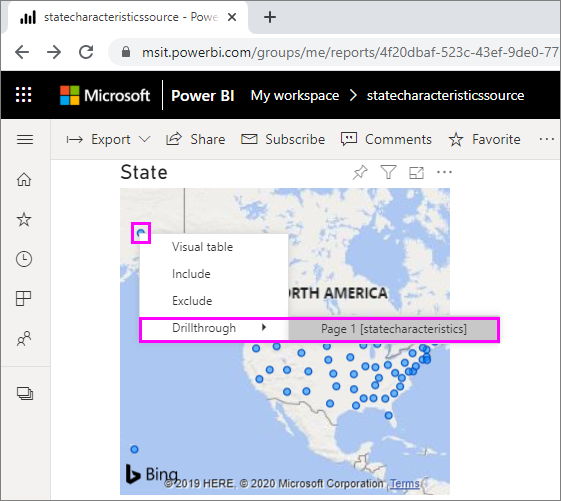
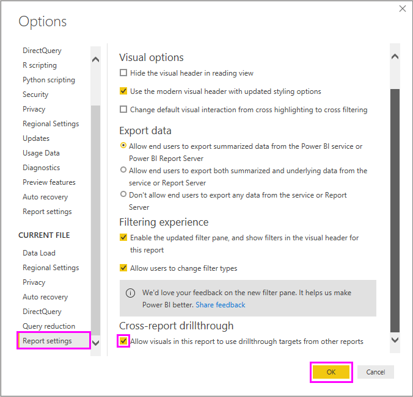

# ใช้การดูรายละเอียดแบบเจาะลึกข้ามรายงานใน Power BIUse cross-report drill through in Power BI

ด้วยคุณลักษณะ *การดูรายละเอียดแบบเจาะลึกข้ามรายงาน* ใน Power BI โดยบริบทแล้วคุณจะสามารถข้ามจากรายงานหนึ่งไปยังรายงานอื่นในแอปหรือพื้นที่ทำงานเดียวกันของบริการ Power BI ได้With the Power BI *cross-report drill-through* feature, you can contextually jump from one report to another report in the same Power BI service workspace or app. คุณสามารถใช้การดูรายละเอียดแบบเจาะลึกข้ามรายงาน เพื่อเชื่อมโยงรายงานสองรายการขึ้นไปที่มีเนื้อหาเกี่ยวข้องกัน และดำเนินการผ่านตัวกรองเนื้อหาพร้อมกับการเชื่อมโยงข้ามรายงานYou can use cross-report drill through to connect two or more reports that have related content, and to pass filter context along with the cross-report connection. 

หากต้องการเริ่มต้นดูรายละเอียดแบบเจาะลึกข้ามรายงาน ให้คุณเลือกจุดข้อมูลใน *วิชวลต้นทาง* ของ *รายงานต้นฉบับ* จากนั้นเลือกเป้าหมาย **การดูรายละเอียดแบบเจาะลึก** ข้ามรายงานจากเมนูบริบทTo initiate cross-report drill through, you select a data point in a *source visual* of a *source report*, and then select the cross-report **Drill through** target from the context menu. 

การดำเนินการในการดูรายละเอียดแบบเจาะลึกจะเปิด *หน้าเป้าหมาย* ใน *รายงานเป้าหมาย*The drill-through action opens the *target page* in the *target report*. 

บทความนี้แสดงวิธีการตั้งค่าและใช้การดูรายละเอียดแบบเจาะลึกข้ามรายงานสำหรับรายงาน Power BIThis article shows you how to set up and use cross-report drill through for Power BI reports.

> [!NOTE]
> คุณไม่สามารถใช้การดูรายละเอียดแบบเจาะลึกข้ามรายงานด้วย[รายงานที่แชร์กับฉัน](../collaborate-share/service-share-dashboards.md#share-a-dashboard-or-report)แบบแชร์ทีละรายการได้You can't use cross-report drill through with individually-shared [Shared with me reports](../collaborate-share/service-share-dashboards.md#share-a-dashboard-or-report). เมื่อต้องการใช้การดูรายละเอียดแบบเจาะลึกข้ามรายงาน คุณต้องเข้าถึงรายงานในพื้นที่ทำงานที่คุณเป็นสมาชิกอยู่To use cross-report drill through, you must access reports in workspaces that you’re a member of.

## เปิดใช้งานการดูรายละเอียดแบบเจาะลึกข้ามรายงานEnable cross-report drill through

ขั้นตอนแรกในการเปิดใช้งานการดูรายละเอียดแบบเจาะลึกข้ามรายงานคือ การตรวจสอบรูปแบบข้อมูลสำหรับแหล่งข้อมูลและรายงานเป้าหมายThe first step in enabling cross-report drill through is to validate the data models for the source and target reports. แม้ว่า Schema ในแต่ละรายงานไม่จำเป็นต้องเหมือนกัน เขตข้อมูลที่คุณต้องการส่งต้องมีอยู่ในรูปแบบข้อมูลทั้งสองAlthough the schemas in each report don't have to be the same, the fields you want to pass must exist in both data models. ชื่อของเขตข้อมูลและชื่อของตารางที่พวกเขาเป็นสมาชิกต้องเหมือนกันThe names of the fields, and the names of the tables they belong to, must be identical. สตริงต้องตรงกัน และตรงตามตัวพิมพ์ใหญ่-เล็กThe strings must match, and are case-sensitive.

ตัวอย่างเช่น หากคุณต้องการส่งต่อตัวกรองในเขตข้อมูล **รัฐ** ภายในตาราง **รัฐของสหรัฐฯ** ทั้งสองรูปแบบต้องมีตาราง **รัฐของสหรัฐฯ** และเขตข้อมูล **รัฐ** อยู่ภายในตารางFor example, if you want to pass a filter on a field **State** within a table **US States**, both models must have a **US States** table, and a **State** field within that table. หากไม่เหมือนกัน คุณต้องอัปเดตชื่อเขตข้อมูลหรือชื่อตารางในรูปแบบพื้นฐานIf not, you must update the field name or table name in the underlying model. การอัปเดตแค่ชื่อเขตข้อมูลที่แสดง ส่งผลให้การดูรายละเอียดแบบเจาะลึกข้ามรายงานนั้นทำงานอย่างไม่ถูกต้องSimply updating the display name of the fields won't work properly for cross-report drill through.

หลังจากที่คุณตรวจสอบความถูกต้องของแบบจำลองของคุณ ให้เปิดใช้งานรายงานต้นฉบับเพื่อใช้การดูรายละเอียดแบบเจาะลึกข้ามรายงานAfter you validate your models, enable the source report to use cross-report drill through. 

1. ใน Power BI Desktop ไปที่ตัวเลือก **แฟ้ม** > **และตัวเลือก** > **การตั้งค่า**In Power BI Desktop, go to **File** > **Options and settings** > **Options**. 
1. ในหน้าต่าง **ตัวเลือก** ทางด้านซ้ายของการนำทาง ที่ด้านล่างของส่วน **ไฟล์ปัจจุบัน** เลือก **การตั้งค่ารายงาน**In the **Options** window left navigation, at the bottom of the **Current file** section, select **Report settings**. 
1. ที่มุมล่างขวา ด้านล่าง **การดูรายละเอียดแบบเจาะลึกข้ามรายงาน** ให้เลือก **อนุญาตให้วิชวลในรายงานนี้ใช้เป้าหมายการดูรายละเอียดแบบเจาะลึกจากรายงานอื่น**At bottom right, under **Cross-report drill through**, select **Allow visuals in this report to use drill-through targets from other reports**. 
1. เลือก **ตกลง**Select **OK**. 
   
   

คุณยังสามารถเปิดใช้งานการดูรายละเอียดแบบเจาะลึกข้ามรายงานจากบริการของ Power BI ได้You can also enable cross-report drill through from the Power BI service.
1. ในบริการของ Power BI ให้เลือกพื้นที่ทำงานที่มีรายงานเป้าหมายและต้นทางของคุณIn Power BI service, select the workspace that contains your target and source reports.
1. ถัดจากชื่อรายงานต้นทางในรายการพื้นที่ทำงาน เลือกสัญลักษณ์ **ตัวเลือกเพิ่มเติม** จากนั้น เลือก **การตั้งค่า**Next to the source report name in the workspace list, select the **More options** symbol, and then select **Settings**. 
1. ใกล้กับด้านล่างของบานหน้าต่าง **การตั้งค่า** ภายใต้ **การดูรายละเอียดแบบเจาะลึกข้ามรายงาน** ให้เลือก **อนุญาตให้วิชวลในรายงานนี้ใช้เป้าหมายการดูรายละเอียดแบบเจาะลึกจากรายงานอื่น** จากนั้นเลือก **บันทึก**Near the bottom of the **Settings** pane, under **Cross-report drill through**, select **Allow visuals in this report to use drill-through targets from other reports**, and then select **Save**.
   
   

## ตั้งค่าเป้าหมายการดูรายละเอียดแบบเจาะลึกข้ามรายงานSet up a cross-report drill-through target

การตั้งค่าหน้าเป้าหมายสำหรับการดูรายละเอียดแบบเจาะลึกข้ามรายงานนั้นคล้ายกับการตั้งค่าการดูรายละเอียดแบบเจาะลึกภายในรายงานSetting up a target page for cross-report drill through is similar to setting up drill through within a report. การเปิดใช้งานการดูรายละเอียดแบบเจาะลึกบนหน้าเป้าหมาย จะอนุญาตให้มีการแสดงผลด้วยวิชวลอื่น ๆ เพื่อกำหนดหน้าเป้าหมายสำหรับการดูรายละเอียดแบบเจาะลึกEnabling drill through on the target page allows other visuals to target the page for drill through. หากต้องการสร้างการดูรายละเอียดแบบเจาะลึกภายในรายงานเดียว โปรดดูที่[ใช้การดูรายละเอียดแบบเจาะลึกใน Power BI Desktop](desktop-drillthrough.md)To create drill through within a single report, see [Use drill through in Power BI Desktop](desktop-drillthrough.md).

คุณสามารถตั้งค่าเป้าหมายสำหรับการดูรายละเอียดแบบเจาะลึกข้ามรายงานได้ใน Power BI Desktop หรือบริการของ Power BIYou can set up a target for cross-report drill through in Power BI Desktop or Power BI service. 
1. แก้ไขไฟล์เป้าหมายและบนหน้าเป้าหมายของรายงานเป้าหมาย ให้เลือกส่วน **เขตข้อมูล** ของบานหน้าต่าง **การแสดงภาพ**Edit the target file, and on the target page of the target report, select the **Fields** section of the **Visualizations** pane. 
1. ภายใต้ **การดูรายละเอียดแบบเจาะลึก** ให้ตั้งค่า **ข้ามรายงาน** เป็น **เปิด**Under **Drill through**, set the **Cross-report** toggle to **On**. 
1. ลากเขตข้อมูลที่คุณต้องการใช้เป็นเป้าหมายการดูรายละเอียดแบบเจาะลึกไปที่ **เพิ่มเขตข้อมูลการดูรายละเอียดแบบเจาะลึกที่นี่**Drag the fields you want to use as drill-through targets into **Add drill-through fields here**. สำหรับแต่ละเขตข้อมูล เลือกรายการที่คุณต้องการอนุญาตการดูรายละเอียดแบบเจาะลึกเมื่อใช้เขตข้อมูลเป็นประเภท หรือเมื่อสรุปข้อมูลเป็นหน่วยวัดFor each field, select whether you want to allow drill through when the field is used as a category, or when it's summarized like a measure. 
1. เลือกว่าคุณต้องการ **เก็บตัวกรองทั้งหมด** สำหรับวิชวลหรือไม่Select whether you want to **Keep all filters** for the visual. หากคุณไม่ต้องการส่งต่อตัวกรองที่ใช้จากวิชวลแหล่งที่มาไปที่วิชวลเป้าหมาย ให้เลือก **ปิด**If you don't want to pass filters applied to the source visual to your target visual, select **Off**.
   
   
   
1. หากคุณใช้เฉพาะหน้าสำหรับการดูรายละเอียดแบบเจาะลึกข้ามรายงาน คุณควรลบปุ่ม **ย้อนกลับ** ซึ่งถูกเพิ่มเข้าไปบนพื้นที่ทำงานโดยอัตโนมัติIf you're using the page for cross-report drill through only, delete the **Back** button that's automatically added to the canvas. ปุ่ม **ย้อนกลับ** จะทำหน้าที่ในการนำทางภายในรายงานเดียวเท่านั้นThe **Back** button only works for navigation within a report. 
1. หลังจากที่คุณได้กำหนดค่าหน้าเป้าหมายแล้ว ให้บันทึกรายงาน หากคุณกำลังใช้บริการของ Power BI หรือบันทึกและเผยแพร่รายงาน หากคุณกำลังใช้ Power BI DesktopAfter you configure the target page, save the report if you're using the Power BI service, or save and publish the report if you're using Power BI Desktop.

เท่านี้ก็เรียบร้อยThat's it. รายงานของคุณพร้อมสำหรับการดูรายละเอียดแบบเจาะลึกข้ามรายงานแล้วYour reports are ready for cross-report drill through. 

## ใช้การดูรายละเอียดแบบเจาะลึกข้ามรายงานUse cross-report drill through

หากต้องการใช้การดูรายละเอียดแบบเจาะลึกข้ามรายงาน ให้เลือกรายงานต้นฉบับในบริการของ Power BI จากนั้นจึงเลือกวิชวลที่ใช้เขตข้อมูลการดูรายละเอียดแบบเจาะลึกตามลักษณะที่คุณระบุไว้ในขั้นตอนการตั้งค่าหน้าเป้าหมายTo use cross-report drill through, select the source report in the Power BI service, and then select a visual that uses the drill-through field in the way you specified when you set up the target page. คลิกขวาที่จุดข้อมูลเพื่อเปิดเมนูบริบทวิชวล เลือก **การดูรายละเอียดแบบเจาะลึก** จากนั้นเลือกเป้าหมายการดูรายละเอียดแบบเจาะลึกRight-click a data point to open the visual context menu, select **Drill through**, and then select the drill-through target. เป้าหมายการดูรายละเอียดแบบเจาะลึกข้ามรายงานจะถูกจัดรูปแบบเป็น **ชื่อหน้า [ชื่อรายงาน]**Cross-report drill-through targets are formatted as **Page name [Report name]**.

คุณจะเห็นผลลัพธ์ในหน้าการดูรายละเอียดแบบเจาะลึกข้ามรายงานตามเป้าหมาย เช่นเดียวกับที่คุณตั้งค่าไว้ในขั้นตอนที่คุณสร้างเป้าหมายYou see the results in the target cross-report drill-through page, just as you set them up when you created the target. ผลลัพธ์จะกรองตามการตั้งค่าการดูรายละเอียดแบบเจาะลึกThe results are filtered according to the drill-through settings.

> [!IMPORTANT]
> Power BI บันทึกเป้าหมายการดูรายละเอียดแบบเจาะลึกข้ามรายงานPower BI caches cross-report drill-through targets. หากคุณทำการเปลี่ยนแปลง อย่าลืมรีเฟรชเบราว์เซอร์ของคุณ หากคุณไม่เห็นเป้าหมายการดูรายละเอียดแบบเจาะลึกตามที่คาดการณ์ไว้If you make changes, be sure to refresh your browser if you don't see the drill-through targets as expected. 

ถ้าคุณตั้งค่า **เก็บตัวกรองทั้งหมด** เป็น **เปิด** เมื่อคุณตั้งค่าหน้าเป้าหมาย การกรองบริบทจากวิชวลต้นทางสามารถหมายรวมถึงรายการต่อไปนี้:If you set **Keep all filters** to **On** when you set up the target page, filter context from the source visual can include the following: 

- รายงาน หน้า และตัวกรองระดับวิชวลที่ส่งผลต่อวิชวลต้นทางReport, page, and visual level filters that affect the source visual 
- ตัวกรองแบบไขว้และการเน้นแบบข้ามทิศทางซึง่ส่งผลกระทบต่อวิชวลต้นทางCross-filter and cross-highlighting that affect the source visual 
- ตัวแบ่งส่วนข้อมูลและตัวแบ่งส่วนข้อมูลการซิงค์บนหน้าSlicers and sync-slicers on the page
- พารามิเตอร์ URLURL parameters

เมื่อคุณเข้าถึงรายงานเป้าหมายสำหรับการดูรายละเอียดแบบเจาะลึกแล้ว Power BI จะใช้ตัวกรองกับเขตข้อมูลซึ่งพบสตริงที่มีชื่อเขตข้อมูลและชื่อตารางตรงกันทั้งหมดเท่านั้นWhen you land on the target report for drill through, Power BI only applies filters for fields that have exact string matches for field name and table name. 

Power BI ไม่ได้ใช้ตัวกรองแบบปักหมุดจากรายงานเป้าหมายแต่จะใช้ที่คั่นหน้าส่วนบุคคลเริ่มต้นของคุณ หากคุณมีPower BI doesn't apply sticky filters from the target report, but it does apply your default personal bookmark if you have one. ตัวอย่างเช่น หากที่คั่นหน้าส่วนบุคคลตามค่าเริ่มต้นของคุณนั้นรวมถึงตัวกรองระดับรายงานสำหรับ *ประเทศ = สหรัฐฯ* Power BI จะใช้ตัวกรองนั้นก่อนที่จะใช้บริบทตัวกรองจากวิชวลต้นทางFor example, if your default personal bookmark includes a report-level filter for *Country = US*, Power BI applies that filter before applying the filter context from the source visual. 

สำหรับการดูรายละเอียดแบบเจาะลึกข้ามรายงาน Power BI จะส่งต่อบริบทตัวกรองไปที่หน้ามาตรฐานในรายงานเป้าหมายFor cross-report drill through, Power BI passes the filter context to standard pages in the target report. Power BI จะไม่ส่งต่อบริบทตัวกรองสำหรับหน้าคำแนะนำเครื่องมือ เนื่องจากหน้าคำแนะนำเครื่องมือถูกกรองตามแหล่งที่มาของการแสดงผลด้วยภาพที่เรียกใช้คำแนะนำเครื่องมือPower BI doesn't pass filter context for tooltip pages, because tooltip pages are filtered based on the source visual that invokes the tooltip.

หากคุณต้องการย้อนกลับไปยังรายงานต้นฉบับหลังจากที่ดำเนินการในการดูรายละเอียดแบบเจาะลึกข้ามรายงานแล้ว ให้ใช้ปุ่ม **ย้อนกลับ** ของเบราว์เซอร์If you want to return to the source report after the cross-report drill-through action, use the browser's **Back** button. 

## ข้อควรพิจารณาและข้อจำกัดConsiderations and limitations

การดูรายละเอียดแบบเจาะลึกข้ามรายงานไม่ทำงานในรายงาน Power BI ใน Power BI Report ServerCross-report drill through doesn't work in Power BI reports in Power BI Report Server.

## ขั้นตอนถัดไปNext steps

คุณอาจสนใจบทความต่อไปนี้:You might also be interested in the following articles:

- [ตัวแบ่งส่วนข้อมูลใน Power BISlicers in Power BI](../visuals/power-bi-visualization-slicers.md)
- [ใช้การดูรายละเอียดแบบเจาะลึกใน Power BI DesktopUse drill through in Power BI Desktop](desktop-drillthrough.md)
