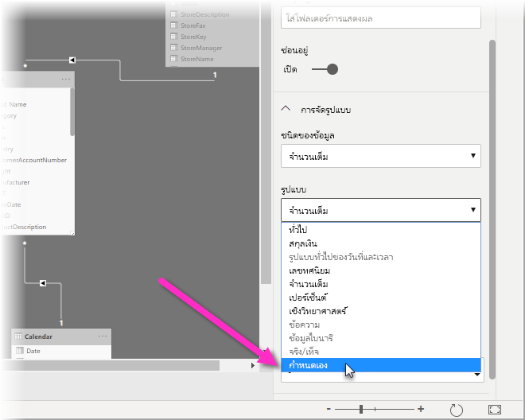
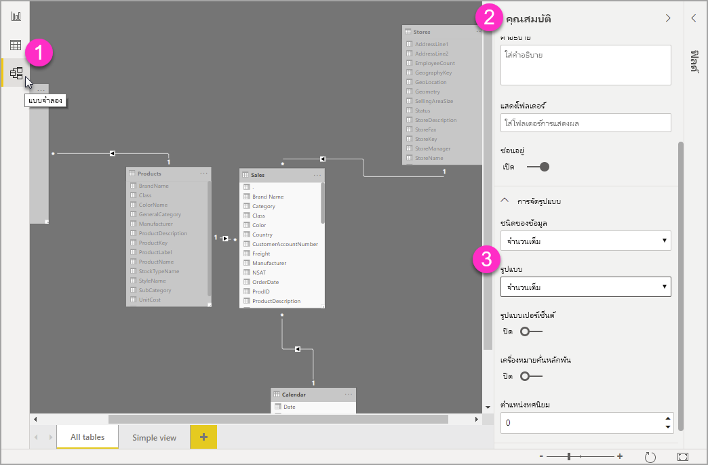
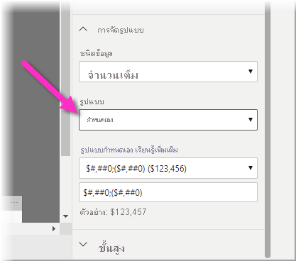

# ใช้สตริงรูปแบบแบบกำหนดเองใน Power BI DesktopUse custom format strings in Power BI Desktop

ด้วยสตริงรูปแบบแบบกำหนดเองใน **Power BI Desktop**  คุณสามารถกำหนดวิธีที่เขตข้อมูลจะปรากฏในวิชวล และตรวจสอบให้แน่ใจว่ารายงานของคุณมีลักษณะเหมือนกับที่คุณต้องการอยากให้เป็นWith custom format strings in **Power BI Desktop**, you can customize how fields appear in visuals, and make sure your reports look just the way you want them to look.

## วิธีการใช้สตริงรูปแบบแบบกำหนดเองHow to use custom format strings

เมื่อต้องการสร้างสตริงรูปแบบแบบกำหนดเอง ให้เลือกเขตข้อมูลในมุมมอง **แบบจำลอง** จากนั้นเลือก **รูปแบบ** จากบานหน้าต่าง **คุณสมบัติ**To create custom format strings, select the field in the **Modeling** view, and then select **Format** from the **Properties** pane.

หลังจากที่คุณเลือก **กำหนดเอง** จาก **รูปแบบ** ในรายการดรอปดาวน์แล้วคุณสามารถเลือกจากรายการของสตริงรูปแบบที่ใช้กันทั่วไปOnce you've selected **Custom** from the **Format** drop down, you can select from a list of commonly used format strings. 

## ไวยากรณ์รูปแบบที่กำหนดเองที่ได้รับการสนับสนุนSupported custom format syntax

สตริงรูปแบบแบบกำหนดเองทำตามไวยากรณ์ลักษณะ VBA ซึ่งใช้ทั่วไปสำหรับ Excel และผลิตภัณฑ์อื่น ๆ ของ Microsoft แต่ไม่สนับสนุนไวยากรณ์ทั้งหมดที่ใช้ในผลิตภัณฑ์อื่น ๆCustom format strings follow the VBA style syntax, common to Excel and other Microsoft products, but do not support all syntax used in other products. 

ตารางต่อไปนี้กำหนดไวยากรณ์ที่ได้รับการสนับสนุนใน Power BIThe following tables define the syntax supported in Power BI.

ตารางต่อไปนี้แสดง **สัญลักษณ์วันที่** ที่ได้รับการสนับสนุน:The following table shows supported **Date symbols**:

| **สัญลักษณ์****Symbol** | **ช่วง****Range** |
| --- | --- |
| _d__d_ | 1-31 (วันของเดือนโดยไม่มีศูนย์นำหน้า)1-31 (Day of month, with no leading zero) |
| _dd__dd_ | 01-31 (วันของเดือนโดยมีศูนย์นำหน้า)01-31 (Day of month, with a leading zero) |
| _m__m_ | 1-12 (เดือนของปี โดยไม่มีศูนย์นำหน้า เริ่มต้นด้วยเดือนมกราคม = 1)1-12 (Month of year, with no leading zero, starting with January = 1) |
| _mm__mm_ | 01-12 (เดือนของปี โดยมีศูนย์นำหน้า เริ่มต้นด้วยเดือนมกราคม = 01)01-12 (Month of year, with a leading zero, starting with January = 01) |
| _mmm__mmm_ | แสดงชื่อเดือนที่เป็นตัวย่อ (ชื่อเดือน Hijri ไม่มีตัวย่อ)Displays abbreviated month names (Hijri month names have no abbreviations) |
| _mmmm__mmmm_ | แสดงชื่อเต็มเดือนDisplays full month names |
| _yy__yy_ | 00-99 (สองหลักสุดท้ายของปี)00-99 (Last two digits of year) |
| _yyyy__yyyy_ | 100-9999 (ปีสามหรือสี่หลัก)100-9999 (Three- or Four-digit year) |

ตารางต่อไปนี้แสดง **สัญลักษณ์เวลา** ที่ได้รับการสนับสนุน:The following table shows supported **Time symbols**:

| **สัญลักษณ์****Symbol** | **ช่วง****Range** |
| --- | --- |
| _h__h_ | 0-23 (1-12 ที่มี &quot;AM&quot; หรือ &quot;PM&quot; ต่อท้าย) (ชั่วโมงของวัน โดยไม่มีศูนย์นำหน้า)0-23 (1-12 with &quot;AM&quot; or &quot;PM&quot; appended) (Hour of day, with no leading zero) |
| _hh__hh_ | 00-23 (01-12 ที่มี &quot;AM&quot; หรือ &quot;PM&quot; ต่อท้าย) (ชั่วโมงของวัน โดยมีศูนย์นำหน้า)00-23 (01-12 with &quot;AM&quot; or &quot;PM&quot; appended) (Hour of day, with a leading zero) |
| _n__n_ | 0-59 (นาทีของชั่วโมง โดยไม่มีศูนย์นำหน้า)0-59 (Minute of hour, with no leading zero) |
| _nn__nn_ | 00-59 (นาทีของชั่วโมง โดยมีศูนย์นำหน้า)00-59 (Minute of hour, with a leading zero) |
| _m__m_ | 0-59 (นาทีของชั่วโมง โดยไม่มีศูนย์นำหน้า)0-59 (Minute of hour, with no leading zero). เฉพาะในกรณีที่นำหน้าด้วย _h_ หรือ _hh_Only if preceded by _h_ or _hh_ |
| _mm__mm_ | 00-59 (นาทีของชั่วโมง โดยมีศูนย์นำหน้า)00-59 (Minute of hour, with a leading zero). เฉพาะในกรณีที่นำหน้าด้วย _h_ หรือ _hh_Only if preceded by _h_ or _hh_ |
| _s__s_ | 0-59 (วินาทีของนาที โดยไม่มีศูนย์นำหน้า)0-59 (Second of minute, with no leading zero) |
| _ss__ss_ | 00-59 (วินาทีของนาที โดยมีศูนย์นำหน้า)00-59 (Second of minute, with a leading zero) |

คุณสามารถดู[ตัวอย่าง](/office/vba/language/reference/user-interface-help/format-function-visual-basic-for-applications#example)ของวิธีการจัดรูปแบบสตริงของค่าแบบกำหนดเองYou can see an [example](/office/vba/language/reference/user-interface-help/format-function-visual-basic-for-applications#example) of how to format custom value strings.

นิพจน์รูปแบบที่ผู้ใช้กำหนดเองสำหรับตัวเลขสามารถมาจากหนึ่งถึงสามส่วนที่คั่นด้วยเครื่องหมายอัฒภาคA user-defined format expression for numbers can have from one to three sections separated by semicolons. ถ้าคุณใช้เครื่องหมายอัฒภาคที่ไม่มีสิ่งใดระหว่างเครื่องหมาย ส่วนที่ขาดหายไปจะไม่แสดงขึ้นมา&quot;(จะเป็น&quot;)If you include semicolons with nothing between them, the missing section will not be displayed (it will be &quot;&quot;). ถ้าไม่มีการระบุเครื่องหมายอัฒภาค จะใช้รูปแบบค่าบวกIf the semi-colon is not specified, it will use the positive format.

ต่อไปนี้คือตัวอย่างของรูปแบบที่แตกต่างกันสำหรับสตริงของค่าที่แตกต่างกัน:Here are examples of different formats for different value strings:

|   | **สตริงรูปแบบแบบ****Format Strings** |   |   |   |
| --- | --- | --- | --- | --- |
| **ค่า****Values** | **0.00;-0.0;&quot;ศูนย์&quot;****0.00;-0.0;&quot;Zero&quot;** | **0.00;;****0.00;;** | **0.00;-0.0;****0.00;-0.0;** | **0.00;****0.00;** |
| **-1.234****-1.234** | -1.2-1.2 | &quot;&quot; | -1.2-1.2 | &quot;&quot; |
| **0****0** | &quot;ศูนย์&quot;&quot;Zero&quot; | &quot;&quot; | &quot;&quot; | 0.000.00 |
| **1.234****1.234** | 1.231.23 | 1.231.23 | 1.231.23 | 1.231.23 |

ตารางต่อไปนี้ระบุ **รูปแบบวันที่และเวลาที่ระบุชื่อ** และกำหนดไว้ล่วงหน้า:The following table identifies the predefined **named date and time formats**:

| **ชื่อรูปแบบ****Format name** | **คำอธิบาย****Description** |
| --- | --- |
| **วันที่ทั่วไป****General Date** | แสดงวันที่และ/หรือเวลา ตัวอย่างเช่น 4/3/93 05:34 น.Display a date and/or time, for example, 4/3/93 05:34 PM. ถ้าไม่มีเศษส่วน ให้แสดงเฉพาะวันที่ ตัวอย่างเช่น 4/3/93If there is no fractional part, display only a date, for example, 4/3/93. ถ้าไม่มีจำนวนเต็ม ให้แสดงเวลาเท่านั้น ตัวอย่างเช่น 05:34 น.If there is no integer part, display time only, for example, 05:34 PM. การแสดงวันที่จะถูกกำหนดโดยการตั้งค่าระบบของคุณDate display is determined by your system settings. |
| **วันที่แบบยาว****Long Date** | แสดงวันที่ตามรูปแบบวันที่แบบยาวในระบบของคุณDisplay a date according to your system&#39;s long date format. |
| **วันที่แบบสั้น****Short Date** | แสดงวันที่โดยใช้รูปแบบวันที่แบบสั้นในระบบของคุณDisplay a date using your system&#39;s short date format. |
| **เวลาแบบยาว****Long Time** | แสดงเวลาโดยใช้รูปแบบเวลาแบบยาวในระบบของคุณมีชั่วโมง นาที วินาทีDisplay a time using your system&#39;s long time format; includes hours, minutes, seconds. |
| **เวลาแบบสั้น****Short Time** | แสดงเวลาโดยใช้รูปแบบ 24 ชั่วโมง ตัวอย่างเช่น 17:45Display a time using the 24-hour format, for example, 17:45. |

รูปแบบตัวเลขที่ระบุชื่อNamed numeric formats

ตารางต่อไปนี้ระบุ **รูปแบบตัวเลขที่ระบุชื่อ** และกำหนดไว้ล่วงหน้า:The following table identifies the predefined **named numeric formats**:

| **ชื่อรูปแบบ****Format name** | **คำอธิบาย****Description** |
| --- | --- |
| **หมายเลขทั่วไป****General Number** | แสดงตัวเลขที่ไม่มีตัวคั่นหลักพันDisplay number with no thousand separator. |
| **สกุลเงิน****Currency** | แสดงตัวเลขที่มีตัวคั่นหลักพัน ถ้าเหมาะสม แสดงสองหลักทางด้านขวาของตัวคั่นทศนิยมDisplay number with thousand separator, if appropriate; display two digits to the right of the decimal separator. ผลลัพธ์จะขึ้นอยู่กับการตั้งค่าภาษาของระบบOutput is based on system locale settings. |
| **แบบคงที่****Fixed** | แสดงอย่างน้อยหนึ่งหลักทางซ้ายและสองหลักทางด้านขวาของตัวคั่นทศนิยมDisplay at least one digit to the left and two digits to the right of the decimal separator. |
| **มาตรฐาน****Standard** | แสดงตัวเลขที่มีตัวคั่นหลักพัน อย่างน้อยหนึ่งหลักทางซ้ายและสองหลักทางด้านขวาของตัวคั่นทศนิยมDisplay number with thousand separator, at least one digit to the left and two digits to the right of the decimal separator. |
| **เปอร์เซ็นต์****Percent** | แสดงตัวเลขที่คูณด้วย 100 พร้อมด้วยเครื่องหมายเปอร์เซ็นต์ ( **%** ) ต่อท้ายทางขวา; แสดงสองหลักทางด้านขวาของตัวคั่นทศนิยมเสมอDisplay number multiplied by 100 with a percent sign ( **%** ) appended to the right; always display two digits to the right of the decimal separator. |
| **เชิงวิทยาศาสตร์****Scientific** | ใช้สัญกรณ์ทางวิทยาศาสตร์มาตรฐานUse standard scientific notation. |

ตารางต่อไปนี้ระบุอักขระที่คุณสามารถใช้เพื่อสร้าง **รูปแบบวันที่/เวลาที่ผู้ใช้กำหนด**The following table identifies characters you can use to create **user-defined date/time formats**.

| **อักขระ****Character** | **คำอธิบาย****Description** |
| --- | --- |
| ( **:** )( **:** ) | ตัวคั่นเวลาTime separator. ในบางพื้นที่ อาจใช้อักขระอื่นเพื่อแทนตัวคั่นเวลาIn some locales, other characters may be used to represent the time separator. ตัวคั่นเวลาจะแยกข้อมูลชั่วโมง นาที และวินาทีเมื่อมีการจัดรูปแบบค่าเวลาThe time separator separates hours, minutes, and seconds when time values are formatted. อักขระจริงที่ใช้เป็นตัวคั่นเวลาในผลลัพธ์ที่จัดรูปแบบไว้ถูกกำหนดโดยการตั้งค่าระบบของคุณThe actual character used as the time separator in formatted output is determined by your system settings. |
| ( **/** )( **/** ) | ตัวคั่นวันที่Date separator. ในบางพื้นที่ อาจใช้อักขระอื่นเพื่อแทนตัวคั่นวันที่In some locales, other characters may be used to represent the date separator. ตัวคั่นวันที่จะแยกข้อมูลวัน เดือน และปีเมื่อมีการจัดรูปแบบค่าวันที่The date separator separates the day, month, and year when date values are formatted. อักขระจริงที่ใช้เป็นตัวคั่นวันที่ในผลลัพธ์ที่จัดรูปแบบไว้ถูกกำหนดโดยการตั้งค่าระบบของคุณThe actual character used as the date separator in formatted output is determined by your system settings. |
| dd | แสดงวันที่เป็นตัวเลขโดยไม่มีเลขศูนย์นำหน้า (1-31)Display the day as a number without a leading zero (1–31). |
| dddd | แสดงวันที่เป็นตัวเลขโดยมีเลขศูนย์นำหน้า (01-31)Display the day as a number with a leading zero (01–31). |
| dddddd | แสดงวันเป็นตัวอักษรย่อ (อา-ส)Display the day as an abbreviation (Sun–Sat). แปลภาษาแล้วLocalized. |
| dddddddd | แสดงวันเป็นชื่อเต็ม (วันอาทิตย์ - วันเสาร์)Display the day as a full name (Sunday–Saturday). แปลภาษาแล้วLocalized. |
| mm | แสดงเดือนเป็นตัวเลขโดยไม่มีเลขศูนย์นำหน้า (1–12)Display the month as a number without a leading zero (1–12). ถ้า m ตามหลัง h หรือ hh ทันที นาทีจะแสดงในรูปแบบเดือนIf m immediately follows h or hh, the minute rather than the month is displayed. |
| mmmm | แสดงเดือนเป็นตัวเลขโดยมีเลขศูนย์นำหน้า (01–12)Display the month as a number with a leading zero (01–12). ถ้า m ตามหลัง h หรือ hh ทันที นาทีจะแสดงในรูปแบบเดือนIf m immediately follows h or hh, the minute rather than the month is displayed. |
| mmmmmm | แสดงเดือนเป็นตัวอักษรย่อ (ม.ค. - ธ.ค.)Display the month as an abbreviation (Jan–Dec). แปลภาษาแล้วLocalized. |
| mmmmmmmm | แสดงเดือนเป็นชื่อเต็ม (มกราคม - ธันวาคม)Display the month as a full month name (January–December). แปลภาษาแล้วLocalized. |
| yyyy | แสดงปีเป็นตัวเลข 2 หลัก (00 – 99)Display the year as a 2-digit number (00–99). |
| yyyyyyyy | แสดงปีเป็นตัวเลข 4 หลัก (100 – 9999)Display the year as a 4-digit number (100–9999). |
| hh | แสดงชั่วโมงเป็นตัวเลขโดยไม่มีเลขศูนย์นำหน้า (0–23)Display the hour as a number without a leading zero (0–23). |
| hhhh | แสดงชั่วโมงเป็นตัวเลขโดยมีเลขศูนย์นำหน้า (00–23)Display the hour as a number with a leading zero (00–23). |
| nn | แสดงนาทีเป็นตัวเลขโดยไม่มีเลขศูนย์นำหน้า (0–59)Display the minute as a number without a leading zero (0–59). |
| nnnn | แสดงนาทีเป็นตัวเลขโดยมีเลขศูนย์นำหน้า (00–59)Display the minute as a number with a leading zero (00–59). |
| ss | แสดงวินาทีเป็นตัวเลขโดยไม่มีเลขศูนย์นำหน้า (0–59)Display the second as a number without a leading zero (0–59). |
| ssss | แสดงวินาทีเป็นตัวเลขโดยมีเลขศูนย์นำหน้า (00–59)Display the second as a number with a leading zero (00–59). |
| AM/PMAM/PM | ใช้นาฬิกาแบบ 12 ชั่วโมงและแสดง AM ตัวพิมพ์ใหญ่พร้อมด้วยเวลาก่อนเที่ยง แสดง PM ตัวพิมพ์ใหญ่พร้อมด้วยเวลาระหว่างเวลาเที่ยงและ11:59 P.M.Use the 12-hour clock and display an uppercase AM with any hour before noon; display an uppercase PM with any hour between noon and 11:59 P.M. |

ตารางต่อไปนี้ระบุอักขระที่คุณสามารถใช้เพื่อสร้าง **รูปแบบตัวเลขที่ผู้ใช้กำหนด**The following table identifies characters you can use to create **user-defined number formats**.

| **อักขระ****Character** | **คำอธิบาย****Description** |
| --- | --- |
| ไม่มีNone | แสดงตัวเลขที่ไม่มีการจัดรูปแบบDisplay the number with no formatting. |
| ( **0** )( **0** ) | ตัวแทนตัวเลขDigit placeholder. แสดงตัวเลขหรือศูนย์Display a digit or a zero. ถ้านิพจน์มีตัวเลขในตำแหน่งที่ 0 ปรากฏในสตริงรูปแบบ จะแสดงตัวเลขขึ้น มิฉะนั้นจะแสดงศูนย์ในตำแหน่งนั้นIf the expression has a digit in the position where the 0 appears in the format string, display it; otherwise, display a zero in that position. ถ้าตัวเลขมีจำนวนหลักน้อยกว่ามีเลขศูนย์ (ด้านหนึ่งของทศนิยม) ในนิพจน์รูปแบบ จะแสดงเลขศูนย์นำหน้าหรือต่อท้ายIf the number has fewer digits than there are zeros (on either side of the decimal) in the format expression, display leading or trailing zeros. ถ้าตัวเลขมีจำนวนหลักทางด้านขวาของตัวคั่นทศนิยมมากกว่ามีเลขศูนย์ทางด้านขวาของตัวคั่นทศนิยมในนิพจน์รูปแบบ ให้ปัดเศษตัวเลขเป็นจุดทศนิยมมากเท่าที่มีเลชศูนย์If the number has more digits to the right of the decimal separator than there are zeros to the right of the decimal separator in the format expression, round the number to as many decimal places as there are zeros. ถ้าตัวเลขมีจำนวนหลักทางด้านซ้ายของตัวคั่นทศนิยมมากกว่ามีเลขศูนย์ทางด้านซ้ายของตัวคั่นทศนิยมในนิพจน์รูปแบบ จะแสดงตัวเลขพิเศษโดยไม่มีการแก้ไขIf the number has more digits to the left of the decimal separator than there are zeros to the left of the decimal separator in the format expression, display the extra digits without modification. |
| ( **#** )( **#** ) | ตัวแทนตัวเลขDigit placeholder. แสดงตัวเลขหรือไม่มีDisplay a digit or nothing. ถ้านิพจน์มีตัวเลขในตำแหน่งที่ # ปรากฏในสตริงรูปแบบ จะแสดงตัวเลขขึ้น มิฉะนั้นจะไม่แสดงอะไรในตำแหน่งนั้นIf the expression has a digit in the position where the # appears in the format string, display it; otherwise, display nothing in that position. สัญลักษณ์นี้ทำงานเหมือนกับตัวแทนเลข 0 ยกเว้นว่าเลขศูนย์นำหน้าและต่อท้ายจะไม่แสดงขึ้นมาถ้าตัวเลขมีจำนวนหลักเท่ากันหรือน้อยกว่ามี # อักขระที่อยู่ด้านใดด้านหนึ่งของตัวคั่นทศนิยมในนิพจน์รูปแบบThis symbol works like the 0 digit placeholder, except that leading and trailing zeros aren&#39;t displayed if the number has the same or fewer digits than there are # characters on either side of the decimal separator in the format expression. |
| ( **.**( **.** )) | ตัวแทนทศนิยมDecimal placeholder. ในบางพื้นที่ ใช้จุลภาคเป็นตัวคั่นทศนิยมIn some locales, a comma is used as the decimal separator. ตัวแทนทศนิยมจะกำหนดจำนวนหลักที่แสดงทางด้านซ้ายและด้านขวาของตัวคั่นทศนิยมThe decimal placeholder determines how many digits are displayed to the left and right of the decimal separator. ถ้านิพจน์รูปแบบประกอบด้วยเครื่องหมายตัวเลขทางด้านซ้ายของสัญลักษณ์นี้เท่านั้น จำนวนที่น้อยกว่า 1 จะเริ่มต้นด้วยตัวคั่นทศนิยมIf the format expression contains only number signs to the left of this symbol, numbers smaller than 1 begin with a decimal separator. เมื่อต้องการแสดงศูนย์นำหน้าพร้อมด้วยตัวเลขเศษส่วน ให้ใช้ 0 เป็นตัวแทนหลักแรกทางด้านซ้ายของตัวคั่นทศนิยมTo display a leading zero displayed with fractional numbers, use 0 as the first digit placeholder to the left of the decimal separator. อักขระจริงที่ใช้เป็นตัวแทนทศนิยมในผลลัพธ์ที่จัดรูปแบบไว้จะขึ้นอยู่กับรูปแบบตัวเลขที่ระบบของคุณรู้จักThe actual character used as a decimal placeholder in the formatted output depends on the Number Format recognized by your system. |
| ( **%)**(**%)** | ตัวแทนเปอร์เซ็นต์Percentage placeholder. นิพจน์จะคูณด้วย 100The expression is multiplied by 100. อักขระเปอร์เซ็นต์ ( **%** ) ถูกแทรกในตำแหน่งที่ปรากฏในสตริงรูปแบบThe percent character ( **%** ) is inserted in the position where it appears in the format string. |
| ( **,** )( **,** ) | ตัวคั่นหลักพันThousand separator. ในบางพื้นที่ ใช้เครื่องหมายมหัพภาคเป็นตัวคั่นหลักพันIn some locales, a period is used as a thousand separator. ตัวคั่นหลักพันจะแยกจำนวนหลักพันออกจากหลักร้อยภายในตัวเลขที่มีสี่ตำแหน่งขึ้นไปทางด้านซ้ายของตัวคั่นทศนิยมThe thousand separator separates thousands from hundreds within a number that has four or more places to the left of the decimal separator. การใช้งานมาตรฐานของตัวคั่นหลักพันถูกระบุไว้หากรูปแบบมีตัวคั่นหลักพันล้อมรอบด้วยตัวแทนตัวเลข (**0**  หรือ  **#** )Standard use of the thousand separator is specified if the format contains a thousand separator surrounded by digit placeholders ( **0**  or  **#** ). ตัวคั่นหลักพันสองตัวที่อยู่ติดกันหรือตัวคั่นหลักพันทางด้านซ้ายของตัวคั่นทศนิยม (ไม่ว่าจะระบุทศนิยมหรือไม่ก็ตาม) หมายถึง &quot;การปรับจำนวนโดยการหารด้วย 1,000 การปัดเศษตามต้องการ&quot; ตัวอย่างเช่น คุณสามารถใช้สตริงรูปแบบ &quot;##0,,&quot; เพื่อแสดง 100,000,000 เป็น 100Two adjacent thousand separators or a thousand separator immediately to the left of the decimal separator (whether or not a decimal is specified) means &quot;scale the number by dividing it by 1000, rounding as needed.&quot; For example, you can use the format string &quot;##0,,&quot; to represent 100 million as 100. ตัวเลขที่มีน้อยกว่า 1,000,000 จะแสดงเป็น 0Numbers smaller than 1 million are displayed as 0. ตัวคั่นหลักพันสองตัวที่ติดกันในตำแหน่งใด ๆ นอกเหนือจากทางด้านซ้ายของตัวคั่นทศนิยมจะถือเป็นเพียงแค่การระบุการใช้ตัวคั่นหลักพันTwo adjacent thousand separators in any position other than immediately to the left of the decimal separator are treated simply as specifying the use of a thousand separator. อักขระจริงที่ใช้เป็นตัวคั่นหลักพันในผลลัพธ์ที่จัดรูปแบบไว้จะขึ้นอยู่กับรูปแบบตัวเลขที่ระบบของคุณรู้จักThe actual character used as the thousand separator in the formatted output depends on the Number Format recognized by your system. |
| ( **:** )( **:** ) | ตัวคั่นเวลาTime separator. ในบางพื้นที่ อาจใช้อักขระอื่นเพื่อแทนตัวคั่นเวลาIn some locales, other characters may be used to represent the time separator. ตัวคั่นเวลาจะแยกข้อมูลชั่วโมง นาที และวินาทีเมื่อมีการจัดรูปแบบค่าเวลาThe time separator separates hours, minutes, and seconds when time values are formatted. อักขระจริงที่ใช้เป็นตัวคั่นเวลาในผลลัพธ์ที่จัดรูปแบบไว้ถูกกำหนดโดยการตั้งค่าระบบของคุณThe actual character used as the time separator in formatted output is determined by your system settings. |
| ( **/** )( **/** ) | ตัวคั่นวันที่Date separator. ในบางพื้นที่ อาจใช้อักขระอื่นเพื่อแทนตัวคั่นวันที่In some locales, other characters may be used to represent the date separator. ตัวคั่นวันที่จะแยกข้อมูลวัน เดือน และปีเมื่อมีการจัดรูปแบบค่าวันที่The date separator separates the day, month, and year when date values are formatted. อักขระจริงที่ใช้เป็นตัวคั่นวันที่ในผลลัพธ์ที่จัดรูปแบบไว้ถูกกำหนดโดยการตั้งค่าระบบของคุณThe actual character used as the date separator in formatted output is determined by your system settings. |
| ( **E- E+ e- e+** )( **E- E+ e- e+** ) | รูปแบบทางวิทยาศาสตร์Scientific format. ถ้านิพจน์รูปแบบประกอบด้วยตัวแทนตัวเลขอย่างน้อยหนึ่งตัว ( **0**  หรือ  **#** ) ทางด้านขวาของ E-, E+, e-หรือ e+ ตัวเลขจะแสดงในรูปแบบทางวิทยาศาสตร์และ E หรือ e ถูกแทรกระหว่างตัวเลขและเลขชี้กำลังIf the format expression contains at least one digit placeholder ( **0**  or  **#** ) to the right of E-, E+, e-, or e+, the number is displayed in scientific format and E or e is inserted between the number and its exponent. จำนวนของตัวแทนตัวเลขทางด้านขวาจะกำหนดจำนวนหลักในเลขชี้กำลังThe number of digit placeholders to the right determines the number of digits in the exponent. ใช้ E-หรือ e-เพื่อใส่เครื่องหมายลบถัดจากเลขชี้กำลังที่เป็นลบUse E- or e- to place a minus sign next to negative exponents. ใช้ E+ หรือ e+ เพื่อใส่เครื่องหมายลบถัดจากเลขชี้กำลังที่เป็นลบและเครื่องหมายบวกถัดจากเลขชี้กำลังที่เป็นบวกUse E+ or e+ to place a minus sign next to negative exponents and a plus sign next to positive exponents. |
| **- + $**  ( )**- + $**  ( ) | แสดงอักขระสัญพจน์Display a literal character. เมื่อต้องการแสดงอักขระอื่นนอกเหนือจากหนึ่งในอักขระเหล่านั้นที่ระบุไว้ ให้นำหน้าด้วยเครื่องหมายทับขวา (\) หรือใส่ไว้ในอัญประกาศคู่ (&quot; &quot;)To display a character other than one of those listed, precede it with a backslash (\) or enclose it in double quotation marks (&quot; &quot;). |
| ( \* *\** )( \**\** ) | แสดงอักขระถัดไปในสตริงรูปแบบDisplay the next character in the format string. เมื่อต้องการแสดงอักขระที่มีความหมายพิเศษเป็นอักขระสัญพจน์ ให้นำหน้าด้วยเครื่องหมายทับขวา (\)To display a character that has special meaning as a literal character, precede it with a backslash (\). เครื่องหมายทับขวาของตัวเองจะไม่แสดงขึ้นThe backslash itself isn&#39;t displayed. การใช้เครื่องหมายทับขวาจะเหมือนกับการล้อมอักขระถัดไปในอัญประกาศคู่Using a backslash is the same as enclosing the next character in double quotation marks. หากต้องการแสดงเครื่องหมายทับขวา ให้ใช้เครื่องหมายทับขวาสองเครื่องหมาย (\\)To display a backslash, use two backslashes (\\). ตัวอย่างของอักขระที่ไม่สามารถแสดงเป็นอักขระสัญพจน์เป็นอักขระการจัดรูปแบบวันที่และอักขระการจัดรูปแบบเวลา (a, c, d, h, m, n, p, q, s, t, w, / และ:), อักขระการจัดรูปแบบตัวเลข (#, 0,%, E, e, จุลภาค และจุด) และ อักขระการจัดรูปแบบสตริง (@, &amp;, \&lt;, \&gt;, และ !)Examples of characters that can&#39;t be displayed as literal characters are the date-formatting and time-formatting characters (a, c, d, h, m, n, p, q, s, t, w, /, and :), the numeric-formatting characters (#, 0, %, E, e, comma, and period), and the string-formatting characters (@, &amp;, \&lt;, \&gt;, and !). |
| (&quot;ABC&quot;)(&quot;ABC&quot;) | แสดงสตริงที่อยู่ภายในเครื่องหมายอัญประกาศคู่ (&quot; &quot;)Display the string inside the double quotation marks (&quot; &quot;). |

## ขั้นตอนถัดไปNext steps
คุณอาจสนใจบทความต่อไปนี้:You might also be interested in the following articles:

* [สตริงรูปแบบแบบ VBAVBA format strings](/office/vba/language/reference/user-interface-help/format-function-visual-basic-for-applications#example)
* [มาตรการในเดสก์ทอป Power BIMeasures in Power BI Desktop](../transform-model/desktop-measures.md)
* [ชนิดข้อมูลใน Power BI DesktopData types in Power BI Desktop](../connect-data/desktop-data-types.md)
* [การจัดรูปแบบตามเงื่อนไขในตารางConditional formatting in tables](desktop-conditional-table-formatting.md)