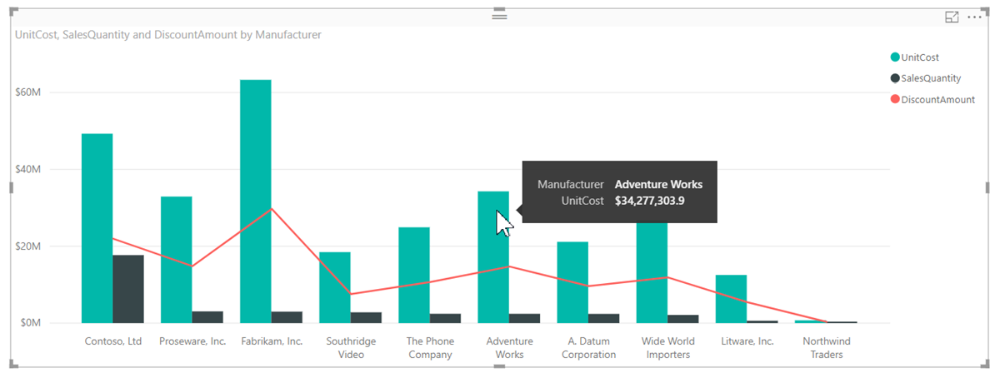
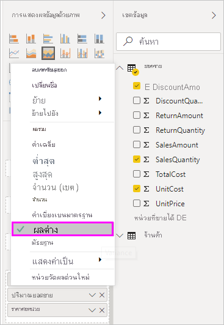

# คำแนะนำเครื่องมือแบบกำหนดเองใน Power BI Desktop

คำแนะนำเครื่องมือเป็นวิธีที่เหมาะสมในการให้ข้อมูลตามบริบทและรายละเอียดไปยังจุดข้อมูลบนภาพได้มากกว่า รูปต่อไปนี้แสดงคำแนะนำเครื่องมือที่นำไปใช้กับแผนภูมิใน Power BI Desktop

เมื่อมีการสร้างภาพ คำแนะนำเครื่องมือเริ่มต้นจะแสดงค่าและประเภทของจุดข้อมูล มีหลายกรณีเมื่อกำหนดข้อมูลคำแนะนำเครื่องมือให้เป็นประโยชน์ คำแนะนำเครื่องมือการกำหนดเองให้บริบทและข้อมูลเพิ่มเติมสำหรับผู้ใช้ที่ดูวิชวล คำแนะนำเครื่องมือแบบกำหนดเองช่วยให้คุณสามารถระบุจุดข้อมูลเพิ่มเติมที่แสดงเป็นส่วนหนึ่งของคำแนะนำดังกล่าว

## วิธีการกำหนดคำแนะนำเครื่องมือด้วยตนเอง

เมื่อต้องสร้างคำแนะนำแบบกำหนดเอง ในแอ่ง **เขตข้อมูล** ของแผง **การแสดงผลด้วยภาพ** ลากเขตข้อมูลลงในบักเก็ต **คำแนะนำเครื่องมือ** ที่แสดงในรูปต่อไปนี้ ในรูปต่อไปนี้ มีสามเขตข้อมูลถูกใส่ไว้ในบักเก็ต **คำแนะนำเครื่องมือ**

เมื่อเพิ่มคำแนะนำเครื่องมือเข้าไปยัง **คำแนะนำเครื่องมือ** โฮเวอร์เหนือจุดข้อมูลบนการแสดงผลด้วยภาพ จะแสดงค่าสำหรับเขตข้อมูลเหล่านั้น

## กำหนดคำแนะนำเครื่องมือด้วยการรวมหรือการวัดผลด่วน

คุณสามารถกำหนดคำแนะนำเครื่องมือโดยการเลือกฟังก์ชันการรวมหรือ *การวัดด่วน* เลือกลูกศรที่อยู่ข้างๆ เขตข้อมูลในบักเก็ต **คำแนะนำเครื่องมือ** จากนั้นเลือกจากตัวเลือกที่พร้อมใช้งาน

มีหลายวิธีในการกำหนดคำแนะนำเครื่องมือด้วยตนเอง โดยการใช้เขตข้อมูลใดๆ ที่พร้อมใช้งานไปยังการสื่อข้อมูลอย่างรวดเร็วและข้อมูลเชิงลึกกับผู้ใช้ที่ดูแดชบอร์ดหรือรายงานของคุณ
