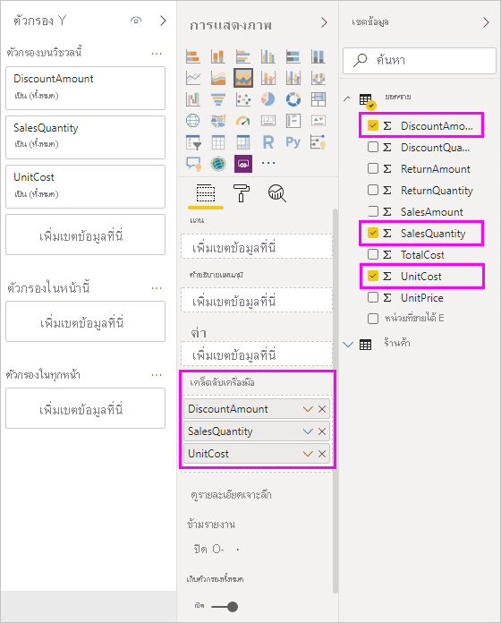

# คำแนะนำเครื่องมือแบบกำหนดเองใน Power BI DesktopCustomize tooltips in Power BI Desktop

คำแนะนำเครื่องมือเป็นวิธีที่เหมาะสมในการให้ข้อมูลตามบริบทและรายละเอียดไปยังจุดข้อมูลบนภาพได้มากกว่าTooltips are an elegant way of providing more contextual information and detail to data points on a visual. รูปต่อไปนี้แสดงคำแนะนำเครื่องมือที่นำไปใช้กับแผนภูมิใน Power BI DesktopThe following image shows a tooltip applied to a chart in Power BI Desktop.

เมื่อมีการสร้างภาพ คำแนะนำเครื่องมือเริ่มต้นจะแสดงค่าและประเภทของจุดข้อมูลWhen a visualization is created, the default tooltip displays the data point's value and category. มีหลายกรณีเมื่อกำหนดข้อมูลคำแนะนำเครื่องมือให้เป็นประโยชน์There are many instances when customizing the tooltip information is useful. คำแนะนำเครื่องมือการกำหนดเองให้บริบทและข้อมูลเพิ่มเติมสำหรับผู้ใช้ที่ดูวิชวลCustomizing tooltips provides additional context and information for users viewing the visual. คำแนะนำเครื่องมือแบบกำหนดเองช่วยให้คุณสามารถระบุจุดข้อมูลเพิ่มเติมที่แสดงเป็นส่วนหนึ่งของคำแนะนำดังกล่าวCustom tooltips enable you to specify additional data points that display as part of the tooltip.

## วิธีการกำหนดคำแนะนำเครื่องมือด้วยตนเองHow to customize tooltips

เมื่อต้องสร้างคำแนะนำแบบกำหนดเอง ในแอ่ง **เขตข้อมูล** ของแผง **การแสดงผลด้วยภาพ** ลากเขตข้อมูลลงในบักเก็ต **คำแนะนำเครื่องมือ** ที่แสดงในรูปต่อไปนี้To create a customized tooltip, in the **Fields** well of the **Visualizations** pane, drag a field into the **Tooltips** bucket, shown in the following image. ในรูปต่อไปนี้ มีสามเขตข้อมูลถูกใส่ไว้ในบักเก็ต **คำแนะนำเครื่องมือ**In the following image, three fields have been placed into the **Tooltips** bucket.

เมื่อเพิ่มคำแนะนำเครื่องมือเข้าไปยัง **คำแนะนำเครื่องมือ** โฮเวอร์เหนือจุดข้อมูลบนการแสดงผลด้วยภาพ จะแสดงค่าสำหรับเขตข้อมูลเหล่านั้นOnce tooltips are added to **Tooltips**, hovering over a data point on the visualization shows the values for those fields.

## กำหนดคำแนะนำเครื่องมือด้วยการรวมหรือการวัดผลด่วนCustomizing tooltips with aggregation or quick measures

คุณสามารถกำหนดคำแนะนำเครื่องมือโดยการเลือกฟังก์ชันการรวมหรือ *การวัดด่วน*You can further customize a tooltip by selecting an aggregation function or a *quick measure*. เลือกลูกศรที่อยู่ข้างๆ เขตข้อมูลในบักเก็ต **คำแนะนำเครื่องมือ**Select the arrow beside the field in the **Tooltips** bucket. จากนั้นเลือกจากตัวเลือกที่พร้อมใช้งานThen, select from the available options.

มีหลายวิธีในการกำหนดคำแนะนำเครื่องมือด้วยตนเอง โดยการใช้เขตข้อมูลใดๆ ที่พร้อมใช้งานไปยังการสื่อข้อมูลอย่างรวดเร็วและข้อมูลเชิงลึกกับผู้ใช้ที่ดูแดชบอร์ดหรือรายงานของคุณThere are many ways to customize tooltips, using any field available in your dataset, to convey quick information and insights to users viewing your dashboards or reports.
