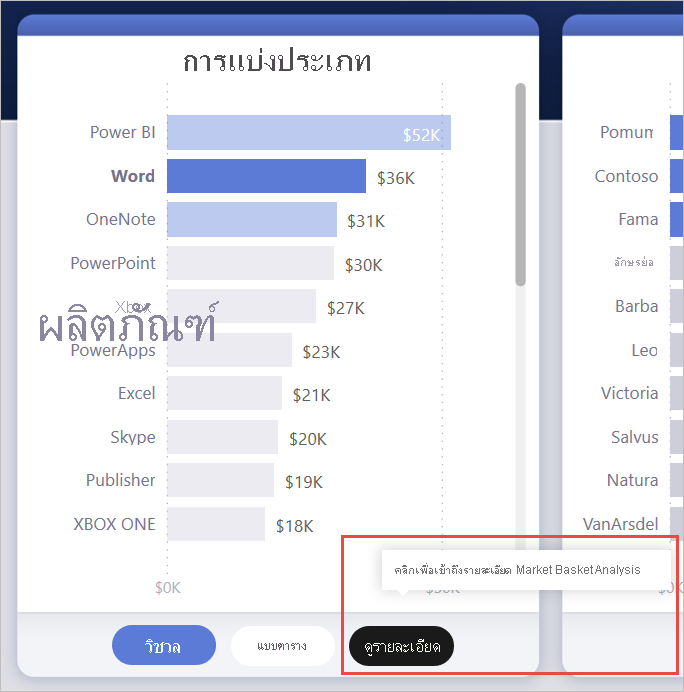
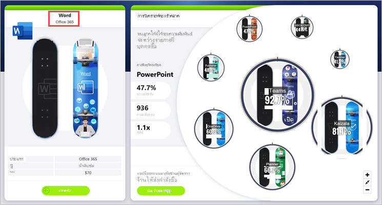
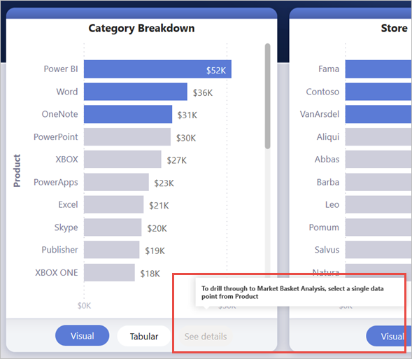
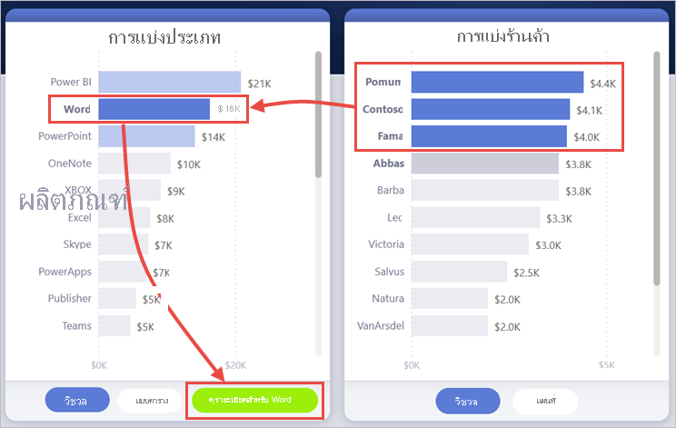
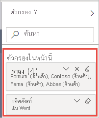
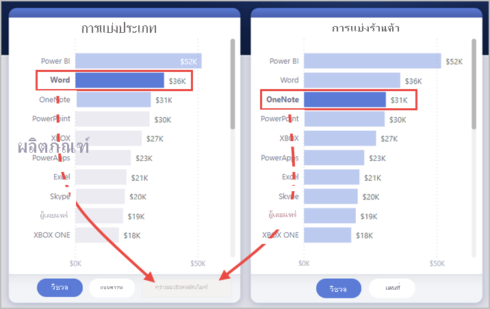
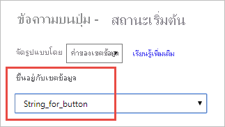

# <a name="create-a-drill-through-button-in-power-bi"></a><span data-ttu-id="53ffb-103">สร้างปุ่มการเข้าถึงรายละเอียดใน Power BI</span><span class="sxs-lookup"><span data-stu-id="53ffb-103">Create a drill-through button in Power BI</span></span>

<span data-ttu-id="53ffb-104">คุณสามารถสร้างปุ่ม *การเข้าถึงรายละเอียด* ใน Power BI ได้ ปุ่มที่เข้าถึงรายละเอียดในหน้ารายละเอียดที่มีการกรองสำหรับบริบทที่ระบุ</span><span class="sxs-lookup"><span data-stu-id="53ffb-104">You can create a *drill-through* button in Power BI, a button that drills through to a page with details that are filtered to a specific context.</span></span>

<span data-ttu-id="53ffb-105">วิธีหนึ่งในการเข้าถึงรายละเอียดในรายงานคือการคลิกขวาในวิชวล</span><span class="sxs-lookup"><span data-stu-id="53ffb-105">One way to drill through in a report is to right-click in a visual.</span></span> <span data-ttu-id="53ffb-106">ถ้าคุณต้องการให้การดำเนินการเข้ารายละเอียดที่ชัดเจนขึ้น คุณสามารถสร้างปุ่มการเข้าถึงรายละเอียดแทนได้</span><span class="sxs-lookup"><span data-stu-id="53ffb-106">If you want the drill-through action to be more obvious, you can create a drill-though button instead.</span></span> <span data-ttu-id="53ffb-107">ปุ่มสามารถเพิ่มความสามารถในการค้นหาของสถานการณ์การเข้าถึงรายละเอียดที่สำคัญในรายงานของคุณ</span><span class="sxs-lookup"><span data-stu-id="53ffb-107">The button can increase the discoverability of important drill-through scenarios in your reports.</span></span> <span data-ttu-id="53ffb-108">คุณสามารถกำหนดลักษณะและการทำงานของปุ่มได้มากตามเงื่อนไข</span><span class="sxs-lookup"><span data-stu-id="53ffb-108">You can conditionally determine much of how the button looks and acts.</span></span> <span data-ttu-id="53ffb-109">ตัวอย่างเช่น คุณสามารถแสดงข้อความที่แตกต่างกันบนปุ่มถ้าตรงตามเงื่อนไขบางอย่าง</span><span class="sxs-lookup"><span data-stu-id="53ffb-109">For example, you can show different text on a button if certain conditions are met.</span></span> <span data-ttu-id="53ffb-110">อ่านรายละเอียด</span><span class="sxs-lookup"><span data-stu-id="53ffb-110">Read on for details.</span></span> 

<span data-ttu-id="53ffb-111">ในตัวอย่างนี้ หลังจากที่คุณเลือกแถบคำในแผนภูมิ ปุ่ม **ดูรายละเอียด** จะเปิดใช้งาน</span><span class="sxs-lookup"><span data-stu-id="53ffb-111">In this example, after you select the Word bar in the chart, the **See details** button is enabled.</span></span>



<span data-ttu-id="53ffb-113">เมื่อคุณเลือกปุ่ม **ดูรายละเอียด** คุณจะเข้าถึงรายละเอียดในหน้า Market Basket Analysis</span><span class="sxs-lookup"><span data-stu-id="53ffb-113">When you select the **See details** button, you drill through to the Market Basket Analysis page.</span></span> <span data-ttu-id="53ffb-114">ตามที่คุณเห็นจากวิชวลด้านซ้าย หน้าการเข้าถึงรายละเอียดจะถูกกรองตามคำ</span><span class="sxs-lookup"><span data-stu-id="53ffb-114">As you can see from the visual on the left, the drill-through page is now filtered for Word.</span></span>



## <a name="set-up-a-drill-through-button"></a><span data-ttu-id="53ffb-116">ตั้งค่าปุ่มการเข้าถึงรายละเอียด</span><span class="sxs-lookup"><span data-stu-id="53ffb-116">Set up a drill-through button</span></span>

<span data-ttu-id="53ffb-117">หากต้องการตั้งค่าปุ่มการเข้าถึงรายละเอียด ก่อนอื่นคุณต้อง[ตั้งค่าหน้าการเข้าถึงรายละเอียดที่ถูกต้อง](desktop-drillthrough.md)ภายในรายงานของคุณ</span><span class="sxs-lookup"><span data-stu-id="53ffb-117">To set up a drill-through button, you first need to [set up a valid drill-through page](desktop-drillthrough.md) within your report.</span></span> <span data-ttu-id="53ffb-118">จากนั้นคุณต้องสร้างปุ่มที่มี **การเข้าถึงรายละเอียด** เป็นประเภทการดำเนินการ และเลือกหน้าการเข้าถึงรายละเอียดเป็น **ปลายทาง**</span><span class="sxs-lookup"><span data-stu-id="53ffb-118">Then, you need to create a button with **Drill through** as the action type and select the drill-through page as the **Destination**.</span></span>

<span data-ttu-id="53ffb-119">เนื่องจากปุ่มการเข้าถึงรายละเอียดมีสองสถานะ เปิดใช้งานเทียบกับปิดใช้งาน คุณจะเห็นตัวเลือกคำแนะนำการใช้งานเครื่องมือสองรายการ</span><span class="sxs-lookup"><span data-stu-id="53ffb-119">Because the drill-through button has two states, enabled vs. disabled, you see two tooltip options.</span></span>


<span data-ttu-id="53ffb-121">หากคุณปล่อยให้กล่องแสดงคำอธิบายว่างเปล่า Power BI จะสร้างกล่องแสดงคำอธิบายโดยอัตโนมัติ</span><span class="sxs-lookup"><span data-stu-id="53ffb-121">If you leave the tooltips boxes blank, Power BI automatically generates tooltips.</span></span> <span data-ttu-id="53ffb-122">กล่องแสดงคำอธิบายดังกล่าวอ้างอิงจากปลายทางและเขตข้อมูลการเข้าถึงรายละเอียด</span><span class="sxs-lookup"><span data-stu-id="53ffb-122">Those tooltips are based on the destination and drill-through field(s).</span></span>

<span data-ttu-id="53ffb-123">ต่อไปนี้คือตัวอย่างของกล่องแสดงคำอธิบายที่สร้างโดยอัตโนมัติ เมื่อปิดใช้งานปุ่ม:</span><span class="sxs-lookup"><span data-stu-id="53ffb-123">Here's an example of the autogenerated tooltip when the button is disabled:</span></span>

<span data-ttu-id="53ffb-124">"หากต้องการเข้าถึงรายละเอียดใน Market Basket Analysis [หน้าปลายทาง] ให้เลือกจุดข้อมูลเดี่ยวจากผลิตภัณฑ์ [เขตข้อมูลการเข้าถึงรายละเอียด]"</span><span class="sxs-lookup"><span data-stu-id="53ffb-124">"To drill through to Market Basket Analysis [the destination page], select a single data point from Product [the drill-through field]."</span></span>



<span data-ttu-id="53ffb-126">และต่อไปนี้คือตัวอย่างของกล่องแสดงคำอธิบายที่สร้างโดยอัตโนมัติ เมื่อเปิดใช้งานปุ่ม:</span><span class="sxs-lookup"><span data-stu-id="53ffb-126">And here's an example of the autogenerated tooltip when the button is enabled:</span></span>

<span data-ttu-id="53ffb-127">"คลิกเพื่อเข้าถึงรายละเอียดใน Market Basket Analysis [หน้าปลายทาง]"</span><span class="sxs-lookup"><span data-stu-id="53ffb-127">"Click to drill through to Market Basket Analysis [the destination page]."</span></span>


<span data-ttu-id="53ffb-129">อย่างไรก็ตาม หากคุณต้องการสร้างกล่องแสดงคำอธิบายแบบกำหนดเอง คุณสามารถใส่สตริงแบบคงที่ได้เสมอ</span><span class="sxs-lookup"><span data-stu-id="53ffb-129">However, if you'd like to provide custom tooltips, you can always input a static string.</span></span> <span data-ttu-id="53ffb-130">คุณยังสามารถใช้[การจัดรูปแบบตามเงื่อนไขกับคำแนะนำเครื่องมือ](#set-formatting-for-tooltips-conditionally)</span><span class="sxs-lookup"><span data-stu-id="53ffb-130">You can also apply [conditional formatting to tooltips](#set-formatting-for-tooltips-conditionally).</span></span>

## <a name="pass-filter-context"></a><span data-ttu-id="53ffb-131">ส่งผ่านบริบทตัวกรอง</span><span class="sxs-lookup"><span data-stu-id="53ffb-131">Pass filter context</span></span>

<span data-ttu-id="53ffb-132">ปุ่มทำงานเหมือนการเข้าถึงรายละเอียดตามปกติ: คุณสามารถส่งผ่านตัวกรองบนเขตข้อมูลเพิ่มเติมได้ โดยการกรองวิชวลที่มีเขตข้อมูลการเข้าถึงรายละเอียดแบบข้ามรายการ</span><span class="sxs-lookup"><span data-stu-id="53ffb-132">The button works like the regular drill through: You can pass filters on additional fields by cross-filtering the visuals that contain the drill-through field.</span></span> <span data-ttu-id="53ffb-133">ตัวอย่างเช่น การใช้ **Ctrl** + **คลิก** และการกรองแบบข้ามรายการ คุณสามารถส่งผ่านตัวกรองหลายรายการบนร้านค้าไปยังหน้าการเข้าถึงรายละเอียดได้เนื่องจากการเลือกของคุณจะกรองวิชวลที่มีเขตข้อมูลผลิตภัณฑ์และการเข้าถึงรายละเอียดแบบข้ามรายการ:</span><span class="sxs-lookup"><span data-stu-id="53ffb-133">For example, using **Ctrl** + **click** and cross-filtering, you can pass multiple filters on Store to the drill-through page because your selections cross-filter the visual that contains Product, the drill-through field:</span></span>



<span data-ttu-id="53ffb-135">หลังจากที่คุณเลือกปุ่มการเข้าถึงรายละเอียด คุณจะเห็นตัวกรองทั้งบนร้านค้าและผลิตภัณฑ์ที่ส่งผ่านไปยังหน้าปลายทาง:</span><span class="sxs-lookup"><span data-stu-id="53ffb-135">After you select the drill-through button, you see filters on both Store and Product being passed through to the destination page:</span></span>



### <a name="ambiguous-filter-context"></a><span data-ttu-id="53ffb-137">บริบทตัวกรองที่ไม่คลุมเครือ</span><span class="sxs-lookup"><span data-stu-id="53ffb-137">Ambiguous filter context</span></span>

<span data-ttu-id="53ffb-138">เนื่องจากปุ่มการเข้าถึงรายละเอียดไม่ได้เชื่อมโยงกับวิชวลรายการเดียว หากการเลือกของคุณนั้นคลุมเครือ ปุ่มจะปิดใช้งาน</span><span class="sxs-lookup"><span data-stu-id="53ffb-138">Since the drill-through button isn't tied to a single visual, if your selection is ambiguous, then the button is disabled.</span></span>

<span data-ttu-id="53ffb-139">ในตัวอย่างนี้ ปุ่มจะปิดใช้งานเนื่องจากวิชวลทั้งสองรายการมีการเลือกผลิตภัณฑ์เดียว</span><span class="sxs-lookup"><span data-stu-id="53ffb-139">In this example, the button is disabled because two visuals both contain a single selection on Product.</span></span> <span data-ttu-id="53ffb-140">มีความคลุมเครือเกี่ยวกับจุดข้อมูลจากวิชวลที่เชื่อมโยงการดำเนินการในการเข้าถึงรายละเอียดกับ:</span><span class="sxs-lookup"><span data-stu-id="53ffb-140">There's ambiguity about which data point from which visual to tie the drill-through action to:</span></span>



## <a name="customize-formatting-for-disabled-buttons"></a><span data-ttu-id="53ffb-142">กำหนดการจัดรูปแบบสำหรับปุ่มที่ปิดใช้งาน</span><span class="sxs-lookup"><span data-stu-id="53ffb-142">Customize formatting for disabled buttons</span></span>
<span data-ttu-id="53ffb-143">คุณสามารถกำหนดตัวเลือกการจัดรูปแบบสำหรับสถานะที่ปิดใช้งานของปุ่มการเข้าถึงรายละเอียดได้</span><span class="sxs-lookup"><span data-stu-id="53ffb-143">You can customize the formatting options for the disabled state of drill-through buttons.</span></span>


:::image type="content" source="media/desktop-drill-through-buttons/drill-through-customize-disabled-button.png" alt-text="กำหนดการจัดรูปแบบปุ่มที่ปิดใช้งาน":::
 
<span data-ttu-id="53ffb-145">ตัวเลือกการจัดรูปแบบเหล่านี้ประกอบด้วย:</span><span class="sxs-lookup"><span data-stu-id="53ffb-145">These formatting options include:</span></span>
- <span data-ttu-id="53ffb-146">**ตัวควบคุมข้อความของปุ่ม**: ข้อความ สี ระยะห่าง การจัดแนว ขนาด และตระกูลแบบอักษร</span><span class="sxs-lookup"><span data-stu-id="53ffb-146">**Button text controls**: text, color, padding, alignment, size, and font family</span></span>

    :::image type="content" source="media/desktop-drill-through-buttons/drill-through-disabled-button-text.png" alt-text="จัดรูปแบบข้อความของปุ่มที่ปิดใช้งาน":::

- <span data-ttu-id="53ffb-148">**ปุ่มเติมตัวควบคุม**: สี ความโปร่งใส และรูปการเติม *ใหม่* (เพิ่มเติมในส่วนถัดไป)</span><span class="sxs-lookup"><span data-stu-id="53ffb-148">**Button fill controls**: color, transparency, and *new* fill image (more on this in the next section)</span></span>

    :::image type="content" source="media/desktop-drill-through-buttons/drill-through-disabled-button-fill.png" alt-text="การเติมปุ่มที่ปิดใช้งาน":::

- <span data-ttu-id="53ffb-150">**ไอคอนควบคุม**: รูปร่าง, ระยะห่าง, การจัดแนว, สีเส้น, ความโปร่งใส และน้ำหนัก</span><span class="sxs-lookup"><span data-stu-id="53ffb-150">**Icon controls**: shape, padding, alignment, line color, transparency, and weight</span></span>

    :::image type="content" source="media/desktop-drill-through-buttons/drill-through-disabled-button-icon.png" alt-text="ไอคอนปุ่มที่ปิดใช้งาน":::

- <span data-ttu-id="53ffb-152">**ตัวควบคุมเค้าร่าง**: สี ความโปร่งใส น้ำหนัก ขอบรอบ</span><span class="sxs-lookup"><span data-stu-id="53ffb-152">**Outline controls**: color, transparency, weight, round edges</span></span>

     :::image type="content" source="media/desktop-drill-through-buttons/drill-through-disabled-button-outline.png" alt-text="เค้าร่างปุ่มที่ปิดใช้งาน":::

## <a name="set-formatting-for-button-text-conditionally"></a><span data-ttu-id="53ffb-154">ตั้งค่าการจัดรูปแบบสำหรับข้อความของปุ่มตามเงื่อนไข</span><span class="sxs-lookup"><span data-stu-id="53ffb-154">Set formatting for button text conditionally</span></span>
<span data-ttu-id="53ffb-155">คุณสามารถใช้การจัดรูปแบบตามเงื่อนไขเพื่อเปลี่ยนแปลงข้อความปุ่มตามค่าเขตข้อมูลที่เลือกไว้ได้</span><span class="sxs-lookup"><span data-stu-id="53ffb-155">You can use conditional formatting to change the button text based on the selected value of a field.</span></span> <span data-ttu-id="53ffb-156">หากต้องการดำเนินการนี้ คุณต้องสร้างหน่วยวัดที่แสดงสตริงที่ต้องการ โดยยึดตามฟังก์ชัน DAX ในส่วน SELECTEDVALUE</span><span class="sxs-lookup"><span data-stu-id="53ffb-156">To do this, you need to create a measure that outputs the desired string based on the DAX function SELECTEDVALUE.</span></span>

<span data-ttu-id="53ffb-157">ต่อไปนี้คือตัวอย่างหน่วยวัดที่แสดงผล “ดูรายละเอียดผลิตภัณฑ์” หากไม่ได้เลือกค่าผลิตภัณฑ์เดี่ยว ไม่เช่นนั้น หน่วยวัดจะแสดงผล “ดูรายละเอียด [ผลิตภัณฑ์ที่เลือกไว้]”</span><span class="sxs-lookup"><span data-stu-id="53ffb-157">Here's an example measure that outputs "See product details" if a single Product value is NOT selected; otherwise, it outputs "See details for [the selected Product]":</span></span>

```dax
String_for_button = If(SELECTEDVALUE('Product'[Product], 0) == 0, "See product details", "See details for " & SELECTEDVALUE('Product'[Product]))
```

<span data-ttu-id="53ffb-158">เมื่อคุณสร้างหน่วยวัดนี้แล้ว ให้คุณเลือกตัวเลือก **การจัดรูปแบบตามเงื่อนไข** สำหรับข้อความปุ่ม:</span><span class="sxs-lookup"><span data-stu-id="53ffb-158">Once you've created this measure, you select the **Conditional formatting** option for the button text:</span></span>


<span data-ttu-id="53ffb-160">จากนั้นจึงเลือกหน่วยวัดที่คุณสร้างไว้สำหรับข้อความปุ่ม:</span><span class="sxs-lookup"><span data-stu-id="53ffb-160">Then, you select the measure you created for the button text:</span></span>



<span data-ttu-id="53ffb-162">เมื่อเลือกผลิตภัณฑ์เดียว ข้อความปุ่มจะอ่าน:</span><span class="sxs-lookup"><span data-stu-id="53ffb-162">When a single product is selected, the button text reads:</span></span>

<span data-ttu-id="53ffb-163">“ดูรายละเอียดตามคำ”</span><span class="sxs-lookup"><span data-stu-id="53ffb-163">"See details for Word"</span></span>


<span data-ttu-id="53ffb-165">เมื่อไม่ได้เลือกผลิตภัณฑ์ หรือเลือกผลิตภัณฑ์มากกว่าหนึ่งรายการ ปุ่มจะปิดใช้งาน</span><span class="sxs-lookup"><span data-stu-id="53ffb-165">When either no products are selected, or more than one product is selected, the button is disabled.</span></span> <span data-ttu-id="53ffb-166">ข้อความของปุ่มจะอ่าน:</span><span class="sxs-lookup"><span data-stu-id="53ffb-166">The button text reads:</span></span>

<span data-ttu-id="53ffb-167">"ดูรายละเอียดผลิตภัณฑ์"</span><span class="sxs-lookup"><span data-stu-id="53ffb-167">"See product details"</span></span>


## <a name="set-formatting-for-tooltips-conditionally"></a><span data-ttu-id="53ffb-169">ตั้งค่าการจัดรูปแบบสำหรับคำแนะนำเครื่องมือตามเงื่อนไข</span><span class="sxs-lookup"><span data-stu-id="53ffb-169">Set formatting for tooltips conditionally</span></span>

<span data-ttu-id="53ffb-170">คุณสามารถจัดรูปแบบคำแนะนำเครื่องมือสำหรับปุ่มการเข้าถึงรายละเอียดเมื่อเปิดใช้งานหรือปิดใช้งานได้</span><span class="sxs-lookup"><span data-stu-id="53ffb-170">You can conditionally format the tooltip for the drill-through button when it's enabled or disabled.</span></span> <span data-ttu-id="53ffb-171">ถ้าคุณได้ใช้การจัดรูปแบบตามเงื่อนไขเพื่อตั้งค่าปลายทางการเข้าถึงรายละเอียดแบบไดนามิก คุณอาจต้องการคำแนะนำเครื่องมือสำหรับสถานะปุ่มเพื่อให้ข้อมูลเพิ่มเติม ทั้งนี้ขึ้นอยู่กับการเลือกของผู้ใช้ปลายทางของคุณ</span><span class="sxs-lookup"><span data-stu-id="53ffb-171">If you've used conditional formatting to dynamically set the drill-through destination, you may want the tooltip for the button state to be more informative, based on your end user’s selection.</span></span> <span data-ttu-id="53ffb-172">นี่คือตัวอย่างบางรายการ:</span><span class="sxs-lookup"><span data-stu-id="53ffb-172">Here are some examples:</span></span>

- <span data-ttu-id="53ffb-173">คุณสามารถตั้งค่าคำแนะนำเครื่องมือที่ปิดใช้งานเพื่อให้เป็นไปตามแต่ละกรณีโดยใช้หน่วยวัดแบบกำหนดเอง</span><span class="sxs-lookup"><span data-stu-id="53ffb-173">You can set the disabled state tooltip to be prescriptive on a case-by-case basis using a custom measure.</span></span> <span data-ttu-id="53ffb-174">ตัวอย่างเช่น ถ้าคุณต้องการให้ผู้ใช้เลือกผลิตภัณฑ์เดียว *และ* ร้านค้าเดียวก่อนที่จะสามารถเข้าถึงรายละเอียดผ่านไปยังหน้า Market Analysis คุณสามารถสร้างหน่วยวัดที่มีตรรกะดังต่อไปนี้:</span><span class="sxs-lookup"><span data-stu-id="53ffb-174">For example, if you want the user to select a single product *and* a single store before they can drill through to the Market Analysis page, you can create a measure with the following logic:</span></span>

    <span data-ttu-id="53ffb-175">ถ้าผู้ใช้ไม่ได้เลือกผลิตภัณฑ์เดี่ยวหรือร้านค้าเดี่ยว หน่วยวัดจะส่งกลับ: "เลือกผลิตภัณฑ์เดียวและ Ctrl + คลิกเพื่อเลือกร้านค้าเดียว"</span><span class="sxs-lookup"><span data-stu-id="53ffb-175">If the user hasn't selected either a single product or a single store, the measure returns: “Select a single product and Ctrl + click to also select a single store.”</span></span>

    <span data-ttu-id="53ffb-176">ถ้าผู้ใช้เลือกผลิตภัณฑ์เดียวแต่ไม่ใช่ร้านเดียว หน่วยวัดจะส่งกลับ: "Ctrl + คลิกเพื่อเลือกร้านค้าเดียว"</span><span class="sxs-lookup"><span data-stu-id="53ffb-176">If the user has selected a single product, but not a single store, the measure returns: “Ctrl + click to also select a single store.”</span></span>

- <span data-ttu-id="53ffb-177">ในทำนองเดียวกัน คุณสามารถตั้งค่าคำแนะนำเครื่องมือที่เปิดใช้งานเพื่อระบุการเลือกของผู้ใช้</span><span class="sxs-lookup"><span data-stu-id="53ffb-177">Similarly, you can set the enabled-state tooltip to be specific the user’s selection.</span></span> <span data-ttu-id="53ffb-178">ตัวอย่างเช่น ถ้าคุณต้องการให้ผู้ใช้ทราบว่าผลิตภัณฑ์และร้านค้าใดที่หน้าการเข้าถึงรายละเอียดจะถูกกรองไปยัง คุณสามารถสร้างหน่วยวัดที่ส่งกลับ:</span><span class="sxs-lookup"><span data-stu-id="53ffb-178">For example, if you want the user to know which product and store the drill-through page will be filtered to, you can create a measure that returns:</span></span>

    <span data-ttu-id="53ffb-179">“คลิกเพื่อเข้าถึงรายละเอียดใน [ชื่อหน้าการเข้าถึงรายละเอียด] เพื่อดูรายละเอียดเพิ่มเติมเกี่ยวกับยอดขายสำหรับ [ชื่อผลิตภัณฑ์] ที่ร้านค้า [ชื่อร้านค้า]”</span><span class="sxs-lookup"><span data-stu-id="53ffb-179">“Click to drill through to [drill-through page name] to see more details on sales for [product name] at [store name] stores.”</span></span>


## <a name="set-the-drill-through-destination-conditionally"></a><span data-ttu-id="53ffb-180">ตั้งค่าปลายทางการเข้าถึงรายละเอียดตามเงื่อนไข</span><span class="sxs-lookup"><span data-stu-id="53ffb-180">Set the drill-through destination conditionally</span></span>

<span data-ttu-id="53ffb-181">คุณสามารถใช้การจัดรูปแบบตามเงื่อนไขเพื่อตั้งค่าปลายทางการเข้าถึงรายละเอียดตามผลลัพธ์ของหน่วยวัดได้</span><span class="sxs-lookup"><span data-stu-id="53ffb-181">You can use conditional formatting to set the drill-through destination based on the output of a measure.</span></span>

<span data-ttu-id="53ffb-182">ต่อไปนี้คือบางสถานการณ์ที่คุณอาจต้องการให้ปลายการเข้าถึงรายละเอียดของปุ่มเป็นไปตามเงื่อนไข:</span><span class="sxs-lookup"><span data-stu-id="53ffb-182">Here are some scenarios where you might want the button drill-through destination to be conditional:</span></span>

- <span data-ttu-id="53ffb-183">คุณต้องการเปิดใช้งานการเข้าถึงรายละเอียดในหน้า **เมื่อตรงตามหลายเงื่อนไข**</span><span class="sxs-lookup"><span data-stu-id="53ffb-183">You only want to enable drill through to a page **when multiple conditions have been met**.</span></span> <span data-ttu-id="53ffb-184">มิฉะนั้นปุ่มจะถูกปิดใช้งาน</span><span class="sxs-lookup"><span data-stu-id="53ffb-184">Otherwise the button is disabled.</span></span>

    <span data-ttu-id="53ffb-185">ตัวอย่างเช่น คุณต้องการให้ผู้ใช้เลือกผลิตภัณฑ์เดียว *และ* ร้านค้าเดียวก่อนที่พวกเขาจะสามารถเข้าถึงรายละเอียดในหน้ารายละเอียดการตลาด</span><span class="sxs-lookup"><span data-stu-id="53ffb-185">For example, you want users to select a single product *and* a single store before they can drill through to the Market details page.</span></span> <span data-ttu-id="53ffb-186">มิฉะนั้นปุ่มจะถูกปิดใช้งาน</span><span class="sxs-lookup"><span data-stu-id="53ffb-186">Otherwise the button is disabled.</span></span>

    :::image type="content" source="media/desktop-drill-through-buttons/drill-through-select-product-store.png" alt-text="เลือกผลิตภัณฑ์และร้านค้า":::
 
- <span data-ttu-id="53ffb-188">คุณต้องการให้ปุ่ม  **รองรับเส้นทางการเข้าถึงรายละเอียดหลายรายการ** ตามการเลือกของผู้ใช้</span><span class="sxs-lookup"><span data-stu-id="53ffb-188">You want the button **to support multiple drill-through destinations** based on user selections.</span></span>

    <span data-ttu-id="53ffb-189">ตัวอย่างเช่น สมมติว่าคุณมีหลายปลายทาง (รายละเอียดตลาดและรายละเอียดร้านค้า) ที่ผู้ใช้สามารถเข้าถึงรายละเอียดได้</span><span class="sxs-lookup"><span data-stu-id="53ffb-189">For example, say you have multiple destinations (Market details and Store details) that users can drill through to.</span></span> <span data-ttu-id="53ffb-190">คุณสามารถเลือกปลายทางที่เฉพาะเจาะจงเพื่อเข้าถึงรายละเอียดก่อนที่ปุ่มจะเปิดใช้งานสำหรับปลายทางการเข้าถึงรายละเอียดนั้น</span><span class="sxs-lookup"><span data-stu-id="53ffb-190">You can have them select a specific destination to drill through to before the button becomes enabled for that drill-through destination.</span></span>

    :::image type="content" source="media/desktop-drill-through-buttons/drill-through-select-product-destination.png" alt-text="เลือกผลิตภัณฑ์และปลายทาง":::
 
- <span data-ttu-id="53ffb-192">นอกจากนี้ คุณยังอาจมีกรณี **ที่น่าสนใจสำหรับสถานการณ์แบบผสมผสาน** เพื่อรองรับทั้งปลายทางการเข้าถึงรายละเอียดทั้งสองเส้นทาง และเงื่อนไขเฉพาะที่คุณต้องการให้ปุ่มปิดใช้งาน</span><span class="sxs-lookup"><span data-stu-id="53ffb-192">You may also have interesting **cases for a hybrid scenario** to support both multiple drill-through destinations and specific conditions where you want the button to be disabled.</span></span> <span data-ttu-id="53ffb-193">อ่านต่อสำหรับรายละเอียดเกี่ยวกับสามตัวเลือกเหล่านี้</span><span class="sxs-lookup"><span data-stu-id="53ffb-193">Read on for details about these three options.</span></span>

### <a name="disable-the-button-until-multiple-conditions-are-met"></a><span data-ttu-id="53ffb-194">ปิดใช้งานปุ่มจนกว่าจะตรงตามเงื่อนไขหลายรายการ</span><span class="sxs-lookup"><span data-stu-id="53ffb-194">Disable the button until multiple conditions are met</span></span>

<span data-ttu-id="53ffb-195">ลองดูที่กรณีแรกที่คุณต้องการให้ปุ่มปิดใช้งานจนกว่าจะตรงตามเงื่อนไขเพิ่มเติม</span><span class="sxs-lookup"><span data-stu-id="53ffb-195">Let's look at the first case, where you want to keep the button disabled until additional conditions are met.</span></span> <span data-ttu-id="53ffb-196">คุณต้องสร้างหน่วยวัด DAX ขั้นพื้นฐานที่ส่งออกสตริงว่างเปล่า (“”) เว้นแต่ว่าจะเป็นไปตามเงื่อนไข</span><span class="sxs-lookup"><span data-stu-id="53ffb-196">You need to create a basic DAX measure that outputs an empty string (“”) unless the condition has been met.</span></span> <span data-ttu-id="53ffb-197">เมื่อตรงตามเงื่อนไข จะแสดงชื่อของหน้าปลายทางการเข้าถึงรายละเอียด</span><span class="sxs-lookup"><span data-stu-id="53ffb-197">When it's met, it then outputs the name of the drill-through destination page.</span></span>

<span data-ttu-id="53ffb-198">ต่อไปนี้เป็นตัวอย่างหน่วยวัด DAX ที่จำเป็นต้องเลือกร้านค้าก่อนที่ผู้ใช้สามารถเข้าถึงรายละเอียดเกี่ยวกับผลิตภัณฑ์ไปจนถึงร้านค้าได้:</span><span class="sxs-lookup"><span data-stu-id="53ffb-198">Here’s an example DAX measure that requires a Store to be selected before the user can drill through on a Product to Store details page:</span></span>

```dax
Destination logic = If(SELECTEDVALUE(Store[Store], “”)==””, “”, “Store details”)
```

<span data-ttu-id="53ffb-199">เมื่อคุณสร้างหน่วยวัดแล้ว คุณเลือกปุ่มการจัดรูปแบบตามเงื่อนไข (fx) ที่อยู่ถัดจาก **ปลายทาง** สำหรับปุ่ม:</span><span class="sxs-lookup"><span data-stu-id="53ffb-199">When you've created the measure, you select the conditional formatting (fx) button next to **Destination** for the button:</span></span>

:::image type="content" source="media/desktop-drill-through-buttons/drill-through-select-formula.png" alt-text="เลือกปุ่มการจัดรูปแบบตามเงื่อนไข":::
 
<span data-ttu-id="53ffb-201">สำหรับขั้นตอนสุดท้าย คุณเลือกหน่วยวัด DAX ที่คุณสร้างขึ้นเป็นค่าเขตข้อมูลสำหรับปลายทาง:</span><span class="sxs-lookup"><span data-stu-id="53ffb-201">For the last step, you select the DAX measure you created as the field value for the destination:</span></span>

:::image type="content" source="media/desktop-drill-through-buttons/drill-through-based-formula.png" alt-text="ปลายทางตามเขตข้อมูล"::: 

<span data-ttu-id="53ffb-203">ในตอนนี้ คุณจะเห็นปุ่มถูกปิดใช้งานแม้ว่าจะมีการเลือกผลิตภัณฑ์เดียวเนื่องจากหน่วยวัดยังกำหนดให้คุณเลือกร้านค้าเดียว:</span><span class="sxs-lookup"><span data-stu-id="53ffb-203">Now you see the button is disabled even when a single product is selected, because the measure also requires you to select a single store:</span></span>

:::image type="content" source="media/desktop-drill-through-buttons/drill-through-button-disabled.png" alt-text="ปิดใช้งานปุ่มการเข้าถึงรายละเอียด":::

### <a name="support-multiple-destinations"></a><span data-ttu-id="53ffb-205">รองรับหลายปลายทาง</span><span class="sxs-lookup"><span data-stu-id="53ffb-205">Support multiple destinations</span></span>
 
<span data-ttu-id="53ffb-206">สำหรับกรณีทั่วไปอื่น ๆ ที่คุณต้องการการรองรับหลายปลายทาง คุณจะต้องเริ่มต้นโดยการสร้างตารางแบบคอลัมน์เดียวที่มีชื่อของปลายทางการเข้าถึงรายละเอียด:</span><span class="sxs-lookup"><span data-stu-id="53ffb-206">For the other common case where you want to support multiple destinations, you start by creating a single-column table with the names of the drill-through destinations:</span></span>

:::image type="content" source="media/desktop-drill-through-buttons/drill-through-create-table.png" alt-text="สร้างตาราง":::

<span data-ttu-id="53ffb-208">Power BI ใช้การจับคู่สตริงที่เหมือนกันเพื่อตั้งค่าปลายทางการเข้าถึงรายละเอียด ดังนั้นโปรดตรวจสอบให้แน่ใจว่าค่าที่ป้อนตรงกับชื่อหน้าการเข้าถึงรายละเอียดของคุณ</span><span class="sxs-lookup"><span data-stu-id="53ffb-208">Power BI uses exact string match to set the drill-through destination, so double-check that the entered values exactly align with your drill-through page names.</span></span>

<span data-ttu-id="53ffb-209">หลังจากที่คุณได้สร้างตารางแล้ว ให้เพิ่มตารางลงในหน้าเป็นตัวแบ่งส่วนข้อมูลแบบเลือกครั้งเดียว:</span><span class="sxs-lookup"><span data-stu-id="53ffb-209">After you've created the table, add it to the page as a single-select slicer:</span></span>

:::image type="content" source="media/desktop-drill-through-buttons/drill-through-slicer.png" alt-text="ตัวแบ่งส่วนข้อมูลการเข้าถึงรายละเอียด":::
 
<span data-ttu-id="53ffb-211">ถ้าคุณต้องการพื้นที่แนวตั้งเพิ่มเติม ให้แปลงตัวแบ่งส่วนข้อมูลเป็นรายการแบบดรอปดาวน์</span><span class="sxs-lookup"><span data-stu-id="53ffb-211">If you need more vertical space, convert the slicer to a dropdown.</span></span> <span data-ttu-id="53ffb-212">เอาส่วนหัวของตัวแบ่งส่วนข้อมูลออกและเพิ่มกล่องข้อความที่มีชื่อเรื่องอยู่ถัดจาก:</span><span class="sxs-lookup"><span data-stu-id="53ffb-212">Remove the slicer header and add a text box with the title next to it:</span></span>

:::image type="content" source="media/desktop-drill-through-buttons/drill-through-drop-down-slicer.png" alt-text="ตัวแบ่งส่วนข้อมูลการเข้าถึงรายละเอียดที่ไม่มีหัวเรื่อง":::
 
<span data-ttu-id="53ffb-214">อีกวิธีหนึ่งคือเปลี่ยนตัวแบ่งส่วนข้อมูลจากการวางแนวตามแนวตั้งเป็นการวางแนวตามแนวนอน:</span><span class="sxs-lookup"><span data-stu-id="53ffb-214">Alternatively, change the list slicer from vertical to horizontal orientation:</span></span>

:::image type="content" source="media/desktop-drill-through-buttons/drill-through-horizontal-slicer.png" alt-text="ตัวแบ่งส่วนข้อมูลแนวนอน":::

<span data-ttu-id="53ffb-216">สำหรับการป้อนข้อมูลปลายทางสำหรับการดำเนินการเข้าถึงรายละเอียด ให้เลือกปุ่มการจัดรูปแบบตามเงื่อนไข (fx) ที่อยู่ถัดจาก **ปลายทาง** สำหรับปุ่ม:</span><span class="sxs-lookup"><span data-stu-id="53ffb-216">For the destination input for the drill-through action, select the conditional formatting (fx) button next to **Destination** for the button:</span></span>

:::image type="content" source="media/desktop-drill-through-buttons/drill-through-select-formula.png" alt-text="เลือกปุ่มการจัดรูปแบบตามเงื่อนไข":::
 
<span data-ttu-id="53ffb-218">เลือกชื่อของคอลัมน์ที่คุณสร้างขึ้น ในกรณีนี้ **เลือกปลายทาง**:</span><span class="sxs-lookup"><span data-stu-id="53ffb-218">Select the name of the column you created, in this case, **Select a destination**:</span></span>

:::image type="content" source="media/desktop-drill-through-buttons/drill-through-select-destination.png" alt-text="เลือกปลายทาง":::
 
<span data-ttu-id="53ffb-220">ตอนนี้คุณเห็นว่าปุ่มการเข้าถึงรายละเอียดจะเปิดใช้งานเฉพาะเมื่อคุณเลือกผลิตภัณฑ์ *และ* ปลายทาง:</span><span class="sxs-lookup"><span data-stu-id="53ffb-220">Now you see that the drill-through button is only enabled when you've selected a product *and* a destination:</span></span>

:::image type="content" source="media/desktop-drill-through-buttons/drill-through-select-product-destination.png" alt-text="เลือกผลิตภัณฑ์และปลายทาง":::
 
### <a name="hybrid-of-the-two-scenarios"></a><span data-ttu-id="53ffb-222">การผสมผสานสองสถานการณ์</span><span class="sxs-lookup"><span data-stu-id="53ffb-222">Hybrid of the two scenarios</span></span>

<span data-ttu-id="53ffb-223">ถ้าคุณสนใจในการผสมผสานของสองสถานการณ์ คุณสามารถสร้างและอ้างอิงหน่วยวัด DAX เพื่อเพิ่มตรรกะเพิ่มเติมสำหรับการเลือกปลายทาง</span><span class="sxs-lookup"><span data-stu-id="53ffb-223">If you're interested in a hybrid of the two scenarios, you can create and reference a DAX measure to add additional logic for the destination selection.</span></span>

<span data-ttu-id="53ffb-224">ต่อไปนี้เป็นตัวอย่างหน่วยวัด DAX ที่จำเป็นต้องให้ผู้ใช้เลือกร้านค้าก่อนที่จะสามารถเข้าถึงรายละเอียดบนผลิตภัณฑ์ในหน้าการเข้าถึงรายละเอียดต่าง ๆ :</span><span class="sxs-lookup"><span data-stu-id="53ffb-224">Here’s an example DAX measure that requires the user to select a Store before they can drill through on a Product to any of drill-through pages:</span></span>

```dax
Destination logic = If(SELECTEDVALUE(Store[Store], “”)==””, “”, SELECTEDVALUE(‘Table'[Select a destination]))
```

<span data-ttu-id="53ffb-225">จากนั้นคุณเลือกหน่วยวัด DAX ที่คุณสร้างขึ้นเป็นค่าเขตข้อมูลสำหรับปลายทาง:</span><span class="sxs-lookup"><span data-stu-id="53ffb-225">Then you select the DAX measure you created as the field value for the destination.</span></span>
<span data-ttu-id="53ffb-226">ในตัวอย่างนี้ ผู้ใช้จะต้องเลือกหน้าผลิตภัณฑ์ ร้านค้า *และ* ปลายทางก่อนที่จะเปิดใช้งานปุ่มการเข้าถึงรายละเอียด:</span><span class="sxs-lookup"><span data-stu-id="53ffb-226">In this example, the user would need to select a Product, a Store, *and* a destination page before the drill-through button is enabled:</span></span>

:::image type="content" source="media/desktop-drill-through-buttons/drill-through-product-store-destination.png" alt-text="เลือกผลิตภัณฑ์ ร้านค้า และปลายทาง":::

## <a name="limitations"></a><span data-ttu-id="53ffb-228">ข้อจำกัด</span><span class="sxs-lookup"><span data-stu-id="53ffb-228">Limitations</span></span>

- <span data-ttu-id="53ffb-229">ปุ่มนี้ไม่อนุญาตให้ใช้ปุ่มเดียวสำหรับปลายทางหลายแห่ง</span><span class="sxs-lookup"><span data-stu-id="53ffb-229">This button doesn't allow for multiple destinations using a single button.</span></span>
- <span data-ttu-id="53ffb-230">ปุ่มนี้สนับสนุนเฉพาะการเข้าถึงรายละเอียดภายในรายงานเดียวกัน ซึ่งกล่าวได้ว่าปุ่มนี้ไม่สนับสนุนการเข้าถึงรายละเอียดแบบข้ามรายงาน</span><span class="sxs-lookup"><span data-stu-id="53ffb-230">This button only supports drill throughs within the same report; in other words, it doesn't support cross-report drill through.</span></span>
- <span data-ttu-id="53ffb-231">การจัดรูปแบบในสถานะปิดใช้งานสำหรับปุ่มจะเชื่อมโยงกับระดับสีในธีมรายงานของคุณ</span><span class="sxs-lookup"><span data-stu-id="53ffb-231">The disabled state formatting for the button is tied to the color classes in your report theme.</span></span> <span data-ttu-id="53ffb-232">เรียนรู้เพิ่มเติมเกี่ยวกับ [ระดับสี](desktop-report-themes.md#setting-structural-colors)</span><span class="sxs-lookup"><span data-stu-id="53ffb-232">Learn more about [color classes](desktop-report-themes.md#setting-structural-colors).</span></span>
- <span data-ttu-id="53ffb-233">การเข้าถึงรายละเอียดทำงานสำหรับวิชวลภายในระบบทั้งหมด และทำงานกับวิชวล *บางรายการ* ที่นำเข้าจาก AppSource</span><span class="sxs-lookup"><span data-stu-id="53ffb-233">The drill-through action works for all built-in visuals, and works with *some* visuals imported from AppSource.</span></span> <span data-ttu-id="53ffb-234">อย่างไรก็ตาม การดำเนินการนี้ไม่รับประกันการทำงานกับวิชวล *ทั้งหมด* ที่นำเข้าจาก AppSource</span><span class="sxs-lookup"><span data-stu-id="53ffb-234">However, it isn't guaranteed to work with *all* visuals imported from AppSource.</span></span>

## <a name="next-steps"></a><span data-ttu-id="53ffb-235">ขั้นตอนถัดไป</span><span class="sxs-lookup"><span data-stu-id="53ffb-235">Next steps</span></span>
<span data-ttu-id="53ffb-236">สำหรับข้อมูลเพิ่มเติมเกี่ยวกับ คุณลักษณะที่คล้ายกัน หรือการโต้ตอบกับปุ่ม โปรดดูที่บทความต่อไปนี้:</span><span class="sxs-lookup"><span data-stu-id="53ffb-236">For more information about features that are similar or interact with buttons, take a look at the following articles:</span></span>

* [<span data-ttu-id="53ffb-237">สร้างปุ่ม</span><span class="sxs-lookup"><span data-stu-id="53ffb-237">Create buttons</span></span>](desktop-buttons.md)
* [<span data-ttu-id="53ffb-238">ใช้การเข้าถึงรายละเอียดในรายงาน Power BI</span><span class="sxs-lookup"><span data-stu-id="53ffb-238">Use drill through in Power BI reports</span></span>](desktop-drillthrough.md)
* [<span data-ttu-id="53ffb-239">ใช้บุ๊กมาร์กเพื่อแชร์ข้อมูลเชิงลึก และสร้างเรื่องราวใน Power BI</span><span class="sxs-lookup"><span data-stu-id="53ffb-239">Use bookmarks to share insights and build stories in Power BI</span></span>](desktop-bookmarks.md)

