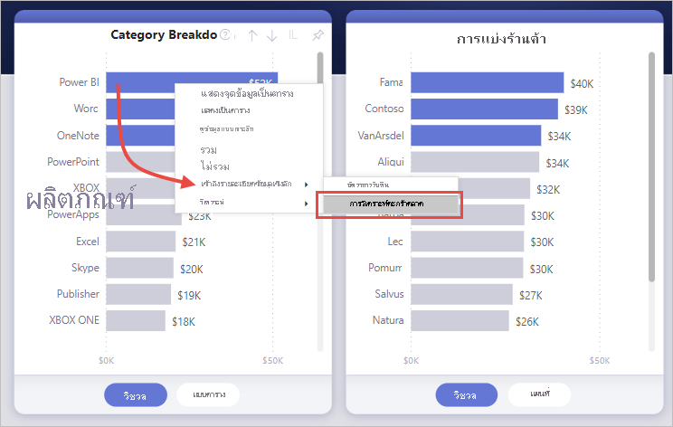
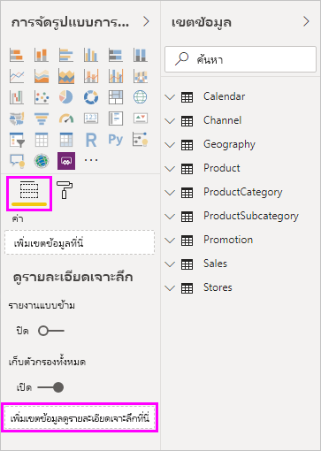
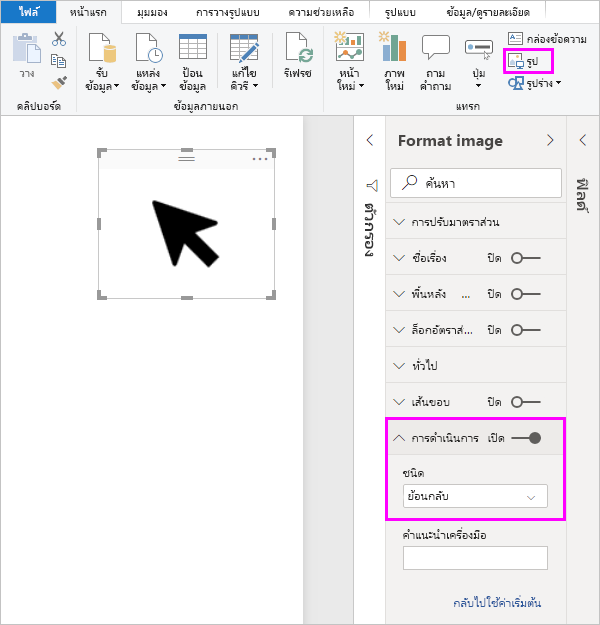
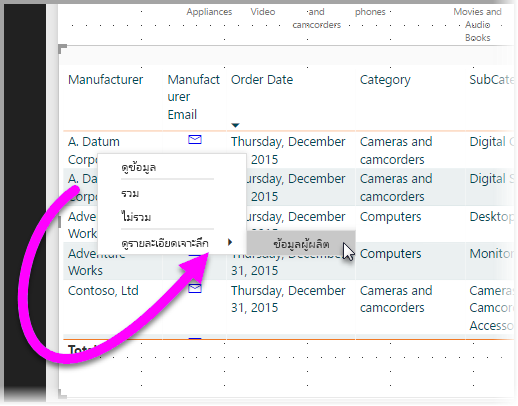
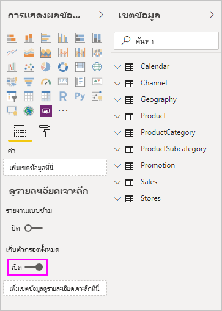
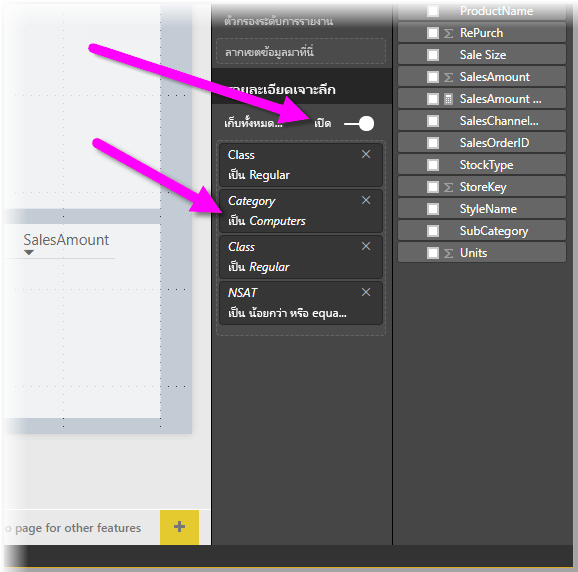
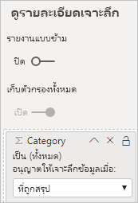

# ตั้งค่าการเข้าถึงรายละเอียดในรายงาน Power BISet up drill through in Power BI reports
ด้วย *การเข้าถึงรายละเอียด* ในรายงาน Power BI คุณสามารถสร้างหน้าในรายงานของคุณที่มุ่งเน้นไปยังรายการเฉพาะเช่น ผู้จัดหา ลูกค้า หรือผู้ผลิตWith *drill through* in Power BI reports, you can create a page in your report that focuses on a specific entity such as a supplier, customer, or manufacturer. เมือผู้อ่านรายงานของคุณใช้การเข้าถึงรายละเอียด พวกเขาจะคลิกขวาที่จุดข้อมูลในหน้ารายงานอื่น ๆ แล้วเข้าถึงรายละเอียดในหน้าที่เน้น เพื่อดูรายละเอียดที่กรองตามบริบทดังกล่าวWhen your report readers use drill through, they right-click a data point in other report pages, and drill through to the focused page to get details that are filtered to that context. นอกจากนี้ คุณยังสามารถ[สร้างปุ่มสำหรับการเข้าถึงรายละเอียด](desktop-drill-through-buttons.md) เมื่อพวกเขาคลิกปุ่มYou can also [create a button that drills through](desktop-drill-through-buttons.md) to details when they click it.

คุณสามารถตั้งค่าการเข้าถึงรายละเอียดในรายงานของคุณใน Power BI Desktop หรือบริการ Power BIYou can set up drill through in your reports in Power BI Desktop or the Power BI service.

## ตั้งค่าการเข้าถึงรายละเอียดบนหน้าปลายทางSet up the drill-through destination page
1. หากต้องการตั้งค่าการเข้าถึงรายละเอียด ให้สร้างหน้ารายงานที่มีวิชวลที่คุณต้องการสำหรับชนิดของเอนทิตีที่คุณกำลังจะมีการเข้าถึงรายละเอียดTo set up drill through, create a report page that has the visuals you want for the type of entity that you're going to provide drill through for. 

    ตัวอย่างเช่น สมมติว่าคุณต้องการให้มีการเข้าถึงรายละเอียดสำหรับผู้ผลิตFor example, suppose you want to provide drill through for manufacturers. ในกรณีนี้ คุณอาจสร้างหน้าการเข้าถึงรายละเอียดด้วยวิชวลที่แสดงยอดขายรวม จำนวนหน่วยรวมที่จัดส่ง ยอดขายตามประเภท ยอดขายตามภูมิภาค และอื่น ๆFor this case, you might create a drill-through page with visuals that show total sales, total units shipped, sales by category, sales by region, and so on. ด้วยวิธีดังกล่าว เมื่อคุณเข้าถึงรายละเอียดในหน้านั้น วิชวลจะแสดงให้เห็นเฉพาะผู้ผลิตที่คุณเลือกThat way, when you drill through to that page, the visuals are specific to the manufacturer you selected.

2. จากนั้น ในหน้าการเข้าถึงรายละเอียดนั้น ในส่วน **เขตข้อมูล** ของบานหน้าต่าง **การจัดรูปแบบการแสดงข้อมูล** ให้ลากเขตข้อมูลที่คุณต้องการใช้งานการเข้าถึงรายละเอียดลงในช่อง **ตัวกรองการเข้าถึงรายละเอียด**Then, on that drill-through page, in the **Fields** section of the **Visualizations** pane, drag the field for which you want to enable drill through into the **Drill-through filters** well.

    

    เมื่อคุณเพิ่มเขตข้อมูลไปยัง **ตัวกรองการเข้าถึงรายละเอียด** ตามที่เหมาะสม Power BI ก็จะสร้างวิชวลปุ่ม *ย้อนกลับ* โดยอัตโนมัติWhen you add a field to the **Drill-through filters** well, Power BI automatically creates a *back* button visual. วิชวลนั้นจะกลายเป็นปุ่มในรายงานที่เผยแพร่That visual becomes a button in published reports. ผู้ใช้ที่ช้งานรายงานของคุณในบริการของ Power BI จะใช้ปุ่มนี้เพื่อกลับไปยังหน้ารายงานที่ออกมาได้Users who consume your report in the Power BI service use this button to get back to the report page from which they came.

    

> [!IMPORTANT]
> คุณสามารถกำหนดค่าและดำเนินการเข้าถึงรายละเอียดข้อมูลไปยังหน้าในรายงานเดียวกันได้ อย่างไรก็ตามคุณไม่สามารถเข้าถึงหน้าในรายงานอื่นได้You can configure and perform drillthrough to a page in the same report, however, you cannot drillthrough to a page in a different report.  

## ใช้รูปภาพของคุณเองสำหรับปุ่มย้อนกลับUse your own image for a back button    
 เนื่องจากปุ่มย้อนกลับเป็นรูปภาพ คุณสามารถแทนรูปภาพของวิชวลด้วยรูปภาพใดก็ได้ที่ต้องการBecause the back button is an image, you can replace the image of that visual with any image you want. รูปภาพดังกล่าวจะยังทำงานเป็นปุ่มย้อนกลับเพื่อให้ผู้ใช้รายงานสามารถกลับไปยังหน้าเดิมได้It still operates as a back button so that report consumers can go back to their original page. 

หากต้องการใช้รูปภาพของคุณเองสำหรับปุ่มย้อนกลับ ให้ทำตามขั้นตอนเหล่านี้:To use your own image for a back button, follow these steps:

1. บนแท็บ **หน้าแรก** เลือก **รูปภาพ**On the **Home** tab, select **Image**. จากนั้นจึงค้นหารูปภาพของคุณและวางบนหน้าการเข้าถึงรายละเอียดThen, locate your image and place it on the drill-through page.

2. เลือกรูปภาพใหม่ของคุณบนหน้าการเข้าถึงรายละเอียดSelect your new image on the drill-through page. ภายใต้บานหน้าต่าง **จัดรูปแบบภาพ** ตั้งค่า **ตัวเลื่อนการดำเนินการ** เป็น **เปิด** จากนั้นตั้งค่า **ชนิด** เป็น **ย้อนกลับ**Under the **Format image** pane, set the **Action** slider to **On**, and  then set the **Type** to **Back**. รูปของคุณตอนนี้ทำหน้าที่เป็นปุ่มย้อนกลับYour image now functions as a back button.

    

    
     ในตอนนี้ ผู้ใช้สามารถคลิกขวาบนจุดข้อมูลในรายงานของคุณ และรับเมนูบริบทที่รองรับการเข้าถึงรายละเอียดไปยังหน้านั้นNow users can right-click a data point in your report and get a context menu that supports drill through to that page. 

    

    เมื่อผู้ใช้รายงานเลือกที่จะเข้าถึงรายละเอียด หน้าจะถูกกรองให้แสดงข้อมูลเกี่ยวกับจุดข้อมูลที่ผู้ใช้คลิกขวาWhen report consumers choose to drill through, the page is filtered to show information about the data point on which they right-clicked. ตัวอย่างเช่น สมมติว่าผู้ใช้คลิกขวาบนจุดข้อมูลที่เกี่ยวกับ Contoso บริษัทผู้ผลิต และเลือกเพื่อดูรายละเอียดFor example, suppose they right-clicked on a data point about Contoso, a manufacturer, and selected to drill through. หน้าการเข้าถึงรายละเอียดที่ผู้ใช้จะไปจะถูกกรองเป็น ContosoThe drill-through page they go to is filtered to Contoso.

## ส่งผ่านตัวกรองทั้งหมดในการเข้าถึงรายละเอียดPass all filters in drill through

คุณสามารถส่งผ่านตัวกรองที่นำไปใช้ทั้งหมดไปยังหน้าต่างการเข้าถึงรายละเอียดได้You can pass all applied filters to the drill-through window. ตัวอย่างเช่น คุณสามารถเลือกเฉพาะผลิตภัณฑ์บางประเภท และวิชวลจะถูกกรองเป็นประเภทนั้น จากนั้นเลือกเข้าถึงรายละเอียดFor example, you can select only a certain category of products and the visuals filtered to that category, and then select drill through. คุณอาจอยากรู้ว่าหน้าการเข้าถึงรายละเอียดมีลักษณะอย่างไรเมื่อใช้ตัวกรองทั้งหมดเหล่านี้You might be interested in what that drill through would look like with all those filters applied.

หากต้องการใช้ตัวกรองที่นำไปใช้ทั้งหมดต่อไป ให้ไปที่ส่วน **การเข้าถึงรายละเอียด** ของบานหน้าต่าง **การแสดงภาพ** และตั้งค่า **เก็บตัวกรองทั้งหมด** เป็น **เปิด**To keep all applied filters, in the **Drill-through** section of the **Visualizations** pane, set **Keep all filters** to **On**. 

เมื่อคุณเข้าถึงรายละเอียดบนวิชวล คุณสามารถดูว่าตัวกรองใดถูกนำไปใช้ ซึ่งเป็นผลจากการที่วิชวลต้นทางมีการใช้ตัวกรองชั่วคราวWhen you then drill through on a visual, you can see which filters were applied as a result of the source visual having temporary filters applied. ในส่วน **การเข้าถึงรายละเอียด** ของบานหน้าต่าง **การแสดงภาพ** ตัวกรองชั่วคราวเหล่านั้นจะแสดงในรูปแบบตัวเอียงIn the **Drill-through** section of the **Visualization** pane, those transient filters are shown in italics. 

แม้ว่าคุณจะสามารถดำเนินการนี้ได้กับหน้าคำแนะนำเครื่องมือ แต่จะเป็นประสบการณ์ที่แปลกเนื่องจากคำแนะนำเครื่องมือจะดูเหมือนทำงานไม่ถูกต้องAlthough you could do this with tooltips pages, that would be an odd experience because the tooltip wouldn't appear to be working properly. ด้วยเหตุนี้จึงไม่แนะนำให้ดำเนินการดังกล่าวกับคำแนะนำเครื่องมือFor this reason, so doing so with tooltips isn't recommended.

## เพิ่มหน่วยวัดไปยังการเข้าถึงรายละเอียดAdd a measure to drill through

นอกเหนือจากการส่งผ่านตัวกรองทั้งหมดไปยังหน้าต่างการเข้าถึงรายละเอียด คุณยังสามารถเพิ่มหน่วยวัดหรือคอลัมน์ตัวเลขสรุปไปยังพื้นที่การเข้าถึงรายละเอียดได้Besides passing all filters to the drill-through window, you can also add a measure or a summarized numeric column to the drill-through area. ลากเขตข้อมูลการเข้าถึงรายละเอียดไปยังการ์ด **การเข้าถึงรายละเอียด** เพื่อนำไปใช้Drag the drill-through field to the **Drill-through** card to apply it. 

เมื่อคุณเพิ่มหน่วยวัดหรือคอลัมน์ตัวเลขสรุป คุณสามารถเข้าถึงรายละเอียดไปยังหน้าเมื่อเขตข้อมูลถูกใช้ในพื้นที่ *ค่า* ของวิชวลได้When you add a measure or summarized numeric column, you can drill through to the page when the field is used in the *Value* area of a visual.

ทั้งหมดนั้นคือวิธีการใช้งานการเข้าถึงรายละเอียดในรายงานของคุณThat's all there is to using drill through in your reports. ซึ่งเป็นวิธีการที่ยอดเยี่ยมในการดูข้อมูลเอนทิตี้ในมุมมองขยาย ตามข้อมูลคุณเลือกไว้สำหรับตัวกรองการเข้าถึงรายละเอียดIt's a great way to get an expanded view of the entity information that you selected for your drill-through filter.

## ขั้นตอนถัดไปNext steps

คุณอาจมีความสนใจบทความต่อไปนี้:You might also be interested in the following articles:

* [ใช้การเข้าถึงรายละเอียดแบบข้ามรายงานในรายงาน Power BIUse cross-report drill through in Power BI reports](desktop-cross-report-drill-through.md)
* [การใช้ตัวแบ่งส่วนข้อมูล Power BI DesktopUsing slicers Power BI Desktop](../visuals/power-bi-visualization-slicers.md)
