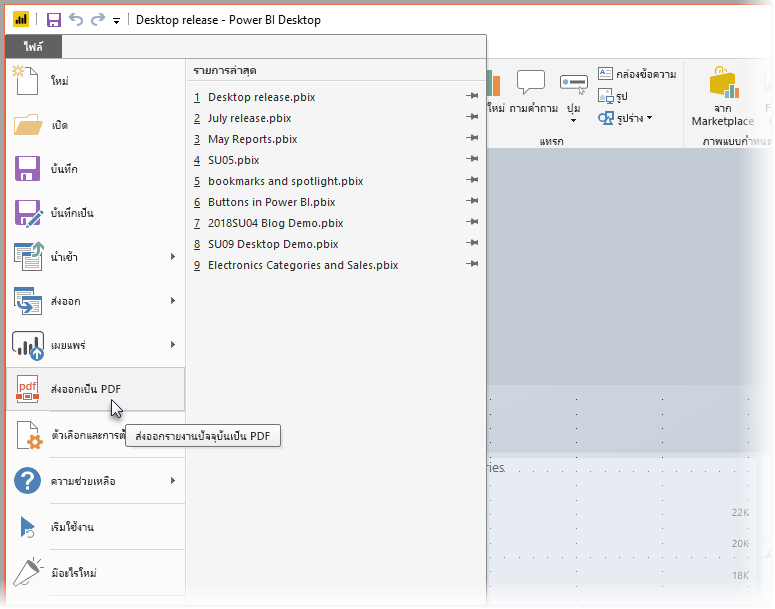
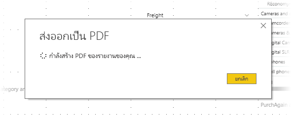

# ส่งออกรายงานเป็น PDF จาก Power BI DesktopExport reports to PDF from Power BI Desktop
ใน **Power BI Desktop** หรือ บริการ Power BI คุณสามารถส่งออกรายงานไปยังไฟล์ PDF และดังนั้นจึงได้อย่างง่ายดายแชร์ หรือพิมพ์รายงานของคุณจาก PDF นั้นได้In **Power BI Desktop** or the Power BI service, you can export reports to a PDF file, and thereby easily share or print your reports from that PDF.

กระบวนการส่งออกรายงานของคุณจาก **Power BI Desktop** เป็น PDF เป็นเรื่องไม่ยุ่งยาก เพื่อให้คุณสามารถพิมพ์เป็น PDF หรือแชร์เอกสาร PDF นั้นกับผู้อื่นThe process of exporting your report from **Power BI Desktop** to a PDF, so that you can print the PDF or share that PDF document with others, is straightforward. เพียงแค่เลือก **ไฟล์ > ส่งออกเป็น PDF** จาก Power BI DeskopSimply select **File > Export to PDF** from Power BI Desktop.

กระบวนการ **ส่งออกเป็น PDF** จะส่งออกหน้าในรายงาน *ที่เห็น* ทั้งหมด พร้อมกับแต่ละหน้ารายงานที่ส่งออกเป็นหน้าเดียวใน PDFThe **Export to PDF** process will export all *visible* pages in the report, with each report page exporting to a single page in the PDF. หน้ารายงานที่ไม่สามารถมองเห็นได้ในขณะนี้ เช่น หน้าคำแนะนำเครื่องมือหรือหน้าที่ซ่อน จะไม่ถูกส่งออกเป็นไฟล์ PDFReport pages that are currently not visible, such as any tooltips or hidden pages, are not exported to the PDF file. 

เมื่อคุณเลือก **ไฟล์ > ส่งออกเป็น PDF** การส่งออกจะเริ่มขึ้น และกล่องโต้ตอบจะปรากฏขึ้นเพื่อแสดงกระบวนการส่งออกอยู่ในระหว่างดำเนินการWhen you select **File > Export to PDF** the export is initiated, and a dialog appears that shows the export process is underway. กล่องโต้ตอบยังคงอยู่บนหน้าจอจนกว่ากระบวนการส่งออกเสร็จสมบูรณ์The dialog remains on the screen until the export process completes. ในระหว่างกระบวนการส่งออก การโต้ตอบกับรายงานที่จะถูกส่งออกทั้งหมดถูกปิดใช้งานDuring the export process, all interaction with the report being exported is disabled. วิธีเดียวที่จะโต้ตอบกับรายงานได้ คือ ต้องรอจนกว่ากระบวนการส่งออกเสร็จสมบูรณ์ หรือยกเลิกการส่งออกThe only way to interact with the report is to wait until the export process completes, or to cancel the export. 

เมื่อการส่งออกเสร็จสมบูรณ์ PDF จะถูกโหลดลงในตัวแสดง PDF เริ่มต้นบนคอมพิวเตอร์When the export completes, the PDF is loaded into the default PDF viewer on the computer. 

## ข้อควรพิจารณาและข้อจำกัดConsiderations and limitations
มีข้อควรพิจารณาสองสามอย่างที่ควรคำนึงถึงกับคุณลักษณะ **การส่งออกเป็น PDF**:There are a few considerations to keep in mind with the **Export to PDF** feature:

* คุณลักษณะจะส่งออกวิชวล Power BI แต่ *ไม่* ส่งออกรูปพื้นหลังใด ๆ ที่คุณอาจใช้กับรายงานThe feature does export Power BI visuals, but it does *not* export any wallpaper you may have applied to the report.

เนื่องจากรูปพื้นหลังจะถูกส่งออกเป็น PDF คุณควรใส่ใจรายงานที่ใช้รูปพื้นหลังสีเข้มเป็นพิเศษSince wallpaper is not exported to the PDF, you should pay special attention to reports that use dark wallpaper. ถ้าข้อความในรายงานของคุณเป็นสีขาวหรือสีอ่อนเพื่อให้โดดเด่นกับรูปพื้นหลังสีเข้มของคุณ จะสามารถอ่านได้ยากหรือไม่สามารถอ่านได้ในกระบวนการส่งออกเป็น PDF เนื่องจากรูปพื้นหลังจะไม่ถูกส่งออกไปกับรายงานที่เหลือIf the text in your report is light or white, to have it stand out against your dark wallpaper, it will be difficult to read or unreadable in the export to PDF process since the wallpaper will not be exported with the rest of the report. 

## ขั้นตอนถัดไปNext steps
มีหลายองค์ประกอบภาพและคุณลักษณะใน **Power BI Desktop** ที่น่าสนใจThere are all sorts of interesting visual elements and features in **Power BI Desktop**. สำหรับข้อมูลเพิ่มเติมเกี่ยวกับข้อมูล โปรดดูทรัพยากรต่อไปนี้:For more information in information, check out the following resources:

* [ใช้องค์ประกอบภาพเพื่อปรับปรุงรายงาน Power BIUse visual elements to enhance Power BI reports](desktop-visual-elements-for-reports.md)
* [Power BI Desktop คืออะไรWhat is Power BI Desktop?](../fundamentals/desktop-what-is-desktop.md)
