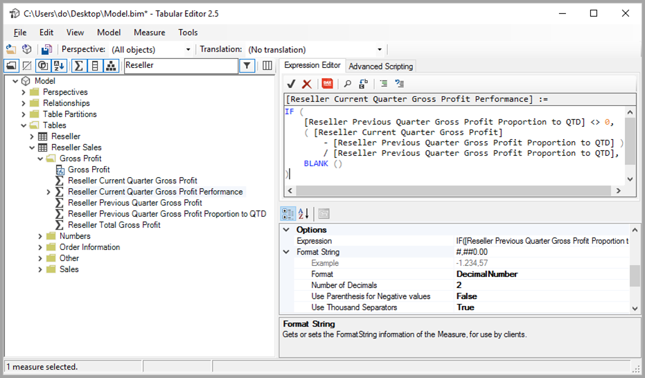
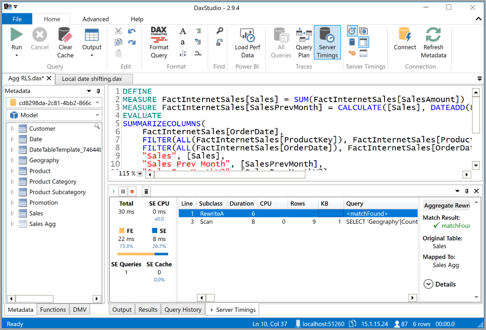

# <a name="using-external-tools-in-power-bi-desktop-preview"></a><span data-ttu-id="9b8f7-103">การใช้เครื่องมือภายนอกใน Power BI Desktop (ตัวอย่าง)</span><span class="sxs-lookup"><span data-stu-id="9b8f7-103">Using external tools in Power BI Desktop (preview)</span></span>

<span data-ttu-id="9b8f7-104">เริ่มต้นด้วยการเผยแพร่เดือนกรกฎาคม 2020 ของ Power BI Desktop คุณสามารถใช้เครื่องมือภายนอกเพื่อให้สามารถทำงานเพิ่มเติมและให้ค่าแก่ Power BI Desktop ได้</span><span class="sxs-lookup"><span data-stu-id="9b8f7-104">Beginning with the July 2020 release of Power BI Desktop, you can use external tools to provide additional functionality and value to Power BI Desktop.</span></span> <span data-ttu-id="9b8f7-105">การสนับสนุนสำหรับเครื่องมือภายนอกช่วยให้คุณสามารถใช้ประโยชน์จากความหลากหลายของเครื่องมือชุมชนสำหรับ Analysis Services สำหรับผู้เชียวชาญด้าน BI การเพิ่มประสิทธิภาพการทำงานของคิวรี/นิพจน์ DAXและการเขียน และการจัดการวงจรของแอปพลิเคชัน (ALM)</span><span class="sxs-lookup"><span data-stu-id="9b8f7-105">Support for external tools enables you to  leverage the multitude of community tools for Analysis Services for BI professionals, such DAX query/expression optimization and authoring, and application lifecycle management (ALM).</span></span>

<span data-ttu-id="9b8f7-106">ริบบอน **เครื่องมือภายนอก** ใน Power BI Desktop ประกอบด้วยปุ่มสำหรับเครื่องมือภายนอกที่ติดตั้งอยู่บนเครื่องและลงทะเบียนด้วย Power BI Desktop</span><span class="sxs-lookup"><span data-stu-id="9b8f7-106">The **External Tools** ribbon in Power BI Desktop contains buttons for external tools installed on the machine, and registered with Power BI Desktop.</span></span> <span data-ttu-id="9b8f7-107">เครื่องมือภายนอกที่เปิดใช้งานจาก Power BI Desktop จะเชื่อมต่อกับกลไกจัดการ Analysis Services โดยอัตโนมัติซึ่งทำงานเป็นส่วนหนึ่งของ Power BI Desktop ให้ประสบการณ์ที่ราบรื่นสำหรับผู้ใช้</span><span class="sxs-lookup"><span data-stu-id="9b8f7-107">External tools launched from Power BI Desktop are automatically connected to the Analysis Services engine that operates as part of Power BI Desktop, providing a seamless experience for users.</span></span>


<span data-ttu-id="9b8f7-109">เครื่องมือภายนอกที่แนะนำรวมถึงรายการต่อไปนี้ พร้อมด้วยลิงก์ไปยังตำแหน่งการติดตั้งเครื่องมือดังกล่าว</span><span class="sxs-lookup"><span data-stu-id="9b8f7-109">These featured external tools include the following, with links to their installation location.</span></span> <span data-ttu-id="9b8f7-110">เครื่องมือภายนอกแต่ละรายการได้รับการสนับสนุนโดยผู้สร้างเครื่องมือที่เกี่ยวข้อง:</span><span class="sxs-lookup"><span data-stu-id="9b8f7-110">Each external tool is supported by their respective tool authors:</span></span>

* [<span data-ttu-id="9b8f7-111">ตัวแก้ไขตาราง</span><span class="sxs-lookup"><span data-stu-id="9b8f7-111">Tabular Editor</span></span>](https://tabulareditor.com/)
* [<span data-ttu-id="9b8f7-112">DAX Studio</span><span class="sxs-lookup"><span data-stu-id="9b8f7-112">DAX Studio</span></span>](https://daxstudio.org)
* [<span data-ttu-id="9b8f7-113">ALM Toolkit</span><span class="sxs-lookup"><span data-stu-id="9b8f7-113">ALM Toolkit</span></span>](http://alm-toolkit.com)


<span data-ttu-id="9b8f7-114">ส่วนต่อไปนี้อธิบายการดำเนินการที่ได้รับการสนับสนุนโดยเครื่องมือภายนอก รายการเครื่องมือที่แนะนำที่รวมอยู่ใน Power BI Desktop และคำแนะนำเกี่ยวกับวิธีการลงทะเบียนเครื่องมือเพิ่มเติม</span><span class="sxs-lookup"><span data-stu-id="9b8f7-114">The following sections describe the operations supported by external tools, a list of featured tools included in Power BI Desktop, and instructions on how to register additional tools.</span></span>

> [!NOTE]
> <span data-ttu-id="9b8f7-115">เครื่องมือภายนอกไม่พร้อมสําหรับการใช้งานกับ Power BI Report Server เวอร์ชันของ Power BI Desktop</span><span class="sxs-lookup"><span data-stu-id="9b8f7-115">External tools are not available for use with the Power BI Report Server version of Power BI Desktop.</span></span>

## <a name="supported-write-operations"></a><span data-ttu-id="9b8f7-116">การดำเนินการเขียนที่รองรับ</span><span class="sxs-lookup"><span data-stu-id="9b8f7-116">Supported write operations</span></span>

<span data-ttu-id="9b8f7-117">เครื่องมือภายนอกสามารถเชื่อมต่อกับชุดข้อมูล Power BI Desktop (แบบจำลอง Analysis Services) เพื่อแก้ไขวัตถุต่อไปนี้</span><span class="sxs-lookup"><span data-stu-id="9b8f7-117">External tools can connect to the Power BI Desktop dataset (Analysis Services model) to edit the following objects.</span></span> <span data-ttu-id="9b8f7-118">การแก้ไขไฟล์แม่แบบ Power BI Desktop (PBIT) ไม่ได้รับการสนับสนุน</span><span class="sxs-lookup"><span data-stu-id="9b8f7-118">Editing a Power BI Desktop template (PBIT) file is not supported.</span></span>

* <span data-ttu-id="9b8f7-119">[หน่วยวัด](/analysis-services/tabular-models/measures-ssas-tabular)สำหรับการคำนวณ</span><span class="sxs-lookup"><span data-stu-id="9b8f7-119">[Measures](/analysis-services/tabular-models/measures-ssas-tabular) for calculations</span></span>
* <span data-ttu-id="9b8f7-120">[กลุ่มการคำนวณ](/analysis-services/tabular-models/calculation-groups)สำหรับการคำนวณความสามารถในการนำกลับมาใช้ใหม่ในแบบจำลองที่ซับซ้อน</span><span class="sxs-lookup"><span data-stu-id="9b8f7-120">[Calculation groups](/analysis-services/tabular-models/calculation-groups) for calculation reusability in complex models</span></span>
* <span data-ttu-id="9b8f7-121">[มุมมอง](/analysis-services/tabular-models/perspectives-ssas-tabular)เพื่อกำหนดมุมมองเฉพาะของโดเมนธุรกิจของชุดข้อมูลเมตาดาต้า</span><span class="sxs-lookup"><span data-stu-id="9b8f7-121">[Perspectives](/analysis-services/tabular-models/perspectives-ssas-tabular) to define focused, business-domain specific views of dataset metadata</span></span>

<span data-ttu-id="9b8f7-122">การจัดการการแปลเมตาดาต้าโดยใช้เครื่องมือภายนอกอาจเป็นไปได้แต่ไม่ได้รับการสนับสนุนในเวอร์ชันตัวอย่างนี้</span><span class="sxs-lookup"><span data-stu-id="9b8f7-122">Managing metadata translations using external tools may be possible, but is not currently supported in this preview version.</span></span> <span data-ttu-id="9b8f7-123">ถ้าตำแหน่งที่ตั้งของผู้ใช้ปัจจุบันเป็นภาษาที่ได้รับการแปล การแก้ไขวัตถุในรายการเขตข้อมูลจะทำงานอย่างไม่ถูกต้องโดยใช้ Power BI Desktop เวอร์ชันปัจจุบัน</span><span class="sxs-lookup"><span data-stu-id="9b8f7-123">If the current user’s locale is a translated locale, editing objects in the field list does not work correctly using the current version of Power BI Desktop.</span></span> 

<span data-ttu-id="9b8f7-124">คุณสามารถเข้าถึงเมตาดาต้าของชุดข้อมูลแบบ[จำลองวัตถุแบบตาราง](/analysis-services/tom/introduction-to-the-tabular-object-model-tom-in-analysis-services-amo)ทั้งหมดสำหรับวัตถุประสงค์แบบอ่านอย่างเดียว แต่ไม่มีวัตถุที่ครอบคลุมอยู่ในรายการที่อธิบายไว้ในบทความ [จำลองวัตถุแบบตาราง](/analysis-services/tom/introduction-to-the-tabular-object-model-tom-in-analysis-services-amo)ซึ่งยังไม่ได้รับการรองรับสำหรับการแก้ไขในอินสแตนซ์ Power BI Desktop Analysis Services</span><span class="sxs-lookup"><span data-stu-id="9b8f7-124">All [Tabular Object Model](/analysis-services/tom/introduction-to-the-tabular-object-model-tom-in-analysis-services-amo) dataset metadata can be accessed for read-only purposes, but objects not covered in the list described in the [Tabular Object Model](/analysis-services/tom/introduction-to-the-tabular-object-model-tom-in-analysis-services-amo) article are not yet supported for editing in the Power BI Desktop Analysis Services instance.</span></span>


## <a name="featured-external-tools"></a><span data-ttu-id="9b8f7-125">เครื่องมือภายนอกที่แนะนำ</span><span class="sxs-lookup"><span data-stu-id="9b8f7-125">Featured external tools</span></span>

<span data-ttu-id="9b8f7-126">เครื่องมือชุมชนแหล่งข้อมูแบบเปิดลต่อไปนี้ทำงานร่วมกับ Power BI Desktop</span><span class="sxs-lookup"><span data-stu-id="9b8f7-126">The following open-source community tools work with Power BI Desktop.</span></span> <span data-ttu-id="9b8f7-127">เครื่องมือดังกล่าวได้รับการสนับสนุนโดยผู้สร้างเครื่องมือที่เกี่ยวข้อง</span><span class="sxs-lookup"><span data-stu-id="9b8f7-127">They are supported by the respective tool authors.</span></span> <span data-ttu-id="9b8f7-128">ตัวติดตั้งที่เกี่ยวข้องของเครื่องมือแต่ละรายการจะลงทะเบียนด้วย Power BI Desktop เมื่อติดตั้ง:</span><span class="sxs-lookup"><span data-stu-id="9b8f7-128">Each tool's respective installer registers it with Power BI Desktop upon installation:</span></span>

* <span data-ttu-id="9b8f7-129">ตัวแก้ไขตาราง</span><span class="sxs-lookup"><span data-stu-id="9b8f7-129">Tabular Editor</span></span>
* <span data-ttu-id="9b8f7-130">DAX Studio</span><span class="sxs-lookup"><span data-stu-id="9b8f7-130">DAX Studio</span></span>
* <span data-ttu-id="9b8f7-131">ALM Toolkit</span><span class="sxs-lookup"><span data-stu-id="9b8f7-131">ALM Toolkit</span></span>

<span data-ttu-id="9b8f7-132">มาดูที่เครื่องมือแต่ละอย่างเหล่านั้นตามลำดับกัน</span><span class="sxs-lookup"><span data-stu-id="9b8f7-132">Let's take a look at each of these tools, in turn.</span></span>

### <a name="tabular-editor"></a><span data-ttu-id="9b8f7-133">ตัวแก้ไขตาราง</span><span class="sxs-lookup"><span data-stu-id="9b8f7-133">Tabular Editor</span></span>

<span data-ttu-id="9b8f7-134">คุณสามารถติดตั้ง[ตัวแก้ไขตาราง](https://tabulareditor.com/)จากลิงก์ต่อไปนี้: [เว็บไซต์ตัวแก้ไขตาราง](https://tabulareditor.com/)</span><span class="sxs-lookup"><span data-stu-id="9b8f7-134">You can install [Tabular Editor](https://tabulareditor.com/) from the following link: [Tabular Editor website](https://tabulareditor.com/)</span></span>

<span data-ttu-id="9b8f7-135">ตัวแก้ไขตารางช่วยให้ผู้เชี่ยวชาญ BI สามารถสร้างรักษาและจัดการแบบจำลองตารางโดยใช้ตัวแก้ไขที่ง่ายและใช้พื้นที่ไม่มาก</span><span class="sxs-lookup"><span data-stu-id="9b8f7-135">Tabular Editor enables BI professionals to easily build, maintain, and manage tabular models using an intuitive and lightweight editor.</span></span> <span data-ttu-id="9b8f7-136">มุมมองแบบลำดับชั้นแสดงวัตถุทั้งหมดในโมเดลตารางของคุณ ซึ่งจัดระเบียบโดยการแสดงโฟลเดอร์พร้อมรองรับการแก้ไขคุณสมบัติแบบเลือกได้หลายรายการและการเน้นไวยากรณ์ DAX</span><span class="sxs-lookup"><span data-stu-id="9b8f7-136">A hierarchical view shows all objects in your tabular model, organized by display folders, with support for multi-select property editing and DAX syntax highlighting.</span></span>



<span data-ttu-id="9b8f7-138">รหัสแหล่งที่มาสำหรับตัวแก้ไขแบบตารางสามารถพบได้ในที่เก็บ GitHub ต่อไปนี้: [ตัวแก้ไขตารางใน GitHub](https://github.com/otykier/TabularEditor)</span><span class="sxs-lookup"><span data-stu-id="9b8f7-138">The source code for Tabular Editor can be found in the following GitHub repo: [Tabular Editor on GitHub](https://github.com/otykier/TabularEditor)</span></span>

<span data-ttu-id="9b8f7-139">ผู้สร้างเครื่องมือหลักสำหรับตัวแก้ไขตารางคือ [Daniel Otykier](https://www.linkedin.com/in/daniel-otykier-2231876)</span><span class="sxs-lookup"><span data-stu-id="9b8f7-139">The primary tool author for Tabular Editor is [Daniel Otykier](https://www.linkedin.com/in/daniel-otykier-2231876).</span></span>


### <a name="dax-studio"></a><span data-ttu-id="9b8f7-140">DAX Studio</span><span class="sxs-lookup"><span data-stu-id="9b8f7-140">DAX Studio</span></span>

<span data-ttu-id="9b8f7-141">คุณสามารถติดตั้ง [DAX Studio](https://daxstudio.org) จากการลิงก์ต่อไปนี้: [เว็บไซต์ DAX Studio](https://daxstudio.org)</span><span class="sxs-lookup"><span data-stu-id="9b8f7-141">You can install [DAX Studio](https://daxstudio.org) from the following link: [DAX Studio website](https://daxstudio.org)</span></span>

<span data-ttu-id="9b8f7-142">DAX Studio เป็นที่รู้จักสำหรับเครื่องมือที่สมบูรณ์สำหรับการสร้าง การวินิจฉัย การปรับแต่งประสิทธิภาพ และการวิเคราะห์ DAX</span><span class="sxs-lookup"><span data-stu-id="9b8f7-142">DAX Studio is known for being a complete tool for DAX authoring, diagnosis, performance tuning and analysis.</span></span> <span data-ttu-id="9b8f7-143">คุณลักษณะต่างๆ ประกอบด้วยการค้นหาวัตถุ การติดตามแบบรวม การแยกย่อยการประมวลผลคิวรีด้วยสถิติโดยละเอียด การเน้นไวยากรณ์และการจัดรูปแบบของ DAX</span><span class="sxs-lookup"><span data-stu-id="9b8f7-143">Its features include object browsing, integrated tracing, query execution breakdowns with detailed statistics, DAX syntax highlighting and formatting.</span></span> <span data-ttu-id="9b8f7-144">รูปภาพต่อไปนี้แสดงหน้าจอ Dax Studio</span><span class="sxs-lookup"><span data-stu-id="9b8f7-144">The following image shows a Dax Studio screen.</span></span> 



<span data-ttu-id="9b8f7-146">รหัสแหล่งที่มาสำหรับ DAX Studio สามารถพบได้ในที่เก็บ GitHub ต่อไปนี้: [DAX Studio ใน GitHub](https://github.com/DaxStudio/DaxStudio)</span><span class="sxs-lookup"><span data-stu-id="9b8f7-146">The source code for DAX Studio can be found in the following GitHub repo: [DAX Studio on GitHub](https://github.com/DaxStudio/DaxStudio)</span></span>

<span data-ttu-id="9b8f7-147">ผู้สร้างเครื่องมือหลักสำหรับ DAX Studio คือ [Darren Gosbell](https://www.linkedin.com/in/darrengosbell)</span><span class="sxs-lookup"><span data-stu-id="9b8f7-147">The primary tool author for DAX Studio is [Darren Gosbell](https://www.linkedin.com/in/darrengosbell).</span></span>

### <a name="alm-toolkit"></a><span data-ttu-id="9b8f7-148">ALM Toolkit</span><span class="sxs-lookup"><span data-stu-id="9b8f7-148">ALM Toolkit</span></span>

<span data-ttu-id="9b8f7-149">คุณสามารถติดตั้ง [ALM Toolkit](http://alm-toolkit.com) จากลิงก์ต่อไปนี้: [เว็บไซต์ ALM Toolkit](http://alm-toolkit.com)</span><span class="sxs-lookup"><span data-stu-id="9b8f7-149">You can install [ALM Toolkit](http://alm-toolkit.com) from the following link: [ALM Toolkit website](http://alm-toolkit.com)</span></span>

<span data-ttu-id="9b8f7-150">ALM Toolkit เป็นเครื่องมือการเปรียบเทียบ Schema สำหรับชุดข้อมูล Power BI ซึ่งใช้บ่อยที่สุดสำหรับสถานการณ์การจัดการวงจรชีวิตของแอปพลิเคชัน (ALM)</span><span class="sxs-lookup"><span data-stu-id="9b8f7-150">ALM Toolkit is a schema compare tool for Power BI datasets, used for application lifecycle management (ALM) scenarios.</span></span> <span data-ttu-id="9b8f7-151">คุณสามารถทำการปรับใช้ในสภาพแวดล้อมและรักษาข้อมูลในอดีตที่มีการรีเฟรชแบบเพิ่มหน่วยได้โดยตรง</span><span class="sxs-lookup"><span data-stu-id="9b8f7-151">With it, you can perform straightforward deployment across environments and retain incremental refresh historical data.</span></span> <span data-ttu-id="9b8f7-152">คุณสามารถเปรียบเทียบและผสานไฟล์เมตาดาต้า สาขา และที่เก็บได้ด้วย ALM Toolkit</span><span class="sxs-lookup"><span data-stu-id="9b8f7-152">With ALM Toolkit, you can diff and merge metadata files, branches, and repos.</span></span> <span data-ttu-id="9b8f7-153">คุณยังสามารถนำข้อกำหนดทั่วไปมาใช้ใหม่ระหว่างชุดข้อมูลได้อีกด้วย</span><span class="sxs-lookup"><span data-stu-id="9b8f7-153">You can also reuse common definitions between datasets.</span></span>


<span data-ttu-id="9b8f7-155">รหัสแหล่งที่มาสำหรับ  ALM Toolkit สามารถพบได้ในที่เก็บ GitHub ต่อไปนี้: [ALM Toolkit ใน GitHub](https://github.com/microsoft/analysis-services)</span><span class="sxs-lookup"><span data-stu-id="9b8f7-155">The source code for ALM Toolkit can be found in the following GitHub repo: [ALM Toolkit on GitHub](https://github.com/microsoft/analysis-services)</span></span>

<span data-ttu-id="9b8f7-156">ผู้สร้างเครื่องมือหลักสำหรับ ALM Toolkit คือ [Christian Wade](https://www.linkedin.com/in/christianwade1)</span><span class="sxs-lookup"><span data-stu-id="9b8f7-156">The primary tool author for ALM Toolkit is [Christian Wade](https://www.linkedin.com/in/christianwade1).</span></span>


## <a name="how-to-register-external-tools"></a><span data-ttu-id="9b8f7-157">วิธีการลงทะเบียนเครื่องมือภายนอก</span><span class="sxs-lookup"><span data-stu-id="9b8f7-157">How to register external tools</span></span>

<span data-ttu-id="9b8f7-158">ถ้าต้องการลงทะเบียนเครื่องมือภายนอกอื่นๆ ด้วย Power BI Desktop ให้สร้างไฟล์ JSON ที่มีเนื้อหาดังต่อไปนี้:</span><span class="sxs-lookup"><span data-stu-id="9b8f7-158">To register other external tools with Power BI Desktop, create a JSON file with the following content:</span></span>

```json
{
    "name": "<tool name>",
    "description": "<tool description>",
    "path": "<tool executable path>",
    "arguments": "<optional command line arguments>",
    "iconData": "image/png;base64,<encoded png icon data>"
}
```

<span data-ttu-id="9b8f7-159">รายการต่อไปนี้อธิบายรายการขององค์ประกอบในไฟล์ JSON:</span><span class="sxs-lookup"><span data-stu-id="9b8f7-159">The following list describes the list of elements in the JSON file:</span></span>
 
* <span data-ttu-id="9b8f7-160">**ชื่อ:** ระบุชื่อสำหรับเครื่องมือซึ่งจะปรากฏเป็นคำบรรยายปุ่มในริบบอนเครื่องมือภายนอกใน Power BI Desktop</span><span class="sxs-lookup"><span data-stu-id="9b8f7-160">**name:** Provide a name for the tool, which will appear as a button caption in the External Tools ribbon within Power BI Desktop.</span></span>
* <span data-ttu-id="9b8f7-161">**คำอธิบาย:** (ไม่บังคับ) ใส่คำอธิบายซึ่งจะปรากฏเป็นคำแนะนำเครื่องมือบนปุ่มริบบอนอุปกรณ์ภายนอกใน Power BI Desktop</span><span class="sxs-lookup"><span data-stu-id="9b8f7-161">**description:** (optional) Provide a description, which will appear as a tooltip on the External Tools ribbon button within Power BI Desktop.</span></span>
* <span data-ttu-id="9b8f7-162">**เส้นทาง:** ใส่เส้นทางที่ถูกต้องแบบเต็มในไฟล์ปฏิบัติการของเครื่องมือ</span><span class="sxs-lookup"><span data-stu-id="9b8f7-162">**path:** Provide the fully qualified path to the tool executable.</span></span>
* <span data-ttu-id="9b8f7-163">**อาร์กิวเมนต์:** (ไม่บังคับ) ใส่สตริงของอาร์กิวเมนต์บรรทัดคำสั่งที่ควรจะเปิดใช้งานเครื่องมือ</span><span class="sxs-lookup"><span data-stu-id="9b8f7-163">**arguments:** (optional) Provide a string of command-line arguments that the tool executable should be launched with.</span></span> <span data-ttu-id="9b8f7-164">คุณอาจใช้ตัวยึดต่อไปนี้ได้:</span><span class="sxs-lookup"><span data-stu-id="9b8f7-164">You may use any of the following placeholders:</span></span>
    * <span data-ttu-id="9b8f7-165">**% server%:** แทนที่ด้วยชื่อเซิร์ฟเวอร์และหมายเลขพอร์ตของอินสแตนซ์ภายในเครื่องของ Analysis Services Tabular สำหรับแบบจำลองข้อมูลที่นำเข้า/DirectQuery</span><span class="sxs-lookup"><span data-stu-id="9b8f7-165">**%server%:** Replaced with the server name and portnumber of the local instance of Analysis Services Tabular for imported/DirectQuery data models.</span></span>
    * <span data-ttu-id="9b8f7-166">**%database%:** แทนที่ด้วยชื่อฐานข้อมูลของแบบจำลองที่โฮสต์ในอินสแตนซ์ภายในเครื่องของ Analysis Services Tabular สำหรับแบบจำลองข้อมูลที่นำเข้า/DirectQuery</span><span class="sxs-lookup"><span data-stu-id="9b8f7-166">**%database%:** Replaced with the database name of the model hosted in the local instance of Analysis Services Tabular for imported/DirectQuery data models.</span></span>
* <span data-ttu-id="9b8f7-167">**iconData:** ใส่ข้อมูลรูปภาพซึ่งจะแสดงเป็นไอคอนปุ่มในริบบอนเครื่องมือภายนอกใน Power BI Desktop</span><span class="sxs-lookup"><span data-stu-id="9b8f7-167">**iconData:** Provide image data, which will be rendered as a button icon in the External Tools ribbon within Power BI Desktop.</span></span> <span data-ttu-id="9b8f7-168">สตริงควรได้รับการจัดรูปแบบตามไวยากรณ์สำหรับ  URI ข้อมูลโดยไม่มีคำนำหน้า "data:"</span><span class="sxs-lookup"><span data-stu-id="9b8f7-168">The string should be formatted according to the syntax for Data URIs without the "data:" prefix.</span></span>
 
<span data-ttu-id="9b8f7-169">ตั้งชื่อไฟล์ `"<tool name>.pbitool.json"` และวางในโฟลเดอร์ต่อไปนี้:</span><span class="sxs-lookup"><span data-stu-id="9b8f7-169">Name the file `"<tool name>.pbitool.json"` and place it in the following folder:</span></span>

* `%commonprogramfiles%\Microsoft Shared\Power BI Desktop\External Tools`

<span data-ttu-id="9b8f7-170">สำหรับระบบ 64 บิต ให้วางไฟล์ในโฟลเดอร์ต่อไปนี้:</span><span class="sxs-lookup"><span data-stu-id="9b8f7-170">For 64-bit environments, place the files in the following folder:</span></span>

* <span data-ttu-id="9b8f7-171">**Program Files (x86)\Common Files\Microsoft Shared\Power BI Desktop\External Tools**</span><span class="sxs-lookup"><span data-stu-id="9b8f7-171">**Program Files (x86)\Common Files\Microsoft Shared\Power BI Desktop\External Tools**</span></span>

<span data-ttu-id="9b8f7-172">ไฟล์ในตำแหน่งที่ตั้งที่ระบุด้วยส่วนขยาย **.pbitool.json** จะโหลดโดย Power BI Desktop เมื่อเริ่มต้นใช้งาน</span><span class="sxs-lookup"><span data-stu-id="9b8f7-172">Files in that specified location with the **.pbitool.json** extension are loaded by Power BI Desktop upon startup.</span></span>

## <a name="disabling-external-tools-using-the-registry"></a><span data-ttu-id="9b8f7-173">การปิดใช้งานเครื่องมือภายนอกโดยใช้รีจิสทรี</span><span class="sxs-lookup"><span data-stu-id="9b8f7-173">Disabling external tools using the registry</span></span>

<span data-ttu-id="9b8f7-174">คุณสามารถปิดใช้งานเครื่องมือภายนอกได้โดยใช้ **นโยบายกลุ่ม** หรือโดยการแก้ไขรีจิสทรี ซึ่งคล้ายกับกระบวนการสำหรับการปิดใช้งาน **วิชวลแบบกำหนดเอง**</span><span class="sxs-lookup"><span data-stu-id="9b8f7-174">External Tools can be disabled using **Group Policies** or by editing the registry, which is similar to the process for disabling **Custom Visuals**.</span></span>

* <span data-ttu-id="9b8f7-175">รีจิสทรีคีย์: *Software\Policies\Microsoft\Power BI Desktop\\*</span><span class="sxs-lookup"><span data-stu-id="9b8f7-175">Registry key: *Software\Policies\Microsoft\Power BI Desktop\\*</span></span>

* <span data-ttu-id="9b8f7-176">ค่ารีจิสทรี: *EnableExternalTools*</span><span class="sxs-lookup"><span data-stu-id="9b8f7-176">Registry value: *EnableExternalTools*</span></span>

<span data-ttu-id="9b8f7-177">ค่า 1 (เลขฐานสิบ) เปิดใช้งานการใช้เครื่องมือภายนอกใน Power BI ซึ่งเป็นค่าเริ่มต้น</span><span class="sxs-lookup"><span data-stu-id="9b8f7-177">A value of 1 (decimal) enables the use of external tools in Power BI, which is the default value.</span></span>

<span data-ttu-id="9b8f7-178">ค่า 0 (เลขฐานสิบ) ปิดใช้งานการใช้เครื่องมือภายนอกใน Power BI</span><span class="sxs-lookup"><span data-stu-id="9b8f7-178">A value of 0 (decimal) disable the use of external tools in Power BI.</span></span>


## <a name="next-steps"></a><span data-ttu-id="9b8f7-179">ขั้นตอนถัดไป</span><span class="sxs-lookup"><span data-stu-id="9b8f7-179">Next steps</span></span>

<span data-ttu-id="9b8f7-180">คุณอาจสนใจบทความต่อไปนี้:</span><span class="sxs-lookup"><span data-stu-id="9b8f7-180">You might also be interested in the following articles:</span></span>

* [<span data-ttu-id="9b8f7-181">ใช้การเข้าถึงรายละเอียดแบบข้ามรายงานในรายงาน Power BI</span><span class="sxs-lookup"><span data-stu-id="9b8f7-181">Use cross-report drill through in Power BI reports</span></span>](desktop-cross-report-drill-through.md)
* [<span data-ttu-id="9b8f7-182">การใช้ตัวแบ่งส่วนข้อมูล Power BI Desktop</span><span class="sxs-lookup"><span data-stu-id="9b8f7-182">Using slicers Power BI Desktop</span></span>](../visuals/power-bi-visualization-slicers.md)