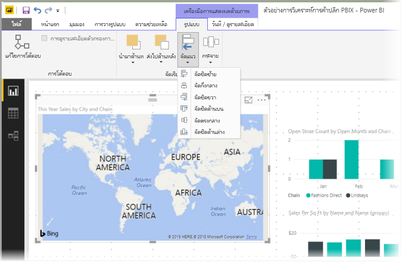

# ใช้เส้นตารางและจัดชิดกับเส้นตารางในรายงาน Power BI DesktopUse gridlines and snap-to-grid in Power BI Desktop reports
พื้นที่รายงาน **Power BI Desktop** แสดงเส้นตารางที่ช่วยให้คุณจัดแนววิชวลบนหน้ารายงานได้อย่างสวยงาม และยังมีฟังก์ชันจัดชิดเส้นตาราง ให้วิชวลในรายงานของคุณดูสะอาด, อยู่ในแนวเดียวกัน และระยะห่างเท่ากันThe **Power BI Desktop** report canvas provides gridlines that let you neatly align visuals on a report page and use snap-to-grid functionality so the visuals in your report look clean, aligned, and evenly spaced.

ใน **Power BI Desktop** คุณยังสามารถปรับลำดับแบบ Z (นำไปข้างหน้า, ย้ายไปข้างหลัง) ของวัตถุบนรายงาน และจัดแนว หรือกระจายวิชวลที่เลือกห่างให้เท่า ๆ กันบนพื้นที่ทำงานIn **Power BI Desktop**, you can also adjust the z-order (bring forward, send backward) of objects on a report and align or evenly distribute selected visuals on the canvas.

## การเปิดใช้งานเส้นตารางและจัดชิดกับเส้นตารางEnabling gridlines and snap-to-grid
เมื่อต้องการเปิดใช้งานเส้นตารางและจัดชิดกับเส้นตาราง เลือกแบบ **มุมมอง** Ribbon จากนั้นเปิดใช้กล่องกาเครื่องหมายสำหรับ **แสดงเส้นตาราง** และ **จัดชิดวัตถุกับเส้นตาราง**To enable gridlines and snap-to-grid, select the **View** ribbon, then enable the checkboxes for **Show gridlines** and **Snap objects to grid.** คุณสามารถเลือกหนึ่งหรือทั้งสองตัวเลือก ซึ่งทำงานอิสระจากกันYou can select one or both options; they operate independently.

> [!NOTE]
> ถ้า **การแสดงเส้นตาราง** และ **จัดชิดวัตถุกับเส้นตาราง** ถูกปิดใช้งาน ให้เชื่อมต่อกับแหล่งข้อมูลใด ๆ และพวกเขาจะถูกเปิดใช้งานIf **Show gridlines** and **Snap objects to grid** are disabled, connect to any data source and they become enabled.

## การใช้เส้นตารางUsing gridlines
เส้นตารางเป็นแนวที่คุณมองเห็นได้ เพื่อช่วยการจัดแนววิชวลของคุณGridlines are visible guides that help you align your visuals. เมื่อคุณพยายามพิจารณาว่า วิชวลสองวิชวล (หรือมากกว่า) อยู่ในแนวนอนหรือแนวตั้งเดียวกันหรือไม่ ใช้เส้นตารางเพื่อดูว่าเส้นขอบของวิชวลตรงกันหรือไม่When you're trying to determine whether two (or more) visuals are aligned horizontally or vertically, use the gridlines to determine whether their borders align.

ใช้ Ctrl+คลิก เพื่อเลือกมากกว่าหนึ่งวิชวลในแต่ละครั้ง ซึ่งจะแสดงเส้นขอบของวิชวลที่เลือกทั้งหมด และแสดงให้เห็นว่าวิชวลอยู่ในแนวเดียวกันหรือไม่Use Ctrl+Click to select more than one visual at a time, which displays all selected visuals' borders and shows whether the visuals are properly aligned.

### การใช้เส้นตารางภายในภาพUsing gridlines inside visuals
ใน Power BI ยังมีเส้นตารางภายในวิชวล ซึ่งแสดงเส้นบอกแนวสำหรับการเปรียบเทียบจุดข้อมูลและค่าต่าง ๆIn Power BI there are also gridlines inside visuals that provide visible guides for comparing data points and values. เริ่มต้นด้วยการวางจำหน่าย **Power BI Desktop** ในเดือน 2017 กันยายน ตอนนี้คุณสามารถจัดการเส้นตารางภายในภาพที่ใช้บัตร **แกน x** หรือ **แกน y**(ตามความเหมาะสมตามชนิดของภาพ) พบในส่วน **รูปแบบ** ของบานหน้าต่าง **การแสดงภาพ**Beginning with the September 2017 release of **Power BI Desktop**, you can now manage the gridlines within visuals using the **X-Axis** or **Y-Axis** card (as appropriate based on visual type), found in the **Format** section of the **Visualizations** pane. คุณสามารถจัดการองค์ประกอบของเส้นตารางภายในภาพต่อไปนี้:You can manage the following elements of gridlines within a visual:

* เปิดหรือปิดเส้นตารางTurn gridlines on or off
* เปลี่ยนสีของเส้นตารางChange the color of gridlines
* ปรับเส้นขีด (ความกว้าง) ของเส้นตารางAdjust the stroke (the width) of gridlines
* เลือกสไตล์เส้นของเส้นตารางในภาพ เช่น ทึบ เส้นประ หรือจุดSelect the line style of the gridlines in the visual, such as solid, dashed, or dotted

การปรับเปลี่ยนองค์ประกอบบางอย่างของเส้นตารางจะมีประโยชน์ในรายงานที่ใช้พื้นหลังสีเข้มสำหรับภาพModifying certain elements of gridlines can be especially useful in reports where dark backgrounds are used for visuals. รูปต่อไปนี้แสดงส่วน **เส้นตาราง** ในการ์ด **แกน Y**The following image shows the **Gridlines** section in the **Y-Axis** card.

## การใช้การจัดชิดกับเส้นตารางUsing snap-to-grid
เมื่อคุณเปิดใช้งาน **จัดชิดวัตถุกับเส้นตาราง** ภาพทั้งหมดบนพื้นที่ทำงาน **Power BI Desktop** ที่คุณย้าย (หรือปรับขนาด) จะถูกจัดชิดกับแกนเส้นตารางที่ใกล้ที่สุดโดยอัตโนมัติ ทำให้ง่ายยิ่งขึ้นในการทำให้แน่ใจว่าภาพสองภาพหรือมากกว่าจัดแนวในตำแหน่งหรือขนาดตามแนวนอนหรือแนวตั้งที่เหมือนกันWhen you enable **Snap objects to grid**, all visuals on the **Power BI Desktop** canvas that you move (or resize) are automatically aligned to the nearest grid axis, making it much easier to ensure two or more visuals align to the same horizontal or vertical location or size.

และนั่นคือทั้งหมดของการใช้ **เส้นตาราง** และ **จัดชิดกับเส้นตาราง** เพื่อให้แน่ใจว่าวิชวลในรายงานของคุณจัดแนวอย่างเรียบร้อยAnd, that's all there is to using **gridlines** and **snap-to-grid** to ensure the visuals in your reports are neatly aligned.

## การใช้ลำดับแบบ Z จัดแนว และกระจายUsing z-order, align, and distribute
คุณยังสามารถจัดการลำดับจากหน้าไปหลังของวิชวลในรายงาน ซึ่งมักเรียกว่า *ลำดับแบบ Z* ขององค์ประกอบYou can manage the front-to-back order of visuals in a report, often referred to as the *z-order* of elements. คุณลักษณะนี้ให้คุณสามารถทับซ้อนวิชวลในแบบใดก็ได้ที่คุณต้องการ จากนั้นปรับลำดับจากหน้าไปหลังของแต่ละวิชวลThis feature lets you overlap visuals in any way you want, then adjust the front-to-back order of each. คุณตั้งค่าลำดับของวิชวลคุณโดยใช้ปุ่ม **นำไปข้างหน้า** และ **ย้ายไปข้างหลัง** ที่พบในส่วน **จัดเรียง** ของ ribbon **รูปแบบ**You set the order of your visuals using the **Bring Forward** and **Send Backward** buttons, found in the **Arrange** section of **Format** ribbon. Ribbon **รูปแบบ** จะปรากฏขึ้นทันทีที่คุณเลือกหนึ่งหรือหลายวิชวลบนหน้าThe **Format** ribbon appears as soon as you select one or more visuals on the page.

Ribbon **รูปแบบ** ให้คุณสามารถจัดแนวภาพของคุณในวิธีต่าง ๆ ให้คุณแน่ใจว่าวิชวลของคุณปรากฏบนหน้า ที่จัดแนวได้สวยงามและทำงานได้ดีที่สุดThe **Format** ribbon lets you align your visuals in many different ways, which ensures your visuals appear on the page in the alignment that looks and works best.

ปุ่ม **จัดแนว** จัดแนววิชวลตามขอบ (หรือกึ่งกลาง) ของพื้นที่รายงาน ดังที่แสดงในรูปต่อไปนี้The **Align** button aligns a selected visual to the edge (or center) of the report canvas, as shown in the following image.

เมื่อเลือกวิชวลอย่างน้อยสองวิชวล วิชวลเหล่านั้นจะถูกจัดแนวพร้อมกัน และใช้ขอบเขตที่ถูกจัดแนวแล้วของวิชวลสำหรับการจัดแนวWhen two or more visuals are selected, they are aligned together and use the existing aligned boundary of the visuals for their alignment. ตัวอย่างเช่น ถ้าคุณเลือกสองวิชวล และเลือกตัวเลือก **จัดชิดซ้าย** วิชวลจะจัดชิดขอบซ้ายสุดของวิชวลที่เลือกทั้งหมดFor example, if you select two visuals and choose the **Align Left** option, the visuals then align to the left-most boundary of all selected visuals.

คุณยังสามารถกระจายภาพของคุณอย่างสม่ำเสมอทั่วพื้นที่รายงาน ไม่ว่าจะเป็นในแนวตั้งหรือแนวนอนYou can also distribute your visuals evenly across the report canvas, either vertically or horizontally. เพียงแค่ใช้ปุ่ม **กระจาย** จาก Ribbon **รูปแบบ**Just use the **Distribute** button from the **Format** ribbon.

ด้วยการเลือกสองสามรายการจากเส้นตาราง, การจัดแนว และเครื่องมือการกระจาย รายงานของคุณจะมีลักษณะตามที่คุณต้องการWith a few selections from these gridlines, alignment, and distribution tools, your reports will look just how you want them to.

