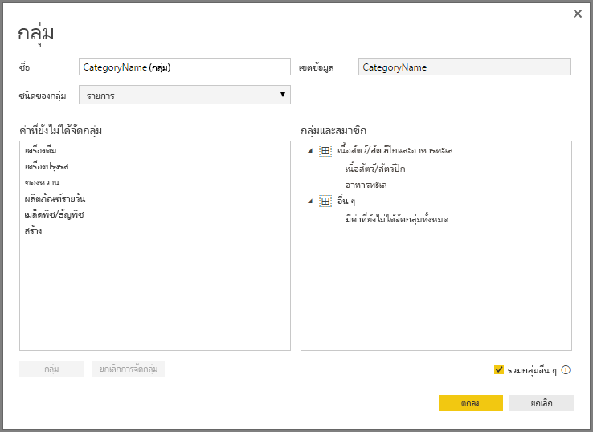

# ใช้การจัดกลุ่ม และจัดช่องเก็บใน Power BI DesktopUse grouping and binning in Power BI Desktop
เมื่อ Power BI Desktop สร้างวิชวล จะรวมข้อมูลของคุณให้เป็นส่วน (หรือกลุ่ม) โดยยึดตามค่าที่พบในข้อมูลเบื้องต้นWhen Power BI Desktop creates visuals, it aggregates your data into chunks (or groups) based on values found in the underlying data. ซึ่งปกติแล้วจะทำงานได้ดี แต่อาจมีบางครั้งเมื่อคุณต้องการปรับวิธีการจัดกลุ่มเหล่านั้นOften that's fine, but there may be times when you want to refine how those chunks are presented. ตัวอย่างเช่น คุณอาจต้องการวางผลิตภัณฑ์สามประเภทเข้าในประเภทที่ใหญ่ขึ้น (ในหนึ่ง *กลุ่ม*)For example, you might want to place three categories of products in one larger category (one *group*). หรือคุณอาจต้องการดูยอดขายตัวเลขในแท่งกราฟขนาด 1,000,000 ดอลลาร์แทนที่จะหารเป็นจำนวนเท่าๆ 923,983 ดอลลาร์Or, you might want to see sales figures put into bin-sizes of 1,000,000 dollars, instead of chunks of 923,983-dollar sizes.

ใน Power BI Desktop คุณสามารถ *จัดกลุ่ม* จุดข้อมูล เพื่อช่วยให้คุณเห็น วิเคราะห์ สำรวจข้อมูลและแนวโน้มในวิชวลของคุณได้ชัดเจนขึ้นIn Power BI Desktop, you can *group* data points to help you more clearly view, analyze, and explore data and trends in your visuals. คุณยังสามารถกำหนด *แท่งกราฟ* เพื่อใส่ค่าลงในกลุ่มที่มีขนาดเท่ากันที่ช่วยให้คุณไปยังข้อมูลแบบรูปภาพในวิธีที่สื่อความหมายได้ดียิ่งขึ้นYou can also define the *bin size* to put values into equally sized groups that better enable you to visualized data in ways that are meaningful. การดำเนินการนี้มักเรียกว่า *binning*This action is often called *binning*.

## ใช้งานการจัดกลุ่มUsing grouping
เพื่อใช้การจัดกลุ่ม เลือกองค์ประกอบอย่างน้อยสองอย่างบนวิชวล โดยใช้ Ctrl + คลิก เพื่อเลือกหลายองค์ประกอบTo use grouping, select two or more elements on a visual by using Ctrl+click to select multiple elements. จากนั้นคลิกขวาที่หนึ่งในองค์ประกอบการเลือกหลายส่วนและเลือก **กลุ่ม** จากเมนูบริบทThen right-click one of the multiple selection elements and choose **Group** from the context menu.

เมื่อสร้างกลุ่มขึ้นแล้ว กลุ่มจะถูกเพิ่มลงในบักเก็ต **คำอธิบายแผนภูมิ** สำหรับวิชวลOnce it's created, the group is added to the **Legend** bucket for the visual. กลุ่มจะยังปรากฏในรายการ **เขตข้อมูล** อีกด้วยThe group also appears in the **Fields** list.

เมื่อมีกลุ่มแล้ว คุณจะสามารถแก้ไขสมาชิกของกลุ่มดังกล่าวได้อย่างง่ายดายOnce you have a group, you can easily edit the members of that group. คลิกขวาที่เขตข้อมูลจากบักเก็ต **คำอธิบายแผนภูมิ** หรือจากรายการ **เขตข้อมูล** จากนั้นเลือก **แก้ไขกลุ่ม**Right-click the field from the **Legend** bucket or from the **Fields** list, and then choose **Edit Groups**.

ในกล่องโต้ตอบ **กลุ่ม** คุณสามารถสร้างกลุ่มใหม่หรือปรับเปลี่ยนกลุ่มที่มีอยู่ได้In the **Groups** dialog box, you can create new groups or modify existing groups. นอกจากนี ้คุณยังสามารถ *เปลี่ยนชื่อ* กลุ่มใด ๆ ได้You can also *rename* any group. เพียงคลิกสองครั้งที่ชื่อกลุ่มในกล่อง **กลุ่มและสมาชิก** จากนั้น ป้อนชื่อใหม่Just double-click the group title in the **Groups and members** box, and then enter a new name.

คุณสามารถทำหลากหลายอย่างได้ด้วยการจัดกลุ่มYou can do all sorts of things with groups. คุณสามารถเพิ่มรายการจากรายการ **ค่าที่ยังไม่ได้จัดกลุ่ม** ลงในกลุ่มใหม่ หรือลงในกลุ่มที่มีอยู่แล้วได้You can add items from the **Ungrouped values** list into a new group or into one of the existing groups. เมื่อต้องการสร้างกลุ่มใหม่ เลือกอย่างน้อยสองหน่วยข้อมูล (ใช้ Ctrl + คลิก) จากกล่อง **ค่าที่ยังไม่ได้จัดกลุ่ม** และจากนั้นเลือกปุ่ม **กลุ่ม** ด้านล่างกล่องนั้นTo create a new group, select two or more items (using Ctrl+click) from the **Ungrouped values** box, and then select the **Group** button below that box.

คุณสามารถเพิ่มค่าที่ยังไม่ได้จัดกลุ่มลงในกลุ่มที่มีอยู่: เพียงแค่เลือก **ค่าที่ยังไม่ได้จัดกลุ่ม** จากนั้นเลือกกลุ่มที่มีอยู่ที่คุณต้องการเพิ่มค่า แล้วเลือกปุ่ม **กลุ่ม**You can add an ungrouped value into an existing group: just select the one of the **Ungrouped values**, then select the existing group to add the value to, and select the **Group** button. เมื่อต้องการนำหน่วยข้อมูลออกจากกลุ่ม เลือกจากกล่อง **กลุ่มและสมาชิก** และจากนั้น เลือก **ยกเลิกการจัดกลุ่ม**To remove an item from a group, select it from the **Groups and members** box, and then select **Ungroup**. นอกจากนี้ คุณยังสามารถย้ายหมวดหมู่ที่ยังไม่ได้จัดกลุ่มไปยังกลุ่ม **อื่นๆ** หรือปล่อยไว้โดยไม่จัดกลุ่มเช่นเดิมก็ได้You can also move ungrouped categories into the **Other** group or leave them ungrouped.

> [!NOTE]
> คุณสามารถสร้างกลุ่มสำหรับเขตข้อมูลใด ๆ ใน **เขตข้อมูล** โดยไม่จำเป็นต้องเลือกหน่วยข้อมูลหลายรายการจากวิชวลที่มีอยู่You can create groups for any field in the **Fields** well, without having to select multiple items from an existing visual. เพียงคลิกขวาที่เขตข้อมูล และเลือก **กลุ่มใหม่** จากเมนูที่ปรากฏขึ้นJust right-click the field, and select **New Group** from the menu that appears.

## ใช้งานการจัดช่องเก็บUsing binning
คุณสามารถตั้งค่าขนาดช่องเก็บสำหรับเขตข้อมูลตัวเลข และเวลาใน **Power BI Desktop** ได้You can set the bin size for numerical and time fields in **Power BI Desktop.** คุณสามารถใช้การจัดช่องเก็บ (Binning) เพื่อให้ Power BI Desktop แสดงข้อมูลด้วยขนาดที่ถูกต้องYou can use binning to right-size the data that Power BI Desktop displays.

เมื่อต้องการปรับใช้ขนาดช่องเก็บ คลิกขวาที่ **เขตข้อมูล** และเลือก **กลุ่มใหม่**To apply a bin size, right-click a **Field** and choose **New Group**.

จากกล่องโต้ตอบ **กลุ่ม** แสดง **ขนาดช่องเก็บ** เป็นขนาดที่คุณต้องการFrom the **Groups** dialog box, set the **Bin size** to the size you want.

เมื่อคุณเลือก **ตกลง** คุณจะสังเกตเห็นว่า เขตข้อมูลใหม่ปรากฏในบานหน้าต่าง **เขตข้อมูล** ที่มี **(ช่องเก็บ)** ต่อท้ายWhen you select **OK**, you'll notice that a new field appears in the **Fields** pane with **(bins)** appended. คุณยังสามารถลากเขตข้อมูลนั้นลงบนพื้นที่ทำงานเพื่อใช้ขนาดช่องเก็บนั้นในวิชวลYou can then drag that field onto the canvas to use the bin size in a visual.

ถ้าต้องการดูสาธิต *การจัดช่องเก็บ* โปรดดูที [วิดีโอ](https://www.youtube.com/watch?v=BRvdZSfO0DY)นี้To see *binning* in action, take a look at this [video](https://www.youtube.com/watch?v=BRvdZSfO0DY).

และนั่นคือทั้งหมดเกี่ยวกับ *การจัดกลุ่ม* และ *การจัดช่องเก็บ* เพื่อให้แน่ใจว่า วิชวลในรายงานของคุณแสดงข้อมูลในแบบที่คุณต้องการAnd that's all there is to using *grouping* and *binning* to ensure the visuals in your reports show your data just the way you want them to.
