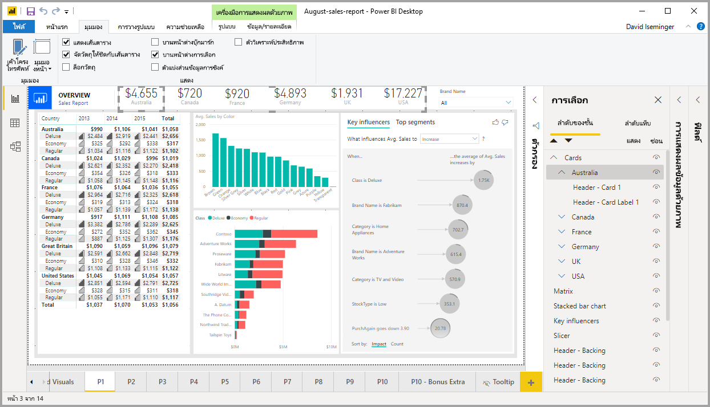
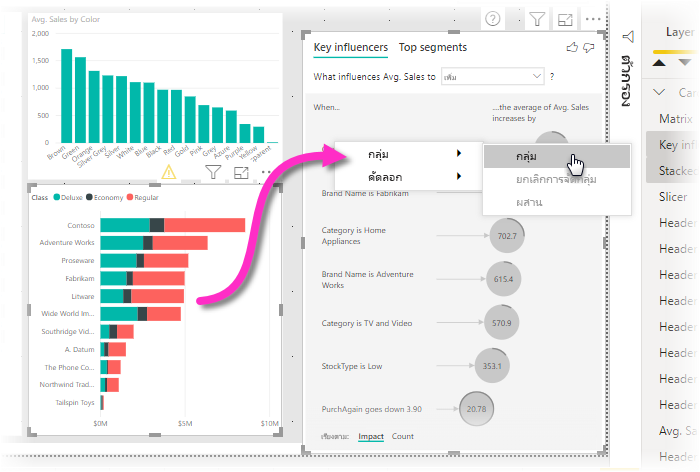
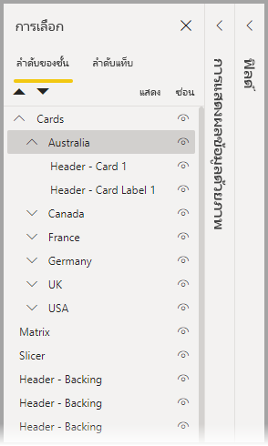
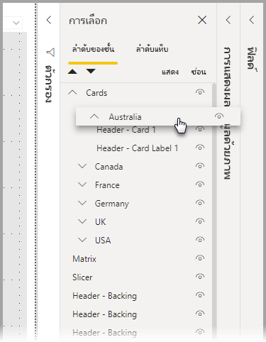
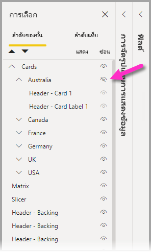
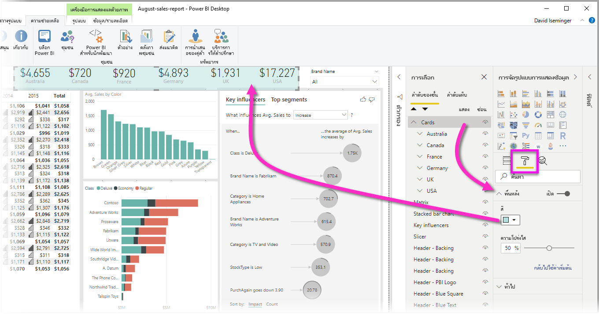

# จัดกลุ่มวิชวลในรายงาน Power BI DesktopGroup visuals in Power BI Desktop reports
ด้วยคุณลักษณะ **การจัดกลุ่ม** ใน **Power BI Desktop** คุณสามารถจัดกลุ่มวิชวลเข้าด้วยกันในรายงานของคุณได้ เช่น ปุ่ม กล่องข้อความ ภาพรูปทรง และวิชวลที่คุณสร้างเช่นเดียวกับที่คุณจัดกลุ่มรายการใน PowerPointWith **grouping** in **Power BI Desktop**, you can group visuals together in your report, such as buttons, textboxes, shapes images, and any visual you create, just like you group items in PowerPoint. การจัดกลุ่มวิชวลในรายงานช่วยให้คุณปฏิบัติต่อกลุ่มเช่นเดียวกับวัตถุเดี่ยว ทำให้เคลื่อนไหว ปรับขนาด และทำงานกับเลเยอร์ในรายงานของคุณได้ง่ายขึ้นเร็วขึ้น และทันใจขึ้นGrouping visuals in a report lets you treat the group like a single object, making moving, resizing, and working with layers in your report easier, faster, and more intuitive.

## การสร้างกลุ่มCreating groups

หากต้องการสร้างกลุ่มของวิชวลใน Power BI Desktop ให้เลือกวิชวลแรกจากพื้นที่ทำงาน จากนั้นกดปุ่ม CTRL ค้างไว้ คลิกวิชวลตั้งแต่หนึ่งภาพขึ้นไปซึ่งเป็นวิชวลที่คุณต้องการให้อยู่ในกลุ่ม จากนั้นคลิกขวาที่ชุดของวิชวล และเลือก **กลุ่ม** จากเมนูที่ปรากฏขึ้นTo create a group of visuals in Power BI Desktop, select the first visual from the canvas, then holding the CTRL button, click one or more additional visuals that you want in the group, then right-click the collection of visuals and select **Group** from the menu that appears.

กลุ่มจะแสดงในบานหน้าต่าง **การเลือก**Groups are displayed in the **Selection** pane. คุณสามารถมีกลุ่มของวิชวลจำนวนมากตามที่รายงานของคุณต้องการ และคุณยังสามารถซ้อนกลุ่มของวิชวลได้You can have as many groups of visuals as your report needs, and you can also nest groups of visuals. ในรูปภาพต่อไปนี้ กลุ่ม *ออสเตรเลีย* ซ้อนอยู่ในกลุ่ม *การ์ด*In the following image, the *Australia* group is nested under the *Cards* group. คุณสามารถขยายกลุ่มโดยเลือกสัญลักษณ์ ^ ข้างชื่อกลุ่มและยุบโดยเลือกสัญลักษณ์ ^ อีกครั้งYou can expand a group by selecting the caret beside the group name, and collapse it by selecting the caret again. 

ภายในบานหน้าต่าง **การเลือก** คุณยังสามารถลากและปล่อยแต่ละวิชวลเพื่อรวมไว้ในกลุ่ม ลบออกจากกลุ่ม ซ้อนกลุ่ม หรือลบกลุ่มหรือแต่ละวิชวลออกจากการซ้อนกันได้Within the **Selection** pane, you can also drag and drop individual visuals to include them in a group, remove them from a group, nest a group, or remove a group or individual visual from a nest. เพียงแค่ลากวิชวลที่คุณต้องการปรับและวางลงในตำแหน่งที่คุณต้องการSimply drag the visual you want to adjust, and place it where you want. หากมีการซ้อนทับ การสร้างเลเยอร์ของวิชวลจะถูกกำหนดโดยคำสั่งของพวกเขาในรายการ *ลำดับเลเยอร์*Layering of visuals, if there is overlap, is determined by their order in the *Layer order* list.

การเปลี่ยนชื่อกลุ่มเป็นเรื่องง่าย: เพียงแค่ดับเบิลคลิกที่ชื่อกลุ่มในบานหน้าต่าง **การเลือก** จากนั้นจึงพิมพ์ชื่อใหม่ของกลุ่มของคุณRenaming a group is easy: just double-click the group name in the **Selection** pane, and then type in the new name of your group.

เมื่อต้องการยกเลิกการจัดกลุ่ม ให้คลิกขวาแล้วเลือก **ยกเลิกการจัดกลุ่ม** จากเมนูที่ปรากฏขึ้นTo ungroup just select the group, right-click and select **ungroup** from the menu that appears.

## ซ่อนและแสดงวิชวลหรือกลุ่มHide and show visuals or groups

คุณสามารถซ่อนหรือแสดงกลุ่มได้อย่างง่ายดายโดยใช้บานหน้าต่าง **การเลือก**You can easily hide or show groups using the **Selection** pane. หากต้องการซ่อนกลุ่ม ให้เลือกปุ่มดวงตาด้านข้างชื่อกลุ่ม (หรือวิชวลแต่ละรายการ) เพื่อสลับว่าจะซ่อนหรือแสดงภาพหรือกลุ่มTo hide a group, select the eye button beside the group name (or any individual visual) to toggle whether the visual or group is hidden or displayed. ในรูปภาพต่อไปนี้ กลุ่ม *ออสเตรเลีย* ถูกซ่อนและส่วนที่เหลือของกลุ่มที่ซ้อนกันในกลุ่ม *การ์ด* จะปรากฏขึ้นIn the following image, the *Australia* group is hidden, and the rest of the groups nested in the *Cards* group are displayed.

เมื่อคุณซ่อนกลุ่ม วิชวลทั้งหมดภายในกลุ่มนั้นจะถูกซ่อนโดยปุ่มดวงตาของพวกเขาจะเป็นสีเทา (ไม่สามารถเปิดหรือปิดการสลับได้เนื่องจากกลุ่มทั้งหมดถูกซ่อนอยู่)When you hide a group, all visuals within that group are hidden, indicated by their eye button being grayed out (unavailable to toggle on or off, because the entire group is hidden). หากต้องการซ่อนเฉพาะวิชวลบางอันภายในกลุ่ม เพียงสลับปุ่มดวงตาที่อยู่ข้างวิชวล และเฉพาะวิชวลนั้นในกลุ่มที่จะถูกซ่อนTo hide only certain visuals within a group, simply toggle the eye button beside that visual, and only that visual in the group is hidden.

## การเลือกวิชวลภายในกลุ่มSelecting visuals within a group

มีสองสามวิธีในการนำทางและเลือกรายการภายในกลุ่มของวิชวลThere are a few ways to navigate and select items within a group of visuals. รายการต่อไปนี้อธิบายลักษณะการทำงาน:The following list describes the behavior:

* การคลิกที่พื้นที่ว่างภายในกลุ่ม (เช่น ช่องว่างระหว่างวิชวล) ซึ่งจะเป็นการไม่เลือกอะไรเลยClicking on empty space within a group (such as white space between visuals) does not select anything
* การคลิกที่วิชวลภายในกลุ่มเลือกทั้งกลุ่ม คลิกครั้งที่สอง ซึ่งจะเป็นการเลือกวิชวลแต่ละรายการClicking a visual within a group selects the entire group, a second click selects the individual visual
* การเลือกกลุ่ม และจากนั้นวัตถุอื่นบนพื้นที่รายงาน จากนั้นเลือก **กลุ่ม** จากเมนูคลิกขวา ซึ่งจะเป็นการสร้างกลุ่มแบบซ้อนกันSelecting a group, and then another object on the report canvas, then selecting **Group** from the right-click menu creates a nested group
* การเลือกสองกลุ่ม จากนั้นคลิกขวา ซึ่งจะเป็นการแสดงตัวเลือกเพื่อผสานกลุ่มที่เลือก แทนที่จะทำการซ้อนSelecting two groups, then right-clicking displays an option to merge the selected groups, rather than nesting them

## ใช้สีพื้นหลังApply background color

นอกจากนี้คุณยังสามารถใช้สีพื้นหลังกับกลุ่มได้ด้วยการใช้ส่วน **การจัดรูปแบบ** ของบานหน้าต่าง **การแสดงข้อมูลด้วยภาพ** ดังที่ปรากฏในรูปต่อไปนี้You can also apply a background color to a group using the **Formatting** section of the **Visualizations** pane, as shown in the following image. 

เมื่อคุณใช้สีพื้นหลังแล้ว ให้คลิกที่ช่องว่างระหว่างวิชวลในกลุ่ม ซึ่งจะเป็นการเลือกกลุ่ม (เปรียบเทียบสิ่งนี้กับการคลิกที่ช่องว่างระหว่างภาพในกลุ่ม ซึ่งจะเป็นการไม่เลือกอะไรเลย)Once you apply a background color, clicking on the space between visuals in the group selects the group (compare this to clicking on the white space between visuals in a group, which does not select the group). 

## ขั้นตอนถัดไปNext steps
สำหรับข้อมูลเพิ่มเติมเกี่ยวกับการจัดกลุ่ม โปรดดูที่วิดีโอต่อไปนี้:For more information about grouping, take a look at the following video:

* [การจัดกลุ่มใน Power BI Desktop - วิดีโอGrouping in Power BI Desktop - video](https://youtu.be/sf4n7VXoQHY?t=10)

คุณอาจสนใจบทความต่อไปนี้:You might also be interested in the following articles:

* [ใช้ตัวเจาะเข้าถึงรายละเอียดข้ามรายงานใน Power BI DesktopUse cross-report drillthrough in Power BI Desktop](desktop-cross-report-drill-through.md)
* [การใช้ตัวแบ่งส่วนข้อมูล Power BI DesktopUsing slicers Power BI Desktop](../visuals/power-bi-visualization-slicers.md)
